# Angular 5, ASP.NET Core CRUD For Inventory Management Using EF And WEB API
## Requires
- Visual Studio 2017
## License
- MIT
## Technologies
- Web API
- Angular
- ASP.NET Core
- Angular5
## Topics
- Web API
- ASP.NET Core
- Angular5
## Updated
- 12/14/2017
## Description

<h1>Introduction</h1>

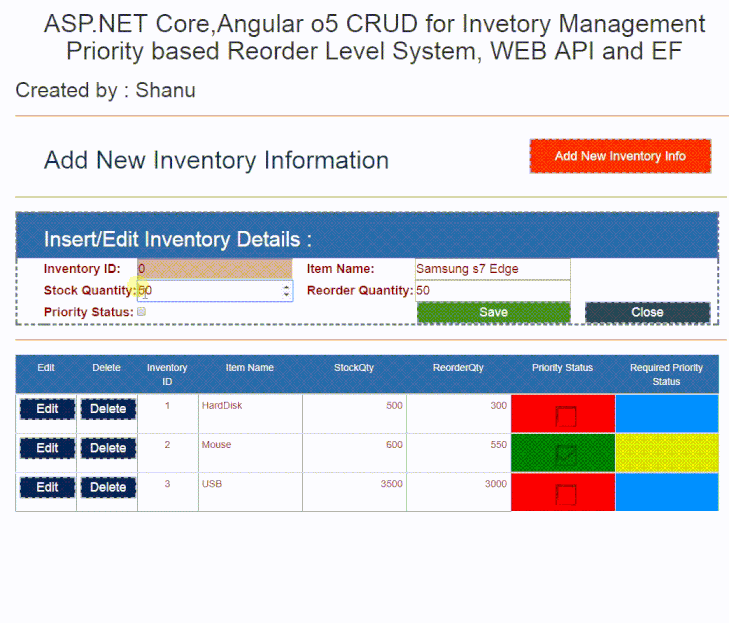

If you are new to Angular 5 and ASP.NET Core, then kindly read our&nbsp;<a href="https://code.msdn.microsoft.com/Getting-started-with-26e269c7" target="_blank">previous article</a>.

In our previous article, We have explained how to get started with Angular 5 and ASP.NET Core. Now, in this article, let's see in depth how to work with WEB API, EF for performing a CRUD operation for Angular 5 and ASP.NET Core application.

For performing CRUD operation here, We have taken the concept as Inventory Management priority based Reorder level system.

<em> 
</em>

<h1>Building the Sample</h1>
<h1 style="font-size:14px; margin:1em 0px; line-height:1.5; color:#212121; font-family:&quot;open sans&quot;,sans-serif">
<strong>Inventory management and Reorder Level</strong></h1>

Inventory management is very important to maintain and manage the stocks in small shops or in a big warehouse. For example, let&rsquo;s consider a small shop where they sell items like Tooth Paste, Soap, Shampoo, etc. For all the items in the shop, they will
 make a list with the item name and they will add the total available stock quantity for each item, Total Sales quantity per item and Total Quantity received to be added in the stock. If the items are small in number, it will be easy to find the items needed
 to be purchased again to maintain the stock quantity, consider if it&rsquo;s a big factory and needs to maintain all the stock quantity. Using Inventory Management software, the end user can easily track Inventory items, Total available Stock Quantity, Total
 Arrived and Issued Stock Quantity, Reorder Level for each item, Reorder Date for each Item and priority based reorder for the items which need to be stocked immediately.

<h2 style="font-size:14px; margin:1em 0px; line-height:1.5; color:#212121; font-family:&quot;open sans&quot;,sans-serif">
<strong>Reorder Level</strong></h2>

In Inventory Management Reorder Level or Point is an important part which will be used to indicate the customer as this item Stock is going to be finished and need to be purchased or produced for sales or delivered to the end user.

Inventory Management has many processes to be taken care of to maintain the software. In this article, we will make a simple project to display the web based Monitoring system for indicating the priority based Inventory Management Reorder System.

For Reorder Level there has to be some formula for displaying the indicator on each item which needs to be stocked. In our simple project, We have used the type of Priority based indication to the customer as manual and automatic.

Note: In Inventory Management we will be having Item Master table, Item Detail Table, Inventory tables and etc. For this simple project, We have used only one table as Inventory table and added the Item Name directly with Stock Qty, Reorder Qty and Priority
 Status, Using the Priority status user can add or edit the priority for each item which needs to be stocked immediately. Here priority Status is to manually add or edit the priority for each item which needs to be stocked.

<h2 style="font-size:14px; margin:1em 0px; line-height:1.5; color:#212121; font-family:&quot;open sans&quot;,sans-serif">
<strong>Manual Priority setting for Reorder Level</strong></h2>

When customer adds /edits each Inventory item they can set manually priority for reordering the stock. If you ask me what this means, Consider a case where we have 1000 stock in Samsung S7 Edge Item and let's consider this stock can be used for two months.
 But there is a high demand for the Samsung S7 Edge phone and the price will be increased after a week and now we need to immediately increase the stock quantity .We have many branches around the world by editing the stock priority all our branches can view
 this from our web application and add the stock to the priority item; or let&rsquo;s consider one more example as we have 1000 quantity stock and our customer makes a phone call and asks us to deliver 5000 stock quantity within a couple of days, in this case
 the manual priority will be more useful. Like this, in many scenarios it's good to have a manual priority for maintaining each item stock. This is a simple demo project so we didn&rsquo;t add many field examples. We can also add the field like reorder date
 until we need to increase the stock quantity and notes for priority etc.

Now let&rsquo;s add a new Item to our Inventory and click Save. Here we didn&rsquo;t check the Priority Status while adding new Item, which means this item has good stock Quantity and it's not required for now to add more stock quantity.

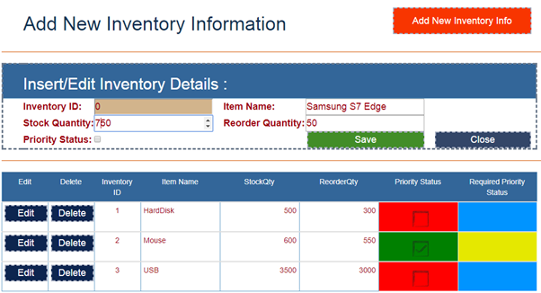

We can see as the Priority Status Column with red and green color with Checked and un checked boxes. When we add or edit the item if we have checked the Priority Status and saved then the item column will be displayed in green along with checkbox image. If
 the Item is not saved with priority status then it displays with red color. Here we used the green color to indicate the customer as this item has high priority and stock item needs to be increased with new Reorder Qty.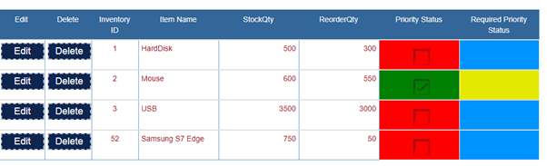

Now let&rsquo;s edit the item and set the item with priority status.

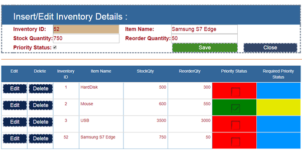

When we save the same item with Priority Status checked, we can see the indicator with Green Color along with Checked image.

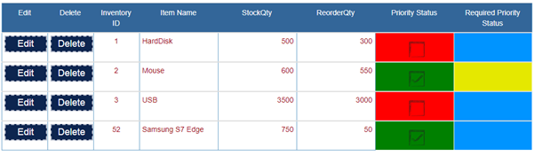

<h2 style="font-size:14px; margin:1em 0px; line-height:1.5; color:#212121; font-family:&quot;open sans&quot;,sans-serif">
<strong>Automatic Priority Status for Reorder Level</strong></h2>

As we already told you, for reorder level we will be using the formula to indicate the customer for increasing the stock quantity with new reorder quantities.

Here we can see the Required Priority Status Column with Sky Blue and Light Green Color. Light Blue color indicates the Item is not needed for reorder and the Green color indicates the Item needs to be reordered.

For the automatic display we have set the formula as if StockQty&gt;ReorderQty&#43;50 then set the Required Priority Status as Light Blue Color which indicates the customer as the item is not needed for reorder and the if StockQty&lt;=ReorderQty&#43;50 then set the
 Required Priority Status as Light Green Color which indicates the customer as the item needed for immediate stock maintenance.

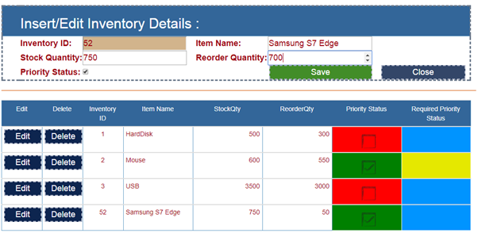

From the above image for the newly added Samsung S7 Edge Item Stock Qty is 750 and Reorder Qty is 50 so the Required Priority Status is displayed as blue color.

Now let&rsquo;s edit the item like below and set the Reorder Quantity as 700 and save to check the changes.

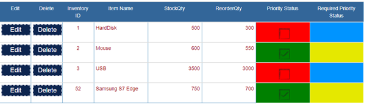

Here now we can see the Required Priority Status color has been automatically changed as the Stock Qty is 750 and the Reorder Qty is 700.

Now let's see how to create this web application using Angular5,ASP.NET Core using EF and Web API.

<h1 style="font-size:14px; margin:1em 0px; line-height:1.5; color:#212121; font-family:&quot;open sans&quot;,sans-serif">
<strong>Prerequisites</strong></h1>

Make sure you have installed all the prerequisites in your computer. If not, then download and install all, one by one.

<ol style="color:#212121; font-family:&quot;open sans&quot;,sans-serif; font-size:14px">
<li>First, download and install Visual Studio 2017 from this&nbsp;<a href="https://www.visualstudio.com/" target="_blank" style="color:#1e88e5">link</a>.
</li><li><a href="https://www.microsoft.com/net/download/windows" target="_blank" style="color:#1e88e5">Download</a>&nbsp;and install .NET Core 2.0
</li><li>Download and install Node.js v9.0 or above. I have installed V9.1.0 (Download&nbsp;<a href="https://nodejs.org/en/" target="_blank" style="color:#1e88e5">link</a>).
</li></ol>

Description

Now, it&rsquo;s time to create our first Angular5 and ASP.NET Core application.

<h1 style="font-size:14px; margin:1em 0px; line-height:1.5; color:#212121; font-family:&quot;open sans&quot;,sans-serif">
<strong>Step 1 -&nbsp;Create a database and a table</strong></h1>

We will be using our SQL Server database for our WEB API and EF. First, we create a database named InventoryPDB and a table as InventoryMaster. Here is the SQL script to create a database table and sample record insert query in our table. Run the query given
 below in your local SQL Server to create a database and a table to be used in our project.

&nbsp;

SQL

Edit|Remove

mysql
<pre class="hidden">USE MASTER     
GO     
     
-- 1) Check for the Database Exists .If the database is exist then drop and create new DB     
IF EXISTS (SELECT [name] FROM sys.databases WHERE [name] = 'InventoryPDB' )     
DROP DATABASE InventoryPDB     
GO     
     
CREATE DATABASE InventoryPDB     
GO     
     
USE InventoryPDB     
GO     
     
     
-- 1) //////////// StudentMasters     
     
IF EXISTS ( SELECT [name] FROM sys.tables WHERE [name] = 'InventoryMaster' )     
DROP TABLE InventoryMaster     
GO     
     
CREATE TABLE [dbo].[InventoryMaster](     
        [InventoryID] INT IDENTITY PRIMARY KEY,     
        [ItemName] [varchar](100) NOT NULL,        
        [StockQty]  int NOT NULL,        
        [ReorderQty] int NOT NULL,        
        [PriorityStatus] int NOT NULL     -- 0 for low and 1 for High 
)     
     
-- insert sample data to Student Master table     
INSERT INTO [InventoryMaster]   ([ItemName],[StockQty],[ReorderQty],[PriorityStatus])     
     VALUES ('HardDisk',500,300,0)     
     
INSERT INTO [InventoryMaster]   ([ItemName],[StockQty],[ReorderQty],[PriorityStatus])     
     VALUES ('Mouse',600,550,1)  

	 INSERT INTO [InventoryMaster]   ([ItemName],[StockQty],[ReorderQty],[PriorityStatus])     
     VALUES ('USB',3500,3000,0)  
          
          
     select * from InventoryMaster  
</pre>

<pre class="js">USE&nbsp;MASTER&nbsp;&nbsp;&nbsp;&nbsp;&nbsp;&nbsp;
GO&nbsp;&nbsp;&nbsp;&nbsp;&nbsp;&nbsp;
&nbsp;&nbsp;&nbsp;&nbsp;&nbsp;&nbsp;
--&nbsp;1)&nbsp;Check&nbsp;for&nbsp;the&nbsp;Database&nbsp;Exists&nbsp;.If&nbsp;the&nbsp;database&nbsp;is&nbsp;exist&nbsp;then&nbsp;drop&nbsp;and&nbsp;create&nbsp;new&nbsp;DB&nbsp;&nbsp;&nbsp;&nbsp;&nbsp;&nbsp;
IF&nbsp;EXISTS&nbsp;(SELECT&nbsp;[name]&nbsp;FROM&nbsp;sys.databases&nbsp;WHERE&nbsp;[name]&nbsp;=&nbsp;'InventoryPDB'&nbsp;)&nbsp;&nbsp;&nbsp;&nbsp;&nbsp;&nbsp;
DROP&nbsp;DATABASE&nbsp;InventoryPDB&nbsp;&nbsp;&nbsp;&nbsp;&nbsp;&nbsp;
GO&nbsp;&nbsp;&nbsp;&nbsp;&nbsp;&nbsp;
&nbsp;&nbsp;&nbsp;&nbsp;&nbsp;&nbsp;
CREATE&nbsp;DATABASE&nbsp;InventoryPDB&nbsp;&nbsp;&nbsp;&nbsp;&nbsp;&nbsp;
GO&nbsp;&nbsp;&nbsp;&nbsp;&nbsp;&nbsp;
&nbsp;&nbsp;&nbsp;&nbsp;&nbsp;&nbsp;
USE&nbsp;InventoryPDB&nbsp;&nbsp;&nbsp;&nbsp;&nbsp;&nbsp;
GO&nbsp;&nbsp;&nbsp;&nbsp;&nbsp;&nbsp;
&nbsp;&nbsp;&nbsp;&nbsp;&nbsp;&nbsp;
&nbsp;&nbsp;&nbsp;&nbsp;&nbsp;&nbsp;
--&nbsp;1)&nbsp;////////////&nbsp;StudentMasters&nbsp;&nbsp;&nbsp;&nbsp;&nbsp;&nbsp;
&nbsp;&nbsp;&nbsp;&nbsp;&nbsp;&nbsp;
IF&nbsp;EXISTS&nbsp;(&nbsp;SELECT&nbsp;[name]&nbsp;FROM&nbsp;sys.tables&nbsp;WHERE&nbsp;[name]&nbsp;=&nbsp;'InventoryMaster'&nbsp;)&nbsp;&nbsp;&nbsp;&nbsp;&nbsp;&nbsp;
DROP&nbsp;TABLE&nbsp;InventoryMaster&nbsp;&nbsp;&nbsp;&nbsp;&nbsp;&nbsp;
GO&nbsp;&nbsp;&nbsp;&nbsp;&nbsp;&nbsp;
&nbsp;&nbsp;&nbsp;&nbsp;&nbsp;&nbsp;
CREATE&nbsp;TABLE&nbsp;[dbo].[InventoryMaster](&nbsp;&nbsp;&nbsp;&nbsp;&nbsp;&nbsp;
&nbsp;&nbsp;&nbsp;&nbsp;&nbsp;&nbsp;&nbsp;&nbsp;[InventoryID]&nbsp;INT&nbsp;IDENTITY&nbsp;PRIMARY&nbsp;KEY,&nbsp;&nbsp;&nbsp;&nbsp;&nbsp;&nbsp;
&nbsp;&nbsp;&nbsp;&nbsp;&nbsp;&nbsp;&nbsp;&nbsp;[ItemName]&nbsp;[varchar](100)&nbsp;NOT&nbsp;NULL,&nbsp;&nbsp;&nbsp;&nbsp;&nbsp;&nbsp;&nbsp;&nbsp;&nbsp;
&nbsp;&nbsp;&nbsp;&nbsp;&nbsp;&nbsp;&nbsp;&nbsp;[StockQty]&nbsp;&nbsp;int&nbsp;NOT&nbsp;NULL,&nbsp;&nbsp;&nbsp;&nbsp;&nbsp;&nbsp;&nbsp;&nbsp;&nbsp;
&nbsp;&nbsp;&nbsp;&nbsp;&nbsp;&nbsp;&nbsp;&nbsp;[ReorderQty]&nbsp;int&nbsp;NOT&nbsp;NULL,&nbsp;&nbsp;&nbsp;&nbsp;&nbsp;&nbsp;&nbsp;&nbsp;&nbsp;
&nbsp;&nbsp;&nbsp;&nbsp;&nbsp;&nbsp;&nbsp;&nbsp;[PriorityStatus]&nbsp;int&nbsp;NOT&nbsp;NULL&nbsp;&nbsp;&nbsp;&nbsp;&nbsp;--&nbsp;0&nbsp;for&nbsp;low&nbsp;and&nbsp;1&nbsp;for&nbsp;High&nbsp;&nbsp;
)&nbsp;&nbsp;&nbsp;&nbsp;&nbsp;&nbsp;
&nbsp;&nbsp;&nbsp;&nbsp;&nbsp;&nbsp;
--&nbsp;insert&nbsp;sample&nbsp;data&nbsp;to&nbsp;Student&nbsp;Master&nbsp;table&nbsp;&nbsp;&nbsp;&nbsp;&nbsp;&nbsp;
INSERT&nbsp;INTO&nbsp;[InventoryMaster]&nbsp;&nbsp;&nbsp;([ItemName],[StockQty],[ReorderQty],[PriorityStatus])&nbsp;&nbsp;&nbsp;&nbsp;&nbsp;&nbsp;
&nbsp;&nbsp;&nbsp;&nbsp;&nbsp;VALUES&nbsp;('HardDisk',500,300,0)&nbsp;&nbsp;&nbsp;&nbsp;&nbsp;&nbsp;
&nbsp;&nbsp;&nbsp;&nbsp;&nbsp;&nbsp;
INSERT&nbsp;INTO&nbsp;[InventoryMaster]&nbsp;&nbsp;&nbsp;([ItemName],[StockQty],[ReorderQty],[PriorityStatus])&nbsp;&nbsp;&nbsp;&nbsp;&nbsp;&nbsp;
&nbsp;&nbsp;&nbsp;&nbsp;&nbsp;VALUES&nbsp;('Mouse',600,550,1)&nbsp;&nbsp;&nbsp;
&nbsp;
&nbsp;&nbsp;&nbsp;&nbsp;&nbsp;INSERT&nbsp;INTO&nbsp;[InventoryMaster]&nbsp;&nbsp;&nbsp;([ItemName],[StockQty],[ReorderQty],[PriorityStatus])&nbsp;&nbsp;&nbsp;&nbsp;&nbsp;&nbsp;
&nbsp;&nbsp;&nbsp;&nbsp;&nbsp;VALUES&nbsp;('USB',3500,3000,0)&nbsp;&nbsp;&nbsp;
&nbsp;&nbsp;&nbsp;&nbsp;&nbsp;&nbsp;&nbsp;&nbsp;&nbsp;&nbsp;&nbsp;
&nbsp;&nbsp;&nbsp;&nbsp;&nbsp;&nbsp;&nbsp;&nbsp;&nbsp;&nbsp;&nbsp;
&nbsp;&nbsp;&nbsp;&nbsp;&nbsp;select&nbsp;*&nbsp;from&nbsp;InventoryMaster&nbsp;&nbsp;&nbsp;
</pre>

<h1 class="endscriptcode">&nbsp;<strong style="color:#212121; font-family:&quot;open sans&quot;,sans-serif; font-size:14px">Step 2- Create&nbsp;</strong><strong style="color:#212121; font-family:&quot;open sans&quot;,sans-serif; font-size:14px">Angular5TemplateCore</strong></h1>

After installing all the prerequisites listed above and Angular5TemplateCore, click Start &gt;&gt; Programs &gt;&gt; Visual Studio 2017 &gt;&gt; Visual
 Studio 2017, on your desktop.

&nbsp;

Click New &gt;&gt; Project. Select Visual C# &gt;&gt; Select Angular5Core2. Enter your project name and click OK.

Once our project is created we can see in solution explorer with Angular5 sample components, html and app in ClientApp Folder along with Asp.NET Core Controllers and view folder.

 

Here this files and folders are very similar to our ASP.NET Core Template Pack for Angular2.

&nbsp;<strong style="font-size:1.5em">Package.json File</strong>

If we open the package.Json file we can see all the dependencies needed for Angular5 and Angular cli has been already added by default.&nbsp;&nbsp;

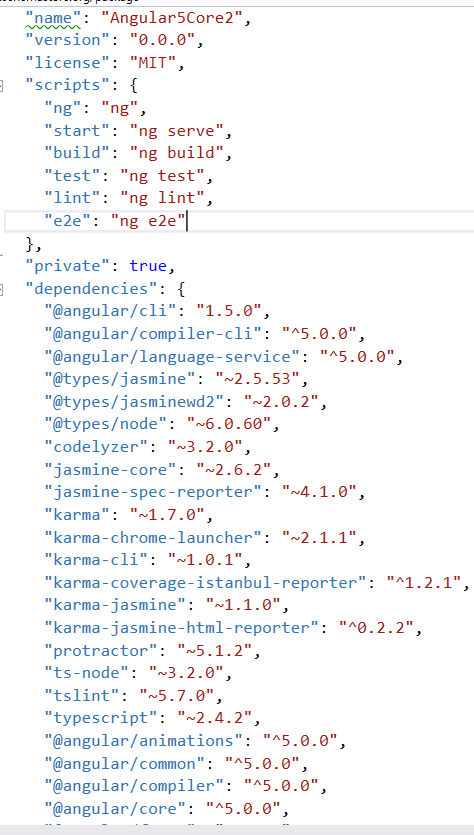

<h2 style="font-size:14px; margin:1em 0px; line-height:1.5; color:#212121; font-family:&quot;open sans&quot;,sans-serif">
<strong>Adding Webpack in Package.json</strong></h2>

In order to run our Angular5 Application we need to install webpack in our application. If the wepack is by default not added in our package.json file then we need to add it manually.Webpack is an open-source JavaScript module bundler. Webpack takes modules
 with dependencies and generates static assets representing those modules.to know more about Webpack click&nbsp;<a href="https://webpack.github.io/docs/what-is-webpack.html" target="_blank" style="color:#0000ff">here</a>.

Open our package.json file and add the below line under scripts

&nbsp;

JavaScript

Edit|Remove

js
<pre class="hidden">&quot;postinstall&quot;: &quot;webpack --config webpack.config.vendor.js&quot;</pre>

<pre class="js">&quot;postinstall&quot;:&nbsp;&quot;webpack&nbsp;--config&nbsp;webpack.config.vendor.js&quot;</pre>

&nbsp;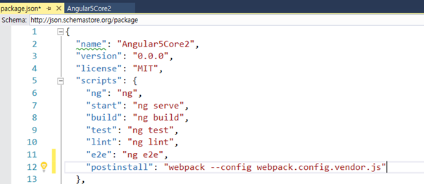

&nbsp;

<h1 style="font-size:14px; margin:1em 0px; line-height:1.5; color:#212121; font-family:&quot;open sans&quot;,sans-serif">
<strong>Step 3 &ndash;&nbsp;Working with Model and Context Class</strong></h1>
<h2 style="font-size:14px; margin:1em 0px; line-height:1.5; color:#212121; font-family:&quot;open sans&quot;,sans-serif">
<strong>Adding connection string</strong></h2>

To add the connection string with our SQL connection, open the &ldquo;appsettings.json&rdquo; file .Yes this is a JSON file and this file looks as shown below.

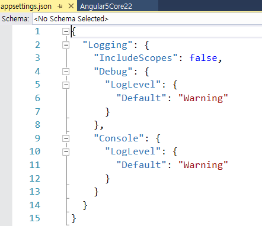

In this appsettings.json file, I have added the connection string&nbsp;

&nbsp;

XML

Edit|Remove

xml
<pre class="hidden">&quot;ConnectionStrings&quot;: {  
    &quot;DefaultConnection&quot;: &quot;Server=SQLSERVERNAME;Database=InventoryPDB;user id=SQLID;password=SQLPWD;Trusted_Connection=True;MultipleActiveResultSets=true;&quot;  
  } </pre>

<pre class="js">&quot;ConnectionStrings&quot;:&nbsp;{&nbsp;&nbsp;&nbsp;
&nbsp;&nbsp;&nbsp;&nbsp;&quot;DefaultConnection&quot;:&nbsp;&quot;Server=SQLSERVERNAME;Database=InventoryPDB;user&nbsp;id=SQLID;password=SQLPWD;Trusted_Connection=True;MultipleActiveResultSets=true;&quot;&nbsp;&nbsp;&nbsp;
&nbsp;&nbsp;}&nbsp;</pre>

&nbsp;<strong style="color:#212121; font-family:&quot;open sans&quot;,sans-serif; font-size:14px">Note:</strong>&nbsp;Change
 SQL connection string, as per your local connection.

&nbsp;

Next step is to create a folder named Data to create our model and DBContext class.

<h2 style="color:#212121; font-family:&quot;open sans&quot;,sans-serif; font-size:14px"><strong>Creating Model class for Inventory</strong></h2>

We can create a model by adding a new class file in our Data folder. Right Click Data folder and click Add&gt;Click Class. Enter the class name as InventoryMasters and click Add. Now,
 in this class, we first create a property variable, add InventoryMaster. We will be using this in our WEB API controller.Note that here we will be adding the filed name same as our Database table column names.

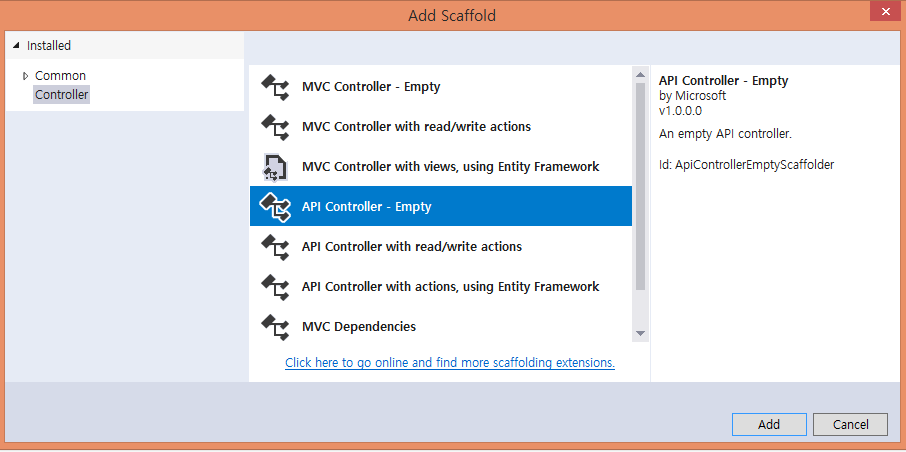

&nbsp;

JavaScript

Edit|Remove

js
<pre class="hidden">using System;
using System.Collections.Generic;
using System.ComponentModel.DataAnnotations;
using System.Linq;
using System.Threading.Tasks;

namespace Angular5Core2.Data
{
    public class InventoryMaster
    {
		[Key]
		public int InventoryID { get; set; }

		[Required]
		[Display(Name = &quot;ItemName&quot;)]
		public string ItemName { get; set; }

		[Required]
		[Display(Name = &quot;StockQty&quot;)]
		public int StockQty { get; set; }

		[Required]
		[Display(Name = &quot;ReorderQty&quot;)]
		public int ReorderQty { get; set; }

		public int PriorityStatus { get; set; }
	}
}
</pre>

<pre class="js">using&nbsp;System;&nbsp;
using&nbsp;System.Collections.Generic;&nbsp;
using&nbsp;System.ComponentModel.DataAnnotations;&nbsp;
using&nbsp;System.Linq;&nbsp;
using&nbsp;System.Threading.Tasks;&nbsp;
&nbsp;
namespace&nbsp;Angular5Core2.Data&nbsp;
{&nbsp;
&nbsp;&nbsp;&nbsp;&nbsp;public&nbsp;class&nbsp;InventoryMaster&nbsp;
&nbsp;&nbsp;&nbsp;&nbsp;{&nbsp;
&nbsp;&nbsp;&nbsp;&nbsp;&nbsp;&nbsp;&nbsp;&nbsp;[Key]&nbsp;
&nbsp;&nbsp;&nbsp;&nbsp;&nbsp;&nbsp;&nbsp;&nbsp;public&nbsp;int&nbsp;InventoryID&nbsp;{&nbsp;get;&nbsp;set;&nbsp;}&nbsp;
&nbsp;
&nbsp;&nbsp;&nbsp;&nbsp;&nbsp;&nbsp;&nbsp;&nbsp;[Required]&nbsp;
&nbsp;&nbsp;&nbsp;&nbsp;&nbsp;&nbsp;&nbsp;&nbsp;[Display(Name&nbsp;=&nbsp;&quot;ItemName&quot;)]&nbsp;
&nbsp;&nbsp;&nbsp;&nbsp;&nbsp;&nbsp;&nbsp;&nbsp;public&nbsp;string&nbsp;ItemName&nbsp;{&nbsp;get;&nbsp;set;&nbsp;}&nbsp;
&nbsp;
&nbsp;&nbsp;&nbsp;&nbsp;&nbsp;&nbsp;&nbsp;&nbsp;[Required]&nbsp;
&nbsp;&nbsp;&nbsp;&nbsp;&nbsp;&nbsp;&nbsp;&nbsp;[Display(Name&nbsp;=&nbsp;&quot;StockQty&quot;)]&nbsp;
&nbsp;&nbsp;&nbsp;&nbsp;&nbsp;&nbsp;&nbsp;&nbsp;public&nbsp;int&nbsp;StockQty&nbsp;{&nbsp;get;&nbsp;set;&nbsp;}&nbsp;
&nbsp;
&nbsp;&nbsp;&nbsp;&nbsp;&nbsp;&nbsp;&nbsp;&nbsp;[Required]&nbsp;
&nbsp;&nbsp;&nbsp;&nbsp;&nbsp;&nbsp;&nbsp;&nbsp;[Display(Name&nbsp;=&nbsp;&quot;ReorderQty&quot;)]&nbsp;
&nbsp;&nbsp;&nbsp;&nbsp;&nbsp;&nbsp;&nbsp;&nbsp;public&nbsp;int&nbsp;ReorderQty&nbsp;{&nbsp;get;&nbsp;set;&nbsp;}&nbsp;
&nbsp;
&nbsp;&nbsp;&nbsp;&nbsp;&nbsp;&nbsp;&nbsp;&nbsp;public&nbsp;int&nbsp;PriorityStatus&nbsp;{&nbsp;get;&nbsp;set;&nbsp;}&nbsp;
&nbsp;&nbsp;&nbsp;&nbsp;}&nbsp;
}&nbsp;
</pre>

<h2 class="endscriptcode">&nbsp;<strong style="color:#212121; font-family:&quot;open sans&quot;,sans-serif; font-size:14px">Creating Database Context</strong></h2>

&nbsp;

DBContext is Entity Framework class to establish a connection to the database

We can create a DBContext class by adding a new class file in our Data folder. Right click Data folder and click Add&gt;Click Class. Enter the class name as InventroyContext and click Add. In this class, we inherit DbContext and created Dbset for our students
 table.

&nbsp;

C#

Edit|Remove

csharp
<pre class="hidden">using Microsoft.EntityFrameworkCore;  
using System;  
using System.Collections.Generic;  
using System.Linq;  
using System.Threading.Tasks;  
  
namespace Angular5Core2.Data  
{  
    public class InventoryContext : DbContext  
    {  
        public InventoryContext(DbContextOptions&lt;InventoryContext&gt; options)    
            :base(options) { }  
        public InventoryContext() { }  
        public DbSet&lt;InventoryMaster&gt; InventoryMaster { get; set; }  
    }  
}  </pre>

<pre class="js">using&nbsp;Microsoft.EntityFrameworkCore;&nbsp;&nbsp;&nbsp;
using&nbsp;System;&nbsp;&nbsp;&nbsp;
using&nbsp;System.Collections.Generic;&nbsp;&nbsp;&nbsp;
using&nbsp;System.Linq;&nbsp;&nbsp;&nbsp;
using&nbsp;System.Threading.Tasks;&nbsp;&nbsp;&nbsp;
&nbsp;&nbsp;&nbsp;
namespace&nbsp;Angular5Core2.Data&nbsp;&nbsp;&nbsp;
{&nbsp;&nbsp;&nbsp;
&nbsp;&nbsp;&nbsp;&nbsp;public&nbsp;class&nbsp;InventoryContext&nbsp;:&nbsp;DbContext&nbsp;&nbsp;&nbsp;
&nbsp;&nbsp;&nbsp;&nbsp;{&nbsp;&nbsp;&nbsp;
&nbsp;&nbsp;&nbsp;&nbsp;&nbsp;&nbsp;&nbsp;&nbsp;public&nbsp;InventoryContext(DbContextOptions&lt;InventoryContext&gt;&nbsp;options)&nbsp;&nbsp;&nbsp;&nbsp;&nbsp;
&nbsp;&nbsp;&nbsp;&nbsp;&nbsp;&nbsp;&nbsp;&nbsp;&nbsp;&nbsp;&nbsp;&nbsp;:base(options)&nbsp;{&nbsp;}&nbsp;&nbsp;&nbsp;
&nbsp;&nbsp;&nbsp;&nbsp;&nbsp;&nbsp;&nbsp;&nbsp;public&nbsp;InventoryContext()&nbsp;{&nbsp;}&nbsp;&nbsp;&nbsp;
&nbsp;&nbsp;&nbsp;&nbsp;&nbsp;&nbsp;&nbsp;&nbsp;public&nbsp;DbSet&lt;InventoryMaster&gt;&nbsp;InventoryMaster&nbsp;{&nbsp;get;&nbsp;set;&nbsp;}&nbsp;&nbsp;&nbsp;
&nbsp;&nbsp;&nbsp;&nbsp;}&nbsp;&nbsp;&nbsp;
}&nbsp;&nbsp;</pre>

<h2 class="endscriptcode">&nbsp;<strong style="color:#212121; font-family:&quot;open sans&quot;,sans-serif; font-size:14px">Startup.CS</strong></h2>

&nbsp;

Now, we need to add our database connection string and provider as SQL SERVER. To add this, we add the code given below in Startup.cs file under ConfigureServices method.&nbsp;

&nbsp;

C#

Edit|Remove

csharp
<pre class="hidden">public void ConfigureServices(IServiceCollection services)  
        {  
            // Add Entity framework .    
            services.AddDbContext&lt;InventoryContext&gt;(options =&gt; options.UseSqlServer(Configuration.GetConnectionString(&quot;DefaultConnection&quot;)));  
            services.AddMvc();  
        }  </pre>

<pre class="js">public&nbsp;void&nbsp;ConfigureServices(IServiceCollection&nbsp;services)&nbsp;&nbsp;&nbsp;
&nbsp;&nbsp;&nbsp;&nbsp;&nbsp;&nbsp;&nbsp;&nbsp;{&nbsp;&nbsp;&nbsp;
&nbsp;&nbsp;&nbsp;&nbsp;&nbsp;&nbsp;&nbsp;&nbsp;&nbsp;&nbsp;&nbsp;&nbsp;//&nbsp;Add&nbsp;Entity&nbsp;framework&nbsp;.&nbsp;&nbsp;&nbsp;&nbsp;&nbsp;
&nbsp;&nbsp;&nbsp;&nbsp;&nbsp;&nbsp;&nbsp;&nbsp;&nbsp;&nbsp;&nbsp;&nbsp;services.AddDbContext&lt;InventoryContext&gt;(options&nbsp;=&gt;&nbsp;options.UseSqlServer(Configuration.GetConnectionString(&quot;DefaultConnection&quot;)));&nbsp;&nbsp;&nbsp;
&nbsp;&nbsp;&nbsp;&nbsp;&nbsp;&nbsp;&nbsp;&nbsp;&nbsp;&nbsp;&nbsp;&nbsp;services.AddMvc();&nbsp;&nbsp;&nbsp;
&nbsp;&nbsp;&nbsp;&nbsp;&nbsp;&nbsp;&nbsp;&nbsp;}&nbsp;&nbsp;</pre>

<h1 class="endscriptcode">&nbsp;<strong style="color:#212121; font-family:&quot;open sans&quot;,sans-serif; font-size:14px">Step 4 -&nbsp;Creating Web API for CRUD operation</strong></h1>

&nbsp;

To create our WEB API Controller, right click Controllers folder. Click Add &gt;&gt; Click Controller. Select API Controller Empty and click on Add button to create our Web API.

Enter the name as &ldquo;InventoryMasterAPI.cs&rdquo; and click Add.

As we all know, Web API is a simple and easy way to build HTTP Services for the Browsers and Mobiles. 
 
Web API has four methods given below as&nbsp;Get/Post/Put and Delete.

<ul style="color:#212121; font-family:&quot;open sans&quot;,sans-serif; font-size:14px">
<li>Get&nbsp;is to request for the data. (Select) </li><li>Post&nbsp;is to create a data. (Insert) </li><li>Put&nbsp;is to update the data. </li><li>Delete&nbsp;is to delete data. </li></ul>

First we create the object for DBContext in our Web API class.

&nbsp;

C#

Edit|Remove

csharp
<pre class="hidden">[Produces(&quot;application/json&quot;)]  
    [Route(&quot;api/InventoryMasterAPI&quot;)]  
    public class InventoryMasterAPIController : Controller  
    {  
        private readonly InventoryContext _context;  
  
        public InventoryMasterAPIController(InventoryContext context)  
        {  
            _context = context;  
        }  </pre>

<pre class="js">[Produces(&quot;application/json&quot;)]&nbsp;&nbsp;&nbsp;
&nbsp;&nbsp;&nbsp;&nbsp;[Route(&quot;api/InventoryMasterAPI&quot;)]&nbsp;&nbsp;&nbsp;
&nbsp;&nbsp;&nbsp;&nbsp;public&nbsp;class&nbsp;InventoryMasterAPIController&nbsp;:&nbsp;Controller&nbsp;&nbsp;&nbsp;
&nbsp;&nbsp;&nbsp;&nbsp;{&nbsp;&nbsp;&nbsp;
&nbsp;&nbsp;&nbsp;&nbsp;&nbsp;&nbsp;&nbsp;&nbsp;private&nbsp;readonly&nbsp;InventoryContext&nbsp;_context;&nbsp;&nbsp;&nbsp;
&nbsp;&nbsp;&nbsp;
&nbsp;&nbsp;&nbsp;&nbsp;&nbsp;&nbsp;&nbsp;&nbsp;public&nbsp;InventoryMasterAPIController(InventoryContext&nbsp;context)&nbsp;&nbsp;&nbsp;
&nbsp;&nbsp;&nbsp;&nbsp;&nbsp;&nbsp;&nbsp;&nbsp;{&nbsp;&nbsp;&nbsp;
&nbsp;&nbsp;&nbsp;&nbsp;&nbsp;&nbsp;&nbsp;&nbsp;&nbsp;&nbsp;&nbsp;&nbsp;_context&nbsp;=&nbsp;context;&nbsp;&nbsp;&nbsp;
&nbsp;&nbsp;&nbsp;&nbsp;&nbsp;&nbsp;&nbsp;&nbsp;}&nbsp;&nbsp;</pre>

<h2 class="endscriptcode">&nbsp;<strong style="color:#212121; font-family:&quot;open sans&quot;,sans-serif; font-size:14px">Get Method (Select Operation)</strong></h2>

&nbsp;

Get Method is to request single item or list of items from our selected database. Here, we will get all Inventory information from InventoryMasters table.&nbsp; &nbsp;&nbsp;

&nbsp;

C#

Edit|Remove

csharp
<pre class="hidden">// GET: api/InventoryMasterAPI  
  
    [HttpGet]  
    [Route(&quot;Inventory&quot;)]  
    public IEnumerable&lt;InventoryMaster&gt; GetInventoryMaster()  
    {  
        return _context.InventoryMaster;  
  
    }  </pre>

<pre class="js">//&nbsp;GET:&nbsp;api/InventoryMasterAPI&nbsp;&nbsp;&nbsp;
&nbsp;&nbsp;&nbsp;
&nbsp;&nbsp;&nbsp;&nbsp;[HttpGet]&nbsp;&nbsp;&nbsp;
&nbsp;&nbsp;&nbsp;&nbsp;[Route(&quot;Inventory&quot;)]&nbsp;&nbsp;&nbsp;
&nbsp;&nbsp;&nbsp;&nbsp;public&nbsp;IEnumerable&lt;InventoryMaster&gt;&nbsp;GetInventoryMaster()&nbsp;&nbsp;&nbsp;
&nbsp;&nbsp;&nbsp;&nbsp;{&nbsp;&nbsp;&nbsp;
&nbsp;&nbsp;&nbsp;&nbsp;&nbsp;&nbsp;&nbsp;&nbsp;return&nbsp;_context.InventoryMaster;&nbsp;&nbsp;&nbsp;
&nbsp;&nbsp;&nbsp;
&nbsp;&nbsp;&nbsp;&nbsp;}&nbsp;&nbsp;</pre>

<h2 class="endscriptcode">&nbsp;<strong style="color:#212121; font-family:&quot;open sans&quot;,sans-serif; font-size:14px">Post Method (Insert Operation)</strong></h2>

&nbsp;

Post Method will be used to insert the data to our database.&nbsp;In Post Method, we will also check if Inventory Id is already created and return the message. We will pass all
 inventory Master Column parameters to be inserted in to the Inventory Master table.&nbsp;

&nbsp;

C#

Edit|Remove

csharp
<pre class="hidden">// POST: api/InventoryMasterAPI  
[HttpPost]  
public async Task&lt;IActionResult&gt; PostInventoryMaster([FromBody] InventoryMaster InventoryMaster)  
{  
    if (!ModelState.IsValid)  
    {  
        return BadRequest(ModelState);  
    }  
  
    _context.InventoryMaster.Add(InventoryMaster);  
    try  
    {  
        await _context.SaveChangesAsync();  
    }  
    catch (DbUpdateException)  
    {  
        if (InventoryMasterExists(InventoryMaster.InventoryID))  
        {  
            return new StatusCodeResult(StatusCodes.Status409Conflict);  
        }  
        else  
        {  
            throw;  
        }  
    }  
  
    return CreatedAtAction(&quot;GetInventoryMaster&quot;, new { id = InventoryMaster.InventoryID }, InventoryMaster);  
}  
private bool InventoryMasterExists(int id)  
{  
    return _context.InventoryMaster.Any(e =&gt; e.InventoryID == id);  
}  </pre>

<pre class="js">//&nbsp;POST:&nbsp;api/InventoryMasterAPI&nbsp;&nbsp;&nbsp;
[HttpPost]&nbsp;&nbsp;&nbsp;
public&nbsp;async&nbsp;Task&lt;IActionResult&gt;&nbsp;PostInventoryMaster([FromBody]&nbsp;InventoryMaster&nbsp;InventoryMaster)&nbsp;&nbsp;&nbsp;
{&nbsp;&nbsp;&nbsp;
&nbsp;&nbsp;&nbsp;&nbsp;if&nbsp;(!ModelState.IsValid)&nbsp;&nbsp;&nbsp;
&nbsp;&nbsp;&nbsp;&nbsp;{&nbsp;&nbsp;&nbsp;
&nbsp;&nbsp;&nbsp;&nbsp;&nbsp;&nbsp;&nbsp;&nbsp;return&nbsp;BadRequest(ModelState);&nbsp;&nbsp;&nbsp;
&nbsp;&nbsp;&nbsp;&nbsp;}&nbsp;&nbsp;&nbsp;
&nbsp;&nbsp;&nbsp;
&nbsp;&nbsp;&nbsp;&nbsp;_context.InventoryMaster.Add(InventoryMaster);&nbsp;&nbsp;&nbsp;
&nbsp;&nbsp;&nbsp;&nbsp;try&nbsp;&nbsp;&nbsp;
&nbsp;&nbsp;&nbsp;&nbsp;{&nbsp;&nbsp;&nbsp;
&nbsp;&nbsp;&nbsp;&nbsp;&nbsp;&nbsp;&nbsp;&nbsp;await&nbsp;_context.SaveChangesAsync();&nbsp;&nbsp;&nbsp;
&nbsp;&nbsp;&nbsp;&nbsp;}&nbsp;&nbsp;&nbsp;
&nbsp;&nbsp;&nbsp;&nbsp;catch&nbsp;(DbUpdateException)&nbsp;&nbsp;&nbsp;
&nbsp;&nbsp;&nbsp;&nbsp;{&nbsp;&nbsp;&nbsp;
&nbsp;&nbsp;&nbsp;&nbsp;&nbsp;&nbsp;&nbsp;&nbsp;if&nbsp;(InventoryMasterExists(InventoryMaster.InventoryID))&nbsp;&nbsp;&nbsp;
&nbsp;&nbsp;&nbsp;&nbsp;&nbsp;&nbsp;&nbsp;&nbsp;{&nbsp;&nbsp;&nbsp;
&nbsp;&nbsp;&nbsp;&nbsp;&nbsp;&nbsp;&nbsp;&nbsp;&nbsp;&nbsp;&nbsp;&nbsp;return&nbsp;new&nbsp;StatusCodeResult(StatusCodes.Status409Conflict);&nbsp;&nbsp;&nbsp;
&nbsp;&nbsp;&nbsp;&nbsp;&nbsp;&nbsp;&nbsp;&nbsp;}&nbsp;&nbsp;&nbsp;
&nbsp;&nbsp;&nbsp;&nbsp;&nbsp;&nbsp;&nbsp;&nbsp;else&nbsp;&nbsp;&nbsp;
&nbsp;&nbsp;&nbsp;&nbsp;&nbsp;&nbsp;&nbsp;&nbsp;{&nbsp;&nbsp;&nbsp;
&nbsp;&nbsp;&nbsp;&nbsp;&nbsp;&nbsp;&nbsp;&nbsp;&nbsp;&nbsp;&nbsp;&nbsp;throw;&nbsp;&nbsp;&nbsp;
&nbsp;&nbsp;&nbsp;&nbsp;&nbsp;&nbsp;&nbsp;&nbsp;}&nbsp;&nbsp;&nbsp;
&nbsp;&nbsp;&nbsp;&nbsp;}&nbsp;&nbsp;&nbsp;
&nbsp;&nbsp;&nbsp;
&nbsp;&nbsp;&nbsp;&nbsp;return&nbsp;CreatedAtAction(&quot;GetInventoryMaster&quot;,&nbsp;new&nbsp;{&nbsp;id&nbsp;=&nbsp;InventoryMaster.InventoryID&nbsp;},&nbsp;InventoryMaster);&nbsp;&nbsp;&nbsp;
}&nbsp;&nbsp;&nbsp;
private&nbsp;bool&nbsp;InventoryMasterExists(int&nbsp;id)&nbsp;&nbsp;&nbsp;
{&nbsp;&nbsp;&nbsp;
&nbsp;&nbsp;&nbsp;&nbsp;return&nbsp;_context.InventoryMaster.Any(e&nbsp;=&gt;&nbsp;e.InventoryID&nbsp;==&nbsp;id);&nbsp;&nbsp;&nbsp;
}&nbsp;&nbsp;</pre>

<h2 class="endscriptcode">&nbsp;<strong style="color:#212121; font-family:&quot;open sans&quot;,sans-serif; font-size:14px">Put Method (Update Operation)</strong></h2>

&nbsp;

Put Method will be used to update the selected Inventory data to our database. In Put Method, we will pass InventoryID along with all other parameters for update. We pass the
 InventoryID to update the InventoryMaster Table by InventoryID.&nbsp;

&nbsp;

C#

Edit|Remove

csharp
<pre class="hidden">// PUT: api/InventoryMasterAPI/2  
[HttpPut(&quot;{id}&quot;)]  
public async Task&lt;IActionResult&gt; PutInventoryMaster([FromRoute] int id, [FromBody] InventoryMaster InventoryMaster)  
{  
    if (!ModelState.IsValid)  
    {  
        return BadRequest(ModelState);  
    }  
  
    if (id != InventoryMaster.InventoryID)  
    {  
        return BadRequest();  
    }  
  
    _context.Entry(InventoryMaster).State = EntityState.Modified;  
  
    try  
    {  
        await _context.SaveChangesAsync();  
    }  
    catch (DbUpdateConcurrencyException)  
    {  
        if (!InventoryMasterExists(id))  
        {  
            return NotFound();  
        }  
        else  
        {  
            throw;  
        }  
    }  
  
    return NoContent();  
}  </pre>

<pre class="js">//&nbsp;PUT:&nbsp;api/InventoryMasterAPI/2&nbsp;&nbsp;&nbsp;
[HttpPut(&quot;{id}&quot;)]&nbsp;&nbsp;&nbsp;
public&nbsp;async&nbsp;Task&lt;IActionResult&gt;&nbsp;PutInventoryMaster([FromRoute]&nbsp;int&nbsp;id,&nbsp;[FromBody]&nbsp;InventoryMaster&nbsp;InventoryMaster)&nbsp;&nbsp;&nbsp;
{&nbsp;&nbsp;&nbsp;
&nbsp;&nbsp;&nbsp;&nbsp;if&nbsp;(!ModelState.IsValid)&nbsp;&nbsp;&nbsp;
&nbsp;&nbsp;&nbsp;&nbsp;{&nbsp;&nbsp;&nbsp;
&nbsp;&nbsp;&nbsp;&nbsp;&nbsp;&nbsp;&nbsp;&nbsp;return&nbsp;BadRequest(ModelState);&nbsp;&nbsp;&nbsp;
&nbsp;&nbsp;&nbsp;&nbsp;}&nbsp;&nbsp;&nbsp;
&nbsp;&nbsp;&nbsp;
&nbsp;&nbsp;&nbsp;&nbsp;if&nbsp;(id&nbsp;!=&nbsp;InventoryMaster.InventoryID)&nbsp;&nbsp;&nbsp;
&nbsp;&nbsp;&nbsp;&nbsp;{&nbsp;&nbsp;&nbsp;
&nbsp;&nbsp;&nbsp;&nbsp;&nbsp;&nbsp;&nbsp;&nbsp;return&nbsp;BadRequest();&nbsp;&nbsp;&nbsp;
&nbsp;&nbsp;&nbsp;&nbsp;}&nbsp;&nbsp;&nbsp;
&nbsp;&nbsp;&nbsp;
&nbsp;&nbsp;&nbsp;&nbsp;_context.Entry(InventoryMaster).State&nbsp;=&nbsp;EntityState.Modified;&nbsp;&nbsp;&nbsp;
&nbsp;&nbsp;&nbsp;
&nbsp;&nbsp;&nbsp;&nbsp;try&nbsp;&nbsp;&nbsp;
&nbsp;&nbsp;&nbsp;&nbsp;{&nbsp;&nbsp;&nbsp;
&nbsp;&nbsp;&nbsp;&nbsp;&nbsp;&nbsp;&nbsp;&nbsp;await&nbsp;_context.SaveChangesAsync();&nbsp;&nbsp;&nbsp;
&nbsp;&nbsp;&nbsp;&nbsp;}&nbsp;&nbsp;&nbsp;
&nbsp;&nbsp;&nbsp;&nbsp;catch&nbsp;(DbUpdateConcurrencyException)&nbsp;&nbsp;&nbsp;
&nbsp;&nbsp;&nbsp;&nbsp;{&nbsp;&nbsp;&nbsp;
&nbsp;&nbsp;&nbsp;&nbsp;&nbsp;&nbsp;&nbsp;&nbsp;if&nbsp;(!InventoryMasterExists(id))&nbsp;&nbsp;&nbsp;
&nbsp;&nbsp;&nbsp;&nbsp;&nbsp;&nbsp;&nbsp;&nbsp;{&nbsp;&nbsp;&nbsp;
&nbsp;&nbsp;&nbsp;&nbsp;&nbsp;&nbsp;&nbsp;&nbsp;&nbsp;&nbsp;&nbsp;&nbsp;return&nbsp;NotFound();&nbsp;&nbsp;&nbsp;
&nbsp;&nbsp;&nbsp;&nbsp;&nbsp;&nbsp;&nbsp;&nbsp;}&nbsp;&nbsp;&nbsp;
&nbsp;&nbsp;&nbsp;&nbsp;&nbsp;&nbsp;&nbsp;&nbsp;else&nbsp;&nbsp;&nbsp;
&nbsp;&nbsp;&nbsp;&nbsp;&nbsp;&nbsp;&nbsp;&nbsp;{&nbsp;&nbsp;&nbsp;
&nbsp;&nbsp;&nbsp;&nbsp;&nbsp;&nbsp;&nbsp;&nbsp;&nbsp;&nbsp;&nbsp;&nbsp;throw;&nbsp;&nbsp;&nbsp;
&nbsp;&nbsp;&nbsp;&nbsp;&nbsp;&nbsp;&nbsp;&nbsp;}&nbsp;&nbsp;&nbsp;
&nbsp;&nbsp;&nbsp;&nbsp;}&nbsp;&nbsp;&nbsp;
&nbsp;&nbsp;&nbsp;
&nbsp;&nbsp;&nbsp;&nbsp;return&nbsp;NoContent();&nbsp;&nbsp;&nbsp;
}&nbsp;&nbsp;</pre>

<h2 class="endscriptcode">&nbsp;<strong style="color:#212121; font-family:&quot;open sans&quot;,sans-serif; font-size:14px">Delete Method (Delete Operation)</strong></h2>

&nbsp;

Delete Method will be used to delete the selected inventory data from our database. In Delete Method, we will pass InventoryID to delete the record.

&nbsp;

C#

Edit|Remove

csharp
<pre class="hidden">// DELETE: api/InventoryMasterAPI/2  
[HttpDelete(&quot;{id}&quot;)]  
public async Task&lt;IActionResult&gt; DeleteInventoryMaster([FromRoute] int id)  
{  
    if (!ModelState.IsValid)  
    {  
        return BadRequest(ModelState);  
    }  
  
    InventoryMaster InventoryMaster = await _context.InventoryMaster.SingleOrDefaultAsync(m =&gt; m.InventoryID == id);  
    if (InventoryMaster == null)  
    {  
        return NotFound();  
    }  
  
    _context.InventoryMaster.Remove(InventoryMaster);  
    await _context.SaveChangesAsync();  
  
    return Ok(InventoryMaster);  
}  </pre>

<pre class="js">//&nbsp;DELETE:&nbsp;api/InventoryMasterAPI/2&nbsp;&nbsp;&nbsp;
[HttpDelete(&quot;{id}&quot;)]&nbsp;&nbsp;&nbsp;
public&nbsp;async&nbsp;Task&lt;IActionResult&gt;&nbsp;DeleteInventoryMaster([FromRoute]&nbsp;int&nbsp;id)&nbsp;&nbsp;&nbsp;
{&nbsp;&nbsp;&nbsp;
&nbsp;&nbsp;&nbsp;&nbsp;if&nbsp;(!ModelState.IsValid)&nbsp;&nbsp;&nbsp;
&nbsp;&nbsp;&nbsp;&nbsp;{&nbsp;&nbsp;&nbsp;
&nbsp;&nbsp;&nbsp;&nbsp;&nbsp;&nbsp;&nbsp;&nbsp;return&nbsp;BadRequest(ModelState);&nbsp;&nbsp;&nbsp;
&nbsp;&nbsp;&nbsp;&nbsp;}&nbsp;&nbsp;&nbsp;
&nbsp;&nbsp;&nbsp;
&nbsp;&nbsp;&nbsp;&nbsp;InventoryMaster&nbsp;InventoryMaster&nbsp;=&nbsp;await&nbsp;_context.InventoryMaster.SingleOrDefaultAsync(m&nbsp;=&gt;&nbsp;m.InventoryID&nbsp;==&nbsp;id);&nbsp;&nbsp;&nbsp;
&nbsp;&nbsp;&nbsp;&nbsp;if&nbsp;(InventoryMaster&nbsp;==&nbsp;null)&nbsp;&nbsp;&nbsp;
&nbsp;&nbsp;&nbsp;&nbsp;{&nbsp;&nbsp;&nbsp;
&nbsp;&nbsp;&nbsp;&nbsp;&nbsp;&nbsp;&nbsp;&nbsp;return&nbsp;NotFound();&nbsp;&nbsp;&nbsp;
&nbsp;&nbsp;&nbsp;&nbsp;}&nbsp;&nbsp;&nbsp;
&nbsp;&nbsp;&nbsp;
&nbsp;&nbsp;&nbsp;&nbsp;_context.InventoryMaster.Remove(InventoryMaster);&nbsp;&nbsp;&nbsp;
&nbsp;&nbsp;&nbsp;&nbsp;await&nbsp;_context.SaveChangesAsync();&nbsp;&nbsp;&nbsp;
&nbsp;&nbsp;&nbsp;
&nbsp;&nbsp;&nbsp;&nbsp;return&nbsp;Ok(InventoryMaster);&nbsp;&nbsp;&nbsp;
}&nbsp;&nbsp;</pre>

&nbsp;To test Get Method, we can run our project and copy the GET method API path. Here, we can see our API path to get api/InventoryMasterAPI/Inventory/

 
Run the program and paste API path to test our output. 
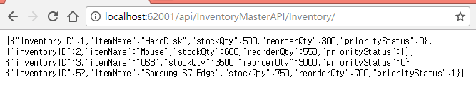

&nbsp;

<h1 style="font-size:14px; margin:1em 0px; line-height:1.5; color:#212121; font-family:&quot;open sans&quot;,sans-serif">
<strong>Step 5: Working with Angular5</strong></h1>

We create all Angular5 related Apps, Modules, Services, Components and HTML templates under ClientApp/App folder.

Here I&rsquo;m using the existing Home Component and html for performing our Inventory CRUD operations. It will be always good to create a separate Services, Component and html file for each action. For demo project here, I&rsquo;m using the existing home component
 and html.

<h2 style="font-size:14px; margin:1em 0px; line-height:1.5; color:#212121; font-family:&quot;open sans&quot;,sans-serif">
<strong>Home.component</strong></h2>

From the existing home component Type Script file,I have added all the functions to perform our CRUD operation for Inventory management.

First in the import section we have added the HTTP and FormsModule for working with WEB API Get/Post/Put/Delete and Forms to get and set input from the users.

In HomeComponent Class I have declared all the variables needed and created the separate function for Get/Post/put and Delete method. In get method I have passed the WEB API URL to get all the data from database and result JSON data to be bound in our html
 page. In Post and Put method I passed all the arguments by the user entered in the form to the WEB API to perform Update and Insert in database. Same like this we also created the delete method for deleting the inventory list from database by passing the Inventory
 ID as parameter to our Web API.

&nbsp;

JavaScript

Edit|Remove

js
<pre class="hidden">import { Component, Input, Inject } from '@angular/core';  
import { Http,Response, Headers, RequestOptions } from '@angular/http';  
import { FormsModule } from '@angular/forms';  
  
  
@Component({  
    selector: 'home',  
    templateUrl: './home.component.html'  
})  
export class HomeComponent {  
    // to get the Student Details  
    public Inventory: InventoryMaster[] = [];  
    // to hide and Show Insert/Edit   
    AddTable: Boolean = false;  
    // To stored Student Informations for insert/Update and Delete  
    public sInventoryID : number = 0;  
    public sItemName = &quot;&quot;;  
    public sStockQty : number  = 0;  
    public sReorderQty : number = 0;  
    public sPriorityStatus: boolean = false;  
  
    //For display Edit and Delete Images  
    public imgchk = require(&quot;./Images/chk.png&quot;);  
    public imgunChk =  require(&quot;./Images/unchk.png&quot;);  
    public bseUrl: string = &quot;&quot;;  
      
    public schkName: string = &quot;&quot;;  
    myName: string;   
    constructor(public http: Http, @Inject('BASE_URL')  baseUrl: string) {  
        this.myName = &quot;Shanu&quot;;  
        this.AddTable = false;  
        this.bseUrl = baseUrl;   
        this.getData();  
    }  
  
  
    //to get all the Inventory data from Web API  
    getData() {  
  
        this.http.get(this.bseUrl &#43; 'api/InventoryMasterAPI/Inventory').subscribe(result =&gt; {  
            this.Inventory = result.json();  
        }, error =&gt; console.error(error));   
           
    }  
  
    // to show form for add new Student Information  
    AddInventory() {   
        this.AddTable = true;  
        // To stored Student Informations for insert/Update and Delete  
        this.sInventoryID = 0;  
        this.sItemName = &quot;&quot;;  
        this.sStockQty = 50;  
        this.sReorderQty = 50;  
        this.sPriorityStatus = false;  
    }  
  
    // to show form for edit Inventory Information  
    editInventoryDetails(inventoryIDs : number, itemNames : string, stockQtys : number, reorderQtys : number , priorityStatus : number) {   
        this.AddTable = true;  
        this.sInventoryID = inventoryIDs;  
        this.sItemName = itemNames;  
        this.sStockQty = stockQtys;  
        this.sReorderQty = reorderQtys;  
        if (priorityStatus == 0)  
        {  
            this.sPriorityStatus = false;  
        }  
        else {  
            this.sPriorityStatus = true;  
        }  
         
    }  
  
    // If the InventoryId is 0 then insert the Inventory infromation using post and if the Inventory id is greater than 0 then edit using put mehod  
    addInventoryDetails(inventoryIDs: number, itemNames: string, stockQtys: number, reorderQtys: number, priorityStatus: boolean) {  
        var pStatus: number = 0;  
          
        this.schkName = priorityStatus.toString();  
        if (this.schkName == &quot;true&quot;) {  
            pStatus = 1;  
        }  
        var headers = new Headers();  
        headers.append('Content-Type', 'application/json; charset=utf-8');  
        if (inventoryIDs == 0) {  
            this.http.post(this.bseUrl &#43; 'api/InventoryMasterAPI/', JSON.stringify({ InventoryID: inventoryIDs, ItemName: itemNames, StockQty: stockQtys, ReorderQty: reorderQtys, PriorityStatus: pStatus }),  
                { headers: headers }).subscribe(  
                response =&gt; {  
                    this.getData();  
  
                }, error =&gt; {  
                }  
                );   
              
        }  
        else {  
            this.http.put(this.bseUrl &#43; 'api/InventoryMasterAPI/' &#43; inventoryIDs, JSON.stringify({ InventoryID: inventoryIDs, ItemName: itemNames, StockQty: stockQtys, ReorderQty: reorderQtys, PriorityStatus: pStatus }), { headers: headers })  
                .subscribe(response =&gt; {  
                    this.getData();  
  
                }, error =&gt; {  
                }  
                );   
             
        }  
        this.AddTable = false;  
        //  
        //  
        //this.http.get(this.bseUrl &#43; 'api/InventoryMasterAPI/Inventory').subscribe(result =&gt; {  
        //    this.Inventory = result.json();  
        //}, error =&gt; console.error(error));   
    }  
  
    //to Delete the selected Inventory detail from database.  
    deleteinventoryDetails(inventoryIDs: number) {  
        var headers = new Headers();  
        headers.append('Content-Type', 'application/json; charset=utf-8');  
        this.http.delete(this.bseUrl &#43; 'api/InventoryMasterAPI/' &#43; inventoryIDs, { headers: headers }).subscribe(response =&gt; {  
            this.getData();  
  
        }, error =&gt; {  
        }  
        );   
  
        //this.http.get(this.bseUrl &#43; 'api/InventoryMasterAPI/Inventory').subscribe(result =&gt; {  
        //    this.Inventory = result.json();  
        //}, error =&gt; console.error(error));   
    }  
  
    closeEdits() {  
        this.AddTable = false;  
        // To stored Student Informations for insert/Update and Delete  
        this.sInventoryID = 0;  
        this.sItemName = &quot;&quot;;  
        this.sStockQty = 50;  
        this.sReorderQty = 50;  
        this.sPriorityStatus = false;  
    }  
}  
  
export interface InventoryMaster {  
    inventoryID: number;  
    itemName: string;  
    stockQty: number;  
    reorderQty: number;  
    priorityStatus: number;  
}  </pre>

<pre class="js">import&nbsp;{&nbsp;Component,&nbsp;Input,&nbsp;Inject&nbsp;}&nbsp;from&nbsp;'@angular/core';&nbsp;&nbsp;&nbsp;
import&nbsp;{&nbsp;Http,Response,&nbsp;Headers,&nbsp;RequestOptions&nbsp;}&nbsp;from&nbsp;'@angular/http';&nbsp;&nbsp;&nbsp;
import&nbsp;{&nbsp;FormsModule&nbsp;}&nbsp;from&nbsp;'@angular/forms';&nbsp;&nbsp;&nbsp;
&nbsp;&nbsp;&nbsp;
&nbsp;&nbsp;&nbsp;
@Component({&nbsp;&nbsp;&nbsp;
&nbsp;&nbsp;&nbsp;&nbsp;selector:&nbsp;'home',&nbsp;&nbsp;&nbsp;
&nbsp;&nbsp;&nbsp;&nbsp;templateUrl:&nbsp;'./home.component.html'&nbsp;&nbsp;&nbsp;
})&nbsp;&nbsp;&nbsp;
export&nbsp;class&nbsp;HomeComponent&nbsp;{&nbsp;&nbsp;&nbsp;
&nbsp;&nbsp;&nbsp;&nbsp;//&nbsp;to&nbsp;get&nbsp;the&nbsp;Student&nbsp;Details&nbsp;&nbsp;&nbsp;
&nbsp;&nbsp;&nbsp;&nbsp;public&nbsp;Inventory:&nbsp;InventoryMaster[]&nbsp;=&nbsp;[];&nbsp;&nbsp;&nbsp;
&nbsp;&nbsp;&nbsp;&nbsp;//&nbsp;to&nbsp;hide&nbsp;and&nbsp;Show&nbsp;Insert/Edit&nbsp;&nbsp;&nbsp;&nbsp;
&nbsp;&nbsp;&nbsp;&nbsp;AddTable:&nbsp;Boolean&nbsp;=&nbsp;false;&nbsp;&nbsp;&nbsp;
&nbsp;&nbsp;&nbsp;&nbsp;//&nbsp;To&nbsp;stored&nbsp;Student&nbsp;Informations&nbsp;for&nbsp;insert/Update&nbsp;and&nbsp;Delete&nbsp;&nbsp;&nbsp;
&nbsp;&nbsp;&nbsp;&nbsp;public&nbsp;sInventoryID&nbsp;:&nbsp;number&nbsp;=&nbsp;0;&nbsp;&nbsp;&nbsp;
&nbsp;&nbsp;&nbsp;&nbsp;public&nbsp;sItemName&nbsp;=&nbsp;&quot;&quot;;&nbsp;&nbsp;&nbsp;
&nbsp;&nbsp;&nbsp;&nbsp;public&nbsp;sStockQty&nbsp;:&nbsp;number&nbsp;&nbsp;=&nbsp;0;&nbsp;&nbsp;&nbsp;
&nbsp;&nbsp;&nbsp;&nbsp;public&nbsp;sReorderQty&nbsp;:&nbsp;number&nbsp;=&nbsp;0;&nbsp;&nbsp;&nbsp;
&nbsp;&nbsp;&nbsp;&nbsp;public&nbsp;sPriorityStatus:&nbsp;boolean&nbsp;=&nbsp;false;&nbsp;&nbsp;&nbsp;
&nbsp;&nbsp;&nbsp;
&nbsp;&nbsp;&nbsp;&nbsp;//For&nbsp;display&nbsp;Edit&nbsp;and&nbsp;Delete&nbsp;Images&nbsp;&nbsp;&nbsp;
&nbsp;&nbsp;&nbsp;&nbsp;public&nbsp;imgchk&nbsp;=&nbsp;require(&quot;./Images/chk.png&quot;);&nbsp;&nbsp;&nbsp;
&nbsp;&nbsp;&nbsp;&nbsp;public&nbsp;imgunChk&nbsp;=&nbsp;&nbsp;require(&quot;./Images/unchk.png&quot;);&nbsp;&nbsp;&nbsp;
&nbsp;&nbsp;&nbsp;&nbsp;public&nbsp;bseUrl:&nbsp;string&nbsp;=&nbsp;&quot;&quot;;&nbsp;&nbsp;&nbsp;
&nbsp;&nbsp;&nbsp;&nbsp;&nbsp;&nbsp;&nbsp;
&nbsp;&nbsp;&nbsp;&nbsp;public&nbsp;schkName:&nbsp;string&nbsp;=&nbsp;&quot;&quot;;&nbsp;&nbsp;&nbsp;
&nbsp;&nbsp;&nbsp;&nbsp;myName:&nbsp;string;&nbsp;&nbsp;&nbsp;&nbsp;
&nbsp;&nbsp;&nbsp;&nbsp;constructor(public&nbsp;http:&nbsp;Http,&nbsp;@Inject('BASE_URL')&nbsp;&nbsp;baseUrl:&nbsp;string)&nbsp;{&nbsp;&nbsp;&nbsp;
&nbsp;&nbsp;&nbsp;&nbsp;&nbsp;&nbsp;&nbsp;&nbsp;this.myName&nbsp;=&nbsp;&quot;Shanu&quot;;&nbsp;&nbsp;&nbsp;
&nbsp;&nbsp;&nbsp;&nbsp;&nbsp;&nbsp;&nbsp;&nbsp;this.AddTable&nbsp;=&nbsp;false;&nbsp;&nbsp;&nbsp;
&nbsp;&nbsp;&nbsp;&nbsp;&nbsp;&nbsp;&nbsp;&nbsp;this.bseUrl&nbsp;=&nbsp;baseUrl;&nbsp;&nbsp;&nbsp;&nbsp;
&nbsp;&nbsp;&nbsp;&nbsp;&nbsp;&nbsp;&nbsp;&nbsp;this.getData();&nbsp;&nbsp;&nbsp;
&nbsp;&nbsp;&nbsp;&nbsp;}&nbsp;&nbsp;&nbsp;
&nbsp;&nbsp;&nbsp;
&nbsp;&nbsp;&nbsp;
&nbsp;&nbsp;&nbsp;&nbsp;//to&nbsp;get&nbsp;all&nbsp;the&nbsp;Inventory&nbsp;data&nbsp;from&nbsp;Web&nbsp;API&nbsp;&nbsp;&nbsp;
&nbsp;&nbsp;&nbsp;&nbsp;getData()&nbsp;{&nbsp;&nbsp;&nbsp;
&nbsp;&nbsp;&nbsp;
&nbsp;&nbsp;&nbsp;&nbsp;&nbsp;&nbsp;&nbsp;&nbsp;this.http.get(this.bseUrl&nbsp;&#43;&nbsp;'api/InventoryMasterAPI/Inventory').subscribe(result&nbsp;=&gt;&nbsp;{&nbsp;&nbsp;&nbsp;
&nbsp;&nbsp;&nbsp;&nbsp;&nbsp;&nbsp;&nbsp;&nbsp;&nbsp;&nbsp;&nbsp;&nbsp;this.Inventory&nbsp;=&nbsp;result.json();&nbsp;&nbsp;&nbsp;
&nbsp;&nbsp;&nbsp;&nbsp;&nbsp;&nbsp;&nbsp;&nbsp;},&nbsp;error&nbsp;=&gt;&nbsp;console.error(error));&nbsp;&nbsp;&nbsp;&nbsp;
&nbsp;&nbsp;&nbsp;&nbsp;&nbsp;&nbsp;&nbsp;&nbsp;&nbsp;&nbsp;&nbsp;&nbsp;
&nbsp;&nbsp;&nbsp;&nbsp;}&nbsp;&nbsp;&nbsp;
&nbsp;&nbsp;&nbsp;
&nbsp;&nbsp;&nbsp;&nbsp;//&nbsp;to&nbsp;show&nbsp;form&nbsp;for&nbsp;add&nbsp;new&nbsp;Student&nbsp;Information&nbsp;&nbsp;&nbsp;
&nbsp;&nbsp;&nbsp;&nbsp;AddInventory()&nbsp;{&nbsp;&nbsp;&nbsp;&nbsp;
&nbsp;&nbsp;&nbsp;&nbsp;&nbsp;&nbsp;&nbsp;&nbsp;this.AddTable&nbsp;=&nbsp;true;&nbsp;&nbsp;&nbsp;
&nbsp;&nbsp;&nbsp;&nbsp;&nbsp;&nbsp;&nbsp;&nbsp;//&nbsp;To&nbsp;stored&nbsp;Student&nbsp;Informations&nbsp;for&nbsp;insert/Update&nbsp;and&nbsp;Delete&nbsp;&nbsp;&nbsp;
&nbsp;&nbsp;&nbsp;&nbsp;&nbsp;&nbsp;&nbsp;&nbsp;this.sInventoryID&nbsp;=&nbsp;0;&nbsp;&nbsp;&nbsp;
&nbsp;&nbsp;&nbsp;&nbsp;&nbsp;&nbsp;&nbsp;&nbsp;this.sItemName&nbsp;=&nbsp;&quot;&quot;;&nbsp;&nbsp;&nbsp;
&nbsp;&nbsp;&nbsp;&nbsp;&nbsp;&nbsp;&nbsp;&nbsp;this.sStockQty&nbsp;=&nbsp;50;&nbsp;&nbsp;&nbsp;
&nbsp;&nbsp;&nbsp;&nbsp;&nbsp;&nbsp;&nbsp;&nbsp;this.sReorderQty&nbsp;=&nbsp;50;&nbsp;&nbsp;&nbsp;
&nbsp;&nbsp;&nbsp;&nbsp;&nbsp;&nbsp;&nbsp;&nbsp;this.sPriorityStatus&nbsp;=&nbsp;false;&nbsp;&nbsp;&nbsp;
&nbsp;&nbsp;&nbsp;&nbsp;}&nbsp;&nbsp;&nbsp;
&nbsp;&nbsp;&nbsp;
&nbsp;&nbsp;&nbsp;&nbsp;//&nbsp;to&nbsp;show&nbsp;form&nbsp;for&nbsp;edit&nbsp;Inventory&nbsp;Information&nbsp;&nbsp;&nbsp;
&nbsp;&nbsp;&nbsp;&nbsp;editInventoryDetails(inventoryIDs&nbsp;:&nbsp;number,&nbsp;itemNames&nbsp;:&nbsp;string,&nbsp;stockQtys&nbsp;:&nbsp;number,&nbsp;reorderQtys&nbsp;:&nbsp;number&nbsp;,&nbsp;priorityStatus&nbsp;:&nbsp;number)&nbsp;{&nbsp;&nbsp;&nbsp;&nbsp;
&nbsp;&nbsp;&nbsp;&nbsp;&nbsp;&nbsp;&nbsp;&nbsp;this.AddTable&nbsp;=&nbsp;true;&nbsp;&nbsp;&nbsp;
&nbsp;&nbsp;&nbsp;&nbsp;&nbsp;&nbsp;&nbsp;&nbsp;this.sInventoryID&nbsp;=&nbsp;inventoryIDs;&nbsp;&nbsp;&nbsp;
&nbsp;&nbsp;&nbsp;&nbsp;&nbsp;&nbsp;&nbsp;&nbsp;this.sItemName&nbsp;=&nbsp;itemNames;&nbsp;&nbsp;&nbsp;
&nbsp;&nbsp;&nbsp;&nbsp;&nbsp;&nbsp;&nbsp;&nbsp;this.sStockQty&nbsp;=&nbsp;stockQtys;&nbsp;&nbsp;&nbsp;
&nbsp;&nbsp;&nbsp;&nbsp;&nbsp;&nbsp;&nbsp;&nbsp;this.sReorderQty&nbsp;=&nbsp;reorderQtys;&nbsp;&nbsp;&nbsp;
&nbsp;&nbsp;&nbsp;&nbsp;&nbsp;&nbsp;&nbsp;&nbsp;if&nbsp;(priorityStatus&nbsp;==&nbsp;0)&nbsp;&nbsp;&nbsp;
&nbsp;&nbsp;&nbsp;&nbsp;&nbsp;&nbsp;&nbsp;&nbsp;{&nbsp;&nbsp;&nbsp;
&nbsp;&nbsp;&nbsp;&nbsp;&nbsp;&nbsp;&nbsp;&nbsp;&nbsp;&nbsp;&nbsp;&nbsp;this.sPriorityStatus&nbsp;=&nbsp;false;&nbsp;&nbsp;&nbsp;
&nbsp;&nbsp;&nbsp;&nbsp;&nbsp;&nbsp;&nbsp;&nbsp;}&nbsp;&nbsp;&nbsp;
&nbsp;&nbsp;&nbsp;&nbsp;&nbsp;&nbsp;&nbsp;&nbsp;else&nbsp;{&nbsp;&nbsp;&nbsp;
&nbsp;&nbsp;&nbsp;&nbsp;&nbsp;&nbsp;&nbsp;&nbsp;&nbsp;&nbsp;&nbsp;&nbsp;this.sPriorityStatus&nbsp;=&nbsp;true;&nbsp;&nbsp;&nbsp;
&nbsp;&nbsp;&nbsp;&nbsp;&nbsp;&nbsp;&nbsp;&nbsp;}&nbsp;&nbsp;&nbsp;
&nbsp;&nbsp;&nbsp;&nbsp;&nbsp;&nbsp;&nbsp;&nbsp;&nbsp;&nbsp;
&nbsp;&nbsp;&nbsp;&nbsp;}&nbsp;&nbsp;&nbsp;
&nbsp;&nbsp;&nbsp;
&nbsp;&nbsp;&nbsp;&nbsp;//&nbsp;If&nbsp;the&nbsp;InventoryId&nbsp;is&nbsp;0&nbsp;then&nbsp;insert&nbsp;the&nbsp;Inventory&nbsp;infromation&nbsp;using&nbsp;post&nbsp;and&nbsp;if&nbsp;the&nbsp;Inventory&nbsp;id&nbsp;is&nbsp;greater&nbsp;than&nbsp;0&nbsp;then&nbsp;edit&nbsp;using&nbsp;put&nbsp;mehod&nbsp;&nbsp;&nbsp;
&nbsp;&nbsp;&nbsp;&nbsp;addInventoryDetails(inventoryIDs:&nbsp;number,&nbsp;itemNames:&nbsp;string,&nbsp;stockQtys:&nbsp;number,&nbsp;reorderQtys:&nbsp;number,&nbsp;priorityStatus:&nbsp;boolean)&nbsp;{&nbsp;&nbsp;&nbsp;
&nbsp;&nbsp;&nbsp;&nbsp;&nbsp;&nbsp;&nbsp;&nbsp;var&nbsp;pStatus:&nbsp;number&nbsp;=&nbsp;0;&nbsp;&nbsp;&nbsp;
&nbsp;&nbsp;&nbsp;&nbsp;&nbsp;&nbsp;&nbsp;&nbsp;&nbsp;&nbsp;&nbsp;
&nbsp;&nbsp;&nbsp;&nbsp;&nbsp;&nbsp;&nbsp;&nbsp;this.schkName&nbsp;=&nbsp;priorityStatus.toString();&nbsp;&nbsp;&nbsp;
&nbsp;&nbsp;&nbsp;&nbsp;&nbsp;&nbsp;&nbsp;&nbsp;if&nbsp;(this.schkName&nbsp;==&nbsp;&quot;true&quot;)&nbsp;{&nbsp;&nbsp;&nbsp;
&nbsp;&nbsp;&nbsp;&nbsp;&nbsp;&nbsp;&nbsp;&nbsp;&nbsp;&nbsp;&nbsp;&nbsp;pStatus&nbsp;=&nbsp;1;&nbsp;&nbsp;&nbsp;
&nbsp;&nbsp;&nbsp;&nbsp;&nbsp;&nbsp;&nbsp;&nbsp;}&nbsp;&nbsp;&nbsp;
&nbsp;&nbsp;&nbsp;&nbsp;&nbsp;&nbsp;&nbsp;&nbsp;var&nbsp;headers&nbsp;=&nbsp;new&nbsp;Headers();&nbsp;&nbsp;&nbsp;
&nbsp;&nbsp;&nbsp;&nbsp;&nbsp;&nbsp;&nbsp;&nbsp;headers.append('Content-Type',&nbsp;'application/json;&nbsp;charset=utf-8');&nbsp;&nbsp;&nbsp;
&nbsp;&nbsp;&nbsp;&nbsp;&nbsp;&nbsp;&nbsp;&nbsp;if&nbsp;(inventoryIDs&nbsp;==&nbsp;0)&nbsp;{&nbsp;&nbsp;&nbsp;
&nbsp;&nbsp;&nbsp;&nbsp;&nbsp;&nbsp;&nbsp;&nbsp;&nbsp;&nbsp;&nbsp;&nbsp;this.http.post(this.bseUrl&nbsp;&#43;&nbsp;'api/InventoryMasterAPI/',&nbsp;JSON.stringify({&nbsp;InventoryID:&nbsp;inventoryIDs,&nbsp;ItemName:&nbsp;itemNames,&nbsp;StockQty:&nbsp;stockQtys,&nbsp;ReorderQty:&nbsp;reorderQtys,&nbsp;PriorityStatus:&nbsp;pStatus&nbsp;}),&nbsp;&nbsp;&nbsp;
&nbsp;&nbsp;&nbsp;&nbsp;&nbsp;&nbsp;&nbsp;&nbsp;&nbsp;&nbsp;&nbsp;&nbsp;&nbsp;&nbsp;&nbsp;&nbsp;{&nbsp;headers:&nbsp;headers&nbsp;}).subscribe(&nbsp;&nbsp;&nbsp;
&nbsp;&nbsp;&nbsp;&nbsp;&nbsp;&nbsp;&nbsp;&nbsp;&nbsp;&nbsp;&nbsp;&nbsp;&nbsp;&nbsp;&nbsp;&nbsp;response&nbsp;=&gt;&nbsp;{&nbsp;&nbsp;&nbsp;
&nbsp;&nbsp;&nbsp;&nbsp;&nbsp;&nbsp;&nbsp;&nbsp;&nbsp;&nbsp;&nbsp;&nbsp;&nbsp;&nbsp;&nbsp;&nbsp;&nbsp;&nbsp;&nbsp;&nbsp;this.getData();&nbsp;&nbsp;&nbsp;
&nbsp;&nbsp;&nbsp;
&nbsp;&nbsp;&nbsp;&nbsp;&nbsp;&nbsp;&nbsp;&nbsp;&nbsp;&nbsp;&nbsp;&nbsp;&nbsp;&nbsp;&nbsp;&nbsp;},&nbsp;error&nbsp;=&gt;&nbsp;{&nbsp;&nbsp;&nbsp;
&nbsp;&nbsp;&nbsp;&nbsp;&nbsp;&nbsp;&nbsp;&nbsp;&nbsp;&nbsp;&nbsp;&nbsp;&nbsp;&nbsp;&nbsp;&nbsp;}&nbsp;&nbsp;&nbsp;
&nbsp;&nbsp;&nbsp;&nbsp;&nbsp;&nbsp;&nbsp;&nbsp;&nbsp;&nbsp;&nbsp;&nbsp;&nbsp;&nbsp;&nbsp;&nbsp;);&nbsp;&nbsp;&nbsp;&nbsp;
&nbsp;&nbsp;&nbsp;&nbsp;&nbsp;&nbsp;&nbsp;&nbsp;&nbsp;&nbsp;&nbsp;&nbsp;&nbsp;&nbsp;&nbsp;
&nbsp;&nbsp;&nbsp;&nbsp;&nbsp;&nbsp;&nbsp;&nbsp;}&nbsp;&nbsp;&nbsp;
&nbsp;&nbsp;&nbsp;&nbsp;&nbsp;&nbsp;&nbsp;&nbsp;else&nbsp;{&nbsp;&nbsp;&nbsp;
&nbsp;&nbsp;&nbsp;&nbsp;&nbsp;&nbsp;&nbsp;&nbsp;&nbsp;&nbsp;&nbsp;&nbsp;this.http.put(this.bseUrl&nbsp;&#43;&nbsp;'api/InventoryMasterAPI/'&nbsp;&#43;&nbsp;inventoryIDs,&nbsp;JSON.stringify({&nbsp;InventoryID:&nbsp;inventoryIDs,&nbsp;ItemName:&nbsp;itemNames,&nbsp;StockQty:&nbsp;stockQtys,&nbsp;ReorderQty:&nbsp;reorderQtys,&nbsp;PriorityStatus:&nbsp;pStatus&nbsp;}),&nbsp;{&nbsp;headers:&nbsp;headers&nbsp;})&nbsp;&nbsp;&nbsp;
&nbsp;&nbsp;&nbsp;&nbsp;&nbsp;&nbsp;&nbsp;&nbsp;&nbsp;&nbsp;&nbsp;&nbsp;&nbsp;&nbsp;&nbsp;&nbsp;.subscribe(response&nbsp;=&gt;&nbsp;{&nbsp;&nbsp;&nbsp;
&nbsp;&nbsp;&nbsp;&nbsp;&nbsp;&nbsp;&nbsp;&nbsp;&nbsp;&nbsp;&nbsp;&nbsp;&nbsp;&nbsp;&nbsp;&nbsp;&nbsp;&nbsp;&nbsp;&nbsp;this.getData();&nbsp;&nbsp;&nbsp;
&nbsp;&nbsp;&nbsp;
&nbsp;&nbsp;&nbsp;&nbsp;&nbsp;&nbsp;&nbsp;&nbsp;&nbsp;&nbsp;&nbsp;&nbsp;&nbsp;&nbsp;&nbsp;&nbsp;},&nbsp;error&nbsp;=&gt;&nbsp;{&nbsp;&nbsp;&nbsp;
&nbsp;&nbsp;&nbsp;&nbsp;&nbsp;&nbsp;&nbsp;&nbsp;&nbsp;&nbsp;&nbsp;&nbsp;&nbsp;&nbsp;&nbsp;&nbsp;}&nbsp;&nbsp;&nbsp;
&nbsp;&nbsp;&nbsp;&nbsp;&nbsp;&nbsp;&nbsp;&nbsp;&nbsp;&nbsp;&nbsp;&nbsp;&nbsp;&nbsp;&nbsp;&nbsp;);&nbsp;&nbsp;&nbsp;&nbsp;
&nbsp;&nbsp;&nbsp;&nbsp;&nbsp;&nbsp;&nbsp;&nbsp;&nbsp;&nbsp;&nbsp;&nbsp;&nbsp;&nbsp;
&nbsp;&nbsp;&nbsp;&nbsp;&nbsp;&nbsp;&nbsp;&nbsp;}&nbsp;&nbsp;&nbsp;
&nbsp;&nbsp;&nbsp;&nbsp;&nbsp;&nbsp;&nbsp;&nbsp;this.AddTable&nbsp;=&nbsp;false;&nbsp;&nbsp;&nbsp;
&nbsp;&nbsp;&nbsp;&nbsp;&nbsp;&nbsp;&nbsp;&nbsp;//&nbsp;&nbsp;&nbsp;
&nbsp;&nbsp;&nbsp;&nbsp;&nbsp;&nbsp;&nbsp;&nbsp;//&nbsp;&nbsp;&nbsp;
&nbsp;&nbsp;&nbsp;&nbsp;&nbsp;&nbsp;&nbsp;&nbsp;//this.http.get(this.bseUrl&nbsp;&#43;&nbsp;'api/InventoryMasterAPI/Inventory').subscribe(result&nbsp;=&gt;&nbsp;{&nbsp;&nbsp;&nbsp;
&nbsp;&nbsp;&nbsp;&nbsp;&nbsp;&nbsp;&nbsp;&nbsp;//&nbsp;&nbsp;&nbsp;&nbsp;this.Inventory&nbsp;=&nbsp;result.json();&nbsp;&nbsp;&nbsp;
&nbsp;&nbsp;&nbsp;&nbsp;&nbsp;&nbsp;&nbsp;&nbsp;//},&nbsp;error&nbsp;=&gt;&nbsp;console.error(error));&nbsp;&nbsp;&nbsp;&nbsp;
&nbsp;&nbsp;&nbsp;&nbsp;}&nbsp;&nbsp;&nbsp;
&nbsp;&nbsp;&nbsp;
&nbsp;&nbsp;&nbsp;&nbsp;//to&nbsp;Delete&nbsp;the&nbsp;selected&nbsp;Inventory&nbsp;detail&nbsp;from&nbsp;database.&nbsp;&nbsp;&nbsp;
&nbsp;&nbsp;&nbsp;&nbsp;deleteinventoryDetails(inventoryIDs:&nbsp;number)&nbsp;{&nbsp;&nbsp;&nbsp;
&nbsp;&nbsp;&nbsp;&nbsp;&nbsp;&nbsp;&nbsp;&nbsp;var&nbsp;headers&nbsp;=&nbsp;new&nbsp;Headers();&nbsp;&nbsp;&nbsp;
&nbsp;&nbsp;&nbsp;&nbsp;&nbsp;&nbsp;&nbsp;&nbsp;headers.append('Content-Type',&nbsp;'application/json;&nbsp;charset=utf-8');&nbsp;&nbsp;&nbsp;
&nbsp;&nbsp;&nbsp;&nbsp;&nbsp;&nbsp;&nbsp;&nbsp;this.http.delete(this.bseUrl&nbsp;&#43;&nbsp;'api/InventoryMasterAPI/'&nbsp;&#43;&nbsp;inventoryIDs,&nbsp;{&nbsp;headers:&nbsp;headers&nbsp;}).subscribe(response&nbsp;=&gt;&nbsp;{&nbsp;&nbsp;&nbsp;
&nbsp;&nbsp;&nbsp;&nbsp;&nbsp;&nbsp;&nbsp;&nbsp;&nbsp;&nbsp;&nbsp;&nbsp;this.getData();&nbsp;&nbsp;&nbsp;
&nbsp;&nbsp;&nbsp;
&nbsp;&nbsp;&nbsp;&nbsp;&nbsp;&nbsp;&nbsp;&nbsp;},&nbsp;error&nbsp;=&gt;&nbsp;{&nbsp;&nbsp;&nbsp;
&nbsp;&nbsp;&nbsp;&nbsp;&nbsp;&nbsp;&nbsp;&nbsp;}&nbsp;&nbsp;&nbsp;
&nbsp;&nbsp;&nbsp;&nbsp;&nbsp;&nbsp;&nbsp;&nbsp;);&nbsp;&nbsp;&nbsp;&nbsp;
&nbsp;&nbsp;&nbsp;
&nbsp;&nbsp;&nbsp;&nbsp;&nbsp;&nbsp;&nbsp;&nbsp;//this.http.get(this.bseUrl&nbsp;&#43;&nbsp;'api/InventoryMasterAPI/Inventory').subscribe(result&nbsp;=&gt;&nbsp;{&nbsp;&nbsp;&nbsp;
&nbsp;&nbsp;&nbsp;&nbsp;&nbsp;&nbsp;&nbsp;&nbsp;//&nbsp;&nbsp;&nbsp;&nbsp;this.Inventory&nbsp;=&nbsp;result.json();&nbsp;&nbsp;&nbsp;
&nbsp;&nbsp;&nbsp;&nbsp;&nbsp;&nbsp;&nbsp;&nbsp;//},&nbsp;error&nbsp;=&gt;&nbsp;console.error(error));&nbsp;&nbsp;&nbsp;&nbsp;
&nbsp;&nbsp;&nbsp;&nbsp;}&nbsp;&nbsp;&nbsp;
&nbsp;&nbsp;&nbsp;
&nbsp;&nbsp;&nbsp;&nbsp;closeEdits()&nbsp;{&nbsp;&nbsp;&nbsp;
&nbsp;&nbsp;&nbsp;&nbsp;&nbsp;&nbsp;&nbsp;&nbsp;this.AddTable&nbsp;=&nbsp;false;&nbsp;&nbsp;&nbsp;
&nbsp;&nbsp;&nbsp;&nbsp;&nbsp;&nbsp;&nbsp;&nbsp;//&nbsp;To&nbsp;stored&nbsp;Student&nbsp;Informations&nbsp;for&nbsp;insert/Update&nbsp;and&nbsp;Delete&nbsp;&nbsp;&nbsp;
&nbsp;&nbsp;&nbsp;&nbsp;&nbsp;&nbsp;&nbsp;&nbsp;this.sInventoryID&nbsp;=&nbsp;0;&nbsp;&nbsp;&nbsp;
&nbsp;&nbsp;&nbsp;&nbsp;&nbsp;&nbsp;&nbsp;&nbsp;this.sItemName&nbsp;=&nbsp;&quot;&quot;;&nbsp;&nbsp;&nbsp;
&nbsp;&nbsp;&nbsp;&nbsp;&nbsp;&nbsp;&nbsp;&nbsp;this.sStockQty&nbsp;=&nbsp;50;&nbsp;&nbsp;&nbsp;
&nbsp;&nbsp;&nbsp;&nbsp;&nbsp;&nbsp;&nbsp;&nbsp;this.sReorderQty&nbsp;=&nbsp;50;&nbsp;&nbsp;&nbsp;
&nbsp;&nbsp;&nbsp;&nbsp;&nbsp;&nbsp;&nbsp;&nbsp;this.sPriorityStatus&nbsp;=&nbsp;false;&nbsp;&nbsp;&nbsp;
&nbsp;&nbsp;&nbsp;&nbsp;}&nbsp;&nbsp;&nbsp;
}&nbsp;&nbsp;&nbsp;
&nbsp;&nbsp;&nbsp;
export&nbsp;interface&nbsp;InventoryMaster&nbsp;{&nbsp;&nbsp;&nbsp;
&nbsp;&nbsp;&nbsp;&nbsp;inventoryID:&nbsp;number;&nbsp;&nbsp;&nbsp;
&nbsp;&nbsp;&nbsp;&nbsp;itemName:&nbsp;string;&nbsp;&nbsp;&nbsp;
&nbsp;&nbsp;&nbsp;&nbsp;stockQty:&nbsp;number;&nbsp;&nbsp;&nbsp;
&nbsp;&nbsp;&nbsp;&nbsp;reorderQty:&nbsp;number;&nbsp;&nbsp;&nbsp;
&nbsp;&nbsp;&nbsp;&nbsp;priorityStatus:&nbsp;number;&nbsp;&nbsp;&nbsp;
}&nbsp;&nbsp;</pre>

<h2 class="endscriptcode">&nbsp;<strong style="color:#212121; font-family:&quot;open sans&quot;,sans-serif; font-size:14px">HTML Template file</strong></h2>

&nbsp;

Here we are using the home.component.html file to perform our CRUD operation for Inventory Management.

&nbsp;

HTML

Edit|Remove

html
<pre class="hidden">&lt;div align=&quot;center&quot;&gt;  
    &lt;h1&gt; ASP.NET Core,Angular5 CRUD for Invetory Management Priority based Reorder Level System, WEB API and EF   &lt;/h1&gt;  
&lt;/div&gt;  
&lt;div class=&quot;column&quot;&gt;  
    &lt;h2&gt;Created by : {{myName}}&lt;/h2&gt;  
      
&lt;/div&gt;  
&lt;hr style=&quot;height: 1px;color: #123455;background-color: #d55500;border: none;color: #d55500;&quot; /&gt;  
&lt;p *ngIf=&quot;!Inventory&quot;&gt;&lt;em&gt;Loading Inventory Details please Wait ! ...&lt;/em&gt;&lt;/p&gt;  
&lt;table id=&quot;tblContainer&quot; style='width: 99%;table-layout:fixed;'&gt;  
    &lt;tr&gt;  
        &lt;td&gt;  
            &lt;table style=&quot;background-color:#FFFFFF; border: dashed 3px #FFFFFF; padding: 5px;width: 99%;table-layout:fixed;&quot; cellpadding=&quot;2&quot;  
                   cellspacing=&quot;2&quot;&gt;  
                &lt;tr style=&quot;height: 30px;  color:#123455 ;border: solid 1px #659EC7;&quot;&gt;  
                    &lt;td width=&quot;40px&quot;&gt; &lt;/td&gt;  
                    &lt;td width=&quot;50%&quot;&gt;  
                        &lt;h1&gt; Add New Inventory Information &lt;strong style=&quot;color:#0094ff&quot;&gt; &lt;/strong&gt;&lt;/h1&gt;  
  
                    &lt;/td&gt;  
                    &lt;td align=&quot;right&quot;&gt;  
                        &lt;button (click)=AddInventory() style=&quot;background-color:#f83500;color:#FFFFFF;font-size:large;width:260px;height:50px;  
                              border-color:#a2aabe;border-style:dashed;border-width:2px;&quot;&gt;  
                            Add New Inventory Info  
                        &lt;/button&gt;  
                           
                    &lt;/td&gt;  
                &lt;/tr&gt;  
            &lt;/table&gt;  
  
        &lt;/td&gt;  
    &lt;/tr&gt;  
    &lt;tr&gt;  
        &lt;td&gt;  
            &lt;hr style=&quot;height: 1px;color: #123455;background-color: #d55500;border: none;color: #d55500;&quot; /&gt;  
        &lt;/td&gt;  
    &lt;/tr&gt;  
    &lt;tr *ngIf=&quot;AddTable&quot;&gt;  
        &lt;td &gt;  
            &lt;table&gt;  
                &lt;tr&gt;  
                    &lt;td&gt;  
                        &lt;table style=&quot;background-color:#FFFFFF; border: dashed 3px #6D7B8D; padding :5px;width :99%;table-layout:fixed;&quot; cellpadding=&quot;2&quot; cellspacing=&quot;2&quot;&gt;  
                            &lt;tr style=&quot;height: 30px; background-color:#336699 ; color:#FFFFFF ;border: solid 1px #659EC7;&quot;&gt;  
                                &lt;td width=&quot;40&quot;&gt;  
                                       
                                &lt;/td&gt;  
                                &lt;td&gt;  
                                    &lt;h2&gt;Insert/Edit Inventory Details : &lt;/h2&gt;  
                                &lt;/td&gt;  
                            &lt;/tr&gt;  
                            &lt;tr&gt;  
                                &lt;td width=&quot;100&quot;&gt;  
                                       
                                &lt;/td&gt;  
                                &lt;td&gt;  
                                    &lt;table style=&quot;color:#9F000F;font-size:large; padding :5px;&quot; cellpadding=&quot;12&quot; cellspacing=&quot;16&quot;&gt;  
                                        &lt;tr&gt;  
                                            &lt;td&gt;&lt;b&gt;Inventory ID: &lt;/b&gt; &lt;/td&gt;  
                                            &lt;td&gt;  
                                                &lt;input type=&quot;number&quot; #InventoryID (ngModel)=&quot;sInventoryID&quot; value=&quot;{{sInventoryID}}&quot; style=&quot;background-color:tan&quot; readonly&gt;  
                                            &lt;/td&gt;  
                                            &lt;td width=&quot;20&quot;&gt; &lt;/td&gt;  
                                            &lt;td&gt;&lt;b&gt;Item Name: &lt;/b&gt; &lt;/td&gt;  
                                            &lt;td&gt;  
                                                &lt;input type=&quot;text&quot; #ItemName (ngModel)=&quot;sItemName&quot; value=&quot;{{sItemName}}&quot; required&gt;  
                                            &lt;/td&gt;  
                                            &lt;td&gt;&lt;/td&gt;  
                                        &lt;/tr&gt;  
                                        &lt;tr&gt;  
                                            &lt;td&gt;&lt;b&gt;Stock Quantity: &lt;/b&gt; &lt;/td&gt;  
                                            &lt;td&gt;  
                                                &lt;input type=&quot;number&quot; #StockQty (ngModel)=&quot;sStockQty&quot; value=&quot;{{sStockQty}}&quot; min=&quot;50&quot; required&gt;  
                                            &lt;/td&gt;  
                                            &lt;td width=&quot;20&quot;&gt; &lt;/td&gt;  
                                            &lt;td&gt;&lt;b&gt;Reorder Quantity: &lt;/b&gt; &lt;/td&gt;  
                                            &lt;td&gt;  
                                                &lt;input type=&quot;number&quot; #ReorderQty (ngModel)=&quot;sReorderQty&quot; value=&quot;{{sReorderQty}}&quot; min=&quot;50&quot; required&gt;  
                                            &lt;/td&gt;  
                                            &lt;td&gt;&lt;/td&gt;  
                                        &lt;/tr&gt;  
                                        &lt;tr&gt;  
                                            &lt;td&gt;&lt;b&gt;Priority Status: &lt;/b&gt; &lt;/td&gt;  
                                            &lt;td&gt;  
                                                &lt;input type=&quot;checkbox&quot; #PriorityStatus (ngModel)=&quot;sPriorityStatus&quot; value=&quot;{{sPriorityStatus}}&quot; [checked]=&quot;sPriorityStatus&quot;  
                                                       (change)=&quot;sPriorityStatus = !sPriorityStatus&quot; &gt;  
                                                &lt;!--&lt;input type=&quot;text&quot; #chkName (ngModel)=&quot;schkName&quot; value=&quot;{{schkName}}&quot;&gt;--&gt;  
                                            &lt;/td&gt;  
                                            &lt;td width=&quot;20&quot;&gt; &lt;/td&gt;  
                                            &lt;td align=&quot;right&quot; colspan=&quot;2&quot;&gt;  
                                                &lt;button (click)=addInventoryDetails(InventoryID.value,ItemName.value,StockQty.value,ReorderQty.value,PriorityStatus.value) style=&quot;background-color:#428d28;color:#FFFFFF;font-size:large;width:220px;  
                              border-color:#a2aabe;border-style:dashed;border-width:2px;&quot;&gt;  
                                                    Save  
                                                &lt;/button&gt;  
                                            &lt;/td&gt;  
                                            &lt;td&gt;  
                                                     
                                                &lt;button (click)=closeEdits() style=&quot;background-color:#334668;color:#FFFFFF;font-size:large;width:180px;  
                              border-color:#a2aabe;border-style:dashed;border-width:2px;&quot;&gt;  
                                                    Close  
                                                &lt;/button&gt;  
                                            &lt;/td&gt;  
                                        &lt;/tr&gt;  
                                    &lt;/table&gt;  
                                &lt;/td&gt;  
                            &lt;/tr&gt;  
                        &lt;/table&gt;  
                    &lt;/td&gt;  
                &lt;/tr&gt;  
                &lt;tr&gt;  
                    &lt;td colspan=&quot;2&quot;&gt;  
                        &lt;hr style=&quot;height: 1px;color: #123455;background-color: #d55500;border: none;color: #d55500;&quot; /&gt;  
                    &lt;/td&gt;  
                &lt;/tr&gt;  
            &lt;/table&gt;  
        &lt;/td&gt;  
    &lt;/tr&gt;  
    &lt;tr&gt;  
        &lt;td&gt;  
  
            &lt;table class='table' style=&quot;background-color:#FFFFFF; border:2px #6D7B8D; padding:5px;width:99%;table-layout:fixed;&quot; cellpadding=&quot;2&quot; cellspacing=&quot;2&quot; *ngIf=&quot;Inventory&quot;&gt;  
                &lt;tr style=&quot;height: 30px; background-color:#336699 ; color:#FFFFFF ;border: solid 1px #659EC7;&quot;&gt;  
                    &lt;td width=&quot;70&quot; align=&quot;center&quot;&gt;Edit&lt;/td&gt;  
                    &lt;td width=&quot;70&quot; align=&quot;center&quot;&gt;Delete&lt;/td&gt;  
                    &lt;td width=&quot;70&quot; align=&quot;center&quot;&gt;Inventory ID&lt;/td&gt;  
                    &lt;td width=&quot;120&quot; align=&quot;center&quot;&gt;Item Name&lt;/td&gt;  
                    &lt;td width=&quot;120&quot; align=&quot;center&quot;&gt;StockQty&lt;/td&gt;  
                    &lt;td width=&quot;120&quot; align=&quot;center&quot;&gt;ReorderQty&lt;/td&gt;  
                    &lt;td width=&quot;120&quot; align=&quot;center&quot;&gt;Priority Status&lt;/td&gt;  
                    &lt;td width=&quot;120&quot; align=&quot;center&quot;&gt;Required Priority Status&lt;/td&gt;  
                &lt;/tr&gt;  
                &lt;tbody *ngFor=&quot;let INVY  of Inventory&quot;&gt;  
                    &lt;tr&gt;  
                        &lt;td align=&quot;center&quot; style=&quot;border: solid 1px #659EC7; padding: 5px;table-layout:fixed;&quot;&gt;  
                            &lt;span style=&quot;color:#9F000F&quot;&gt;  
  
                                &lt;button (click)=editInventoryDetails(INVY.inventoryID,INVY.itemName,INVY.stockQty,INVY.reorderQty,INVY.priorityStatus)  
                                        style=&quot;background-color:#0d254f;color:#FFFFFF;font-size:large;width:80px;  
                              border-color:#a2aabe;border-style:dashed;border-width:2px;&quot;&gt;  
                                    Edit  
                                &lt;/button&gt;  
                                &lt;!-- &lt;img src=&quot;{{imgEdit}}&quot;  style=&quot;height:32px;width:32px&quot; (click)=editStudentsDetails(StudentMasters.stdID,StudentMasters.stdName,StudentMasters.email,StudentMasters.phone,StudentMasters.address)&gt;--&gt;  
                            &lt;/span&gt;  
                        &lt;/td&gt;  
                        &lt;td align=&quot;center&quot; style=&quot;border: solid 1px #659EC7; padding: 5px;table-layout:fixed;&quot;&gt;  
                            &lt;span style=&quot;color:#9F000F&quot;&gt;  
                                &lt;button (click)=deleteinventoryDetails(INVY.inventoryID)  
                                        style=&quot;background-color:#0d254f;color:#FFFFFF;font-size:large;width:80px;  
                              border-color:#a2aabe;border-style:dashed;border-width:2px;&quot;&gt;  
                                    Delete  
                                &lt;/button&gt;  
                                &lt;!-- &lt;img src=&quot;{{imgDelete}}&quot; style=&quot;height:32px;width:32px&quot; (click)=deleteStudentsDetails(StudentMasters.stdID)&gt;--&gt;  
                            &lt;/span&gt;  
                        &lt;/td&gt;  
                        &lt;td align=&quot;center&quot; style=&quot;border: solid 1px #659EC7; padding: 5px;table-layout:fixed;&quot;&gt;  
                            &lt;span style=&quot;color:#9F000F&quot;&gt;{{INVY.inventoryID}}&lt;/span&gt;  
                        &lt;/td&gt;  
                        &lt;td align=&quot;left&quot; style=&quot;border: solid 1px #659EC7; padding: 5px;table-layout:fixed;&quot;&gt;  
                            &lt;span style=&quot;color:#9F000F&quot;&gt;{{INVY.itemName}}&lt;/span&gt;  
                        &lt;/td&gt;  
  
                        &lt;td align=&quot;right&quot; style=&quot;border: solid 1px #659EC7; padding: 5px;table-layout:fixed;&quot;&gt;  
                            &lt;span style=&quot;color:#9F000F&quot;&gt;{{INVY.stockQty}}&lt;/span&gt;  
                        &lt;/td&gt;  
  
                        &lt;td align=&quot;right&quot; style=&quot;border: solid 1px #659EC7; padding: 5px;table-layout:fixed;&quot;&gt;  
                            &lt;span style=&quot;color:#9F000F&quot;&gt;{{INVY.reorderQty}}&lt;/span&gt;  
                        &lt;/td&gt;  
  
                        &lt;td align=&quot;center&quot; [ngStyle]=&quot;INVY.priorityStatus==1 &amp;&amp; {'background-color': 'green'}  || INVY.priorityStatus==0 &amp;&amp; {'background-color': 'red'} &quot; style=&quot;height:42px;width:42px&quot;&gt;  
                            &lt;!--&lt;span style=&quot;color:#FFFFFF&quot;&gt;{{INVY.priorityStatus}}&lt;/span&gt;--&gt;    
                            &lt;div  [ngStyle]=&quot;INVY.priorityStatus==1 &amp;&amp; {'background-image': 'url(' &#43; imgchk &#43; ')'}  || INVY.priorityStatus==0 &amp;&amp; {'background-image': 'url(' &#43; imgunChk &#43; ')'} &quot; style=&quot;background-repeat: no-repeat;height:38px;width:38px&quot; &gt;  
                                   
                            &lt;/div&gt;  
                               
                        &lt;/td&gt;  
  
                        &lt;td align=&quot;left&quot; [ngStyle]=&quot;INVY.stockQty&gt;INVY.reorderQty&#43;50 &amp;&amp; {'background-color': '#0094ff'}  || INVY.stockQty&lt;=INVY.reorderQty&#43;50  &amp;&amp; {'background-color': '#e5e800'} &quot; style=&quot;border: solid 1px #ffffff; padding: 5px;table-layout:fixed;&quot;&gt;  
                            &lt;!--&lt;span style=&quot;color:#FFFFFF&quot;&gt;{{INVY.priorityStatus}}&lt;/span&gt;--&gt;  
                        &lt;/td&gt;  
                    &lt;/tr&gt;  
                &lt;/tbody&gt;  
            &lt;/table&gt;  
        &lt;/td&gt;  
    &lt;/tr&gt;  
&lt;/table&gt;</pre>

<pre class="html">&lt;div&nbsp;align=&quot;center&quot;&gt;&nbsp;&nbsp;&nbsp;
&nbsp;&nbsp;&nbsp;&nbsp;&lt;h1&gt;&nbsp;ASP.NET&nbsp;Core,Angular5&nbsp;CRUD&nbsp;for&nbsp;Invetory&nbsp;Management&nbsp;Priority&nbsp;based&nbsp;Reorder&nbsp;Level&nbsp;System,&nbsp;WEB&nbsp;API&nbsp;and&nbsp;EF&nbsp;&nbsp;&nbsp;&lt;/h1&gt;&nbsp;&nbsp;&nbsp;
&lt;/div&gt;&nbsp;&nbsp;&nbsp;
&lt;div&nbsp;class=&quot;column&quot;&gt;&nbsp;&nbsp;&nbsp;
&nbsp;&nbsp;&nbsp;&nbsp;&lt;h2&gt;Created&nbsp;by&nbsp;:&nbsp;{{myName}}&lt;/h2&gt;&nbsp;&nbsp;&nbsp;
&nbsp;&nbsp;&nbsp;&nbsp;&nbsp;&nbsp;&nbsp;
&lt;/div&gt;&nbsp;&nbsp;&nbsp;
&lt;hr&nbsp;style=&quot;height:&nbsp;1px;color:&nbsp;#123455;background-color:&nbsp;#d55500;border:&nbsp;none;color:&nbsp;#d55500;&quot;&nbsp;/&gt;&nbsp;&nbsp;&nbsp;
&lt;p&nbsp;*ngIf=&quot;!Inventory&quot;&gt;&lt;em&gt;Loading&nbsp;Inventory&nbsp;Details&nbsp;please&nbsp;Wait&nbsp;!&nbsp;...&lt;/em&gt;&lt;/p&gt;&nbsp;&nbsp;&nbsp;
&lt;table&nbsp;id=&quot;tblContainer&quot;&nbsp;style='width:&nbsp;99%;table-layout:fixed;'&gt;&nbsp;&nbsp;&nbsp;
&nbsp;&nbsp;&nbsp;&nbsp;&lt;tr&gt;&nbsp;&nbsp;&nbsp;
&nbsp;&nbsp;&nbsp;&nbsp;&nbsp;&nbsp;&nbsp;&nbsp;&lt;td&gt;&nbsp;&nbsp;&nbsp;
&nbsp;&nbsp;&nbsp;&nbsp;&nbsp;&nbsp;&nbsp;&nbsp;&nbsp;&nbsp;&nbsp;&nbsp;&lt;table&nbsp;style=&quot;background-color:#FFFFFF;&nbsp;border:&nbsp;dashed&nbsp;3px&nbsp;#FFFFFF;&nbsp;padding:&nbsp;5px;width:&nbsp;99%;table-layout:fixed;&quot;&nbsp;cellpadding=&quot;2&quot;&nbsp;&nbsp;&nbsp;
&nbsp;&nbsp;&nbsp;&nbsp;&nbsp;&nbsp;&nbsp;&nbsp;&nbsp;&nbsp;&nbsp;&nbsp;&nbsp;&nbsp;&nbsp;&nbsp;&nbsp;&nbsp;&nbsp;cellspacing=&quot;2&quot;&gt;&nbsp;&nbsp;&nbsp;
&nbsp;&nbsp;&nbsp;&nbsp;&nbsp;&nbsp;&nbsp;&nbsp;&nbsp;&nbsp;&nbsp;&nbsp;&nbsp;&nbsp;&nbsp;&nbsp;&lt;tr&nbsp;style=&quot;height:&nbsp;30px;&nbsp;&nbsp;color:#123455&nbsp;;border:&nbsp;solid&nbsp;1px&nbsp;#659EC7;&quot;&gt;&nbsp;&nbsp;&nbsp;
&nbsp;&nbsp;&nbsp;&nbsp;&nbsp;&nbsp;&nbsp;&nbsp;&nbsp;&nbsp;&nbsp;&nbsp;&nbsp;&nbsp;&nbsp;&nbsp;&nbsp;&nbsp;&nbsp;&nbsp;&lt;td&nbsp;width=&quot;40px&quot;&gt;&nbsp;&lt;/td&gt;&nbsp;&nbsp;&nbsp;
&nbsp;&nbsp;&nbsp;&nbsp;&nbsp;&nbsp;&nbsp;&nbsp;&nbsp;&nbsp;&nbsp;&nbsp;&nbsp;&nbsp;&nbsp;&nbsp;&nbsp;&nbsp;&nbsp;&nbsp;&lt;td&nbsp;width=&quot;50%&quot;&gt;&nbsp;&nbsp;&nbsp;
&nbsp;&nbsp;&nbsp;&nbsp;&nbsp;&nbsp;&nbsp;&nbsp;&nbsp;&nbsp;&nbsp;&nbsp;&nbsp;&nbsp;&nbsp;&nbsp;&nbsp;&nbsp;&nbsp;&nbsp;&nbsp;&nbsp;&nbsp;&nbsp;&lt;h1&gt;&nbsp;Add&nbsp;New&nbsp;Inventory&nbsp;Information&nbsp;&lt;strong&nbsp;style=&quot;color:#0094ff&quot;&gt;&nbsp;&lt;/strong&gt;&lt;/h1&gt;&nbsp;&nbsp;&nbsp;
&nbsp;&nbsp;&nbsp;
&nbsp;&nbsp;&nbsp;&nbsp;&nbsp;&nbsp;&nbsp;&nbsp;&nbsp;&nbsp;&nbsp;&nbsp;&nbsp;&nbsp;&nbsp;&nbsp;&nbsp;&nbsp;&nbsp;&nbsp;&lt;/td&gt;&nbsp;&nbsp;&nbsp;
&nbsp;&nbsp;&nbsp;&nbsp;&nbsp;&nbsp;&nbsp;&nbsp;&nbsp;&nbsp;&nbsp;&nbsp;&nbsp;&nbsp;&nbsp;&nbsp;&nbsp;&nbsp;&nbsp;&nbsp;&lt;td&nbsp;align=&quot;right&quot;&gt;&nbsp;&nbsp;&nbsp;
&nbsp;&nbsp;&nbsp;&nbsp;&nbsp;&nbsp;&nbsp;&nbsp;&nbsp;&nbsp;&nbsp;&nbsp;&nbsp;&nbsp;&nbsp;&nbsp;&nbsp;&nbsp;&nbsp;&nbsp;&nbsp;&nbsp;&nbsp;&nbsp;&lt;button&nbsp;(click)=AddInventory()&nbsp;style=&quot;background-color:#f83500;color:#FFFFFF;font-size:large;width:260px;height:50px;&nbsp;&nbsp;&nbsp;
&nbsp;&nbsp;&nbsp;&nbsp;&nbsp;&nbsp;&nbsp;&nbsp;&nbsp;&nbsp;&nbsp;&nbsp;&nbsp;&nbsp;&nbsp;&nbsp;&nbsp;&nbsp;&nbsp;&nbsp;&nbsp;&nbsp;&nbsp;&nbsp;&nbsp;&nbsp;&nbsp;&nbsp;&nbsp;&nbsp;border-color:#a2aabe;border-style:dashed;border-width:2px;&quot;&gt;&nbsp;&nbsp;&nbsp;
&nbsp;&nbsp;&nbsp;&nbsp;&nbsp;&nbsp;&nbsp;&nbsp;&nbsp;&nbsp;&nbsp;&nbsp;&nbsp;&nbsp;&nbsp;&nbsp;&nbsp;&nbsp;&nbsp;&nbsp;&nbsp;&nbsp;&nbsp;&nbsp;&nbsp;&nbsp;&nbsp;&nbsp;Add&nbsp;New&nbsp;Inventory&nbsp;Info&nbsp;&nbsp;&nbsp;
&nbsp;&nbsp;&nbsp;&nbsp;&nbsp;&nbsp;&nbsp;&nbsp;&nbsp;&nbsp;&nbsp;&nbsp;&nbsp;&nbsp;&nbsp;&nbsp;&nbsp;&nbsp;&nbsp;&nbsp;&nbsp;&nbsp;&nbsp;&nbsp;&lt;/button&gt;&nbsp;&nbsp;&nbsp;
&nbsp;&nbsp;&nbsp;&nbsp;&nbsp;&nbsp;&nbsp;&nbsp;&nbsp;&nbsp;&nbsp;&nbsp;&nbsp;&nbsp;&nbsp;&nbsp;&nbsp;&nbsp;&nbsp;&nbsp;&nbsp;&nbsp;&nbsp;&nbsp;&nbsp;&nbsp;&nbsp;&nbsp;
&nbsp;&nbsp;&nbsp;&nbsp;&nbsp;&nbsp;&nbsp;&nbsp;&nbsp;&nbsp;&nbsp;&nbsp;&nbsp;&nbsp;&nbsp;&nbsp;&nbsp;&nbsp;&nbsp;&nbsp;&lt;/td&gt;&nbsp;&nbsp;&nbsp;
&nbsp;&nbsp;&nbsp;&nbsp;&nbsp;&nbsp;&nbsp;&nbsp;&nbsp;&nbsp;&nbsp;&nbsp;&nbsp;&nbsp;&nbsp;&nbsp;&lt;/tr&gt;&nbsp;&nbsp;&nbsp;
&nbsp;&nbsp;&nbsp;&nbsp;&nbsp;&nbsp;&nbsp;&nbsp;&nbsp;&nbsp;&nbsp;&nbsp;&lt;/table&gt;&nbsp;&nbsp;&nbsp;
&nbsp;&nbsp;&nbsp;
&nbsp;&nbsp;&nbsp;&nbsp;&nbsp;&nbsp;&nbsp;&nbsp;&lt;/td&gt;&nbsp;&nbsp;&nbsp;
&nbsp;&nbsp;&nbsp;&nbsp;&lt;/tr&gt;&nbsp;&nbsp;&nbsp;
&nbsp;&nbsp;&nbsp;&nbsp;&lt;tr&gt;&nbsp;&nbsp;&nbsp;
&nbsp;&nbsp;&nbsp;&nbsp;&nbsp;&nbsp;&nbsp;&nbsp;&lt;td&gt;&nbsp;&nbsp;&nbsp;
&nbsp;&nbsp;&nbsp;&nbsp;&nbsp;&nbsp;&nbsp;&nbsp;&nbsp;&nbsp;&nbsp;&nbsp;&lt;hr&nbsp;style=&quot;height:&nbsp;1px;color:&nbsp;#123455;background-color:&nbsp;#d55500;border:&nbsp;none;color:&nbsp;#d55500;&quot;&nbsp;/&gt;&nbsp;&nbsp;&nbsp;
&nbsp;&nbsp;&nbsp;&nbsp;&nbsp;&nbsp;&nbsp;&nbsp;&lt;/td&gt;&nbsp;&nbsp;&nbsp;
&nbsp;&nbsp;&nbsp;&nbsp;&lt;/tr&gt;&nbsp;&nbsp;&nbsp;
&nbsp;&nbsp;&nbsp;&nbsp;&lt;tr&nbsp;*ngIf=&quot;AddTable&quot;&gt;&nbsp;&nbsp;&nbsp;
&nbsp;&nbsp;&nbsp;&nbsp;&nbsp;&nbsp;&nbsp;&nbsp;&lt;td&nbsp;&gt;&nbsp;&nbsp;&nbsp;
&nbsp;&nbsp;&nbsp;&nbsp;&nbsp;&nbsp;&nbsp;&nbsp;&nbsp;&nbsp;&nbsp;&nbsp;&lt;table&gt;&nbsp;&nbsp;&nbsp;
&nbsp;&nbsp;&nbsp;&nbsp;&nbsp;&nbsp;&nbsp;&nbsp;&nbsp;&nbsp;&nbsp;&nbsp;&nbsp;&nbsp;&nbsp;&nbsp;&lt;tr&gt;&nbsp;&nbsp;&nbsp;
&nbsp;&nbsp;&nbsp;&nbsp;&nbsp;&nbsp;&nbsp;&nbsp;&nbsp;&nbsp;&nbsp;&nbsp;&nbsp;&nbsp;&nbsp;&nbsp;&nbsp;&nbsp;&nbsp;&nbsp;&lt;td&gt;&nbsp;&nbsp;&nbsp;
&nbsp;&nbsp;&nbsp;&nbsp;&nbsp;&nbsp;&nbsp;&nbsp;&nbsp;&nbsp;&nbsp;&nbsp;&nbsp;&nbsp;&nbsp;&nbsp;&nbsp;&nbsp;&nbsp;&nbsp;&nbsp;&nbsp;&nbsp;&nbsp;&lt;table&nbsp;style=&quot;background-color:#FFFFFF;&nbsp;border:&nbsp;dashed&nbsp;3px&nbsp;#6D7B8D;&nbsp;padding&nbsp;:5px;width&nbsp;:99%;table-layout:fixed;&quot;&nbsp;cellpadding=&quot;2&quot;&nbsp;cellspacing=&quot;2&quot;&gt;&nbsp;&nbsp;&nbsp;
&nbsp;&nbsp;&nbsp;&nbsp;&nbsp;&nbsp;&nbsp;&nbsp;&nbsp;&nbsp;&nbsp;&nbsp;&nbsp;&nbsp;&nbsp;&nbsp;&nbsp;&nbsp;&nbsp;&nbsp;&nbsp;&nbsp;&nbsp;&nbsp;&nbsp;&nbsp;&nbsp;&nbsp;&lt;tr&nbsp;style=&quot;height:&nbsp;30px;&nbsp;background-color:#336699&nbsp;;&nbsp;color:#FFFFFF&nbsp;;border:&nbsp;solid&nbsp;1px&nbsp;#659EC7;&quot;&gt;&nbsp;&nbsp;&nbsp;
&nbsp;&nbsp;&nbsp;&nbsp;&nbsp;&nbsp;&nbsp;&nbsp;&nbsp;&nbsp;&nbsp;&nbsp;&nbsp;&nbsp;&nbsp;&nbsp;&nbsp;&nbsp;&nbsp;&nbsp;&nbsp;&nbsp;&nbsp;&nbsp;&nbsp;&nbsp;&nbsp;&nbsp;&nbsp;&nbsp;&nbsp;&nbsp;&lt;td&nbsp;width=&quot;40&quot;&gt;&nbsp;&nbsp;&nbsp;
&nbsp;&nbsp;&nbsp;&nbsp;&nbsp;&nbsp;&nbsp;&nbsp;&nbsp;&nbsp;&nbsp;&nbsp;&nbsp;&nbsp;&nbsp;&nbsp;&nbsp;&nbsp;&nbsp;&nbsp;&nbsp;&nbsp;&nbsp;&nbsp;&nbsp;&nbsp;&nbsp;&nbsp;&nbsp;&nbsp;&nbsp;&nbsp;&nbsp;&nbsp;&nbsp;&nbsp;&nbsp;&nbsp;&nbsp;&nbsp;
&nbsp;&nbsp;&nbsp;&nbsp;&nbsp;&nbsp;&nbsp;&nbsp;&nbsp;&nbsp;&nbsp;&nbsp;&nbsp;&nbsp;&nbsp;&nbsp;&nbsp;&nbsp;&nbsp;&nbsp;&nbsp;&nbsp;&nbsp;&nbsp;&nbsp;&nbsp;&nbsp;&nbsp;&nbsp;&nbsp;&nbsp;&nbsp;&lt;/td&gt;&nbsp;&nbsp;&nbsp;
&nbsp;&nbsp;&nbsp;&nbsp;&nbsp;&nbsp;&nbsp;&nbsp;&nbsp;&nbsp;&nbsp;&nbsp;&nbsp;&nbsp;&nbsp;&nbsp;&nbsp;&nbsp;&nbsp;&nbsp;&nbsp;&nbsp;&nbsp;&nbsp;&nbsp;&nbsp;&nbsp;&nbsp;&nbsp;&nbsp;&nbsp;&nbsp;&lt;td&gt;&nbsp;&nbsp;&nbsp;
&nbsp;&nbsp;&nbsp;&nbsp;&nbsp;&nbsp;&nbsp;&nbsp;&nbsp;&nbsp;&nbsp;&nbsp;&nbsp;&nbsp;&nbsp;&nbsp;&nbsp;&nbsp;&nbsp;&nbsp;&nbsp;&nbsp;&nbsp;&nbsp;&nbsp;&nbsp;&nbsp;&nbsp;&nbsp;&nbsp;&nbsp;&nbsp;&nbsp;&nbsp;&nbsp;&nbsp;&lt;h2&gt;Insert/Edit&nbsp;Inventory&nbsp;Details&nbsp;:&nbsp;&lt;/h2&gt;&nbsp;&nbsp;&nbsp;
&nbsp;&nbsp;&nbsp;&nbsp;&nbsp;&nbsp;&nbsp;&nbsp;&nbsp;&nbsp;&nbsp;&nbsp;&nbsp;&nbsp;&nbsp;&nbsp;&nbsp;&nbsp;&nbsp;&nbsp;&nbsp;&nbsp;&nbsp;&nbsp;&nbsp;&nbsp;&nbsp;&nbsp;&nbsp;&nbsp;&nbsp;&nbsp;&lt;/td&gt;&nbsp;&nbsp;&nbsp;
&nbsp;&nbsp;&nbsp;&nbsp;&nbsp;&nbsp;&nbsp;&nbsp;&nbsp;&nbsp;&nbsp;&nbsp;&nbsp;&nbsp;&nbsp;&nbsp;&nbsp;&nbsp;&nbsp;&nbsp;&nbsp;&nbsp;&nbsp;&nbsp;&nbsp;&nbsp;&nbsp;&nbsp;&lt;/tr&gt;&nbsp;&nbsp;&nbsp;
&nbsp;&nbsp;&nbsp;&nbsp;&nbsp;&nbsp;&nbsp;&nbsp;&nbsp;&nbsp;&nbsp;&nbsp;&nbsp;&nbsp;&nbsp;&nbsp;&nbsp;&nbsp;&nbsp;&nbsp;&nbsp;&nbsp;&nbsp;&nbsp;&nbsp;&nbsp;&nbsp;&nbsp;&lt;tr&gt;&nbsp;&nbsp;&nbsp;
&nbsp;&nbsp;&nbsp;&nbsp;&nbsp;&nbsp;&nbsp;&nbsp;&nbsp;&nbsp;&nbsp;&nbsp;&nbsp;&nbsp;&nbsp;&nbsp;&nbsp;&nbsp;&nbsp;&nbsp;&nbsp;&nbsp;&nbsp;&nbsp;&nbsp;&nbsp;&nbsp;&nbsp;&nbsp;&nbsp;&nbsp;&nbsp;&lt;td&nbsp;width=&quot;100&quot;&gt;&nbsp;&nbsp;&nbsp;
&nbsp;&nbsp;&nbsp;&nbsp;&nbsp;&nbsp;&nbsp;&nbsp;&nbsp;&nbsp;&nbsp;&nbsp;&nbsp;&nbsp;&nbsp;&nbsp;&nbsp;&nbsp;&nbsp;&nbsp;&nbsp;&nbsp;&nbsp;&nbsp;&nbsp;&nbsp;&nbsp;&nbsp;&nbsp;&nbsp;&nbsp;&nbsp;&nbsp;&nbsp;&nbsp;&nbsp;&nbsp;&nbsp;&nbsp;&nbsp;
&nbsp;&nbsp;&nbsp;&nbsp;&nbsp;&nbsp;&nbsp;&nbsp;&nbsp;&nbsp;&nbsp;&nbsp;&nbsp;&nbsp;&nbsp;&nbsp;&nbsp;&nbsp;&nbsp;&nbsp;&nbsp;&nbsp;&nbsp;&nbsp;&nbsp;&nbsp;&nbsp;&nbsp;&nbsp;&nbsp;&nbsp;&nbsp;&lt;/td&gt;&nbsp;&nbsp;&nbsp;
&nbsp;&nbsp;&nbsp;&nbsp;&nbsp;&nbsp;&nbsp;&nbsp;&nbsp;&nbsp;&nbsp;&nbsp;&nbsp;&nbsp;&nbsp;&nbsp;&nbsp;&nbsp;&nbsp;&nbsp;&nbsp;&nbsp;&nbsp;&nbsp;&nbsp;&nbsp;&nbsp;&nbsp;&nbsp;&nbsp;&nbsp;&nbsp;&lt;td&gt;&nbsp;&nbsp;&nbsp;
&nbsp;&nbsp;&nbsp;&nbsp;&nbsp;&nbsp;&nbsp;&nbsp;&nbsp;&nbsp;&nbsp;&nbsp;&nbsp;&nbsp;&nbsp;&nbsp;&nbsp;&nbsp;&nbsp;&nbsp;&nbsp;&nbsp;&nbsp;&nbsp;&nbsp;&nbsp;&nbsp;&nbsp;&nbsp;&nbsp;&nbsp;&nbsp;&nbsp;&nbsp;&nbsp;&nbsp;&lt;table&nbsp;style=&quot;color:#9F000F;font-size:large;&nbsp;padding&nbsp;:5px;&quot;&nbsp;cellpadding=&quot;12&quot;&nbsp;cellspacing=&quot;16&quot;&gt;&nbsp;&nbsp;&nbsp;
&nbsp;&nbsp;&nbsp;&nbsp;&nbsp;&nbsp;&nbsp;&nbsp;&nbsp;&nbsp;&nbsp;&nbsp;&nbsp;&nbsp;&nbsp;&nbsp;&nbsp;&nbsp;&nbsp;&nbsp;&nbsp;&nbsp;&nbsp;&nbsp;&nbsp;&nbsp;&nbsp;&nbsp;&nbsp;&nbsp;&nbsp;&nbsp;&nbsp;&nbsp;&nbsp;&nbsp;&nbsp;&nbsp;&nbsp;&nbsp;&lt;tr&gt;&nbsp;&nbsp;&nbsp;
&nbsp;&nbsp;&nbsp;&nbsp;&nbsp;&nbsp;&nbsp;&nbsp;&nbsp;&nbsp;&nbsp;&nbsp;&nbsp;&nbsp;&nbsp;&nbsp;&nbsp;&nbsp;&nbsp;&nbsp;&nbsp;&nbsp;&nbsp;&nbsp;&nbsp;&nbsp;&nbsp;&nbsp;&nbsp;&nbsp;&nbsp;&nbsp;&nbsp;&nbsp;&nbsp;&nbsp;&nbsp;&nbsp;&nbsp;&nbsp;&nbsp;&nbsp;&nbsp;&nbsp;&lt;td&gt;&lt;b&gt;Inventory&nbsp;ID:&nbsp;&lt;/b&gt;&nbsp;&lt;/td&gt;&nbsp;&nbsp;&nbsp;
&nbsp;&nbsp;&nbsp;&nbsp;&nbsp;&nbsp;&nbsp;&nbsp;&nbsp;&nbsp;&nbsp;&nbsp;&nbsp;&nbsp;&nbsp;&nbsp;&nbsp;&nbsp;&nbsp;&nbsp;&nbsp;&nbsp;&nbsp;&nbsp;&nbsp;&nbsp;&nbsp;&nbsp;&nbsp;&nbsp;&nbsp;&nbsp;&nbsp;&nbsp;&nbsp;&nbsp;&nbsp;&nbsp;&nbsp;&nbsp;&nbsp;&nbsp;&nbsp;&nbsp;&lt;td&gt;&nbsp;&nbsp;&nbsp;
&nbsp;&nbsp;&nbsp;&nbsp;&nbsp;&nbsp;&nbsp;&nbsp;&nbsp;&nbsp;&nbsp;&nbsp;&nbsp;&nbsp;&nbsp;&nbsp;&nbsp;&nbsp;&nbsp;&nbsp;&nbsp;&nbsp;&nbsp;&nbsp;&nbsp;&nbsp;&nbsp;&nbsp;&nbsp;&nbsp;&nbsp;&nbsp;&nbsp;&nbsp;&nbsp;&nbsp;&nbsp;&nbsp;&nbsp;&nbsp;&nbsp;&nbsp;&nbsp;&nbsp;&nbsp;&nbsp;&nbsp;&nbsp;&lt;input&nbsp;type=&quot;number&quot;&nbsp;#InventoryID&nbsp;(ngModel)=&quot;sInventoryID&quot;&nbsp;value=&quot;{{sInventoryID}}&quot;&nbsp;style=&quot;background-color:tan&quot;&nbsp;readonly&gt;&nbsp;&nbsp;&nbsp;
&nbsp;&nbsp;&nbsp;&nbsp;&nbsp;&nbsp;&nbsp;&nbsp;&nbsp;&nbsp;&nbsp;&nbsp;&nbsp;&nbsp;&nbsp;&nbsp;&nbsp;&nbsp;&nbsp;&nbsp;&nbsp;&nbsp;&nbsp;&nbsp;&nbsp;&nbsp;&nbsp;&nbsp;&nbsp;&nbsp;&nbsp;&nbsp;&nbsp;&nbsp;&nbsp;&nbsp;&nbsp;&nbsp;&nbsp;&nbsp;&nbsp;&nbsp;&nbsp;&nbsp;&lt;/td&gt;&nbsp;&nbsp;&nbsp;
&nbsp;&nbsp;&nbsp;&nbsp;&nbsp;&nbsp;&nbsp;&nbsp;&nbsp;&nbsp;&nbsp;&nbsp;&nbsp;&nbsp;&nbsp;&nbsp;&nbsp;&nbsp;&nbsp;&nbsp;&nbsp;&nbsp;&nbsp;&nbsp;&nbsp;&nbsp;&nbsp;&nbsp;&nbsp;&nbsp;&nbsp;&nbsp;&nbsp;&nbsp;&nbsp;&nbsp;&nbsp;&nbsp;&nbsp;&nbsp;&nbsp;&nbsp;&nbsp;&nbsp;&lt;td&nbsp;width=&quot;20&quot;&gt;&nbsp;&lt;/td&gt;&nbsp;&nbsp;&nbsp;
&nbsp;&nbsp;&nbsp;&nbsp;&nbsp;&nbsp;&nbsp;&nbsp;&nbsp;&nbsp;&nbsp;&nbsp;&nbsp;&nbsp;&nbsp;&nbsp;&nbsp;&nbsp;&nbsp;&nbsp;&nbsp;&nbsp;&nbsp;&nbsp;&nbsp;&nbsp;&nbsp;&nbsp;&nbsp;&nbsp;&nbsp;&nbsp;&nbsp;&nbsp;&nbsp;&nbsp;&nbsp;&nbsp;&nbsp;&nbsp;&nbsp;&nbsp;&nbsp;&nbsp;&lt;td&gt;&lt;b&gt;Item&nbsp;Name:&nbsp;&lt;/b&gt;&nbsp;&lt;/td&gt;&nbsp;&nbsp;&nbsp;
&nbsp;&nbsp;&nbsp;&nbsp;&nbsp;&nbsp;&nbsp;&nbsp;&nbsp;&nbsp;&nbsp;&nbsp;&nbsp;&nbsp;&nbsp;&nbsp;&nbsp;&nbsp;&nbsp;&nbsp;&nbsp;&nbsp;&nbsp;&nbsp;&nbsp;&nbsp;&nbsp;&nbsp;&nbsp;&nbsp;&nbsp;&nbsp;&nbsp;&nbsp;&nbsp;&nbsp;&nbsp;&nbsp;&nbsp;&nbsp;&nbsp;&nbsp;&nbsp;&nbsp;&lt;td&gt;&nbsp;&nbsp;&nbsp;
&nbsp;&nbsp;&nbsp;&nbsp;&nbsp;&nbsp;&nbsp;&nbsp;&nbsp;&nbsp;&nbsp;&nbsp;&nbsp;&nbsp;&nbsp;&nbsp;&nbsp;&nbsp;&nbsp;&nbsp;&nbsp;&nbsp;&nbsp;&nbsp;&nbsp;&nbsp;&nbsp;&nbsp;&nbsp;&nbsp;&nbsp;&nbsp;&nbsp;&nbsp;&nbsp;&nbsp;&nbsp;&nbsp;&nbsp;&nbsp;&nbsp;&nbsp;&nbsp;&nbsp;&nbsp;&nbsp;&nbsp;&nbsp;&lt;input&nbsp;type=&quot;text&quot;&nbsp;#ItemName&nbsp;(ngModel)=&quot;sItemName&quot;&nbsp;value=&quot;{{sItemName}}&quot;&nbsp;required&gt;&nbsp;&nbsp;&nbsp;
&nbsp;&nbsp;&nbsp;&nbsp;&nbsp;&nbsp;&nbsp;&nbsp;&nbsp;&nbsp;&nbsp;&nbsp;&nbsp;&nbsp;&nbsp;&nbsp;&nbsp;&nbsp;&nbsp;&nbsp;&nbsp;&nbsp;&nbsp;&nbsp;&nbsp;&nbsp;&nbsp;&nbsp;&nbsp;&nbsp;&nbsp;&nbsp;&nbsp;&nbsp;&nbsp;&nbsp;&nbsp;&nbsp;&nbsp;&nbsp;&nbsp;&nbsp;&nbsp;&nbsp;&lt;/td&gt;&nbsp;&nbsp;&nbsp;
&nbsp;&nbsp;&nbsp;&nbsp;&nbsp;&nbsp;&nbsp;&nbsp;&nbsp;&nbsp;&nbsp;&nbsp;&nbsp;&nbsp;&nbsp;&nbsp;&nbsp;&nbsp;&nbsp;&nbsp;&nbsp;&nbsp;&nbsp;&nbsp;&nbsp;&nbsp;&nbsp;&nbsp;&nbsp;&nbsp;&nbsp;&nbsp;&nbsp;&nbsp;&nbsp;&nbsp;&nbsp;&nbsp;&nbsp;&nbsp;&nbsp;&nbsp;&nbsp;&nbsp;&lt;td&gt;&lt;/td&gt;&nbsp;&nbsp;&nbsp;
&nbsp;&nbsp;&nbsp;&nbsp;&nbsp;&nbsp;&nbsp;&nbsp;&nbsp;&nbsp;&nbsp;&nbsp;&nbsp;&nbsp;&nbsp;&nbsp;&nbsp;&nbsp;&nbsp;&nbsp;&nbsp;&nbsp;&nbsp;&nbsp;&nbsp;&nbsp;&nbsp;&nbsp;&nbsp;&nbsp;&nbsp;&nbsp;&nbsp;&nbsp;&nbsp;&nbsp;&nbsp;&nbsp;&nbsp;&nbsp;&lt;/tr&gt;&nbsp;&nbsp;&nbsp;
&nbsp;&nbsp;&nbsp;&nbsp;&nbsp;&nbsp;&nbsp;&nbsp;&nbsp;&nbsp;&nbsp;&nbsp;&nbsp;&nbsp;&nbsp;&nbsp;&nbsp;&nbsp;&nbsp;&nbsp;&nbsp;&nbsp;&nbsp;&nbsp;&nbsp;&nbsp;&nbsp;&nbsp;&nbsp;&nbsp;&nbsp;&nbsp;&nbsp;&nbsp;&nbsp;&nbsp;&nbsp;&nbsp;&nbsp;&nbsp;&lt;tr&gt;&nbsp;&nbsp;&nbsp;
&nbsp;&nbsp;&nbsp;&nbsp;&nbsp;&nbsp;&nbsp;&nbsp;&nbsp;&nbsp;&nbsp;&nbsp;&nbsp;&nbsp;&nbsp;&nbsp;&nbsp;&nbsp;&nbsp;&nbsp;&nbsp;&nbsp;&nbsp;&nbsp;&nbsp;&nbsp;&nbsp;&nbsp;&nbsp;&nbsp;&nbsp;&nbsp;&nbsp;&nbsp;&nbsp;&nbsp;&nbsp;&nbsp;&nbsp;&nbsp;&nbsp;&nbsp;&nbsp;&nbsp;&lt;td&gt;&lt;b&gt;Stock&nbsp;Quantity:&nbsp;&lt;/b&gt;&nbsp;&lt;/td&gt;&nbsp;&nbsp;&nbsp;
&nbsp;&nbsp;&nbsp;&nbsp;&nbsp;&nbsp;&nbsp;&nbsp;&nbsp;&nbsp;&nbsp;&nbsp;&nbsp;&nbsp;&nbsp;&nbsp;&nbsp;&nbsp;&nbsp;&nbsp;&nbsp;&nbsp;&nbsp;&nbsp;&nbsp;&nbsp;&nbsp;&nbsp;&nbsp;&nbsp;&nbsp;&nbsp;&nbsp;&nbsp;&nbsp;&nbsp;&nbsp;&nbsp;&nbsp;&nbsp;&nbsp;&nbsp;&nbsp;&nbsp;&lt;td&gt;&nbsp;&nbsp;&nbsp;
&nbsp;&nbsp;&nbsp;&nbsp;&nbsp;&nbsp;&nbsp;&nbsp;&nbsp;&nbsp;&nbsp;&nbsp;&nbsp;&nbsp;&nbsp;&nbsp;&nbsp;&nbsp;&nbsp;&nbsp;&nbsp;&nbsp;&nbsp;&nbsp;&nbsp;&nbsp;&nbsp;&nbsp;&nbsp;&nbsp;&nbsp;&nbsp;&nbsp;&nbsp;&nbsp;&nbsp;&nbsp;&nbsp;&nbsp;&nbsp;&nbsp;&nbsp;&nbsp;&nbsp;&nbsp;&nbsp;&nbsp;&nbsp;&lt;input&nbsp;type=&quot;number&quot;&nbsp;#StockQty&nbsp;(ngModel)=&quot;sStockQty&quot;&nbsp;value=&quot;{{sStockQty}}&quot;&nbsp;min=&quot;50&quot;&nbsp;required&gt;&nbsp;&nbsp;&nbsp;
&nbsp;&nbsp;&nbsp;&nbsp;&nbsp;&nbsp;&nbsp;&nbsp;&nbsp;&nbsp;&nbsp;&nbsp;&nbsp;&nbsp;&nbsp;&nbsp;&nbsp;&nbsp;&nbsp;&nbsp;&nbsp;&nbsp;&nbsp;&nbsp;&nbsp;&nbsp;&nbsp;&nbsp;&nbsp;&nbsp;&nbsp;&nbsp;&nbsp;&nbsp;&nbsp;&nbsp;&nbsp;&nbsp;&nbsp;&nbsp;&nbsp;&nbsp;&nbsp;&nbsp;&lt;/td&gt;&nbsp;&nbsp;&nbsp;
&nbsp;&nbsp;&nbsp;&nbsp;&nbsp;&nbsp;&nbsp;&nbsp;&nbsp;&nbsp;&nbsp;&nbsp;&nbsp;&nbsp;&nbsp;&nbsp;&nbsp;&nbsp;&nbsp;&nbsp;&nbsp;&nbsp;&nbsp;&nbsp;&nbsp;&nbsp;&nbsp;&nbsp;&nbsp;&nbsp;&nbsp;&nbsp;&nbsp;&nbsp;&nbsp;&nbsp;&nbsp;&nbsp;&nbsp;&nbsp;&nbsp;&nbsp;&nbsp;&nbsp;&lt;td&nbsp;width=&quot;20&quot;&gt;&nbsp;&lt;/td&gt;&nbsp;&nbsp;&nbsp;
&nbsp;&nbsp;&nbsp;&nbsp;&nbsp;&nbsp;&nbsp;&nbsp;&nbsp;&nbsp;&nbsp;&nbsp;&nbsp;&nbsp;&nbsp;&nbsp;&nbsp;&nbsp;&nbsp;&nbsp;&nbsp;&nbsp;&nbsp;&nbsp;&nbsp;&nbsp;&nbsp;&nbsp;&nbsp;&nbsp;&nbsp;&nbsp;&nbsp;&nbsp;&nbsp;&nbsp;&nbsp;&nbsp;&nbsp;&nbsp;&nbsp;&nbsp;&nbsp;&nbsp;&lt;td&gt;&lt;b&gt;Reorder&nbsp;Quantity:&nbsp;&lt;/b&gt;&nbsp;&lt;/td&gt;&nbsp;&nbsp;&nbsp;
&nbsp;&nbsp;&nbsp;&nbsp;&nbsp;&nbsp;&nbsp;&nbsp;&nbsp;&nbsp;&nbsp;&nbsp;&nbsp;&nbsp;&nbsp;&nbsp;&nbsp;&nbsp;&nbsp;&nbsp;&nbsp;&nbsp;&nbsp;&nbsp;&nbsp;&nbsp;&nbsp;&nbsp;&nbsp;&nbsp;&nbsp;&nbsp;&nbsp;&nbsp;&nbsp;&nbsp;&nbsp;&nbsp;&nbsp;&nbsp;&nbsp;&nbsp;&nbsp;&nbsp;&lt;td&gt;&nbsp;&nbsp;&nbsp;
&nbsp;&nbsp;&nbsp;&nbsp;&nbsp;&nbsp;&nbsp;&nbsp;&nbsp;&nbsp;&nbsp;&nbsp;&nbsp;&nbsp;&nbsp;&nbsp;&nbsp;&nbsp;&nbsp;&nbsp;&nbsp;&nbsp;&nbsp;&nbsp;&nbsp;&nbsp;&nbsp;&nbsp;&nbsp;&nbsp;&nbsp;&nbsp;&nbsp;&nbsp;&nbsp;&nbsp;&nbsp;&nbsp;&nbsp;&nbsp;&nbsp;&nbsp;&nbsp;&nbsp;&nbsp;&nbsp;&nbsp;&nbsp;&lt;input&nbsp;type=&quot;number&quot;&nbsp;#ReorderQty&nbsp;(ngModel)=&quot;sReorderQty&quot;&nbsp;value=&quot;{{sReorderQty}}&quot;&nbsp;min=&quot;50&quot;&nbsp;required&gt;&nbsp;&nbsp;&nbsp;
&nbsp;&nbsp;&nbsp;&nbsp;&nbsp;&nbsp;&nbsp;&nbsp;&nbsp;&nbsp;&nbsp;&nbsp;&nbsp;&nbsp;&nbsp;&nbsp;&nbsp;&nbsp;&nbsp;&nbsp;&nbsp;&nbsp;&nbsp;&nbsp;&nbsp;&nbsp;&nbsp;&nbsp;&nbsp;&nbsp;&nbsp;&nbsp;&nbsp;&nbsp;&nbsp;&nbsp;&nbsp;&nbsp;&nbsp;&nbsp;&nbsp;&nbsp;&nbsp;&nbsp;&lt;/td&gt;&nbsp;&nbsp;&nbsp;
&nbsp;&nbsp;&nbsp;&nbsp;&nbsp;&nbsp;&nbsp;&nbsp;&nbsp;&nbsp;&nbsp;&nbsp;&nbsp;&nbsp;&nbsp;&nbsp;&nbsp;&nbsp;&nbsp;&nbsp;&nbsp;&nbsp;&nbsp;&nbsp;&nbsp;&nbsp;&nbsp;&nbsp;&nbsp;&nbsp;&nbsp;&nbsp;&nbsp;&nbsp;&nbsp;&nbsp;&nbsp;&nbsp;&nbsp;&nbsp;&nbsp;&nbsp;&nbsp;&nbsp;&lt;td&gt;&lt;/td&gt;&nbsp;&nbsp;&nbsp;
&nbsp;&nbsp;&nbsp;&nbsp;&nbsp;&nbsp;&nbsp;&nbsp;&nbsp;&nbsp;&nbsp;&nbsp;&nbsp;&nbsp;&nbsp;&nbsp;&nbsp;&nbsp;&nbsp;&nbsp;&nbsp;&nbsp;&nbsp;&nbsp;&nbsp;&nbsp;&nbsp;&nbsp;&nbsp;&nbsp;&nbsp;&nbsp;&nbsp;&nbsp;&nbsp;&nbsp;&nbsp;&nbsp;&nbsp;&nbsp;&lt;/tr&gt;&nbsp;&nbsp;&nbsp;
&nbsp;&nbsp;&nbsp;&nbsp;&nbsp;&nbsp;&nbsp;&nbsp;&nbsp;&nbsp;&nbsp;&nbsp;&nbsp;&nbsp;&nbsp;&nbsp;&nbsp;&nbsp;&nbsp;&nbsp;&nbsp;&nbsp;&nbsp;&nbsp;&nbsp;&nbsp;&nbsp;&nbsp;&nbsp;&nbsp;&nbsp;&nbsp;&nbsp;&nbsp;&nbsp;&nbsp;&nbsp;&nbsp;&nbsp;&nbsp;&lt;tr&gt;&nbsp;&nbsp;&nbsp;
&nbsp;&nbsp;&nbsp;&nbsp;&nbsp;&nbsp;&nbsp;&nbsp;&nbsp;&nbsp;&nbsp;&nbsp;&nbsp;&nbsp;&nbsp;&nbsp;&nbsp;&nbsp;&nbsp;&nbsp;&nbsp;&nbsp;&nbsp;&nbsp;&nbsp;&nbsp;&nbsp;&nbsp;&nbsp;&nbsp;&nbsp;&nbsp;&nbsp;&nbsp;&nbsp;&nbsp;&nbsp;&nbsp;&nbsp;&nbsp;&nbsp;&nbsp;&nbsp;&nbsp;&lt;td&gt;&lt;b&gt;Priority&nbsp;Status:&nbsp;&lt;/b&gt;&nbsp;&lt;/td&gt;&nbsp;&nbsp;&nbsp;
&nbsp;&nbsp;&nbsp;&nbsp;&nbsp;&nbsp;&nbsp;&nbsp;&nbsp;&nbsp;&nbsp;&nbsp;&nbsp;&nbsp;&nbsp;&nbsp;&nbsp;&nbsp;&nbsp;&nbsp;&nbsp;&nbsp;&nbsp;&nbsp;&nbsp;&nbsp;&nbsp;&nbsp;&nbsp;&nbsp;&nbsp;&nbsp;&nbsp;&nbsp;&nbsp;&nbsp;&nbsp;&nbsp;&nbsp;&nbsp;&nbsp;&nbsp;&nbsp;&nbsp;&lt;td&gt;&nbsp;&nbsp;&nbsp;
&nbsp;&nbsp;&nbsp;&nbsp;&nbsp;&nbsp;&nbsp;&nbsp;&nbsp;&nbsp;&nbsp;&nbsp;&nbsp;&nbsp;&nbsp;&nbsp;&nbsp;&nbsp;&nbsp;&nbsp;&nbsp;&nbsp;&nbsp;&nbsp;&nbsp;&nbsp;&nbsp;&nbsp;&nbsp;&nbsp;&nbsp;&nbsp;&nbsp;&nbsp;&nbsp;&nbsp;&nbsp;&nbsp;&nbsp;&nbsp;&nbsp;&nbsp;&nbsp;&nbsp;&nbsp;&nbsp;&nbsp;&nbsp;&lt;input&nbsp;type=&quot;checkbox&quot;&nbsp;#PriorityStatus&nbsp;(ngModel)=&quot;sPriorityStatus&quot;&nbsp;value=&quot;{{sPriorityStatus}}&quot;&nbsp;[checked]=&quot;sPriorityStatus&quot;&nbsp;&nbsp;&nbsp;
&nbsp;&nbsp;&nbsp;&nbsp;&nbsp;&nbsp;&nbsp;&nbsp;&nbsp;&nbsp;&nbsp;&nbsp;&nbsp;&nbsp;&nbsp;&nbsp;&nbsp;&nbsp;&nbsp;&nbsp;&nbsp;&nbsp;&nbsp;&nbsp;&nbsp;&nbsp;&nbsp;&nbsp;&nbsp;&nbsp;&nbsp;&nbsp;&nbsp;&nbsp;&nbsp;&nbsp;&nbsp;&nbsp;&nbsp;&nbsp;&nbsp;&nbsp;&nbsp;&nbsp;&nbsp;&nbsp;&nbsp;&nbsp;&nbsp;&nbsp;&nbsp;&nbsp;&nbsp;&nbsp;&nbsp;(change)=&quot;sPriorityStatus&nbsp;=&nbsp;!sPriorityStatus&quot;&nbsp;&gt;&nbsp;&nbsp;&nbsp;
&nbsp;&nbsp;&nbsp;&nbsp;&nbsp;&nbsp;&nbsp;&nbsp;&nbsp;&nbsp;&nbsp;&nbsp;&nbsp;&nbsp;&nbsp;&nbsp;&nbsp;&nbsp;&nbsp;&nbsp;&nbsp;&nbsp;&nbsp;&nbsp;&nbsp;&nbsp;&nbsp;&nbsp;&nbsp;&nbsp;&nbsp;&nbsp;&nbsp;&nbsp;&nbsp;&nbsp;&nbsp;&nbsp;&nbsp;&nbsp;&nbsp;&nbsp;&nbsp;&nbsp;&nbsp;&nbsp;&nbsp;&nbsp;&lt;!--&lt;input&nbsp;type=&quot;text&quot;&nbsp;#chkName&nbsp;(ngModel)=&quot;schkName&quot;&nbsp;value=&quot;{{schkName}}&quot;&gt;--&gt;&nbsp;&nbsp;&nbsp;
&nbsp;&nbsp;&nbsp;&nbsp;&nbsp;&nbsp;&nbsp;&nbsp;&nbsp;&nbsp;&nbsp;&nbsp;&nbsp;&nbsp;&nbsp;&nbsp;&nbsp;&nbsp;&nbsp;&nbsp;&nbsp;&nbsp;&nbsp;&nbsp;&nbsp;&nbsp;&nbsp;&nbsp;&nbsp;&nbsp;&nbsp;&nbsp;&nbsp;&nbsp;&nbsp;&nbsp;&nbsp;&nbsp;&nbsp;&nbsp;&nbsp;&nbsp;&nbsp;&nbsp;&lt;/td&gt;&nbsp;&nbsp;&nbsp;
&nbsp;&nbsp;&nbsp;&nbsp;&nbsp;&nbsp;&nbsp;&nbsp;&nbsp;&nbsp;&nbsp;&nbsp;&nbsp;&nbsp;&nbsp;&nbsp;&nbsp;&nbsp;&nbsp;&nbsp;&nbsp;&nbsp;&nbsp;&nbsp;&nbsp;&nbsp;&nbsp;&nbsp;&nbsp;&nbsp;&nbsp;&nbsp;&nbsp;&nbsp;&nbsp;&nbsp;&nbsp;&nbsp;&nbsp;&nbsp;&nbsp;&nbsp;&nbsp;&nbsp;&lt;td&nbsp;width=&quot;20&quot;&gt;&nbsp;&lt;/td&gt;&nbsp;&nbsp;&nbsp;
&nbsp;&nbsp;&nbsp;&nbsp;&nbsp;&nbsp;&nbsp;&nbsp;&nbsp;&nbsp;&nbsp;&nbsp;&nbsp;&nbsp;&nbsp;&nbsp;&nbsp;&nbsp;&nbsp;&nbsp;&nbsp;&nbsp;&nbsp;&nbsp;&nbsp;&nbsp;&nbsp;&nbsp;&nbsp;&nbsp;&nbsp;&nbsp;&nbsp;&nbsp;&nbsp;&nbsp;&nbsp;&nbsp;&nbsp;&nbsp;&nbsp;&nbsp;&nbsp;&nbsp;&lt;td&nbsp;align=&quot;right&quot;&nbsp;colspan=&quot;2&quot;&gt;&nbsp;&nbsp;&nbsp;
&nbsp;&nbsp;&nbsp;&nbsp;&nbsp;&nbsp;&nbsp;&nbsp;&nbsp;&nbsp;&nbsp;&nbsp;&nbsp;&nbsp;&nbsp;&nbsp;&nbsp;&nbsp;&nbsp;&nbsp;&nbsp;&nbsp;&nbsp;&nbsp;&nbsp;&nbsp;&nbsp;&nbsp;&nbsp;&nbsp;&nbsp;&nbsp;&nbsp;&nbsp;&nbsp;&nbsp;&nbsp;&nbsp;&nbsp;&nbsp;&nbsp;&nbsp;&nbsp;&nbsp;&nbsp;&nbsp;&nbsp;&nbsp;&lt;button&nbsp;(click)=addInventoryDetails(InventoryID.value,ItemName.value,StockQty.value,ReorderQty.value,PriorityStatus.value)&nbsp;style=&quot;background-color:#428d28;color:#FFFFFF;font-size:large;width:220px;&nbsp;&nbsp;&nbsp;
&nbsp;&nbsp;&nbsp;&nbsp;&nbsp;&nbsp;&nbsp;&nbsp;&nbsp;&nbsp;&nbsp;&nbsp;&nbsp;&nbsp;&nbsp;&nbsp;&nbsp;&nbsp;&nbsp;&nbsp;&nbsp;&nbsp;&nbsp;&nbsp;&nbsp;&nbsp;&nbsp;&nbsp;&nbsp;&nbsp;border-color:#a2aabe;border-style:dashed;border-width:2px;&quot;&gt;&nbsp;&nbsp;&nbsp;
&nbsp;&nbsp;&nbsp;&nbsp;&nbsp;&nbsp;&nbsp;&nbsp;&nbsp;&nbsp;&nbsp;&nbsp;&nbsp;&nbsp;&nbsp;&nbsp;&nbsp;&nbsp;&nbsp;&nbsp;&nbsp;&nbsp;&nbsp;&nbsp;&nbsp;&nbsp;&nbsp;&nbsp;&nbsp;&nbsp;&nbsp;&nbsp;&nbsp;&nbsp;&nbsp;&nbsp;&nbsp;&nbsp;&nbsp;&nbsp;&nbsp;&nbsp;&nbsp;&nbsp;&nbsp;&nbsp;&nbsp;&nbsp;&nbsp;&nbsp;&nbsp;&nbsp;Save&nbsp;&nbsp;&nbsp;
&nbsp;&nbsp;&nbsp;&nbsp;&nbsp;&nbsp;&nbsp;&nbsp;&nbsp;&nbsp;&nbsp;&nbsp;&nbsp;&nbsp;&nbsp;&nbsp;&nbsp;&nbsp;&nbsp;&nbsp;&nbsp;&nbsp;&nbsp;&nbsp;&nbsp;&nbsp;&nbsp;&nbsp;&nbsp;&nbsp;&nbsp;&nbsp;&nbsp;&nbsp;&nbsp;&nbsp;&nbsp;&nbsp;&nbsp;&nbsp;&nbsp;&nbsp;&nbsp;&nbsp;&nbsp;&nbsp;&nbsp;&nbsp;&lt;/button&gt;&nbsp;&nbsp;&nbsp;
&nbsp;&nbsp;&nbsp;&nbsp;&nbsp;&nbsp;&nbsp;&nbsp;&nbsp;&nbsp;&nbsp;&nbsp;&nbsp;&nbsp;&nbsp;&nbsp;&nbsp;&nbsp;&nbsp;&nbsp;&nbsp;&nbsp;&nbsp;&nbsp;&nbsp;&nbsp;&nbsp;&nbsp;&nbsp;&nbsp;&nbsp;&nbsp;&nbsp;&nbsp;&nbsp;&nbsp;&nbsp;&nbsp;&nbsp;&nbsp;&nbsp;&nbsp;&nbsp;&nbsp;&lt;/td&gt;&nbsp;&nbsp;&nbsp;
&nbsp;&nbsp;&nbsp;&nbsp;&nbsp;&nbsp;&nbsp;&nbsp;&nbsp;&nbsp;&nbsp;&nbsp;&nbsp;&nbsp;&nbsp;&nbsp;&nbsp;&nbsp;&nbsp;&nbsp;&nbsp;&nbsp;&nbsp;&nbsp;&nbsp;&nbsp;&nbsp;&nbsp;&nbsp;&nbsp;&nbsp;&nbsp;&nbsp;&nbsp;&nbsp;&nbsp;&nbsp;&nbsp;&nbsp;&nbsp;&nbsp;&nbsp;&nbsp;&nbsp;&lt;td&gt;&nbsp;&nbsp;&nbsp;
&nbsp;&nbsp;&nbsp;&nbsp;&nbsp;&nbsp;&nbsp;&nbsp;&nbsp;&nbsp;&nbsp;&nbsp;&nbsp;&nbsp;&nbsp;&nbsp;&nbsp;&nbsp;&nbsp;&nbsp;&nbsp;&nbsp;&nbsp;&nbsp;&nbsp;&nbsp;&nbsp;&nbsp;&nbsp;&nbsp;&nbsp;&nbsp;&nbsp;&nbsp;&nbsp;&nbsp;&nbsp;&nbsp;&nbsp;&nbsp;&nbsp;&nbsp;&nbsp;&nbsp;&nbsp;&nbsp;&nbsp;&nbsp;&nbsp;&nbsp;&nbsp;&nbsp;&nbsp;&nbsp;
&nbsp;&nbsp;&nbsp;&nbsp;&nbsp;&nbsp;&nbsp;&nbsp;&nbsp;&nbsp;&nbsp;&nbsp;&nbsp;&nbsp;&nbsp;&nbsp;&nbsp;&nbsp;&nbsp;&nbsp;&nbsp;&nbsp;&nbsp;&nbsp;&nbsp;&nbsp;&nbsp;&nbsp;&nbsp;&nbsp;&nbsp;&nbsp;&nbsp;&nbsp;&nbsp;&nbsp;&nbsp;&nbsp;&nbsp;&nbsp;&nbsp;&nbsp;&nbsp;&nbsp;&nbsp;&nbsp;&nbsp;&nbsp;&lt;button&nbsp;(click)=closeEdits()&nbsp;style=&quot;background-color:#334668;color:#FFFFFF;font-size:large;width:180px;&nbsp;&nbsp;&nbsp;
&nbsp;&nbsp;&nbsp;&nbsp;&nbsp;&nbsp;&nbsp;&nbsp;&nbsp;&nbsp;&nbsp;&nbsp;&nbsp;&nbsp;&nbsp;&nbsp;&nbsp;&nbsp;&nbsp;&nbsp;&nbsp;&nbsp;&nbsp;&nbsp;&nbsp;&nbsp;&nbsp;&nbsp;&nbsp;&nbsp;border-color:#a2aabe;border-style:dashed;border-width:2px;&quot;&gt;&nbsp;&nbsp;&nbsp;
&nbsp;&nbsp;&nbsp;&nbsp;&nbsp;&nbsp;&nbsp;&nbsp;&nbsp;&nbsp;&nbsp;&nbsp;&nbsp;&nbsp;&nbsp;&nbsp;&nbsp;&nbsp;&nbsp;&nbsp;&nbsp;&nbsp;&nbsp;&nbsp;&nbsp;&nbsp;&nbsp;&nbsp;&nbsp;&nbsp;&nbsp;&nbsp;&nbsp;&nbsp;&nbsp;&nbsp;&nbsp;&nbsp;&nbsp;&nbsp;&nbsp;&nbsp;&nbsp;&nbsp;&nbsp;&nbsp;&nbsp;&nbsp;&nbsp;&nbsp;&nbsp;&nbsp;Close&nbsp;&nbsp;&nbsp;
&nbsp;&nbsp;&nbsp;&nbsp;&nbsp;&nbsp;&nbsp;&nbsp;&nbsp;&nbsp;&nbsp;&nbsp;&nbsp;&nbsp;&nbsp;&nbsp;&nbsp;&nbsp;&nbsp;&nbsp;&nbsp;&nbsp;&nbsp;&nbsp;&nbsp;&nbsp;&nbsp;&nbsp;&nbsp;&nbsp;&nbsp;&nbsp;&nbsp;&nbsp;&nbsp;&nbsp;&nbsp;&nbsp;&nbsp;&nbsp;&nbsp;&nbsp;&nbsp;&nbsp;&nbsp;&nbsp;&nbsp;&nbsp;&lt;/button&gt;&nbsp;&nbsp;&nbsp;
&nbsp;&nbsp;&nbsp;&nbsp;&nbsp;&nbsp;&nbsp;&nbsp;&nbsp;&nbsp;&nbsp;&nbsp;&nbsp;&nbsp;&nbsp;&nbsp;&nbsp;&nbsp;&nbsp;&nbsp;&nbsp;&nbsp;&nbsp;&nbsp;&nbsp;&nbsp;&nbsp;&nbsp;&nbsp;&nbsp;&nbsp;&nbsp;&nbsp;&nbsp;&nbsp;&nbsp;&nbsp;&nbsp;&nbsp;&nbsp;&nbsp;&nbsp;&nbsp;&nbsp;&lt;/td&gt;&nbsp;&nbsp;&nbsp;
&nbsp;&nbsp;&nbsp;&nbsp;&nbsp;&nbsp;&nbsp;&nbsp;&nbsp;&nbsp;&nbsp;&nbsp;&nbsp;&nbsp;&nbsp;&nbsp;&nbsp;&nbsp;&nbsp;&nbsp;&nbsp;&nbsp;&nbsp;&nbsp;&nbsp;&nbsp;&nbsp;&nbsp;&nbsp;&nbsp;&nbsp;&nbsp;&nbsp;&nbsp;&nbsp;&nbsp;&nbsp;&nbsp;&nbsp;&nbsp;&lt;/tr&gt;&nbsp;&nbsp;&nbsp;
&nbsp;&nbsp;&nbsp;&nbsp;&nbsp;&nbsp;&nbsp;&nbsp;&nbsp;&nbsp;&nbsp;&nbsp;&nbsp;&nbsp;&nbsp;&nbsp;&nbsp;&nbsp;&nbsp;&nbsp;&nbsp;&nbsp;&nbsp;&nbsp;&nbsp;&nbsp;&nbsp;&nbsp;&nbsp;&nbsp;&nbsp;&nbsp;&nbsp;&nbsp;&nbsp;&nbsp;&lt;/table&gt;&nbsp;&nbsp;&nbsp;
&nbsp;&nbsp;&nbsp;&nbsp;&nbsp;&nbsp;&nbsp;&nbsp;&nbsp;&nbsp;&nbsp;&nbsp;&nbsp;&nbsp;&nbsp;&nbsp;&nbsp;&nbsp;&nbsp;&nbsp;&nbsp;&nbsp;&nbsp;&nbsp;&nbsp;&nbsp;&nbsp;&nbsp;&nbsp;&nbsp;&nbsp;&nbsp;&lt;/td&gt;&nbsp;&nbsp;&nbsp;
&nbsp;&nbsp;&nbsp;&nbsp;&nbsp;&nbsp;&nbsp;&nbsp;&nbsp;&nbsp;&nbsp;&nbsp;&nbsp;&nbsp;&nbsp;&nbsp;&nbsp;&nbsp;&nbsp;&nbsp;&nbsp;&nbsp;&nbsp;&nbsp;&nbsp;&nbsp;&nbsp;&nbsp;&lt;/tr&gt;&nbsp;&nbsp;&nbsp;
&nbsp;&nbsp;&nbsp;&nbsp;&nbsp;&nbsp;&nbsp;&nbsp;&nbsp;&nbsp;&nbsp;&nbsp;&nbsp;&nbsp;&nbsp;&nbsp;&nbsp;&nbsp;&nbsp;&nbsp;&nbsp;&nbsp;&nbsp;&nbsp;&lt;/table&gt;&nbsp;&nbsp;&nbsp;
&nbsp;&nbsp;&nbsp;&nbsp;&nbsp;&nbsp;&nbsp;&nbsp;&nbsp;&nbsp;&nbsp;&nbsp;&nbsp;&nbsp;&nbsp;&nbsp;&nbsp;&nbsp;&nbsp;&nbsp;&lt;/td&gt;&nbsp;&nbsp;&nbsp;
&nbsp;&nbsp;&nbsp;&nbsp;&nbsp;&nbsp;&nbsp;&nbsp;&nbsp;&nbsp;&nbsp;&nbsp;&nbsp;&nbsp;&nbsp;&nbsp;&lt;/tr&gt;&nbsp;&nbsp;&nbsp;
&nbsp;&nbsp;&nbsp;&nbsp;&nbsp;&nbsp;&nbsp;&nbsp;&nbsp;&nbsp;&nbsp;&nbsp;&nbsp;&nbsp;&nbsp;&nbsp;&lt;tr&gt;&nbsp;&nbsp;&nbsp;
&nbsp;&nbsp;&nbsp;&nbsp;&nbsp;&nbsp;&nbsp;&nbsp;&nbsp;&nbsp;&nbsp;&nbsp;&nbsp;&nbsp;&nbsp;&nbsp;&nbsp;&nbsp;&nbsp;&nbsp;&lt;td&nbsp;colspan=&quot;2&quot;&gt;&nbsp;&nbsp;&nbsp;
&nbsp;&nbsp;&nbsp;&nbsp;&nbsp;&nbsp;&nbsp;&nbsp;&nbsp;&nbsp;&nbsp;&nbsp;&nbsp;&nbsp;&nbsp;&nbsp;&nbsp;&nbsp;&nbsp;&nbsp;&nbsp;&nbsp;&nbsp;&nbsp;&lt;hr&nbsp;style=&quot;height:&nbsp;1px;color:&nbsp;#123455;background-color:&nbsp;#d55500;border:&nbsp;none;color:&nbsp;#d55500;&quot;&nbsp;/&gt;&nbsp;&nbsp;&nbsp;
&nbsp;&nbsp;&nbsp;&nbsp;&nbsp;&nbsp;&nbsp;&nbsp;&nbsp;&nbsp;&nbsp;&nbsp;&nbsp;&nbsp;&nbsp;&nbsp;&nbsp;&nbsp;&nbsp;&nbsp;&lt;/td&gt;&nbsp;&nbsp;&nbsp;
&nbsp;&nbsp;&nbsp;&nbsp;&nbsp;&nbsp;&nbsp;&nbsp;&nbsp;&nbsp;&nbsp;&nbsp;&nbsp;&nbsp;&nbsp;&nbsp;&lt;/tr&gt;&nbsp;&nbsp;&nbsp;
&nbsp;&nbsp;&nbsp;&nbsp;&nbsp;&nbsp;&nbsp;&nbsp;&nbsp;&nbsp;&nbsp;&nbsp;&lt;/table&gt;&nbsp;&nbsp;&nbsp;
&nbsp;&nbsp;&nbsp;&nbsp;&nbsp;&nbsp;&nbsp;&nbsp;&lt;/td&gt;&nbsp;&nbsp;&nbsp;
&nbsp;&nbsp;&nbsp;&nbsp;&lt;/tr&gt;&nbsp;&nbsp;&nbsp;
&nbsp;&nbsp;&nbsp;&nbsp;&lt;tr&gt;&nbsp;&nbsp;&nbsp;
&nbsp;&nbsp;&nbsp;&nbsp;&nbsp;&nbsp;&nbsp;&nbsp;&lt;td&gt;&nbsp;&nbsp;&nbsp;
&nbsp;&nbsp;&nbsp;
&nbsp;&nbsp;&nbsp;&nbsp;&nbsp;&nbsp;&nbsp;&nbsp;&nbsp;&nbsp;&nbsp;&nbsp;&lt;table&nbsp;class='table'&nbsp;style=&quot;background-color:#FFFFFF;&nbsp;border:2px&nbsp;#6D7B8D;&nbsp;padding:5px;width:99%;table-layout:fixed;&quot;&nbsp;cellpadding=&quot;2&quot;&nbsp;cellspacing=&quot;2&quot;&nbsp;*ngIf=&quot;Inventory&quot;&gt;&nbsp;&nbsp;&nbsp;
&nbsp;&nbsp;&nbsp;&nbsp;&nbsp;&nbsp;&nbsp;&nbsp;&nbsp;&nbsp;&nbsp;&nbsp;&nbsp;&nbsp;&nbsp;&nbsp;&lt;tr&nbsp;style=&quot;height:&nbsp;30px;&nbsp;background-color:#336699&nbsp;;&nbsp;color:#FFFFFF&nbsp;;border:&nbsp;solid&nbsp;1px&nbsp;#659EC7;&quot;&gt;&nbsp;&nbsp;&nbsp;
&nbsp;&nbsp;&nbsp;&nbsp;&nbsp;&nbsp;&nbsp;&nbsp;&nbsp;&nbsp;&nbsp;&nbsp;&nbsp;&nbsp;&nbsp;&nbsp;&nbsp;&nbsp;&nbsp;&nbsp;&lt;td&nbsp;width=&quot;70&quot;&nbsp;align=&quot;center&quot;&gt;Edit&lt;/td&gt;&nbsp;&nbsp;&nbsp;
&nbsp;&nbsp;&nbsp;&nbsp;&nbsp;&nbsp;&nbsp;&nbsp;&nbsp;&nbsp;&nbsp;&nbsp;&nbsp;&nbsp;&nbsp;&nbsp;&nbsp;&nbsp;&nbsp;&nbsp;&lt;td&nbsp;width=&quot;70&quot;&nbsp;align=&quot;center&quot;&gt;Delete&lt;/td&gt;&nbsp;&nbsp;&nbsp;
&nbsp;&nbsp;&nbsp;&nbsp;&nbsp;&nbsp;&nbsp;&nbsp;&nbsp;&nbsp;&nbsp;&nbsp;&nbsp;&nbsp;&nbsp;&nbsp;&nbsp;&nbsp;&nbsp;&nbsp;&lt;td&nbsp;width=&quot;70&quot;&nbsp;align=&quot;center&quot;&gt;Inventory&nbsp;ID&lt;/td&gt;&nbsp;&nbsp;&nbsp;
&nbsp;&nbsp;&nbsp;&nbsp;&nbsp;&nbsp;&nbsp;&nbsp;&nbsp;&nbsp;&nbsp;&nbsp;&nbsp;&nbsp;&nbsp;&nbsp;&nbsp;&nbsp;&nbsp;&nbsp;&lt;td&nbsp;width=&quot;120&quot;&nbsp;align=&quot;center&quot;&gt;Item&nbsp;Name&lt;/td&gt;&nbsp;&nbsp;&nbsp;
&nbsp;&nbsp;&nbsp;&nbsp;&nbsp;&nbsp;&nbsp;&nbsp;&nbsp;&nbsp;&nbsp;&nbsp;&nbsp;&nbsp;&nbsp;&nbsp;&nbsp;&nbsp;&nbsp;&nbsp;&lt;td&nbsp;width=&quot;120&quot;&nbsp;align=&quot;center&quot;&gt;StockQty&lt;/td&gt;&nbsp;&nbsp;&nbsp;
&nbsp;&nbsp;&nbsp;&nbsp;&nbsp;&nbsp;&nbsp;&nbsp;&nbsp;&nbsp;&nbsp;&nbsp;&nbsp;&nbsp;&nbsp;&nbsp;&nbsp;&nbsp;&nbsp;&nbsp;&lt;td&nbsp;width=&quot;120&quot;&nbsp;align=&quot;center&quot;&gt;ReorderQty&lt;/td&gt;&nbsp;&nbsp;&nbsp;
&nbsp;&nbsp;&nbsp;&nbsp;&nbsp;&nbsp;&nbsp;&nbsp;&nbsp;&nbsp;&nbsp;&nbsp;&nbsp;&nbsp;&nbsp;&nbsp;&nbsp;&nbsp;&nbsp;&nbsp;&lt;td&nbsp;width=&quot;120&quot;&nbsp;align=&quot;center&quot;&gt;Priority&nbsp;Status&lt;/td&gt;&nbsp;&nbsp;&nbsp;
&nbsp;&nbsp;&nbsp;&nbsp;&nbsp;&nbsp;&nbsp;&nbsp;&nbsp;&nbsp;&nbsp;&nbsp;&nbsp;&nbsp;&nbsp;&nbsp;&nbsp;&nbsp;&nbsp;&nbsp;&lt;td&nbsp;width=&quot;120&quot;&nbsp;align=&quot;center&quot;&gt;Required&nbsp;Priority&nbsp;Status&lt;/td&gt;&nbsp;&nbsp;&nbsp;
&nbsp;&nbsp;&nbsp;&nbsp;&nbsp;&nbsp;&nbsp;&nbsp;&nbsp;&nbsp;&nbsp;&nbsp;&nbsp;&nbsp;&nbsp;&nbsp;&lt;/tr&gt;&nbsp;&nbsp;&nbsp;
&nbsp;&nbsp;&nbsp;&nbsp;&nbsp;&nbsp;&nbsp;&nbsp;&nbsp;&nbsp;&nbsp;&nbsp;&nbsp;&nbsp;&nbsp;&nbsp;&lt;tbody&nbsp;*ngFor=&quot;let&nbsp;INVY&nbsp;&nbsp;of&nbsp;Inventory&quot;&gt;&nbsp;&nbsp;&nbsp;
&nbsp;&nbsp;&nbsp;&nbsp;&nbsp;&nbsp;&nbsp;&nbsp;&nbsp;&nbsp;&nbsp;&nbsp;&nbsp;&nbsp;&nbsp;&nbsp;&nbsp;&nbsp;&nbsp;&nbsp;&lt;tr&gt;&nbsp;&nbsp;&nbsp;
&nbsp;&nbsp;&nbsp;&nbsp;&nbsp;&nbsp;&nbsp;&nbsp;&nbsp;&nbsp;&nbsp;&nbsp;&nbsp;&nbsp;&nbsp;&nbsp;&nbsp;&nbsp;&nbsp;&nbsp;&nbsp;&nbsp;&nbsp;&nbsp;&lt;td&nbsp;align=&quot;center&quot;&nbsp;style=&quot;border:&nbsp;solid&nbsp;1px&nbsp;#659EC7;&nbsp;padding:&nbsp;5px;table-layout:fixed;&quot;&gt;&nbsp;&nbsp;&nbsp;
&nbsp;&nbsp;&nbsp;&nbsp;&nbsp;&nbsp;&nbsp;&nbsp;&nbsp;&nbsp;&nbsp;&nbsp;&nbsp;&nbsp;&nbsp;&nbsp;&nbsp;&nbsp;&nbsp;&nbsp;&nbsp;&nbsp;&nbsp;&nbsp;&nbsp;&nbsp;&nbsp;&nbsp;&lt;span&nbsp;style=&quot;color:#9F000F&quot;&gt;&nbsp;&nbsp;&nbsp;
&nbsp;&nbsp;&nbsp;
&nbsp;&nbsp;&nbsp;&nbsp;&nbsp;&nbsp;&nbsp;&nbsp;&nbsp;&nbsp;&nbsp;&nbsp;&nbsp;&nbsp;&nbsp;&nbsp;&nbsp;&nbsp;&nbsp;&nbsp;&nbsp;&nbsp;&nbsp;&nbsp;&nbsp;&nbsp;&nbsp;&nbsp;&nbsp;&nbsp;&nbsp;&nbsp;&lt;button&nbsp;(click)=editInventoryDetails(INVY.inventoryID,INVY.itemName,INVY.stockQty,INVY.reorderQty,INVY.priorityStatus)&nbsp;&nbsp;&nbsp;
&nbsp;&nbsp;&nbsp;&nbsp;&nbsp;&nbsp;&nbsp;&nbsp;&nbsp;&nbsp;&nbsp;&nbsp;&nbsp;&nbsp;&nbsp;&nbsp;&nbsp;&nbsp;&nbsp;&nbsp;&nbsp;&nbsp;&nbsp;&nbsp;&nbsp;&nbsp;&nbsp;&nbsp;&nbsp;&nbsp;&nbsp;&nbsp;&nbsp;&nbsp;&nbsp;&nbsp;&nbsp;&nbsp;&nbsp;&nbsp;style=&quot;background-color:#0d254f;color:#FFFFFF;font-size:large;width:80px;&nbsp;&nbsp;&nbsp;
&nbsp;&nbsp;&nbsp;&nbsp;&nbsp;&nbsp;&nbsp;&nbsp;&nbsp;&nbsp;&nbsp;&nbsp;&nbsp;&nbsp;&nbsp;&nbsp;&nbsp;&nbsp;&nbsp;&nbsp;&nbsp;&nbsp;&nbsp;&nbsp;&nbsp;&nbsp;&nbsp;&nbsp;&nbsp;&nbsp;border-color:#a2aabe;border-style:dashed;border-width:2px;&quot;&gt;&nbsp;&nbsp;&nbsp;
&nbsp;&nbsp;&nbsp;&nbsp;&nbsp;&nbsp;&nbsp;&nbsp;&nbsp;&nbsp;&nbsp;&nbsp;&nbsp;&nbsp;&nbsp;&nbsp;&nbsp;&nbsp;&nbsp;&nbsp;&nbsp;&nbsp;&nbsp;&nbsp;&nbsp;&nbsp;&nbsp;&nbsp;&nbsp;&nbsp;&nbsp;&nbsp;&nbsp;&nbsp;&nbsp;&nbsp;Edit&nbsp;&nbsp;&nbsp;
&nbsp;&nbsp;&nbsp;&nbsp;&nbsp;&nbsp;&nbsp;&nbsp;&nbsp;&nbsp;&nbsp;&nbsp;&nbsp;&nbsp;&nbsp;&nbsp;&nbsp;&nbsp;&nbsp;&nbsp;&nbsp;&nbsp;&nbsp;&nbsp;&nbsp;&nbsp;&nbsp;&nbsp;&nbsp;&nbsp;&nbsp;&nbsp;&lt;/button&gt;&nbsp;&nbsp;&nbsp;
&nbsp;&nbsp;&nbsp;&nbsp;&nbsp;&nbsp;&nbsp;&nbsp;&nbsp;&nbsp;&nbsp;&nbsp;&nbsp;&nbsp;&nbsp;&nbsp;&nbsp;&nbsp;&nbsp;&nbsp;&nbsp;&nbsp;&nbsp;&nbsp;&nbsp;&nbsp;&nbsp;&nbsp;&nbsp;&nbsp;&nbsp;&nbsp;&lt;!--&nbsp;&lt;img&nbsp;src=&quot;{{imgEdit}}&quot;&nbsp;&nbsp;style=&quot;height:32px;width:32px&quot;&nbsp;(click)=editStudentsDetails(StudentMasters.stdID,StudentMasters.stdName,StudentMasters.email,StudentMasters.phone,StudentMasters.address)&gt;--&gt;&nbsp;&nbsp;&nbsp;
&nbsp;&nbsp;&nbsp;&nbsp;&nbsp;&nbsp;&nbsp;&nbsp;&nbsp;&nbsp;&nbsp;&nbsp;&nbsp;&nbsp;&nbsp;&nbsp;&nbsp;&nbsp;&nbsp;&nbsp;&nbsp;&nbsp;&nbsp;&nbsp;&nbsp;&nbsp;&nbsp;&nbsp;&lt;/span&gt;&nbsp;&nbsp;&nbsp;
&nbsp;&nbsp;&nbsp;&nbsp;&nbsp;&nbsp;&nbsp;&nbsp;&nbsp;&nbsp;&nbsp;&nbsp;&nbsp;&nbsp;&nbsp;&nbsp;&nbsp;&nbsp;&nbsp;&nbsp;&nbsp;&nbsp;&nbsp;&nbsp;&lt;/td&gt;&nbsp;&nbsp;&nbsp;
&nbsp;&nbsp;&nbsp;&nbsp;&nbsp;&nbsp;&nbsp;&nbsp;&nbsp;&nbsp;&nbsp;&nbsp;&nbsp;&nbsp;&nbsp;&nbsp;&nbsp;&nbsp;&nbsp;&nbsp;&nbsp;&nbsp;&nbsp;&nbsp;&lt;td&nbsp;align=&quot;center&quot;&nbsp;style=&quot;border:&nbsp;solid&nbsp;1px&nbsp;#659EC7;&nbsp;padding:&nbsp;5px;table-layout:fixed;&quot;&gt;&nbsp;&nbsp;&nbsp;
&nbsp;&nbsp;&nbsp;&nbsp;&nbsp;&nbsp;&nbsp;&nbsp;&nbsp;&nbsp;&nbsp;&nbsp;&nbsp;&nbsp;&nbsp;&nbsp;&nbsp;&nbsp;&nbsp;&nbsp;&nbsp;&nbsp;&nbsp;&nbsp;&nbsp;&nbsp;&nbsp;&nbsp;&lt;span&nbsp;style=&quot;color:#9F000F&quot;&gt;&nbsp;&nbsp;&nbsp;
&nbsp;&nbsp;&nbsp;&nbsp;&nbsp;&nbsp;&nbsp;&nbsp;&nbsp;&nbsp;&nbsp;&nbsp;&nbsp;&nbsp;&nbsp;&nbsp;&nbsp;&nbsp;&nbsp;&nbsp;&nbsp;&nbsp;&nbsp;&nbsp;&nbsp;&nbsp;&nbsp;&nbsp;&nbsp;&nbsp;&nbsp;&nbsp;&lt;button&nbsp;(click)=deleteinventoryDetails(INVY.inventoryID)&nbsp;&nbsp;&nbsp;
&nbsp;&nbsp;&nbsp;&nbsp;&nbsp;&nbsp;&nbsp;&nbsp;&nbsp;&nbsp;&nbsp;&nbsp;&nbsp;&nbsp;&nbsp;&nbsp;&nbsp;&nbsp;&nbsp;&nbsp;&nbsp;&nbsp;&nbsp;&nbsp;&nbsp;&nbsp;&nbsp;&nbsp;&nbsp;&nbsp;&nbsp;&nbsp;&nbsp;&nbsp;&nbsp;&nbsp;&nbsp;&nbsp;&nbsp;&nbsp;style=&quot;background-color:#0d254f;color:#FFFFFF;font-size:large;width:80px;&nbsp;&nbsp;&nbsp;
&nbsp;&nbsp;&nbsp;&nbsp;&nbsp;&nbsp;&nbsp;&nbsp;&nbsp;&nbsp;&nbsp;&nbsp;&nbsp;&nbsp;&nbsp;&nbsp;&nbsp;&nbsp;&nbsp;&nbsp;&nbsp;&nbsp;&nbsp;&nbsp;&nbsp;&nbsp;&nbsp;&nbsp;&nbsp;&nbsp;border-color:#a2aabe;border-style:dashed;border-width:2px;&quot;&gt;&nbsp;&nbsp;&nbsp;
&nbsp;&nbsp;&nbsp;&nbsp;&nbsp;&nbsp;&nbsp;&nbsp;&nbsp;&nbsp;&nbsp;&nbsp;&nbsp;&nbsp;&nbsp;&nbsp;&nbsp;&nbsp;&nbsp;&nbsp;&nbsp;&nbsp;&nbsp;&nbsp;&nbsp;&nbsp;&nbsp;&nbsp;&nbsp;&nbsp;&nbsp;&nbsp;&nbsp;&nbsp;&nbsp;&nbsp;Delete&nbsp;&nbsp;&nbsp;
&nbsp;&nbsp;&nbsp;&nbsp;&nbsp;&nbsp;&nbsp;&nbsp;&nbsp;&nbsp;&nbsp;&nbsp;&nbsp;&nbsp;&nbsp;&nbsp;&nbsp;&nbsp;&nbsp;&nbsp;&nbsp;&nbsp;&nbsp;&nbsp;&nbsp;&nbsp;&nbsp;&nbsp;&nbsp;&nbsp;&nbsp;&nbsp;&lt;/button&gt;&nbsp;&nbsp;&nbsp;
&nbsp;&nbsp;&nbsp;&nbsp;&nbsp;&nbsp;&nbsp;&nbsp;&nbsp;&nbsp;&nbsp;&nbsp;&nbsp;&nbsp;&nbsp;&nbsp;&nbsp;&nbsp;&nbsp;&nbsp;&nbsp;&nbsp;&nbsp;&nbsp;&nbsp;&nbsp;&nbsp;&nbsp;&nbsp;&nbsp;&nbsp;&nbsp;&lt;!--&nbsp;&lt;img&nbsp;src=&quot;{{imgDelete}}&quot;&nbsp;style=&quot;height:32px;width:32px&quot;&nbsp;(click)=deleteStudentsDetails(StudentMasters.stdID)&gt;--&gt;&nbsp;&nbsp;&nbsp;
&nbsp;&nbsp;&nbsp;&nbsp;&nbsp;&nbsp;&nbsp;&nbsp;&nbsp;&nbsp;&nbsp;&nbsp;&nbsp;&nbsp;&nbsp;&nbsp;&nbsp;&nbsp;&nbsp;&nbsp;&nbsp;&nbsp;&nbsp;&nbsp;&nbsp;&nbsp;&nbsp;&nbsp;&lt;/span&gt;&nbsp;&nbsp;&nbsp;
&nbsp;&nbsp;&nbsp;&nbsp;&nbsp;&nbsp;&nbsp;&nbsp;&nbsp;&nbsp;&nbsp;&nbsp;&nbsp;&nbsp;&nbsp;&nbsp;&nbsp;&nbsp;&nbsp;&nbsp;&nbsp;&nbsp;&nbsp;&nbsp;&lt;/td&gt;&nbsp;&nbsp;&nbsp;
&nbsp;&nbsp;&nbsp;&nbsp;&nbsp;&nbsp;&nbsp;&nbsp;&nbsp;&nbsp;&nbsp;&nbsp;&nbsp;&nbsp;&nbsp;&nbsp;&nbsp;&nbsp;&nbsp;&nbsp;&nbsp;&nbsp;&nbsp;&nbsp;&lt;td&nbsp;align=&quot;center&quot;&nbsp;style=&quot;border:&nbsp;solid&nbsp;1px&nbsp;#659EC7;&nbsp;padding:&nbsp;5px;table-layout:fixed;&quot;&gt;&nbsp;&nbsp;&nbsp;
&nbsp;&nbsp;&nbsp;&nbsp;&nbsp;&nbsp;&nbsp;&nbsp;&nbsp;&nbsp;&nbsp;&nbsp;&nbsp;&nbsp;&nbsp;&nbsp;&nbsp;&nbsp;&nbsp;&nbsp;&nbsp;&nbsp;&nbsp;&nbsp;&nbsp;&nbsp;&nbsp;&nbsp;&lt;span&nbsp;style=&quot;color:#9F000F&quot;&gt;{{INVY.inventoryID}}&lt;/span&gt;&nbsp;&nbsp;&nbsp;
&nbsp;&nbsp;&nbsp;&nbsp;&nbsp;&nbsp;&nbsp;&nbsp;&nbsp;&nbsp;&nbsp;&nbsp;&nbsp;&nbsp;&nbsp;&nbsp;&nbsp;&nbsp;&nbsp;&nbsp;&nbsp;&nbsp;&nbsp;&nbsp;&lt;/td&gt;&nbsp;&nbsp;&nbsp;
&nbsp;&nbsp;&nbsp;&nbsp;&nbsp;&nbsp;&nbsp;&nbsp;&nbsp;&nbsp;&nbsp;&nbsp;&nbsp;&nbsp;&nbsp;&nbsp;&nbsp;&nbsp;&nbsp;&nbsp;&nbsp;&nbsp;&nbsp;&nbsp;&lt;td&nbsp;align=&quot;left&quot;&nbsp;style=&quot;border:&nbsp;solid&nbsp;1px&nbsp;#659EC7;&nbsp;padding:&nbsp;5px;table-layout:fixed;&quot;&gt;&nbsp;&nbsp;&nbsp;
&nbsp;&nbsp;&nbsp;&nbsp;&nbsp;&nbsp;&nbsp;&nbsp;&nbsp;&nbsp;&nbsp;&nbsp;&nbsp;&nbsp;&nbsp;&nbsp;&nbsp;&nbsp;&nbsp;&nbsp;&nbsp;&nbsp;&nbsp;&nbsp;&nbsp;&nbsp;&nbsp;&nbsp;&lt;span&nbsp;style=&quot;color:#9F000F&quot;&gt;{{INVY.itemName}}&lt;/span&gt;&nbsp;&nbsp;&nbsp;
&nbsp;&nbsp;&nbsp;&nbsp;&nbsp;&nbsp;&nbsp;&nbsp;&nbsp;&nbsp;&nbsp;&nbsp;&nbsp;&nbsp;&nbsp;&nbsp;&nbsp;&nbsp;&nbsp;&nbsp;&nbsp;&nbsp;&nbsp;&nbsp;&lt;/td&gt;&nbsp;&nbsp;&nbsp;
&nbsp;&nbsp;&nbsp;
&nbsp;&nbsp;&nbsp;&nbsp;&nbsp;&nbsp;&nbsp;&nbsp;&nbsp;&nbsp;&nbsp;&nbsp;&nbsp;&nbsp;&nbsp;&nbsp;&nbsp;&nbsp;&nbsp;&nbsp;&nbsp;&nbsp;&nbsp;&nbsp;&lt;td&nbsp;align=&quot;right&quot;&nbsp;style=&quot;border:&nbsp;solid&nbsp;1px&nbsp;#659EC7;&nbsp;padding:&nbsp;5px;table-layout:fixed;&quot;&gt;&nbsp;&nbsp;&nbsp;
&nbsp;&nbsp;&nbsp;&nbsp;&nbsp;&nbsp;&nbsp;&nbsp;&nbsp;&nbsp;&nbsp;&nbsp;&nbsp;&nbsp;&nbsp;&nbsp;&nbsp;&nbsp;&nbsp;&nbsp;&nbsp;&nbsp;&nbsp;&nbsp;&nbsp;&nbsp;&nbsp;&nbsp;&lt;span&nbsp;style=&quot;color:#9F000F&quot;&gt;{{INVY.stockQty}}&lt;/span&gt;&nbsp;&nbsp;&nbsp;
&nbsp;&nbsp;&nbsp;&nbsp;&nbsp;&nbsp;&nbsp;&nbsp;&nbsp;&nbsp;&nbsp;&nbsp;&nbsp;&nbsp;&nbsp;&nbsp;&nbsp;&nbsp;&nbsp;&nbsp;&nbsp;&nbsp;&nbsp;&nbsp;&lt;/td&gt;&nbsp;&nbsp;&nbsp;
&nbsp;&nbsp;&nbsp;
&nbsp;&nbsp;&nbsp;&nbsp;&nbsp;&nbsp;&nbsp;&nbsp;&nbsp;&nbsp;&nbsp;&nbsp;&nbsp;&nbsp;&nbsp;&nbsp;&nbsp;&nbsp;&nbsp;&nbsp;&nbsp;&nbsp;&nbsp;&nbsp;&lt;td&nbsp;align=&quot;right&quot;&nbsp;style=&quot;border:&nbsp;solid&nbsp;1px&nbsp;#659EC7;&nbsp;padding:&nbsp;5px;table-layout:fixed;&quot;&gt;&nbsp;&nbsp;&nbsp;
&nbsp;&nbsp;&nbsp;&nbsp;&nbsp;&nbsp;&nbsp;&nbsp;&nbsp;&nbsp;&nbsp;&nbsp;&nbsp;&nbsp;&nbsp;&nbsp;&nbsp;&nbsp;&nbsp;&nbsp;&nbsp;&nbsp;&nbsp;&nbsp;&nbsp;&nbsp;&nbsp;&nbsp;&lt;span&nbsp;style=&quot;color:#9F000F&quot;&gt;{{INVY.reorderQty}}&lt;/span&gt;&nbsp;&nbsp;&nbsp;
&nbsp;&nbsp;&nbsp;&nbsp;&nbsp;&nbsp;&nbsp;&nbsp;&nbsp;&nbsp;&nbsp;&nbsp;&nbsp;&nbsp;&nbsp;&nbsp;&nbsp;&nbsp;&nbsp;&nbsp;&nbsp;&nbsp;&nbsp;&nbsp;&lt;/td&gt;&nbsp;&nbsp;&nbsp;
&nbsp;&nbsp;&nbsp;
&nbsp;&nbsp;&nbsp;&nbsp;&nbsp;&nbsp;&nbsp;&nbsp;&nbsp;&nbsp;&nbsp;&nbsp;&nbsp;&nbsp;&nbsp;&nbsp;&nbsp;&nbsp;&nbsp;&nbsp;&nbsp;&nbsp;&nbsp;&nbsp;&lt;td&nbsp;align=&quot;center&quot;&nbsp;[ngStyle]=&quot;INVY.priorityStatus==1&nbsp;&amp;&amp;&nbsp;{'background-color':&nbsp;'green'}&nbsp;&nbsp;||&nbsp;INVY.priorityStatus==0&nbsp;&amp;&amp;&nbsp;{'background-color':&nbsp;'red'}&nbsp;&quot;&nbsp;style=&quot;height:42px;width:42px&quot;&gt;&nbsp;&nbsp;&nbsp;
&nbsp;&nbsp;&nbsp;&nbsp;&nbsp;&nbsp;&nbsp;&nbsp;&nbsp;&nbsp;&nbsp;&nbsp;&nbsp;&nbsp;&nbsp;&nbsp;&nbsp;&nbsp;&nbsp;&nbsp;&nbsp;&nbsp;&nbsp;&nbsp;&nbsp;&nbsp;&nbsp;&nbsp;&lt;!--&lt;span&nbsp;style=&quot;color:#FFFFFF&quot;&gt;{{INVY.priorityStatus}}&lt;/span&gt;--&gt;&nbsp;&nbsp;&nbsp;&nbsp;&nbsp;
&nbsp;&nbsp;&nbsp;&nbsp;&nbsp;&nbsp;&nbsp;&nbsp;&nbsp;&nbsp;&nbsp;&nbsp;&nbsp;&nbsp;&nbsp;&nbsp;&nbsp;&nbsp;&nbsp;&nbsp;&nbsp;&nbsp;&nbsp;&nbsp;&nbsp;&nbsp;&nbsp;&nbsp;&lt;div&nbsp;&nbsp;[ngStyle]=&quot;INVY.priorityStatus==1&nbsp;&amp;&amp;&nbsp;{'background-image':&nbsp;'url('&nbsp;&#43;&nbsp;imgchk&nbsp;&#43;&nbsp;')'}&nbsp;&nbsp;||&nbsp;INVY.priorityStatus==0&nbsp;&amp;&amp;&nbsp;{'background-image':&nbsp;'url('&nbsp;&#43;&nbsp;imgunChk&nbsp;&#43;&nbsp;')'}&nbsp;&quot;&nbsp;style=&quot;background-repeat:&nbsp;no-repeat;height:38px;width:38px&quot;&nbsp;&gt;&nbsp;&nbsp;&nbsp;
&nbsp;&nbsp;&nbsp;&nbsp;&nbsp;&nbsp;&nbsp;&nbsp;&nbsp;&nbsp;&nbsp;&nbsp;&nbsp;&nbsp;&nbsp;&nbsp;&nbsp;&nbsp;&nbsp;&nbsp;&nbsp;&nbsp;&nbsp;&nbsp;&nbsp;&nbsp;&nbsp;&nbsp;&nbsp;&nbsp;&nbsp;&nbsp;&nbsp;&nbsp;&nbsp;&nbsp;
&nbsp;&nbsp;&nbsp;&nbsp;&nbsp;&nbsp;&nbsp;&nbsp;&nbsp;&nbsp;&nbsp;&nbsp;&nbsp;&nbsp;&nbsp;&nbsp;&nbsp;&nbsp;&nbsp;&nbsp;&nbsp;&nbsp;&nbsp;&nbsp;&nbsp;&nbsp;&nbsp;&nbsp;&lt;/div&gt;&nbsp;&nbsp;&nbsp;
&nbsp;&nbsp;&nbsp;&nbsp;&nbsp;&nbsp;&nbsp;&nbsp;&nbsp;&nbsp;&nbsp;&nbsp;&nbsp;&nbsp;&nbsp;&nbsp;&nbsp;&nbsp;&nbsp;&nbsp;&nbsp;&nbsp;&nbsp;&nbsp;&nbsp;&nbsp;&nbsp;&nbsp;&nbsp;&nbsp;&nbsp;&nbsp;
&nbsp;&nbsp;&nbsp;&nbsp;&nbsp;&nbsp;&nbsp;&nbsp;&nbsp;&nbsp;&nbsp;&nbsp;&nbsp;&nbsp;&nbsp;&nbsp;&nbsp;&nbsp;&nbsp;&nbsp;&nbsp;&nbsp;&nbsp;&nbsp;&lt;/td&gt;&nbsp;&nbsp;&nbsp;
&nbsp;&nbsp;&nbsp;
&nbsp;&nbsp;&nbsp;&nbsp;&nbsp;&nbsp;&nbsp;&nbsp;&nbsp;&nbsp;&nbsp;&nbsp;&nbsp;&nbsp;&nbsp;&nbsp;&nbsp;&nbsp;&nbsp;&nbsp;&nbsp;&nbsp;&nbsp;&nbsp;&lt;td&nbsp;align=&quot;left&quot;&nbsp;[ngStyle]=&quot;INVY.stockQty&gt;INVY.reorderQty&#43;50&nbsp;&amp;&amp;&nbsp;{'background-color':&nbsp;'#0094ff'}&nbsp;&nbsp;||&nbsp;INVY.stockQty&lt;=INVY.reorderQty&#43;50&nbsp;&nbsp;&amp;&amp;&nbsp;{'background-color':&nbsp;'#e5e800'}&nbsp;&quot;&nbsp;style=&quot;border:&nbsp;solid&nbsp;1px&nbsp;#ffffff;&nbsp;padding:&nbsp;5px;table-layout:fixed;&quot;&gt;&nbsp;&nbsp;&nbsp;
&nbsp;&nbsp;&nbsp;&nbsp;&nbsp;&nbsp;&nbsp;&nbsp;&nbsp;&nbsp;&nbsp;&nbsp;&nbsp;&nbsp;&nbsp;&nbsp;&nbsp;&nbsp;&nbsp;&nbsp;&nbsp;&nbsp;&nbsp;&nbsp;&nbsp;&nbsp;&nbsp;&nbsp;&lt;!--&lt;span&nbsp;style=&quot;color:#FFFFFF&quot;&gt;{{INVY.priorityStatus}}&lt;/span&gt;--&gt;&nbsp;&nbsp;&nbsp;
&nbsp;&nbsp;&nbsp;&nbsp;&nbsp;&nbsp;&nbsp;&nbsp;&nbsp;&nbsp;&nbsp;&nbsp;&nbsp;&nbsp;&nbsp;&nbsp;&nbsp;&nbsp;&nbsp;&nbsp;&nbsp;&nbsp;&nbsp;&nbsp;&lt;/td&gt;&nbsp;&nbsp;&nbsp;
&nbsp;&nbsp;&nbsp;&nbsp;&nbsp;&nbsp;&nbsp;&nbsp;&nbsp;&nbsp;&nbsp;&nbsp;&nbsp;&nbsp;&nbsp;&nbsp;&nbsp;&nbsp;&nbsp;&nbsp;&lt;/tr&gt;&nbsp;&nbsp;&nbsp;
&nbsp;&nbsp;&nbsp;&nbsp;&nbsp;&nbsp;&nbsp;&nbsp;&nbsp;&nbsp;&nbsp;&nbsp;&nbsp;&nbsp;&nbsp;&nbsp;&lt;/tbody&gt;&nbsp;&nbsp;&nbsp;
&nbsp;&nbsp;&nbsp;&nbsp;&nbsp;&nbsp;&nbsp;&nbsp;&nbsp;&nbsp;&nbsp;&nbsp;&lt;/table&gt;&nbsp;&nbsp;&nbsp;
&nbsp;&nbsp;&nbsp;&nbsp;&nbsp;&nbsp;&nbsp;&nbsp;&lt;/td&gt;&nbsp;&nbsp;&nbsp;
&nbsp;&nbsp;&nbsp;&nbsp;&lt;/tr&gt;&nbsp;&nbsp;&nbsp;
&lt;/table&gt;</pre>

<h2 class="endscriptcode">&nbsp;<strong style="color:#212121; font-family:&quot;open sans&quot;,sans-serif; font-size:14px">Manual Priority setting for Reorder Level logic</strong></h2>

&nbsp;

When user adds or edits the Inventory Master and if the Priority Status is checked then I will insert the staus as 1 in database and if the Priority Status is unchecked then I will save the status as 0. In our html design I will check for this PriorityStatus
 value and if the value is returned as 1 then I will set the table td cell background color as Green and set the image as Checked image.

&nbsp;

HTML

Edit|Remove

html
<pre class="hidden">&lt;td align=&quot;center&quot; [ngStyle]=&quot;INVY.priorityStatus==1 &amp;&amp; {'background-color': 'green'}  || INVY.priorityStatus==0 &amp;&amp; {'background-color': 'red'} &quot; style=&quot;height:42px;width:42px&quot;&gt;  
                            &lt;!--&lt;span style=&quot;color:#FFFFFF&quot;&gt;{{INVY.priorityStatus}}&lt;/span&gt;--&gt;    
                            &lt;div  [ngStyle]=&quot;INVY.priorityStatus==1 &amp;&amp; {'background-image': 'url(' &#43; imgchk &#43; ')'}  || INVY.priorityStatus==0 &amp;&amp; {'background-image': 'url(' &#43; imgunChk &#43; ')'} &quot; style=&quot;background-repeat: no-repeat;height:38px;width:38px&quot; &gt;                                   
                            &lt;/div&gt;  
                               
                        &lt;/td&gt;  </pre>

<pre class="js">&lt;td&nbsp;align=&quot;center&quot;&nbsp;[ngStyle]=&quot;INVY.priorityStatus==1&nbsp;&amp;&amp;&nbsp;{'background-color':&nbsp;'green'}&nbsp;&nbsp;||&nbsp;INVY.priorityStatus==0&nbsp;&amp;&amp;&nbsp;{'background-color':&nbsp;'red'}&nbsp;&quot;&nbsp;style=&quot;height:42px;width:42px&quot;&gt;&nbsp;&nbsp;&nbsp;
&nbsp;&nbsp;&nbsp;&nbsp;&nbsp;&nbsp;&nbsp;&nbsp;&nbsp;&nbsp;&nbsp;&nbsp;&nbsp;&nbsp;&nbsp;&nbsp;&nbsp;&nbsp;&nbsp;&nbsp;&nbsp;&nbsp;&nbsp;&nbsp;&nbsp;&nbsp;&nbsp;&nbsp;&lt;!--&lt;span&nbsp;style=&quot;color:#FFFFFF&quot;&gt;{{INVY.priorityStatus}}&lt;/span&gt;--&gt;&nbsp;&nbsp;&nbsp;&nbsp;&nbsp;
&nbsp;&nbsp;&nbsp;&nbsp;&nbsp;&nbsp;&nbsp;&nbsp;&nbsp;&nbsp;&nbsp;&nbsp;&nbsp;&nbsp;&nbsp;&nbsp;&nbsp;&nbsp;&nbsp;&nbsp;&nbsp;&nbsp;&nbsp;&nbsp;&nbsp;&nbsp;&nbsp;&nbsp;&lt;div&nbsp;&nbsp;[ngStyle]=&quot;INVY.priorityStatus==1&nbsp;&amp;&amp;&nbsp;{'background-image':&nbsp;'url('&nbsp;&#43;&nbsp;imgchk&nbsp;&#43;&nbsp;')'}&nbsp;&nbsp;||&nbsp;INVY.priorityStatus==0&nbsp;&amp;&amp;&nbsp;{'background-image':&nbsp;'url('&nbsp;&#43;&nbsp;imgunChk&nbsp;&#43;&nbsp;')'}&nbsp;&quot;&nbsp;style=&quot;background-repeat:&nbsp;no-repeat;height:38px;width:38px&quot;&nbsp;&gt;&nbsp;&nbsp;&nbsp;&nbsp;&nbsp;&nbsp;&nbsp;&nbsp;&nbsp;&nbsp;&nbsp;&nbsp;&nbsp;&nbsp;&nbsp;&nbsp;&nbsp;&nbsp;&nbsp;&nbsp;&nbsp;&nbsp;&nbsp;&nbsp;&nbsp;&nbsp;&nbsp;&nbsp;&nbsp;&nbsp;&nbsp;&nbsp;&nbsp;&nbsp;&nbsp;&nbsp;
&nbsp;&nbsp;&nbsp;&nbsp;&nbsp;&nbsp;&nbsp;&nbsp;&nbsp;&nbsp;&nbsp;&nbsp;&nbsp;&nbsp;&nbsp;&nbsp;&nbsp;&nbsp;&nbsp;&nbsp;&nbsp;&nbsp;&nbsp;&nbsp;&nbsp;&nbsp;&nbsp;&nbsp;&lt;/div&gt;&nbsp;&nbsp;&nbsp;
&nbsp;&nbsp;&nbsp;&nbsp;&nbsp;&nbsp;&nbsp;&nbsp;&nbsp;&nbsp;&nbsp;&nbsp;&nbsp;&nbsp;&nbsp;&nbsp;&nbsp;&nbsp;&nbsp;&nbsp;&nbsp;&nbsp;&nbsp;&nbsp;&nbsp;&nbsp;&nbsp;&nbsp;&nbsp;&nbsp;&nbsp;&nbsp;
&nbsp;&nbsp;&nbsp;&nbsp;&nbsp;&nbsp;&nbsp;&nbsp;&nbsp;&nbsp;&nbsp;&nbsp;&nbsp;&nbsp;&nbsp;&nbsp;&nbsp;&nbsp;&nbsp;&nbsp;&nbsp;&nbsp;&nbsp;&nbsp;&lt;/td&gt;&nbsp;&nbsp;</pre>

<h2 class="endscriptcode">&nbsp;<strong style="color:#212121; font-family:&quot;open sans&quot;,sans-serif; font-size:14px">Automatic Priority Status for Reorder Level logic</strong></h2>

&nbsp;

In the Required Priority Status column, I checked for the stockQty&gt;reorderQty&#43;50 and if it&rsquo;s true then I set the td background color as LightBlue else set the color as LightGreen.

&nbsp;

HTML

Edit|Remove

html
<pre class="hidden">&lt;td align=&quot;left&quot; [ngStyle]=&quot;INVY.stockQty&gt;INVY.reorderQty&#43;50 &amp;&amp; {'background-color': '#0094ff'}  || INVY.stockQty&lt;=INVY.reorderQty&#43;50  &amp;&amp; {'background-color': '#e5e800'} &quot; style=&quot;border: solid 1px #ffffff; padding: 5px;table-layout:fixed;&quot;&gt;  
                            &lt;!--&lt;span style=&quot;color:#FFFFFF&quot;&gt;{{INVY.priorityStatus}}&lt;/span&gt;--&gt;  
                        &lt;/td&gt;  </pre>

<pre class="js">&lt;td&nbsp;align=&quot;left&quot;&nbsp;[ngStyle]=&quot;INVY.stockQty&gt;INVY.reorderQty&#43;50&nbsp;&amp;&amp;&nbsp;{'background-color':&nbsp;'#0094ff'}&nbsp;&nbsp;||&nbsp;INVY.stockQty&lt;=INVY.reorderQty&#43;50&nbsp;&nbsp;&amp;&amp;&nbsp;{'background-color':&nbsp;'#e5e800'}&nbsp;&quot;&nbsp;style=&quot;border:&nbsp;solid&nbsp;1px&nbsp;#ffffff;&nbsp;padding:&nbsp;5px;table-layout:fixed;&quot;&gt;&nbsp;&nbsp;&nbsp;
&nbsp;&nbsp;&nbsp;&nbsp;&nbsp;&nbsp;&nbsp;&nbsp;&nbsp;&nbsp;&nbsp;&nbsp;&nbsp;&nbsp;&nbsp;&nbsp;&nbsp;&nbsp;&nbsp;&nbsp;&nbsp;&nbsp;&nbsp;&nbsp;&nbsp;&nbsp;&nbsp;&nbsp;&lt;!--&lt;span&nbsp;style=&quot;color:#FFFFFF&quot;&gt;{{INVY.priorityStatus}}&lt;/span&gt;--&gt;&nbsp;&nbsp;&nbsp;
&nbsp;&nbsp;&nbsp;&nbsp;&nbsp;&nbsp;&nbsp;&nbsp;&nbsp;&nbsp;&nbsp;&nbsp;&nbsp;&nbsp;&nbsp;&nbsp;&nbsp;&nbsp;&nbsp;&nbsp;&nbsp;&nbsp;&nbsp;&nbsp;&lt;/td&gt;&nbsp;&nbsp;</pre>

&nbsp;<strong style="color:#212121; font-family:&quot;open sans&quot;,sans-serif; font-size:14px">Build and run the application</strong>

&nbsp;

Build and run the application and you can see the Home page with Inventory Management CRUD page.

<h1>Source Code Files</h1>
<ul>
<li><em><em>Angular5Core2.zip.</em></em> </li></ul>
<h1>More Information</h1>

First, create a database and table in your SQL Server. You can run use the above table creation script to create Database and tables with sample Insert. Don&rsquo;t forget to
 change the database connection string from &ldquo;appsettings.json&rdquo;.

<strong>Inventory management and Reorder Level</strong>

Inventory management is very important to maintain and manage the stocks in small shops or in a big warehouse. For example, let&rsquo;s consider a small shop where they sell items like Tooth Paste, Soap, Shampoo, etc. For all the items in the shop, they will
 make a list with the item name and they will add the total available stock quantity for each item, Total Sales quantity per item and Total Quantity received to be added in the stock. If the items are small in number, it will be easy to find the items needed
 to be purchased again to maintain the stock quantity, consider if it&rsquo;s a big factory and needs to maintain all the stock quantity. Using Inventory Management software, the end user can easily track Inventory items, Total available Stock Quantity, Total
 Arrived and Issued Stock Quantity, Reorder Level for each item, Reorder Date for each Item and priority based reorder for the items which need to be stocked immediately.

