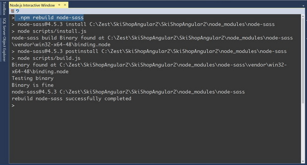
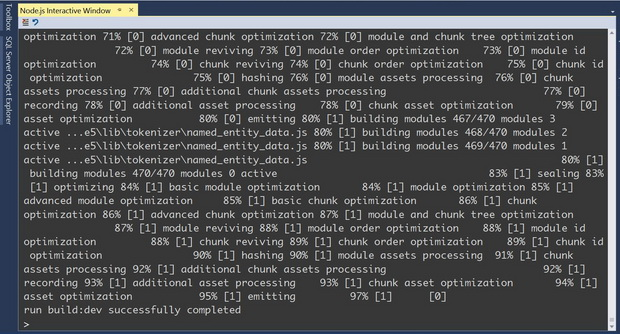
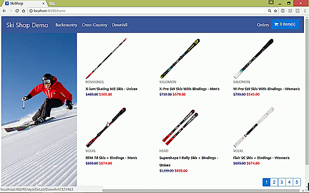
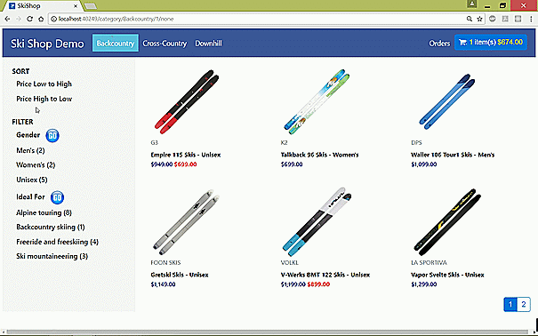
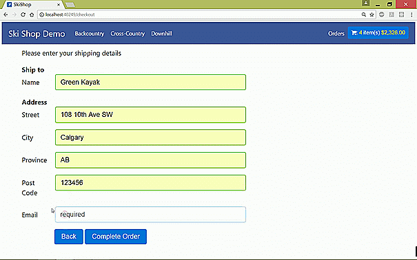
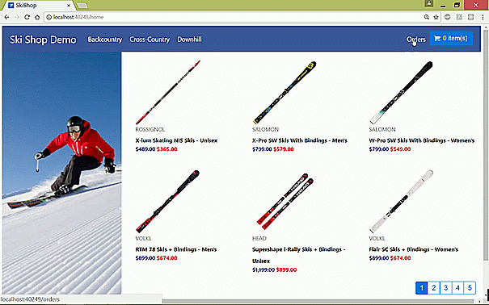
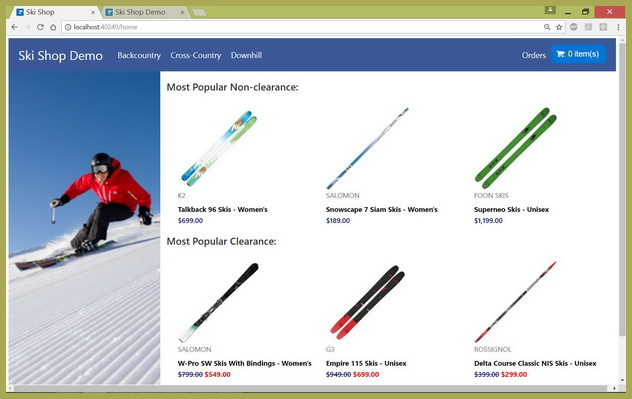

# Angular4 SPA with Server-side Prerendering on ASP NET Core
## Requires
- Visual Studio 2017
## License
- Apache License, Version 2.0
## Technologies
- ASP.NET Core
- EF Core Code First
- Angular4
## Topics
- Single Page Application (SPA)
- Angular4
## Updated
- 07/31/2017
## Description

<h1>Introduction</h1>

This Angular4 Single Page Application is upgraded from&nbsp;<a title="Angular2 SPA Using EF Core on ASP NET Core" href="https://code.msdn.microsoft.com/Angular2-SPA-with-EF-Core-4f4eccf1">https://code.msdn.microsoft.com/Angular2-SPA-with-EF-Core-4f4eccf1</a>.
 Here are some new features : server prerendering with SEO, AOT build, production build and new homepage. &nbsp;&nbsp;

The SPA builds&nbsp;

<ol>
<li>A product navigation system that customers can use to browse skis by &nbsp;category, price, gender, ideal- for, and page
</li><li>A shopping cart where customers can add and remove skis </li><li>A checkout where customers can fill in their shipping details and place their orders
</li><li>An order list where customers can review their orders. </li></ol>

In this sample, we use

<ol>
<li>Webpack to bundle client-side resources (HMR for development) </li><li>Angular4 as front-end platform </li><li>TypeSript as front-end codes (awesome-typescript-loader for JIT compilation, ngtools/webpack for AOT compilation)
</li><li>Bootstrap4 for styling and layout </li><li>ASP.NET Core as server-side platform </li><li>EF Core to create database, seed data, and access data at the back-end &nbsp;
</li><li>server prerendering for better initial load and SEO </li></ol>

Notice: IIS settings in the web.config for angular routing system cannot work with Hot Module Replacement. Change its name from web2.config to web.config when production needed.

&nbsp;

<h1>Prerequirements:</h1>
<ol>
<li>Visual Studio 2017 </li><li>ASP.Net Core 1.1.0 and up </li><li>EF Core </li><li>Node.js </li><li>Angular4 and other additional modules </li></ol>

&nbsp;

<h1>Running the Sample</h1>

It will take a while for VS2017 to automatically install all the npm and .NET dependencies when you first open tbe app. &nbsp;

Step 1: Make JIT/AOT build

TOOLS -&gt; Node.js Tools -&gt; Node.js Interactive Window

.npm rebuild node-sass

&nbsp;

&nbsp;

For JIT:&nbsp;

.npm run build:dev

&nbsp;

For AOT:&nbsp;

.npm run build:aot

&nbsp;

To initially load the home page image properly, please check if the image name in the folder ClientApp/dist is the same as the one in the folder wwwroot/ClientApp/dist. If it's not, copy the image from the first folder to the second one.&nbsp;

&nbsp;

Step 2: Create the database using NuGet Package Manager Console&nbsp;

&nbsp;

<h1><object width="350" height="300" data="data:application/x-silverlight-2," type="application/x-silverlight-2"> <param name="source" value="/Content/Common/videoplayer.xap" /> <param name="initParams" value="deferredLoad=false,duration=0,m=https://i1.code.msdn.s-msft.com/angular4-spa-with-server-4964df03/image/file/173510/1/skishopangular2_2.wmv,autostart=false,autohide=true,showembed=true"
 /> <param name="background" value="#00FFFFFF" /> <param name="minRuntimeVersion" value="3.0.40624.0" /> <param name="enableHtmlAccess" value="true" /> <param name="src" value="https://i1.code.msdn.s-msft.com/angular4-spa-with-server-4964df03/image/file/173510/1/skishopangular2_2.wmv"
 /> <param name="id" value="173510" /> <param name="name" value="SkiShopAngular2_2.wmv" />
 </object>  
<a id="https://i1.code.msdn.s-msft.com/angular4-spa-with-server-4964df03/image/file/173510/1/skishopangular2_2.wmv" href="https://i1.code.msdn.s-msft.com/angular4-spa-with-server-4964df03/image/file/173510/1/skishopangular2_2.wmv">Download video</a></h1>

Or go to

<a href="https://www.youtube.com/watch?v=hfR-ymvgVvY" target="_blank">https://www.youtube.com/watch?v=hfR-ymvgVvY</a>

&nbsp;

&nbsp;

&nbsp;

&nbsp;

&nbsp;

&nbsp;

<h1>Sample Codes</h1>

clearance.attrdirective.ts

&nbsp;

JavaScript

Edit|Remove

js

<pre class="js">import&nbsp;{&nbsp;Directive,&nbsp;Renderer,&nbsp;ElementRef,&nbsp;Input&nbsp;}&nbsp;from&nbsp;'@angular/core';&nbsp;
&nbsp;
@Directive&nbsp;({&nbsp;
&nbsp;&nbsp;&nbsp;&nbsp;selector:&nbsp;'[clearance-class]'&nbsp;
})&nbsp;
export&nbsp;class&nbsp;ClearanceAttrDirective&nbsp;{&nbsp;
&nbsp;&nbsp;&nbsp;&nbsp;nativeElement:&nbsp;Node;&nbsp;&nbsp;
&nbsp;&nbsp;&nbsp;&nbsp;constructor(private&nbsp;renderer:&nbsp;Renderer,&nbsp;private&nbsp;element:&nbsp;ElementRef)&nbsp;{&nbsp;
&nbsp;&nbsp;&nbsp;&nbsp;&nbsp;&nbsp;&nbsp;&nbsp;this.nativeElement&nbsp;=&nbsp;element.nativeElement;&nbsp;
&nbsp;&nbsp;&nbsp;&nbsp;&nbsp;&nbsp;&nbsp;&nbsp;&nbsp;
&nbsp;&nbsp;&nbsp;&nbsp;}&nbsp;
&nbsp;
&nbsp;&nbsp;&nbsp;&nbsp;@Input('clearance-class')&nbsp;
&nbsp;&nbsp;&nbsp;&nbsp;priceCurrent:&nbsp;number;&nbsp;
&nbsp;
&nbsp;&nbsp;&nbsp;&nbsp;@Input('price-regular')&nbsp;
&nbsp;&nbsp;&nbsp;&nbsp;priceRegular:&nbsp;number;&nbsp;
&nbsp;
&nbsp;&nbsp;&nbsp;&nbsp;getString(price:&nbsp;number):&nbsp;string&nbsp;{&nbsp;
&nbsp;&nbsp;&nbsp;&nbsp;&nbsp;&nbsp;&nbsp;&nbsp;return&nbsp;price.toLocaleString(&nbsp;
&nbsp;&nbsp;&nbsp;&nbsp;&nbsp;&nbsp;&nbsp;&nbsp;&nbsp;&nbsp;&nbsp;&nbsp;'en-us',&nbsp;{&nbsp;style:&nbsp;'currency',&nbsp;currency:&nbsp;'USD'&nbsp;});&nbsp;
&nbsp;&nbsp;&nbsp;&nbsp;}&nbsp;
&nbsp;
&nbsp;&nbsp;&nbsp;&nbsp;ngOnInit()&nbsp;{&nbsp;
&nbsp;&nbsp;&nbsp;&nbsp;&nbsp;&nbsp;&nbsp;&nbsp;if&nbsp;(this.priceCurrent&nbsp;&lt;&nbsp;this.priceRegular)&nbsp;{&nbsp;
&nbsp;&nbsp;&nbsp;&nbsp;&nbsp;&nbsp;&nbsp;&nbsp;&nbsp;&nbsp;&nbsp;&nbsp;let&nbsp;del&nbsp;=&nbsp;this.renderer.createElement(this.nativeElement,&nbsp;'del');&nbsp;
&nbsp;&nbsp;&nbsp;&nbsp;&nbsp;&nbsp;&nbsp;&nbsp;&nbsp;&nbsp;&nbsp;&nbsp;this.renderer.setElementStyle(del,&nbsp;'color',&nbsp;'navy');&nbsp;
&nbsp;&nbsp;&nbsp;&nbsp;&nbsp;&nbsp;&nbsp;&nbsp;&nbsp;&nbsp;&nbsp;&nbsp;this.renderer.setElementStyle(del,&nbsp;'font-weight',&nbsp;'500');&nbsp;
&nbsp;&nbsp;&nbsp;&nbsp;&nbsp;&nbsp;&nbsp;&nbsp;&nbsp;&nbsp;&nbsp;&nbsp;this.renderer.createText(del,&nbsp;this.getString(this.priceRegular));&nbsp;
&nbsp;&nbsp;&nbsp;&nbsp;&nbsp;&nbsp;&nbsp;&nbsp;&nbsp;&nbsp;&nbsp;&nbsp;let&nbsp;span&nbsp;=&nbsp;this.renderer.createElement(this.nativeElement,&nbsp;'span');&nbsp;
&nbsp;&nbsp;&nbsp;&nbsp;&nbsp;&nbsp;&nbsp;&nbsp;&nbsp;&nbsp;&nbsp;&nbsp;this.renderer.setElementStyle(span,&nbsp;'color',&nbsp;'red');&nbsp;
&nbsp;&nbsp;&nbsp;&nbsp;&nbsp;&nbsp;&nbsp;&nbsp;&nbsp;&nbsp;&nbsp;&nbsp;this.renderer.setElementStyle(span,&nbsp;'font-weight',&nbsp;'bold');&nbsp;
&nbsp;&nbsp;&nbsp;&nbsp;&nbsp;&nbsp;&nbsp;&nbsp;&nbsp;&nbsp;&nbsp;&nbsp;this.renderer.createText(span,&nbsp;'&nbsp;'&nbsp;&#43;&nbsp;this.getString(this.priceCurrent));&nbsp;
&nbsp;&nbsp;&nbsp;&nbsp;&nbsp;&nbsp;&nbsp;&nbsp;}&nbsp;else&nbsp;{&nbsp;
&nbsp;&nbsp;&nbsp;&nbsp;&nbsp;&nbsp;&nbsp;&nbsp;&nbsp;&nbsp;&nbsp;&nbsp;this.renderer.setElementStyle(this.nativeElement,&nbsp;'color',&nbsp;'navy');&nbsp;
&nbsp;&nbsp;&nbsp;&nbsp;&nbsp;&nbsp;&nbsp;&nbsp;&nbsp;&nbsp;&nbsp;&nbsp;this.renderer.setElementStyle(this.nativeElement,&nbsp;'font-weight',&nbsp;'500');&nbsp;
&nbsp;&nbsp;&nbsp;&nbsp;&nbsp;&nbsp;&nbsp;&nbsp;&nbsp;&nbsp;&nbsp;&nbsp;this.renderer.createText(this.nativeElement,&nbsp;
&nbsp;&nbsp;&nbsp;&nbsp;&nbsp;&nbsp;&nbsp;&nbsp;&nbsp;&nbsp;&nbsp;&nbsp;&nbsp;&nbsp;&nbsp;&nbsp;this.getString(this.priceCurrent));&nbsp;
&nbsp;&nbsp;&nbsp;&nbsp;&nbsp;&nbsp;&nbsp;&nbsp;}&nbsp;
&nbsp;&nbsp;&nbsp;&nbsp;}&nbsp;
&nbsp;
&nbsp;
}</pre>

&nbsp;

&nbsp;

&nbsp;

<ul>
</ul>
<h1>More Information</h1>

For more information on Angular 4 server prerendering on ASP NET Core, please go check:

<a title="aspnetcore-angular2-universal by Mark Pieszak" href="https://github.com/MarkPieszak/aspnetcore-angular2-universal" target="_blank">https://github.com/MarkPieszak/aspnetcore-angular2-universal&nbsp;</a>

<a href="https://github.com/angular/universal/tree/master/modules/ng-aspnetcore-engine" target="_blank">https://github.com/angular/universal/tree/master/modules/ng-aspnetcore-engine</a>

