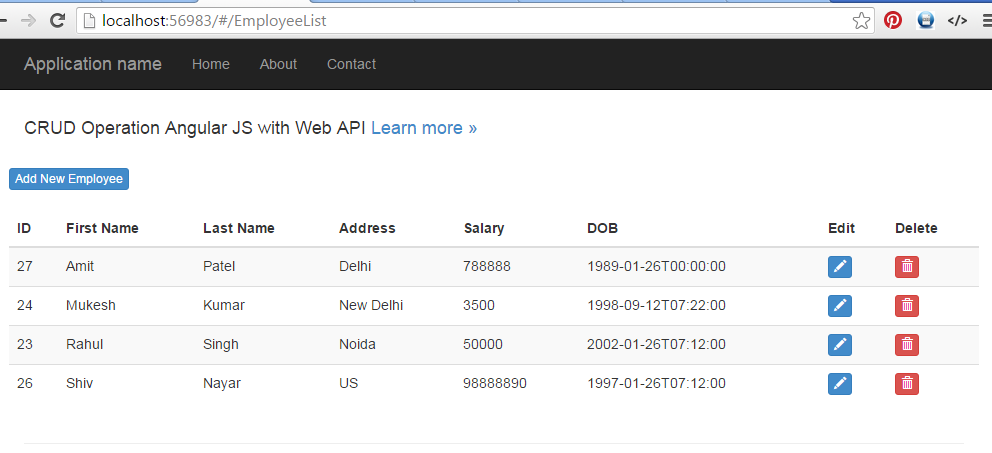

# AngularJS CRUD Operations With Web API
## Requires
- Visual Studio 2015
## License
- MIT
## Technologies
- ASP.NET MVC
- Entity Framework Code First
- ASP.NET Web API
- AngularJS
## Topics
- Code Sample
- CRUD
## Updated
- 08/22/2016
## Description

<h1>Introduction</h1>

In this article, I will demonstrate about&nbsp;Angular JS CRUD&nbsp;operations example with&nbsp;Web API. Web API will be used as a service to get the data from database and share the data to angular js app. For this demonstration,
 I have used&nbsp;Code First Approch.

In this example, I will show you how to make routing in AngularJS and perform&nbsp;CRUD [Create, Read, Update and Delete] Operations. All the operations will be perform with different template page [html page].

<h1>Building the Sample</h1>
<h5>Create Asp.Net Application</h5>

To create new application, open&nbsp;Visual Studio 2015&nbsp;and Select&nbsp;File | New&nbsp;and then&nbsp;Project. It will open aNew Project&nbsp;window, choose&nbsp;Web&nbsp;tab inside&nbsp;Visual
 C#&nbsp;and then choose&nbsp;Asp.Net Web Application. You can choose your project location and click to&nbsp;OK.

From the&nbsp;New Asp.Net Project&nbsp;window, just choose&nbsp;Web API&nbsp;project and click to&nbsp;OK.

Description

<h6>Create Model and Context Classes</h6>

Following is the employee model, where all the properties have defined for employee. I have used Table attribute for table name.

C#

Edit|Remove

csharp
<pre class="hidden">using System;
using System.ComponentModel.DataAnnotations;
using System.ComponentModel.DataAnnotations.Schema;

namespace CRUDwithAngularJSAndWebAPI.Models
{
    [Table(&quot;Employees&quot;)]
    public class EmployeeModel
    {
        [Key]
        public int EmployeeID { get; set; }

        [Required(ErrorMessage =&quot;First Name Required&quot;)]
        [StringLength(maximumLength:20, MinimumLength =3, ErrorMessage =&quot;Name should be between 3 to 20 characters&quot;)]
        public string FirstName { get; set; }
        public string LastName { get; set; }
        public string Address { get; set; }
        public float Salary { get; set; }
        public DateTime DOB { get; set; }
       
    }
}</pre>

<pre class="csharp">using&nbsp;System;&nbsp;
using&nbsp;System.ComponentModel.DataAnnotations;&nbsp;
using&nbsp;System.ComponentModel.DataAnnotations.Schema;&nbsp;
&nbsp;
namespace&nbsp;CRUDwithAngularJSAndWebAPI.Models&nbsp;
{&nbsp;
&nbsp;&nbsp;&nbsp;&nbsp;[Table(&quot;Employees&quot;)]&nbsp;
&nbsp;&nbsp;&nbsp;&nbsp;public&nbsp;class&nbsp;EmployeeModel&nbsp;
&nbsp;&nbsp;&nbsp;&nbsp;{&nbsp;
&nbsp;&nbsp;&nbsp;&nbsp;&nbsp;&nbsp;&nbsp;&nbsp;[Key]&nbsp;
&nbsp;&nbsp;&nbsp;&nbsp;&nbsp;&nbsp;&nbsp;&nbsp;public&nbsp;int&nbsp;EmployeeID&nbsp;{&nbsp;get;&nbsp;set;&nbsp;}&nbsp;
&nbsp;
&nbsp;&nbsp;&nbsp;&nbsp;&nbsp;&nbsp;&nbsp;&nbsp;[Required(ErrorMessage&nbsp;=&quot;First&nbsp;Name&nbsp;Required&quot;)]&nbsp;
&nbsp;&nbsp;&nbsp;&nbsp;&nbsp;&nbsp;&nbsp;&nbsp;[StringLength(maximumLength:20,&nbsp;MinimumLength&nbsp;=3,&nbsp;ErrorMessage&nbsp;=&quot;Name&nbsp;should&nbsp;be&nbsp;between&nbsp;3&nbsp;to&nbsp;20&nbsp;characters&quot;)]&nbsp;
&nbsp;&nbsp;&nbsp;&nbsp;&nbsp;&nbsp;&nbsp;&nbsp;public&nbsp;string&nbsp;FirstName&nbsp;{&nbsp;get;&nbsp;set;&nbsp;}&nbsp;
&nbsp;&nbsp;&nbsp;&nbsp;&nbsp;&nbsp;&nbsp;&nbsp;public&nbsp;string&nbsp;LastName&nbsp;{&nbsp;get;&nbsp;set;&nbsp;}&nbsp;
&nbsp;&nbsp;&nbsp;&nbsp;&nbsp;&nbsp;&nbsp;&nbsp;public&nbsp;string&nbsp;Address&nbsp;{&nbsp;get;&nbsp;set;&nbsp;}&nbsp;
&nbsp;&nbsp;&nbsp;&nbsp;&nbsp;&nbsp;&nbsp;&nbsp;public&nbsp;float&nbsp;Salary&nbsp;{&nbsp;get;&nbsp;set;&nbsp;}&nbsp;
&nbsp;&nbsp;&nbsp;&nbsp;&nbsp;&nbsp;&nbsp;&nbsp;public&nbsp;DateTime&nbsp;DOB&nbsp;{&nbsp;get;&nbsp;set;&nbsp;}&nbsp;
&nbsp;&nbsp;&nbsp;&nbsp;&nbsp;&nbsp;&nbsp;&nbsp;
&nbsp;&nbsp;&nbsp;&nbsp;}&nbsp;
}</pre>

<h1>

C#

Edit|Remove

csharp
<pre class="hidden">using System.Data.Entity;
namespace CRUDwithAngularJSAndWebAPI.Models
{
    public class DataAccessContext : DbContext
    {
        public DataAccessContext() : base(&quot;testconnection&quot;)
        {
        }

        public DbSet&lt;EmployeeModel&gt; Employees { get; set; }       
    }
}</pre>

<pre class="js">using&nbsp;System.Data.Entity;&nbsp;
namespace&nbsp;CRUDwithAngularJSAndWebAPI.Models&nbsp;
{&nbsp;
&nbsp;&nbsp;&nbsp;&nbsp;public&nbsp;class&nbsp;DataAccessContext&nbsp;:&nbsp;DbContext&nbsp;
&nbsp;&nbsp;&nbsp;&nbsp;{&nbsp;
&nbsp;&nbsp;&nbsp;&nbsp;&nbsp;&nbsp;&nbsp;&nbsp;public&nbsp;DataAccessContext()&nbsp;:&nbsp;base(&quot;testconnection&quot;)&nbsp;
&nbsp;&nbsp;&nbsp;&nbsp;&nbsp;&nbsp;&nbsp;&nbsp;{}&nbsp;
&nbsp;
&nbsp;&nbsp;&nbsp;&nbsp;&nbsp;&nbsp;&nbsp;&nbsp;public&nbsp;DbSet&lt;EmployeeModel&gt;&nbsp;Employees&nbsp;{&nbsp;get;&nbsp;set;&nbsp;}}}</pre>

&nbsp;API Controller

C#

Edit|Remove

csharp
<pre class="hidden">using CRUDwithAngularJSAndWebAPI.Models;
using CRUDwithAngularJSAndWebAPI.ViewModel;
using System;
using System.Collections.Generic;
using System.Globalization;
using System.Linq;
using System.Net;
using System.Net.Http;
using System.Web.Http;

namespace CRUDwithAngularJSAndWebAPI.Controllers
{
    
    public class EmployeeController : ApiController
    {
        
        DataAccessContext context = new DataAccessContext();

        //Get All Employees
        [HttpGet]        
        public IEnumerable&lt;EmployeeViewModel&gt; GetAllEmployee()
        {

            var data = context.Employees.ToList().OrderBy(x=&gt;x.FirstName);
            var result = data.Select(x =&gt; new EmployeeViewModel()
            {
                EmployeeID = x.EmployeeID,
                FirstName = x.FirstName,
                LastName = x.LastName,
                Address = x.Address,
                Salary = x.Salary,
                DOB = x.DOB
        });
            return result.ToList();
        }

        //Get the single employee data
        [HttpGet]
        public EmployeeViewModel GetEmployee(int Id)
        {
            var data = context.Employees.Where(x =&gt; x.EmployeeID == Id).FirstOrDefault();
            if (data != null)
            {
                EmployeeViewModel employee = new EmployeeViewModel();
                employee.EmployeeID = data.EmployeeID;
                employee.FirstName = data.FirstName;
                employee.LastName = data.LastName;
                employee.Address = data.Address;
                employee.Salary = data.Salary;
                employee.DOB = data.DOB;

                return employee;
            }
            else
            {
                throw new HttpResponseException(Request.CreateResponse(HttpStatusCode.NotFound));
            }
        }

        //Add new employee

        [HttpPost]
        public HttpResponseMessage AddEmployee(EmployeeViewModel model)
        {
            try
            {
                if (ModelState.IsValid)
                {
                    EmployeeModel emp = new EmployeeModel();
                    emp.FirstName = model.FirstName;
                    emp.LastName = model.LastName;
                    emp.Address = model.Address;
                    emp.Salary = model.Salary;
                    emp.DOB = Convert.ToDateTime(model.DOB.ToString(&quot;yyyy-MM-dd HH:mm:ss.fff&quot;));
                 
                    context.Employees.Add(emp);
                    var result = context.SaveChanges();
                    if (result &gt; 0)
                    {
                        return Request.CreateResponse(HttpStatusCode.Created, &quot;Submitted Successfully&quot;);
                    }
                    else
                    {
                        return Request.CreateErrorResponse(HttpStatusCode.BadRequest, &quot;Something wrong !&quot;);
                    }
                }
                else
                {
                    return Request.CreateErrorResponse(HttpStatusCode.BadRequest, &quot;Something wrong !&quot;);
                }
            }
            catch (Exception ex)
            {

                return Request.CreateErrorResponse(HttpStatusCode.BadRequest, &quot;Something wrong !&quot;, ex);
            }
        }

        //Update the employee

        [HttpPut]
        public HttpResponseMessage UpdateEmployee(EmployeeViewModel model)
        {
            try
            {
                if (ModelState.IsValid)
                {
                    EmployeeModel emp = new EmployeeModel();
                    emp.EmployeeID = model.EmployeeID;
                    emp.FirstName = model.FirstName;
                    emp.LastName = model.LastName;
                    emp.Address = model.Address;
                    emp.Salary = model.Salary;
                    emp.DOB = Convert.ToDateTime(model.DOB.ToString(&quot;yyyy-MM-dd HH:mm:ss.fff&quot;));
                 
                    context.Entry(emp).State = System.Data.Entity.EntityState.Modified;
                    var result = context.SaveChanges();
                    if (result &gt; 0)
                    {
                        return Request.CreateResponse(HttpStatusCode.OK, &quot;Updated Successfully&quot;);
                    }
                    else
                    {
                        return Request.CreateErrorResponse(HttpStatusCode.NotFound, &quot;Something wrong !&quot;);
                    }
                }
                else
                {
                    return Request.CreateErrorResponse(HttpStatusCode.BadRequest, &quot;Something wrong !&quot;);
                }
            }
            catch (Exception ex)
            {

                return Request.CreateErrorResponse(HttpStatusCode.BadRequest, &quot;Something wrong !&quot;, ex);
            }
        }

        //Delete the employee

        [HttpDelete]
        public HttpResponseMessage DeleteEmployee(int Id)
        {
            EmployeeModel emp = new EmployeeModel();
            emp = context.Employees.Find(Id);
            if (emp != null)
            {
                context.Employees.Remove(emp);
                context.SaveChanges();
                return Request.CreateResponse(HttpStatusCode.OK, emp);
            }
            else
            {
                return Request.CreateErrorResponse(HttpStatusCode.NotFound, &quot;Something wrong !&quot;);
            }
        }
    }
}</pre>

<pre class="js">using&nbsp;CRUDwithAngularJSAndWebAPI.Models;&nbsp;
using&nbsp;CRUDwithAngularJSAndWebAPI.ViewModel;&nbsp;
using&nbsp;System;&nbsp;
using&nbsp;System.Collections.Generic;&nbsp;
using&nbsp;System.Globalization;&nbsp;
using&nbsp;System.Linq;&nbsp;
using&nbsp;System.Net;&nbsp;
using&nbsp;System.Net.Http;&nbsp;
using&nbsp;System.Web.Http;&nbsp;
&nbsp;
&nbsp;
namespace&nbsp;CRUDwithAngularJSAndWebAPI.Controllers&nbsp;
{&nbsp;
&nbsp;&nbsp;&nbsp;&nbsp;&nbsp;
&nbsp;&nbsp;&nbsp;&nbsp;public&nbsp;class&nbsp;EmployeeController&nbsp;:&nbsp;ApiController&nbsp;
&nbsp;&nbsp;&nbsp;&nbsp;{&nbsp;
&nbsp;&nbsp;&nbsp;&nbsp;&nbsp;&nbsp;&nbsp;&nbsp;&nbsp;
&nbsp;&nbsp;&nbsp;&nbsp;&nbsp;&nbsp;&nbsp;&nbsp;DataAccessContext&nbsp;context&nbsp;=&nbsp;new&nbsp;DataAccessContext();&nbsp;
&nbsp;
&nbsp;&nbsp;&nbsp;&nbsp;&nbsp;&nbsp;&nbsp;&nbsp;//Get&nbsp;All&nbsp;Employees&nbsp;
&nbsp;&nbsp;&nbsp;&nbsp;&nbsp;&nbsp;&nbsp;&nbsp;[HttpGet]&nbsp;&nbsp;&nbsp;&nbsp;&nbsp;&nbsp;&nbsp;&nbsp;&nbsp;
&nbsp;&nbsp;&nbsp;&nbsp;&nbsp;&nbsp;&nbsp;&nbsp;public&nbsp;IEnumerable&lt;EmployeeViewModel&gt;&nbsp;GetAllEmployee()&nbsp;
&nbsp;&nbsp;&nbsp;&nbsp;&nbsp;&nbsp;&nbsp;&nbsp;{var&nbsp;data&nbsp;=&nbsp;context.Employees.ToList().OrderBy(x=&gt;x.FirstName);&nbsp;
&nbsp;&nbsp;&nbsp;&nbsp;&nbsp;&nbsp;&nbsp;&nbsp;&nbsp;&nbsp;&nbsp;&nbsp;var&nbsp;result&nbsp;=&nbsp;data.Select(x&nbsp;=&gt;&nbsp;new&nbsp;EmployeeViewModel()&nbsp;
&nbsp;&nbsp;&nbsp;&nbsp;&nbsp;&nbsp;&nbsp;&nbsp;&nbsp;&nbsp;&nbsp;&nbsp;{&nbsp;
&nbsp;&nbsp;&nbsp;&nbsp;&nbsp;&nbsp;&nbsp;&nbsp;&nbsp;&nbsp;&nbsp;&nbsp;&nbsp;&nbsp;&nbsp;&nbsp;EmployeeID&nbsp;=&nbsp;x.EmployeeID,&nbsp;
&nbsp;&nbsp;&nbsp;&nbsp;&nbsp;&nbsp;&nbsp;&nbsp;&nbsp;&nbsp;&nbsp;&nbsp;&nbsp;&nbsp;&nbsp;&nbsp;FirstName&nbsp;=&nbsp;x.FirstName,&nbsp;
&nbsp;&nbsp;&nbsp;&nbsp;&nbsp;&nbsp;&nbsp;&nbsp;&nbsp;&nbsp;&nbsp;&nbsp;&nbsp;&nbsp;&nbsp;&nbsp;LastName&nbsp;=&nbsp;x.LastName,&nbsp;
&nbsp;&nbsp;&nbsp;&nbsp;&nbsp;&nbsp;&nbsp;&nbsp;&nbsp;&nbsp;&nbsp;&nbsp;&nbsp;&nbsp;&nbsp;&nbsp;Address&nbsp;=&nbsp;x.Address,&nbsp;
&nbsp;&nbsp;&nbsp;&nbsp;&nbsp;&nbsp;&nbsp;&nbsp;&nbsp;&nbsp;&nbsp;&nbsp;&nbsp;&nbsp;&nbsp;&nbsp;Salary&nbsp;=&nbsp;x.Salary,&nbsp;
&nbsp;&nbsp;&nbsp;&nbsp;&nbsp;&nbsp;&nbsp;&nbsp;&nbsp;&nbsp;&nbsp;&nbsp;&nbsp;&nbsp;&nbsp;&nbsp;DOB&nbsp;=&nbsp;x.DOB&nbsp;
&nbsp;&nbsp;&nbsp;&nbsp;&nbsp;&nbsp;&nbsp;&nbsp;});&nbsp;
&nbsp;&nbsp;&nbsp;&nbsp;&nbsp;&nbsp;&nbsp;&nbsp;&nbsp;&nbsp;&nbsp;&nbsp;return&nbsp;result.ToList();&nbsp;
&nbsp;&nbsp;&nbsp;&nbsp;&nbsp;&nbsp;&nbsp;&nbsp;}//Get&nbsp;the&nbsp;single&nbsp;employee&nbsp;data&nbsp;
&nbsp;&nbsp;&nbsp;&nbsp;&nbsp;&nbsp;&nbsp;&nbsp;[HttpGet]&nbsp;
&nbsp;&nbsp;&nbsp;&nbsp;&nbsp;&nbsp;&nbsp;&nbsp;public&nbsp;EmployeeViewModel&nbsp;GetEmployee(int&nbsp;Id)&nbsp;
&nbsp;&nbsp;&nbsp;&nbsp;&nbsp;&nbsp;&nbsp;&nbsp;{var&nbsp;data&nbsp;=&nbsp;context.Employees.Where(x&nbsp;=&gt;&nbsp;x.EmployeeID&nbsp;==&nbsp;Id).FirstOrDefault();&nbsp;
&nbsp;&nbsp;&nbsp;&nbsp;&nbsp;&nbsp;&nbsp;&nbsp;&nbsp;&nbsp;&nbsp;&nbsp;if&nbsp;(data&nbsp;!=&nbsp;null)&nbsp;
&nbsp;&nbsp;&nbsp;&nbsp;&nbsp;&nbsp;&nbsp;&nbsp;&nbsp;&nbsp;&nbsp;&nbsp;{&nbsp;
&nbsp;&nbsp;&nbsp;&nbsp;&nbsp;&nbsp;&nbsp;&nbsp;&nbsp;&nbsp;&nbsp;&nbsp;&nbsp;&nbsp;&nbsp;&nbsp;EmployeeViewModel&nbsp;employee&nbsp;=&nbsp;new&nbsp;EmployeeViewModel();&nbsp;
&nbsp;&nbsp;&nbsp;&nbsp;&nbsp;&nbsp;&nbsp;&nbsp;&nbsp;&nbsp;&nbsp;&nbsp;&nbsp;&nbsp;&nbsp;&nbsp;employee.EmployeeID&nbsp;=&nbsp;data.EmployeeID;&nbsp;
&nbsp;&nbsp;&nbsp;&nbsp;&nbsp;&nbsp;&nbsp;&nbsp;&nbsp;&nbsp;&nbsp;&nbsp;&nbsp;&nbsp;&nbsp;&nbsp;employee.FirstName&nbsp;=&nbsp;data.FirstName;&nbsp;
&nbsp;&nbsp;&nbsp;&nbsp;&nbsp;&nbsp;&nbsp;&nbsp;&nbsp;&nbsp;&nbsp;&nbsp;&nbsp;&nbsp;&nbsp;&nbsp;employee.LastName&nbsp;=&nbsp;data.LastName;&nbsp;
&nbsp;&nbsp;&nbsp;&nbsp;&nbsp;&nbsp;&nbsp;&nbsp;&nbsp;&nbsp;&nbsp;&nbsp;&nbsp;&nbsp;&nbsp;&nbsp;employee.Address&nbsp;=&nbsp;data.Address;&nbsp;
&nbsp;&nbsp;&nbsp;&nbsp;&nbsp;&nbsp;&nbsp;&nbsp;&nbsp;&nbsp;&nbsp;&nbsp;&nbsp;&nbsp;&nbsp;&nbsp;employee.Salary&nbsp;=&nbsp;data.Salary;&nbsp;
&nbsp;&nbsp;&nbsp;&nbsp;&nbsp;&nbsp;&nbsp;&nbsp;&nbsp;&nbsp;&nbsp;&nbsp;&nbsp;&nbsp;&nbsp;&nbsp;employee.DOB&nbsp;=&nbsp;data.DOB;&nbsp;
&nbsp;
&nbsp;&nbsp;&nbsp;&nbsp;&nbsp;&nbsp;&nbsp;&nbsp;&nbsp;&nbsp;&nbsp;&nbsp;&nbsp;&nbsp;&nbsp;&nbsp;return&nbsp;employee;&nbsp;
&nbsp;&nbsp;&nbsp;&nbsp;&nbsp;&nbsp;&nbsp;&nbsp;&nbsp;&nbsp;&nbsp;&nbsp;}else{thrownew&nbsp;HttpResponseException(Request.CreateResponse(HttpStatusCode.NotFound));&nbsp;
&nbsp;&nbsp;&nbsp;&nbsp;&nbsp;&nbsp;&nbsp;&nbsp;&nbsp;&nbsp;&nbsp;&nbsp;}}//Add&nbsp;new&nbsp;employee&nbsp;
&nbsp;
&nbsp;&nbsp;&nbsp;&nbsp;&nbsp;&nbsp;&nbsp;&nbsp;[HttpPost]&nbsp;
&nbsp;&nbsp;&nbsp;&nbsp;&nbsp;&nbsp;&nbsp;&nbsp;public&nbsp;HttpResponseMessage&nbsp;AddEmployee(EmployeeViewModel&nbsp;model)&nbsp;
&nbsp;&nbsp;&nbsp;&nbsp;&nbsp;&nbsp;&nbsp;&nbsp;{try{if&nbsp;(ModelState.IsValid)&nbsp;
&nbsp;&nbsp;&nbsp;&nbsp;&nbsp;&nbsp;&nbsp;&nbsp;&nbsp;&nbsp;&nbsp;&nbsp;&nbsp;&nbsp;&nbsp;&nbsp;{&nbsp;
&nbsp;&nbsp;&nbsp;&nbsp;&nbsp;&nbsp;&nbsp;&nbsp;&nbsp;&nbsp;&nbsp;&nbsp;&nbsp;&nbsp;&nbsp;&nbsp;&nbsp;&nbsp;&nbsp;&nbsp;EmployeeModel&nbsp;emp&nbsp;=&nbsp;new&nbsp;EmployeeModel();&nbsp;
&nbsp;&nbsp;&nbsp;&nbsp;&nbsp;&nbsp;&nbsp;&nbsp;&nbsp;&nbsp;&nbsp;&nbsp;&nbsp;&nbsp;&nbsp;&nbsp;&nbsp;&nbsp;&nbsp;&nbsp;emp.FirstName&nbsp;=&nbsp;model.FirstName;&nbsp;
&nbsp;&nbsp;&nbsp;&nbsp;&nbsp;&nbsp;&nbsp;&nbsp;&nbsp;&nbsp;&nbsp;&nbsp;&nbsp;&nbsp;&nbsp;&nbsp;&nbsp;&nbsp;&nbsp;&nbsp;emp.LastName&nbsp;=&nbsp;model.LastName;&nbsp;
&nbsp;&nbsp;&nbsp;&nbsp;&nbsp;&nbsp;&nbsp;&nbsp;&nbsp;&nbsp;&nbsp;&nbsp;&nbsp;&nbsp;&nbsp;&nbsp;&nbsp;&nbsp;&nbsp;&nbsp;emp.Address&nbsp;=&nbsp;model.Address;&nbsp;
&nbsp;&nbsp;&nbsp;&nbsp;&nbsp;&nbsp;&nbsp;&nbsp;&nbsp;&nbsp;&nbsp;&nbsp;&nbsp;&nbsp;&nbsp;&nbsp;&nbsp;&nbsp;&nbsp;&nbsp;emp.Salary&nbsp;=&nbsp;model.Salary;&nbsp;
&nbsp;&nbsp;&nbsp;&nbsp;&nbsp;&nbsp;&nbsp;&nbsp;&nbsp;&nbsp;&nbsp;&nbsp;&nbsp;&nbsp;&nbsp;&nbsp;&nbsp;&nbsp;&nbsp;&nbsp;emp.DOB&nbsp;=&nbsp;Convert.ToDateTime(model.DOB.ToString(&quot;yyyy-MM-dd&nbsp;HH:mm:ss.fff&quot;));&nbsp;
&nbsp;&nbsp;&nbsp;&nbsp;&nbsp;&nbsp;&nbsp;&nbsp;&nbsp;&nbsp;&nbsp;&nbsp;&nbsp;&nbsp;&nbsp;&nbsp;&nbsp;&nbsp;
&nbsp;&nbsp;&nbsp;&nbsp;&nbsp;&nbsp;&nbsp;&nbsp;&nbsp;&nbsp;&nbsp;&nbsp;&nbsp;&nbsp;&nbsp;&nbsp;&nbsp;&nbsp;&nbsp;&nbsp;context.Employees.Add(emp);&nbsp;
&nbsp;&nbsp;&nbsp;&nbsp;&nbsp;&nbsp;&nbsp;&nbsp;&nbsp;&nbsp;&nbsp;&nbsp;&nbsp;&nbsp;&nbsp;&nbsp;&nbsp;&nbsp;&nbsp;&nbsp;var&nbsp;result&nbsp;=&nbsp;context.SaveChanges();&nbsp;
&nbsp;&nbsp;&nbsp;&nbsp;&nbsp;&nbsp;&nbsp;&nbsp;&nbsp;&nbsp;&nbsp;&nbsp;&nbsp;&nbsp;&nbsp;&nbsp;&nbsp;&nbsp;&nbsp;&nbsp;if&nbsp;(result&nbsp;&gt;&nbsp;0)&nbsp;
&nbsp;&nbsp;&nbsp;&nbsp;&nbsp;&nbsp;&nbsp;&nbsp;&nbsp;&nbsp;&nbsp;&nbsp;&nbsp;&nbsp;&nbsp;&nbsp;&nbsp;&nbsp;&nbsp;&nbsp;{return&nbsp;Request.CreateResponse(HttpStatusCode.Created,&nbsp;&quot;Submitted&nbsp;Successfully&quot;);&nbsp;
&nbsp;&nbsp;&nbsp;&nbsp;&nbsp;&nbsp;&nbsp;&nbsp;&nbsp;&nbsp;&nbsp;&nbsp;&nbsp;&nbsp;&nbsp;&nbsp;&nbsp;&nbsp;&nbsp;&nbsp;}else{return&nbsp;Request.CreateErrorResponse(HttpStatusCode.BadRequest,&nbsp;&quot;Something&nbsp;wrong&nbsp;!&quot;);&nbsp;
&nbsp;&nbsp;&nbsp;&nbsp;&nbsp;&nbsp;&nbsp;&nbsp;&nbsp;&nbsp;&nbsp;&nbsp;&nbsp;&nbsp;&nbsp;&nbsp;&nbsp;&nbsp;&nbsp;&nbsp;}}else{return&nbsp;Request.CreateErrorResponse(HttpStatusCode.BadRequest,&nbsp;&quot;Something&nbsp;wrong&nbsp;!&quot;);&nbsp;
&nbsp;&nbsp;&nbsp;&nbsp;&nbsp;&nbsp;&nbsp;&nbsp;&nbsp;&nbsp;&nbsp;&nbsp;&nbsp;&nbsp;&nbsp;&nbsp;}}catch&nbsp;(Exception&nbsp;ex)&nbsp;
&nbsp;&nbsp;&nbsp;&nbsp;&nbsp;&nbsp;&nbsp;&nbsp;&nbsp;&nbsp;&nbsp;&nbsp;{return&nbsp;Request.CreateErrorResponse(HttpStatusCode.BadRequest,&nbsp;&quot;Something&nbsp;wrong&nbsp;!&quot;,&nbsp;ex);&nbsp;
&nbsp;&nbsp;&nbsp;&nbsp;&nbsp;&nbsp;&nbsp;&nbsp;&nbsp;&nbsp;&nbsp;&nbsp;}}//Update&nbsp;the&nbsp;employee&nbsp;
&nbsp;
&nbsp;&nbsp;&nbsp;&nbsp;&nbsp;&nbsp;&nbsp;&nbsp;[HttpPut]&nbsp;
&nbsp;&nbsp;&nbsp;&nbsp;&nbsp;&nbsp;&nbsp;&nbsp;public&nbsp;HttpResponseMessage&nbsp;UpdateEmployee(EmployeeViewModel&nbsp;model)&nbsp;
&nbsp;&nbsp;&nbsp;&nbsp;&nbsp;&nbsp;&nbsp;&nbsp;{try{if&nbsp;(ModelState.IsValid)&nbsp;
&nbsp;&nbsp;&nbsp;&nbsp;&nbsp;&nbsp;&nbsp;&nbsp;&nbsp;&nbsp;&nbsp;&nbsp;&nbsp;&nbsp;&nbsp;&nbsp;{&nbsp;
&nbsp;&nbsp;&nbsp;&nbsp;&nbsp;&nbsp;&nbsp;&nbsp;&nbsp;&nbsp;&nbsp;&nbsp;&nbsp;&nbsp;&nbsp;&nbsp;&nbsp;&nbsp;&nbsp;&nbsp;EmployeeModel&nbsp;emp&nbsp;=&nbsp;new&nbsp;EmployeeModel();&nbsp;
&nbsp;&nbsp;&nbsp;&nbsp;&nbsp;&nbsp;&nbsp;&nbsp;&nbsp;&nbsp;&nbsp;&nbsp;&nbsp;&nbsp;&nbsp;&nbsp;&nbsp;&nbsp;&nbsp;&nbsp;emp.EmployeeID&nbsp;=&nbsp;model.EmployeeID;&nbsp;
&nbsp;&nbsp;&nbsp;&nbsp;&nbsp;&nbsp;&nbsp;&nbsp;&nbsp;&nbsp;&nbsp;&nbsp;&nbsp;&nbsp;&nbsp;&nbsp;&nbsp;&nbsp;&nbsp;&nbsp;emp.FirstName&nbsp;=&nbsp;model.FirstName;&nbsp;
&nbsp;&nbsp;&nbsp;&nbsp;&nbsp;&nbsp;&nbsp;&nbsp;&nbsp;&nbsp;&nbsp;&nbsp;&nbsp;&nbsp;&nbsp;&nbsp;&nbsp;&nbsp;&nbsp;&nbsp;emp.LastName&nbsp;=&nbsp;model.LastName;&nbsp;
&nbsp;&nbsp;&nbsp;&nbsp;&nbsp;&nbsp;&nbsp;&nbsp;&nbsp;&nbsp;&nbsp;&nbsp;&nbsp;&nbsp;&nbsp;&nbsp;&nbsp;&nbsp;&nbsp;&nbsp;emp.Address&nbsp;=&nbsp;model.Address;&nbsp;
&nbsp;&nbsp;&nbsp;&nbsp;&nbsp;&nbsp;&nbsp;&nbsp;&nbsp;&nbsp;&nbsp;&nbsp;&nbsp;&nbsp;&nbsp;&nbsp;&nbsp;&nbsp;&nbsp;&nbsp;emp.Salary&nbsp;=&nbsp;model.Salary;&nbsp;
&nbsp;&nbsp;&nbsp;&nbsp;&nbsp;&nbsp;&nbsp;&nbsp;&nbsp;&nbsp;&nbsp;&nbsp;&nbsp;&nbsp;&nbsp;&nbsp;&nbsp;&nbsp;&nbsp;&nbsp;emp.DOB&nbsp;=&nbsp;Convert.ToDateTime(model.DOB.ToString(&quot;yyyy-MM-dd&nbsp;HH:mm:ss.fff&quot;));&nbsp;
&nbsp;&nbsp;&nbsp;&nbsp;&nbsp;&nbsp;&nbsp;&nbsp;&nbsp;&nbsp;&nbsp;&nbsp;&nbsp;&nbsp;&nbsp;&nbsp;&nbsp;&nbsp;
&nbsp;&nbsp;&nbsp;&nbsp;&nbsp;&nbsp;&nbsp;&nbsp;&nbsp;&nbsp;&nbsp;&nbsp;&nbsp;&nbsp;&nbsp;&nbsp;&nbsp;&nbsp;&nbsp;&nbsp;context.Entry(emp).State&nbsp;=&nbsp;System.Data.Entity.EntityState.Modified;&nbsp;
&nbsp;&nbsp;&nbsp;&nbsp;&nbsp;&nbsp;&nbsp;&nbsp;&nbsp;&nbsp;&nbsp;&nbsp;&nbsp;&nbsp;&nbsp;&nbsp;&nbsp;&nbsp;&nbsp;&nbsp;var&nbsp;result&nbsp;=&nbsp;context.SaveChanges();&nbsp;
&nbsp;&nbsp;&nbsp;&nbsp;&nbsp;&nbsp;&nbsp;&nbsp;&nbsp;&nbsp;&nbsp;&nbsp;&nbsp;&nbsp;&nbsp;&nbsp;&nbsp;&nbsp;&nbsp;&nbsp;if&nbsp;(result&nbsp;&gt;&nbsp;0)&nbsp;
&nbsp;&nbsp;&nbsp;&nbsp;&nbsp;&nbsp;&nbsp;&nbsp;&nbsp;&nbsp;&nbsp;&nbsp;&nbsp;&nbsp;&nbsp;&nbsp;&nbsp;&nbsp;&nbsp;&nbsp;{return&nbsp;Request.CreateResponse(HttpStatusCode.OK,&nbsp;&quot;Updated&nbsp;Successfully&quot;);&nbsp;
&nbsp;&nbsp;&nbsp;&nbsp;&nbsp;&nbsp;&nbsp;&nbsp;&nbsp;&nbsp;&nbsp;&nbsp;&nbsp;&nbsp;&nbsp;&nbsp;&nbsp;&nbsp;&nbsp;&nbsp;}else{return&nbsp;Request.CreateErrorResponse(HttpStatusCode.NotFound,&nbsp;&quot;Something&nbsp;wrong&nbsp;!&quot;);&nbsp;
&nbsp;&nbsp;&nbsp;&nbsp;&nbsp;&nbsp;&nbsp;&nbsp;&nbsp;&nbsp;&nbsp;&nbsp;&nbsp;&nbsp;&nbsp;&nbsp;&nbsp;&nbsp;&nbsp;&nbsp;}}else{return&nbsp;Request.CreateErrorResponse(HttpStatusCode.BadRequest,&nbsp;&quot;Something&nbsp;wrong&nbsp;!&quot;);&nbsp;
&nbsp;&nbsp;&nbsp;&nbsp;&nbsp;&nbsp;&nbsp;&nbsp;&nbsp;&nbsp;&nbsp;&nbsp;&nbsp;&nbsp;&nbsp;&nbsp;}}catch&nbsp;(Exception&nbsp;ex)&nbsp;
&nbsp;&nbsp;&nbsp;&nbsp;&nbsp;&nbsp;&nbsp;&nbsp;&nbsp;&nbsp;&nbsp;&nbsp;{return&nbsp;Request.CreateErrorResponse(HttpStatusCode.BadRequest,&nbsp;&quot;Something&nbsp;wrong&nbsp;!&quot;,&nbsp;ex);&nbsp;
&nbsp;&nbsp;&nbsp;&nbsp;&nbsp;&nbsp;&nbsp;&nbsp;&nbsp;&nbsp;&nbsp;&nbsp;}}//Delete&nbsp;the&nbsp;employee&nbsp;
&nbsp;
&nbsp;&nbsp;&nbsp;&nbsp;&nbsp;&nbsp;&nbsp;&nbsp;[HttpDelete]&nbsp;
&nbsp;&nbsp;&nbsp;&nbsp;&nbsp;&nbsp;&nbsp;&nbsp;public&nbsp;HttpResponseMessage&nbsp;DeleteEmployee(int&nbsp;Id)&nbsp;
&nbsp;&nbsp;&nbsp;&nbsp;&nbsp;&nbsp;&nbsp;&nbsp;{&nbsp;
&nbsp;&nbsp;&nbsp;&nbsp;&nbsp;&nbsp;&nbsp;&nbsp;&nbsp;&nbsp;&nbsp;&nbsp;EmployeeModel&nbsp;emp&nbsp;=&nbsp;new&nbsp;EmployeeModel();&nbsp;
&nbsp;&nbsp;&nbsp;&nbsp;&nbsp;&nbsp;&nbsp;&nbsp;&nbsp;&nbsp;&nbsp;&nbsp;emp&nbsp;=&nbsp;context.Employees.Find(Id);&nbsp;
&nbsp;&nbsp;&nbsp;&nbsp;&nbsp;&nbsp;&nbsp;&nbsp;&nbsp;&nbsp;&nbsp;&nbsp;if&nbsp;(emp&nbsp;!=&nbsp;null)&nbsp;
&nbsp;&nbsp;&nbsp;&nbsp;&nbsp;&nbsp;&nbsp;&nbsp;&nbsp;&nbsp;&nbsp;&nbsp;{&nbsp;
&nbsp;&nbsp;&nbsp;&nbsp;&nbsp;&nbsp;&nbsp;&nbsp;&nbsp;&nbsp;&nbsp;&nbsp;&nbsp;&nbsp;&nbsp;&nbsp;context.Employees.Remove(emp);&nbsp;
&nbsp;&nbsp;&nbsp;&nbsp;&nbsp;&nbsp;&nbsp;&nbsp;&nbsp;&nbsp;&nbsp;&nbsp;&nbsp;&nbsp;&nbsp;&nbsp;context.SaveChanges();&nbsp;
&nbsp;&nbsp;&nbsp;&nbsp;&nbsp;&nbsp;&nbsp;&nbsp;&nbsp;&nbsp;&nbsp;&nbsp;&nbsp;&nbsp;&nbsp;&nbsp;return&nbsp;Request.CreateResponse(HttpStatusCode.OK,&nbsp;emp);&nbsp;
&nbsp;&nbsp;&nbsp;&nbsp;&nbsp;&nbsp;&nbsp;&nbsp;&nbsp;&nbsp;&nbsp;&nbsp;}else{return&nbsp;Request.CreateErrorResponse(HttpStatusCode.NotFound,&nbsp;&quot;Something&nbsp;wrong&nbsp;!&quot;);&nbsp;
&nbsp;&nbsp;&nbsp;&nbsp;&nbsp;&nbsp;&nbsp;&nbsp;&nbsp;&nbsp;&nbsp;&nbsp;}}}}</pre>

</h1>
<h1>Create Angular JS App</h1>

Now it is time to create angular js&nbsp;[Single Page Application]&nbsp;in shore SPA. Here we will be used API service to perform CRUD operations using angular js. Create a folder named with &quot;App&quot; and inside this folder create two
 JS files like&nbsp;&quot;app.js&quot;&nbsp;and&nbsp;&quot;EmployeeController.js&quot;.

<h1>

Angular JS Controller

</h1>

EmployeeController.js

Now to perform CRUD operations on client side, we need to add&nbsp;EmployeeController.js&nbsp;file which will hanlde all the CRUD opertions with&nbsp;http services.

<h1>

JavaScript

Edit|Remove

js
<pre class="hidden">app.controller(&quot;EmployeeController&quot;, ['$scope', '$http', '$location', '$routeParams', function ($scope, $http, $location, $routeParams) {
    $scope.ListOfEmployee;
    $scope.Status;

    $scope.Close = function () {
        $location.path('/EmployeeList');
    }    

    //Get all employee and bind with html table
    $http.get(&quot;api/employee/GetAllEmployee&quot;).success(function (data) {
        $scope.ListOfEmployee = data;

    })
    .error(function (data) {
        $scope.Status = &quot;data not found&quot;;
    });

    //Add new employee
    $scope.Add = function () {
        var employeeData = {
            FirstName: $scope.FirstName,
            LastName: $scope.LastName,
            Address: $scope.Address,
            Salary: $scope.Salary,
            DOB: $scope.DOB,
           // DepartmentID: $scope.DepartmentID
        };
        debugger;
        $http.post(&quot;api/employee/AddEmployee&quot;, employeeData).success(function (data) {
            $location.path('/EmployeeList');
        }).error(function (data) {
            console.log(data);
            $scope.error = &quot;Something wrong when adding new employee &quot; &#43; data.ExceptionMessage;
        });
    }

    //Fill the employee records for update

    if ($routeParams.empId) {
        $scope.Id = $routeParams.empId;

        $http.get('api/employee/GetEmployee/' &#43; $scope.Id).success(function (data) {
            $scope.FirstName = data.FirstName;
            $scope.LastName = data.LastName;
            $scope.Address = data.Address;
            $scope.Salary = data.Salary;
            $scope.DOB = data.DOB
            //$scope.DepartmentID = data.DepartmentID
        });

    }

    //Update the employee records
    $scope.Update = function () {
        debugger;
        var employeeData = {
            EmployeeID: $scope.Id,
            FirstName: $scope.FirstName,
            LastName: $scope.LastName,
            Address: $scope.Address,
            Salary: $scope.Salary,
            DOB: $scope.DOB
            //DepartmentID: $scope.DepartmentID
        };
        if ($scope.Id &gt; 0) {
            
            $http.put(&quot;api/employee/UpdateEmployee&quot;, employeeData).success(function (data) {
                $location.path('/EmployeeList');
            }).error(function (data) {
                console.log(data);
                $scope.error = &quot;Something wrong when adding updating employee &quot; &#43; data.ExceptionMessage;
            });
        }
    }

    //Delete the selected employee from the list
    $scope.Delete = function () {
        if ($scope.Id &gt; 0) {
            
            $http.delete(&quot;api/employee/DeleteEmployee/&quot; &#43; $scope.Id).success(function (data) {
                $location.path('/EmployeeList');
            }).error(function (data) {
                console.log(data);
                $scope.error = &quot;Something wrong when adding Deleting employee &quot; &#43; data.ExceptionMessage;
            });
        }

    }
}]);
</pre>

<pre class="js">app.controller(&quot;EmployeeController&quot;,&nbsp;['$scope',&nbsp;'$http',&nbsp;'$location',&nbsp;'$routeParams',&nbsp;function&nbsp;($scope,&nbsp;$http,&nbsp;$location,&nbsp;$routeParams)&nbsp;{&nbsp;
&nbsp;&nbsp;&nbsp;&nbsp;$scope.ListOfEmployee;&nbsp;
&nbsp;&nbsp;&nbsp;&nbsp;$scope.Status;&nbsp;
&nbsp;
&nbsp;&nbsp;&nbsp;&nbsp;$scope.Close&nbsp;=&nbsp;function&nbsp;()&nbsp;{&nbsp;
&nbsp;&nbsp;&nbsp;&nbsp;&nbsp;&nbsp;&nbsp;&nbsp;$location.path('/EmployeeList');&nbsp;
&nbsp;&nbsp;&nbsp;&nbsp;}//Get&nbsp;all&nbsp;employee&nbsp;and&nbsp;bind&nbsp;with&nbsp;html&nbsp;table&nbsp;
&nbsp;&nbsp;&nbsp;&nbsp;$http.get(&quot;api/employee/GetAllEmployee&quot;).success(function&nbsp;(data)&nbsp;{&nbsp;
&nbsp;&nbsp;&nbsp;&nbsp;&nbsp;&nbsp;&nbsp;&nbsp;$scope.ListOfEmployee&nbsp;=&nbsp;data;&nbsp;
&nbsp;
&nbsp;&nbsp;&nbsp;&nbsp;})&nbsp;
&nbsp;&nbsp;&nbsp;&nbsp;.error(function&nbsp;(data)&nbsp;{&nbsp;
&nbsp;&nbsp;&nbsp;&nbsp;&nbsp;&nbsp;&nbsp;&nbsp;$scope.Status&nbsp;=&nbsp;&quot;data&nbsp;not&nbsp;found&quot;;&nbsp;
&nbsp;&nbsp;&nbsp;&nbsp;});&nbsp;
&nbsp;
&nbsp;&nbsp;&nbsp;&nbsp;//Add&nbsp;new&nbsp;employee&nbsp;
&nbsp;&nbsp;&nbsp;&nbsp;$scope.Add&nbsp;=&nbsp;function&nbsp;()&nbsp;{var&nbsp;employeeData&nbsp;=&nbsp;{&nbsp;
&nbsp;&nbsp;&nbsp;&nbsp;&nbsp;&nbsp;&nbsp;&nbsp;&nbsp;&nbsp;&nbsp;&nbsp;FirstName:&nbsp;$scope.FirstName,&nbsp;
&nbsp;&nbsp;&nbsp;&nbsp;&nbsp;&nbsp;&nbsp;&nbsp;&nbsp;&nbsp;&nbsp;&nbsp;LastName:&nbsp;$scope.LastName,&nbsp;
&nbsp;&nbsp;&nbsp;&nbsp;&nbsp;&nbsp;&nbsp;&nbsp;&nbsp;&nbsp;&nbsp;&nbsp;Address:&nbsp;$scope.Address,&nbsp;
&nbsp;&nbsp;&nbsp;&nbsp;&nbsp;&nbsp;&nbsp;&nbsp;&nbsp;&nbsp;&nbsp;&nbsp;Salary:&nbsp;$scope.Salary,&nbsp;
&nbsp;&nbsp;&nbsp;&nbsp;&nbsp;&nbsp;&nbsp;&nbsp;&nbsp;&nbsp;&nbsp;&nbsp;DOB:&nbsp;$scope.DOB,&nbsp;
&nbsp;&nbsp;&nbsp;&nbsp;&nbsp;&nbsp;&nbsp;&nbsp;&nbsp;&nbsp;&nbsp;//&nbsp;DepartmentID:&nbsp;$scope.DepartmentID};&nbsp;
&nbsp;&nbsp;&nbsp;&nbsp;&nbsp;&nbsp;&nbsp;&nbsp;debugger;&nbsp;
&nbsp;&nbsp;&nbsp;&nbsp;&nbsp;&nbsp;&nbsp;&nbsp;$http.post(&quot;api/employee/AddEmployee&quot;,&nbsp;employeeData).success(function&nbsp;(data)&nbsp;{&nbsp;
&nbsp;&nbsp;&nbsp;&nbsp;&nbsp;&nbsp;&nbsp;&nbsp;&nbsp;&nbsp;&nbsp;&nbsp;$location.path('/EmployeeList');&nbsp;
&nbsp;&nbsp;&nbsp;&nbsp;&nbsp;&nbsp;&nbsp;&nbsp;}).error(function&nbsp;(data)&nbsp;{&nbsp;
&nbsp;&nbsp;&nbsp;&nbsp;&nbsp;&nbsp;&nbsp;&nbsp;&nbsp;&nbsp;&nbsp;&nbsp;console.log(data);&nbsp;
&nbsp;&nbsp;&nbsp;&nbsp;&nbsp;&nbsp;&nbsp;&nbsp;&nbsp;&nbsp;&nbsp;&nbsp;$scope.error&nbsp;=&nbsp;&quot;Something&nbsp;wrong&nbsp;when&nbsp;adding&nbsp;new&nbsp;employee&nbsp;&quot;&nbsp;&#43;&nbsp;data.ExceptionMessage;&nbsp;
&nbsp;&nbsp;&nbsp;&nbsp;&nbsp;&nbsp;&nbsp;&nbsp;});&nbsp;
&nbsp;&nbsp;&nbsp;&nbsp;}//Fill&nbsp;the&nbsp;employee&nbsp;records&nbsp;for&nbsp;updateif&nbsp;($routeParams.empId)&nbsp;{&nbsp;
&nbsp;&nbsp;&nbsp;&nbsp;&nbsp;&nbsp;&nbsp;&nbsp;$scope.Id&nbsp;=&nbsp;$routeParams.empId;&nbsp;
&nbsp;
&nbsp;&nbsp;&nbsp;&nbsp;&nbsp;&nbsp;&nbsp;&nbsp;$http.get('api/employee/GetEmployee/'&nbsp;&#43;&nbsp;$scope.Id).success(function&nbsp;(data)&nbsp;{&nbsp;
&nbsp;&nbsp;&nbsp;&nbsp;&nbsp;&nbsp;&nbsp;&nbsp;&nbsp;&nbsp;&nbsp;&nbsp;$scope.FirstName&nbsp;=&nbsp;data.FirstName;&nbsp;
&nbsp;&nbsp;&nbsp;&nbsp;&nbsp;&nbsp;&nbsp;&nbsp;&nbsp;&nbsp;&nbsp;&nbsp;$scope.LastName&nbsp;=&nbsp;data.LastName;&nbsp;
&nbsp;&nbsp;&nbsp;&nbsp;&nbsp;&nbsp;&nbsp;&nbsp;&nbsp;&nbsp;&nbsp;&nbsp;$scope.Address&nbsp;=&nbsp;data.Address;&nbsp;
&nbsp;&nbsp;&nbsp;&nbsp;&nbsp;&nbsp;&nbsp;&nbsp;&nbsp;&nbsp;&nbsp;&nbsp;$scope.Salary&nbsp;=&nbsp;data.Salary;&nbsp;
&nbsp;&nbsp;&nbsp;&nbsp;&nbsp;&nbsp;&nbsp;&nbsp;&nbsp;&nbsp;&nbsp;&nbsp;$scope.DOB&nbsp;=&nbsp;data.DOB&nbsp;
&nbsp;&nbsp;&nbsp;&nbsp;&nbsp;&nbsp;&nbsp;&nbsp;&nbsp;&nbsp;&nbsp;&nbsp;//$scope.DepartmentID&nbsp;=&nbsp;data.DepartmentID});&nbsp;
&nbsp;
&nbsp;&nbsp;&nbsp;&nbsp;}//Update&nbsp;the&nbsp;employee&nbsp;records&nbsp;
&nbsp;&nbsp;&nbsp;&nbsp;$scope.Update&nbsp;=&nbsp;function&nbsp;()&nbsp;{&nbsp;
&nbsp;&nbsp;&nbsp;&nbsp;&nbsp;&nbsp;&nbsp;&nbsp;debugger;&nbsp;
&nbsp;&nbsp;&nbsp;&nbsp;&nbsp;&nbsp;&nbsp;&nbsp;var&nbsp;employeeData&nbsp;=&nbsp;{&nbsp;
&nbsp;&nbsp;&nbsp;&nbsp;&nbsp;&nbsp;&nbsp;&nbsp;&nbsp;&nbsp;&nbsp;&nbsp;EmployeeID:&nbsp;$scope.Id,&nbsp;
&nbsp;&nbsp;&nbsp;&nbsp;&nbsp;&nbsp;&nbsp;&nbsp;&nbsp;&nbsp;&nbsp;&nbsp;FirstName:&nbsp;$scope.FirstName,&nbsp;
&nbsp;&nbsp;&nbsp;&nbsp;&nbsp;&nbsp;&nbsp;&nbsp;&nbsp;&nbsp;&nbsp;&nbsp;LastName:&nbsp;$scope.LastName,&nbsp;
&nbsp;&nbsp;&nbsp;&nbsp;&nbsp;&nbsp;&nbsp;&nbsp;&nbsp;&nbsp;&nbsp;&nbsp;Address:&nbsp;$scope.Address,&nbsp;
&nbsp;&nbsp;&nbsp;&nbsp;&nbsp;&nbsp;&nbsp;&nbsp;&nbsp;&nbsp;&nbsp;&nbsp;Salary:&nbsp;$scope.Salary,&nbsp;
&nbsp;&nbsp;&nbsp;&nbsp;&nbsp;&nbsp;&nbsp;&nbsp;&nbsp;&nbsp;&nbsp;&nbsp;DOB:&nbsp;$scope.DOB&nbsp;
&nbsp;&nbsp;&nbsp;&nbsp;&nbsp;&nbsp;&nbsp;&nbsp;&nbsp;&nbsp;&nbsp;&nbsp;//DepartmentID:&nbsp;$scope.DepartmentID&nbsp;
&nbsp;&nbsp;&nbsp;&nbsp;&nbsp;&nbsp;&nbsp;&nbsp;};&nbsp;
&nbsp;&nbsp;&nbsp;&nbsp;&nbsp;&nbsp;&nbsp;&nbsp;if&nbsp;($scope.Id&nbsp;&gt;&nbsp;0)&nbsp;{&nbsp;
&nbsp;&nbsp;&nbsp;&nbsp;&nbsp;&nbsp;&nbsp;&nbsp;&nbsp;&nbsp;&nbsp;&nbsp;&nbsp;
&nbsp;&nbsp;&nbsp;&nbsp;&nbsp;&nbsp;&nbsp;&nbsp;&nbsp;&nbsp;&nbsp;&nbsp;$http.put(&quot;api/employee/UpdateEmployee&quot;,&nbsp;employeeData).success(function&nbsp;(data)&nbsp;{&nbsp;
&nbsp;&nbsp;&nbsp;&nbsp;&nbsp;&nbsp;&nbsp;&nbsp;&nbsp;&nbsp;&nbsp;&nbsp;&nbsp;&nbsp;&nbsp;&nbsp;$location.path('/EmployeeList');&nbsp;
&nbsp;&nbsp;&nbsp;&nbsp;&nbsp;&nbsp;&nbsp;&nbsp;&nbsp;&nbsp;&nbsp;&nbsp;}).error(function&nbsp;(data)&nbsp;{&nbsp;
&nbsp;&nbsp;&nbsp;&nbsp;&nbsp;&nbsp;&nbsp;&nbsp;&nbsp;&nbsp;&nbsp;&nbsp;&nbsp;&nbsp;&nbsp;&nbsp;console.log(data);&nbsp;
&nbsp;&nbsp;&nbsp;&nbsp;&nbsp;&nbsp;&nbsp;&nbsp;&nbsp;&nbsp;&nbsp;&nbsp;&nbsp;&nbsp;&nbsp;&nbsp;$scope.error&nbsp;=&nbsp;&quot;Something&nbsp;wrong&nbsp;when&nbsp;adding&nbsp;updating&nbsp;employee&nbsp;&quot;&nbsp;&#43;&nbsp;data.ExceptionMessage;&nbsp;
&nbsp;&nbsp;&nbsp;&nbsp;&nbsp;&nbsp;&nbsp;&nbsp;&nbsp;&nbsp;&nbsp;&nbsp;});&nbsp;
&nbsp;&nbsp;&nbsp;&nbsp;&nbsp;&nbsp;&nbsp;&nbsp;}}//Delete&nbsp;the&nbsp;selected&nbsp;employee&nbsp;from&nbsp;the&nbsp;list&nbsp;
&nbsp;&nbsp;&nbsp;&nbsp;$scope.Delete&nbsp;=&nbsp;function&nbsp;()&nbsp;{if&nbsp;($scope.Id&nbsp;&gt;&nbsp;0)&nbsp;{&nbsp;
&nbsp;&nbsp;&nbsp;&nbsp;&nbsp;&nbsp;&nbsp;&nbsp;&nbsp;&nbsp;&nbsp;&nbsp;&nbsp;
&nbsp;&nbsp;&nbsp;&nbsp;&nbsp;&nbsp;&nbsp;&nbsp;&nbsp;&nbsp;&nbsp;&nbsp;$http.delete(&quot;api/employee/DeleteEmployee/&quot;&nbsp;&#43;&nbsp;$scope.Id).success(function&nbsp;(data)&nbsp;{&nbsp;
&nbsp;&nbsp;&nbsp;&nbsp;&nbsp;&nbsp;&nbsp;&nbsp;&nbsp;&nbsp;&nbsp;&nbsp;&nbsp;&nbsp;&nbsp;&nbsp;$location.path('/EmployeeList');&nbsp;
&nbsp;&nbsp;&nbsp;&nbsp;&nbsp;&nbsp;&nbsp;&nbsp;&nbsp;&nbsp;&nbsp;&nbsp;}).error(function&nbsp;(data)&nbsp;{&nbsp;
&nbsp;&nbsp;&nbsp;&nbsp;&nbsp;&nbsp;&nbsp;&nbsp;&nbsp;&nbsp;&nbsp;&nbsp;&nbsp;&nbsp;&nbsp;&nbsp;console.log(data);&nbsp;
&nbsp;&nbsp;&nbsp;&nbsp;&nbsp;&nbsp;&nbsp;&nbsp;&nbsp;&nbsp;&nbsp;&nbsp;&nbsp;&nbsp;&nbsp;&nbsp;$scope.error&nbsp;=&nbsp;&quot;Something&nbsp;wrong&nbsp;when&nbsp;adding&nbsp;Deleting&nbsp;employee&nbsp;&quot;&nbsp;&#43;&nbsp;data.ExceptionMessage;&nbsp;
&nbsp;&nbsp;&nbsp;&nbsp;&nbsp;&nbsp;&nbsp;&nbsp;&nbsp;&nbsp;&nbsp;&nbsp;});&nbsp;
&nbsp;&nbsp;&nbsp;&nbsp;&nbsp;&nbsp;&nbsp;&nbsp;}}}]);&nbsp;
</pre>

</h1>
<h1>More Information</h1>

<em>For more information see full article :&nbsp;<a title="Dotnet-tutorial.com" href="http://www.dotnet-tutorial.com/articles/angularjs/angularjs-crud-operations-with-web-api" target="_blank">http://www.dotnet-tutorial.com/articles/angularjs/angularjs-crud-operations-with-web-api</a></em>

