# AngularJS Shopping Cart Using MVC and WCF Rest Service
## Requires
- Visual Studio 2013
## License
- MIT
## Technologies
- WCF
- Entity Framework
- MVC
- AngularJS
- WCF Rest Service
## Topics
- WCF
- ASP.NET MVC
- Entity Framework
- AngularJS
- WCF Rest Service
## Updated
- 11/13/2016
## Description

<h1>Introduction</h1>

<em></em>

This article will
 explain in detail how to create a simple Online Shopping Cart using AngularJS and WCF Rest Service. This article will explain: 

<ol style="font:14px/21px Roboto,sans-serif; outline:0px; color:#333333; text-transform:none; text-indent:0px; letter-spacing:normal; word-spacing:0px; white-space:normal; widows:1; background-color:#ffffff">
<li style="outline:0px">How to create a WCF Rest service and retrieve and insert data from a database.&nbsp;
</li><li style="outline:0px">How to install the AngularJS Package into a MVC application.&nbsp;
</li><li style="outline:0px">How to upload an image to our root folder using AngularJs and MVC.
</li><li style="outline:0px">Select and Insert Item Details from a database using AngularJS and WCF Rest.
</li><li style="outline:0px">How to use a WCS service in AngularJS to create our own simple Online Shopping Application that includes:
</li></ol>
<ul style="font:14px/21px Roboto,sans-serif; outline:0px; color:#333333; text-transform:none; text-indent:0px; letter-spacing:normal; word-spacing:0px; white-space:normal; widows:1; background-color:#ffffff">
<li style="outline:0px">Display Items with Filter and sorting options. </li><li style="outline:0px">Select and Add Items to Shopping Cart. </li><li style="outline:0px">Display Total Price, Total Qty and Grand Price Total in Shopping Cart.
</li><li style="outline:0px">Upload Image to Server root folder </li><li style="outline:0px">Insert and select data from database. </li><li style="outline:0px">Display Shopping cart Details. </li></ul>

<strong style="outline:0px; color:#333333; text-transform:none; line-height:21px; text-indent:0px; letter-spacing:normal; font-family:Roboto,sans-serif; font-size:14px; font-style:normal; font-variant:normal; word-spacing:0px; white-space:normal; widows:1; background-color:#ffffff">Note:</strong>&nbsp;the
 prerequisites are Visual Studio 2013 (if you don't have Visual Studio 2013, you can download it from the&nbsp;<a href="http://www.visualstudio.com/en-us/products/visual-studio-community-vs" target="_blank" style="font:14px/21px Roboto,sans-serif; outline:0px; color:#0000ff; text-transform:none; text-indent:0px; letter-spacing:normal; text-decoration:none; word-spacing:0px; white-space:normal; widows:1; background-color:#ffffff">Microsoft</a>.(This
 project was developed using Visual Studio 2013 ,You can also download latest Visual Studio 2015 and open the same project for upgrade).

<em></em>Here we
 can see some basics and reference links for Windows Communication Foundation (WCF). WCF is a framework for building service-oriented applications. 
<strong style="outline:0px; color:#333333; text-transform:none; line-height:21px; text-indent:0px; letter-spacing:normal; font-family:Roboto,sans-serif; font-size:14px; font-style:normal; font-variant:normal; word-spacing:0px; white-space:normal; widows:1; background-color:#ffffff"> 
Service-oriented application:&nbsp;</strong>Using
 this protocol the service can be shared and used over a network. 
 
For example let's consider
 now we are working on a project and we need to create some common database function and those functions need to be used in multiple projects and the projects are in multiple places and connected via a network such as the internet. 
 
In this case we can create
 a WCF service and we can write all our common database functions in our WCF service class. We can deploy our WCF in IIS and use the URL in our application to do DB functions. In the code part let's see how to create a WCF REST service and use it in our AngularJS
 application.&nbsp; 
 
If you are interested
 in reading more details about WCF then kindly go to this&nbsp;<a href="https://msdn.microsoft.com/en-in/library/dd203052.aspx" target="_blank" style="font:14px/21px Roboto,sans-serif; outline:0px; color:#0000ff; text-transform:none; text-indent:0px; letter-spacing:normal; text-decoration:none; word-spacing:0px; white-space:normal; widows:1; background-color:#ffffff">link</a>. 
 
<strong style="outline:0px; color:#333333; text-transform:none; line-height:21px; text-indent:0px; letter-spacing:normal; font-family:Roboto,sans-serif; font-size:14px; font-style:normal; font-variant:normal; word-spacing:0px; white-space:normal; widows:1; background-color:#ffffff">AngularJS&nbsp; 
</strong> 
We might be be familiar
 with what Model, View and View Model (MVVM) is and what Model, View and Controller (MVC) is. AngularJS is a JavaScript framework that is purely based on HTML CSS and JavaScript. 
 
Similar to the MVC and
 MVVM patterns AngularJS uses the Model, View and Whatever (MVW) pattern. 
 
In our example I have
 used a Model, View and Service. In the code part let's see how to install and create AngularJS in our MVC application.&nbsp; 
 
If you are interested
 in reading more details about AngularJS then kindly go to this link. 

<h1>Building the Sample</h1>

<em><strong style="outline:0px; color:#333333; text-transform:none; line-height:21px; text-indent:0px; letter-spacing:normal; font-family:Roboto,sans-serif; font-size:14px; font-style:normal; font-variant:normal; word-spacing:0px; white-space:normal; widows:1; background-color:#ffffff">Create
 Database and Table 
</strong> 
We will create a ItemDetails
 table under the Database ShoppingDB. The following is the script to create a database, table and sample insert query. Run this script in your SQL Server. I have used SQL Server 2012.</em>

<em></em>&nbsp;

<em>

SQL

Edit|Remove

mysql

<pre class="js">--&nbsp;=============================================&nbsp;&nbsp;&nbsp;&nbsp;&nbsp;&nbsp;&nbsp;&nbsp;&nbsp;&nbsp;&nbsp;&nbsp;&nbsp;&nbsp;&nbsp;&nbsp;&nbsp;&nbsp;&nbsp;&nbsp;&nbsp;&nbsp;&nbsp;&nbsp;&nbsp;&nbsp;&nbsp;&nbsp;&nbsp;&nbsp;&nbsp;&nbsp;&nbsp;
--&nbsp;Author&nbsp;&nbsp;&nbsp;&nbsp;&nbsp;&nbsp;:&nbsp;Shanu&nbsp;&nbsp;&nbsp;&nbsp;&nbsp;&nbsp;&nbsp;&nbsp;&nbsp;&nbsp;&nbsp;&nbsp;&nbsp;&nbsp;&nbsp;&nbsp;&nbsp;&nbsp;&nbsp;&nbsp;&nbsp;&nbsp;&nbsp;&nbsp;&nbsp;&nbsp;&nbsp;&nbsp;&nbsp;&nbsp;&nbsp;&nbsp;&nbsp;
--&nbsp;Create&nbsp;date&nbsp;:&nbsp;2015-03-20&nbsp;&nbsp;&nbsp;&nbsp;&nbsp;&nbsp;&nbsp;&nbsp;&nbsp;&nbsp;&nbsp;&nbsp;&nbsp;&nbsp;&nbsp;&nbsp;&nbsp;&nbsp;&nbsp;&nbsp;&nbsp;&nbsp;&nbsp;&nbsp;&nbsp;&nbsp;&nbsp;&nbsp;&nbsp;&nbsp;&nbsp;&nbsp;&nbsp;
--&nbsp;Description&nbsp;:&nbsp;To&nbsp;Create&nbsp;Database,Table&nbsp;and&nbsp;Sample&nbsp;Insert&nbsp;Query&nbsp;&nbsp;&nbsp;&nbsp;&nbsp;&nbsp;&nbsp;&nbsp;&nbsp;&nbsp;&nbsp;&nbsp;&nbsp;&nbsp;&nbsp;&nbsp;&nbsp;&nbsp;&nbsp;&nbsp;&nbsp;&nbsp;&nbsp;&nbsp;&nbsp;&nbsp;&nbsp;&nbsp;&nbsp;&nbsp;
--&nbsp;Latest&nbsp;&nbsp;&nbsp;&nbsp;&nbsp;&nbsp;&nbsp;&nbsp;&nbsp;&nbsp;&nbsp;&nbsp;&nbsp;&nbsp;&nbsp;&nbsp;&nbsp;&nbsp;&nbsp;&nbsp;&nbsp;&nbsp;&nbsp;&nbsp;&nbsp;&nbsp;&nbsp;&nbsp;&nbsp;&nbsp;&nbsp;&nbsp;&nbsp;
--&nbsp;Modifier&nbsp;&nbsp;&nbsp;&nbsp;:&nbsp;Shanu&nbsp;&nbsp;&nbsp;&nbsp;&nbsp;&nbsp;&nbsp;&nbsp;&nbsp;&nbsp;&nbsp;&nbsp;&nbsp;&nbsp;&nbsp;&nbsp;&nbsp;&nbsp;&nbsp;&nbsp;&nbsp;&nbsp;&nbsp;&nbsp;&nbsp;&nbsp;&nbsp;&nbsp;&nbsp;&nbsp;&nbsp;&nbsp;&nbsp;
--&nbsp;Modify&nbsp;date&nbsp;:&nbsp;2015-03-20&nbsp;&nbsp;&nbsp;&nbsp;&nbsp;&nbsp;&nbsp;&nbsp;&nbsp;&nbsp;&nbsp;&nbsp;&nbsp;&nbsp;&nbsp;&nbsp;&nbsp;&nbsp;&nbsp;&nbsp;&nbsp;&nbsp;&nbsp;&nbsp;&nbsp;&nbsp;&nbsp;&nbsp;&nbsp;
--&nbsp;=============================================&nbsp;
--Script&nbsp;to&nbsp;create&nbsp;DB,Table&nbsp;and&nbsp;sample&nbsp;Insert&nbsp;data&nbsp;
USE&nbsp;MASTER&nbsp;
GO&nbsp;
--&nbsp;1)&nbsp;Check&nbsp;for&nbsp;the&nbsp;Database&nbsp;Exists&nbsp;.If&nbsp;the&nbsp;database&nbsp;is&nbsp;exist&nbsp;then&nbsp;drop&nbsp;and&nbsp;create&nbsp;new&nbsp;DB&nbsp;
IF&nbsp;EXISTS&nbsp;(SELECT&nbsp;[name]&nbsp;FROM&nbsp;sys.databases&nbsp;WHERE&nbsp;[name]&nbsp;=&nbsp;'ShoppingDB'&nbsp;)&nbsp;
DROP&nbsp;DATABASE&nbsp;ShoppingDB&nbsp;
GO&nbsp;
&nbsp;
CREATE&nbsp;DATABASE&nbsp;ShoppingDB&nbsp;
GO&nbsp;
&nbsp;
USE&nbsp;ShoppingDB&nbsp;
GO&nbsp;
&nbsp;
--&nbsp;1)&nbsp;////////////&nbsp;ItemDetails&nbsp;table&nbsp;
--&nbsp;Create&nbsp;Table&nbsp;ItemDetails,This&nbsp;table&nbsp;will&nbsp;be&nbsp;used&nbsp;to&nbsp;store&nbsp;the&nbsp;details&nbsp;like&nbsp;Item&nbsp;Information&nbsp;&nbsp;
&nbsp;
IF&nbsp;EXISTS&nbsp;(&nbsp;SELECT&nbsp;[name]&nbsp;FROM&nbsp;sys.tables&nbsp;WHERE&nbsp;[name]&nbsp;=&nbsp;'ItemDetails'&nbsp;)&nbsp;
DROP&nbsp;TABLE&nbsp;ItemDetails&nbsp;
GO&nbsp;
&nbsp;
CREATE&nbsp;TABLE&nbsp;ItemDetails&nbsp;
(&nbsp;
&nbsp;&nbsp;&nbsp;Item_ID&nbsp;int&nbsp;identity(1,1),&nbsp;
&nbsp;&nbsp;&nbsp;Item_Name&nbsp;VARCHAR(100)&nbsp;&nbsp;NOT&nbsp;NULL,&nbsp;
&nbsp;&nbsp;&nbsp;Item_Price&nbsp;int&nbsp;&nbsp;NOT&nbsp;NULL,&nbsp;
&nbsp;&nbsp;&nbsp;Image_Name&nbsp;VARCHAR(100)&nbsp;&nbsp;NOT&nbsp;NULL,&nbsp;
&nbsp;&nbsp;&nbsp;Description&nbsp;VARCHAR(100)&nbsp;&nbsp;NOT&nbsp;NULL,&nbsp;
&nbsp;&nbsp;&nbsp;AddedBy&nbsp;VARCHAR(100)&nbsp;&nbsp;NOT&nbsp;NULL,&nbsp;
CONSTRAINT&nbsp;[PK_ItemDetails]&nbsp;PRIMARY&nbsp;KEY&nbsp;CLUSTERED&nbsp;&nbsp;&nbsp;&nbsp;&nbsp;&nbsp;&nbsp;
(&nbsp;&nbsp;&nbsp;&nbsp;&nbsp;&nbsp;
&nbsp;&nbsp;[Item_ID]&nbsp;ASC&nbsp;&nbsp;&nbsp;&nbsp;&nbsp;&nbsp;
)WITH&nbsp;(PAD_INDEX&nbsp;&nbsp;=&nbsp;OFF,&nbsp;STATISTICS_NORECOMPUTE&nbsp;&nbsp;=&nbsp;OFF,&nbsp;IGNORE_DUP_KEY&nbsp;=&nbsp;OFF,&nbsp;ALLOW_ROW_LOCKS&nbsp;&nbsp;=&nbsp;ON,&nbsp;ALLOW_PAGE_LOCKS&nbsp;&nbsp;=&nbsp;ON)&nbsp;ON&nbsp;[PRIMARY]&nbsp;&nbsp;&nbsp;&nbsp;&nbsp;&nbsp;
)&nbsp;ON&nbsp;[PRIMARY]&nbsp;&nbsp;&nbsp;&nbsp;
&nbsp;
GO&nbsp;
&nbsp;
--&nbsp;Insert&nbsp;the&nbsp;sample&nbsp;records&nbsp;to&nbsp;the&nbsp;ItemDetails&nbsp;Table&nbsp;
Insert&nbsp;into&nbsp;ItemDetails(Item_Name,Description,Item_Price,Image_Name,AddedBy)&nbsp;values('Access&nbsp;Point','Access&nbsp;Point&nbsp;for&nbsp;Wifi&nbsp;use',950,'AccessPoint.png','Shanu')&nbsp;
Insert&nbsp;into&nbsp;ItemDetails(Item_Name,Description,Item_Price,Image_Name,AddedBy)&nbsp;values('CD','Compact&nbsp;Disk',350,'CD.png','Afraz')&nbsp;
Insert&nbsp;into&nbsp;ItemDetails(Item_Name,Description,Item_Price,Image_Name,AddedBy)&nbsp;values('Desktop&nbsp;Computer','Desktop&nbsp;Computer',1400,'DesktopComputer.png','Shanu')&nbsp;
Insert&nbsp;into&nbsp;ItemDetails(Item_Name,Description,Item_Price,Image_Name,AddedBy)&nbsp;values('DVD','Digital&nbsp;Versatile&nbsp;Disc',1390,'DVD.png','Raj')&nbsp;
Insert&nbsp;into&nbsp;ItemDetails(Item_Name,Description,Item_Price,Image_Name,AddedBy)&nbsp;values('DVD&nbsp;Player','DVD&nbsp;Player',450,'DVDPlayer.png','Afraz')&nbsp;
Insert&nbsp;into&nbsp;ItemDetails(Item_Name,Description,Item_Price,Image_Name,AddedBy)&nbsp;values('Floppy','Floppy',1250,'Floppy.png','Mak')&nbsp;
Insert&nbsp;into&nbsp;ItemDetails(Item_Name,Description,Item_Price,Image_Name,AddedBy)&nbsp;values('HDD','Hard&nbsp;Disk',950,'HDD.png','Albert')&nbsp;
Insert&nbsp;into&nbsp;ItemDetails(Item_Name,Description,Item_Price,Image_Name,AddedBy)&nbsp;values('MobilePhone','Mobile&nbsp;Phone',1150,'MobilePhone.png','Gowri')&nbsp;
Insert&nbsp;into&nbsp;ItemDetails(Item_Name,Description,Item_Price,Image_Name,AddedBy)&nbsp;values('Mouse','Mouse',399,'Mouse.png','Afraz')&nbsp;
Insert&nbsp;into&nbsp;ItemDetails(Item_Name,Description,Item_Price,Image_Name,AddedBy)&nbsp;values('MP3&nbsp;Player&nbsp;','Multi&nbsp;MediaPlayer',897,'MultimediaPlayer.png','Shanu')&nbsp;
Insert&nbsp;into&nbsp;ItemDetails(Item_Name,Description,Item_Price,Image_Name,AddedBy)&nbsp;values('Notebook','Notebook',750,'Notebook.png','Shanu')&nbsp;
Insert&nbsp;into&nbsp;ItemDetails(Item_Name,Description,Item_Price,Image_Name,AddedBy)&nbsp;values('Printer','Printer',675,'Printer.png','Kim')&nbsp;
Insert&nbsp;into&nbsp;ItemDetails(Item_Name,Description,Item_Price,Image_Name,AddedBy)&nbsp;values('RAM','Random&nbsp;Access&nbsp;Memory&nbsp;',1950,'RAM.png','Jack')&nbsp;
Insert&nbsp;into&nbsp;ItemDetails(Item_Name,Description,Item_Price,Image_Name,AddedBy)&nbsp;values('Smart&nbsp;Phone','Smart&nbsp;Phone',679,'SmartPhone.png','Lee')&nbsp;
Insert&nbsp;into&nbsp;ItemDetails(Item_Name,Description,Item_Price,Image_Name,AddedBy)&nbsp;values('USB','USB',950,'USB.png','Shanu')&nbsp;
&nbsp;
select&nbsp;*&nbsp;from&nbsp;ItemDetails&nbsp;
</pre>

&nbsp;

</em>Description

<em><strong style="outline:0px; color:#333333; text-transform:none; line-height:21px; text-indent:0px; letter-spacing:normal; font-family:Roboto,sans-serif; font-size:14px; font-style:normal; font-variant:normal; word-spacing:0px; white-space:normal; widows:1; background-color:#ffffff">Create
 WCF REST Service</strong> 
Open Visual Studio 2013
 then select &quot;File&quot; -&gt; &quot;New&quot; -&gt; &quot;Project...&quot; then select WCF Service Application then select your project path and name your WCF service and click OK.</em>

&nbsp;

Once we have created
 our WCF Service we can see &ldquo;IService.CS&rdquo; and &ldquo;Service1.svc&rdquo; in the Solution Explorer as in the following.

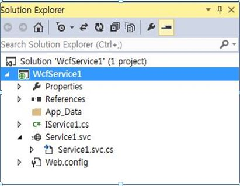

<strong style="outline:0px; color:#333333; text-transform:none; line-height:21px; text-indent:0px; letter-spacing:normal; font-family:Roboto,sans-serif; font-size:14px; font-style:normal; font-variant:normal; word-spacing:0px; white-space:normal; widows:1; background-color:#ffffff">IService.CS:&nbsp;</strong>In
 &ldquo;<strong style="outline:0px; color:#333333; text-transform:none; line-height:21px; text-indent:0px; letter-spacing:normal; font-family:Roboto,sans-serif; font-size:14px; font-style:normal; font-variant:normal; word-spacing:0px; white-space:normal; widows:1; background-color:#ffffff">IService.CS</strong>&rdquo;
 we can see 3 Contracts by default.&nbsp; 
 
<strong style="outline:0px; color:#333333; text-transform:none; line-height:21px; text-indent:0px; letter-spacing:normal; font-family:Roboto,sans-serif; font-size:14px; font-style:normal; font-variant:normal; word-spacing:0px; white-space:normal; widows:1; background-color:#ffffff">[ServiceContract]:</strong>&nbsp;Describes
 the methods or any operations available for the service. The Service Contract is an interface and methods can be declared inside the Service Interface using the Operation Contract attribute. 

<strong style="outline:0px">[OperationContract]:</strong>&nbsp;is similar to the web service [WEBMETHOD].

<strong style="outline:0px">[DataContract]:&nbsp;</strong>describes the data exchange between the client and the service.

<strong style="outline:0px; color:#333333; text-transform:none; line-height:21px; text-indent:0px; letter-spacing:normal; font-family:Roboto,sans-serif; font-size:14px; font-style:normal; font-variant:normal; word-spacing:0px; white-space:normal; widows:1; background-color:#ffffff">[ServiceContract] 
</strong> 
The following code will
 be automatically created for all the IService.CS files. We can change and write our own code here.

C#

Edit|Remove

csharp

<pre class="js">public&nbsp;interface&nbsp;IService1&nbsp;
&nbsp;&nbsp;&nbsp;&nbsp;{&nbsp;
&nbsp;
&nbsp;&nbsp;&nbsp;&nbsp;&nbsp;&nbsp;&nbsp;&nbsp;[OperationContract]&nbsp;
&nbsp;&nbsp;&nbsp;&nbsp;&nbsp;&nbsp;&nbsp;&nbsp;string&nbsp;GetData(int&nbsp;value);&nbsp;
&nbsp;
&nbsp;&nbsp;&nbsp;&nbsp;&nbsp;&nbsp;&nbsp;&nbsp;[OperationContract]&nbsp;
&nbsp;&nbsp;&nbsp;&nbsp;&nbsp;&nbsp;&nbsp;&nbsp;CompositeType&nbsp;GetDataUsingDataContract(CompositeType&nbsp;composite);&nbsp;
&nbsp;
&nbsp;&nbsp;&nbsp;&nbsp;&nbsp;&nbsp;&nbsp;&nbsp;//&nbsp;TODO:&nbsp;Add&nbsp;your&nbsp;service&nbsp;operations&nbsp;here&nbsp;
&nbsp;&nbsp;&nbsp;&nbsp;}&nbsp;
&nbsp;&nbsp;&nbsp;&nbsp;//&nbsp;Use&nbsp;a&nbsp;data&nbsp;contract&nbsp;as&nbsp;illustrated&nbsp;in&nbsp;the&nbsp;sample&nbsp;below&nbsp;to&nbsp;add&nbsp;composite&nbsp;types&nbsp;to&nbsp;service&nbsp;operations.&nbsp;
&nbsp;&nbsp;&nbsp;&nbsp;[DataContract]&nbsp;
&nbsp;&nbsp;&nbsp;&nbsp;public&nbsp;class&nbsp;CompositeType&nbsp;
&nbsp;&nbsp;&nbsp;&nbsp;{&nbsp;
&nbsp;&nbsp;&nbsp;&nbsp;&nbsp;&nbsp;&nbsp;&nbsp;bool&nbsp;boolValue&nbsp;=&nbsp;true;&nbsp;
&nbsp;&nbsp;&nbsp;&nbsp;&nbsp;&nbsp;&nbsp;&nbsp;string&nbsp;stringValue&nbsp;=&nbsp;&quot;Hello&nbsp;&quot;;&nbsp;
&nbsp;
&nbsp;&nbsp;&nbsp;&nbsp;&nbsp;&nbsp;&nbsp;&nbsp;[DataMember]&nbsp;
&nbsp;&nbsp;&nbsp;&nbsp;&nbsp;&nbsp;&nbsp;&nbsp;public&nbsp;bool&nbsp;BoolValue&nbsp;
&nbsp;&nbsp;&nbsp;&nbsp;&nbsp;&nbsp;&nbsp;&nbsp;{&nbsp;
&nbsp;&nbsp;&nbsp;&nbsp;&nbsp;&nbsp;&nbsp;&nbsp;&nbsp;&nbsp;&nbsp;&nbsp;get&nbsp;{&nbsp;return&nbsp;boolValue;&nbsp;}&nbsp;
&nbsp;&nbsp;&nbsp;&nbsp;&nbsp;&nbsp;&nbsp;&nbsp;&nbsp;&nbsp;&nbsp;&nbsp;set&nbsp;{&nbsp;boolValue&nbsp;=&nbsp;value;&nbsp;}&nbsp;
&nbsp;&nbsp;&nbsp;&nbsp;&nbsp;&nbsp;&nbsp;&nbsp;}&nbsp;
&nbsp;
&nbsp;&nbsp;&nbsp;&nbsp;&nbsp;&nbsp;&nbsp;&nbsp;[DataMember]&nbsp;
&nbsp;&nbsp;&nbsp;&nbsp;&nbsp;&nbsp;&nbsp;&nbsp;public&nbsp;string&nbsp;StringValue&nbsp;
&nbsp;&nbsp;&nbsp;&nbsp;&nbsp;&nbsp;&nbsp;&nbsp;{&nbsp;
&nbsp;&nbsp;&nbsp;&nbsp;&nbsp;&nbsp;&nbsp;&nbsp;&nbsp;&nbsp;&nbsp;&nbsp;get&nbsp;{&nbsp;return&nbsp;stringValue;&nbsp;}&nbsp;
&nbsp;&nbsp;&nbsp;&nbsp;&nbsp;&nbsp;&nbsp;&nbsp;&nbsp;&nbsp;&nbsp;&nbsp;set&nbsp;{&nbsp;stringValue&nbsp;=&nbsp;value;&nbsp;}&nbsp;
&nbsp;&nbsp;&nbsp;&nbsp;&nbsp;&nbsp;&nbsp;&nbsp;}&nbsp;
&nbsp;&nbsp;&nbsp;&nbsp;}&nbsp;
</pre>

&nbsp;

<strong style="outline:0px; color:#333333; text-transform:none; line-height:21px; text-indent:0px; letter-spacing:normal; font-family:Roboto,sans-serif; font-size:14px; font-style:normal; font-variant:normal; word-spacing:0px; white-space:normal; widows:1; background-color:#ffffff">Data
 Contract 
</strong>In our example
 we need to get all Item Details from the database, so I have created a Data Contracts, &ldquo;itemDetailsDataContract&rdquo;. Here we can see we have decelerated our entire Table column name as Data Member.&nbsp;

&nbsp;

C#

Edit|Remove

csharp

<pre class="csharp">public&nbsp;class&nbsp;shoppingCartDataContract&nbsp;
&nbsp;&nbsp;&nbsp;&nbsp;&nbsp;&nbsp;&nbsp;&nbsp;{&nbsp;
&nbsp;&nbsp;&nbsp;&nbsp;&nbsp;&nbsp;&nbsp;&nbsp;&nbsp;&nbsp;&nbsp;&nbsp;[DataContract]&nbsp;
&nbsp;&nbsp;&nbsp;&nbsp;&nbsp;&nbsp;&nbsp;&nbsp;&nbsp;&nbsp;&nbsp;&nbsp;public&nbsp;class&nbsp;itemDetailsDataContract&nbsp;
&nbsp;&nbsp;&nbsp;&nbsp;&nbsp;&nbsp;&nbsp;&nbsp;&nbsp;&nbsp;&nbsp;&nbsp;{&nbsp;
&nbsp;&nbsp;&nbsp;&nbsp;&nbsp;&nbsp;&nbsp;&nbsp;&nbsp;&nbsp;&nbsp;&nbsp;&nbsp;&nbsp;&nbsp;&nbsp;[DataMember]&nbsp;
&nbsp;&nbsp;&nbsp;&nbsp;&nbsp;&nbsp;&nbsp;&nbsp;&nbsp;&nbsp;&nbsp;&nbsp;&nbsp;&nbsp;&nbsp;&nbsp;public&nbsp;string&nbsp;Item_ID&nbsp;{&nbsp;get;&nbsp;set;&nbsp;}&nbsp;
&nbsp;&nbsp;&nbsp;&nbsp;&nbsp;&nbsp;&nbsp;&nbsp;&nbsp;&nbsp;&nbsp;&nbsp;&nbsp;&nbsp;&nbsp;&nbsp;[DataMember]&nbsp;
&nbsp;&nbsp;&nbsp;&nbsp;&nbsp;&nbsp;&nbsp;&nbsp;&nbsp;&nbsp;&nbsp;&nbsp;&nbsp;&nbsp;&nbsp;&nbsp;public&nbsp;string&nbsp;Item_Name&nbsp;{&nbsp;get;&nbsp;set;&nbsp;}&nbsp;
&nbsp;&nbsp;&nbsp;&nbsp;&nbsp;&nbsp;&nbsp;&nbsp;&nbsp;&nbsp;&nbsp;&nbsp;&nbsp;&nbsp;&nbsp;&nbsp;[DataMember]&nbsp;
&nbsp;&nbsp;&nbsp;&nbsp;&nbsp;&nbsp;&nbsp;&nbsp;&nbsp;&nbsp;&nbsp;&nbsp;&nbsp;&nbsp;&nbsp;&nbsp;public&nbsp;string&nbsp;Description&nbsp;{&nbsp;get;&nbsp;set;&nbsp;}&nbsp;
&nbsp;&nbsp;&nbsp;&nbsp;&nbsp;&nbsp;&nbsp;&nbsp;&nbsp;&nbsp;&nbsp;&nbsp;&nbsp;&nbsp;&nbsp;&nbsp;[DataMember]&nbsp;
&nbsp;&nbsp;&nbsp;&nbsp;&nbsp;&nbsp;&nbsp;&nbsp;&nbsp;&nbsp;&nbsp;&nbsp;&nbsp;&nbsp;&nbsp;&nbsp;public&nbsp;string&nbsp;Item_Price&nbsp;{&nbsp;get;&nbsp;set;&nbsp;}&nbsp;
&nbsp;&nbsp;&nbsp;&nbsp;&nbsp;&nbsp;&nbsp;&nbsp;&nbsp;&nbsp;&nbsp;&nbsp;&nbsp;&nbsp;&nbsp;&nbsp;[DataMember]&nbsp;
&nbsp;&nbsp;&nbsp;&nbsp;&nbsp;&nbsp;&nbsp;&nbsp;&nbsp;&nbsp;&nbsp;&nbsp;&nbsp;&nbsp;&nbsp;&nbsp;public&nbsp;string&nbsp;Image_Name&nbsp;{&nbsp;get;&nbsp;set;&nbsp;}&nbsp;
&nbsp;&nbsp;&nbsp;&nbsp;&nbsp;&nbsp;&nbsp;&nbsp;&nbsp;&nbsp;&nbsp;&nbsp;&nbsp;&nbsp;&nbsp;&nbsp;[DataMember]&nbsp;
&nbsp;&nbsp;&nbsp;&nbsp;&nbsp;&nbsp;&nbsp;&nbsp;&nbsp;&nbsp;&nbsp;&nbsp;&nbsp;&nbsp;&nbsp;&nbsp;public&nbsp;string&nbsp;AddedBy&nbsp;{&nbsp;get;&nbsp;set;&nbsp;}&nbsp;
&nbsp;&nbsp;&nbsp;&nbsp;&nbsp;&nbsp;&nbsp;&nbsp;&nbsp;&nbsp;&nbsp;&nbsp;}&nbsp;
&nbsp;&nbsp;&nbsp;&nbsp;&nbsp;&nbsp;&nbsp;&nbsp;}&nbsp;
</pre>

&nbsp;

<strong style="outline:0px">Service Contract&nbsp;</strong>

In the Operation Contract
 we can see &ldquo;WebInvoke&rdquo; and &ldquo;WebGet&rdquo; for retrieving the data from the database in the REST Serivce.&nbsp;

&nbsp;

C#

Edit|Remove

csharp

<pre class="js">RequestFormat&nbsp;=&nbsp;WebMessageFormat.Json,&nbsp;
&nbsp;&nbsp;&nbsp;&nbsp;&nbsp;&nbsp;&nbsp;&nbsp;&nbsp;&nbsp;&nbsp;ResponseFormat&nbsp;=&nbsp;WebMessageFormat.Json,&nbsp;
</pre>

&nbsp;Here
 we can see both of the request and response formats. Here I have used the JavaScript Object Notation (JSON) format.
<ul style="font:14px/21px Roboto,sans-serif; outline:0px; color:#333333; text-transform:none; text-indent:0px; letter-spacing:normal; word-spacing:0px; white-space:normal; widows:1; background-color:#ffffff">
<li style="outline:0px">JSON is a lightweight data interchange format. </li><li style="outline:0px">UriTemplate: Here we provide our Method Name. </li></ul>
Here I have declared the
 3 methods &ldquo;<strong style="outline:0px; color:#333333; text-transform:none; line-height:21px; text-indent:0px; letter-spacing:normal; font-family:Roboto,sans-serif; font-size:14px; font-style:normal; font-variant:normal; word-spacing:0px; white-space:normal; widows:1; background-color:#ffffff">GetOrderMaster</strong>&rdquo;,
 &ldquo;<strong style="outline:0px; color:#333333; text-transform:none; line-height:21px; text-indent:0px; letter-spacing:normal; font-family:Roboto,sans-serif; font-size:14px; font-style:normal; font-variant:normal; word-spacing:0px; white-space:normal; widows:1; background-color:#ffffff">SearchOrderMaster</strong>&rdquo;
 and &ldquo;<strong style="outline:0px; color:#333333; text-transform:none; line-height:21px; text-indent:0px; letter-spacing:normal; font-family:Roboto,sans-serif; font-size:14px; font-style:normal; font-variant:normal; word-spacing:0px; white-space:normal; widows:1; background-color:#ffffff">OrderDetails</strong>&rdquo;
 . The &ldquo;<strong style="outline:0px; color:#333333; text-transform:none; line-height:21px; text-indent:0px; letter-spacing:normal; font-family:Roboto,sans-serif; font-size:14px; font-style:normal; font-variant:normal; word-spacing:0px; white-space:normal; widows:1; background-color:#ffffff">GetOrderMaster</strong>&rdquo;
 method gets the Order Master records. In the &ldquo;<strong style="outline:0px; color:#333333; text-transform:none; line-height:21px; text-indent:0px; letter-spacing:normal; font-family:Roboto,sans-serif; font-size:14px; font-style:normal; font-variant:normal; word-spacing:0px; white-space:normal; widows:1; background-color:#ffffff">OrderDetails</strong>&rdquo;
 method the Order_No parameter provides the order detail filter by Order Number. 

Here I have declared a &ldquo;GetItemDetails&rdquo; method and used it to get the details of all Items from the database. And an &ldquo;addItemMaster&rdquo; method and used it to insert a new item into the database.&nbsp;

&nbsp;

C#

Edit|Remove

csharp

<pre class="csharp">[ServiceContract]&nbsp;
&nbsp;&nbsp;&nbsp;&nbsp;public&nbsp;interface&nbsp;IService1&nbsp;
&nbsp;&nbsp;&nbsp;&nbsp;{&nbsp;
[OperationContract]&nbsp;
&nbsp;&nbsp;&nbsp;&nbsp;&nbsp;&nbsp;&nbsp;&nbsp;&nbsp;&nbsp;&nbsp;&nbsp;[WebInvoke(Method&nbsp;=&nbsp;&quot;GET&quot;,&nbsp;
&nbsp;&nbsp;&nbsp;&nbsp;&nbsp;&nbsp;&nbsp;&nbsp;&nbsp;&nbsp;&nbsp;&nbsp;&nbsp;&nbsp;&nbsp;RequestFormat&nbsp;=&nbsp;WebMessageFormat.Json,&nbsp;
&nbsp;&nbsp;&nbsp;&nbsp;&nbsp;&nbsp;&nbsp;&nbsp;&nbsp;&nbsp;&nbsp;&nbsp;&nbsp;&nbsp;&nbsp;ResponseFormat&nbsp;=&nbsp;WebMessageFormat.Json,&nbsp;
&nbsp;&nbsp;&nbsp;&nbsp;&nbsp;&nbsp;&nbsp;&nbsp;&nbsp;&nbsp;&nbsp;&nbsp;&nbsp;&nbsp;&nbsp;UriTemplate&nbsp;=&nbsp;&quot;/GetItemDetails/&quot;)]&nbsp;
&nbsp;&nbsp;&nbsp;&nbsp;&nbsp;&nbsp;&nbsp;&nbsp;&nbsp;&nbsp;&nbsp;&nbsp;List&lt;shoppingCartDataContract.itemDetailsDataContract&gt;&nbsp;GetItemDetails();&nbsp;
&nbsp;&nbsp;&nbsp;&nbsp;&nbsp;&nbsp;&nbsp;&nbsp;&nbsp;&nbsp;&nbsp;&nbsp;//&nbsp;TODO:&nbsp;Add&nbsp;your&nbsp;service&nbsp;operations&nbsp;here&nbsp;&nbsp;&nbsp;&nbsp;&nbsp;&nbsp;&nbsp;&nbsp;
&nbsp;
&nbsp;&nbsp;&nbsp;&nbsp;&nbsp;&nbsp;&nbsp;&nbsp;&nbsp;&nbsp;&nbsp;&nbsp;//&nbsp;to&nbsp;Insert&nbsp;the&nbsp;Item&nbsp;Master&nbsp;
&nbsp;&nbsp;&nbsp;&nbsp;&nbsp;&nbsp;&nbsp;&nbsp;&nbsp;&nbsp;&nbsp;&nbsp;[OperationContract]&nbsp;
&nbsp;&nbsp;&nbsp;&nbsp;&nbsp;&nbsp;&nbsp;&nbsp;&nbsp;&nbsp;&nbsp;&nbsp;[WebInvoke(Method&nbsp;=&nbsp;&quot;POST&quot;,&nbsp;
&nbsp;&nbsp;&nbsp;&nbsp;&nbsp;&nbsp;&nbsp;&nbsp;&nbsp;&nbsp;&nbsp;&nbsp;&nbsp;&nbsp;&nbsp;RequestFormat&nbsp;=&nbsp;WebMessageFormat.Json,&nbsp;
&nbsp;&nbsp;&nbsp;&nbsp;&nbsp;&nbsp;&nbsp;&nbsp;&nbsp;&nbsp;&nbsp;&nbsp;&nbsp;&nbsp;&nbsp;ResponseFormat&nbsp;=&nbsp;WebMessageFormat.Json,&nbsp;
&nbsp;&nbsp;&nbsp;&nbsp;&nbsp;&nbsp;&nbsp;&nbsp;&nbsp;&nbsp;&nbsp;&nbsp;&nbsp;&nbsp;&nbsp;UriTemplate&nbsp;=&nbsp;&quot;/addItemMaster&quot;)]&nbsp;
&nbsp;&nbsp;&nbsp;&nbsp;&nbsp;&nbsp;&nbsp;&nbsp;&nbsp;&nbsp;&nbsp;&nbsp;bool&nbsp;addItemMaster(shoppingCartDataContract.itemDetailsDataContract&nbsp;itemDetails);&nbsp;
&nbsp;}&nbsp;
</pre>

&nbsp;<strong style="outline:0px; color:#333333; text-transform:none; line-height:21px; text-indent:0px; letter-spacing:normal; font-family:Roboto,sans-serif; font-size:14px; font-style:normal; font-variant:normal; word-spacing:0px; white-space:normal; widows:1; background-color:#ffffff">Iservice.Cs:
 &nbsp;</strong>Complete
 Source Code

&nbsp;

C#

Edit|Remove

csharp

<pre class="csharp">using&nbsp;System;&nbsp;
using&nbsp;<a class="libraryLink" href="https://msdn.microsoft.com/en-US/library/System.Collections.Generic.aspx" target="_blank" title="Auto generated link to System.Collections.Generic">System.Collections.Generic</a>;&nbsp;
using&nbsp;<a class="libraryLink" href="https://msdn.microsoft.com/en-US/library/System.Linq.aspx" target="_blank" title="Auto generated link to System.Linq">System.Linq</a>;&nbsp;
using&nbsp;<a class="libraryLink" href="https://msdn.microsoft.com/en-US/library/System.Runtime.Serialization.aspx" target="_blank" title="Auto generated link to System.Runtime.Serialization">System.Runtime.Serialization</a>;&nbsp;
using&nbsp;<a class="libraryLink" href="https://msdn.microsoft.com/en-US/library/System.ServiceModel.aspx" target="_blank" title="Auto generated link to System.ServiceModel">System.ServiceModel</a>;&nbsp;
using&nbsp;<a class="libraryLink" href="https://msdn.microsoft.com/en-US/library/System.ServiceModel.Web.aspx" target="_blank" title="Auto generated link to System.ServiceModel.Web">System.ServiceModel.Web</a>;&nbsp;
using&nbsp;<a class="libraryLink" href="https://msdn.microsoft.com/en-US/library/System.Text.aspx" target="_blank" title="Auto generated link to System.Text">System.Text</a>;&nbsp;
&nbsp;
namespace&nbsp;ShanuSchoppingCart_WCF&nbsp;
{&nbsp;
&nbsp;&nbsp;&nbsp;&nbsp;&nbsp;&nbsp;&nbsp;&nbsp;[ServiceContract]&nbsp;
&nbsp;&nbsp;&nbsp;&nbsp;&nbsp;&nbsp;&nbsp;&nbsp;public&nbsp;interface&nbsp;IService1&nbsp;
&nbsp;&nbsp;&nbsp;&nbsp;&nbsp;&nbsp;&nbsp;&nbsp;{&nbsp;
&nbsp;&nbsp;&nbsp;&nbsp;&nbsp;&nbsp;&nbsp;&nbsp;&nbsp;&nbsp;&nbsp;&nbsp;[OperationContract]&nbsp;
&nbsp;&nbsp;&nbsp;&nbsp;&nbsp;&nbsp;&nbsp;&nbsp;&nbsp;&nbsp;&nbsp;&nbsp;[WebInvoke(Method&nbsp;=&nbsp;&quot;GET&quot;,&nbsp;
&nbsp;&nbsp;&nbsp;&nbsp;&nbsp;&nbsp;&nbsp;&nbsp;&nbsp;&nbsp;&nbsp;&nbsp;&nbsp;&nbsp;&nbsp;RequestFormat&nbsp;=&nbsp;WebMessageFormat.Json,&nbsp;
&nbsp;&nbsp;&nbsp;&nbsp;&nbsp;&nbsp;&nbsp;&nbsp;&nbsp;&nbsp;&nbsp;&nbsp;&nbsp;&nbsp;&nbsp;ResponseFormat&nbsp;=&nbsp;WebMessageFormat.Json,&nbsp;
&nbsp;&nbsp;&nbsp;&nbsp;&nbsp;&nbsp;&nbsp;&nbsp;&nbsp;&nbsp;&nbsp;&nbsp;&nbsp;&nbsp;&nbsp;UriTemplate&nbsp;=&nbsp;&quot;/GetItemDetails/&quot;)]&nbsp;
&nbsp;&nbsp;&nbsp;&nbsp;&nbsp;&nbsp;&nbsp;&nbsp;&nbsp;&nbsp;&nbsp;&nbsp;List&lt;shoppingCartDataContract.itemDetailsDataContract&gt;&nbsp;GetItemDetails();&nbsp;
&nbsp;&nbsp;&nbsp;&nbsp;&nbsp;&nbsp;&nbsp;&nbsp;&nbsp;&nbsp;
&nbsp;
&nbsp;
&nbsp;&nbsp;&nbsp;&nbsp;&nbsp;&nbsp;&nbsp;&nbsp;&nbsp;&nbsp;&nbsp;&nbsp;//&nbsp;to&nbsp;Insert&nbsp;the&nbsp;Item&nbsp;Master&nbsp;
&nbsp;&nbsp;&nbsp;&nbsp;&nbsp;&nbsp;&nbsp;&nbsp;&nbsp;&nbsp;&nbsp;&nbsp;[OperationContract]&nbsp;
&nbsp;&nbsp;&nbsp;&nbsp;&nbsp;&nbsp;&nbsp;&nbsp;&nbsp;&nbsp;&nbsp;&nbsp;[WebInvoke(Method&nbsp;=&nbsp;&quot;POST&quot;,&nbsp;
&nbsp;&nbsp;&nbsp;&nbsp;&nbsp;&nbsp;&nbsp;&nbsp;&nbsp;&nbsp;&nbsp;&nbsp;&nbsp;&nbsp;&nbsp;RequestFormat&nbsp;=&nbsp;WebMessageFormat.Json,&nbsp;
&nbsp;&nbsp;&nbsp;&nbsp;&nbsp;&nbsp;&nbsp;&nbsp;&nbsp;&nbsp;&nbsp;&nbsp;&nbsp;&nbsp;&nbsp;ResponseFormat&nbsp;=&nbsp;WebMessageFormat.Json,&nbsp;
&nbsp;&nbsp;&nbsp;&nbsp;&nbsp;&nbsp;&nbsp;&nbsp;&nbsp;&nbsp;&nbsp;&nbsp;&nbsp;&nbsp;&nbsp;UriTemplate&nbsp;=&nbsp;&quot;/addItemMaster&quot;)]&nbsp;
&nbsp;&nbsp;&nbsp;&nbsp;&nbsp;&nbsp;&nbsp;&nbsp;&nbsp;&nbsp;&nbsp;&nbsp;bool&nbsp;addItemMaster(shoppingCartDataContract.itemDetailsDataContract&nbsp;itemDetails);&nbsp;
&nbsp;&nbsp;&nbsp;&nbsp;&nbsp;&nbsp;&nbsp;&nbsp;}&nbsp;
&nbsp;
&nbsp;&nbsp;&nbsp;&nbsp;&nbsp;&nbsp;&nbsp;&nbsp;public&nbsp;class&nbsp;shoppingCartDataContract&nbsp;
&nbsp;&nbsp;&nbsp;&nbsp;&nbsp;&nbsp;&nbsp;&nbsp;{&nbsp;
&nbsp;&nbsp;&nbsp;&nbsp;&nbsp;&nbsp;&nbsp;&nbsp;&nbsp;&nbsp;&nbsp;&nbsp;[DataContract]&nbsp;
&nbsp;&nbsp;&nbsp;&nbsp;&nbsp;&nbsp;&nbsp;&nbsp;&nbsp;&nbsp;&nbsp;&nbsp;public&nbsp;class&nbsp;itemDetailsDataContract&nbsp;
&nbsp;&nbsp;&nbsp;&nbsp;&nbsp;&nbsp;&nbsp;&nbsp;&nbsp;&nbsp;&nbsp;&nbsp;{&nbsp;
&nbsp;&nbsp;&nbsp;&nbsp;&nbsp;&nbsp;&nbsp;&nbsp;&nbsp;&nbsp;&nbsp;&nbsp;&nbsp;&nbsp;&nbsp;&nbsp;[DataMember]&nbsp;
&nbsp;&nbsp;&nbsp;&nbsp;&nbsp;&nbsp;&nbsp;&nbsp;&nbsp;&nbsp;&nbsp;&nbsp;&nbsp;&nbsp;&nbsp;&nbsp;public&nbsp;string&nbsp;Item_ID&nbsp;{&nbsp;get;&nbsp;set;&nbsp;}&nbsp;
&nbsp;&nbsp;&nbsp;&nbsp;&nbsp;&nbsp;&nbsp;&nbsp;&nbsp;&nbsp;&nbsp;&nbsp;&nbsp;&nbsp;&nbsp;&nbsp;[DataMember]&nbsp;
&nbsp;&nbsp;&nbsp;&nbsp;&nbsp;&nbsp;&nbsp;&nbsp;&nbsp;&nbsp;&nbsp;&nbsp;&nbsp;&nbsp;&nbsp;&nbsp;public&nbsp;string&nbsp;Item_Name&nbsp;{&nbsp;get;&nbsp;set;&nbsp;}&nbsp;
&nbsp;&nbsp;&nbsp;&nbsp;&nbsp;&nbsp;&nbsp;&nbsp;&nbsp;&nbsp;&nbsp;&nbsp;&nbsp;&nbsp;&nbsp;&nbsp;[DataMember]&nbsp;
&nbsp;&nbsp;&nbsp;&nbsp;&nbsp;&nbsp;&nbsp;&nbsp;&nbsp;&nbsp;&nbsp;&nbsp;&nbsp;&nbsp;&nbsp;&nbsp;public&nbsp;string&nbsp;Description&nbsp;{&nbsp;get;&nbsp;set;&nbsp;}&nbsp;
&nbsp;&nbsp;&nbsp;&nbsp;&nbsp;&nbsp;&nbsp;&nbsp;&nbsp;&nbsp;&nbsp;&nbsp;&nbsp;&nbsp;&nbsp;&nbsp;[DataMember]&nbsp;
&nbsp;&nbsp;&nbsp;&nbsp;&nbsp;&nbsp;&nbsp;&nbsp;&nbsp;&nbsp;&nbsp;&nbsp;&nbsp;&nbsp;&nbsp;&nbsp;public&nbsp;string&nbsp;Item_Price&nbsp;{&nbsp;get;&nbsp;set;&nbsp;}&nbsp;
&nbsp;&nbsp;&nbsp;&nbsp;&nbsp;&nbsp;&nbsp;&nbsp;&nbsp;&nbsp;&nbsp;&nbsp;&nbsp;&nbsp;&nbsp;&nbsp;[DataMember]&nbsp;
&nbsp;&nbsp;&nbsp;&nbsp;&nbsp;&nbsp;&nbsp;&nbsp;&nbsp;&nbsp;&nbsp;&nbsp;&nbsp;&nbsp;&nbsp;&nbsp;public&nbsp;string&nbsp;Image_Name&nbsp;{&nbsp;get;&nbsp;set;&nbsp;}&nbsp;
&nbsp;&nbsp;&nbsp;&nbsp;&nbsp;&nbsp;&nbsp;&nbsp;&nbsp;&nbsp;&nbsp;&nbsp;&nbsp;&nbsp;&nbsp;&nbsp;[DataMember]&nbsp;
&nbsp;&nbsp;&nbsp;&nbsp;&nbsp;&nbsp;&nbsp;&nbsp;&nbsp;&nbsp;&nbsp;&nbsp;&nbsp;&nbsp;&nbsp;&nbsp;public&nbsp;string&nbsp;AddedBy&nbsp;{&nbsp;get;&nbsp;set;&nbsp;}&nbsp;
&nbsp;&nbsp;&nbsp;&nbsp;&nbsp;&nbsp;&nbsp;&nbsp;&nbsp;&nbsp;&nbsp;&nbsp;}&nbsp;
&nbsp;&nbsp;&nbsp;&nbsp;&nbsp;&nbsp;&nbsp;&nbsp;}&nbsp;
&nbsp;&nbsp;&nbsp;&nbsp;}&nbsp;
</pre>

&nbsp;<strong style="outline:0px; color:#333333; text-transform:none; line-height:21px; text-indent:0px; letter-spacing:normal; font-family:Roboto,sans-serif; font-size:14px; font-style:normal; font-variant:normal; word-spacing:0px; white-space:normal; widows:1; background-color:#ffffff">Add
 Database using ADO.NET Entity Data Model 
</strong> 
Right-click your WCF project
 and select Add New Item then select ADO.NET Entity Data Model and click Add.&nbsp;

&nbsp;

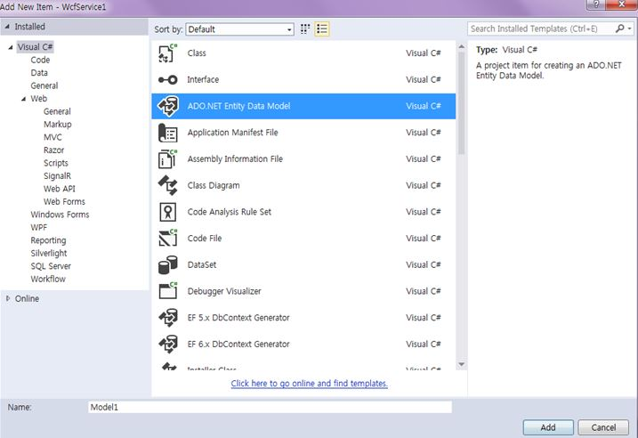

&nbsp;

&nbsp;

Select EF Designer
 from Database and click next.

&nbsp;

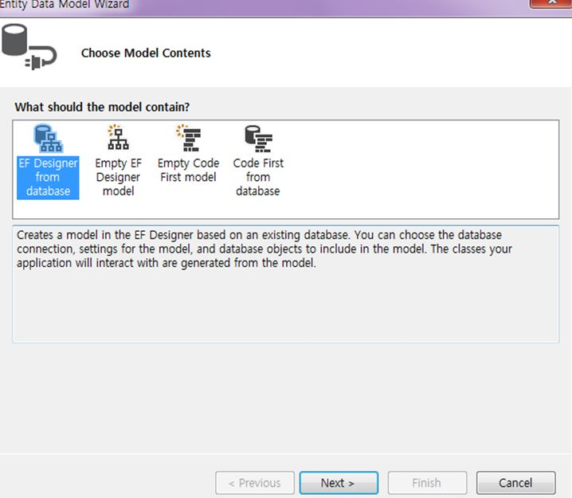

&nbsp;

&nbsp;Click New Connection.

&nbsp;

&nbsp;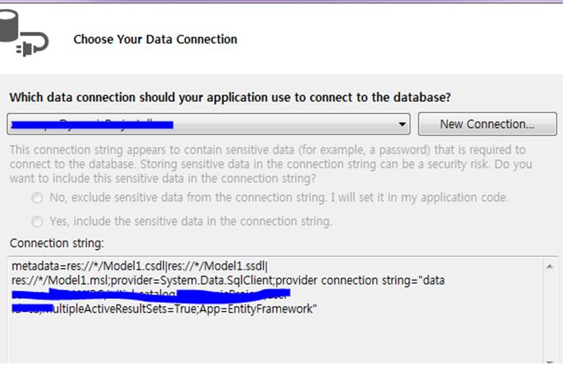

&nbsp;

&nbsp;Here we can
 select our Database Server Name and enter your DB server SQL Server Authentication User ID and Password. We have already created our database as &ldquo;ShoppingDB&rdquo; so we can select the database and click OK.&nbsp;

&nbsp;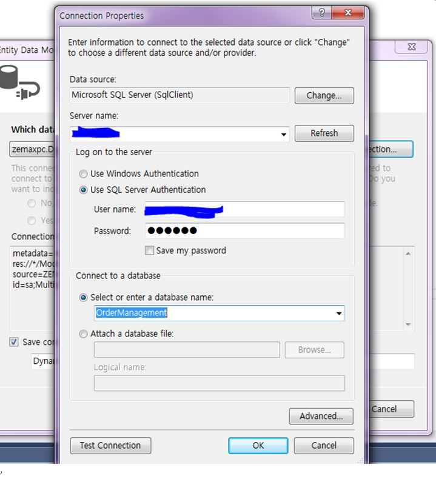

&nbsp;Click Next
 and select our tables to be used and click Finish.&nbsp;Here we can see now we have created our shanuItemDetailsModel1. 
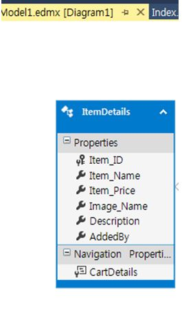

&nbsp;

&nbsp;<strong style="outline:0px; color:#333333; text-transform:none; line-height:21px; text-indent:0px; letter-spacing:normal; font-family:Roboto,sans-serif; font-size:14px; font-style:normal; font-variant:normal; word-spacing:0px; white-space:normal; widows:1; background-color:#ffffff">Service1.SVC</strong> 

&ldquo;Service.SVC.CS&rdquo; implements the IService Interface and overrides and defines all the methods of the Operation Contract. For example here we can see I have implemented the IService1 in the Service1 class. Created the object for our Entity Model and
 in GetToyDetails using a LINQ.&nbsp;

&nbsp;

C#

Edit|Remove

csharp

<pre class="csharp">public&nbsp;class&nbsp;Service1&nbsp;:&nbsp;IService1&nbsp;
&nbsp;&nbsp;&nbsp;&nbsp;{&nbsp;
ShanuShoppingDBEntities&nbsp;OME;&nbsp;
&nbsp;&nbsp;&nbsp;&nbsp;&nbsp;&nbsp;&nbsp;&nbsp;public&nbsp;Service1()&nbsp;
&nbsp;&nbsp;&nbsp;&nbsp;&nbsp;&nbsp;&nbsp;&nbsp;{&nbsp;
&nbsp;&nbsp;&nbsp;&nbsp;&nbsp;&nbsp;&nbsp;&nbsp;&nbsp;OME&nbsp;=&nbsp;new&nbsp;ShanuShoppingDBEntities();&nbsp;
&nbsp;&nbsp;&nbsp;&nbsp;&nbsp;&nbsp;&nbsp;&nbsp;}&nbsp;
&nbsp;&nbsp;&nbsp;&nbsp;&nbsp;&nbsp;&nbsp;&nbsp;&nbsp;//&nbsp;This&nbsp;method&nbsp;is&nbsp;get&nbsp;the&nbsp;Toys&nbsp;details&nbsp;from&nbsp;Db&nbsp;and&nbsp;bind&nbsp;to&nbsp;list&nbsp;&nbsp;using&nbsp;the&nbsp;Linq&nbsp;query&nbsp;
&nbsp;&nbsp;&nbsp;&nbsp;&nbsp;&nbsp;&nbsp;&nbsp;public&nbsp;List&lt;shoppingCartDataContract.itemDetailsDataContract&gt;&nbsp;GetItemDetails()&nbsp;
&nbsp;&nbsp;&nbsp;&nbsp;&nbsp;&nbsp;&nbsp;&nbsp;{&nbsp;
&nbsp;&nbsp;&nbsp;&nbsp;&nbsp;&nbsp;&nbsp;&nbsp;&nbsp;&nbsp;&nbsp;&nbsp;var&nbsp;query&nbsp;=&nbsp;(from&nbsp;a&nbsp;in&nbsp;OME.ItemDetails&nbsp;
&nbsp;&nbsp;&nbsp;&nbsp;&nbsp;&nbsp;&nbsp;&nbsp;&nbsp;&nbsp;&nbsp;&nbsp;&nbsp;&nbsp;&nbsp;&nbsp;&nbsp;&nbsp;&nbsp;&nbsp;&nbsp;&nbsp;&nbsp;&nbsp;&nbsp;select&nbsp;a).Distinct();&nbsp;
&nbsp;&nbsp;&nbsp;&nbsp;&nbsp;&nbsp;&nbsp;&nbsp;&nbsp;&nbsp;&nbsp;&nbsp;List&lt;shoppingCartDataContract.itemDetailsDataContract&gt;&nbsp;ItemDetailsList&nbsp;=&nbsp;new&nbsp;List&lt;shoppingCartDataContract.itemDetailsDataContract&gt;();&nbsp;
&nbsp;&nbsp;&nbsp;&nbsp;&nbsp;&nbsp;&nbsp;&nbsp;&nbsp;&nbsp;&nbsp;&nbsp;query.ToList().ForEach(rec&nbsp;=&gt;&nbsp;
&nbsp;&nbsp;&nbsp;&nbsp;&nbsp;&nbsp;&nbsp;&nbsp;&nbsp;&nbsp;&nbsp;&nbsp;{&nbsp;
&nbsp;&nbsp;&nbsp;&nbsp;&nbsp;&nbsp;&nbsp;&nbsp;&nbsp;&nbsp;&nbsp;&nbsp;&nbsp;&nbsp;&nbsp;&nbsp;ItemDetailsList.Add(new&nbsp;shoppingCartDataContract.itemDetailsDataContract&nbsp;
&nbsp;&nbsp;&nbsp;&nbsp;&nbsp;&nbsp;&nbsp;&nbsp;&nbsp;&nbsp;&nbsp;&nbsp;&nbsp;&nbsp;&nbsp;&nbsp;{&nbsp;
&nbsp;&nbsp;&nbsp;&nbsp;&nbsp;&nbsp;&nbsp;&nbsp;&nbsp;&nbsp;&nbsp;&nbsp;Item_ID&nbsp;=&nbsp;&nbsp;Convert.ToString(rec.Item_ID),&nbsp;
&nbsp;&nbsp;&nbsp;&nbsp;&nbsp;Item_Name&nbsp;=&nbsp;rec.Item_Name,&nbsp;&nbsp;&nbsp;&nbsp;&nbsp;
&nbsp;&nbsp;&nbsp;&nbsp;&nbsp;&nbsp;&nbsp;&nbsp;&nbsp;&nbsp;&nbsp;&nbsp;&nbsp;&nbsp;&nbsp;&nbsp;Description=rec.Description,&nbsp;
&nbsp;&nbsp;&nbsp;&nbsp;&nbsp;&nbsp;&nbsp;&nbsp;&nbsp;Item_Price&nbsp;=&nbsp;Convert.ToString(rec.Item_Price),&nbsp;&nbsp;&nbsp;&nbsp;&nbsp;&nbsp;&nbsp;&nbsp;&nbsp;&nbsp;&nbsp;&nbsp;&nbsp;&nbsp;&nbsp;&nbsp;&nbsp;&nbsp;&nbsp;&nbsp;Image_Name&nbsp;=&nbsp;rec.Image_Name,&nbsp;
&nbsp;&nbsp;&nbsp;&nbsp;&nbsp;&nbsp;&nbsp;&nbsp;&nbsp;&nbsp;&nbsp;&nbsp;&nbsp;&nbsp;&nbsp;&nbsp;&nbsp;&nbsp;&nbsp;&nbsp;AddedBy&nbsp;=&nbsp;rec.AddedBy&nbsp;
&nbsp;&nbsp;&nbsp;&nbsp;&nbsp;&nbsp;&nbsp;&nbsp;&nbsp;&nbsp;&nbsp;&nbsp;&nbsp;&nbsp;&nbsp;&nbsp;});&nbsp;
&nbsp;&nbsp;&nbsp;&nbsp;&nbsp;&nbsp;&nbsp;&nbsp;&nbsp;&nbsp;&nbsp;&nbsp;});&nbsp;
&nbsp;&nbsp;&nbsp;&nbsp;&nbsp;&nbsp;&nbsp;&nbsp;&nbsp;&nbsp;&nbsp;&nbsp;return&nbsp;ItemDetailsList;&nbsp;
&nbsp;&nbsp;&nbsp;&nbsp;&nbsp;&nbsp;&nbsp;&nbsp;}&nbsp;
</pre>

&nbsp;<strong style="outline:0px; color:#333333; text-transform:none; line-height:21px; text-indent:0px; letter-spacing:normal; font-family:Roboto,sans-serif; font-size:14px; font-style:normal; font-variant:normal; word-spacing:0px; white-space:normal; widows:1; background-color:#ffffff">&ldquo;Service.SVC.CS&rdquo;:
 Complete Source Code</strong>&nbsp;

C#

Edit|Remove

csharp

<pre class="csharp">using&nbsp;System;&nbsp;
using&nbsp;<a class="libraryLink" href="https://msdn.microsoft.com/en-US/library/System.Collections.Generic.aspx" target="_blank" title="Auto generated link to System.Collections.Generic">System.Collections.Generic</a>;&nbsp;
using&nbsp;<a class="libraryLink" href="https://msdn.microsoft.com/en-US/library/System.Linq.aspx" target="_blank" title="Auto generated link to System.Linq">System.Linq</a>;&nbsp;
using&nbsp;<a class="libraryLink" href="https://msdn.microsoft.com/en-US/library/System.Runtime.Serialization.aspx" target="_blank" title="Auto generated link to System.Runtime.Serialization">System.Runtime.Serialization</a>;&nbsp;
using&nbsp;<a class="libraryLink" href="https://msdn.microsoft.com/en-US/library/System.ServiceModel.aspx" target="_blank" title="Auto generated link to System.ServiceModel">System.ServiceModel</a>;&nbsp;
using&nbsp;<a class="libraryLink" href="https://msdn.microsoft.com/en-US/library/System.ServiceModel.Web.aspx" target="_blank" title="Auto generated link to System.ServiceModel.Web">System.ServiceModel.Web</a>;&nbsp;
using&nbsp;<a class="libraryLink" href="https://msdn.microsoft.com/en-US/library/System.Text.aspx" target="_blank" title="Auto generated link to System.Text">System.Text</a>;&nbsp;
using&nbsp;ShanuSchoppingCart_WCF.Module;&nbsp;
&nbsp;
namespace&nbsp;ShanuSchoppingCart_WCF&nbsp;
{&nbsp;
&nbsp;
&nbsp;&nbsp;&nbsp;&nbsp;public&nbsp;class&nbsp;Service1&nbsp;:&nbsp;IService1&nbsp;
&nbsp;&nbsp;&nbsp;&nbsp;{&nbsp;
&nbsp;&nbsp;&nbsp;&nbsp;&nbsp;&nbsp;&nbsp;&nbsp;ShanuShoppingDBEntities&nbsp;OME;&nbsp;
&nbsp;&nbsp;&nbsp;&nbsp;&nbsp;&nbsp;&nbsp;&nbsp;public&nbsp;Service1()&nbsp;
&nbsp;&nbsp;&nbsp;&nbsp;&nbsp;&nbsp;&nbsp;&nbsp;{&nbsp;
&nbsp;&nbsp;&nbsp;&nbsp;&nbsp;&nbsp;&nbsp;&nbsp;&nbsp;&nbsp;&nbsp;&nbsp;OME&nbsp;=&nbsp;new&nbsp;ShanuShoppingDBEntities();&nbsp;
&nbsp;&nbsp;&nbsp;&nbsp;&nbsp;&nbsp;&nbsp;&nbsp;}&nbsp;&nbsp;&nbsp;
&nbsp;&nbsp;&nbsp;&nbsp;&nbsp;&nbsp;&nbsp;&nbsp;public&nbsp;List&lt;shoppingCartDataContract.itemDetailsDataContract&gt;&nbsp;GetItemDetails()&nbsp;
&nbsp;&nbsp;&nbsp;&nbsp;&nbsp;&nbsp;&nbsp;&nbsp;{&nbsp;
&nbsp;&nbsp;&nbsp;&nbsp;&nbsp;&nbsp;&nbsp;&nbsp;&nbsp;&nbsp;&nbsp;&nbsp;var&nbsp;query&nbsp;=&nbsp;(from&nbsp;a&nbsp;in&nbsp;OME.ItemDetails&nbsp;
&nbsp;&nbsp;&nbsp;&nbsp;&nbsp;&nbsp;&nbsp;&nbsp;&nbsp;&nbsp;&nbsp;&nbsp;&nbsp;&nbsp;&nbsp;&nbsp;&nbsp;&nbsp;&nbsp;&nbsp;&nbsp;&nbsp;&nbsp;&nbsp;&nbsp;select&nbsp;a).Distinct();&nbsp;
&nbsp;
&nbsp;&nbsp;&nbsp;&nbsp;&nbsp;&nbsp;&nbsp;&nbsp;&nbsp;&nbsp;&nbsp;&nbsp;List&lt;shoppingCartDataContract.itemDetailsDataContract&gt;&nbsp;ItemDetailsList&nbsp;=&nbsp;new&nbsp;List&lt;shoppingCartDataContract.itemDetailsDataContract&gt;();&nbsp;
&nbsp;
&nbsp;&nbsp;&nbsp;&nbsp;&nbsp;&nbsp;&nbsp;&nbsp;&nbsp;&nbsp;&nbsp;&nbsp;query.ToList().ForEach(rec&nbsp;=&gt;&nbsp;
&nbsp;&nbsp;&nbsp;&nbsp;&nbsp;&nbsp;&nbsp;&nbsp;&nbsp;&nbsp;&nbsp;&nbsp;{&nbsp;
&nbsp;&nbsp;&nbsp;&nbsp;&nbsp;&nbsp;&nbsp;&nbsp;&nbsp;&nbsp;&nbsp;&nbsp;&nbsp;&nbsp;&nbsp;&nbsp;ItemDetailsList.Add(new&nbsp;shoppingCartDataContract.itemDetailsDataContract&nbsp;
&nbsp;&nbsp;&nbsp;&nbsp;&nbsp;&nbsp;&nbsp;&nbsp;&nbsp;&nbsp;&nbsp;&nbsp;&nbsp;&nbsp;&nbsp;&nbsp;{&nbsp;
&nbsp;&nbsp;&nbsp;&nbsp;&nbsp;&nbsp;&nbsp;&nbsp;&nbsp;&nbsp;&nbsp;&nbsp;&nbsp;&nbsp;&nbsp;&nbsp;&nbsp;&nbsp;&nbsp;&nbsp;Item_ID&nbsp;=&nbsp;&nbsp;Convert.ToString(rec.Item_ID),&nbsp;
&nbsp;&nbsp;&nbsp;&nbsp;&nbsp;&nbsp;&nbsp;&nbsp;&nbsp;&nbsp;&nbsp;&nbsp;&nbsp;&nbsp;&nbsp;&nbsp;&nbsp;&nbsp;&nbsp;&nbsp;Item_Name&nbsp;=&nbsp;rec.Item_Name,&nbsp;
&nbsp;&nbsp;&nbsp;&nbsp;&nbsp;&nbsp;&nbsp;&nbsp;&nbsp;&nbsp;&nbsp;&nbsp;&nbsp;&nbsp;&nbsp;&nbsp;&nbsp;&nbsp;&nbsp;&nbsp;Description=rec.Description,&nbsp;
&nbsp;&nbsp;&nbsp;&nbsp;&nbsp;&nbsp;&nbsp;&nbsp;&nbsp;&nbsp;&nbsp;&nbsp;&nbsp;&nbsp;&nbsp;&nbsp;&nbsp;&nbsp;&nbsp;&nbsp;Item_Price&nbsp;=&nbsp;Convert.ToString(rec.Item_Price),&nbsp;
&nbsp;&nbsp;&nbsp;&nbsp;&nbsp;&nbsp;&nbsp;&nbsp;&nbsp;&nbsp;&nbsp;&nbsp;&nbsp;&nbsp;&nbsp;&nbsp;&nbsp;&nbsp;&nbsp;&nbsp;Image_Name&nbsp;=&nbsp;rec.Image_Name,&nbsp;
&nbsp;&nbsp;&nbsp;&nbsp;&nbsp;&nbsp;&nbsp;&nbsp;&nbsp;&nbsp;&nbsp;&nbsp;&nbsp;&nbsp;&nbsp;&nbsp;&nbsp;&nbsp;&nbsp;&nbsp;AddedBy&nbsp;=&nbsp;rec.AddedBy&nbsp;
&nbsp;
&nbsp;&nbsp;&nbsp;&nbsp;&nbsp;&nbsp;&nbsp;&nbsp;&nbsp;&nbsp;&nbsp;&nbsp;&nbsp;&nbsp;&nbsp;&nbsp;});&nbsp;
&nbsp;&nbsp;&nbsp;&nbsp;&nbsp;&nbsp;&nbsp;&nbsp;&nbsp;&nbsp;&nbsp;&nbsp;});&nbsp;
&nbsp;&nbsp;&nbsp;&nbsp;&nbsp;&nbsp;&nbsp;&nbsp;&nbsp;&nbsp;&nbsp;&nbsp;return&nbsp;ItemDetailsList;&nbsp;
&nbsp;&nbsp;&nbsp;&nbsp;&nbsp;&nbsp;&nbsp;&nbsp;}&nbsp;
&nbsp;
&nbsp;&nbsp;&nbsp;&nbsp;&nbsp;&nbsp;&nbsp;&nbsp;public&nbsp;bool&nbsp;addItemMaster(shoppingCartDataContract.itemDetailsDataContract&nbsp;ItmDetails)&nbsp;&nbsp;&nbsp;&nbsp;
&nbsp;&nbsp;&nbsp;&nbsp;&nbsp;&nbsp;{&nbsp;&nbsp;&nbsp;&nbsp;
&nbsp;&nbsp;&nbsp;&nbsp;&nbsp;&nbsp;&nbsp;&nbsp;&nbsp;&nbsp;try&nbsp;&nbsp;&nbsp;&nbsp;
&nbsp;&nbsp;&nbsp;&nbsp;&nbsp;&nbsp;&nbsp;&nbsp;&nbsp;&nbsp;{&nbsp;&nbsp;&nbsp;&nbsp;
&nbsp;&nbsp;&nbsp;&nbsp;&nbsp;&nbsp;&nbsp;&nbsp;&nbsp;&nbsp;&nbsp;&nbsp;&nbsp;&nbsp;&nbsp;&nbsp;&nbsp;ItemDetails&nbsp;itm&nbsp;=&nbsp;OME.ItemDetails.Create();&nbsp;&nbsp;&nbsp;&nbsp;&nbsp;&nbsp;&nbsp;&nbsp;&nbsp;&nbsp;&nbsp;&nbsp;&nbsp;&nbsp;&nbsp;&nbsp;&nbsp;&nbsp;&nbsp;
&nbsp;&nbsp;&nbsp;&nbsp;&nbsp;&nbsp;&nbsp;&nbsp;&nbsp;&nbsp;&nbsp;&nbsp;&nbsp;&nbsp;&nbsp;&nbsp;&nbsp;&nbsp;&nbsp;&nbsp;itm.Item_Name&nbsp;=&nbsp;ItmDetails.Item_Name;&nbsp;
&nbsp;&nbsp;&nbsp;&nbsp;&nbsp;&nbsp;&nbsp;&nbsp;&nbsp;&nbsp;&nbsp;&nbsp;&nbsp;&nbsp;&nbsp;&nbsp;&nbsp;&nbsp;&nbsp;&nbsp;itm.Description=ItmDetails.Description;&nbsp;
&nbsp;&nbsp;&nbsp;&nbsp;&nbsp;&nbsp;&nbsp;&nbsp;&nbsp;&nbsp;&nbsp;&nbsp;&nbsp;&nbsp;&nbsp;&nbsp;&nbsp;&nbsp;&nbsp;&nbsp;itm.Item_Price&nbsp;=&nbsp;Convert.ToInt32(ItmDetails.Item_Price);&nbsp;
&nbsp;&nbsp;&nbsp;&nbsp;&nbsp;&nbsp;&nbsp;&nbsp;&nbsp;&nbsp;&nbsp;&nbsp;&nbsp;&nbsp;&nbsp;&nbsp;&nbsp;&nbsp;&nbsp;&nbsp;itm.Image_Name&nbsp;=&nbsp;ItmDetails.Image_Name;&nbsp;
&nbsp;&nbsp;&nbsp;&nbsp;&nbsp;&nbsp;&nbsp;&nbsp;&nbsp;&nbsp;&nbsp;&nbsp;&nbsp;&nbsp;&nbsp;&nbsp;&nbsp;&nbsp;&nbsp;&nbsp;itm.AddedBy&nbsp;=&nbsp;ItmDetails.AddedBy;&nbsp;
&nbsp;&nbsp;&nbsp;&nbsp;&nbsp;&nbsp;&nbsp;&nbsp;&nbsp;&nbsp;&nbsp;&nbsp;&nbsp;&nbsp;&nbsp;&nbsp;&nbsp;&nbsp;&nbsp;&nbsp;OME.ItemDetails.Add(itm);&nbsp;
&nbsp;&nbsp;&nbsp;&nbsp;&nbsp;&nbsp;&nbsp;&nbsp;&nbsp;&nbsp;&nbsp;&nbsp;&nbsp;&nbsp;&nbsp;&nbsp;&nbsp;&nbsp;&nbsp;&nbsp;OME.SaveChanges();&nbsp;&nbsp;&nbsp;&nbsp;
&nbsp;&nbsp;&nbsp;&nbsp;&nbsp;&nbsp;&nbsp;&nbsp;&nbsp;}&nbsp;&nbsp;&nbsp;&nbsp;
&nbsp;&nbsp;&nbsp;&nbsp;&nbsp;&nbsp;&nbsp;&nbsp;&nbsp;catch&nbsp;(Exception&nbsp;ex)&nbsp;&nbsp;&nbsp;&nbsp;
&nbsp;&nbsp;&nbsp;&nbsp;&nbsp;&nbsp;&nbsp;&nbsp;&nbsp;&nbsp;{&nbsp;&nbsp;&nbsp;
&nbsp;&nbsp;&nbsp;&nbsp;&nbsp;throw&nbsp;new&nbsp;FaultException&lt;string&gt;&nbsp;&nbsp;&nbsp;&nbsp;
&nbsp;&nbsp;&nbsp;&nbsp;&nbsp;&nbsp;&nbsp;&nbsp;&nbsp;&nbsp;&nbsp;&nbsp;&nbsp;&nbsp;&nbsp;&nbsp;&nbsp;&nbsp;&nbsp;&nbsp;(ex.Message);&nbsp;&nbsp;&nbsp;&nbsp;
&nbsp;&nbsp;&nbsp;&nbsp;&nbsp;&nbsp;&nbsp;&nbsp;&nbsp;}&nbsp;&nbsp;&nbsp;&nbsp;
&nbsp;&nbsp;&nbsp;&nbsp;&nbsp;&nbsp;&nbsp;&nbsp;&nbsp;return&nbsp;true;&nbsp;&nbsp;&nbsp;&nbsp;
&nbsp;&nbsp;&nbsp;&nbsp;&nbsp;&nbsp;&nbsp;}&nbsp;&nbsp;&nbsp;&nbsp;&nbsp;&nbsp;&nbsp;&nbsp;&nbsp;&nbsp;&nbsp;
&nbsp;&nbsp;&nbsp;&nbsp;}&nbsp;
&nbsp;&nbsp;&nbsp;&nbsp;}&nbsp;
</pre>

&nbsp;<strong style="outline:0px; color:#333333; text-transform:none; line-height:21px; text-indent:0px; letter-spacing:normal; font-family:Roboto,sans-serif; font-size:14px; font-style:normal; font-variant:normal; word-spacing:0px; white-space:normal; widows:1; background-color:#ffffff">Web.Config</strong> 
In the WCF project &ldquo;Web.Config&rdquo;:
 Change&nbsp;

&nbsp;

XML

Edit|Remove

xml

<pre class="html">&lt;add&nbsp;binding=&quot;basicHttpsBinding&quot;&nbsp;scheme=&quot;https&quot;&nbsp;/&gt;&nbsp;to&nbsp;&lt;add&nbsp;binding=&quot;webHttpBinding&quot;&nbsp;scheme=&quot;http&quot;&nbsp;/&gt;</pre>

&nbsp;Replace the &lt;/behaviors&gt; with:

&nbsp;&nbsp;

XML

Edit|Remove

xml

<pre class="xml">&lt;endpointBehaviors&gt;&nbsp;
&nbsp;&nbsp;&nbsp;&nbsp;&nbsp;&nbsp;&nbsp;&nbsp;&lt;behavior&gt;&nbsp;
&nbsp;&nbsp;&nbsp;&nbsp;&nbsp;&nbsp;&nbsp;&nbsp;&nbsp;&nbsp;&lt;webHttp&nbsp;helpEnabled=&quot;True&quot;/&gt;&nbsp;
&nbsp;&nbsp;&nbsp;&nbsp;&nbsp;&nbsp;&nbsp;&nbsp;&lt;/behavior&gt;&nbsp;
&nbsp;&nbsp;&nbsp;&nbsp;&nbsp;&nbsp;&lt;/endpointBehaviors&gt;&nbsp;
&nbsp;&nbsp;&nbsp;&nbsp;&lt;/behaviors&gt;&nbsp;
</pre>

&nbsp;<strong style="outline:0px; color:#333333; text-transform:none; line-height:21px; text-indent:0px; letter-spacing:normal; font-family:Roboto,sans-serif; font-size:14px; font-style:normal; font-variant:normal; word-spacing:0px; white-space:normal; widows:1; background-color:#ffffff">Run
 WCF Service:&nbsp;</strong>Now
 that we have created our WCF Rest service, let's run and test our service. In our service URL we can add our method name and we can see the JSON result data from the database.

&nbsp;

&nbsp;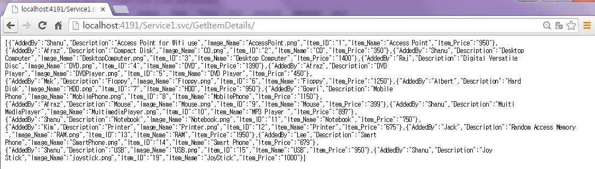

&nbsp;<strong style="outline:0px; color:#333333; text-transform:none; line-height:21px; text-indent:0px; letter-spacing:normal; font-family:Roboto,sans-serif; font-size:14px; font-style:normal; font-variant:normal; word-spacing:0px; white-space:normal; widows:1; background-color:#ffffff">Create
 MVC Web Application</strong> 
So now we have completed
 our WCF and now it's time to create our MVC AngularJS application.&nbsp;We can add a new project to our existing project and create a new MVC web application as in the following. 
Right-click the project
 in the solution and click Add New Project then enter your project name and click &quot;OK&quot;.

&nbsp;

&nbsp;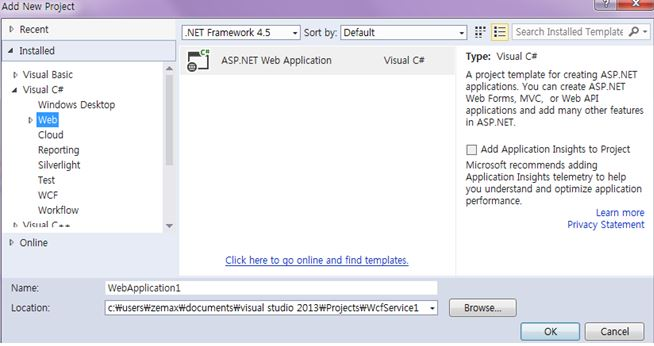

&nbsp;

Select MVC and click
 &quot;OK&quot;.

&nbsp;

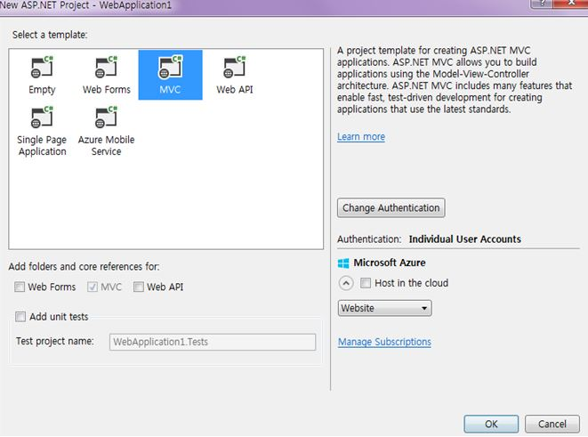

&nbsp;

&nbsp;

Now we have created
 our MVC application and it's time to add our WCF Service and install the AngularJS package in our solution. 
<strong style="outline:0px; color:#333333; text-transform:none; line-height:21px; text-indent:0px; letter-spacing:normal; font-family:Roboto,sans-serif; font-size:14px; font-style:normal; font-variant:normal; word-spacing:0px; white-space:normal; widows:1; background-color:#ffffff">Add
 WCF Service:&nbsp;</strong>Right-click
 MVC Solution and click Add then click Service Reference. 

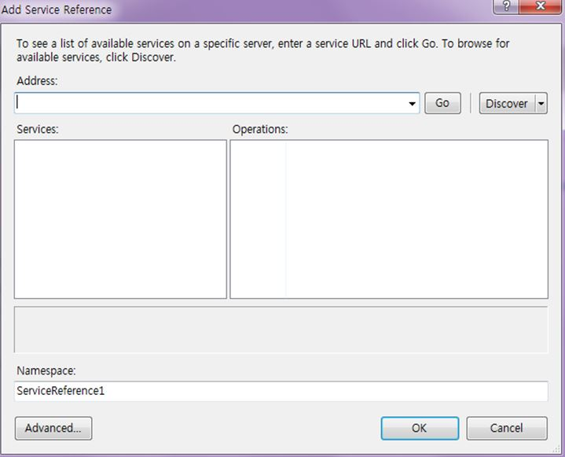

&nbsp;

Enter your WCF URL
 and click GO. Here my WCF URL is&nbsp;<a href="http://localhost:4191/Service1.svc/" style="font:14px/21px Roboto,sans-serif; outline:0px; color:#0000ff; text-transform:none; text-indent:0px; letter-spacing:normal; text-decoration:none; word-spacing:0px; white-space:normal; widows:1; background-color:#ffffff">http://localhost:4191/Service1.svc/</a>.
 Add your name and click OK. 
Now we have successfully
 added our WCF Service to our MVC Application.

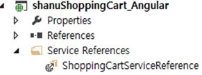

&nbsp;

<strong style="outline:0px; color:#333333; text-transform:none; line-height:21px; text-indent:0px; letter-spacing:normal; font-family:Roboto,sans-serif; font-size:14px; font-style:normal; font-variant:normal; word-spacing:0px; white-space:normal; widows:1; background-color:#ffffff">Procedure
 to Install AngularJS package</strong> 
Right-click your MVC project
 and click Manage NuGet Packages.

&nbsp;

Select Online and
 Search for AngularJS. Select the AngularJs and click Install.

&nbsp;

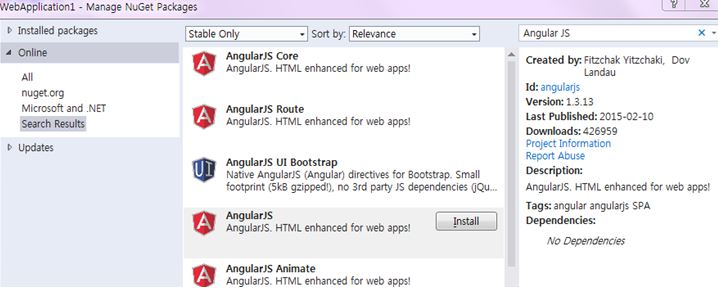

&nbsp;

Now we have Installed
 the AngularJS package into our MVC Project. Now let's create our AngularJs.
<ul style="font:14px/21px Roboto,sans-serif; outline:0px; color:#333333; text-transform:none; text-indent:0px; letter-spacing:normal; word-spacing:0px; white-space:normal; widows:1; background-color:#ffffff">
<li style="outline:0px">Modules.js&nbsp; </li><li style="outline:0px">Controllers.js&nbsp; </li><li style="outline:0px">shoppingController.js </li><li style="outline:0px">Services.js </li></ul>
Note here I have created
 2 AngularJs controllers, &ldquo;Controllers.js&rdquo; and &ldquo;shoppingController.js&rdquo;. I will be using &ldquo;shoppingController.js&rdquo; for the Shopping Cart Page and &ldquo;Controller.js&rdquo; for New Item Add and Upload new Item Image to the
 root folder. 
<strong style="outline:0px; color:#333333; text-transform:none; line-height:21px; text-indent:0px; letter-spacing:normal; font-family:Roboto,sans-serif; font-size:14px; font-style:normal; font-variant:normal; word-spacing:0px; white-space:normal; widows:1; background-color:#ffffff">Procedure
 to Create AngularJs Script Files</strong> 
Right-click the Scripts
 folder and create your own folder to create the AngularJs Model/Controller and Service JavaScript. In your Scripts folder add three JavaScript files and name them Modules.js, Controllers.js and Services.js as in the following.

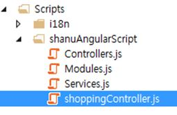

&nbsp;<strong style="outline:0px; color:#333333; text-transform:none; line-height:21px; text-indent:0px; letter-spacing:normal; font-family:Roboto,sans-serif; font-size:14px; font-style:normal; font-variant:normal; word-spacing:0px; white-space:normal; widows:1; background-color:#ffffff">Modules.js:</strong>&nbsp;Here
 we add the reference to the Angular.js JavaScript. In our application we will use AngularJs FileUpload from our MVC Controller. In order to use the File Upload we need to add the &ldquo;angular-file-upload.js&rdquo; and &ldquo;angular-file-upload.min.js&rdquo;.
 We provide our module name as &ldquo;RESTClientModule&rdquo;.&nbsp;

&nbsp;

JavaScript

Edit|Remove

js

<pre class="js">///&nbsp;&lt;reference&nbsp;path=&quot;../angular.js&quot;&nbsp;/&gt;&nbsp;&nbsp;
///&nbsp;&lt;reference&nbsp;path=&quot;../angular.min.js&quot;&nbsp;/&gt;&nbsp;&nbsp;&nbsp;&nbsp;
///&nbsp;&lt;reference&nbsp;path=&quot;../angular-animate.js&quot;&nbsp;/&gt;&nbsp;&nbsp;&nbsp;&nbsp;
///&nbsp;&lt;reference&nbsp;path=&quot;../angular-animate.min.js&quot;&nbsp;/&gt;&nbsp;&nbsp;&nbsp;&nbsp;
///&nbsp;&lt;reference&nbsp;path=&quot;../angular-file-upload.js&quot;&nbsp;/&gt;&nbsp;&nbsp;&nbsp;&nbsp;
///&nbsp;&lt;reference&nbsp;path=&quot;../angular-file-upload.min.js&quot;&nbsp;/&gt;&nbsp;&nbsp;&nbsp;&nbsp;
var&nbsp;app;&nbsp;
&nbsp;
(function&nbsp;()&nbsp;{&nbsp;
&nbsp;&nbsp;&nbsp;&nbsp;app&nbsp;=&nbsp;angular.module(&quot;RESTClientModule&quot;,&nbsp;[]);&nbsp;
})();&nbsp;
</pre>

&nbsp;<strong style="outline:0px; color:#333333; text-transform:none; line-height:21px; text-indent:0px; letter-spacing:normal; font-family:Roboto,sans-serif; font-size:14px; font-style:normal; font-variant:normal; word-spacing:0px; white-space:normal; widows:1; background-color:#ffffff">Services.js:</strong>&nbsp;Here
 we provide a name for our service and we use this name in controllers.js. Here for the Angular service I have given the name &quot;AngularJs_WCFService&quot;. You can provide your own name but be careful of changing the name in Controllers.js. Angularjs can receive
 JSON data, here we can see I have provided our WCS service URL to get the Item details as JSON data. To insert Item information result to Database we pass the data as JSON data to our WCF insert method as a parameter.

&nbsp;

JavaScript

Edit|Remove

js

<pre class="js">///&nbsp;&lt;reference&nbsp;path=&quot;../angular.js&quot;&nbsp;/&gt;&nbsp;&nbsp;&nbsp;
///&nbsp;&lt;reference&nbsp;path=&quot;../angular.min.js&quot;&nbsp;/&gt;&nbsp;&nbsp;&nbsp;&nbsp;
///&nbsp;&lt;reference&nbsp;path=&quot;../angular-animate.js&quot;&nbsp;/&gt;&nbsp;&nbsp;&nbsp;&nbsp;
///&nbsp;&lt;reference&nbsp;path=&quot;../angular-animate.min.js&quot;&nbsp;/&gt;&nbsp;&nbsp;&nbsp;&nbsp;
///&nbsp;&lt;reference&nbsp;path=&quot;Modules.js&quot;&nbsp;/&gt;&nbsp;&nbsp;&nbsp;&nbsp;
&nbsp;
app.service(&quot;AngularJs_WCFService&quot;,&nbsp;function&nbsp;($http)&nbsp;{&nbsp;
&nbsp;&nbsp;&nbsp;&nbsp;//Get&nbsp;Order&nbsp;Master&nbsp;Records&nbsp;&nbsp;&nbsp;
&nbsp;&nbsp;&nbsp;&nbsp;this.GetItemDetails&nbsp;=&nbsp;function&nbsp;()&nbsp;{&nbsp;
&nbsp;&nbsp;&nbsp;&nbsp;&nbsp;&nbsp;&nbsp;&nbsp;return&nbsp;$http.get(&quot;http://localhost:4191/Service1.svc/GetItemDetails/&quot;);&nbsp;
&nbsp;&nbsp;&nbsp;&nbsp;};&nbsp;
&nbsp;
&nbsp;&nbsp;&nbsp;&nbsp;//To&nbsp;Save&nbsp;the&nbsp;Item&nbsp;Details&nbsp;with&nbsp;Image&nbsp;Name&nbsp;to&nbsp;the&nbsp;Database&nbsp;&nbsp;&nbsp;&nbsp;&nbsp;&nbsp;&nbsp;
&nbsp;&nbsp;&nbsp;&nbsp;this.post&nbsp;=&nbsp;function&nbsp;(ItemDetails)&nbsp;{&nbsp;
&nbsp;&nbsp;&nbsp;&nbsp;&nbsp;&nbsp;&nbsp;&nbsp;var&nbsp;request&nbsp;=&nbsp;$http({&nbsp;
&nbsp;&nbsp;&nbsp;&nbsp;&nbsp;&nbsp;&nbsp;&nbsp;&nbsp;&nbsp;&nbsp;&nbsp;method:&nbsp;&quot;post&quot;,&nbsp;
&nbsp;&nbsp;&nbsp;&nbsp;&nbsp;&nbsp;&nbsp;&nbsp;&nbsp;&nbsp;&nbsp;&nbsp;url:&nbsp;&quot;http://localhost:4191/Service1.svc/addItemMaster&quot;,&nbsp;
&nbsp;&nbsp;&nbsp;&nbsp;&nbsp;&nbsp;&nbsp;&nbsp;&nbsp;&nbsp;&nbsp;&nbsp;data:&nbsp;ItemDetails&nbsp;
&nbsp;&nbsp;&nbsp;&nbsp;&nbsp;&nbsp;&nbsp;&nbsp;});&nbsp;&nbsp;&nbsp;
&nbsp;&nbsp;&nbsp;&nbsp;&nbsp;&nbsp;return&nbsp;request;&nbsp;&nbsp;&nbsp;&nbsp;
&nbsp;&nbsp;&nbsp;}&nbsp;&nbsp;&nbsp;&nbsp;&nbsp;&nbsp;&nbsp;
});&nbsp;
</pre>

&nbsp;

<strong style="outline:0px; color:#333333; text-transform:none; line-height:21px; text-indent:0px; letter-spacing:normal; font-family:Roboto,sans-serif; font-size:14px; font-style:normal; font-variant:normal; word-spacing:0px; white-space:normal; widows:1; background-color:#ffffff">AngularJs
 Controller:</strong>&nbsp;In
 this application I have created 2 controllers to be used for the Item Master Insert page and for the Shopping Cart Page. We will see one by one here. 
 
<strong style="outline:0px; color:#333333; text-transform:none; line-height:21px; text-indent:0px; letter-spacing:normal; font-family:Roboto,sans-serif; font-size:14px; font-style:normal; font-variant:normal; word-spacing:0px; white-space:normal; widows:1; background-color:#ffffff">shoppingController.js:</strong>&nbsp;Here
 we add the reference to the Angular.js JavaScript and our Module.js and Services.js. The same as for Services, the controller I have given the name &quot;<strong style="outline:0px; color:#333333; text-transform:none; line-height:21px; text-indent:0px; letter-spacing:normal; font-family:Roboto,sans-serif; font-size:14px; font-style:normal; font-variant:normal; word-spacing:0px; white-space:normal; widows:1; background-color:#ffffff">AngularJs_ShoppingFController</strong>&quot;. 
 
In the Controller I have
 performed all the business logic and returned the data from WCF JSON data to our MVC HTML page. Before each variable and method I have added a comment to explain it. 
 
<strong style="outline:0px; color:#333333; text-transform:none; line-height:21px; text-indent:0px; letter-spacing:normal; font-family:Roboto,sans-serif; font-size:14px; font-style:normal; font-variant:normal; word-spacing:0px; white-space:normal; widows:1; background-color:#ffffff">Variable
 declarations:&nbsp;</strong>First
 I declared all the local variables to be used and the current date and stored the date using $scope.date. 
<strong style="outline:0px; color:#333333; text-transform:none; line-height:21px; text-indent:0px; letter-spacing:normal; font-family:Roboto,sans-serif; font-size:14px; font-style:normal; font-variant:normal; word-spacing:0px; white-space:normal; widows:1; background-color:#ffffff">Methods:&nbsp;</strong>GetItemDetails() 
This method gets all the
 details of the items from JSON and binds the result to the Shopping page. 
<strong style="outline:0px; color:#333333; text-transform:none; line-height:21px; text-indent:0px; letter-spacing:normal; font-family:Roboto,sans-serif; font-size:14px; font-style:normal; font-variant:normal; word-spacing:0px; white-space:normal; widows:1; background-color:#ffffff">$scope.showImage&nbsp;</strong>=
 function (imageNm, ItemID, ItemName, ItemPrize, ItemDescription){ 
This method gets all the
 details when the user clicks on the image inside the grid and displays the details to add items to the cart. 
<strong style="outline:0px; color:#333333; text-transform:none; line-height:21px; text-indent:0px; letter-spacing:normal; font-family:Roboto,sans-serif; font-size:14px; font-style:normal; font-variant:normal; word-spacing:0px; white-space:normal; widows:1; background-color:#ffffff">$scope.showMyCart</strong>&nbsp;=
 function () 
This method will hide
 the detail table row and display the cart Items. 
 
<strong style="outline:0px; color:#333333; text-transform:none; line-height:21px; text-indent:0px; letter-spacing:normal; font-family:Roboto,sans-serif; font-size:14px; font-style:normal; font-variant:normal; word-spacing:0px; white-space:normal; widows:1; background-color:#ffffff">function
 getItemTotalresult()</strong> 
This method calculates
 the TotalPrice, TotalQty and Grand Total price. 
 

<strong style="outline:0px">function addItemstoCart()</strong>&nbsp;

This method will add the
 Items to the cart and if the Item already exists then the Qty will be incremnet by 1. 
 
<strong style="outline:0px; color:#333333; text-transform:none; line-height:21px; text-indent:0px; letter-spacing:normal; font-family:Roboto,sans-serif; font-size:14px; font-style:normal; font-variant:normal; word-spacing:0px; white-space:normal; widows:1; background-color:#ffffff">$scope.removeFromCart</strong>&nbsp;=
 function (index) 
This method removes the
 Item from the cart. Each Item inside the cart can be removed. From our MVC HTML page we pass the Row Index number to this method to remove the item from the array. 
 
<strong style="outline:0px; color:#333333; text-transform:none; line-height:21px; text-indent:0px; letter-spacing:normal; font-family:Roboto,sans-serif; font-size:14px; font-style:normal; font-variant:normal; word-spacing:0px; white-space:normal; widows:1; background-color:#ffffff">shoppingController.js</strong>&nbsp;full
 source code&nbsp;

&nbsp;

JavaScript

Edit|Remove

js

<pre class="js">///&nbsp;&lt;reference&nbsp;path=&quot;../angular.js&quot;&nbsp;/&gt;&nbsp;&nbsp;&nbsp;
///&nbsp;&lt;reference&nbsp;path=&quot;../angular.min.js&quot;&nbsp;/&gt;&nbsp;&nbsp;&nbsp;&nbsp;
///&nbsp;&lt;reference&nbsp;path=&quot;../angular-animate.js&quot;&nbsp;/&gt;&nbsp;&nbsp;&nbsp;&nbsp;
///&nbsp;&lt;reference&nbsp;path=&quot;../angular-animate.min.js&quot;&nbsp;/&gt;&nbsp;&nbsp;&nbsp;&nbsp;
///&nbsp;&lt;reference&nbsp;path=&quot;Modules.js&quot;&nbsp;/&gt;&nbsp;&nbsp;&nbsp;&nbsp;
///&nbsp;&lt;reference&nbsp;path=&quot;Services.js&quot;&nbsp;/&gt;&nbsp;&nbsp;&nbsp;&nbsp;
&nbsp;
app.controller(&quot;AngularJs_ShoppingFController&quot;,&nbsp;function&nbsp;($scope,&nbsp;$http,&nbsp;$timeout,&nbsp;$rootScope,&nbsp;$window,&nbsp;AngularJs_WCFService)&nbsp;{&nbsp;
&nbsp;&nbsp;&nbsp;&nbsp;$scope.date&nbsp;=&nbsp;new&nbsp;Date();&nbsp;
&nbsp;&nbsp;&nbsp;&nbsp;//&nbsp;&nbsp;To&nbsp;set&nbsp;and&nbsp;get&nbsp;the&nbsp;Item&nbsp;Details&nbsp;values&nbsp;
&nbsp;&nbsp;&nbsp;&nbsp;var&nbsp;firstbool&nbsp;=&nbsp;true;&nbsp;
&nbsp;&nbsp;&nbsp;&nbsp;$scope.Imagename&nbsp;=&nbsp;&quot;&quot;;&nbsp;
&nbsp;&nbsp;&nbsp;&nbsp;$scope.Item_ID&nbsp;=&nbsp;&quot;&quot;;&nbsp;
&nbsp;&nbsp;&nbsp;&nbsp;$scope.Item_Name&nbsp;=&nbsp;&quot;&quot;;&nbsp;
&nbsp;&nbsp;&nbsp;&nbsp;$scope.Description&nbsp;=&nbsp;&quot;&quot;;&nbsp;
&nbsp;&nbsp;&nbsp;&nbsp;$scope.Item_Price&nbsp;=&nbsp;&quot;0&quot;;&nbsp;
&nbsp;&nbsp;&nbsp;&nbsp;$scope.txtAddedBy&nbsp;=&nbsp;&quot;&quot;;&nbsp;
&nbsp;&nbsp;&nbsp;&nbsp;//&nbsp;Item&nbsp;List&nbsp;Arrays.This&nbsp;arrays&nbsp;will&nbsp;be&nbsp;used&nbsp;to&nbsp;Add&nbsp;and&nbsp;Remove&nbsp;Items&nbsp;to&nbsp;the&nbsp;Cart.&nbsp;
&nbsp;&nbsp;&nbsp;&nbsp;$scope.items&nbsp;=&nbsp;[];&nbsp;
&nbsp;&nbsp;&nbsp;&nbsp;//to&nbsp;display&nbsp;the&nbsp;Table&nbsp;for&nbsp;Shopping&nbsp;cart&nbsp;Page.&nbsp;
&nbsp;&nbsp;&nbsp;&nbsp;$scope.showItem&nbsp;=&nbsp;false;&nbsp;
&nbsp;&nbsp;&nbsp;&nbsp;$scope.showDetails&nbsp;=&nbsp;false;&nbsp;
&nbsp;&nbsp;&nbsp;&nbsp;$scope.showCartDetails&nbsp;=&nbsp;false;&nbsp;
&nbsp;&nbsp;&nbsp;&nbsp;//This&nbsp;variable&nbsp;will&nbsp;be&nbsp;used&nbsp;to&nbsp;Increment&nbsp;the&nbsp;item&nbsp;Quantity&nbsp;by&nbsp;every&nbsp;click.&nbsp;
&nbsp;&nbsp;&nbsp;&nbsp;var&nbsp;ItemCountExist&nbsp;=&nbsp;0;&nbsp;
&nbsp;&nbsp;&nbsp;&nbsp;//This&nbsp;variable&nbsp;will&nbsp;be&nbsp;used&nbsp;to&nbsp;calculate&nbsp;and&nbsp;display&nbsp;the&nbsp;Cat&nbsp;Total&nbsp;Price,Total&nbsp;Qty&nbsp;and&nbsp;GrandTotal&nbsp;result&nbsp;in&nbsp;Cart&nbsp;
&nbsp;&nbsp;&nbsp;&nbsp;$scope.totalPrice&nbsp;=&nbsp;0;&nbsp;
&nbsp;&nbsp;&nbsp;&nbsp;$scope.totalQty&nbsp;=&nbsp;0;&nbsp;
&nbsp;&nbsp;&nbsp;&nbsp;$scope.GrandtotalPrice&nbsp;=&nbsp;0;&nbsp;
&nbsp;&nbsp;&nbsp;
&nbsp;&nbsp;&nbsp;&nbsp;//&nbsp;This&nbsp;is&nbsp;publich&nbsp;method&nbsp;which&nbsp;will&nbsp;be&nbsp;called&nbsp;initially&nbsp;and&nbsp;load&nbsp;all&nbsp;the&nbsp;item&nbsp;Details.&nbsp;
&nbsp;&nbsp;&nbsp;&nbsp;GetItemDetails();&nbsp;
&nbsp;&nbsp;&nbsp;&nbsp;//To&nbsp;Get&nbsp;All&nbsp;Records&nbsp;&nbsp;&nbsp;&nbsp;
&nbsp;&nbsp;&nbsp;&nbsp;function&nbsp;GetItemDetails()&nbsp;{&nbsp;
&nbsp;&nbsp;&nbsp;&nbsp;&nbsp;&nbsp;&nbsp;&nbsp;$scope.showItem&nbsp;=&nbsp;false;&nbsp;
&nbsp;&nbsp;&nbsp;&nbsp;&nbsp;&nbsp;&nbsp;&nbsp;$scope.showDetails&nbsp;=&nbsp;true;&nbsp;
&nbsp;&nbsp;&nbsp;&nbsp;&nbsp;&nbsp;&nbsp;&nbsp;$scope.showCartDetails&nbsp;=&nbsp;false;&nbsp;
&nbsp;&nbsp;&nbsp;&nbsp;&nbsp;&nbsp;&nbsp;&nbsp;var&nbsp;promiseGet&nbsp;=&nbsp;AngularJs_WCFService.GetItemDetails();&nbsp;
&nbsp;&nbsp;&nbsp;&nbsp;&nbsp;&nbsp;&nbsp;&nbsp;promiseGet.then(function&nbsp;(pl)&nbsp;{&nbsp;
&nbsp;&nbsp;&nbsp;&nbsp;&nbsp;&nbsp;&nbsp;&nbsp;&nbsp;&nbsp;&nbsp;&nbsp;$scope.getItemDetailsDisp&nbsp;=&nbsp;pl.data&nbsp;
&nbsp;&nbsp;&nbsp;&nbsp;&nbsp;&nbsp;&nbsp;&nbsp;},&nbsp;
&nbsp;&nbsp;&nbsp;&nbsp;&nbsp;&nbsp;&nbsp;&nbsp;&nbsp;&nbsp;&nbsp;&nbsp;&nbsp;function&nbsp;(errorPl)&nbsp;{&nbsp;
&nbsp;&nbsp;&nbsp;&nbsp;&nbsp;&nbsp;&nbsp;&nbsp;&nbsp;&nbsp;&nbsp;&nbsp;&nbsp;});&nbsp;
&nbsp;&nbsp;&nbsp;&nbsp;}&nbsp;&nbsp;&nbsp;&nbsp;
&nbsp;&nbsp;&nbsp;&nbsp;//This&nbsp;method&nbsp;used&nbsp;to&nbsp;get&nbsp;all&nbsp;the&nbsp;details&nbsp;when&nbsp;user&nbsp;clicks&nbsp;on&nbsp;Image&nbsp;Inside&nbsp;the&nbsp;Grid&nbsp;and&nbsp;display&nbsp;the&nbsp;details&nbsp;to&nbsp;add&nbsp;items&nbsp;to&nbsp;the&nbsp;Cart&nbsp;
&nbsp;&nbsp;&nbsp;&nbsp;$scope.showImage&nbsp;=&nbsp;function&nbsp;(imageNm,&nbsp;ItemID,&nbsp;ItemName,&nbsp;ItemPrize,&nbsp;ItemDescription)&nbsp;{&nbsp;
&nbsp;&nbsp;&nbsp;&nbsp;&nbsp;&nbsp;&nbsp;
&nbsp;&nbsp;&nbsp;&nbsp;&nbsp;&nbsp;&nbsp;&nbsp;$scope.Imagename&nbsp;=&nbsp;imageNm;&nbsp;
&nbsp;&nbsp;&nbsp;&nbsp;&nbsp;&nbsp;&nbsp;&nbsp;$scope.Item_ID&nbsp;=&nbsp;ItemID;&nbsp;
&nbsp;&nbsp;&nbsp;&nbsp;&nbsp;&nbsp;&nbsp;&nbsp;$scope.Item_Name&nbsp;=&nbsp;ItemName;&nbsp;
&nbsp;&nbsp;&nbsp;&nbsp;&nbsp;&nbsp;&nbsp;&nbsp;$scope.Description&nbsp;=&nbsp;ItemDescription;&nbsp;
&nbsp;&nbsp;&nbsp;&nbsp;&nbsp;&nbsp;&nbsp;&nbsp;$scope.Item_Price&nbsp;=&nbsp;ItemPrize;&nbsp;
&nbsp;&nbsp;&nbsp;&nbsp;&nbsp;&nbsp;&nbsp;&nbsp;$scope.showItem&nbsp;=&nbsp;true;&nbsp;
&nbsp;&nbsp;&nbsp;&nbsp;&nbsp;&nbsp;&nbsp;&nbsp;$scope.showDetails&nbsp;=&nbsp;true;&nbsp;
&nbsp;&nbsp;&nbsp;&nbsp;&nbsp;&nbsp;&nbsp;&nbsp;$scope.showCartDetails&nbsp;=&nbsp;false;&nbsp;
&nbsp;&nbsp;&nbsp;&nbsp;&nbsp;&nbsp;&nbsp;&nbsp;ItemCountExist&nbsp;=&nbsp;0;&nbsp;
&nbsp;&nbsp;&nbsp;&nbsp;}&nbsp;
&nbsp;
&nbsp;&nbsp;&nbsp;&nbsp;//This&nbsp;method&nbsp;will&nbsp;hide&nbsp;the&nbsp;detail&nbsp;table&nbsp;Row&nbsp;and&nbsp;display&nbsp;the&nbsp;Cart&nbsp;Items&nbsp;
&nbsp;&nbsp;&nbsp;&nbsp;
&nbsp;&nbsp;&nbsp;&nbsp;$scope.showMyCart&nbsp;=&nbsp;function&nbsp;()&nbsp;{&nbsp;
&nbsp;&nbsp;&nbsp;&nbsp;&nbsp;&nbsp;&nbsp;&nbsp;if&nbsp;($scope.items.length&nbsp;&gt;&nbsp;0)&nbsp;
&nbsp;&nbsp;&nbsp;&nbsp;&nbsp;&nbsp;&nbsp;&nbsp;{&nbsp;
&nbsp;&nbsp;&nbsp;&nbsp;&nbsp;&nbsp;&nbsp;&nbsp;&nbsp;&nbsp;&nbsp;&nbsp;alert(&quot;You&nbsp;have&nbsp;added&nbsp;&quot;&nbsp;&#43;$scope.items.length&nbsp;&#43;&nbsp;&quot;&nbsp;Items&nbsp;in&nbsp;Your&nbsp;Cart&nbsp;!&quot;);&nbsp;
&nbsp;&nbsp;&nbsp;&nbsp;&nbsp;&nbsp;&nbsp;&nbsp;&nbsp;&nbsp;&nbsp;&nbsp;$scope.showItem&nbsp;=&nbsp;false;&nbsp;
&nbsp;&nbsp;&nbsp;&nbsp;&nbsp;&nbsp;&nbsp;&nbsp;&nbsp;&nbsp;&nbsp;&nbsp;$scope.showDetails&nbsp;=&nbsp;false;&nbsp;
&nbsp;&nbsp;&nbsp;&nbsp;&nbsp;&nbsp;&nbsp;&nbsp;&nbsp;&nbsp;&nbsp;&nbsp;$scope.showCartDetails&nbsp;=&nbsp;true;&nbsp;&nbsp;
&nbsp;&nbsp;&nbsp;&nbsp;&nbsp;&nbsp;&nbsp;&nbsp;}&nbsp;
&nbsp;&nbsp;&nbsp;&nbsp;&nbsp;&nbsp;&nbsp;&nbsp;else&nbsp;{&nbsp;
&nbsp;&nbsp;&nbsp;&nbsp;&nbsp;&nbsp;&nbsp;&nbsp;&nbsp;&nbsp;&nbsp;&nbsp;alert(&quot;Ther&nbsp;is&nbsp;no&nbsp;Items&nbsp;In&nbsp;your&nbsp;Cart.Add&nbsp;Items&nbsp;to&nbsp;view&nbsp;your&nbsp;Cart&nbsp;Details&nbsp;!&quot;)&nbsp;
&nbsp;&nbsp;&nbsp;&nbsp;&nbsp;&nbsp;&nbsp;&nbsp;}&nbsp;
&nbsp;&nbsp;&nbsp;&nbsp;}&nbsp;
&nbsp;&nbsp;&nbsp;&nbsp;//This&nbsp;method&nbsp;will&nbsp;hide&nbsp;the&nbsp;detail&nbsp;table&nbsp;Row&nbsp;and&nbsp;display&nbsp;the&nbsp;Cart&nbsp;Items&nbsp;
&nbsp;&nbsp;&nbsp;&nbsp;$scope.showCart&nbsp;=&nbsp;function&nbsp;()&nbsp;{&nbsp;&nbsp;&nbsp;&nbsp;&nbsp;&nbsp;
&nbsp;&nbsp;&nbsp;&nbsp;&nbsp;&nbsp;&nbsp;&nbsp;//alert(shoppingCartList.length);&nbsp;
&nbsp;&nbsp;&nbsp;&nbsp;&nbsp;&nbsp;&nbsp;&nbsp;$scope.showItem&nbsp;=&nbsp;true;&nbsp;
&nbsp;&nbsp;&nbsp;&nbsp;&nbsp;&nbsp;&nbsp;&nbsp;$scope.showDetails&nbsp;=&nbsp;false;&nbsp;
&nbsp;&nbsp;&nbsp;&nbsp;&nbsp;&nbsp;&nbsp;&nbsp;$scope.showCartDetails&nbsp;=&nbsp;true;&nbsp;
&nbsp;&nbsp;&nbsp;&nbsp;&nbsp;&nbsp;&nbsp;&nbsp;addItemstoCart();&nbsp;&nbsp;&nbsp;&nbsp;&nbsp;&nbsp;&nbsp;
&nbsp;&nbsp;&nbsp;&nbsp;}&nbsp;&nbsp;&nbsp;
&nbsp;&nbsp;&nbsp;//&nbsp;This&nbsp;method&nbsp;is&nbsp;to&nbsp;calculate&nbsp;the&nbsp;TotalPrice,TotalQty&nbsp;and&nbsp;Grand&nbsp;Total&nbsp;price&nbsp;
&nbsp;&nbsp;&nbsp;&nbsp;function&nbsp;getItemTotalresult()&nbsp;{&nbsp;
&nbsp;&nbsp;&nbsp;&nbsp;&nbsp;&nbsp;&nbsp;&nbsp;$scope.totalPrice&nbsp;=&nbsp;0;&nbsp;
&nbsp;&nbsp;&nbsp;&nbsp;&nbsp;&nbsp;&nbsp;&nbsp;$scope.totalQty&nbsp;=&nbsp;0;&nbsp;
&nbsp;&nbsp;&nbsp;&nbsp;&nbsp;&nbsp;&nbsp;&nbsp;$scope.GrandtotalPrice&nbsp;=&nbsp;0;&nbsp;
&nbsp;&nbsp;&nbsp;&nbsp;&nbsp;&nbsp;&nbsp;&nbsp;for&nbsp;(count&nbsp;=&nbsp;0;&nbsp;count&nbsp;&lt;&nbsp;$scope.items.length;&nbsp;count&#43;&#43;)&nbsp;{&nbsp;&nbsp;&nbsp;&nbsp;&nbsp;&nbsp;&nbsp;&nbsp;&nbsp;&nbsp;
&nbsp;&nbsp;&nbsp;&nbsp;&nbsp;&nbsp;&nbsp;&nbsp;&nbsp;&nbsp;&nbsp;&nbsp;$scope.totalPrice&nbsp;&#43;=&nbsp;parseInt($scope.items[count].Item_Prices&nbsp;);&nbsp;
&nbsp;&nbsp;&nbsp;&nbsp;&nbsp;&nbsp;&nbsp;&nbsp;&nbsp;&nbsp;&nbsp;&nbsp;$scope.totalQty&nbsp;&#43;=&nbsp;($scope.items[count].ItemCounts);&nbsp;&nbsp;&nbsp;&nbsp;&nbsp;&nbsp;&nbsp;&nbsp;&nbsp;&nbsp;&nbsp;&nbsp;
&nbsp;
&nbsp;&nbsp;&nbsp;&nbsp;&nbsp;&nbsp;&nbsp;&nbsp;&nbsp;&nbsp;&nbsp;&nbsp;$scope.GrandtotalPrice&nbsp;&#43;=&nbsp;($scope.items[count].Item_Prices&nbsp;*&nbsp;$scope.items[count].ItemCounts);&nbsp;
&nbsp;&nbsp;&nbsp;&nbsp;&nbsp;&nbsp;&nbsp;&nbsp;}&nbsp;&nbsp;&nbsp;&nbsp;&nbsp;&nbsp;&nbsp;&nbsp;&nbsp;&nbsp;&nbsp;
&nbsp;&nbsp;&nbsp;&nbsp;}&nbsp;
&nbsp;&nbsp;&nbsp;&nbsp;&nbsp;
&nbsp;&nbsp;&nbsp;//This&nbsp;method&nbsp;will&nbsp;add&nbsp;the&nbsp;Items&nbsp;to&nbsp;the&nbsp;cart&nbsp;and&nbsp;if&nbsp;the&nbsp;Item&nbsp;already&nbsp;exist&nbsp;then&nbsp;the&nbsp;Qty&nbsp;will&nbsp;be&nbsp;incremnet&nbsp;by&nbsp;1.&nbsp;
&nbsp;&nbsp;&nbsp;&nbsp;function&nbsp;addItemstoCart()&nbsp;{&nbsp;
&nbsp;&nbsp;&nbsp;&nbsp;&nbsp;&nbsp;&nbsp;&nbsp;
&nbsp;&nbsp;&nbsp;&nbsp;&nbsp;&nbsp;&nbsp;&nbsp;if&nbsp;($scope.items.length&nbsp;&gt;&nbsp;0)&nbsp;
&nbsp;&nbsp;&nbsp;&nbsp;&nbsp;&nbsp;&nbsp;&nbsp;&nbsp;&nbsp;&nbsp;&nbsp;{&nbsp;
&nbsp;&nbsp;&nbsp;&nbsp;&nbsp;&nbsp;&nbsp;&nbsp;&nbsp;&nbsp;&nbsp;&nbsp;for&nbsp;(count&nbsp;=&nbsp;0;&nbsp;count&nbsp;&lt;&nbsp;$scope.items.length;&nbsp;count&#43;&#43;)&nbsp;{&nbsp;
&nbsp;&nbsp;&nbsp;&nbsp;&nbsp;&nbsp;&nbsp;&nbsp;&nbsp;&nbsp;&nbsp;&nbsp;&nbsp;&nbsp;&nbsp;
&nbsp;&nbsp;&nbsp;&nbsp;&nbsp;&nbsp;&nbsp;&nbsp;&nbsp;&nbsp;&nbsp;&nbsp;&nbsp;&nbsp;&nbsp;&nbsp;if&nbsp;($scope.items[count].Item_Names&nbsp;==&nbsp;$scope.Item_Name)&nbsp;{&nbsp;
&nbsp;
&nbsp;&nbsp;&nbsp;&nbsp;&nbsp;&nbsp;&nbsp;&nbsp;&nbsp;&nbsp;&nbsp;&nbsp;&nbsp;&nbsp;&nbsp;&nbsp;&nbsp;&nbsp;&nbsp;&nbsp;ItemCountExist&nbsp;=&nbsp;$scope.items[count].ItemCounts&nbsp;&#43;&nbsp;1;&nbsp;
&nbsp;&nbsp;&nbsp;&nbsp;&nbsp;&nbsp;&nbsp;&nbsp;&nbsp;&nbsp;&nbsp;&nbsp;&nbsp;&nbsp;&nbsp;&nbsp;&nbsp;&nbsp;&nbsp;&nbsp;$scope.items[count].ItemCounts&nbsp;=&nbsp;ItemCountExist;&nbsp;
&nbsp;&nbsp;&nbsp;&nbsp;&nbsp;&nbsp;&nbsp;&nbsp;&nbsp;&nbsp;&nbsp;&nbsp;&nbsp;&nbsp;&nbsp;&nbsp;}&nbsp;&nbsp;
&nbsp;&nbsp;&nbsp;&nbsp;&nbsp;&nbsp;&nbsp;&nbsp;&nbsp;&nbsp;&nbsp;&nbsp;}&nbsp;&nbsp;&nbsp;&nbsp;&nbsp;&nbsp;&nbsp;&nbsp;}&nbsp;
&nbsp;&nbsp;&nbsp;&nbsp;&nbsp;&nbsp;&nbsp;&nbsp;if&nbsp;(ItemCountExist&nbsp;&lt;=&nbsp;0)&nbsp;
&nbsp;&nbsp;&nbsp;&nbsp;&nbsp;&nbsp;&nbsp;&nbsp;{&nbsp;
&nbsp;&nbsp;&nbsp;&nbsp;&nbsp;&nbsp;&nbsp;&nbsp;&nbsp;&nbsp;&nbsp;&nbsp;ItemCountExist&nbsp;=&nbsp;1;&nbsp;
&nbsp;&nbsp;&nbsp;&nbsp;&nbsp;&nbsp;&nbsp;&nbsp;&nbsp;&nbsp;&nbsp;&nbsp;var&nbsp;ItmDetails&nbsp;=&nbsp;{&nbsp;
&nbsp;&nbsp;&nbsp;&nbsp;&nbsp;&nbsp;&nbsp;&nbsp;&nbsp;&nbsp;&nbsp;&nbsp;&nbsp;&nbsp;&nbsp;&nbsp;Item_IDs:&nbsp;$scope.Item_ID,&nbsp;
&nbsp;&nbsp;&nbsp;&nbsp;&nbsp;&nbsp;&nbsp;&nbsp;&nbsp;&nbsp;&nbsp;&nbsp;&nbsp;&nbsp;&nbsp;&nbsp;Item_Names:&nbsp;$scope.Item_Name,&nbsp;
&nbsp;&nbsp;&nbsp;&nbsp;&nbsp;&nbsp;&nbsp;&nbsp;&nbsp;&nbsp;&nbsp;&nbsp;&nbsp;&nbsp;&nbsp;&nbsp;Descriptions:&nbsp;$scope.Description,&nbsp;
&nbsp;&nbsp;&nbsp;&nbsp;&nbsp;&nbsp;&nbsp;&nbsp;&nbsp;&nbsp;&nbsp;&nbsp;&nbsp;&nbsp;&nbsp;&nbsp;Item_Prices:&nbsp;$scope.Item_Price,&nbsp;
&nbsp;&nbsp;&nbsp;&nbsp;&nbsp;&nbsp;&nbsp;&nbsp;&nbsp;&nbsp;&nbsp;&nbsp;&nbsp;&nbsp;&nbsp;&nbsp;Image_Names:&nbsp;$scope.Imagename,&nbsp;
&nbsp;&nbsp;&nbsp;&nbsp;&nbsp;&nbsp;&nbsp;&nbsp;&nbsp;&nbsp;&nbsp;&nbsp;&nbsp;&nbsp;&nbsp;&nbsp;ItemCounts:&nbsp;ItemCountExist&nbsp;
&nbsp;&nbsp;&nbsp;&nbsp;&nbsp;&nbsp;&nbsp;&nbsp;&nbsp;&nbsp;&nbsp;&nbsp;};&nbsp;
&nbsp;&nbsp;&nbsp;&nbsp;&nbsp;&nbsp;&nbsp;&nbsp;&nbsp;&nbsp;&nbsp;&nbsp;$scope.items.push(ItmDetails);&nbsp;
&nbsp;&nbsp;&nbsp;&nbsp;&nbsp;&nbsp;&nbsp;&nbsp;&nbsp;&nbsp;&nbsp;&nbsp;$scope.item&nbsp;=&nbsp;{};&nbsp;
&nbsp;&nbsp;&nbsp;&nbsp;&nbsp;&nbsp;&nbsp;&nbsp;}&nbsp;
&nbsp;&nbsp;&nbsp;&nbsp;&nbsp;&nbsp;&nbsp;&nbsp;getItemTotalresult();&nbsp;&nbsp;&nbsp;&nbsp;&nbsp;&nbsp;
&nbsp;&nbsp;&nbsp;&nbsp;}&nbsp;
&nbsp;
&nbsp;&nbsp;&nbsp;&nbsp;//This&nbsp;method&nbsp;is&nbsp;to&nbsp;remove&nbsp;the&nbsp;Item&nbsp;from&nbsp;the&nbsp;cart.Each&nbsp;Item&nbsp;inside&nbsp;the&nbsp;Cart&nbsp;can&nbsp;be&nbsp;removed.&nbsp;
&nbsp;&nbsp;&nbsp;&nbsp;$scope.removeFromCart&nbsp;=&nbsp;function&nbsp;(index)&nbsp;{&nbsp;
&nbsp;&nbsp;&nbsp;&nbsp;&nbsp;&nbsp;&nbsp;&nbsp;$scope.items.splice(index,&nbsp;1);&nbsp;
&nbsp;&nbsp;&nbsp;&nbsp;}&nbsp;
&nbsp;&nbsp;&nbsp;&nbsp;//This&nbsp;Method&nbsp;is&nbsp;to&nbsp;hide&nbsp;the&nbsp;Chopping&nbsp;cart&nbsp;details&nbsp;and&nbsp;Show&nbsp;the&nbsp;Item&nbsp;Details&nbsp;to&nbsp;add&nbsp;more&nbsp;items&nbsp;to&nbsp;the&nbsp;cart.&nbsp;
&nbsp;&nbsp;&nbsp;&nbsp;$scope.showItemDetails&nbsp;=&nbsp;function&nbsp;()&nbsp;{&nbsp;&nbsp;&nbsp;&nbsp;&nbsp;&nbsp;&nbsp;
&nbsp;&nbsp;&nbsp;&nbsp;&nbsp;&nbsp;&nbsp;&nbsp;$scope.showItem&nbsp;=&nbsp;false;&nbsp;
&nbsp;&nbsp;&nbsp;&nbsp;&nbsp;&nbsp;&nbsp;&nbsp;$scope.showDetails&nbsp;=&nbsp;true;&nbsp;
&nbsp;&nbsp;&nbsp;&nbsp;&nbsp;&nbsp;&nbsp;&nbsp;$scope.showCartDetails&nbsp;=&nbsp;false;&nbsp;
&nbsp;
&nbsp;&nbsp;&nbsp;&nbsp;}&nbsp;
});&nbsp;
</pre>

&nbsp;<strong style="outline:0px; color:#333333; text-transform:none; line-height:21px; text-indent:0px; letter-spacing:normal; font-family:Roboto,sans-serif; font-size:14px; font-style:normal; font-variant:normal; word-spacing:0px; white-space:normal; widows:1; background-color:#ffffff">Controllers.js:</strong>&nbsp;Here
 we add the reference to the Angular.js JavaScript and our Module.js and Services.js. The same as for Services, for the controller I have given the name &quot; AngularJs_WCFController &quot;. 
 
In the Controller I have
 performed all the business logic and returned the data from WCF JSON data to our MVC HTML page. Before each variable and method I have added a comment that will explain it. 
 
<strong style="outline:0px; color:#333333; text-transform:none; line-height:21px; text-indent:0px; letter-spacing:normal; font-family:Roboto,sans-serif; font-size:14px; font-style:normal; font-variant:normal; word-spacing:0px; white-space:normal; widows:1; background-color:#ffffff">Variable
 declarations:&nbsp;</strong>First
 I declared all the local variables to be used and the current date and stored the date using $scope.date. 
<strong style="outline:0px; color:#333333; text-transform:none; line-height:21px; text-indent:0px; letter-spacing:normal; font-family:Roboto,sans-serif; font-size:14px; font-style:normal; font-variant:normal; word-spacing:0px; white-space:normal; widows:1; background-color:#ffffff">Methods:&nbsp;</strong>GetItemDetails() 
This method gets all the
 details of items from the JSON and binds the result to the Shopping page. 
 
<strong style="outline:0px; color:#333333; text-transform:none; line-height:21px; text-indent:0px; letter-spacing:normal; font-family:Roboto,sans-serif; font-size:14px; font-style:normal; font-variant:normal; word-spacing:0px; white-space:normal; widows:1; background-color:#ffffff">$scope.ChechFileValid 
</strong>This method checks
 the attached image file is valid or not. If the image file is not valid then display the error message. 
 
<strong style="outline:0px; color:#333333; text-transform:none; line-height:21px; text-indent:0px; letter-spacing:normal; font-family:Roboto,sans-serif; font-size:14px; font-style:normal; font-variant:normal; word-spacing:0px; white-space:normal; widows:1; background-color:#ffffff">$scope.SaveFile&nbsp;</strong>=
 function () 
In this method pass the
 image file to the UploadFile method and once the image is uploaded successfully to our root folder the item details will be inserted into database. 

<strong style="outline:0px">fac.UploadFile</strong>&nbsp;= function (file) In this method using $http.post we pass our image file to the MVC Controller and our HTTPost method as in the following:

&nbsp;

JavaScript

Edit|Remove

js

<pre class="js">$http.post(&quot;/shanuShopping/UploadFile&quot;,&nbsp;formData,&nbsp;
&nbsp;&nbsp;&nbsp;&nbsp;&nbsp;&nbsp;&nbsp;&nbsp;&nbsp;&nbsp;&nbsp;&nbsp;{&nbsp;
&nbsp;&nbsp;&nbsp;&nbsp;&nbsp;&nbsp;&nbsp;&nbsp;&nbsp;&nbsp;&nbsp;&nbsp;&nbsp;&nbsp;&nbsp;&nbsp;withCredentials:&nbsp;true,&nbsp;
&nbsp;&nbsp;&nbsp;&nbsp;&nbsp;&nbsp;&nbsp;&nbsp;&nbsp;&nbsp;&nbsp;&nbsp;&nbsp;&nbsp;&nbsp;&nbsp;headers:&nbsp;{&nbsp;'Content-Type':&nbsp;undefined&nbsp;},&nbsp;
&nbsp;&nbsp;&nbsp;&nbsp;&nbsp;&nbsp;&nbsp;&nbsp;&nbsp;&nbsp;&nbsp;&nbsp;&nbsp;&nbsp;&nbsp;&nbsp;transformRequest:&nbsp;angular.identity&nbsp;
&nbsp;&nbsp;&nbsp;&nbsp;&nbsp;&nbsp;&nbsp;&nbsp;&nbsp;&nbsp;&nbsp;&nbsp;})&nbsp;
</pre>

&nbsp;<strong style="outline:0px; color:#333333; text-transform:none; line-height:21px; text-indent:0px; letter-spacing:normal; font-family:Roboto,sans-serif; font-size:14px; font-style:normal; font-variant:normal; word-spacing:0px; white-space:normal; widows:1; background-color:#ffffff">Note&nbsp;</strong>$http.post(&ldquo;&rdquo;)
 we need to provide our MVC Controller name and our HTTPost method name, where we upload the image to our root folder. The following is the code to upload an image to our MVC Controller.

&nbsp;

JavaScript

Edit|Remove

js

<pre class="js">[HttpPost]&nbsp;
&nbsp;&nbsp;&nbsp;&nbsp;&nbsp;&nbsp;&nbsp;&nbsp;public&nbsp;JsonResult&nbsp;UploadFile()&nbsp;
&nbsp;&nbsp;&nbsp;&nbsp;&nbsp;&nbsp;&nbsp;&nbsp;{&nbsp;
&nbsp;&nbsp;&nbsp;&nbsp;&nbsp;&nbsp;&nbsp;&nbsp;&nbsp;&nbsp;&nbsp;&nbsp;string&nbsp;Message,&nbsp;fileName;&nbsp;
&nbsp;&nbsp;&nbsp;&nbsp;&nbsp;&nbsp;&nbsp;&nbsp;&nbsp;&nbsp;&nbsp;&nbsp;Message&nbsp;=&nbsp;fileName&nbsp;=&nbsp;string.Empty;&nbsp;
&nbsp;&nbsp;&nbsp;&nbsp;&nbsp;&nbsp;&nbsp;&nbsp;&nbsp;&nbsp;&nbsp;&nbsp;bool&nbsp;flag&nbsp;=&nbsp;false;&nbsp;
&nbsp;&nbsp;&nbsp;&nbsp;&nbsp;&nbsp;&nbsp;&nbsp;&nbsp;&nbsp;&nbsp;&nbsp;if&nbsp;(Request.Files&nbsp;!=&nbsp;null)&nbsp;
&nbsp;&nbsp;&nbsp;&nbsp;&nbsp;&nbsp;&nbsp;&nbsp;&nbsp;&nbsp;&nbsp;&nbsp;{&nbsp;
&nbsp;&nbsp;&nbsp;&nbsp;&nbsp;&nbsp;&nbsp;&nbsp;&nbsp;&nbsp;&nbsp;&nbsp;&nbsp;&nbsp;&nbsp;&nbsp;var&nbsp;file&nbsp;=&nbsp;Request.Files[0];&nbsp;
&nbsp;&nbsp;&nbsp;&nbsp;&nbsp;&nbsp;&nbsp;&nbsp;&nbsp;&nbsp;&nbsp;&nbsp;&nbsp;&nbsp;&nbsp;&nbsp;fileName&nbsp;=&nbsp;file.FileName;&nbsp;
&nbsp;&nbsp;&nbsp;&nbsp;&nbsp;&nbsp;&nbsp;&nbsp;&nbsp;&nbsp;&nbsp;&nbsp;&nbsp;&nbsp;&nbsp;&nbsp;try&nbsp;
&nbsp;&nbsp;&nbsp;&nbsp;&nbsp;&nbsp;&nbsp;&nbsp;&nbsp;&nbsp;&nbsp;&nbsp;&nbsp;&nbsp;&nbsp;&nbsp;{&nbsp;
&nbsp;&nbsp;&nbsp;&nbsp;&nbsp;&nbsp;&nbsp;&nbsp;&nbsp;&nbsp;&nbsp;&nbsp;&nbsp;&nbsp;&nbsp;&nbsp;&nbsp;&nbsp;&nbsp;&nbsp;file.SaveAs(Path.Combine(Server.MapPath(&quot;~/Images&quot;),&nbsp;fileName));&nbsp;
&nbsp;&nbsp;&nbsp;&nbsp;&nbsp;&nbsp;&nbsp;&nbsp;&nbsp;&nbsp;&nbsp;&nbsp;&nbsp;&nbsp;&nbsp;&nbsp;&nbsp;&nbsp;&nbsp;&nbsp;Message&nbsp;=&nbsp;&quot;File&nbsp;uploaded&quot;;&nbsp;
&nbsp;&nbsp;&nbsp;&nbsp;&nbsp;&nbsp;&nbsp;&nbsp;&nbsp;&nbsp;&nbsp;&nbsp;&nbsp;&nbsp;&nbsp;&nbsp;&nbsp;&nbsp;&nbsp;&nbsp;flag&nbsp;=&nbsp;true;&nbsp;
&nbsp;&nbsp;&nbsp;&nbsp;&nbsp;&nbsp;&nbsp;&nbsp;&nbsp;&nbsp;&nbsp;&nbsp;&nbsp;&nbsp;&nbsp;&nbsp;}&nbsp;
&nbsp;&nbsp;&nbsp;&nbsp;&nbsp;&nbsp;&nbsp;&nbsp;&nbsp;&nbsp;&nbsp;&nbsp;&nbsp;&nbsp;&nbsp;&nbsp;catch&nbsp;(Exception)&nbsp;
&nbsp;&nbsp;&nbsp;&nbsp;&nbsp;&nbsp;&nbsp;&nbsp;&nbsp;&nbsp;&nbsp;&nbsp;&nbsp;&nbsp;&nbsp;&nbsp;{&nbsp;
&nbsp;&nbsp;&nbsp;&nbsp;&nbsp;&nbsp;&nbsp;&nbsp;&nbsp;&nbsp;&nbsp;&nbsp;&nbsp;&nbsp;&nbsp;&nbsp;&nbsp;&nbsp;&nbsp;&nbsp;Message&nbsp;=&nbsp;&quot;File&nbsp;upload&nbsp;failed!&nbsp;Please&nbsp;try&nbsp;again&quot;;&nbsp;
&nbsp;&nbsp;&nbsp;&nbsp;&nbsp;&nbsp;&nbsp;&nbsp;&nbsp;&nbsp;&nbsp;&nbsp;&nbsp;&nbsp;&nbsp;&nbsp;}&nbsp;
&nbsp;
&nbsp;&nbsp;&nbsp;&nbsp;&nbsp;&nbsp;&nbsp;&nbsp;&nbsp;&nbsp;&nbsp;&nbsp;}&nbsp;
&nbsp;&nbsp;&nbsp;&nbsp;&nbsp;&nbsp;&nbsp;&nbsp;&nbsp;&nbsp;&nbsp;&nbsp;return&nbsp;new&nbsp;JsonResult&nbsp;{&nbsp;Data&nbsp;=&nbsp;new&nbsp;{&nbsp;Message&nbsp;=&nbsp;Message,&nbsp;Status&nbsp;=&nbsp;flag&nbsp;}&nbsp;};&nbsp;
&nbsp;&nbsp;&nbsp;&nbsp;&nbsp;&nbsp;&nbsp;&nbsp;}&nbsp;
</pre>

&nbsp;

<strong style="outline:0px; color:#333333; text-transform:none; line-height:21px; text-indent:0px; letter-spacing:normal; font-family:Roboto,sans-serif; font-size:14px; font-style:normal; font-variant:normal; word-spacing:0px; white-space:normal; widows:1; background-color:#ffffff">MVC
 Controller WEB Method</strong> 
<strong style="outline:0px; color:#333333; text-transform:none; line-height:21px; text-indent:0px; letter-spacing:normal; font-family:Roboto,sans-serif; font-size:14px; font-style:normal; font-variant:normal; word-spacing:0px; white-space:normal; widows:1; background-color:#ffffff">Controller.js</strong>&nbsp;full
 source code

JavaScript

Edit|Remove

js

<pre class="js">///&nbsp;&lt;reference&nbsp;path=&quot;../angular.js&quot;&nbsp;/&gt;&nbsp;&nbsp;&nbsp;
///&nbsp;&lt;reference&nbsp;path=&quot;../angular.min.js&quot;&nbsp;/&gt;&nbsp;&nbsp;&nbsp;&nbsp;
///&nbsp;&lt;reference&nbsp;path=&quot;../angular-animate.js&quot;&nbsp;/&gt;&nbsp;&nbsp;&nbsp;&nbsp;
///&nbsp;&lt;reference&nbsp;path=&quot;../angular-animate.min.js&quot;&nbsp;/&gt;&nbsp;&nbsp;&nbsp;&nbsp;
///&nbsp;&lt;reference&nbsp;path=&quot;Modules.js&quot;&nbsp;/&gt;&nbsp;&nbsp;&nbsp;&nbsp;
///&nbsp;&lt;reference&nbsp;path=&quot;Services.js&quot;&nbsp;/&gt;&nbsp;&nbsp;&nbsp;&nbsp;
&nbsp;
app.controller(&quot;AngularJs_WCFController&quot;,&nbsp;function&nbsp;($scope,&nbsp;$timeout,&nbsp;$rootScope,&nbsp;$window,&nbsp;AngularJs_WCFService,&nbsp;FileUploadService)&nbsp;{&nbsp;
&nbsp;&nbsp;&nbsp;&nbsp;$scope.date&nbsp;=&nbsp;new&nbsp;Date();&nbsp;
&nbsp;//&nbsp;&nbsp;To&nbsp;set&nbsp;and&nbsp;get&nbsp;the&nbsp;Item&nbsp;Details&nbsp;values&nbsp;
&nbsp;&nbsp;&nbsp;&nbsp;var&nbsp;firstbool&nbsp;=&nbsp;true;&nbsp;&nbsp;&nbsp;
&nbsp;&nbsp;&nbsp;&nbsp;$scope.Imagename&nbsp;=&nbsp;&quot;&quot;;&nbsp;
&nbsp;&nbsp;&nbsp;&nbsp;$scope.Item_ID&nbsp;=&nbsp;&quot;0&quot;;&nbsp;
&nbsp;&nbsp;&nbsp;&nbsp;$scope.Item_Name&nbsp;=&nbsp;&quot;&quot;;&nbsp;
&nbsp;&nbsp;&nbsp;&nbsp;$scope.Description&nbsp;=&nbsp;&quot;&quot;;&nbsp;
&nbsp;&nbsp;&nbsp;&nbsp;$scope.Item_Price&nbsp;=&nbsp;&quot;0&quot;;&nbsp;
&nbsp;&nbsp;&nbsp;&nbsp;$scope.txtAddedBy&nbsp;=&nbsp;&quot;&quot;;&nbsp;
&nbsp;&nbsp;&nbsp;&nbsp;//&nbsp;This&nbsp;is&nbsp;publich&nbsp;method&nbsp;which&nbsp;will&nbsp;be&nbsp;called&nbsp;initially&nbsp;and&nbsp;load&nbsp;all&nbsp;the&nbsp;item&nbsp;Details.&nbsp;&nbsp;
&nbsp;&nbsp;&nbsp;&nbsp;GetItemDetails();&nbsp;
&nbsp;&nbsp;&nbsp;&nbsp;//To&nbsp;Get&nbsp;All&nbsp;Records&nbsp;&nbsp;&nbsp;&nbsp;
&nbsp;&nbsp;&nbsp;&nbsp;function&nbsp;GetItemDetails()&nbsp;{&nbsp;
&nbsp;&nbsp;&nbsp;&nbsp;&nbsp;&nbsp;&nbsp;&nbsp;var&nbsp;promiseGet&nbsp;=&nbsp;AngularJs_WCFService.GetItemDetails();&nbsp;
&nbsp;&nbsp;&nbsp;&nbsp;&nbsp;&nbsp;&nbsp;&nbsp;promiseGet.then(function&nbsp;(pl)&nbsp;{&nbsp;
&nbsp;&nbsp;&nbsp;&nbsp;&nbsp;&nbsp;&nbsp;&nbsp;&nbsp;&nbsp;&nbsp;&nbsp;$scope.getItemDetailsDisp&nbsp;=&nbsp;pl.data&nbsp;
&nbsp;&nbsp;&nbsp;&nbsp;&nbsp;&nbsp;&nbsp;&nbsp;},&nbsp;
&nbsp;&nbsp;&nbsp;&nbsp;&nbsp;&nbsp;&nbsp;&nbsp;&nbsp;&nbsp;&nbsp;&nbsp;&nbsp;function&nbsp;(errorPl)&nbsp;{&nbsp;
&nbsp;&nbsp;&nbsp;&nbsp;&nbsp;&nbsp;&nbsp;&nbsp;&nbsp;&nbsp;&nbsp;&nbsp;&nbsp;});&nbsp;
&nbsp;&nbsp;&nbsp;&nbsp;}&nbsp;
&nbsp;
&nbsp;&nbsp;&nbsp;&nbsp;//Declarationa&nbsp;and&nbsp;Function&nbsp;for&nbsp;Image&nbsp;Upload&nbsp;and&nbsp;Save&nbsp;Data&nbsp;
&nbsp;&nbsp;&nbsp;&nbsp;//--------------------------------------------&nbsp;
&nbsp;&nbsp;&nbsp;&nbsp;//&nbsp;Variables&nbsp;
&nbsp;&nbsp;&nbsp;&nbsp;$scope.Message&nbsp;=&nbsp;&quot;&quot;;&nbsp;
&nbsp;&nbsp;&nbsp;&nbsp;$scope.FileInvalidMessage&nbsp;=&nbsp;&quot;&quot;;&nbsp;
&nbsp;&nbsp;&nbsp;&nbsp;$scope.SelectedFileForUpload&nbsp;=&nbsp;null;&nbsp;
&nbsp;&nbsp;&nbsp;&nbsp;&nbsp;&nbsp;&nbsp;&nbsp;$scope.FileDescription_TR&nbsp;=&nbsp;&quot;&quot;;&nbsp;
&nbsp;&nbsp;&nbsp;&nbsp;$scope.IsFormSubmitted&nbsp;=&nbsp;false;&nbsp;
&nbsp;&nbsp;&nbsp;&nbsp;$scope.IsFileValid&nbsp;=&nbsp;false;&nbsp;
&nbsp;&nbsp;&nbsp;&nbsp;$scope.IsFormValid&nbsp;=&nbsp;false;&nbsp;
&nbsp;&nbsp;&nbsp;&nbsp;//Form&nbsp;Validation&nbsp;
&nbsp;&nbsp;&nbsp;&nbsp;$scope.$watch(&quot;f1.$valid&quot;,&nbsp;function&nbsp;(isValid)&nbsp;{&nbsp;
&nbsp;&nbsp;&nbsp;&nbsp;&nbsp;&nbsp;&nbsp;&nbsp;$scope.IsFormValid&nbsp;=&nbsp;isValid;&nbsp;
&nbsp;&nbsp;&nbsp;&nbsp;});&nbsp;
&nbsp;
&nbsp;&nbsp;&nbsp;&nbsp;//&nbsp;THIS&nbsp;IS&nbsp;REQUIRED&nbsp;AS&nbsp;File&nbsp;Control&nbsp;is&nbsp;not&nbsp;supported&nbsp;2&nbsp;way&nbsp;binding&nbsp;features&nbsp;of&nbsp;Angular&nbsp;
&nbsp;&nbsp;&nbsp;&nbsp;//&nbsp;------------------------------------------------------------------------------------&nbsp;
&nbsp;&nbsp;&nbsp;&nbsp;//File&nbsp;Validation&nbsp;
&nbsp;&nbsp;&nbsp;&nbsp;$scope.ChechFileValid&nbsp;=&nbsp;function&nbsp;(file)&nbsp;{&nbsp;
&nbsp;&nbsp;&nbsp;&nbsp;&nbsp;&nbsp;&nbsp;&nbsp;var&nbsp;isValid&nbsp;=&nbsp;false;&nbsp;
&nbsp;&nbsp;&nbsp;&nbsp;&nbsp;&nbsp;&nbsp;&nbsp;if&nbsp;($scope.SelectedFileForUpload&nbsp;!=&nbsp;null)&nbsp;{&nbsp;
&nbsp;&nbsp;&nbsp;&nbsp;&nbsp;&nbsp;&nbsp;&nbsp;&nbsp;&nbsp;&nbsp;&nbsp;if&nbsp;((file.type&nbsp;==&nbsp;'image/png'&nbsp;||&nbsp;file.type&nbsp;==&nbsp;'image/jpeg'&nbsp;||&nbsp;file.type&nbsp;==&nbsp;'image/gif')&nbsp;&amp;&amp;&nbsp;file.size&nbsp;&lt;=&nbsp;(800&nbsp;*&nbsp;800))&nbsp;{&nbsp;
&nbsp;&nbsp;&nbsp;&nbsp;&nbsp;&nbsp;&nbsp;&nbsp;&nbsp;&nbsp;&nbsp;&nbsp;&nbsp;&nbsp;&nbsp;&nbsp;$scope.FileInvalidMessage&nbsp;=&nbsp;&quot;&quot;;&nbsp;
&nbsp;&nbsp;&nbsp;&nbsp;&nbsp;&nbsp;&nbsp;&nbsp;&nbsp;&nbsp;&nbsp;&nbsp;&nbsp;&nbsp;&nbsp;&nbsp;isValid&nbsp;=&nbsp;true;&nbsp;
&nbsp;&nbsp;&nbsp;&nbsp;&nbsp;&nbsp;&nbsp;&nbsp;&nbsp;&nbsp;&nbsp;&nbsp;}&nbsp;
&nbsp;&nbsp;&nbsp;&nbsp;&nbsp;&nbsp;&nbsp;&nbsp;&nbsp;&nbsp;&nbsp;&nbsp;else&nbsp;{&nbsp;
&nbsp;&nbsp;&nbsp;&nbsp;&nbsp;&nbsp;&nbsp;&nbsp;&nbsp;&nbsp;&nbsp;&nbsp;&nbsp;&nbsp;&nbsp;&nbsp;$scope.FileInvalidMessage&nbsp;=&nbsp;&quot;Only&nbsp;JPEG/PNG/Gif&nbsp;Image&nbsp;can&nbsp;be&nbsp;upload&nbsp;)&quot;;&nbsp;
&nbsp;&nbsp;&nbsp;&nbsp;&nbsp;&nbsp;&nbsp;&nbsp;&nbsp;&nbsp;&nbsp;&nbsp;}&nbsp;
&nbsp;&nbsp;&nbsp;&nbsp;&nbsp;&nbsp;&nbsp;&nbsp;}&nbsp;
&nbsp;&nbsp;&nbsp;&nbsp;&nbsp;&nbsp;&nbsp;&nbsp;else&nbsp;{&nbsp;
&nbsp;&nbsp;&nbsp;&nbsp;&nbsp;&nbsp;&nbsp;&nbsp;&nbsp;&nbsp;&nbsp;&nbsp;$scope.FileInvalidMessage&nbsp;=&nbsp;&quot;Image&nbsp;required!&quot;;&nbsp;
&nbsp;&nbsp;&nbsp;&nbsp;&nbsp;&nbsp;&nbsp;&nbsp;}&nbsp;
&nbsp;&nbsp;&nbsp;&nbsp;&nbsp;&nbsp;&nbsp;&nbsp;$scope.IsFileValid&nbsp;=&nbsp;isValid;&nbsp;
&nbsp;&nbsp;&nbsp;&nbsp;};&nbsp;
&nbsp;&nbsp;&nbsp;&nbsp;//File&nbsp;Select&nbsp;event&nbsp;&nbsp;
&nbsp;&nbsp;&nbsp;&nbsp;$scope.selectFileforUpload&nbsp;=&nbsp;function&nbsp;(file)&nbsp;{&nbsp;
&nbsp;
&nbsp;&nbsp;&nbsp;&nbsp;&nbsp;&nbsp;&nbsp;&nbsp;var&nbsp;files&nbsp;=&nbsp;file[0];&nbsp;
&nbsp;&nbsp;&nbsp;&nbsp;&nbsp;&nbsp;&nbsp;&nbsp;$scope.Imagename&nbsp;=&nbsp;files.name;&nbsp;
&nbsp;&nbsp;&nbsp;&nbsp;&nbsp;&nbsp;&nbsp;&nbsp;alert($scope.Imagename);&nbsp;
&nbsp;&nbsp;&nbsp;&nbsp;&nbsp;&nbsp;&nbsp;&nbsp;$scope.SelectedFileForUpload&nbsp;=&nbsp;file[0];&nbsp;
&nbsp;&nbsp;&nbsp;&nbsp;&nbsp;&nbsp;&nbsp;&nbsp;
&nbsp;&nbsp;&nbsp;&nbsp;}&nbsp;
&nbsp;&nbsp;&nbsp;&nbsp;//----------------------------------------------------------------------------------------&nbsp;
&nbsp;&nbsp;&nbsp;&nbsp;&nbsp;&nbsp;//Save&nbsp;File&nbsp;
&nbsp;&nbsp;&nbsp;&nbsp;$scope.SaveFile&nbsp;=&nbsp;function&nbsp;()&nbsp;{&nbsp;
&nbsp;&nbsp;&nbsp;&nbsp;&nbsp;&nbsp;&nbsp;&nbsp;$scope.IsFormSubmitted&nbsp;=&nbsp;true;&nbsp;&nbsp;&nbsp;&nbsp;&nbsp;&nbsp;
&nbsp;&nbsp;&nbsp;&nbsp;&nbsp;&nbsp;&nbsp;&nbsp;$scope.Message&nbsp;=&nbsp;&quot;&quot;;&nbsp;
&nbsp;&nbsp;&nbsp;&nbsp;&nbsp;&nbsp;&nbsp;&nbsp;$scope.ChechFileValid($scope.SelectedFileForUpload);&nbsp;
&nbsp;&nbsp;&nbsp;&nbsp;&nbsp;&nbsp;&nbsp;&nbsp;if&nbsp;($scope.IsFormValid&nbsp;&amp;&amp;&nbsp;$scope.IsFileValid)&nbsp;{&nbsp;
&nbsp;&nbsp;&nbsp;&nbsp;&nbsp;&nbsp;&nbsp;&nbsp;&nbsp;&nbsp;&nbsp;&nbsp;FileUploadService.UploadFile($scope.SelectedFileForUpload).then(function&nbsp;(d)&nbsp;{&nbsp;&nbsp;&nbsp;&nbsp;&nbsp;&nbsp;&nbsp;&nbsp;&nbsp;&nbsp;&nbsp;&nbsp;&nbsp;&nbsp;
&nbsp;
&nbsp;&nbsp;&nbsp;&nbsp;&nbsp;&nbsp;&nbsp;&nbsp;&nbsp;&nbsp;&nbsp;&nbsp;&nbsp;&nbsp;&nbsp;&nbsp;var&nbsp;ItmDetails&nbsp;=&nbsp;{&nbsp;
&nbsp;&nbsp;&nbsp;&nbsp;&nbsp;&nbsp;&nbsp;&nbsp;&nbsp;&nbsp;&nbsp;&nbsp;&nbsp;&nbsp;&nbsp;&nbsp;&nbsp;&nbsp;&nbsp;&nbsp;Item_ID:$scope.Item_ID,&nbsp;
&nbsp;&nbsp;&nbsp;&nbsp;&nbsp;&nbsp;&nbsp;&nbsp;&nbsp;&nbsp;&nbsp;&nbsp;&nbsp;&nbsp;&nbsp;&nbsp;&nbsp;&nbsp;&nbsp;&nbsp;Item_Name:&nbsp;$scope.Item_Name,&nbsp;
&nbsp;&nbsp;&nbsp;&nbsp;&nbsp;&nbsp;&nbsp;&nbsp;&nbsp;&nbsp;&nbsp;&nbsp;&nbsp;&nbsp;&nbsp;&nbsp;&nbsp;&nbsp;&nbsp;&nbsp;Description:&nbsp;$scope.Description,&nbsp;
&nbsp;&nbsp;&nbsp;&nbsp;&nbsp;&nbsp;&nbsp;&nbsp;&nbsp;&nbsp;&nbsp;&nbsp;&nbsp;&nbsp;&nbsp;&nbsp;&nbsp;&nbsp;&nbsp;&nbsp;Item_Price:&nbsp;$scope.Item_Price,&nbsp;
&nbsp;&nbsp;&nbsp;&nbsp;&nbsp;&nbsp;&nbsp;&nbsp;&nbsp;&nbsp;&nbsp;&nbsp;&nbsp;&nbsp;&nbsp;&nbsp;&nbsp;&nbsp;&nbsp;&nbsp;Image_Name:&nbsp;$scope.Imagename,&nbsp;
&nbsp;&nbsp;&nbsp;&nbsp;&nbsp;&nbsp;&nbsp;&nbsp;&nbsp;&nbsp;&nbsp;&nbsp;&nbsp;&nbsp;&nbsp;&nbsp;&nbsp;&nbsp;&nbsp;&nbsp;AddedBy:&nbsp;$scope.txtAddedBy&nbsp;
&nbsp;&nbsp;&nbsp;&nbsp;&nbsp;&nbsp;&nbsp;&nbsp;&nbsp;&nbsp;&nbsp;&nbsp;&nbsp;&nbsp;&nbsp;&nbsp;};&nbsp;
&nbsp;&nbsp;&nbsp;&nbsp;&nbsp;&nbsp;&nbsp;&nbsp;&nbsp;&nbsp;&nbsp;&nbsp;&nbsp;&nbsp;
&nbsp;&nbsp;&nbsp;&nbsp;&nbsp;&nbsp;&nbsp;&nbsp;&nbsp;&nbsp;&nbsp;&nbsp;&nbsp;&nbsp;&nbsp;&nbsp;var&nbsp;promisePost&nbsp;=&nbsp;AngularJs_WCFService.post(ItmDetails);&nbsp;
&nbsp;&nbsp;&nbsp;&nbsp;&nbsp;&nbsp;&nbsp;&nbsp;&nbsp;&nbsp;&nbsp;&nbsp;&nbsp;&nbsp;&nbsp;&nbsp;promisePost.then(function&nbsp;(pl)&nbsp;{&nbsp;
&nbsp;&nbsp;&nbsp;&nbsp;&nbsp;&nbsp;&nbsp;&nbsp;&nbsp;&nbsp;&nbsp;&nbsp;&nbsp;&nbsp;&nbsp;&nbsp;&nbsp;&nbsp;&nbsp;&nbsp;alert(p1.data.Item_Name);&nbsp;
&nbsp;&nbsp;&nbsp;&nbsp;&nbsp;&nbsp;&nbsp;&nbsp;&nbsp;&nbsp;&nbsp;&nbsp;&nbsp;&nbsp;&nbsp;&nbsp;&nbsp;&nbsp;&nbsp;&nbsp;GetItemDetails();&nbsp;
&nbsp;&nbsp;&nbsp;&nbsp;&nbsp;&nbsp;&nbsp;&nbsp;&nbsp;&nbsp;&nbsp;&nbsp;&nbsp;&nbsp;&nbsp;&nbsp;},&nbsp;function&nbsp;(err)&nbsp;{&nbsp;
&nbsp;&nbsp;&nbsp;&nbsp;&nbsp;&nbsp;&nbsp;&nbsp;&nbsp;&nbsp;&nbsp;&nbsp;&nbsp;&nbsp;&nbsp;&nbsp;&nbsp;&nbsp;&nbsp;//&nbsp;alert(&quot;Data&nbsp;Insert&nbsp;Error&nbsp;&quot;&nbsp;&#43;&nbsp;err.Message);&nbsp;
&nbsp;&nbsp;&nbsp;&nbsp;&nbsp;&nbsp;&nbsp;&nbsp;&nbsp;&nbsp;&nbsp;&nbsp;&nbsp;&nbsp;&nbsp;&nbsp;});&nbsp;
&nbsp;&nbsp;&nbsp;&nbsp;&nbsp;&nbsp;&nbsp;&nbsp;&nbsp;&nbsp;&nbsp;&nbsp;&nbsp;&nbsp;&nbsp;&nbsp;alert(d.Message&nbsp;&#43;&nbsp;&quot;&nbsp;Item&nbsp;Saved!&quot;);&nbsp;
&nbsp;&nbsp;&nbsp;&nbsp;&nbsp;&nbsp;&nbsp;&nbsp;&nbsp;&nbsp;&nbsp;&nbsp;&nbsp;&nbsp;&nbsp;&nbsp;$scope.IsFormSubmitted&nbsp;=&nbsp;false;&nbsp;
&nbsp;&nbsp;&nbsp;&nbsp;&nbsp;&nbsp;&nbsp;&nbsp;&nbsp;&nbsp;&nbsp;&nbsp;&nbsp;&nbsp;&nbsp;&nbsp;ClearForm();&nbsp;
&nbsp;&nbsp;&nbsp;&nbsp;&nbsp;&nbsp;&nbsp;&nbsp;&nbsp;&nbsp;&nbsp;&nbsp;&nbsp;&nbsp;&nbsp;&nbsp;
&nbsp;&nbsp;&nbsp;&nbsp;&nbsp;&nbsp;&nbsp;&nbsp;&nbsp;&nbsp;&nbsp;&nbsp;},&nbsp;function&nbsp;(e)&nbsp;{&nbsp;
&nbsp;&nbsp;&nbsp;&nbsp;&nbsp;&nbsp;&nbsp;&nbsp;&nbsp;&nbsp;&nbsp;&nbsp;&nbsp;&nbsp;&nbsp;&nbsp;alert(e);&nbsp;
&nbsp;&nbsp;&nbsp;&nbsp;&nbsp;&nbsp;&nbsp;&nbsp;&nbsp;&nbsp;&nbsp;&nbsp;});&nbsp;
&nbsp;&nbsp;&nbsp;&nbsp;&nbsp;&nbsp;&nbsp;&nbsp;}&nbsp;
&nbsp;&nbsp;&nbsp;&nbsp;&nbsp;&nbsp;&nbsp;&nbsp;else&nbsp;{&nbsp;
&nbsp;&nbsp;&nbsp;&nbsp;&nbsp;&nbsp;&nbsp;&nbsp;&nbsp;&nbsp;&nbsp;&nbsp;$scope.Message&nbsp;=&nbsp;&quot;All&nbsp;the&nbsp;fields&nbsp;are&nbsp;required.&quot;;&nbsp;
&nbsp;&nbsp;&nbsp;&nbsp;&nbsp;&nbsp;&nbsp;&nbsp;}&nbsp;
&nbsp;&nbsp;&nbsp;&nbsp;};&nbsp;
&nbsp;&nbsp;&nbsp;&nbsp;//Clear&nbsp;form&nbsp;&nbsp;
&nbsp;&nbsp;&nbsp;&nbsp;function&nbsp;ClearForm()&nbsp;{&nbsp;
&nbsp;&nbsp;&nbsp;&nbsp;&nbsp;&nbsp;&nbsp;&nbsp;$scope.Imagename&nbsp;=&nbsp;&quot;&quot;;&nbsp;
&nbsp;&nbsp;&nbsp;&nbsp;&nbsp;&nbsp;&nbsp;&nbsp;$scope.Item_ID&nbsp;=&nbsp;&quot;0&quot;;&nbsp;
&nbsp;&nbsp;&nbsp;&nbsp;&nbsp;&nbsp;&nbsp;&nbsp;$scope.Item_Name&nbsp;=&nbsp;&quot;&quot;;&nbsp;
&nbsp;&nbsp;&nbsp;&nbsp;&nbsp;&nbsp;&nbsp;&nbsp;$scope.Description&nbsp;=&nbsp;&quot;&quot;;&nbsp;
&nbsp;&nbsp;&nbsp;&nbsp;&nbsp;&nbsp;&nbsp;&nbsp;$scope.Item_Price&nbsp;=&nbsp;&quot;0&quot;;&nbsp;
&nbsp;&nbsp;&nbsp;&nbsp;&nbsp;&nbsp;&nbsp;&nbsp;$scope.txtAddedBy&nbsp;=&nbsp;&quot;&quot;;&nbsp;
&nbsp;
&nbsp;&nbsp;&nbsp;&nbsp;&nbsp;&nbsp;&nbsp;&nbsp;angular.forEach(angular.element(&quot;input[type='file']&quot;),&nbsp;function&nbsp;(inputElem)&nbsp;{&nbsp;
&nbsp;&nbsp;&nbsp;&nbsp;&nbsp;&nbsp;&nbsp;&nbsp;&nbsp;&nbsp;&nbsp;&nbsp;angular.element(inputElem).val(null);&nbsp;
&nbsp;&nbsp;&nbsp;&nbsp;&nbsp;&nbsp;&nbsp;&nbsp;});&nbsp;
&nbsp;&nbsp;&nbsp;&nbsp;&nbsp;&nbsp;&nbsp;&nbsp;$scope.f1.$setPristine();&nbsp;
&nbsp;&nbsp;&nbsp;&nbsp;&nbsp;&nbsp;&nbsp;&nbsp;$scope.IsFormSubmitted&nbsp;=&nbsp;false;&nbsp;
&nbsp;&nbsp;&nbsp;&nbsp;}&nbsp;
})&nbsp;
.factory('FileUploadService',&nbsp;function&nbsp;($http,&nbsp;$q)&nbsp;{&nbsp;
&nbsp;
&nbsp;&nbsp;&nbsp;&nbsp;var&nbsp;fac&nbsp;=&nbsp;{};&nbsp;
&nbsp;&nbsp;&nbsp;&nbsp;fac.UploadFile&nbsp;=&nbsp;function&nbsp;(file)&nbsp;{&nbsp;
&nbsp;&nbsp;&nbsp;&nbsp;&nbsp;&nbsp;&nbsp;&nbsp;var&nbsp;formData&nbsp;=&nbsp;new&nbsp;FormData();&nbsp;
&nbsp;&nbsp;&nbsp;&nbsp;&nbsp;&nbsp;&nbsp;&nbsp;formData.append(&quot;file&quot;,&nbsp;file);&nbsp;&nbsp;&nbsp;&nbsp;&nbsp;&nbsp;
&nbsp;&nbsp;&nbsp;&nbsp;&nbsp;&nbsp;&nbsp;&nbsp;var&nbsp;defer&nbsp;=&nbsp;$q.defer();&nbsp;
&nbsp;&nbsp;&nbsp;&nbsp;&nbsp;&nbsp;&nbsp;&nbsp;$http.post(&quot;/shanuShopping/UploadFile&quot;,&nbsp;formData,&nbsp;
&nbsp;&nbsp;&nbsp;&nbsp;&nbsp;&nbsp;&nbsp;&nbsp;&nbsp;&nbsp;&nbsp;&nbsp;{&nbsp;
&nbsp;&nbsp;&nbsp;&nbsp;&nbsp;&nbsp;&nbsp;&nbsp;&nbsp;&nbsp;&nbsp;&nbsp;&nbsp;&nbsp;&nbsp;&nbsp;withCredentials:&nbsp;true,&nbsp;
&nbsp;&nbsp;&nbsp;&nbsp;&nbsp;&nbsp;&nbsp;&nbsp;&nbsp;&nbsp;&nbsp;&nbsp;&nbsp;&nbsp;&nbsp;&nbsp;headers:&nbsp;{&nbsp;'Content-Type':&nbsp;undefined&nbsp;},&nbsp;
&nbsp;&nbsp;&nbsp;&nbsp;&nbsp;&nbsp;&nbsp;&nbsp;&nbsp;&nbsp;&nbsp;&nbsp;&nbsp;&nbsp;&nbsp;&nbsp;transformRequest:&nbsp;angular.identity&nbsp;
&nbsp;&nbsp;&nbsp;&nbsp;&nbsp;&nbsp;&nbsp;&nbsp;&nbsp;&nbsp;&nbsp;&nbsp;})&nbsp;
&nbsp;&nbsp;&nbsp;&nbsp;&nbsp;&nbsp;&nbsp;&nbsp;.success(function&nbsp;(d)&nbsp;{&nbsp;
&nbsp;&nbsp;&nbsp;&nbsp;&nbsp;&nbsp;&nbsp;&nbsp;&nbsp;&nbsp;&nbsp;&nbsp;defer.resolve(d);&nbsp;
&nbsp;&nbsp;&nbsp;&nbsp;&nbsp;&nbsp;&nbsp;&nbsp;})&nbsp;
&nbsp;&nbsp;&nbsp;&nbsp;&nbsp;&nbsp;&nbsp;&nbsp;.error(function&nbsp;()&nbsp;{&nbsp;
&nbsp;&nbsp;&nbsp;&nbsp;&nbsp;&nbsp;&nbsp;&nbsp;&nbsp;&nbsp;&nbsp;&nbsp;defer.reject(&quot;File&nbsp;Upload&nbsp;Failed!&quot;);&nbsp;
&nbsp;&nbsp;&nbsp;&nbsp;&nbsp;&nbsp;&nbsp;&nbsp;});&nbsp;
&nbsp;&nbsp;&nbsp;&nbsp;&nbsp;&nbsp;&nbsp;&nbsp;return&nbsp;defer.promise;&nbsp;
&nbsp;&nbsp;&nbsp;&nbsp;}&nbsp;
&nbsp;&nbsp;&nbsp;&nbsp;return&nbsp;fac;&nbsp;
&nbsp;&nbsp;&nbsp;&nbsp;//---------------------------------------------&nbsp;
&nbsp;&nbsp;&nbsp;&nbsp;//End&nbsp;of&nbsp;Image&nbsp;Upload&nbsp;and&nbsp;Insert&nbsp;record&nbsp;
&nbsp;
});&nbsp;
</pre>

&nbsp;

Reference link for AngularJs
 File upload using MVC&nbsp;<a href="http://dotnetawesome.blogspot.in/2015/01/how-to-upload-files-with-angularjs-and-mvc4.html" target="_blank" style="font:14px/21px Roboto,sans-serif; outline:0px; color:#0000ff; text-transform:none; text-indent:0px; letter-spacing:normal; text-decoration:none; word-spacing:0px; white-space:normal; widows:1; background-color:#ffffff">http://dotnetawesome.blogspot.in/2015/01/how-to-upload-files-with-angularjs-and-mvc4.html</a> 
So now we have created
 our AngularJs Module, Controller and Service. So what is next? 
<strong style="outline:0px; color:#333333; text-transform:none; line-height:21px; text-indent:0px; letter-spacing:normal; font-family:Roboto,sans-serif; font-size:14px; font-style:normal; font-variant:normal; word-spacing:0px; white-space:normal; widows:1; background-color:#ffffff">Create
 MVC Control and View</strong>&nbsp;to
 display our result. 
<strong style="outline:0px; color:#333333; text-transform:none; line-height:21px; text-indent:0px; letter-spacing:normal; font-family:Roboto,sans-serif; font-size:14px; font-style:normal; font-variant:normal; word-spacing:0px; white-space:normal; widows:1; background-color:#ffffff">Add
 Controller</strong> 
Right-click Controllers
 then select Add Controller then select MVC 5 Controller &ndash;Empty then click Add.

&nbsp;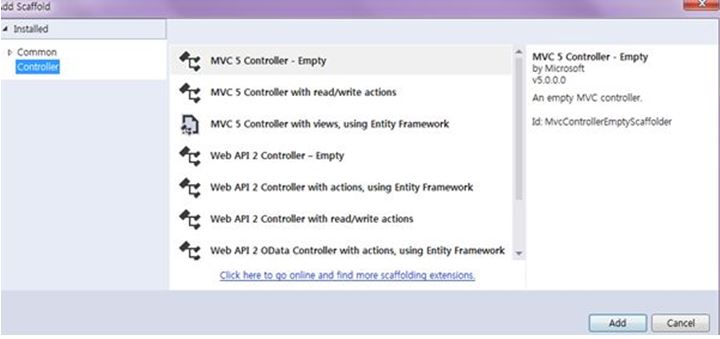

&nbsp;

&nbsp;Change the
 Controller name and here I have given it the name &ldquo;<strong style="outline:0px; color:#333333; text-transform:none; line-height:21px; text-indent:0px; letter-spacing:normal; font-family:Roboto,sans-serif; font-size:14px; font-style:normal; font-variant:normal; word-spacing:0px; white-space:normal; widows:1; background-color:#ffffff">shanuShoppingController</strong>&rdquo;
 and click OK. 
<strong style="outline:0px; color:#333333; text-transform:none; line-height:21px; text-indent:0px; letter-spacing:normal; font-family:Roboto,sans-serif; font-size:14px; font-style:normal; font-variant:normal; word-spacing:0px; white-space:normal; widows:1; background-color:#ffffff">Add
 View:&nbsp;</strong>Right-click
 on the Controller Index and click Add View. 

<strong style="outline:0px">MVC Controller CS File:</strong>&nbsp;Here we can, in the MVC Controller, create 2 ActionResults, one is Index and the other is ItemMaster. In Index I have created a View as Index and this page is used to display our
 Shopping Cart Details with items. In ItemMaster I have created a View as ItemMaster and this page is used to display Item Details. Add new Item and Upload image for an Item. Next we have the HttpPost UploadFile() method to upload an image file.

&nbsp;

C#

Edit|Remove

csharp

<pre class="csharp">public&nbsp;class&nbsp;shanuShoppingController&nbsp;:&nbsp;Controller&nbsp;
&nbsp;&nbsp;&nbsp;&nbsp;{&nbsp;
&nbsp;&nbsp;&nbsp;&nbsp;&nbsp;&nbsp;&nbsp;&nbsp;//&nbsp;GET:&nbsp;shanuShopping&nbsp;
&nbsp;&nbsp;&nbsp;&nbsp;&nbsp;&nbsp;&nbsp;&nbsp;public&nbsp;ActionResult&nbsp;Index()&nbsp;
&nbsp;&nbsp;&nbsp;&nbsp;&nbsp;&nbsp;&nbsp;&nbsp;{&nbsp;
&nbsp;&nbsp;&nbsp;&nbsp;&nbsp;&nbsp;&nbsp;&nbsp;&nbsp;&nbsp;&nbsp;&nbsp;return&nbsp;View();&nbsp;
&nbsp;&nbsp;&nbsp;&nbsp;&nbsp;&nbsp;&nbsp;&nbsp;}&nbsp;
&nbsp;&nbsp;&nbsp;&nbsp;&nbsp;&nbsp;&nbsp;&nbsp;&nbsp;
&nbsp;&nbsp;&nbsp;&nbsp;&nbsp;&nbsp;&nbsp;&nbsp;public&nbsp;ActionResult&nbsp;ItemMaster()&nbsp;
&nbsp;&nbsp;&nbsp;&nbsp;&nbsp;&nbsp;&nbsp;&nbsp;{&nbsp;
&nbsp;&nbsp;&nbsp;&nbsp;&nbsp;&nbsp;&nbsp;&nbsp;&nbsp;&nbsp;&nbsp;&nbsp;return&nbsp;View();&nbsp;
&nbsp;&nbsp;&nbsp;&nbsp;&nbsp;&nbsp;&nbsp;&nbsp;}&nbsp;
&nbsp;
&nbsp;&nbsp;&nbsp;&nbsp;&nbsp;&nbsp;&nbsp;&nbsp;[HttpPost]&nbsp;
&nbsp;&nbsp;&nbsp;&nbsp;&nbsp;&nbsp;&nbsp;&nbsp;public&nbsp;JsonResult&nbsp;UploadFile()&nbsp;
&nbsp;&nbsp;&nbsp;&nbsp;&nbsp;&nbsp;&nbsp;&nbsp;{&nbsp;
&nbsp;&nbsp;&nbsp;&nbsp;&nbsp;&nbsp;&nbsp;&nbsp;&nbsp;&nbsp;&nbsp;&nbsp;string&nbsp;Message,&nbsp;fileName;&nbsp;
&nbsp;&nbsp;&nbsp;&nbsp;&nbsp;&nbsp;&nbsp;&nbsp;&nbsp;&nbsp;&nbsp;&nbsp;Message&nbsp;=&nbsp;fileName&nbsp;=&nbsp;string.Empty;&nbsp;
&nbsp;&nbsp;&nbsp;&nbsp;&nbsp;&nbsp;&nbsp;&nbsp;&nbsp;&nbsp;&nbsp;&nbsp;bool&nbsp;flag&nbsp;=&nbsp;false;&nbsp;
&nbsp;&nbsp;&nbsp;&nbsp;&nbsp;&nbsp;&nbsp;&nbsp;&nbsp;&nbsp;&nbsp;&nbsp;if&nbsp;(Request.Files&nbsp;!=&nbsp;null)&nbsp;
&nbsp;&nbsp;&nbsp;&nbsp;&nbsp;&nbsp;&nbsp;&nbsp;&nbsp;&nbsp;&nbsp;&nbsp;{&nbsp;
&nbsp;&nbsp;&nbsp;&nbsp;&nbsp;&nbsp;&nbsp;&nbsp;&nbsp;&nbsp;&nbsp;&nbsp;&nbsp;&nbsp;&nbsp;&nbsp;var&nbsp;file&nbsp;=&nbsp;Request.Files[0];&nbsp;
&nbsp;&nbsp;&nbsp;&nbsp;&nbsp;&nbsp;&nbsp;&nbsp;&nbsp;&nbsp;&nbsp;&nbsp;&nbsp;&nbsp;&nbsp;&nbsp;fileName&nbsp;=&nbsp;file.FileName;&nbsp;
&nbsp;&nbsp;&nbsp;&nbsp;&nbsp;&nbsp;&nbsp;&nbsp;&nbsp;&nbsp;&nbsp;&nbsp;&nbsp;&nbsp;&nbsp;&nbsp;try&nbsp;
&nbsp;&nbsp;&nbsp;&nbsp;&nbsp;&nbsp;&nbsp;&nbsp;&nbsp;&nbsp;&nbsp;&nbsp;&nbsp;&nbsp;&nbsp;&nbsp;{&nbsp;
&nbsp;&nbsp;&nbsp;&nbsp;&nbsp;&nbsp;&nbsp;&nbsp;&nbsp;&nbsp;&nbsp;&nbsp;&nbsp;&nbsp;&nbsp;&nbsp;&nbsp;&nbsp;&nbsp;&nbsp;file.SaveAs(Path.Combine(Server.MapPath(&quot;~/Images&quot;),&nbsp;fileName));&nbsp;
&nbsp;&nbsp;&nbsp;&nbsp;&nbsp;&nbsp;&nbsp;&nbsp;&nbsp;&nbsp;&nbsp;&nbsp;&nbsp;&nbsp;&nbsp;&nbsp;&nbsp;&nbsp;&nbsp;&nbsp;Message&nbsp;=&nbsp;&quot;File&nbsp;uploaded&quot;;&nbsp;
&nbsp;&nbsp;&nbsp;&nbsp;&nbsp;&nbsp;&nbsp;&nbsp;&nbsp;&nbsp;&nbsp;&nbsp;&nbsp;&nbsp;&nbsp;&nbsp;&nbsp;&nbsp;&nbsp;&nbsp;flag&nbsp;=&nbsp;true;&nbsp;
&nbsp;&nbsp;&nbsp;&nbsp;&nbsp;&nbsp;&nbsp;&nbsp;&nbsp;&nbsp;&nbsp;&nbsp;&nbsp;&nbsp;&nbsp;&nbsp;}&nbsp;
&nbsp;&nbsp;&nbsp;&nbsp;&nbsp;&nbsp;&nbsp;&nbsp;&nbsp;&nbsp;&nbsp;&nbsp;&nbsp;&nbsp;&nbsp;&nbsp;catch&nbsp;(Exception)&nbsp;
&nbsp;&nbsp;&nbsp;&nbsp;&nbsp;&nbsp;&nbsp;&nbsp;&nbsp;&nbsp;&nbsp;&nbsp;&nbsp;&nbsp;&nbsp;&nbsp;{&nbsp;
&nbsp;&nbsp;&nbsp;&nbsp;&nbsp;&nbsp;&nbsp;&nbsp;&nbsp;&nbsp;&nbsp;&nbsp;&nbsp;&nbsp;&nbsp;&nbsp;&nbsp;&nbsp;&nbsp;&nbsp;Message&nbsp;=&nbsp;&quot;File&nbsp;upload&nbsp;failed!&nbsp;Please&nbsp;try&nbsp;again&quot;;&nbsp;
&nbsp;&nbsp;&nbsp;&nbsp;&nbsp;&nbsp;&nbsp;&nbsp;&nbsp;&nbsp;&nbsp;&nbsp;&nbsp;&nbsp;&nbsp;&nbsp;}&nbsp;
&nbsp;
&nbsp;&nbsp;&nbsp;&nbsp;&nbsp;&nbsp;&nbsp;&nbsp;&nbsp;&nbsp;&nbsp;&nbsp;}&nbsp;
&nbsp;&nbsp;&nbsp;&nbsp;&nbsp;&nbsp;&nbsp;&nbsp;&nbsp;&nbsp;&nbsp;&nbsp;return&nbsp;new&nbsp;JsonResult&nbsp;{&nbsp;Data&nbsp;=&nbsp;new&nbsp;{&nbsp;Message&nbsp;=&nbsp;Message,&nbsp;Status&nbsp;=&nbsp;flag&nbsp;}&nbsp;};&nbsp;
&nbsp;&nbsp;&nbsp;&nbsp;&nbsp;&nbsp;&nbsp;&nbsp;}&nbsp;
&nbsp;&nbsp;&nbsp;&nbsp;}&nbsp;
</pre>

&nbsp;<strong style="outline:0px; color:#333333; text-transform:none; line-height:21px; text-indent:0px; letter-spacing:normal; font-family:Roboto,sans-serif; font-size:14px; font-style:normal; font-variant:normal; word-spacing:0px; white-space:normal; widows:1; background-color:#ffffff">Run
 your program</strong> 
Here we can see that when
 I run the program, first I display the Order Master records in the table. You can see in the menu I have &ldquo;Shanu Shopping Cart&rdquo; and &ldquo;Item master&rdquo; menu items. First we see for the Shanu Shopping Cart menu. When the user clicks on this
 menu then it will display the Index.html (View) .<strong style="outline:0px; color:#333333; text-transform:none; line-height:21px; text-indent:0px; letter-spacing:normal; font-family:Roboto,sans-serif; font-size:14px; font-style:normal; font-variant:normal; word-spacing:0px; white-space:normal; widows:1; background-color:#ffffff"> 
Shanu Shopping Cart Menu:</strong>&nbsp;By
 default I will display all the item details. The user can filter by Item Code, Item Name and Description and by User Name to search their Item from the list. The user can also sort items by clicking on the Column Header. 
<strong style="outline:0px; color:#333333; text-transform:none; line-height:21px; text-indent:0px; letter-spacing:normal; font-family:Roboto,sans-serif; font-size:14px; font-style:normal; font-variant:normal; word-spacing:0px; white-space:normal; widows:1; background-color:#ffffff">Click
 for my Shopping Cart Items:</strong>&nbsp;This
 method displays the user's Shopping cart details. If there is no item for the user it will display the alert message. 
<strong style="outline:0px; color:#333333; text-transform:none; line-height:21px; text-indent:0px; letter-spacing:normal; font-family:Roboto,sans-serif; font-size:14px; font-style:normal; font-variant:normal; word-spacing:0px; white-space:normal; widows:1; background-color:#ffffff">Add
 items to Cart&nbsp;</strong>To
 add items to the cart, click on the Item image.

&nbsp;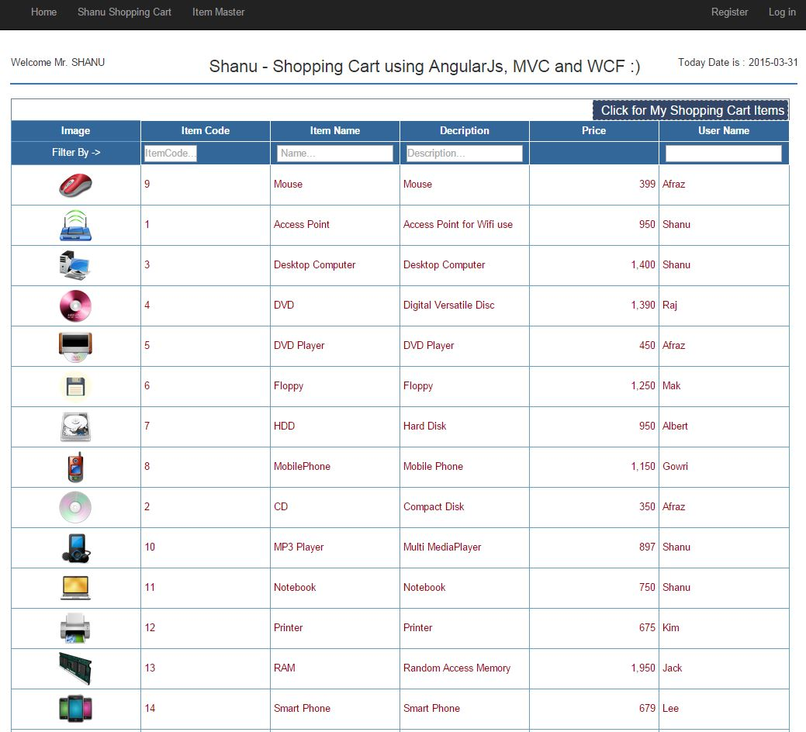

&nbsp;

&nbsp;<strong style="outline:0px; color:#333333; text-transform:none; line-height:21px; text-indent:0px; letter-spacing:normal; font-family:Roboto,sans-serif; font-size:14px; font-style:normal; font-variant:normal; word-spacing:0px; white-space:normal; widows:1; background-color:#ffffff">Add
 item to Cart:&nbsp;</strong>When
 the user clicks on each image from the Item list, I display the item details to add the selected item to the cart as in the following image.

&nbsp;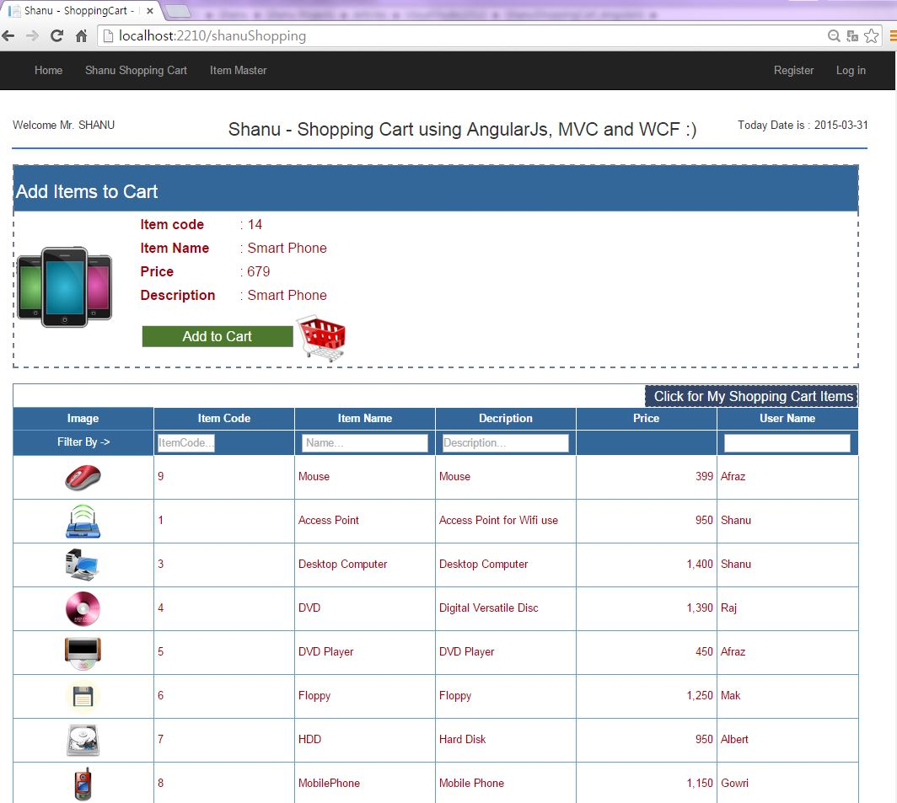

&nbsp;

<strong style="outline:0px; color:#333333; text-transform:none; line-height:21px; text-indent:0px; letter-spacing:normal; font-family:Roboto,sans-serif; font-size:14px; font-style:normal; font-variant:normal; word-spacing:0px; white-space:normal; widows:1; background-color:#ffffff">Cart
 Details:</strong>&nbsp;When
 the user clicks on Add to Cart. I will display the cart details as in the following. When the user adds an item the first time then I will display the Qty asTo increment the Qty user can click again to the same item. Here I will check whether the item already
 exists in the Shopping cart. If it exists in the cart then I will increment the Qty and if the item is not available then I will add the item to the shopping cart list.

&nbsp;

&nbsp;

Cart Complete details.

&nbsp;

&nbsp;

&nbsp;<strong style="outline:0px; color:#333333; text-transform:none; line-height:21px; text-indent:0px; letter-spacing:normal; font-family:Roboto,sans-serif; font-size:14px; font-style:normal; font-variant:normal; word-spacing:0px; white-space:normal; widows:1; background-color:#ffffff">Item
 Master Menu:</strong>&nbsp;By
 default I will display all the item details. The user can filter by Item Code, Item Name and Description and by User Name to search their Item from the list. The user can also sort items by clicking on the Column Header. 
The user can add a new
 item here with an image upload. 
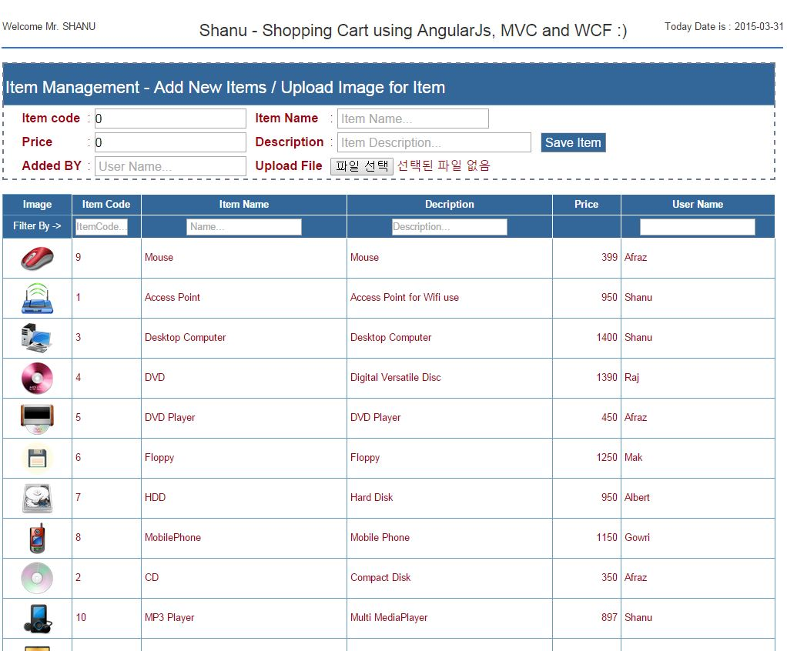

&nbsp;

&nbsp;Browse the
 image and upload to the root folder and save the item to the database.

&nbsp;

&nbsp;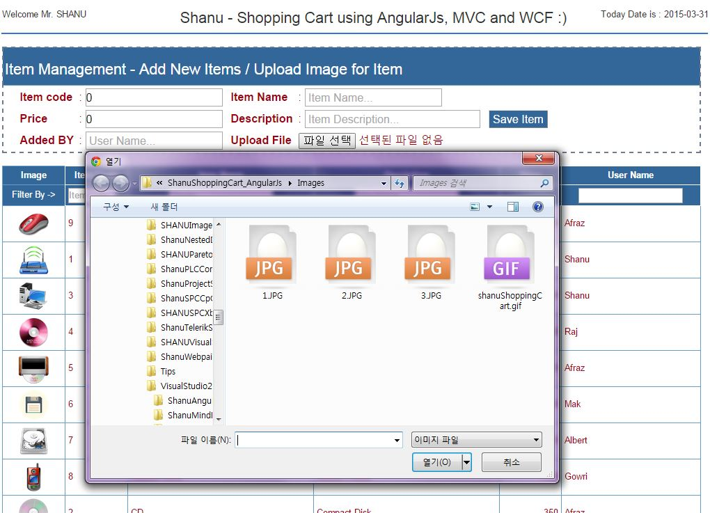&nbsp;

&nbsp;

&nbsp;

&nbsp;

<h1>Source Code Files</h1>
<ul>
<li>shanuShoppingCartSRC.zip<em><em></em></em> </li></ul>
<h1>More Information</h1>

<em>You can extend
 this application depending on your requirements and add more functionality, like user management, Shopping cart payment details and and so on. Supported Browsers: Chrome and Firefox.</em>

