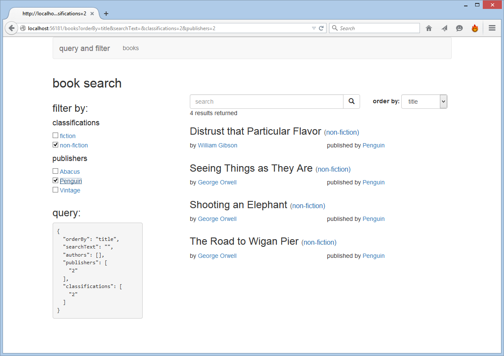
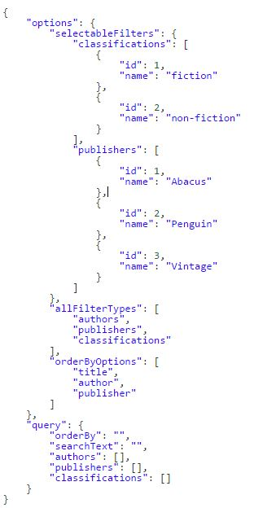
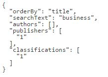

# AngularJS with Web API: query and filter data
## Requires
- Visual Studio 2013
## License
- MIT
## Technologies
- C#
- ASP.NET
- Javascript
- Entity Framework
- HTML5
- AngularJS
- ASP.NET Web API 2
## Topics
- ASP.NET
- Javascript
- HTML5
- AngularJS
- ASP.NET Web API 2
## Updated
- 06/17/2015
## Description

<h1>Introduction</h1>

This sample shows how to provide full query functionality (search, sort and filter) in an AngularJS and Web API application. The query state is maintained in the URL which allows for linking to and bookmarking specific searches. The query options are dynamic
 and provided by the web API.&nbsp;

&nbsp;

Please note that all code snippets in this description are partial and only contain the relevant lines of code. To view the full code, which is annotated, please download the sample.

The approach taken in this sample has been to make the code as clear as possible to highlight the overall concept. In a real world scenario another design may preferable.

<h1>Building the Sample</h1>

The solution level NuGet packages removed to make it smaller for downloading.&nbsp;After extracting the sample&nbsp;run NuGet and it should prompt you to restore the missing packages.

<h1>Description</h1>

The sample is a Visual Studio Web API project with no authentication. A couple of configuration changes have been made to the default settings. In
<strong>BundleConfig</strong> the line <strong>BundleTable.EnableOptimizations = true;</strong> has been commented out. This will stop the SPA scripts (bundled as app) from being concatenated and minified, making it easier to step through the client code when
 it is running in browser. Also in <strong>WebApiConfig</strong> the JSON formatting has been set to camelcase.

The main elements of the solution are as follows.

<h2>The model</h2>

The sample has a simple Entity Framework model (see&nbsp;<strong>models\</strong><strong>SampleContext</strong>) consisting of 4 entities:<strong>&nbsp;</strong>Book, Author, Publisher and Classification.&nbsp;When running the project a new database will
 be&nbsp;initialized and seeded with demo data&nbsp;if an existing database is not found (see
<strong>models\SampleInitializer</strong>).

<h2>Web API</h2>

The <strong>BooksController</strong>&nbsp;provides two POST actions <strong>QueryOptions</strong> and
<strong>Search</strong>. The first accepts a list of properties to filter by (filters) and returns all the query options available as well as a blank query (see the JSON below).

&nbsp;

The second <strong>search</strong> action accepts a 'filled' json query in the same format as the one provided in the queryOptions response.

The query options are then used to build a query, execute it and return the results.

C#

Edit|Remove

csharp

<pre class="csharp">[HttpPost]&nbsp;&nbsp;
public&nbsp;async&nbsp;Task&lt;IHttpActionResult&gt;&nbsp;Search(QueryBindingModel&nbsp;queryOptions)&nbsp;
{&nbsp;
&nbsp;&nbsp;&nbsp;&nbsp;if&nbsp;(queryOptions&nbsp;==&nbsp;null)&nbsp;
&nbsp;&nbsp;&nbsp;&nbsp;{&nbsp;
&nbsp;&nbsp;&nbsp;&nbsp;&nbsp;&nbsp;&nbsp;&nbsp;return&nbsp;BadRequest(&quot;no&nbsp;query&nbsp;options&nbsp;provided&quot;);&nbsp;
&nbsp;&nbsp;&nbsp;&nbsp;}&nbsp;
&nbsp;
&nbsp;&nbsp;&nbsp;&nbsp;var&nbsp;query&nbsp;=&nbsp;context.Books&nbsp;
&nbsp;&nbsp;&nbsp;&nbsp;&nbsp;&nbsp;&nbsp;&nbsp;&nbsp;&nbsp;&nbsp;&nbsp;&nbsp;&nbsp;&nbsp;&nbsp;&nbsp;&nbsp;&nbsp;&nbsp;&nbsp;&nbsp;&nbsp;&nbsp;.Include(b&nbsp;=&gt;&nbsp;b.Author)&nbsp;
&nbsp;&nbsp;&nbsp;&nbsp;&nbsp;&nbsp;&nbsp;&nbsp;&nbsp;&nbsp;&nbsp;&nbsp;&nbsp;&nbsp;&nbsp;&nbsp;&nbsp;&nbsp;&nbsp;&nbsp;&nbsp;&nbsp;&nbsp;&nbsp;.Include(b&nbsp;=&gt;&nbsp;b.Publisher)&nbsp;
&nbsp;&nbsp;&nbsp;&nbsp;&nbsp;&nbsp;&nbsp;&nbsp;&nbsp;&nbsp;&nbsp;&nbsp;&nbsp;&nbsp;&nbsp;&nbsp;&nbsp;&nbsp;&nbsp;&nbsp;&nbsp;&nbsp;&nbsp;&nbsp;.Include(b&nbsp;=&gt;&nbsp;b.Classification);&nbsp;
&nbsp;
&nbsp;
&nbsp;&nbsp;&nbsp;&nbsp;if&nbsp;(!string.IsNullOrEmpty(queryOptions.SearchText))&nbsp;
&nbsp;&nbsp;&nbsp;&nbsp;{&nbsp;
&nbsp;&nbsp;&nbsp;&nbsp;&nbsp;&nbsp;&nbsp;&nbsp;query&nbsp;=&nbsp;query.Where(b&nbsp;=&gt;&nbsp;b.Title.Contains(queryOptions.SearchText)&nbsp;||&nbsp;b.Author.Name.Contains(queryOptions.SearchText));&nbsp;
&nbsp;&nbsp;&nbsp;&nbsp;}&nbsp;
&nbsp;&nbsp;&nbsp;&nbsp;&nbsp;&nbsp;&nbsp;&nbsp;&nbsp;&nbsp;&nbsp;&nbsp;&nbsp;&nbsp;&nbsp;&nbsp;&nbsp;&nbsp;&nbsp;&nbsp;&nbsp;&nbsp;&nbsp;&nbsp;&nbsp;
&nbsp;&nbsp;&nbsp;&nbsp;if&nbsp;(queryOptions.Classifications&nbsp;!=&nbsp;null&nbsp;&amp;&amp;&nbsp;queryOptions.Classifications.Count()&nbsp;&gt;&nbsp;0)&nbsp;
&nbsp;&nbsp;&nbsp;&nbsp;{&nbsp;
&nbsp;&nbsp;&nbsp;&nbsp;&nbsp;&nbsp;&nbsp;&nbsp;query&nbsp;=&nbsp;query.Where(b&nbsp;=&gt;&nbsp;queryOptions.Classifications.Contains(b.Classification.Id));&nbsp;
&nbsp;&nbsp;&nbsp;&nbsp;}&nbsp;
&nbsp;
&nbsp;&nbsp;&nbsp;&nbsp;if&nbsp;(queryOptions.Publishers&nbsp;!=&nbsp;null&nbsp;&amp;&amp;&nbsp;queryOptions.Publishers.Count()&nbsp;&gt;&nbsp;0)&nbsp;
&nbsp;&nbsp;&nbsp;&nbsp;{&nbsp;
&nbsp;&nbsp;&nbsp;&nbsp;&nbsp;&nbsp;&nbsp;&nbsp;query&nbsp;=&nbsp;query.Where(b&nbsp;=&gt;&nbsp;queryOptions.Publishers.Contains(b.Publisher.Id));&nbsp;
&nbsp;&nbsp;&nbsp;&nbsp;}&nbsp;
&nbsp;
&nbsp;&nbsp;&nbsp;&nbsp;if&nbsp;(queryOptions.Authors&nbsp;!=&nbsp;null&nbsp;&amp;&amp;&nbsp;queryOptions.Authors.Count()&nbsp;&gt;&nbsp;0)&nbsp;
&nbsp;&nbsp;&nbsp;&nbsp;{&nbsp;
&nbsp;&nbsp;&nbsp;&nbsp;&nbsp;&nbsp;&nbsp;&nbsp;query&nbsp;=&nbsp;query.Where(b&nbsp;=&gt;&nbsp;queryOptions.Authors.Contains(b.Author.Id));&nbsp;
&nbsp;&nbsp;&nbsp;&nbsp;}&nbsp;
&nbsp;
&nbsp;&nbsp;&nbsp;&nbsp;query&nbsp;=&nbsp;CreateOrderByExpression(query,&nbsp;queryOptions.OrderBy);&nbsp;
&nbsp;
&nbsp;&nbsp;&nbsp;&nbsp;var&nbsp;results&nbsp;=&nbsp;await&nbsp;query.ToListAsync();&nbsp;
&nbsp;&nbsp;&nbsp;&nbsp;&nbsp;&nbsp;&nbsp;
&nbsp;&nbsp;&nbsp;&nbsp;return&nbsp;Ok(new&nbsp;{&nbsp;&nbsp;
&nbsp;&nbsp;&nbsp;&nbsp;&nbsp;&nbsp;&nbsp;&nbsp;Books&nbsp;=&nbsp;results&nbsp;
&nbsp;&nbsp;&nbsp;&nbsp;});&nbsp;
}</pre>

&nbsp;

<h2>AngularJS</h2>

The client application is a simple, single module SPA under the&nbsp;<strong>app</strong>&nbsp;folder under the project root.

For the most part the code to be concerned with is under the books folder. One important exception is configuring the route to the books view in
<strong>app.js</strong>. When adding the route it is important to set&nbsp;<strong>reloadOnSearch</strong>&nbsp;to false in order to stop the
<strong>BooksController </strong>reloading every time the URL is updated.&nbsp;

Communication with the API is taken care of by a resource service, <strong>bookResource
</strong>which&nbsp;is wrapped by the <strong>bookService</strong>.&nbsp;This service&nbsp;also provides the
<strong>queryFromParams</strong>&nbsp;function which translates the route parameters from the url into the query format.

The <strong>BookController</strong> holds everything together. It consumes the
<strong>bookService</strong>&nbsp;and&nbsp;has the following responsibilities: loading the initial query data, synchronizing the route parameters, and updating search results. Where possible code has been refactored out into the directives:&nbsp;<strong>bookFilter</strong>,
<strong>bookSearch</strong>, <strong>bookSearchStatus</strong>, and <strong>bookSort</strong>.&nbsp;

<h1>Summary</h1>

If you have any questions or suggestions for improvement regarding this sample please feel free to leave them in the Q and A section.

