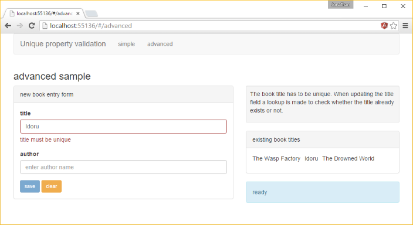
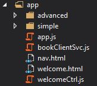
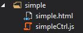
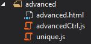

# AngularJS with Web API: server-side unique validation
## Requires
- Visual Studio 2015
## License
- Apache License, Version 2.0
## Technologies
- C#
- ASP.NET
- Javascript
- HTML5
- AngularJS
- ASP.NET Web API 2
## Topics
- ASP.NET
- Entity Framework
- Paging
- HTML5
- ASP.NET Web API
- AngularJS
- unique Validation
## Updated
- 11/17/2015
## Description

<h1>Introduction</h1>

This sample demonstrates how to implement unique constraint validation and error handling in an AngularJS single page application (SPA) served by a Web API controller. Two approaches are demonstrated:

<ul>
<li><strong>simple: (validation on save)</strong>&nbsp;when saving an entity any errors caused by a unique property value already existing are returned to the SPA. Those errors can then be handled, informing the user that the offending property value is not
 unique. </li><li><strong>advanced:&nbsp;(interactive field level validation)&nbsp;</strong>when entering a new value for a unique property the SPA checks, via an API call, whether the value is 'available'. If it is not an error is reported to the user and the user cannot
 save the new record until the error has been rectified. </li></ul>

The approaches are not exclusive, and in a real world application can be used together. In this simplified scenario the user only has the option to add a new record but the same appproach can be taken for updating existing entities.

Please note that all code snippets in this description are partial and only contain the relevant lines of code. To view the full code please download the sample.

<h1>Building the Sample</h1>

This sample has the solution level NuGet packages removed to make it smaller for downloading. If you do not have NuGet Package Restore enabled run NuGet and it should prompt you to restore the missing packages. The sample DbContext uses a connection string
 called <strong>bookConn</strong>&nbsp;(in <strong>web.config</strong>). This is set to use LocalDb and the database will be initialized the first time the context is queried.

<h1>Description</h1>
<h2>The model</h2>

The sample has a simple Entity Framwork model (see the <strong>SampleContext</strong>) with a single entity called
<strong>Book. </strong>Book&nbsp;has a unique property&nbsp;<strong>Title.</strong>

C#

Edit|Remove

csharp

<pre class="csharp">public&nbsp;class&nbsp;Book&nbsp;
{&nbsp;
&nbsp;&nbsp;&nbsp;&nbsp;public&nbsp;Book()&nbsp;
&nbsp;&nbsp;&nbsp;&nbsp;{&nbsp;&nbsp;&nbsp;&nbsp;&nbsp;&nbsp;&nbsp;&nbsp;
&nbsp;&nbsp;&nbsp;&nbsp;}&nbsp;
&nbsp;
&nbsp;&nbsp;&nbsp;&nbsp;[Key]&nbsp;
&nbsp;&nbsp;&nbsp;&nbsp;public&nbsp;virtual&nbsp;int&nbsp;Id&nbsp;{&nbsp;get;&nbsp;set;&nbsp;}&nbsp;
&nbsp;
&nbsp;&nbsp;&nbsp;&nbsp;[Index(IsUnique&nbsp;=&nbsp;true)]&nbsp;&nbsp;&nbsp;&nbsp;&nbsp;&nbsp;&nbsp;&nbsp;&nbsp;
&nbsp;&nbsp;&nbsp;&nbsp;[MaxLength(255)]&nbsp;
&nbsp;&nbsp;&nbsp;&nbsp;[MinLength(1)]&nbsp;
&nbsp;&nbsp;&nbsp;&nbsp;[Required]&nbsp;
&nbsp;&nbsp;&nbsp;&nbsp;public&nbsp;virtual&nbsp;string&nbsp;Title&nbsp;{&nbsp;get;&nbsp;set;&nbsp;}&nbsp;
&nbsp;
&nbsp;&nbsp;&nbsp;&nbsp;[MaxLength(255)]&nbsp;
&nbsp;&nbsp;&nbsp;&nbsp;[MinLength(1)]&nbsp;
&nbsp;&nbsp;&nbsp;&nbsp;[Required]&nbsp;
&nbsp;&nbsp;&nbsp;&nbsp;public&nbsp;string&nbsp;Author&nbsp;{&nbsp;get;&nbsp;set;&nbsp;}&nbsp;
}</pre>

&nbsp;

<h2>Web API</h2>

There are couple of configuration changes for the Web API:

<ul>
<li>in <strong>BundleConfig</strong> the line <strong>BundleTable.EnableOptimizations = true</strong>; has been commented out. This will stop the SPA scripts (bundled as app) from being bundled and minified, making it easier to step through the client code
 when it is running in the browser, </li><li>in <strong>WebApiConfig </strong>the JSON formatting has been set to camel case to make it easier to work with data returned from the Web API in Angular.
</li></ul>

The BookController is a standard Web API 2 Entity Framework controller with two changes to provide the functionality required.

1. When saving a new book the Post action will catch any DbUpdateExceptions and return a BadRequest response containing the base exception message.

C#

Edit|Remove

csharp

<pre class="csharp">//&nbsp;POST:&nbsp;api/Books&nbsp;
[ResponseType(typeof(Book))]&nbsp;
public&nbsp;async&nbsp;Task&lt;IHttpActionResult&gt;&nbsp;Post(Book&nbsp;book)&nbsp;
{&nbsp;
&nbsp;&nbsp;&nbsp;&nbsp;if&nbsp;(!ModelState.IsValid)&nbsp;
&nbsp;&nbsp;&nbsp;&nbsp;{&nbsp;
&nbsp;&nbsp;&nbsp;&nbsp;&nbsp;&nbsp;&nbsp;&nbsp;return&nbsp;BadRequest(ModelState);&nbsp;
&nbsp;&nbsp;&nbsp;&nbsp;}&nbsp;
&nbsp;
&nbsp;&nbsp;&nbsp;&nbsp;db.Books.Add(book);&nbsp;
&nbsp;
&nbsp;&nbsp;&nbsp;&nbsp;try&nbsp;
&nbsp;&nbsp;&nbsp;&nbsp;{&nbsp;
&nbsp;&nbsp;&nbsp;&nbsp;&nbsp;&nbsp;&nbsp;&nbsp;await&nbsp;db.SaveChangesAsync();&nbsp;&nbsp;&nbsp;&nbsp;&nbsp;&nbsp;&nbsp;&nbsp;&nbsp;&nbsp;&nbsp;&nbsp;&nbsp;&nbsp;&nbsp;&nbsp;&nbsp;
&nbsp;&nbsp;&nbsp;&nbsp;}&nbsp;
&nbsp;&nbsp;&nbsp;&nbsp;catch&nbsp;(DbUpdateException&nbsp;ex)&nbsp;
&nbsp;&nbsp;&nbsp;&nbsp;{&nbsp;
&nbsp;&nbsp;&nbsp;&nbsp;&nbsp;&nbsp;&nbsp;&nbsp;return&nbsp;BadRequest(ex.GetBaseException().Message);&nbsp;
&nbsp;&nbsp;&nbsp;&nbsp;}&nbsp;
&nbsp;
&nbsp;&nbsp;&nbsp;&nbsp;return&nbsp;CreatedAtRoute(&quot;DefaultApi&quot;,&nbsp;new&nbsp;{&nbsp;id&nbsp;=&nbsp;book.Id&nbsp;},&nbsp;book);&nbsp;
}</pre>

&nbsp;

2. A new action <strong>TitleAvailable</strong>&nbsp;has been added. This accepts a title value and returns an OK (200) response or Bad request (400) depending on whether any existing books have the same title (case insensitive). Note this action is a POST
 action with the title in the body rather then a GET with the title in the URL. This is to allow for special characters in the title.

C#

Edit|Remove

csharp

<pre class="csharp">[HttpPost]&nbsp;
[ResponseType(typeof(bool))]&nbsp;
[Route(&quot;api/books/titleavailable&quot;)]&nbsp;
public&nbsp;async&nbsp;Task&lt;IHttpActionResult&gt;&nbsp;TitleAvailable(TitleAvailableBindingModel&nbsp;query)&nbsp;
{&nbsp;
&nbsp;
&nbsp;&nbsp;&nbsp;&nbsp;<a class="libraryLink" href="https://msdn.microsoft.com/en-US/library/System.Threading.Thread.Sleep.aspx" target="_blank" title="Auto generated link to System.Threading.Thread.Sleep">System.Threading.Thread.Sleep</a>(2000);&nbsp;//slow&nbsp;down&nbsp;the&nbsp;response&nbsp;to&nbsp;see&nbsp;the&nbsp;async&nbsp;checking&nbsp;validation&nbsp;working&nbsp;
&nbsp;
&nbsp;&nbsp;&nbsp;&nbsp;var&nbsp;titleTaken&nbsp;=&nbsp;await&nbsp;db.Books.AnyAsync(b&nbsp;=&gt;&nbsp;query.Title.ToLower()&nbsp;==&nbsp;b.Title.ToLower());&nbsp;
&nbsp;
&nbsp;&nbsp;&nbsp;&nbsp;return&nbsp;Ok(new&nbsp;{&nbsp;titleAvailable&nbsp;=&nbsp;!titleTaken&nbsp;});&nbsp;&nbsp;&nbsp;&nbsp;&nbsp;&nbsp;&nbsp;&nbsp;&nbsp;&nbsp;&nbsp;&nbsp;&nbsp;
}</pre>

&nbsp;

<h3>SPA side (AngularJS)</h3>

The SPA is in the app folder under the project root. It is a basic, single module SPA with two views to show the different approaches to the unique property validation.

A resource service called <strong>bookClientSvc</strong> is used by both examples to communicate with the Book controller. A custom action called&nbsp;<strong>titleAvailable</strong> has been added which maps to the action of the same name on the controller.

JavaScript

Edit|Remove

js

<pre class="js">angular&nbsp;
&nbsp;&nbsp;&nbsp;&nbsp;.module('app')&nbsp;
&nbsp;&nbsp;&nbsp;&nbsp;.factory('bookClientSvc',&nbsp;function&nbsp;($resource)&nbsp;{&nbsp;
&nbsp;&nbsp;&nbsp;&nbsp;&nbsp;&nbsp;&nbsp;&nbsp;return&nbsp;$resource(&quot;api/books/:id&quot;,&nbsp;
&nbsp;&nbsp;&nbsp;&nbsp;&nbsp;&nbsp;&nbsp;&nbsp;&nbsp;&nbsp;&nbsp;&nbsp;{&nbsp;id:&nbsp;&quot;@id&quot;&nbsp;},&nbsp;
&nbsp;&nbsp;&nbsp;&nbsp;&nbsp;&nbsp;&nbsp;&nbsp;&nbsp;&nbsp;&nbsp;&nbsp;{&nbsp;
&nbsp;&nbsp;&nbsp;&nbsp;&nbsp;&nbsp;&nbsp;&nbsp;&nbsp;&nbsp;&nbsp;&nbsp;&nbsp;&nbsp;&nbsp;&nbsp;'titleAvailable':&nbsp;{&nbsp;method:&nbsp;'POST',&nbsp;url:&nbsp;'api/books/titleAvailable',&nbsp;params:&nbsp;{&nbsp;title:&nbsp;'@title'&nbsp;}&nbsp;}&nbsp;
&nbsp;&nbsp;&nbsp;&nbsp;&nbsp;&nbsp;&nbsp;&nbsp;&nbsp;&nbsp;&nbsp;&nbsp;});&nbsp;
&nbsp;&nbsp;&nbsp;&nbsp;});</pre>

&nbsp;

<h3>Simple approach</h3>

This example is made up of a view (<strong>simple.html</strong>) and a controller (<strong>simpleCtrl.js</strong>).

A user can enter a new book and as long as values have been provided for the title and author they can then click the save button. This will call the save function on the controller (see below). If the title of the new book is not unique the promise returned
 by the <strong>bookClientSvc save</strong> function will be rejected and any error returned.

JavaScript

Edit|Remove

js

<pre class="js">function&nbsp;save()&nbsp;{&nbsp;
&nbsp;&nbsp;&nbsp;&nbsp;if&nbsp;($scope.newBookForm.$valid)&nbsp;{&nbsp;
&nbsp;&nbsp;&nbsp;&nbsp;&nbsp;&nbsp;&nbsp;&nbsp;$scope.status.busy&nbsp;=&nbsp;true;&nbsp;
&nbsp;&nbsp;&nbsp;&nbsp;&nbsp;&nbsp;&nbsp;&nbsp;$scope.status.message&nbsp;=&nbsp;&quot;saving&nbsp;book&quot;;&nbsp;
&nbsp;
&nbsp;&nbsp;&nbsp;&nbsp;&nbsp;&nbsp;&nbsp;&nbsp;bookClientSvc.save($scope.book)&nbsp;
&nbsp;&nbsp;&nbsp;&nbsp;&nbsp;&nbsp;&nbsp;&nbsp;&nbsp;&nbsp;&nbsp;&nbsp;&nbsp;&nbsp;&nbsp;&nbsp;&nbsp;&nbsp;&nbsp;&nbsp;&nbsp;&nbsp;&nbsp;&nbsp;.$promise&nbsp;
&nbsp;&nbsp;&nbsp;&nbsp;&nbsp;&nbsp;&nbsp;&nbsp;&nbsp;&nbsp;&nbsp;&nbsp;&nbsp;&nbsp;&nbsp;&nbsp;&nbsp;&nbsp;&nbsp;&nbsp;&nbsp;&nbsp;&nbsp;&nbsp;.then(function&nbsp;(result)&nbsp;{&nbsp;
&nbsp;&nbsp;&nbsp;&nbsp;&nbsp;&nbsp;&nbsp;&nbsp;&nbsp;&nbsp;&nbsp;&nbsp;&nbsp;&nbsp;&nbsp;&nbsp;&nbsp;&nbsp;&nbsp;&nbsp;&nbsp;&nbsp;&nbsp;&nbsp;&nbsp;&nbsp;&nbsp;&nbsp;$scope.status.message&nbsp;=&nbsp;&quot;ready&quot;;&nbsp;
&nbsp;&nbsp;&nbsp;&nbsp;&nbsp;&nbsp;&nbsp;&nbsp;&nbsp;&nbsp;&nbsp;&nbsp;&nbsp;&nbsp;&nbsp;&nbsp;&nbsp;&nbsp;&nbsp;&nbsp;&nbsp;&nbsp;&nbsp;&nbsp;&nbsp;&nbsp;&nbsp;&nbsp;$scope.books.push($scope.book);&nbsp;
&nbsp;&nbsp;&nbsp;&nbsp;&nbsp;&nbsp;&nbsp;&nbsp;&nbsp;&nbsp;&nbsp;&nbsp;&nbsp;&nbsp;&nbsp;&nbsp;&nbsp;&nbsp;&nbsp;&nbsp;&nbsp;&nbsp;&nbsp;&nbsp;&nbsp;&nbsp;&nbsp;&nbsp;clear();&nbsp;
&nbsp;&nbsp;&nbsp;&nbsp;&nbsp;&nbsp;&nbsp;&nbsp;&nbsp;&nbsp;&nbsp;&nbsp;&nbsp;&nbsp;&nbsp;&nbsp;&nbsp;&nbsp;&nbsp;&nbsp;&nbsp;&nbsp;&nbsp;&nbsp;},&nbsp;
&nbsp;&nbsp;&nbsp;&nbsp;&nbsp;&nbsp;&nbsp;&nbsp;&nbsp;&nbsp;&nbsp;&nbsp;&nbsp;&nbsp;&nbsp;&nbsp;&nbsp;&nbsp;&nbsp;&nbsp;&nbsp;&nbsp;&nbsp;&nbsp;function&nbsp;(result)&nbsp;{&nbsp;
&nbsp;&nbsp;&nbsp;&nbsp;&nbsp;&nbsp;&nbsp;&nbsp;&nbsp;&nbsp;&nbsp;&nbsp;&nbsp;&nbsp;&nbsp;&nbsp;&nbsp;&nbsp;&nbsp;&nbsp;&nbsp;&nbsp;&nbsp;&nbsp;&nbsp;&nbsp;&nbsp;&nbsp;if&nbsp;(result.data&nbsp;&amp;&amp;&nbsp;result.data.message.indexOf(&quot;Cannot&nbsp;insert&nbsp;duplicate&nbsp;key&nbsp;row&nbsp;in&nbsp;object&nbsp;'dbo.Books'&nbsp;with&nbsp;unique&nbsp;index&nbsp;'IX_Title'&quot;)&nbsp;&gt;&nbsp;-1)&nbsp;{&nbsp;
&nbsp;&nbsp;&nbsp;&nbsp;&nbsp;&nbsp;&nbsp;&nbsp;&nbsp;&nbsp;&nbsp;&nbsp;&nbsp;&nbsp;&nbsp;&nbsp;&nbsp;&nbsp;&nbsp;&nbsp;&nbsp;&nbsp;&nbsp;&nbsp;&nbsp;&nbsp;&nbsp;&nbsp;&nbsp;&nbsp;&nbsp;&nbsp;$scope.status.message&nbsp;=&nbsp;&quot;a&nbsp;book&nbsp;with&nbsp;that&nbsp;title&nbsp;already&nbsp;exists&quot;;&nbsp;
&nbsp;&nbsp;&nbsp;&nbsp;&nbsp;&nbsp;&nbsp;&nbsp;&nbsp;&nbsp;&nbsp;&nbsp;&nbsp;&nbsp;&nbsp;&nbsp;&nbsp;&nbsp;&nbsp;&nbsp;&nbsp;&nbsp;&nbsp;&nbsp;&nbsp;&nbsp;&nbsp;&nbsp;&nbsp;&nbsp;&nbsp;&nbsp;$scope.newBookForm.title.$setValidity(&quot;unique&quot;,&nbsp;false);&nbsp;
&nbsp;&nbsp;&nbsp;&nbsp;&nbsp;&nbsp;&nbsp;&nbsp;&nbsp;&nbsp;&nbsp;&nbsp;&nbsp;&nbsp;&nbsp;&nbsp;&nbsp;&nbsp;&nbsp;&nbsp;&nbsp;&nbsp;&nbsp;&nbsp;&nbsp;&nbsp;&nbsp;&nbsp;}&nbsp;else&nbsp;{&nbsp;
&nbsp;&nbsp;&nbsp;&nbsp;&nbsp;&nbsp;&nbsp;&nbsp;&nbsp;&nbsp;&nbsp;&nbsp;&nbsp;&nbsp;&nbsp;&nbsp;&nbsp;&nbsp;&nbsp;&nbsp;&nbsp;&nbsp;&nbsp;&nbsp;&nbsp;&nbsp;&nbsp;&nbsp;&nbsp;&nbsp;&nbsp;&nbsp;$scope.status.message&nbsp;=&nbsp;&quot;something&nbsp;went&nbsp;wrong&quot;;&nbsp;
&nbsp;&nbsp;&nbsp;&nbsp;&nbsp;&nbsp;&nbsp;&nbsp;&nbsp;&nbsp;&nbsp;&nbsp;&nbsp;&nbsp;&nbsp;&nbsp;&nbsp;&nbsp;&nbsp;&nbsp;&nbsp;&nbsp;&nbsp;&nbsp;&nbsp;&nbsp;&nbsp;&nbsp;}&nbsp;
&nbsp;&nbsp;&nbsp;&nbsp;&nbsp;&nbsp;&nbsp;&nbsp;&nbsp;&nbsp;&nbsp;&nbsp;&nbsp;&nbsp;&nbsp;&nbsp;&nbsp;&nbsp;&nbsp;&nbsp;&nbsp;&nbsp;&nbsp;&nbsp;})&nbsp;
&nbsp;&nbsp;&nbsp;&nbsp;&nbsp;&nbsp;&nbsp;&nbsp;&nbsp;&nbsp;&nbsp;&nbsp;&nbsp;&nbsp;&nbsp;&nbsp;&nbsp;&nbsp;&nbsp;&nbsp;&nbsp;&nbsp;&nbsp;&nbsp;['finally'](function&nbsp;()&nbsp;{&nbsp;
&nbsp;&nbsp;&nbsp;&nbsp;&nbsp;&nbsp;&nbsp;&nbsp;&nbsp;&nbsp;&nbsp;&nbsp;&nbsp;&nbsp;&nbsp;&nbsp;&nbsp;&nbsp;&nbsp;&nbsp;&nbsp;&nbsp;&nbsp;&nbsp;&nbsp;&nbsp;&nbsp;&nbsp;$scope.status.busy&nbsp;=&nbsp;false;&nbsp;
&nbsp;&nbsp;&nbsp;&nbsp;&nbsp;&nbsp;&nbsp;&nbsp;&nbsp;&nbsp;&nbsp;&nbsp;&nbsp;&nbsp;&nbsp;&nbsp;&nbsp;&nbsp;&nbsp;&nbsp;&nbsp;&nbsp;&nbsp;&nbsp;});&nbsp;
&nbsp;&nbsp;&nbsp;&nbsp;}&nbsp;
}</pre>

&nbsp;

If the error is a unique validation error a custom validity property is set on the title which will then be show to the user (see the
<strong>has-error</strong> and <strong>ng-show</strong> bindings below).

HTML

Edit|Remove

html

<pre class="html">&lt;form&nbsp;name=&quot;newBookForm&quot;&nbsp;role=&quot;form&quot;&nbsp;ng-disabled=&quot;status.busy&quot;&gt;&nbsp;
&nbsp;&nbsp;&nbsp;&nbsp;&lt;div&nbsp;class=&quot;form-group&quot;&nbsp;ng-class=&quot;{'has-error':&nbsp;newBookForm.title.$error.unique&nbsp;||&nbsp;newBookForm.title.$error.required&nbsp;&amp;&amp;&nbsp;newBookForm.title.$touched}&quot;&gt;&nbsp;
&nbsp;&nbsp;&nbsp;&nbsp;&nbsp;&nbsp;&nbsp;&nbsp;&lt;label&nbsp;for=&quot;title&quot;&gt;title&lt;/label&gt;&nbsp;
&nbsp;&nbsp;&nbsp;&nbsp;&nbsp;&nbsp;&nbsp;&nbsp;&lt;input&nbsp;name=&quot;title&quot;&nbsp;type=&quot;text&quot;&nbsp;class=&quot;form-control&quot;&nbsp;ng-model=&quot;book.title&quot;&nbsp;ng-change=&quot;resetTitle()&quot;&nbsp;placeholder=&quot;enter&nbsp;title&quot;&nbsp;min=&quot;1&quot;&nbsp;max=&quot;255&quot;&nbsp;ng-disabled=&quot;status.busy&quot;&nbsp;required&gt;&nbsp;
&nbsp;&nbsp;&nbsp;&nbsp;&nbsp;&nbsp;&nbsp;&nbsp;&lt;ng-messages&nbsp;for=&quot;newBookForm.title.$error&quot;&nbsp;ng-show=&quot;newBookForm.title.$touched&quot;&gt;&nbsp;
&nbsp;&nbsp;&nbsp;&nbsp;&nbsp;&nbsp;&nbsp;&nbsp;&nbsp;&nbsp;&nbsp;&nbsp;&lt;ng-message&nbsp;class=&quot;help-block&quot;&nbsp;when=&quot;required&quot;&gt;required&lt;/ng-message&gt;&nbsp;
&nbsp;&nbsp;&nbsp;&nbsp;&nbsp;&nbsp;&nbsp;&nbsp;&nbsp;&nbsp;&nbsp;&nbsp;&lt;ng-message&nbsp;class=&quot;help-block&quot;&nbsp;when=&quot;unique&quot;&gt;title&nbsp;must&nbsp;be&nbsp;unique&lt;/ng-message&gt;&nbsp;
&nbsp;&nbsp;&nbsp;&nbsp;&nbsp;&nbsp;&nbsp;&nbsp;&lt;/ng-messages&gt;&nbsp;
&nbsp;&nbsp;&nbsp;&nbsp;&lt;/div&gt;&nbsp;
&nbsp;&nbsp;&nbsp;&nbsp;...&nbsp;
&lt;/form&gt;</pre>

&nbsp;

Finally if any changes are made to the title after the validation error has been set it needs to be cleared again. This is done by the
<strong>resetTitle</strong> function (called by the <strong>ngChange</strong>&nbsp;directive on the title input).

&nbsp;

JavaScript

Edit|Remove

js

<pre class="js">function&nbsp;resetTitle()&nbsp;{&nbsp;
&nbsp;&nbsp;&nbsp;&nbsp;$scope.newBookForm.title.$setValidity(&quot;unique&quot;,&nbsp;true);&nbsp;
}</pre>

&nbsp;

<h3>Advanced approach</h3>

This example is made up of a view (<strong>advanced.html</strong>), a controller (<strong>simpleCtrl.js</strong>) and also a directive&nbsp;<strong>unique.js</strong>.

The view is similar to the previous example however the <strong>unique</strong>&nbsp;directive has been declared on the title input with a function from the controller,
<strong>checkTitle</strong>&nbsp;passed as a parameter to it.

HTML

Edit|Remove

html

<pre class="html">&lt;form&nbsp;name=&quot;newBookForm&quot;&nbsp;role=&quot;form&quot;&nbsp;ng-disabled=&quot;status.busy&quot;&nbsp;ng-submit=&quot;save()&quot;&gt;&nbsp;&nbsp;&nbsp;&nbsp;&nbsp;&nbsp;&nbsp;&nbsp;&nbsp;&nbsp;&nbsp;&nbsp;&nbsp;&nbsp;&nbsp;&nbsp;&nbsp;&nbsp;&nbsp;&nbsp;&nbsp;&nbsp;&nbsp;&nbsp;&nbsp;
&nbsp;&nbsp;&nbsp;&nbsp;&lt;div&nbsp;class=&quot;form-group&quot;&nbsp;ng-class=&quot;{'has-error':&nbsp;newBookForm.title.$error.unique&nbsp;||&nbsp;newBookForm.title.$error.required&nbsp;&amp;&amp;&nbsp;newBookForm.title.$touched}&quot;&gt;&nbsp;
&nbsp;&nbsp;&nbsp;&nbsp;&nbsp;&nbsp;&nbsp;&nbsp;&lt;label&nbsp;for=&quot;title&quot;&gt;title&lt;/label&gt;&nbsp;
&nbsp;&nbsp;&nbsp;&nbsp;&nbsp;&nbsp;&nbsp;&nbsp;&lt;input&nbsp;name=&quot;title&quot;&nbsp;type=&quot;text&quot;&nbsp;class=&quot;form-control&quot;&nbsp;ng-model=&quot;book.title&quot;&nbsp;ng-model-options=&quot;{debounce:&nbsp;500}&quot;&nbsp;placeholder=&quot;enter&nbsp;title&quot;&nbsp;min=&quot;1&quot;&nbsp;max=&quot;255&quot;&nbsp;unique=&quot;checkTitle(title)&quot;&nbsp;ng-disabled=&quot;status.busy&quot;&nbsp;required&gt;&nbsp;
&nbsp;&nbsp;&nbsp;&nbsp;&nbsp;&nbsp;&nbsp;&nbsp;&lt;span&nbsp;class=&quot;help-block&quot;&nbsp;ng-if=&quot;newBookForm.title.$error.checking&quot;&gt;&lt;/span&gt;&nbsp;
&nbsp;&nbsp;&nbsp;&nbsp;&nbsp;&nbsp;&nbsp;&nbsp;&lt;ng-messages&nbsp;for=&quot;newBookForm.title.$error&quot;&nbsp;ng-show=&quot;newBookForm.title.$dirty&quot;&gt;&nbsp;
&nbsp;&nbsp;&nbsp;&nbsp;&nbsp;&nbsp;&nbsp;&nbsp;&nbsp;&nbsp;&nbsp;&nbsp;&lt;ng-message&nbsp;class=&quot;help-block&quot;&nbsp;when=&quot;checking&quot;&gt;checking&nbsp;title...&lt;/ng-message&gt;&nbsp;
&nbsp;&nbsp;&nbsp;&nbsp;&nbsp;&nbsp;&nbsp;&nbsp;&nbsp;&nbsp;&nbsp;&nbsp;&lt;ng-message&nbsp;class=&quot;help-block&quot;&nbsp;when=&quot;unique&quot;&gt;title&nbsp;must&nbsp;be&nbsp;unique&lt;/ng-message&gt;&nbsp;
&nbsp;&nbsp;&nbsp;&nbsp;&nbsp;&nbsp;&nbsp;&nbsp;&lt;/ng-messages&gt;&nbsp;
&nbsp;&nbsp;&nbsp;&nbsp;&nbsp;&nbsp;&nbsp;&nbsp;&lt;ng-messages&nbsp;for=&quot;newBookForm.title.$error&quot;&nbsp;ng-show=&quot;newBookForm.title.$touched&quot;&gt;&nbsp;
&nbsp;&nbsp;&nbsp;&nbsp;&nbsp;&nbsp;&nbsp;&nbsp;&nbsp;&nbsp;&nbsp;&nbsp;&lt;ng-message&nbsp;class=&quot;help-block&quot;&nbsp;when=&quot;required&quot;&gt;required&lt;/ng-message&gt;&nbsp;
&nbsp;&nbsp;&nbsp;&nbsp;&nbsp;&nbsp;&nbsp;&nbsp;&lt;/ng-messages&gt;&nbsp;
&nbsp;&nbsp;&nbsp;&nbsp;&lt;/div&gt;&nbsp;
&nbsp;&nbsp;&nbsp;&nbsp;...&nbsp;
&lt;/form&gt;</pre>

&nbsp;

This function can be seen below. It returns a promise which will be rejected immediately if the title&nbsp;is null or empty. Otherwise it will call
<strong>bookclientSvc.titleAvailable </strong>passing in the current title value as a parameter and return the resulting promise.&nbsp;

JavaScript

Edit|Remove

js

<pre class="js">function&nbsp;checkTitle(title)&nbsp;{&nbsp;
&nbsp;&nbsp;&nbsp;&nbsp;if&nbsp;(title)&nbsp;{&nbsp;
&nbsp;&nbsp;&nbsp;&nbsp;&nbsp;&nbsp;&nbsp;&nbsp;return&nbsp;$q(function&nbsp;(resolve,&nbsp;reject)&nbsp;{&nbsp;
&nbsp;&nbsp;&nbsp;&nbsp;&nbsp;&nbsp;&nbsp;&nbsp;&nbsp;&nbsp;&nbsp;&nbsp;bookClientSvc.titleAvailable({&nbsp;title:&nbsp;title&nbsp;})&nbsp;
&nbsp;&nbsp;&nbsp;&nbsp;&nbsp;&nbsp;&nbsp;&nbsp;&nbsp;&nbsp;&nbsp;&nbsp;&nbsp;&nbsp;&nbsp;&nbsp;&nbsp;&nbsp;&nbsp;&nbsp;&nbsp;&nbsp;&nbsp;&nbsp;&nbsp;&nbsp;&nbsp;&nbsp;&nbsp;&nbsp;&nbsp;&nbsp;&nbsp;&nbsp;&nbsp;&nbsp;.$promise&nbsp;
&nbsp;&nbsp;&nbsp;&nbsp;&nbsp;&nbsp;&nbsp;&nbsp;&nbsp;&nbsp;&nbsp;&nbsp;&nbsp;&nbsp;&nbsp;&nbsp;&nbsp;&nbsp;&nbsp;&nbsp;&nbsp;&nbsp;&nbsp;&nbsp;&nbsp;&nbsp;&nbsp;&nbsp;&nbsp;&nbsp;&nbsp;&nbsp;&nbsp;&nbsp;&nbsp;&nbsp;.then(function&nbsp;(result)&nbsp;{&nbsp;
&nbsp;&nbsp;&nbsp;&nbsp;&nbsp;&nbsp;&nbsp;&nbsp;&nbsp;&nbsp;&nbsp;&nbsp;&nbsp;&nbsp;&nbsp;&nbsp;&nbsp;&nbsp;&nbsp;&nbsp;&nbsp;&nbsp;&nbsp;&nbsp;&nbsp;&nbsp;&nbsp;&nbsp;&nbsp;&nbsp;&nbsp;&nbsp;&nbsp;&nbsp;&nbsp;&nbsp;&nbsp;&nbsp;&nbsp;&nbsp;if&nbsp;(result.titleAvailable)&nbsp;{&nbsp;
&nbsp;&nbsp;&nbsp;&nbsp;&nbsp;&nbsp;&nbsp;&nbsp;&nbsp;&nbsp;&nbsp;&nbsp;&nbsp;&nbsp;&nbsp;&nbsp;&nbsp;&nbsp;&nbsp;&nbsp;&nbsp;&nbsp;&nbsp;&nbsp;&nbsp;&nbsp;&nbsp;&nbsp;&nbsp;&nbsp;&nbsp;&nbsp;&nbsp;&nbsp;&nbsp;&nbsp;&nbsp;&nbsp;&nbsp;&nbsp;&nbsp;&nbsp;&nbsp;&nbsp;resolve(result);&nbsp;
&nbsp;&nbsp;&nbsp;&nbsp;&nbsp;&nbsp;&nbsp;&nbsp;&nbsp;&nbsp;&nbsp;&nbsp;&nbsp;&nbsp;&nbsp;&nbsp;&nbsp;&nbsp;&nbsp;&nbsp;&nbsp;&nbsp;&nbsp;&nbsp;&nbsp;&nbsp;&nbsp;&nbsp;&nbsp;&nbsp;&nbsp;&nbsp;&nbsp;&nbsp;&nbsp;&nbsp;&nbsp;&nbsp;&nbsp;&nbsp;}&nbsp;else&nbsp;{&nbsp;
&nbsp;&nbsp;&nbsp;&nbsp;&nbsp;&nbsp;&nbsp;&nbsp;&nbsp;&nbsp;&nbsp;&nbsp;&nbsp;&nbsp;&nbsp;&nbsp;&nbsp;&nbsp;&nbsp;&nbsp;&nbsp;&nbsp;&nbsp;&nbsp;&nbsp;&nbsp;&nbsp;&nbsp;&nbsp;&nbsp;&nbsp;&nbsp;&nbsp;&nbsp;&nbsp;&nbsp;&nbsp;&nbsp;&nbsp;&nbsp;&nbsp;&nbsp;&nbsp;&nbsp;reject(result);&nbsp;
&nbsp;&nbsp;&nbsp;&nbsp;&nbsp;&nbsp;&nbsp;&nbsp;&nbsp;&nbsp;&nbsp;&nbsp;&nbsp;&nbsp;&nbsp;&nbsp;&nbsp;&nbsp;&nbsp;&nbsp;&nbsp;&nbsp;&nbsp;&nbsp;&nbsp;&nbsp;&nbsp;&nbsp;&nbsp;&nbsp;&nbsp;&nbsp;&nbsp;&nbsp;&nbsp;&nbsp;&nbsp;&nbsp;&nbsp;&nbsp;}&nbsp;
&nbsp;&nbsp;&nbsp;&nbsp;&nbsp;&nbsp;&nbsp;&nbsp;&nbsp;&nbsp;&nbsp;&nbsp;&nbsp;&nbsp;&nbsp;&nbsp;&nbsp;&nbsp;&nbsp;&nbsp;&nbsp;&nbsp;&nbsp;&nbsp;&nbsp;&nbsp;&nbsp;&nbsp;&nbsp;&nbsp;&nbsp;&nbsp;&nbsp;&nbsp;&nbsp;&nbsp;},&nbsp;
&nbsp;&nbsp;&nbsp;&nbsp;&nbsp;&nbsp;&nbsp;&nbsp;&nbsp;&nbsp;&nbsp;&nbsp;&nbsp;&nbsp;&nbsp;&nbsp;&nbsp;&nbsp;&nbsp;&nbsp;&nbsp;&nbsp;&nbsp;&nbsp;&nbsp;&nbsp;&nbsp;&nbsp;&nbsp;&nbsp;&nbsp;&nbsp;&nbsp;&nbsp;&nbsp;&nbsp;function&nbsp;(result)&nbsp;{&nbsp;
&nbsp;&nbsp;&nbsp;&nbsp;&nbsp;&nbsp;&nbsp;&nbsp;&nbsp;&nbsp;&nbsp;&nbsp;&nbsp;&nbsp;&nbsp;&nbsp;&nbsp;&nbsp;&nbsp;&nbsp;&nbsp;&nbsp;&nbsp;&nbsp;&nbsp;&nbsp;&nbsp;&nbsp;&nbsp;&nbsp;&nbsp;&nbsp;&nbsp;&nbsp;&nbsp;&nbsp;&nbsp;&nbsp;&nbsp;&nbsp;resolve(&quot;unexpected&nbsp;error&quot;);&nbsp;
&nbsp;&nbsp;&nbsp;&nbsp;&nbsp;&nbsp;&nbsp;&nbsp;&nbsp;&nbsp;&nbsp;&nbsp;&nbsp;&nbsp;&nbsp;&nbsp;&nbsp;&nbsp;&nbsp;&nbsp;&nbsp;&nbsp;&nbsp;&nbsp;&nbsp;&nbsp;&nbsp;&nbsp;&nbsp;&nbsp;&nbsp;&nbsp;&nbsp;&nbsp;&nbsp;&nbsp;});&nbsp;
&nbsp;&nbsp;&nbsp;&nbsp;&nbsp;&nbsp;&nbsp;&nbsp;});&nbsp;
&nbsp;&nbsp;&nbsp;&nbsp;}&nbsp;else&nbsp;{&nbsp;
&nbsp;&nbsp;&nbsp;&nbsp;&nbsp;&nbsp;&nbsp;&nbsp;return&nbsp;$q(function&nbsp;(resolve)&nbsp;{&nbsp;
&nbsp;&nbsp;&nbsp;&nbsp;&nbsp;&nbsp;&nbsp;&nbsp;&nbsp;&nbsp;&nbsp;&nbsp;resolve();&nbsp;
&nbsp;&nbsp;&nbsp;&nbsp;&nbsp;&nbsp;&nbsp;&nbsp;});&nbsp;
&nbsp;&nbsp;&nbsp;&nbsp;}&nbsp;
}</pre>

&nbsp;

The <strong>unique</strong>&nbsp;directive takes the <strong>checkTitle</strong> function name as an attribute&nbsp;<strong>unique-function-name
</strong>and adds it to the ngModel.$asyncValidators (note the directive requires ngModel). Now Angular will set the the custom validation property
<strong>unique</strong>&nbsp;to the result of the promise returned by the function whenver the title value is changed. It also sets a temporary 'checking' validation error whilst waiting for the result of the promise in order to allow a message to be displayed
 to the user informing them that the validation check has not yet completed. This also means that the form will be invalid until the aysnc validation has completed, making it easy to prevent the user trying to save too early.

JavaScript

Edit|Remove

js

<pre class="js">(function&nbsp;()&nbsp;{&nbsp;
&nbsp;&nbsp;&nbsp;&nbsp;'use&nbsp;strict';&nbsp;
&nbsp;
&nbsp;&nbsp;&nbsp;&nbsp;angular&nbsp;
&nbsp;&nbsp;&nbsp;&nbsp;&nbsp;&nbsp;&nbsp;&nbsp;.module('app')&nbsp;
&nbsp;&nbsp;&nbsp;&nbsp;&nbsp;&nbsp;&nbsp;&nbsp;.directive('unique',&nbsp;unique);&nbsp;
&nbsp;
&nbsp;&nbsp;&nbsp;&nbsp;unique.$inject&nbsp;=&nbsp;[];&nbsp;
&nbsp;
&nbsp;&nbsp;&nbsp;&nbsp;function&nbsp;unique()&nbsp;{&nbsp;
&nbsp;&nbsp;&nbsp;&nbsp;&nbsp;&nbsp;&nbsp;&nbsp;var&nbsp;directive&nbsp;=&nbsp;{&nbsp;
&nbsp;&nbsp;&nbsp;&nbsp;&nbsp;&nbsp;&nbsp;&nbsp;&nbsp;&nbsp;&nbsp;&nbsp;require:&nbsp;'ngModel',&nbsp;
&nbsp;&nbsp;&nbsp;&nbsp;&nbsp;&nbsp;&nbsp;&nbsp;&nbsp;&nbsp;&nbsp;&nbsp;link:&nbsp;link,&nbsp;
&nbsp;&nbsp;&nbsp;&nbsp;&nbsp;&nbsp;&nbsp;&nbsp;&nbsp;&nbsp;&nbsp;&nbsp;restrict:&nbsp;'A',&nbsp;
&nbsp;&nbsp;&nbsp;&nbsp;&nbsp;&nbsp;&nbsp;&nbsp;&nbsp;&nbsp;&nbsp;&nbsp;scope:&nbsp;{&nbsp;
&nbsp;&nbsp;&nbsp;&nbsp;&nbsp;&nbsp;&nbsp;&nbsp;&nbsp;&nbsp;&nbsp;&nbsp;&nbsp;&nbsp;&nbsp;&nbsp;unique:&nbsp;'&amp;'&nbsp;
&nbsp;&nbsp;&nbsp;&nbsp;&nbsp;&nbsp;&nbsp;&nbsp;&nbsp;&nbsp;&nbsp;&nbsp;}&nbsp;
&nbsp;&nbsp;&nbsp;&nbsp;&nbsp;&nbsp;&nbsp;&nbsp;};&nbsp;
&nbsp;
&nbsp;&nbsp;&nbsp;&nbsp;&nbsp;&nbsp;&nbsp;&nbsp;return&nbsp;directive;&nbsp;
&nbsp;
&nbsp;&nbsp;&nbsp;&nbsp;&nbsp;&nbsp;&nbsp;&nbsp;function&nbsp;link(scope,&nbsp;element,&nbsp;attrs,&nbsp;ngModel)&nbsp;{&nbsp;&nbsp;&nbsp;&nbsp;&nbsp;&nbsp;&nbsp;&nbsp;&nbsp;&nbsp;&nbsp;&nbsp;&nbsp;
&nbsp;&nbsp;&nbsp;&nbsp;&nbsp;&nbsp;&nbsp;&nbsp;&nbsp;&nbsp;&nbsp;&nbsp;&nbsp;&nbsp;var&nbsp;wrappedValidator&nbsp;=&nbsp;function&nbsp;(mv,&nbsp;vv)&nbsp;{&nbsp;
&nbsp;&nbsp;&nbsp;&nbsp;&nbsp;&nbsp;&nbsp;&nbsp;&nbsp;&nbsp;&nbsp;&nbsp;&nbsp;&nbsp;&nbsp;&nbsp;&nbsp;&nbsp;&nbsp;&nbsp;ngModel.$setValidity('checking',&nbsp;false);&nbsp;
&nbsp;
&nbsp;&nbsp;&nbsp;&nbsp;&nbsp;&nbsp;&nbsp;&nbsp;&nbsp;&nbsp;&nbsp;&nbsp;&nbsp;&nbsp;&nbsp;&nbsp;&nbsp;&nbsp;&nbsp;&nbsp;return&nbsp;scope.unique({&nbsp;title:&nbsp;mv&nbsp;||&nbsp;vv&nbsp;})&nbsp;
&nbsp;&nbsp;&nbsp;&nbsp;&nbsp;&nbsp;&nbsp;&nbsp;&nbsp;&nbsp;&nbsp;&nbsp;&nbsp;&nbsp;&nbsp;&nbsp;&nbsp;&nbsp;&nbsp;&nbsp;&nbsp;&nbsp;&nbsp;&nbsp;&nbsp;&nbsp;&nbsp;&nbsp;&nbsp;&nbsp;&nbsp;&nbsp;&nbsp;&nbsp;&nbsp;&nbsp;&nbsp;&nbsp;&nbsp;&nbsp;.finally(function&nbsp;()&nbsp;{&nbsp;
&nbsp;&nbsp;&nbsp;&nbsp;&nbsp;&nbsp;&nbsp;&nbsp;&nbsp;&nbsp;&nbsp;&nbsp;&nbsp;&nbsp;&nbsp;&nbsp;&nbsp;&nbsp;&nbsp;&nbsp;&nbsp;&nbsp;&nbsp;&nbsp;&nbsp;&nbsp;&nbsp;&nbsp;&nbsp;&nbsp;&nbsp;&nbsp;&nbsp;&nbsp;&nbsp;&nbsp;&nbsp;&nbsp;&nbsp;&nbsp;&nbsp;&nbsp;&nbsp;&nbsp;ngModel.$setValidity('checking',&nbsp;true);&nbsp;
&nbsp;&nbsp;&nbsp;&nbsp;&nbsp;&nbsp;&nbsp;&nbsp;&nbsp;&nbsp;&nbsp;&nbsp;&nbsp;&nbsp;&nbsp;&nbsp;&nbsp;&nbsp;&nbsp;&nbsp;&nbsp;&nbsp;&nbsp;&nbsp;&nbsp;&nbsp;&nbsp;&nbsp;&nbsp;&nbsp;&nbsp;&nbsp;&nbsp;&nbsp;&nbsp;&nbsp;&nbsp;&nbsp;&nbsp;&nbsp;});&nbsp;
&nbsp;&nbsp;&nbsp;&nbsp;&nbsp;&nbsp;&nbsp;&nbsp;&nbsp;&nbsp;&nbsp;&nbsp;&nbsp;&nbsp;&nbsp;&nbsp;};&nbsp;
&nbsp;
&nbsp;&nbsp;&nbsp;&nbsp;&nbsp;&nbsp;&nbsp;&nbsp;&nbsp;&nbsp;&nbsp;&nbsp;&nbsp;&nbsp;&nbsp;&nbsp;ngModel.$asyncValidators.unique&nbsp;=&nbsp;wrappedValidator;&nbsp;&nbsp;&nbsp;&nbsp;&nbsp;&nbsp;&nbsp;&nbsp;&nbsp;&nbsp;&nbsp;&nbsp;&nbsp;
&nbsp;&nbsp;&nbsp;&nbsp;&nbsp;&nbsp;&nbsp;&nbsp;}&nbsp;
&nbsp;&nbsp;&nbsp;&nbsp;}&nbsp;
})();</pre>

&nbsp;

<h3>Advanced approach pre AngularJS 1.3</h3>

I started writing this sample on version 1.2.6 of Angular and during the version 1.3 was released. Moving to this version allowed me to use the new $asyncValidators functionality. If you are using a previous version I have left in the old directive&nbsp;<strong>uniqueV12.js</strong>&nbsp;for
 you to use as a reference.

&nbsp;

JavaScript

Edit|Remove

js

<pre class="js">angular&nbsp;
&nbsp;&nbsp;&nbsp;&nbsp;.module('app')&nbsp;
&nbsp;&nbsp;&nbsp;&nbsp;.directive('uniqueV12',&nbsp;uniqueV12);&nbsp;
&nbsp;
uniqueV12.$inject&nbsp;=&nbsp;['$parse'];&nbsp;
&nbsp;
function&nbsp;uniqueV12($parse)&nbsp;{&nbsp;
&nbsp;
&nbsp;&nbsp;&nbsp;&nbsp;var&nbsp;directive&nbsp;=&nbsp;{&nbsp;
&nbsp;&nbsp;&nbsp;&nbsp;&nbsp;&nbsp;&nbsp;&nbsp;restrict:&nbsp;'A',&nbsp;
&nbsp;&nbsp;&nbsp;&nbsp;&nbsp;&nbsp;&nbsp;&nbsp;require:&nbsp;'ngModel',&nbsp;
&nbsp;&nbsp;&nbsp;&nbsp;&nbsp;&nbsp;&nbsp;&nbsp;link:&nbsp;link&nbsp;
&nbsp;&nbsp;&nbsp;&nbsp;};&nbsp;
&nbsp;
&nbsp;&nbsp;&nbsp;&nbsp;return&nbsp;directive;&nbsp;
&nbsp;
&nbsp;&nbsp;&nbsp;&nbsp;function&nbsp;link(scope,&nbsp;element,&nbsp;attrs,&nbsp;ctrl)&nbsp;{&nbsp;
&nbsp;&nbsp;&nbsp;&nbsp;&nbsp;&nbsp;&nbsp;&nbsp;var&nbsp;fn&nbsp;=&nbsp;$parse(attrs[&quot;uniqueV12&quot;]),&nbsp;
&nbsp;&nbsp;&nbsp;&nbsp;&nbsp;&nbsp;&nbsp;&nbsp;&nbsp;&nbsp;&nbsp;&nbsp;checkUnique&nbsp;=&nbsp;function&nbsp;()&nbsp;{&nbsp;
&nbsp;&nbsp;&nbsp;&nbsp;&nbsp;&nbsp;&nbsp;&nbsp;&nbsp;&nbsp;&nbsp;&nbsp;&nbsp;&nbsp;&nbsp;&nbsp;return&nbsp;fn(scope,&nbsp;{&nbsp;modelValue:&nbsp;ctrl.$modelValue,&nbsp;viewValue:&nbsp;ctrl.$viewValue&nbsp;});&nbsp;
&nbsp;&nbsp;&nbsp;&nbsp;&nbsp;&nbsp;&nbsp;&nbsp;&nbsp;&nbsp;&nbsp;&nbsp;};&nbsp;
&nbsp;
&nbsp;&nbsp;&nbsp;&nbsp;&nbsp;&nbsp;&nbsp;&nbsp;ctrl.$viewChangeListeners.push(function&nbsp;()&nbsp;{&nbsp;
&nbsp;&nbsp;&nbsp;&nbsp;&nbsp;&nbsp;&nbsp;&nbsp;&nbsp;&nbsp;&nbsp;&nbsp;checkUnique().then(&nbsp;
&nbsp;&nbsp;&nbsp;&nbsp;&nbsp;&nbsp;&nbsp;&nbsp;&nbsp;&nbsp;&nbsp;&nbsp;&nbsp;&nbsp;&nbsp;&nbsp;function&nbsp;()&nbsp;{&nbsp;
&nbsp;&nbsp;&nbsp;&nbsp;&nbsp;&nbsp;&nbsp;&nbsp;&nbsp;&nbsp;&nbsp;&nbsp;&nbsp;&nbsp;&nbsp;&nbsp;&nbsp;&nbsp;&nbsp;&nbsp;ctrl.$setValidity('unique',&nbsp;true);&nbsp;
&nbsp;&nbsp;&nbsp;&nbsp;&nbsp;&nbsp;&nbsp;&nbsp;&nbsp;&nbsp;&nbsp;&nbsp;&nbsp;&nbsp;&nbsp;&nbsp;},&nbsp;
&nbsp;&nbsp;&nbsp;&nbsp;&nbsp;&nbsp;&nbsp;&nbsp;&nbsp;&nbsp;&nbsp;&nbsp;&nbsp;&nbsp;&nbsp;&nbsp;function&nbsp;()&nbsp;{&nbsp;
&nbsp;&nbsp;&nbsp;&nbsp;&nbsp;&nbsp;&nbsp;&nbsp;&nbsp;&nbsp;&nbsp;&nbsp;&nbsp;&nbsp;&nbsp;&nbsp;&nbsp;&nbsp;&nbsp;&nbsp;ctrl.$setValidity('unique',&nbsp;false);&nbsp;
&nbsp;&nbsp;&nbsp;&nbsp;&nbsp;&nbsp;&nbsp;&nbsp;&nbsp;&nbsp;&nbsp;&nbsp;&nbsp;&nbsp;&nbsp;&nbsp;});&nbsp;
&nbsp;&nbsp;&nbsp;&nbsp;&nbsp;&nbsp;&nbsp;&nbsp;});&nbsp;
&nbsp;&nbsp;&nbsp;&nbsp;}&nbsp;
}</pre>

&nbsp;

It handles calling the unique validation function directly rather than adding it to the $asyncValidators, and then sets the unique validity depending on the result. To switch to it just change the directive on the title input from
<strong>unique</strong> to <strong>unique-v12</strong>.

HTML

Edit|Remove

html

<pre class="html">&lt;form&nbsp;name=&quot;newBookForm&quot;&nbsp;role=&quot;form&quot;&nbsp;ng-disabled=&quot;status.busy&quot;&gt;&nbsp;
&nbsp;&nbsp;&nbsp;&nbsp;&lt;div&nbsp;class=&quot;form-group&quot;&nbsp;ng-class=&quot;{'has-error':&nbsp;newBookForm.title.$error.unique}&quot;&gt;&nbsp;
&nbsp;&nbsp;&nbsp;&nbsp;&nbsp;&nbsp;&nbsp;&nbsp;&lt;label&nbsp;for=&quot;title&quot;&gt;title&lt;/label&gt;&nbsp;
&nbsp;&nbsp;&nbsp;&nbsp;&nbsp;&nbsp;&nbsp;&nbsp;&lt;input&nbsp;name=&quot;title&quot;&nbsp;type=&quot;text&quot;&nbsp;class=&quot;form-control&quot;&nbsp;ng-model=&quot;book.title&quot;&nbsp;placeholder=&quot;enter&nbsp;title&quot;&nbsp;min=&quot;1&quot;&nbsp;max=&quot;255&quot;&nbsp;unique-v12=&quot;checkTitle(modelValue,&nbsp;viewValue)&quot;&nbsp;ng-disabled=&quot;status.busy&quot;&nbsp;required&gt;&nbsp;&nbsp;&nbsp;&nbsp;&nbsp;&nbsp;&nbsp;&nbsp;&nbsp;
&nbsp;&nbsp;&nbsp;&nbsp;&nbsp;&nbsp;&nbsp;&nbsp;&lt;span&nbsp;class=&quot;help-block&quot;&nbsp;ng-show=&quot;newBookForm.title.$error.unique&quot;&gt;title&nbsp;must&nbsp;be&nbsp;unique&lt;/span&gt;&nbsp;
&nbsp;&nbsp;&nbsp;&nbsp;&lt;/div&gt;&nbsp;
&nbsp;&nbsp;&nbsp;...&nbsp;
&lt;/form&gt;</pre>

&nbsp;

<h2>Summary</h2>

If you have any questions or suggestions for improvement regarding this sample please feel free to leave them in the Q and A section.

