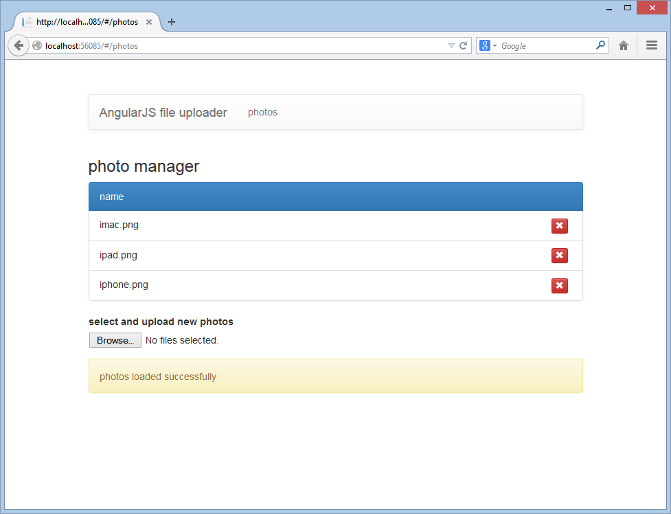
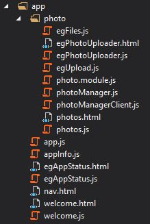

# AngularJS with Web API: uploading files
## Requires
- Visual Studio 2013
## License
- Apache License, Version 2.0
## Technologies
- C#
- ASP.NET
- Javascript
- HTML5
- AngularJS
- ASP.NET Web API 2
## Topics
- ASP.NET
- Javascript
- HTML5
- ASP.NET Web API
- AngularJS
- file upload
## Updated
- 04/06/2015
## Description

<h2>Introduction</h2>

This sample demonstrates how to create a file manager with AngularJS and Web API. It consists of an AngularJS single page application which allows a user to browse and delete images files from the server (IIS or IIS Express) and upload new files as well.
 It also shows how to create a Web API controller to support the required server side operations.

If you are gong to be deploying to Azure then please also have look at the companion sample
<a href="https://code.msdn.microsoft.com/AngularJS-with-Web-API-c05b3511" target="_blank">
here</a> which covers uploading to an Azure Container.

Please note that all code snippets in this description are partial and only contain the relevant lines of code. To view the full code please download the sample. Also the approach taken in this sample has been to make the code as clear as possible to highlight
 the overall concept. In a real world scenario another design may preferable.

<h2>Building the Sample</h2>

This sample has the solution level NuGet packages removed to make it smaller for downloading. If you do not have NuGet Package Restore enabled run NuGet and it should prompt you to restore the missing packages.

<h2>Description</h2>

The sample is a Visual Studio Web API project with no Authentication. A couple of configuration changes have been made to the default settings. In
<strong>BundleConfig</strong> the line <strong>BundleTable.EnableOptimizations = true;</strong> has been commented out. This will stop the SPA scripts (bundled as app) from being bundled and minified, making it easier to step through the client code when it
 is running in browser. Also in <strong>WebApiConfig</strong> the JSON formatting has been set to camelcase.

The main elements of the solution are as follows.

<h3>Web Api</h3>

The <strong>PhotoController</strong>&nbsp;defines the actions to get information about uploaded photos (not the actual files themselves), add new ones and delete existing files.&nbsp;It's worth noting at this point that an existing file will be overwritten
 if a new file with the same file name is uploaded.

The controller uses&nbsp;<strong>Local</strong><strong>PhotoManager
</strong>to provide all required file IO functionality. Of particular interest is the Add method.

C#

Edit|Remove

csharp

<pre class="csharp">public&nbsp;async&nbsp;Task&lt;IEnumerable&lt;PhotoViewModel&gt;&gt;&nbsp;Add(HttpRequestMessage&nbsp;request)&nbsp;
{&nbsp;
&nbsp;&nbsp;&nbsp;&nbsp;var&nbsp;provider&nbsp;=&nbsp;new&nbsp;PhotoMultipartFormDataStreamProvider(this.workingFolder);&nbsp;
&nbsp;&nbsp;&nbsp;&nbsp;&nbsp;&nbsp;&nbsp;&nbsp;&nbsp;&nbsp;&nbsp;&nbsp;&nbsp;
&nbsp;&nbsp;&nbsp;&nbsp;await&nbsp;request.Content.ReadAsMultipartAsync(provider);&nbsp;
&nbsp;&nbsp;&nbsp;&nbsp;
&nbsp;&nbsp;&nbsp;&nbsp;var&nbsp;photos&nbsp;=&nbsp;new&nbsp;List&lt;PhotoViewModel&gt;();&nbsp;
&nbsp;
&nbsp;&nbsp;&nbsp;&nbsp;foreach(var&nbsp;file&nbsp;in&nbsp;provider.FileData)&nbsp;
&nbsp;&nbsp;&nbsp;&nbsp;{&nbsp;
&nbsp;&nbsp;&nbsp;&nbsp;&nbsp;&nbsp;&nbsp;&nbsp;var&nbsp;fileInfo&nbsp;=&nbsp;new&nbsp;FileInfo(file.LocalFileName);&nbsp;
&nbsp;
&nbsp;&nbsp;&nbsp;&nbsp;&nbsp;&nbsp;&nbsp;&nbsp;photos.Add(new&nbsp;PhotoViewModel&nbsp;
&nbsp;&nbsp;&nbsp;&nbsp;&nbsp;&nbsp;&nbsp;&nbsp;{&nbsp;
&nbsp;&nbsp;&nbsp;&nbsp;&nbsp;&nbsp;&nbsp;&nbsp;&nbsp;&nbsp;&nbsp;&nbsp;Name&nbsp;=&nbsp;fileInfo.Name,&nbsp;
&nbsp;&nbsp;&nbsp;&nbsp;&nbsp;&nbsp;&nbsp;&nbsp;&nbsp;&nbsp;&nbsp;&nbsp;Created&nbsp;=&nbsp;fileInfo.CreationTime,&nbsp;
&nbsp;&nbsp;&nbsp;&nbsp;&nbsp;&nbsp;&nbsp;&nbsp;&nbsp;&nbsp;&nbsp;&nbsp;Modified&nbsp;=&nbsp;fileInfo.LastWriteTime,&nbsp;
&nbsp;&nbsp;&nbsp;&nbsp;&nbsp;&nbsp;&nbsp;&nbsp;&nbsp;&nbsp;&nbsp;&nbsp;Size&nbsp;=&nbsp;fileInfo.Length&nbsp;/1024&nbsp;
&nbsp;&nbsp;&nbsp;&nbsp;&nbsp;&nbsp;&nbsp;&nbsp;});&nbsp;&nbsp;&nbsp;&nbsp;&nbsp;&nbsp;&nbsp;&nbsp;&nbsp;&nbsp;&nbsp;&nbsp;&nbsp;&nbsp;&nbsp;&nbsp;&nbsp;
&nbsp;&nbsp;&nbsp;&nbsp;}&nbsp;
&nbsp;
&nbsp;&nbsp;&nbsp;&nbsp;return&nbsp;photos;&nbsp;&nbsp;&nbsp;&nbsp;&nbsp;&nbsp;&nbsp;&nbsp;&nbsp;&nbsp;&nbsp;&nbsp;&nbsp;
}</pre>

&nbsp;

It creates an instance of the&nbsp;<strong>PhotoMultipartFormDataStreamProvider</strong>,&nbsp;derived&nbsp;from&nbsp;<strong>MultipartFormDataStreamProvider</strong> to save the files with their original names the derived class rather using
 computed names.

C#

Edit|Remove

csharp

<pre class="csharp">public&nbsp;class&nbsp;PhotoMultipartFormDataStreamProvider&nbsp;:&nbsp;MultipartFormDataStreamProvider&nbsp;
{&nbsp;
&nbsp;&nbsp;&nbsp;&nbsp;&nbsp;
&nbsp;&nbsp;&nbsp;&nbsp;public&nbsp;PhotoMultipartFormDataStreamProvider(string&nbsp;path)&nbsp;:&nbsp;base(path)&nbsp;&nbsp;&nbsp;&nbsp;&nbsp;
&nbsp;&nbsp;&nbsp;&nbsp;{&nbsp;
&nbsp;&nbsp;&nbsp;&nbsp;}&nbsp;
&nbsp;&nbsp;
&nbsp;&nbsp;&nbsp;&nbsp;public&nbsp;override&nbsp;string&nbsp;GetLocalFileName(System.Net.Http.Headers.HttpContentHeaders&nbsp;headers)&nbsp;
&nbsp;&nbsp;&nbsp;&nbsp;{&nbsp;
&nbsp;&nbsp;&nbsp;&nbsp;&nbsp;&nbsp;&nbsp;&nbsp;//Make&nbsp;the&nbsp;file&nbsp;name&nbsp;URL&nbsp;safe&nbsp;and&nbsp;then&nbsp;use&nbsp;it&nbsp;&amp;&nbsp;is&nbsp;the&nbsp;only&nbsp;disallowed&nbsp;url&nbsp;character&nbsp;allowed&nbsp;in&nbsp;a&nbsp;windows&nbsp;filename&nbsp;
&nbsp;&nbsp;&nbsp;&nbsp;&nbsp;&nbsp;&nbsp;&nbsp;var&nbsp;name&nbsp;=&nbsp;!string.IsNullOrWhiteSpace(headers.ContentDisposition.FileName)&nbsp;?&nbsp;headers.ContentDisposition.FileName&nbsp;:&nbsp;&quot;NoName&quot;;&nbsp;
&nbsp;&nbsp;&nbsp;&nbsp;&nbsp;&nbsp;&nbsp;&nbsp;return&nbsp;name.Trim(new&nbsp;char[]&nbsp;{&nbsp;'&quot;'&nbsp;})&nbsp;
&nbsp;&nbsp;&nbsp;&nbsp;&nbsp;&nbsp;&nbsp;&nbsp;&nbsp;&nbsp;&nbsp;&nbsp;&nbsp;&nbsp;&nbsp;&nbsp;&nbsp;&nbsp;&nbsp;&nbsp;.Replace(&quot;&amp;&quot;,&nbsp;&quot;and&quot;);&nbsp;&nbsp;&nbsp;&nbsp;&nbsp;&nbsp;&nbsp;&nbsp;&nbsp;&nbsp;&nbsp;&nbsp;&nbsp;&nbsp;&nbsp;&nbsp;&nbsp;&nbsp;&nbsp;&nbsp;&nbsp;&nbsp;&nbsp;&nbsp;&nbsp;
&nbsp;&nbsp;&nbsp;&nbsp;}&nbsp;
}</pre>

&nbsp;

<h3>AngularJS</h3>

The SPA is in the afolder called <strong>app</strong> under the project root. It is a basic, AngularJS application with a module called
<strong>Photo</strong>.&nbsp;

&nbsp;

Here is an overview of the components under the photo module and their purpose:&nbsp;

<ul>
<li>The <strong>photos </strong>controller and view: shows a list of existing photos on in the Album folder on the server and allows the user to delete them.
</li><li>The <strong>photoManager</strong>: a service which encapsulates the functionality to load photos, add new photos and delete existing ones.&nbsp;
</li><li>The <strong>photoManagerClient</strong>: a resource service to communicate with the PhotoController.
</li><li>The <strong>egPhotoUploader</strong>: a directive which allows the user to select local files and then upload them.
</li></ul>

Hopefully most of the code above should be easy enough to step through. The <strong>
egPhotoUploader</strong> however does need some explanation as it needs to overcome a couple of limitations Angular.

<h3>egPhotoUploader</h3>

The template for the directive is a multipart/form-data&nbsp;form. Angular does not have a native way of binding to the files on a multiple file input element so two custom directives are needed.

The first, called&nbsp;<strong>egFiles</strong>&nbsp;is used to bind the files. The directive also exposes a boolean property&nbsp;<strong>hasFiles</strong>&nbsp;allowing the the parent directive (or controller) to know whether any files have been selected.

HTML

Edit|Remove

html

<pre class="html">&nbsp;&lt;input&nbsp;type=&quot;file&quot;&nbsp;id=&quot;newPhotos&quot;&nbsp;accept=&quot;image/*&quot;&nbsp;eg-files=&quot;photos&quot;&nbsp;has-files=&quot;hasFiles&quot;&nbsp;multiple&gt;</pre>

The second, <strong>egUploader</strong>&nbsp;binds the function to be used when uploading the files. It expects the function to return a promise and will reset the parent form to clear the files when the promise is resolved.

HTML

Edit|Remove

html

<pre class="html">&lt;input&nbsp;class=&quot;btn&nbsp;btn-primary&quot;&nbsp;type=&quot;button&quot;&nbsp;eg-upload=&quot;upload(photos)&quot;&nbsp;value=&quot;upload&quot;&gt;</pre>

<h2>Summary</h2>

If you have any questions or suggestions for improvement regarding this sample please feel free to leave them in the Q and A section.

