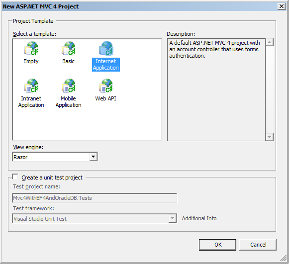
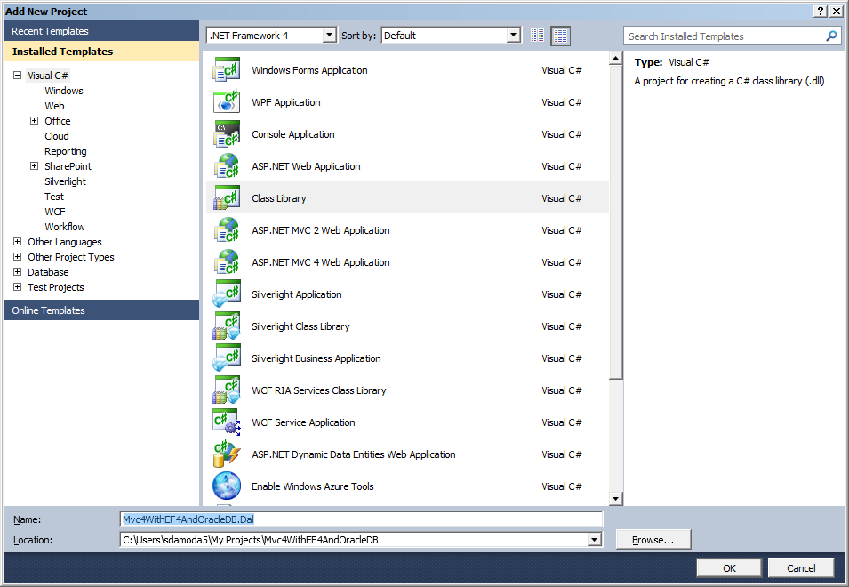

# Asp.Net Mvc4 with Entity Framework 4 and Oracle Database
## License
- Apache License, Version 2.0
## Technologies
- ADO.NET Entity Framework
- ASP.NET MVC 4
- ADO.NET Entity Framework with Oracle
- ASP.NET MVC 4 with Entity Framework
## Topics
- ASP.NET and ADO.NET Entity Framework
- ASP.NET MVC
- ASP.NET MVC 4
- ADO.NET Entity Framework with Oracle
- Stored Procedure Entity Framework Oracle DB
- Stored Procedure Entity Framework
## Updated
- 10/29/2014
## Description

<h1>Introduction</h1>

<em>The solution in this article helps to understand and implement below points.</em>

<ul>
<li><em>&nbsp;&nbsp;&nbsp;&nbsp; How to use Entity Framework with Oracle database.</em>
</li><li><em>&nbsp;&nbsp;&nbsp;&nbsp; Integration of Entity Framework with Asp.Net MVC 4.</em>
</li></ul>

<em>I wanted to keep this article simple to understand, so only above features are covered. I have a plan of working on many other solutions end to end for Asp.Net MVC 4.</em>

<em>&nbsp;</em>&nbsp;<em>Prerequisite to develop the sample</em>

<ul>
<li><em>&nbsp;&nbsp;&nbsp;Visual Studio 2010.</em> </li><li><em>&nbsp;&nbsp;&nbsp;Visual Studio 2010 sp1.</em> </li><li><em>&nbsp;&nbsp;&nbsp;Asp.Net MVC 4.</em> </li><li><em>&nbsp;&nbsp; Entity Framework 4.</em> </li><li><em>&nbsp;&nbsp; Oracle Database Server.</em> </li><li><em>&nbsp;&nbsp; ODAC(Oracle Data Access Component).</em> </li></ul>

<em>&nbsp;&nbsp;<strong>&nbsp;Note</strong>: Install Oracle Data Access Component(ODAC) 11.2.0.3&nbsp;or later from the OTN. The ODAC download includes&nbsp;Oracle Developer Tools fro Visual Studio and ODP.Net
 taht will be used in this lab.</em>

<h1>Building the Sample</h1>

<em>Please follow the below steps to build the application end to end.</em>

<h3><strong>Step 1:Create MVC Project</strong></h3>

<em>Open the Visual Studio 2010 IDE AND CREATE Asp.Net MVC 4 application. As shown in the below screens.</em>

<strong>File-&gt;New-&gt;Project</strong>

<strong>&nbsp;</strong>

<em>&nbsp;</em>&nbsp;

<strong>Visual C# -&gt;Web-&gt;Asp.Net MVC 4 Web Application</strong>

<strong>&nbsp;</strong>&nbsp;<strong>&nbsp;</strong>&nbsp;

<strong>&nbsp;</strong>

<strong></strong>

<strong>&nbsp;</strong><strong>Project Solution Structure</strong>

<strong>&nbsp;</strong>

<strong>&nbsp;</strong>

<h3><strong>Step 2: Create DAL Project </strong>
</h3>

<em>Below points are to be considered for DAL project.</em>

<ul>
<li><em>The DAL project is a simple class libraray.</em> </li><li><em>In DAL project we are going to add the entity framework(.edmx) file.</em>
</li></ul>

<strong>A) Steps to add class library in the solution.</strong>

<strong>Right Click Solution &quot;MVC4WithEF4AndOracleDB.Dal&quot;</strong>

<strong>Click &quot;Ok&quot;</strong>

<strong>Right Click &quot;Class1.cs&quot; and delete it.</strong>

<strong>&nbsp;</strong>

<strong>&nbsp;</strong>

<strong>Project Solution Structure</strong>

<strong>&nbsp;</strong>

<strong>&nbsp;</strong>

<strong>&nbsp;B) Steps to add Entity Framework support in the DAL Layer</strong>

<ol>
<li>Right click on DAL project &quot;MVCWithEF4AndOracleDB.Dal&quot; </li><li>Click Add </li><li>Click &quot;Add New Item&quot; </li><li>In Add New Item Dialog box select &quot;ADO.Net Entity Data Model&quot; </li><li>Name it as &quot;OracleDataModel.edmx&quot; </li><li>Click Add </li></ol>

<strong>&nbsp;This will start Entity Data Model Wizard.</strong>

<strong>&nbsp;</strong>&nbsp;

<strong>&nbsp;</strong>

<strong>&nbsp;</strong>

<strong>Choose &quot;Generate from Database&quot;,Click Next </strong>

<strong>&nbsp;</strong>&nbsp;

<strong></strong>

<strong>&nbsp;</strong>&nbsp;

<strong>In Choose your data connecction window ,Click &quot;New Connection&quot;</strong>

<strong></strong>

<strong>In Choose Data Source Window select &quot;Oracle Database&quot;.</strong>

<strong>Select Data Provider as &quot;ODP.Net , Managed Driver&quot;.</strong>

<strong>Click Continue</strong>

<strong>This will open &quot;Connection Properties&quot; window as below</strong>

<strong>&nbsp;</strong>&nbsp;

<strong></strong>

<strong>&nbsp;</strong>&nbsp;

<strong>In Connection Propperties window enter below details</strong>

<ul>
<li>User Name </li><li>Password </li><li>Select Data Source Name from Drop Down </li><li>Click test Connection </li><li>This will pop up &quot;Test Connection Succeded&quot; window. </li><li>Click &quot;OK&quot; </li></ul>

<strong>Name your Entity object(In my case it is &quot;OracleEntities&quot;</strong>

<strong>&nbsp;</strong>&nbsp;

<strong></strong>

<strong>&nbsp;</strong>

<strong>&nbsp;Clicking &quot;Next&quot; will pop up &quot;Choose Your Database Objects&quot; window.</strong>

<strong></strong>

<strong>&nbsp;</strong>

<strong>In &quot;Choose your database Objects&quot; window , select the obhects you want to use in your application.</strong>

<strong>As in this sample, I am going to demonstrate the use of Stored Procedure with Entity Framework.I am select the procedure&nbsp; &quot;GETDBUSERBYUSERID&quot; .</strong>

<strong>Enter the name of model &quot;OracleModel&quot;. </strong>&nbsp;

<strong>Click &quot;Finish&quot;.</strong>

<strong>With all above steps we have successfully included the ADO.Net Entity Framework (.edmx) file in the DAL layer.</strong>

<strong>GETDBUSERBYUSERID stored procedure</strong>

&nbsp;CREATE OR REPLACE PROCEDURE &#65279;GETDBUSERBYUSERID(

p_userid in test_user.USER_ID%TYPE,

UserDetails OUT SYS_REFCURSOR )

IS

BEGIN

OPEN UserDetails FOR

SELECT User_Name,Age FROM Test_User Where User_ID=p_userid;

&nbsp;END GETDBUSERBYUSERID;

<strong>&nbsp;</strong>&nbsp;The stored procedure takes user id as input and returns the&nbsp;REFCURSOR with details of the user.

<strong>&nbsp;C) Changes to&nbsp;OracleDataModel.edmx file&nbsp;</strong>

<ul>
<li>In solution explorer double click the OracleDataModel.edmx file. </li><li>Right click on the file and select &quot;Model Browser&quot;. 
</li></ul>

<strong>Create Complex Class</strong>

Under OracleModel

Right click on folder &quot;Complex&nbsp;Types&quot; =&gt; Create Complex Types.Name the class as
<strong>UserDetails</strong>.

Right click on the class&nbsp;<strong>UserDetails </strong>=&gt;<strong>Click ADD =&gt;&nbsp;&nbsp;Scalar Property =&gt;String</strong>.Name the property as
<strong>UserName.</strong>

Right click on the class <strong>UserDetails =&gt;Click ADD=&gt;Scalar Property=&gt;Int64</strong>.Name the property as
<strong>Age.</strong>

<strong>Function import for stored Procedure</strong>

<ul>
<li>In &quot;Model Browser&quot; navigate to <strong>OracleModel.Store=&gt;Stored Procedures
</strong>and double click on stores procedure &quot;<strong>GETDBUSERBYUSERID</strong>&quot;
</li><li>This will open&nbsp;&quot;Add function import&quot; window. </li></ul>

<strong>&nbsp;</strong>

<strong>&nbsp;Steps in Add Function Import</strong>

<ul>
<li>Function Import Name :GetDBUserByUserId </li><li>Select the stored procedure &quot;GETDBUSERBYUSERID&quot; </li><li>Select the complex and select Complex class &quot;UserDetails&quot; created in step &quot;Create Complex Class&quot;
</li></ul>

<strong>After performing steps in this section ,we will see the model browser updated as per the screen below.</strong>

<strong>&nbsp;</strong>

&nbsp;

&nbsp;

<h3>Step 3 :Using the Dal in the GUI Project
</h3>

<strong>A. Updates in Web.config file.</strong>

<ul>
<li>Open the Web.config file from the GUI Project . </li><li>Open the App.config from the DAL project. </li><li>Copy the connection string from App.config to web.config under the connectionStrings section.
</li><li>In Web.config add the section <strong>&lt;oracle.manageddataaccess.client&gt;</strong> as below.
</li></ul>

&lt;oracle.manageddataaccessclient&gt;

&nbsp;&nbsp;&nbsp;&nbsp; &lt;version number=&quot;*&quot;&gt;

&nbsp;&nbsp;&nbsp;&nbsp;&nbsp;&nbsp;&nbsp;&nbsp; &lt;implicitRefCursor&gt;

&nbsp;&nbsp;&nbsp;&nbsp;&nbsp;&nbsp;&nbsp;&nbsp;&nbsp;&nbsp;&nbsp;&nbsp;&nbsp;&lt;storedProcedure schema=&quot;YourSchemaName&quot; name=&quot;GETDBUSERBYUSERID&quot;&gt;

&nbsp;&nbsp;&nbsp;&nbsp;&nbsp;&nbsp;&nbsp;&nbsp;&nbsp;&nbsp;&nbsp;&nbsp;&nbsp;&nbsp;&nbsp;&nbsp;&nbsp; &lt;refCursor name=&quot;UserDetails&quot;&gt;

&nbsp;&nbsp;&nbsp;&nbsp;&nbsp;&nbsp;&nbsp;&nbsp;&nbsp;&nbsp;&nbsp;&nbsp;&nbsp;&nbsp;&nbsp;&nbsp;&nbsp;&nbsp;&nbsp;&nbsp;&nbsp; &lt;bindInfo mode=&quot;Output&quot;&gt;

&nbsp;&nbsp;&nbsp;&nbsp;&nbsp;&nbsp;&nbsp;&nbsp;&nbsp;&nbsp;&nbsp;&nbsp;&nbsp;&nbsp;&nbsp;&nbsp; &lt;/refCursor&gt;

&nbsp;&nbsp;&nbsp;&nbsp;&nbsp;&nbsp;&nbsp;&nbsp;&nbsp;&nbsp;&nbsp; &lt;/storedProcedure&gt;

&nbsp;&nbsp;&nbsp;&nbsp;&nbsp;&nbsp;&nbsp; &lt;/implicitRefCursor&gt;

&nbsp;&nbsp;&nbsp; &lt;/version&gt;

&lt;/oracle.manageddataaccessclient&gt;

<strong>B. Use the entity framework in the GUI Project.&nbsp;</strong>

Double click on the HomeController.cs calss under controllers folder.

In index action add the below code.

Public ActionResult Index()

{

OracleEntities entities= new OracleEntities();

var output= entities.GETDBUSERBYUSERID(11);

return View();

}

&nbsp;

<strong>Place the break point on the line return View(); to see the results returned.I have checked the result in the Output window as below.</strong>

&nbsp;

<h3><strong>&nbsp;&nbsp;Happy Coding.....</strong></h3>
