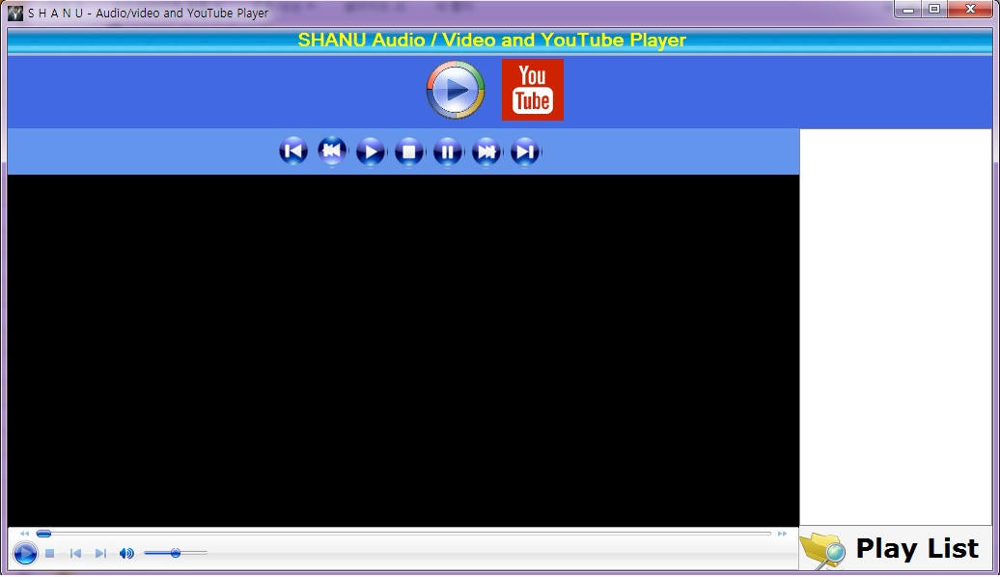

# Audio, Video and YouTube Video Player in C# Windows Forms
## Requires
- Visual Studio 2010
## License
- MIT
## Technologies
- C#
- WinForms
- Shockwave
## Topics
- C#
- Windows Forms
## Updated
- 09/07/2015
## Description

<h1>Introduction</h1>

&nbsp;

<strong> 
</strong>

The main purpose of this article is to explain how to create a simple audio/video and YouTube video player using C# Windows applications. The user can select an audio or video file and add to the Play List and play the songs or the video file. I have used
 2 COM Components to play the audio/video and for playing the YouTube Video URL. In my project I have used the fallowing COM Components.

<ul>
<li><strong>Windows Media Player object (COM Component).</strong> </li><li><strong>Shockwave flash object (COM Component)</strong> </li></ul>

<strong>&nbsp;</strong>

<strong>Building the Sample</strong>

&nbsp;

<strong>&nbsp;</strong><strong>Audio/Video Player</strong>

<strong>&nbsp;</strong>&nbsp;

Any audio or video files supported by the Windows Media Player can be played in my application. Therefore the first and most important one is to add the Windows Media Player COM Component to our project.

&nbsp;

The following describes how to add the Windows Media Player COM Component to our Windows application:

<ul>
<li>Create your Windows application. </li><li>From the Tools Windows click Choose Items. </li><li>Select the COM Components Tab. </li><li>Search for &quot;Windows Media Player&quot; and click OK.&nbsp; </li></ul>

Now you can see the Windows Media Player will be added to your Tools windows. Just drag and drop the control to your Windows Forms.

Here you can see my Audio/Video Player screen.

My Audio/video Player has the following features:

<ul>
<li>Load audio/video File and add to playlist. </li><li>Play audio/video File </li><li>Pause audio/video File </li><li>Stop audio/video File </li><li>Play previous Song </li><li>Play Next Song </li><li>Play First Song of Play List </li><li>Play Last Song of Play List </li></ul>

<strong>YouTube Player 
 
</strong>

To play any YouTube URL video in our Windows application we can use the Shockwave Flash Object COM Component. 
<ul>
<li>How to add Shockwave Flash Object COM Component to our Windows application </li><li>Create your Windows application </li><li>From the Tools Windows click Choose Items </li><li>Select the COM Components Tab </li><li>Search for &quot;Shockwave Flash Object&quot; and click OK </li></ul>

You will then see the Shockwave Flash Object added to your Tools window. Just drag and drop the control to your Windows Forms. Here you can see my YouTube screen.

<strong>Note: </strong>To play the YouTube video in our Shockwave Flash Object the YouTube URL should be edited.

For example we have the YouTube URL <a href="https://www.youtube.com/watch?v=Ce_Ne5P02q0">
https://www.youtube.com/watch?v=Ce_Ne5P02q0</a>

To play this video we need to <strong>delete &quot;watch?&quot;</strong> from the URL and also we need to
<strong>replace </strong>the &quot;=&quot; next to <strong>&quot;v&quot;</strong> as <strong>&quot;/&quot;</strong>.

So here for example the actual URL should be edited to be like &quot;http://www.youtube.com/v/Ce_Ne5P02q0&quot; .

If we do not edit the URL as in the preceding then it will not play in Shockwave.

Description

<strong>Audio/Video Player Code</strong>

Load Audio and Video file to our Play List. Here using the Open File Dialog we can filter all our audio and video files. Add all the file names and paths to the String Array and bind them to the List Box.&nbsp;

&nbsp;

C#

Edit|Remove

csharp
<pre class="hidden">//Load Audio or Vedio files 
        private void btnLoadFile_Click(object sender, EventArgs e)
        {
            Startindex = 0;
            playnext = false;
            OpenFileDialog opnFileDlg = new OpenFileDialog();
            opnFileDlg.Multiselect = true;
            opnFileDlg.Filter = &quot;(mp3,wav,mp4,mov,wmv,mpg,avi,3gp,flv)|*.mp3;*.wav;*.mp4;*.3gp;*.avi;*.mov;*.flv;*.wmv;*.mpg|all files|*.*&quot;;  
            if (opnFileDlg.ShowDialog() == DialogResult.OK)
            {
                FileName = opnFileDlg.SafeFileNames;
                FilePath = opnFileDlg.FileNames;
       for (int i = 0; i &lt;= FileName.Length - 1; i&#43;&#43;)
                {
                    listBox1.Items.Add(FileName[i]);
                }
                Startindex = 0;
                playfile(0);
            }
        }
        #endregion
</pre>

<pre class="csharp">//Load&nbsp;Audio&nbsp;or&nbsp;Vedio&nbsp;files&nbsp;&nbsp;
&nbsp;&nbsp;&nbsp;&nbsp;&nbsp;&nbsp;&nbsp;&nbsp;private&nbsp;void&nbsp;btnLoadFile_Click(object&nbsp;sender,&nbsp;EventArgs&nbsp;e)&nbsp;
&nbsp;&nbsp;&nbsp;&nbsp;&nbsp;&nbsp;&nbsp;&nbsp;{&nbsp;
&nbsp;&nbsp;&nbsp;&nbsp;&nbsp;&nbsp;&nbsp;&nbsp;&nbsp;&nbsp;&nbsp;&nbsp;Startindex&nbsp;=&nbsp;0;&nbsp;
&nbsp;&nbsp;&nbsp;&nbsp;&nbsp;&nbsp;&nbsp;&nbsp;&nbsp;&nbsp;&nbsp;&nbsp;playnext&nbsp;=&nbsp;false;&nbsp;
&nbsp;&nbsp;&nbsp;&nbsp;&nbsp;&nbsp;&nbsp;&nbsp;&nbsp;&nbsp;&nbsp;&nbsp;OpenFileDialog&nbsp;opnFileDlg&nbsp;=&nbsp;new&nbsp;OpenFileDialog();&nbsp;
&nbsp;&nbsp;&nbsp;&nbsp;&nbsp;&nbsp;&nbsp;&nbsp;&nbsp;&nbsp;&nbsp;&nbsp;opnFileDlg.Multiselect&nbsp;=&nbsp;true;&nbsp;
&nbsp;&nbsp;&nbsp;&nbsp;&nbsp;&nbsp;&nbsp;&nbsp;&nbsp;&nbsp;&nbsp;&nbsp;opnFileDlg.Filter&nbsp;=&nbsp;&quot;(mp3,wav,mp4,mov,wmv,mpg,avi,3gp,flv)|*.mp3;*.wav;*.mp4;*.3gp;*.avi;*.mov;*.flv;*.wmv;*.mpg|all&nbsp;files|*.*&quot;;&nbsp;&nbsp;&nbsp;
&nbsp;&nbsp;&nbsp;&nbsp;&nbsp;&nbsp;&nbsp;&nbsp;&nbsp;&nbsp;&nbsp;&nbsp;if&nbsp;(opnFileDlg.ShowDialog()&nbsp;==&nbsp;DialogResult.OK)&nbsp;
&nbsp;&nbsp;&nbsp;&nbsp;&nbsp;&nbsp;&nbsp;&nbsp;&nbsp;&nbsp;&nbsp;&nbsp;{&nbsp;
&nbsp;&nbsp;&nbsp;&nbsp;&nbsp;&nbsp;&nbsp;&nbsp;&nbsp;&nbsp;&nbsp;&nbsp;&nbsp;&nbsp;&nbsp;&nbsp;FileName&nbsp;=&nbsp;opnFileDlg.SafeFileNames;&nbsp;
&nbsp;&nbsp;&nbsp;&nbsp;&nbsp;&nbsp;&nbsp;&nbsp;&nbsp;&nbsp;&nbsp;&nbsp;&nbsp;&nbsp;&nbsp;&nbsp;FilePath&nbsp;=&nbsp;opnFileDlg.FileNames;&nbsp;
&nbsp;&nbsp;&nbsp;&nbsp;&nbsp;&nbsp;&nbsp;for&nbsp;(int&nbsp;i&nbsp;=&nbsp;0;&nbsp;i&nbsp;&lt;=&nbsp;FileName.Length&nbsp;-&nbsp;1;&nbsp;i&#43;&#43;)&nbsp;
&nbsp;&nbsp;&nbsp;&nbsp;&nbsp;&nbsp;&nbsp;&nbsp;&nbsp;&nbsp;&nbsp;&nbsp;&nbsp;&nbsp;&nbsp;&nbsp;{&nbsp;
&nbsp;&nbsp;&nbsp;&nbsp;&nbsp;&nbsp;&nbsp;&nbsp;&nbsp;&nbsp;&nbsp;&nbsp;&nbsp;&nbsp;&nbsp;&nbsp;&nbsp;&nbsp;&nbsp;&nbsp;listBox1.Items.Add(FileName[i]);&nbsp;
&nbsp;&nbsp;&nbsp;&nbsp;&nbsp;&nbsp;&nbsp;&nbsp;&nbsp;&nbsp;&nbsp;&nbsp;&nbsp;&nbsp;&nbsp;&nbsp;}&nbsp;
&nbsp;&nbsp;&nbsp;&nbsp;&nbsp;&nbsp;&nbsp;&nbsp;&nbsp;&nbsp;&nbsp;&nbsp;&nbsp;&nbsp;&nbsp;&nbsp;Startindex&nbsp;=&nbsp;0;&nbsp;
&nbsp;&nbsp;&nbsp;&nbsp;&nbsp;&nbsp;&nbsp;&nbsp;&nbsp;&nbsp;&nbsp;&nbsp;&nbsp;&nbsp;&nbsp;&nbsp;playfile(0);&nbsp;
&nbsp;&nbsp;&nbsp;&nbsp;&nbsp;&nbsp;&nbsp;&nbsp;&nbsp;&nbsp;&nbsp;&nbsp;}&nbsp;
&nbsp;&nbsp;&nbsp;&nbsp;&nbsp;&nbsp;&nbsp;&nbsp;}&nbsp;
&nbsp;&nbsp;&nbsp;&nbsp;&nbsp;&nbsp;&nbsp;&nbsp;#endregion&nbsp;
</pre>

&nbsp;This method will be called from First, Next, Previous, Last and from the List Box Selected Index Change event with passing the &ldquo;selectedindex&rdquo; value. In this method from the array check for the
 selected file and play using the &quot; WindowsMediaPlayer.URL&quot; as in the following:

&nbsp;

&nbsp;

C#

Edit|Remove

csharp
<pre class="hidden">// To Play the player
        public void playfile(int playlistindex)
        {
            if (listBox1.Items.Count &lt;= 0)
            { return; }
            if (playlistindex &lt; 0)
            {
                return;
            }
            WindowsMediaPlayer.settings.autoStart = true;
            WindowsMediaPlayer.URL = FilePath[playlistindex];
            WindowsMediaPlayer.Ctlcontrols.next();
            WindowsMediaPlayer.Ctlcontrols.play();
        }
</pre>

<pre class="js">//&nbsp;To&nbsp;Play&nbsp;the&nbsp;player&nbsp;
&nbsp;&nbsp;&nbsp;&nbsp;&nbsp;&nbsp;&nbsp;&nbsp;public&nbsp;void&nbsp;playfile(int&nbsp;playlistindex)&nbsp;
&nbsp;&nbsp;&nbsp;&nbsp;&nbsp;&nbsp;&nbsp;&nbsp;{&nbsp;
&nbsp;&nbsp;&nbsp;&nbsp;&nbsp;&nbsp;&nbsp;&nbsp;&nbsp;&nbsp;&nbsp;&nbsp;if&nbsp;(listBox1.Items.Count&nbsp;&lt;=&nbsp;0)&nbsp;
&nbsp;&nbsp;&nbsp;&nbsp;&nbsp;&nbsp;&nbsp;&nbsp;&nbsp;&nbsp;&nbsp;&nbsp;{&nbsp;return;&nbsp;}&nbsp;
&nbsp;&nbsp;&nbsp;&nbsp;&nbsp;&nbsp;&nbsp;&nbsp;&nbsp;&nbsp;&nbsp;&nbsp;if&nbsp;(playlistindex&nbsp;&lt;&nbsp;0)&nbsp;
&nbsp;&nbsp;&nbsp;&nbsp;&nbsp;&nbsp;&nbsp;&nbsp;&nbsp;&nbsp;&nbsp;&nbsp;{&nbsp;
&nbsp;&nbsp;&nbsp;&nbsp;&nbsp;&nbsp;&nbsp;&nbsp;&nbsp;&nbsp;&nbsp;&nbsp;&nbsp;&nbsp;&nbsp;&nbsp;return;&nbsp;
&nbsp;&nbsp;&nbsp;&nbsp;&nbsp;&nbsp;&nbsp;&nbsp;&nbsp;&nbsp;&nbsp;&nbsp;}&nbsp;
&nbsp;&nbsp;&nbsp;&nbsp;&nbsp;&nbsp;&nbsp;&nbsp;&nbsp;&nbsp;&nbsp;&nbsp;WindowsMediaPlayer.settings.autoStart&nbsp;=&nbsp;true;&nbsp;
&nbsp;&nbsp;&nbsp;&nbsp;&nbsp;&nbsp;&nbsp;&nbsp;&nbsp;&nbsp;&nbsp;&nbsp;WindowsMediaPlayer.URL&nbsp;=&nbsp;FilePath[playlistindex];&nbsp;
&nbsp;&nbsp;&nbsp;&nbsp;&nbsp;&nbsp;&nbsp;&nbsp;&nbsp;&nbsp;&nbsp;&nbsp;WindowsMediaPlayer.Ctlcontrols.next();&nbsp;
&nbsp;&nbsp;&nbsp;&nbsp;&nbsp;&nbsp;&nbsp;&nbsp;&nbsp;&nbsp;&nbsp;&nbsp;WindowsMediaPlayer.Ctlcontrols.play();&nbsp;
&nbsp;&nbsp;&nbsp;&nbsp;&nbsp;&nbsp;&nbsp;&nbsp;}&nbsp;
</pre>

&nbsp;This is a Windows Media Player event that will be triggered whenever the player plays, pauses, stops and so on. Here I have used this method to check for the song or video file when the playing finishes or ends. If the song
 ends then I set the &nbsp;&quot;playnext = true&quot;. In my program I used the Timer control that checks for the &quot;playnext = true&quot;status and plays the next song.

&nbsp;

&nbsp;

C#

Edit|Remove

csharp
<pre class="hidden">#region This is Windows Media Player Event which we can used to fidn the status of the player and do our actions.
        private void WindowsMediaPlayer_PlayStateChange(object sender, AxWMPLib._WMPOCXEvents_PlayStateChangeEvent e)
        {
            int statuschk = e.newState;  // here the Status return the windows Media Player status where the 8 is the Song or Vedio is completed the playing .

            // Now here i check if the song is completed then i Increment to play the next song

            if (statuschk == 8)
            {
                statuschk = e.newState;

                if (Startindex == listBox1.Items.Count - 1)
                {
                    Startindex = 0;
                }
                else if (Startindex &gt;= 0 &amp;&amp; Startindex &lt; listBox1.Items.Count - 1)
                {
                    Startindex = Startindex &#43; 1;
                }
                playnext = true;
            }
        }
         #endregion
</pre>

<pre class="csharp">#region&nbsp;This&nbsp;is&nbsp;Windows&nbsp;Media&nbsp;Player&nbsp;Event&nbsp;which&nbsp;we&nbsp;can&nbsp;used&nbsp;to&nbsp;fidn&nbsp;the&nbsp;status&nbsp;of&nbsp;the&nbsp;player&nbsp;and&nbsp;do&nbsp;our&nbsp;actions.&nbsp;
&nbsp;&nbsp;&nbsp;&nbsp;&nbsp;&nbsp;&nbsp;&nbsp;private&nbsp;void&nbsp;WindowsMediaPlayer_PlayStateChange(object&nbsp;sender,&nbsp;AxWMPLib._WMPOCXEvents_PlayStateChangeEvent&nbsp;e)&nbsp;
&nbsp;&nbsp;&nbsp;&nbsp;&nbsp;&nbsp;&nbsp;&nbsp;{&nbsp;
&nbsp;&nbsp;&nbsp;&nbsp;&nbsp;&nbsp;&nbsp;&nbsp;&nbsp;&nbsp;&nbsp;&nbsp;int&nbsp;statuschk&nbsp;=&nbsp;e.newState;&nbsp;&nbsp;//&nbsp;here&nbsp;the&nbsp;Status&nbsp;return&nbsp;the&nbsp;windows&nbsp;Media&nbsp;Player&nbsp;status&nbsp;where&nbsp;the&nbsp;8&nbsp;is&nbsp;the&nbsp;Song&nbsp;or&nbsp;Vedio&nbsp;is&nbsp;completed&nbsp;the&nbsp;playing&nbsp;.&nbsp;
&nbsp;
&nbsp;&nbsp;&nbsp;&nbsp;&nbsp;&nbsp;&nbsp;&nbsp;&nbsp;&nbsp;&nbsp;&nbsp;//&nbsp;Now&nbsp;here&nbsp;i&nbsp;check&nbsp;if&nbsp;the&nbsp;song&nbsp;is&nbsp;completed&nbsp;then&nbsp;i&nbsp;Increment&nbsp;to&nbsp;play&nbsp;the&nbsp;next&nbsp;song&nbsp;
&nbsp;
&nbsp;&nbsp;&nbsp;&nbsp;&nbsp;&nbsp;&nbsp;&nbsp;&nbsp;&nbsp;&nbsp;&nbsp;if&nbsp;(statuschk&nbsp;==&nbsp;8)&nbsp;
&nbsp;&nbsp;&nbsp;&nbsp;&nbsp;&nbsp;&nbsp;&nbsp;&nbsp;&nbsp;&nbsp;&nbsp;{&nbsp;
&nbsp;&nbsp;&nbsp;&nbsp;&nbsp;&nbsp;&nbsp;&nbsp;&nbsp;&nbsp;&nbsp;&nbsp;&nbsp;&nbsp;&nbsp;&nbsp;statuschk&nbsp;=&nbsp;e.newState;&nbsp;
&nbsp;
&nbsp;&nbsp;&nbsp;&nbsp;&nbsp;&nbsp;&nbsp;&nbsp;&nbsp;&nbsp;&nbsp;&nbsp;&nbsp;&nbsp;&nbsp;&nbsp;if&nbsp;(Startindex&nbsp;==&nbsp;listBox1.Items.Count&nbsp;-&nbsp;1)&nbsp;
&nbsp;&nbsp;&nbsp;&nbsp;&nbsp;&nbsp;&nbsp;&nbsp;&nbsp;&nbsp;&nbsp;&nbsp;&nbsp;&nbsp;&nbsp;&nbsp;{&nbsp;
&nbsp;&nbsp;&nbsp;&nbsp;&nbsp;&nbsp;&nbsp;&nbsp;&nbsp;&nbsp;&nbsp;&nbsp;&nbsp;&nbsp;&nbsp;&nbsp;&nbsp;&nbsp;&nbsp;&nbsp;Startindex&nbsp;=&nbsp;0;&nbsp;
&nbsp;&nbsp;&nbsp;&nbsp;&nbsp;&nbsp;&nbsp;&nbsp;&nbsp;&nbsp;&nbsp;&nbsp;&nbsp;&nbsp;&nbsp;&nbsp;}&nbsp;
&nbsp;&nbsp;&nbsp;&nbsp;&nbsp;&nbsp;&nbsp;&nbsp;&nbsp;&nbsp;&nbsp;&nbsp;&nbsp;&nbsp;&nbsp;&nbsp;else&nbsp;if&nbsp;(Startindex&nbsp;&gt;=&nbsp;0&nbsp;&amp;&amp;&nbsp;Startindex&nbsp;&lt;&nbsp;listBox1.Items.Count&nbsp;-&nbsp;1)&nbsp;
&nbsp;&nbsp;&nbsp;&nbsp;&nbsp;&nbsp;&nbsp;&nbsp;&nbsp;&nbsp;&nbsp;&nbsp;&nbsp;&nbsp;&nbsp;&nbsp;{&nbsp;
&nbsp;&nbsp;&nbsp;&nbsp;&nbsp;&nbsp;&nbsp;&nbsp;&nbsp;&nbsp;&nbsp;&nbsp;&nbsp;&nbsp;&nbsp;&nbsp;&nbsp;&nbsp;&nbsp;&nbsp;Startindex&nbsp;=&nbsp;Startindex&nbsp;&#43;&nbsp;1;&nbsp;
&nbsp;&nbsp;&nbsp;&nbsp;&nbsp;&nbsp;&nbsp;&nbsp;&nbsp;&nbsp;&nbsp;&nbsp;&nbsp;&nbsp;&nbsp;&nbsp;}&nbsp;
&nbsp;&nbsp;&nbsp;&nbsp;&nbsp;&nbsp;&nbsp;&nbsp;&nbsp;&nbsp;&nbsp;&nbsp;&nbsp;&nbsp;&nbsp;&nbsp;playnext&nbsp;=&nbsp;true;&nbsp;
&nbsp;&nbsp;&nbsp;&nbsp;&nbsp;&nbsp;&nbsp;&nbsp;&nbsp;&nbsp;&nbsp;&nbsp;}&nbsp;
&nbsp;&nbsp;&nbsp;&nbsp;&nbsp;&nbsp;&nbsp;&nbsp;}&nbsp;
&nbsp;&nbsp;&nbsp;&nbsp;&nbsp;&nbsp;&nbsp;&nbsp;&nbsp;#endregion&nbsp;
</pre>

&nbsp;The Windows Media Player has the methods like Play, Pause and Stop for the player.&nbsp;

C#

Edit|Remove

csharp
<pre class="hidden">WindowsMediaPlayer.Ctlcontrols.next();
 WindowsMediaPlayer.Ctlcontrols.play();
WindowsMediaPlayer.Ctlcontrols.Stop();
</pre>

<pre class="csharp">WindowsMediaPlayer.Ctlcontrols.next();&nbsp;
&nbsp;WindowsMediaPlayer.Ctlcontrols.play();&nbsp;
WindowsMediaPlayer.Ctlcontrols.Stop();&nbsp;
</pre>

&nbsp;<strong>YouTube Video Player:
</strong>This is a simple and easy to use object. The Shockwave object has a Movie property. Here we can provide our YouTube video to play. 
Here in the button click I provide the input of the TextBox to the Shockwave Flash objectmovie property.

C#

Edit|Remove

csharp
<pre class="hidden"> private void btnYoutube_Click(object sender, EventArgs e)
        {
            ShockwaveFlash.Movie = txtUtube.Text.Trim();
        }
</pre>

<pre class="js">&nbsp;private&nbsp;void&nbsp;btnYoutube_Click(object&nbsp;sender,&nbsp;EventArgs&nbsp;e)&nbsp;
&nbsp;&nbsp;&nbsp;&nbsp;&nbsp;&nbsp;&nbsp;&nbsp;{&nbsp;
&nbsp;&nbsp;&nbsp;&nbsp;&nbsp;&nbsp;&nbsp;&nbsp;&nbsp;&nbsp;&nbsp;&nbsp;ShockwaveFlash.Movie&nbsp;=&nbsp;txtUtube.Text.Trim();&nbsp;
&nbsp;&nbsp;&nbsp;&nbsp;&nbsp;&nbsp;&nbsp;&nbsp;}&nbsp;
</pre>

&nbsp;<strong>Using the Audio and Video Player in our Main Form 
</strong> 
I have created the Audio and Video player as the User Control. In my project file you can find both &ldquo;AudioVedioCntl.cs&rdquo; and &ldquo;YouTubeCntl.cs&rdquo; inside the PlayerControls folder. Create the object for the user controls and add the controls
 to our form or Panel. In the form load I called a method &ldquo;LoadPlayerControl&rdquo;. To this method I passed the parameter as 0 and 1,&nbsp;0 for adding and displaying the Audio Player to the panel and 1 for adding and displaying the YouTube player.

&nbsp;

&nbsp;

C#

Edit|Remove

csharp
<pre class="hidden">private void frmMain_Load(object sender, EventArgs e)
        {
            LoadPlayerControl(0);
        }
        private void LoadPlayerControl(int playerType)
        {
            pnlMain.Controls.Clear();

            if (playerType == 0)
            {
                SHANUAudioVedioPlayListPlayer.PlayerControls.AudioVedioCntl objAudioVideo = new PlayerControls.AudioVedioCntl();
                pnlMain.Controls.Add(objAudioVideo);
                objAudioVideo.Dock = DockStyle.Fill;
            }
            else
            {
                PlayerControls.YouTubeCntl objYouTube = new PlayerControls.YouTubeCntl();
                pnlMain.Controls.Add(objYouTube);
                objYouTube.Dock = DockStyle.Fill;
            }
        }
</pre>

<pre class="csharp">private&nbsp;void&nbsp;frmMain_Load(object&nbsp;sender,&nbsp;EventArgs&nbsp;e)&nbsp;
&nbsp;&nbsp;&nbsp;&nbsp;&nbsp;&nbsp;&nbsp;&nbsp;{&nbsp;
&nbsp;&nbsp;&nbsp;&nbsp;&nbsp;&nbsp;&nbsp;&nbsp;&nbsp;&nbsp;&nbsp;&nbsp;LoadPlayerControl(0);&nbsp;
&nbsp;&nbsp;&nbsp;&nbsp;&nbsp;&nbsp;&nbsp;&nbsp;}&nbsp;
&nbsp;&nbsp;&nbsp;&nbsp;&nbsp;&nbsp;&nbsp;&nbsp;private&nbsp;void&nbsp;LoadPlayerControl(int&nbsp;playerType)&nbsp;
&nbsp;&nbsp;&nbsp;&nbsp;&nbsp;&nbsp;&nbsp;&nbsp;{&nbsp;
&nbsp;&nbsp;&nbsp;&nbsp;&nbsp;&nbsp;&nbsp;&nbsp;&nbsp;&nbsp;&nbsp;&nbsp;pnlMain.Controls.Clear();&nbsp;
&nbsp;
&nbsp;&nbsp;&nbsp;&nbsp;&nbsp;&nbsp;&nbsp;&nbsp;&nbsp;&nbsp;&nbsp;&nbsp;if&nbsp;(playerType&nbsp;==&nbsp;0)&nbsp;
&nbsp;&nbsp;&nbsp;&nbsp;&nbsp;&nbsp;&nbsp;&nbsp;&nbsp;&nbsp;&nbsp;&nbsp;{&nbsp;
&nbsp;&nbsp;&nbsp;&nbsp;&nbsp;&nbsp;&nbsp;&nbsp;&nbsp;&nbsp;&nbsp;&nbsp;&nbsp;&nbsp;&nbsp;&nbsp;SHANUAudioVedioPlayListPlayer.PlayerControls.AudioVedioCntl&nbsp;objAudioVideo&nbsp;=&nbsp;new&nbsp;PlayerControls.AudioVedioCntl();&nbsp;
&nbsp;&nbsp;&nbsp;&nbsp;&nbsp;&nbsp;&nbsp;&nbsp;&nbsp;&nbsp;&nbsp;&nbsp;&nbsp;&nbsp;&nbsp;&nbsp;pnlMain.Controls.Add(objAudioVideo);&nbsp;
&nbsp;&nbsp;&nbsp;&nbsp;&nbsp;&nbsp;&nbsp;&nbsp;&nbsp;&nbsp;&nbsp;&nbsp;&nbsp;&nbsp;&nbsp;&nbsp;objAudioVideo.Dock&nbsp;=&nbsp;DockStyle.Fill;&nbsp;
&nbsp;&nbsp;&nbsp;&nbsp;&nbsp;&nbsp;&nbsp;&nbsp;&nbsp;&nbsp;&nbsp;&nbsp;}&nbsp;
&nbsp;&nbsp;&nbsp;&nbsp;&nbsp;&nbsp;&nbsp;&nbsp;&nbsp;&nbsp;&nbsp;&nbsp;else&nbsp;
&nbsp;&nbsp;&nbsp;&nbsp;&nbsp;&nbsp;&nbsp;&nbsp;&nbsp;&nbsp;&nbsp;&nbsp;{&nbsp;
&nbsp;&nbsp;&nbsp;&nbsp;&nbsp;&nbsp;&nbsp;&nbsp;&nbsp;&nbsp;&nbsp;&nbsp;&nbsp;&nbsp;&nbsp;&nbsp;PlayerControls.YouTubeCntl&nbsp;objYouTube&nbsp;=&nbsp;new&nbsp;PlayerControls.YouTubeCntl();&nbsp;
&nbsp;&nbsp;&nbsp;&nbsp;&nbsp;&nbsp;&nbsp;&nbsp;&nbsp;&nbsp;&nbsp;&nbsp;&nbsp;&nbsp;&nbsp;&nbsp;pnlMain.Controls.Add(objYouTube);&nbsp;
&nbsp;&nbsp;&nbsp;&nbsp;&nbsp;&nbsp;&nbsp;&nbsp;&nbsp;&nbsp;&nbsp;&nbsp;&nbsp;&nbsp;&nbsp;&nbsp;objYouTube.Dock&nbsp;=&nbsp;DockStyle.Fill;&nbsp;
&nbsp;&nbsp;&nbsp;&nbsp;&nbsp;&nbsp;&nbsp;&nbsp;&nbsp;&nbsp;&nbsp;&nbsp;}&nbsp;
&nbsp;&nbsp;&nbsp;&nbsp;&nbsp;&nbsp;&nbsp;&nbsp;}&nbsp;
</pre>

&nbsp;Source Code Files

&nbsp;

<ul>
<li>SHANUAudioVedioPlayListPlayerV1.1.zip </li></ul>
