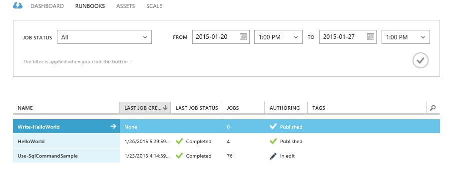

# Azure Automation Using .Net Nugget and Powershell
## Requires
- Visual Studio 2013
## License
- MIT
## Technologies
- Azure Automation
## Topics
- Azure Automation
## Updated
- 01/26/2015
## Description

<h2>What is Azure Automation?</h2>

Microsoft Azure Automation provides a way for users to automate the manual, long-running, error-prone, and frequently repeated tasks that are commonly performed in a cloud environment. You can create, monitor, manage, and deploy resources in your Azure environment
 using runbooks, which are based on Windows PowerShell workflows.&nbsp;

For detailed steps fo creating Azure Automation account and runbook using azure management portal , please see below link

<a href="http://azure.microsoft.com/en-us/documentation/articles/automation-create-runbook-from-samples/#automationaccount">http://azure.microsoft.com/en-us/documentation/articles/automation-create-runbook-from-samples/#automationaccount</a>

Below we will see how to do the same using Azure Automation Nugget&nbsp;

<a href="https://www.nuget.org/packages/Microsoft.Azure.Management.Automation/">https://www.nuget.org/packages/Microsoft.Azure.Management.Automation/</a>

<h1>Building the Sample</h1>

<em>Create a C# Console Application and using Package Console add below nuget:</em>

PM&gt; Install-Package Microsoft.Azure.Management.Automation -Pre<em> &nbsp;</em>

then add below code to program.cs

C#

Edit|Remove

csharp

<pre class="csharp">public&nbsp;static&nbsp;void&nbsp;CreateAutomationRunbook()&nbsp;
&nbsp;&nbsp;&nbsp;&nbsp;&nbsp;&nbsp;&nbsp;&nbsp;{&nbsp;
&nbsp;&nbsp;&nbsp;&nbsp;&nbsp;&nbsp;&nbsp;&nbsp;&nbsp;&nbsp;&nbsp;&nbsp;try&nbsp;
&nbsp;&nbsp;&nbsp;&nbsp;&nbsp;&nbsp;&nbsp;&nbsp;&nbsp;&nbsp;&nbsp;&nbsp;{&nbsp;
&nbsp;&nbsp;&nbsp;&nbsp;&nbsp;&nbsp;&nbsp;&nbsp;&nbsp;&nbsp;&nbsp;&nbsp;&nbsp;&nbsp;&nbsp;&nbsp;Microsoft.Azure.SubscriptionCloudCredentials&nbsp;creds;&nbsp;
&nbsp;&nbsp;&nbsp;&nbsp;&nbsp;&nbsp;&nbsp;&nbsp;&nbsp;&nbsp;&nbsp;&nbsp;&nbsp;&nbsp;&nbsp;&nbsp;creds&nbsp;=&nbsp;CertificateAuthenticationHelper.GetCredentials(ConfigurationManager.AppSettings[&quot;SubscriptionID&quot;],&nbsp;ConfigurationManager.AppSettings[&quot;Certificate&quot;]);&nbsp;
&nbsp;&nbsp;&nbsp;&nbsp;&nbsp;&nbsp;&nbsp;&nbsp;&nbsp;&nbsp;&nbsp;&nbsp;&nbsp;&nbsp;&nbsp;&nbsp;AutomationManagementClient&nbsp;automationClient&nbsp;=&nbsp;new&nbsp;AutomationManagementClient(creds);&nbsp;
&nbsp;&nbsp;&nbsp;&nbsp;&nbsp;&nbsp;&nbsp;&nbsp;&nbsp;&nbsp;&nbsp;&nbsp;&nbsp;&nbsp;&nbsp;&nbsp;//Create&nbsp;Runbook&nbsp;
&nbsp;&nbsp;&nbsp;&nbsp;&nbsp;&nbsp;&nbsp;&nbsp;&nbsp;&nbsp;&nbsp;&nbsp;&nbsp;&nbsp;&nbsp;&nbsp;FileStream&nbsp;fs&nbsp;=&nbsp;new&nbsp;FileStream(AzureAutomationSchema.ScriptFileLocation,&nbsp;FileMode.Open,&nbsp;FileAccess.Read);&nbsp;
&nbsp;&nbsp;&nbsp;&nbsp;&nbsp;&nbsp;&nbsp;&nbsp;&nbsp;&nbsp;&nbsp;&nbsp;&nbsp;&nbsp;&nbsp;&nbsp;//&nbsp;Get&nbsp;Runbook&nbsp;Response&nbsp;
&nbsp;&nbsp;&nbsp;&nbsp;&nbsp;&nbsp;&nbsp;&nbsp;&nbsp;&nbsp;&nbsp;&nbsp;&nbsp;&nbsp;&nbsp;&nbsp;var&nbsp;runbookversion&nbsp;=&nbsp;automationClient.RunbookVersions.Create(AzureAutomationSchema.automationAccount,&nbsp;fs);&nbsp;
&nbsp;&nbsp;&nbsp;&nbsp;&nbsp;&nbsp;&nbsp;&nbsp;&nbsp;&nbsp;&nbsp;&nbsp;&nbsp;&nbsp;&nbsp;&nbsp;Trace.TraceInformation(&quot;Status&nbsp;of&nbsp;RunbookVersion&nbsp;Create&nbsp;request:&quot;&nbsp;&#43;&nbsp;runbookversion.StatusCode.ToString()&nbsp;&#43;&nbsp;&quot;.RunbookVersionId&nbsp;&quot;&nbsp;&#43;&nbsp;runbookversion.RunbookVersion.Id&nbsp;&#43;&nbsp;&quot;&nbsp;&nbsp;Created.&quot;);&nbsp;
&nbsp;
&nbsp;&nbsp;&nbsp;&nbsp;&nbsp;&nbsp;&nbsp;&nbsp;&nbsp;&nbsp;&nbsp;&nbsp;&nbsp;&nbsp;&nbsp;&nbsp;var&nbsp;runbook&nbsp;=&nbsp;automationClient.Runbooks.ListByName(AzureAutomationSchema.automationAccount,&nbsp;AzureAutomationSchema.runbookname);&nbsp;
&nbsp;
&nbsp;&nbsp;&nbsp;&nbsp;&nbsp;&nbsp;&nbsp;&nbsp;&nbsp;&nbsp;&nbsp;&nbsp;&nbsp;&nbsp;&nbsp;&nbsp;//&nbsp;Get&nbsp;Runbook&nbsp;Publish&nbsp;Response&nbsp;
&nbsp;&nbsp;&nbsp;&nbsp;&nbsp;&nbsp;&nbsp;&nbsp;&nbsp;&nbsp;&nbsp;&nbsp;&nbsp;&nbsp;&nbsp;&nbsp;Microsoft.Azure.Management.Automation.Models.RunbookPublishResponse&nbsp;pubresponse&nbsp;=&nbsp;automationClient.Runbooks.Publish(AzureAutomationSchema.automationAccount,&nbsp;new&nbsp;Microsoft.Azure.Management.Automation.Models.RunbookPublishParameters(runbook.Runbooks[0].Id,&nbsp;&quot;Joe&quot;));&nbsp;
&nbsp;&nbsp;&nbsp;&nbsp;&nbsp;&nbsp;&nbsp;&nbsp;&nbsp;&nbsp;&nbsp;&nbsp;&nbsp;&nbsp;&nbsp;&nbsp;Trace.TraceInformation(&quot;Status&nbsp;of&nbsp;RunbookPublish&nbsp;request:&quot;&nbsp;&#43;&nbsp;pubresponse.StatusCode.ToString()&nbsp;&#43;&nbsp;&quot;.&nbsp;PublishedRunbookVersionId&nbsp;&quot;&nbsp;&#43;&nbsp;pubresponse.PublishedRunbookVersionId&nbsp;&#43;&nbsp;&quot;&nbsp;&nbsp;Created.&quot;);&nbsp;
&nbsp;
&nbsp;&nbsp;&nbsp;&nbsp;&nbsp;&nbsp;&nbsp;&nbsp;&nbsp;&nbsp;&nbsp;&nbsp;&nbsp;&nbsp;&nbsp;&nbsp;Microsoft.Azure.Management.Automation.Models.Schedule&nbsp;RuleEngineSchedule&nbsp;=&nbsp;new&nbsp;Microsoft.Azure.Management.Automation.Models.Schedule();&nbsp;
&nbsp;&nbsp;&nbsp;&nbsp;&nbsp;&nbsp;&nbsp;&nbsp;&nbsp;&nbsp;&nbsp;&nbsp;&nbsp;&nbsp;&nbsp;&nbsp;//Define&nbsp;Automation&nbsp;Schedule&nbsp;
&nbsp;&nbsp;&nbsp;&nbsp;&nbsp;&nbsp;&nbsp;&nbsp;&nbsp;&nbsp;&nbsp;&nbsp;&nbsp;&nbsp;&nbsp;&nbsp;Microsoft.Azure.Management.Automation.Models.ScheduleCreateParameters&nbsp;scheduleParam&nbsp;=&nbsp;new&nbsp;Microsoft.Azure.Management.Automation.Models.ScheduleCreateParameters();&nbsp;
&nbsp;&nbsp;&nbsp;&nbsp;&nbsp;&nbsp;&nbsp;&nbsp;&nbsp;&nbsp;&nbsp;&nbsp;&nbsp;&nbsp;&nbsp;&nbsp;scheduleParam.Schedule&nbsp;=&nbsp;RuleEngineSchedule;&nbsp;
&nbsp;&nbsp;&nbsp;&nbsp;&nbsp;&nbsp;&nbsp;&nbsp;&nbsp;&nbsp;&nbsp;&nbsp;&nbsp;&nbsp;&nbsp;&nbsp;scheduleParam.Schedule.Description&nbsp;=&nbsp;AzureAutomationSchema.ScheduleDescription;&nbsp;
&nbsp;&nbsp;&nbsp;&nbsp;&nbsp;&nbsp;&nbsp;&nbsp;&nbsp;&nbsp;&nbsp;&nbsp;&nbsp;&nbsp;&nbsp;&nbsp;scheduleParam.Schedule.StartTime&nbsp;=&nbsp;AzureAutomationSchema.ScheduleStartTime;&nbsp;
&nbsp;&nbsp;&nbsp;&nbsp;&nbsp;&nbsp;&nbsp;&nbsp;&nbsp;&nbsp;&nbsp;&nbsp;&nbsp;&nbsp;&nbsp;&nbsp;scheduleParam.Schedule.IsEnabled&nbsp;=&nbsp;AzureAutomationSchema.ScheduleIsEnabled;&nbsp;
&nbsp;&nbsp;&nbsp;&nbsp;&nbsp;&nbsp;&nbsp;&nbsp;&nbsp;&nbsp;&nbsp;&nbsp;&nbsp;&nbsp;&nbsp;&nbsp;scheduleParam.Schedule.DayInterval&nbsp;=&nbsp;AzureAutomationSchema.ScheduleDayInterval;&nbsp;
&nbsp;&nbsp;&nbsp;&nbsp;&nbsp;&nbsp;&nbsp;&nbsp;&nbsp;&nbsp;&nbsp;&nbsp;&nbsp;&nbsp;&nbsp;&nbsp;scheduleParam.Schedule.Name&nbsp;=&nbsp;AzureAutomationSchema.ScheduleName;&nbsp;
&nbsp;&nbsp;&nbsp;&nbsp;&nbsp;&nbsp;&nbsp;&nbsp;&nbsp;&nbsp;&nbsp;&nbsp;&nbsp;&nbsp;&nbsp;&nbsp;if&nbsp;(AzureAutomationSchema.ScheduleScheduleType&nbsp;==&nbsp;&quot;DailySchedule&quot;)&nbsp;
&nbsp;&nbsp;&nbsp;&nbsp;&nbsp;&nbsp;&nbsp;&nbsp;&nbsp;&nbsp;&nbsp;&nbsp;&nbsp;&nbsp;&nbsp;&nbsp;{&nbsp;
&nbsp;&nbsp;&nbsp;&nbsp;&nbsp;&nbsp;&nbsp;&nbsp;&nbsp;&nbsp;&nbsp;&nbsp;&nbsp;&nbsp;&nbsp;&nbsp;&nbsp;&nbsp;&nbsp;&nbsp;scheduleParam.Schedule.ScheduleType&nbsp;=&nbsp;Microsoft.Azure.Management.Automation.Models.ScheduleType.DailySchedule;&nbsp;
&nbsp;&nbsp;&nbsp;&nbsp;&nbsp;&nbsp;&nbsp;&nbsp;&nbsp;&nbsp;&nbsp;&nbsp;&nbsp;&nbsp;&nbsp;&nbsp;}&nbsp;
&nbsp;&nbsp;&nbsp;&nbsp;&nbsp;&nbsp;&nbsp;&nbsp;&nbsp;&nbsp;&nbsp;&nbsp;&nbsp;&nbsp;&nbsp;&nbsp;if&nbsp;(AzureAutomationSchema.ScheduleScheduleType&nbsp;==&nbsp;&quot;HourlySchedule&quot;)&nbsp;
&nbsp;&nbsp;&nbsp;&nbsp;&nbsp;&nbsp;&nbsp;&nbsp;&nbsp;&nbsp;&nbsp;&nbsp;&nbsp;&nbsp;&nbsp;&nbsp;{&nbsp;
&nbsp;&nbsp;&nbsp;&nbsp;&nbsp;&nbsp;&nbsp;&nbsp;&nbsp;&nbsp;&nbsp;&nbsp;&nbsp;&nbsp;&nbsp;&nbsp;&nbsp;&nbsp;&nbsp;&nbsp;scheduleParam.Schedule.ScheduleType&nbsp;=&nbsp;Microsoft.Azure.Management.Automation.Models.ScheduleType.HourlySchedule;&nbsp;
&nbsp;&nbsp;&nbsp;&nbsp;&nbsp;&nbsp;&nbsp;&nbsp;&nbsp;&nbsp;&nbsp;&nbsp;&nbsp;&nbsp;&nbsp;&nbsp;}&nbsp;
&nbsp;&nbsp;&nbsp;&nbsp;&nbsp;&nbsp;&nbsp;&nbsp;&nbsp;&nbsp;&nbsp;&nbsp;&nbsp;&nbsp;&nbsp;&nbsp;scheduleParam.Schedule.ExpiryTime&nbsp;=&nbsp;AzureAutomationSchema.ScheduleExpiryTime;&nbsp;
&nbsp;&nbsp;&nbsp;&nbsp;&nbsp;&nbsp;&nbsp;&nbsp;&nbsp;&nbsp;&nbsp;&nbsp;&nbsp;&nbsp;&nbsp;&nbsp;//&nbsp;Get&nbsp;RunbookSchedule&nbsp;&nbsp;response&nbsp;
&nbsp;&nbsp;&nbsp;&nbsp;&nbsp;&nbsp;&nbsp;&nbsp;&nbsp;&nbsp;&nbsp;&nbsp;&nbsp;&nbsp;&nbsp;&nbsp;var&nbsp;response&nbsp;=&nbsp;automationClient.Schedules.Create(AzureAutomationSchema.automationAccount,&nbsp;scheduleParam);&nbsp;
&nbsp;&nbsp;&nbsp;&nbsp;&nbsp;&nbsp;&nbsp;&nbsp;&nbsp;&nbsp;&nbsp;&nbsp;&nbsp;&nbsp;&nbsp;&nbsp;Trace.TraceInformation(&quot;Status&nbsp;of&nbsp;Schedule&nbsp;request:&quot;&nbsp;&#43;&nbsp;response.StatusCode.ToString()&nbsp;&#43;&nbsp;&quot;.&nbsp;&quot;&nbsp;&#43;&nbsp;response.Schedule.Name&nbsp;&#43;&nbsp;&quot;&nbsp;&nbsp;Created.&quot;);&nbsp;
&nbsp;
&nbsp;&nbsp;&nbsp;&nbsp;&nbsp;&nbsp;&nbsp;&nbsp;&nbsp;&nbsp;&nbsp;&nbsp;&nbsp;&nbsp;&nbsp;&nbsp;Microsoft.Azure.Management.Automation.Models.RunbookCreateScheduleLinkParameters&nbsp;RuleEngineScheduleLink&nbsp;=&nbsp;new&nbsp;Microsoft.Azure.Management.Automation.Models.RunbookCreateScheduleLinkParameters();&nbsp;
&nbsp;&nbsp;&nbsp;&nbsp;&nbsp;&nbsp;&nbsp;&nbsp;&nbsp;&nbsp;&nbsp;&nbsp;&nbsp;&nbsp;&nbsp;&nbsp;RuleEngineScheduleLink.RunbookId&nbsp;=&nbsp;runbook.Runbooks[0].Id;&nbsp;
&nbsp;&nbsp;&nbsp;&nbsp;&nbsp;&nbsp;&nbsp;&nbsp;&nbsp;&nbsp;&nbsp;&nbsp;&nbsp;&nbsp;&nbsp;&nbsp;RuleEngineScheduleLink.ScheduleId&nbsp;=&nbsp;response.Schedule.Id;&nbsp;
&nbsp;
&nbsp;&nbsp;&nbsp;&nbsp;&nbsp;&nbsp;&nbsp;&nbsp;&nbsp;&nbsp;&nbsp;&nbsp;&nbsp;&nbsp;&nbsp;&nbsp;//Adding&nbsp;Parameters&nbsp;to&nbsp;Automation&nbsp;Schedule&nbsp;
&nbsp;&nbsp;&nbsp;&nbsp;&nbsp;&nbsp;&nbsp;&nbsp;&nbsp;&nbsp;&nbsp;&nbsp;&nbsp;&nbsp;&nbsp;&nbsp;foreach&nbsp;(var&nbsp;param&nbsp;in&nbsp;ConfigurationManager.AppSettings.AllKeys.Where(key&nbsp;=&gt;&nbsp;key.StartsWith(&quot;Param&quot;)))&nbsp;
&nbsp;&nbsp;&nbsp;&nbsp;&nbsp;&nbsp;&nbsp;&nbsp;&nbsp;&nbsp;&nbsp;&nbsp;&nbsp;&nbsp;&nbsp;&nbsp;{&nbsp;
&nbsp;&nbsp;&nbsp;&nbsp;&nbsp;&nbsp;&nbsp;&nbsp;&nbsp;&nbsp;&nbsp;&nbsp;&nbsp;&nbsp;&nbsp;&nbsp;&nbsp;&nbsp;&nbsp;&nbsp;RuleEngineScheduleLink.Parameters.Add(AddParametersToScheduleLink(param.Replace(&quot;Param&quot;,&nbsp;&quot;&quot;),&nbsp;ConfigurationManager.AppSettings[param]));&nbsp;
&nbsp;&nbsp;&nbsp;&nbsp;&nbsp;&nbsp;&nbsp;&nbsp;&nbsp;&nbsp;&nbsp;&nbsp;&nbsp;&nbsp;&nbsp;&nbsp;}&nbsp;
&nbsp;
&nbsp;&nbsp;&nbsp;&nbsp;&nbsp;&nbsp;&nbsp;&nbsp;&nbsp;&nbsp;&nbsp;&nbsp;&nbsp;&nbsp;&nbsp;&nbsp;//&nbsp;Get&nbsp;RunbookSchedule&nbsp;link&nbsp;response&nbsp;
&nbsp;&nbsp;&nbsp;&nbsp;&nbsp;&nbsp;&nbsp;&nbsp;&nbsp;&nbsp;&nbsp;&nbsp;&nbsp;&nbsp;&nbsp;&nbsp;Microsoft.Azure.Management.Automation.Models.RunbookCreateScheduleLinkResponse&nbsp;RuleEngineScheduleLinkResponse&nbsp;=&nbsp;automationClient.Runbooks.CreateScheduleLink(AzureAutomationSchema.automationAccount,&nbsp;RuleEngineScheduleLink);&nbsp;
&nbsp;&nbsp;&nbsp;&nbsp;&nbsp;&nbsp;&nbsp;&nbsp;&nbsp;&nbsp;&nbsp;&nbsp;&nbsp;&nbsp;&nbsp;&nbsp;Trace.TraceInformation(&quot;Status&nbsp;of&nbsp;ScheduleLink&nbsp;request:&quot;&nbsp;&#43;&nbsp;RuleEngineScheduleLinkResponse.StatusCode.ToString()&nbsp;&#43;&nbsp;&quot;.&nbsp;JobContextID&nbsp;&quot;&nbsp;&#43;&nbsp;RuleEngineScheduleLinkResponse.JobContextId&nbsp;&#43;&nbsp;&quot;&nbsp;&nbsp;Created.&quot;);&nbsp;
&nbsp;&nbsp;&nbsp;&nbsp;&nbsp;&nbsp;&nbsp;&nbsp;&nbsp;&nbsp;&nbsp;&nbsp;}&nbsp;
&nbsp;&nbsp;&nbsp;&nbsp;&nbsp;&nbsp;&nbsp;&nbsp;&nbsp;&nbsp;&nbsp;&nbsp;catch(Exception&nbsp;ex)&nbsp;
&nbsp;&nbsp;&nbsp;&nbsp;&nbsp;&nbsp;&nbsp;&nbsp;&nbsp;&nbsp;&nbsp;&nbsp;{&nbsp;
&nbsp;&nbsp;&nbsp;&nbsp;&nbsp;&nbsp;&nbsp;&nbsp;&nbsp;&nbsp;&nbsp;&nbsp;&nbsp;&nbsp;&nbsp;&nbsp;Trace.TraceError(ex.Message);&nbsp;
&nbsp;&nbsp;&nbsp;&nbsp;&nbsp;&nbsp;&nbsp;&nbsp;&nbsp;&nbsp;&nbsp;&nbsp;&nbsp;&nbsp;&nbsp;&nbsp;throw&nbsp;ex;&nbsp;
&nbsp;&nbsp;&nbsp;&nbsp;&nbsp;&nbsp;&nbsp;&nbsp;&nbsp;&nbsp;&nbsp;&nbsp;}&nbsp;
&nbsp;&nbsp;&nbsp;&nbsp;&nbsp;&nbsp;&nbsp;&nbsp;}&nbsp;
&nbsp;
&nbsp;&nbsp;&nbsp;&nbsp;&nbsp;&nbsp;&nbsp;&nbsp;//&nbsp;Adding&nbsp;Azure&nbsp;Schedule&nbsp;Link&nbsp;Parameters&nbsp;
&nbsp;&nbsp;&nbsp;&nbsp;&nbsp;&nbsp;&nbsp;&nbsp;public&nbsp;static&nbsp;Microsoft.Azure.Management.Automation.Models.NameValuePair&nbsp;AddParametersToScheduleLink(string&nbsp;Key,&nbsp;string&nbsp;Value)&nbsp;
&nbsp;&nbsp;&nbsp;&nbsp;&nbsp;&nbsp;&nbsp;&nbsp;{&nbsp;
&nbsp;&nbsp;&nbsp;&nbsp;&nbsp;&nbsp;&nbsp;&nbsp;&nbsp;&nbsp;&nbsp;&nbsp;Microsoft.Azure.Management.Automation.Models.NameValuePair&nbsp;param1&nbsp;=&nbsp;new&nbsp;Microsoft.Azure.Management.Automation.Models.NameValuePair();&nbsp;
&nbsp;&nbsp;&nbsp;&nbsp;&nbsp;&nbsp;&nbsp;&nbsp;&nbsp;&nbsp;&nbsp;&nbsp;param1.Name&nbsp;=&nbsp;Key;&nbsp;
&nbsp;&nbsp;&nbsp;&nbsp;&nbsp;&nbsp;&nbsp;&nbsp;&nbsp;&nbsp;&nbsp;&nbsp;param1.Value&nbsp;=&nbsp;Value;&nbsp;
&nbsp;&nbsp;&nbsp;&nbsp;&nbsp;&nbsp;&nbsp;&nbsp;&nbsp;&nbsp;&nbsp;&nbsp;return&nbsp;param1;&nbsp;
&nbsp;
&nbsp;
&nbsp;&nbsp;&nbsp;&nbsp;&nbsp;&nbsp;&nbsp;&nbsp;}</pre>

<pre>Now as we can see to connect to azure subscription we are using Microsoft.Azure.SubscriptionCloudCredentials hence add below class to work with Azure Subscription using management certificate:</pre>
<pre>

C#

Edit|Remove
csharp

<pre class="csharp">using&nbsp;System;&nbsp;
using&nbsp;<a class="libraryLink" href="https://msdn.microsoft.com/en-US/library/System.Collections.Generic.aspx" target="_blank" title="Auto generated link to System.Collections.Generic">System.Collections.Generic</a>;&nbsp;
using&nbsp;<a class="libraryLink" href="https://msdn.microsoft.com/en-US/library/System.Linq.aspx" target="_blank" title="Auto generated link to System.Linq">System.Linq</a>;&nbsp;
using&nbsp;<a class="libraryLink" href="https://msdn.microsoft.com/en-US/library/System.Text.aspx" target="_blank" title="Auto generated link to System.Text">System.Text</a>;&nbsp;
using&nbsp;<a class="libraryLink" href="https://msdn.microsoft.com/en-US/library/System.Threading.Tasks.aspx" target="_blank" title="Auto generated link to System.Threading.Tasks">System.Threading.Tasks</a>;&nbsp;
using&nbsp;<a class="libraryLink" href="https://msdn.microsoft.com/en-US/library/System.Security.Cryptography.X509Certificates.aspx" target="_blank" title="Auto generated link to System.Security.Cryptography.X509Certificates">System.Security.Cryptography.X509Certificates</a>;&nbsp;
using&nbsp;Microsoft.Azure;&nbsp;
&nbsp;
namespace&nbsp;AzureAPILibrary&nbsp;
{&nbsp;
&nbsp;&nbsp;&nbsp;&nbsp;internal&nbsp;class&nbsp;CertificateAuthenticationHelper&nbsp;
&nbsp;&nbsp;&nbsp;&nbsp;{&nbsp;
&nbsp;&nbsp;&nbsp;&nbsp;&nbsp;&nbsp;&nbsp;&nbsp;internal&nbsp;static&nbsp;SubscriptionCloudCredentials&nbsp;GetCredentials(string&nbsp;subscriptionId,string&nbsp;base64encodedcert)&nbsp;
&nbsp;&nbsp;&nbsp;&nbsp;&nbsp;&nbsp;&nbsp;&nbsp;{&nbsp;
&nbsp;&nbsp;&nbsp;&nbsp;&nbsp;&nbsp;&nbsp;&nbsp;&nbsp;&nbsp;&nbsp;&nbsp;return&nbsp;new&nbsp;CertificateCloudCredentials(subscriptionId,&nbsp;new&nbsp;X509Certificate2(Convert.FromBase64String(base64encodedcert)));&nbsp;
&nbsp;&nbsp;&nbsp;&nbsp;&nbsp;&nbsp;&nbsp;&nbsp;}&nbsp;
&nbsp;&nbsp;&nbsp;&nbsp;}&nbsp;
}&nbsp;
</pre>

&nbsp;

Call AzureAutomation.CreateAutomationRunbook(); in program.cs Main function and can verify in Manage Azure portal</pre>
<pre>like below:</pre>
<pre> </pre>
<ul>
</ul>
<h1>Next Poweshell</h1>

what we did using Nuget can also be doe using below powershell script:

pwershell workflow:

&nbsp;

PowerShell Workflow

Edit|Remove

powershellworkflow

<pre class="powershellworkflow">&lt;#&nbsp;&nbsp;
.SYNOPSIS&nbsp;&nbsp;
&nbsp;&nbsp;&nbsp;&nbsp;Provides&nbsp;a&nbsp;simple&nbsp;example&nbsp;of&nbsp;a&nbsp;Azure&nbsp;Automation&nbsp;runbook.&nbsp;&nbsp;&nbsp;&nbsp;
&nbsp;&nbsp;
.DESCRIPTION&nbsp;&nbsp;
&nbsp;&nbsp;&nbsp;&nbsp;This&nbsp;runbook&nbsp;provides&nbsp;the&nbsp;&quot;Hello&nbsp;World&quot;&nbsp;example&nbsp;for&nbsp;Azure&nbsp;Automation.&nbsp;&nbsp;If&nbsp;you&nbsp;are&nbsp;&nbsp;&nbsp;
&nbsp;&nbsp;&nbsp;&nbsp;brand&nbsp;new&nbsp;to&nbsp;Automation&nbsp;in&nbsp;Azure,&nbsp;you&nbsp;can&nbsp;use&nbsp;this&nbsp;runbook&nbsp;to&nbsp;explore&nbsp;testing&nbsp;&nbsp;&nbsp;
&nbsp;&nbsp;&nbsp;&nbsp;and&nbsp;publishing&nbsp;capabilities.&nbsp;&nbsp;&nbsp;&nbsp;
&nbsp;&nbsp;
&nbsp;&nbsp;&nbsp;&nbsp;The&nbsp;runbook&nbsp;takes&nbsp;in&nbsp;an&nbsp;optional&nbsp;string&nbsp;parameter.&nbsp;&nbsp;If&nbsp;you&nbsp;leave&nbsp;the&nbsp;parameter&nbsp;blank,&nbsp;the&nbsp;&nbsp;&nbsp;
&nbsp;&nbsp;&nbsp;&nbsp;default&nbsp;of&nbsp;$Name&nbsp;will&nbsp;equal&nbsp;&quot;World&quot;.&nbsp;&nbsp;The&nbsp;runbook&nbsp;then&nbsp;prints&nbsp;&quot;Hello&quot;&nbsp;concatenated&nbsp;with&nbsp;$Name.&nbsp;&nbsp;
&nbsp;&nbsp;&nbsp;&nbsp;&nbsp;
&nbsp;&nbsp;
.PARAMETER&nbsp;Name&nbsp;&nbsp;
&nbsp;&nbsp;&nbsp;&nbsp;String&nbsp;value&nbsp;to&nbsp;print&nbsp;as&nbsp;output&nbsp;&nbsp;
&nbsp;&nbsp;
.EXAMPLE&nbsp;&nbsp;
&nbsp;&nbsp;&nbsp;&nbsp;Write-HelloWorld&nbsp;-Name&nbsp;&quot;World&quot;&nbsp;&nbsp;
&nbsp;&nbsp;
.NOTES&nbsp;&nbsp;
&nbsp;&nbsp;&nbsp;&nbsp;Author:&nbsp;System&nbsp;Center&nbsp;Automation&nbsp;Team&nbsp;&nbsp;&nbsp;
&nbsp;&nbsp;&nbsp;&nbsp;Last&nbsp;Updated:&nbsp;3/3/2014&nbsp;&nbsp;&nbsp;&nbsp;&nbsp;
#&gt;&nbsp;&nbsp;
&nbsp;&nbsp;
&nbsp;&nbsp;
workflow&nbsp;Write-HelloWorld&nbsp;{&nbsp;&nbsp;
&nbsp;&nbsp;&nbsp;&nbsp;param&nbsp;(&nbsp;&nbsp;
&nbsp;&nbsp;&nbsp;&nbsp;&nbsp;&nbsp;&nbsp;&nbsp;&nbsp;&nbsp;
&nbsp;&nbsp;&nbsp;&nbsp;&nbsp;&nbsp;&nbsp;&nbsp;#&nbsp;Optional&nbsp;parameter&nbsp;of&nbsp;type&nbsp;string.&nbsp;&nbsp;&nbsp;
&nbsp;&nbsp;&nbsp;&nbsp;&nbsp;&nbsp;&nbsp;&nbsp;#&nbsp;If&nbsp;you&nbsp;do&nbsp;not&nbsp;enter&nbsp;anything,&nbsp;the&nbsp;default&nbsp;value&nbsp;of&nbsp;Name&nbsp;&nbsp;&nbsp;
&nbsp;&nbsp;&nbsp;&nbsp;&nbsp;&nbsp;&nbsp;&nbsp;#&nbsp;will&nbsp;be&nbsp;World&nbsp;&nbsp;
&nbsp;&nbsp;&nbsp;&nbsp;&nbsp;&nbsp;&nbsp;&nbsp;[parameter(Mandatory=$false)]&nbsp;&nbsp;
&nbsp;&nbsp;&nbsp;&nbsp;&nbsp;&nbsp;&nbsp;&nbsp;[String]$Name&nbsp;=&nbsp;&quot;World&quot;&nbsp;&nbsp;
&nbsp;&nbsp;&nbsp;&nbsp;)&nbsp;&nbsp;
&nbsp;&nbsp;
&nbsp;&nbsp;&nbsp;&nbsp;&nbsp;&nbsp;&nbsp;&nbsp;Write-Output&nbsp;&quot;Hello&nbsp;$Name&quot;&nbsp;&nbsp;
&nbsp;&nbsp;
}</pre>

&nbsp;

&nbsp;

&nbsp;

PowerShell

Edit|Remove

powershell

<pre class="powershell">##Creating&nbsp;Azure&nbsp;Automation&nbsp;workflow&nbsp;and&nbsp;schedule&nbsp;
#&nbsp;Get&nbsp;Automation&nbsp;Account&nbsp;details&nbsp;from&nbsp;Get-AzureAutomationAccount&nbsp;
#Parameter&nbsp;Set:&nbsp;ByDaily&nbsp;
#New-AzureAutomationSchedule&nbsp;[-AutomationAccountName]&nbsp;&lt;String&gt;&nbsp;[-Name]&nbsp;&lt;String&gt;&nbsp;[-StartTime]&nbsp;&lt;DateTime&gt;&nbsp;-DayInterval&nbsp;&lt;Int32&gt;&nbsp;[-Description&nbsp;&lt;String&gt;&nbsp;]&nbsp;[-ExpiryTime&nbsp;&lt;DateTime&gt;&nbsp;]&nbsp;&nbsp;
&nbsp;
#Parameter&nbsp;Set:&nbsp;ByHourly&nbsp;
#New-AzureAutomationSchedule&nbsp;[-AutomationAccountName]&nbsp;&lt;String&gt;&nbsp;[-Name]&nbsp;&lt;String&gt;&nbsp;[-StartTime]&nbsp;&lt;DateTime&gt;&nbsp;-HourInterval&nbsp;&lt;Int32&gt;&nbsp;[-Description&nbsp;&lt;String&gt;&nbsp;]&nbsp;[-ExpiryTime&nbsp;&lt;DateTime&gt;&nbsp;]&nbsp;&nbsp;
&nbsp;
#Parameter&nbsp;Set:&nbsp;ByOneTime&nbsp;
#New-AzureAutomationSchedule&nbsp;[-AutomationAccountName]&nbsp;&lt;String&gt;&nbsp;[-Name]&nbsp;&lt;String&gt;&nbsp;[-StartTime]&nbsp;&lt;DateTime&gt;&nbsp;-OneTime&nbsp;[-Description&nbsp;&lt;String&gt;&nbsp;]&nbsp;&nbsp;
&nbsp;
$AzureAutomationAccount=&quot;AutomationAccountname&quot;&nbsp;
$StartDate&nbsp;=&nbsp;Get-Date&nbsp;-Day&nbsp;12&nbsp;-Month&nbsp;6&nbsp;-Year&nbsp;2016&nbsp;
$EndDate&nbsp;=&nbsp;Get-Date&nbsp;-Day&nbsp;12&nbsp;-Month&nbsp;6&nbsp;-Year&nbsp;2023&nbsp;
$runbookName=&quot;Write-HelloWorld&quot;&nbsp;
$runbookSchedule=&quot;Write-HelloWorldSchedule&quot;&nbsp;
#Get-AzureAutomationAccount&nbsp;[[-Name]&nbsp;&lt;String&gt;&nbsp;]&nbsp;[[-Location]&nbsp;&lt;String&gt;&nbsp;]&nbsp;&nbsp;
New-AzureAutomationRunbook&nbsp;-AutomationAccountName&nbsp;$AzureAutomationAccount&nbsp;-Path&nbsp;&quot;D:\Disco\AzureAutomationHelloWorkflow.ps1&quot;&nbsp;&nbsp;-Description&nbsp;&quot;This&nbsp;is&nbsp;a&nbsp;sample&nbsp;runbook&quot;&nbsp;
Publish-AzureAutomationRunbook&nbsp;-AutomationAccountName&nbsp;$AzureAutomationAccount&nbsp;-Name&nbsp;$runbookName&nbsp;
New-AzureAutomationSchedule&nbsp;-AutomationAccountName&nbsp;$AzureAutomationAccount&nbsp;-Name&nbsp;$runbookSchedule&nbsp;-StartTime&nbsp;$StartDate&nbsp;-DayInterval&nbsp;1&nbsp;-Description&nbsp;&quot;daily&nbsp;schedule&nbsp;for&nbsp;runbook.&quot;&nbsp;-ExpiryTime&nbsp;$EndDate&nbsp;&nbsp;
Set-AzureAutomationSchedule&nbsp;-AutomationAccountName&nbsp;$AzureAutomationAccount&nbsp;-Name&nbsp;$runbookSchedule&nbsp;-IsEnabled&nbsp;$true&nbsp;
Register-AzureAutomationScheduledRunbook&nbsp;-AutomationAccountName&nbsp;$AzureAutomationAccount&nbsp;-Name&nbsp;$runbookName&nbsp;-ScheduleName&nbsp;$runbookSchedule&nbsp;</pre>

<h1 class="endscriptcode">&nbsp;Happy Learning !</h1>
