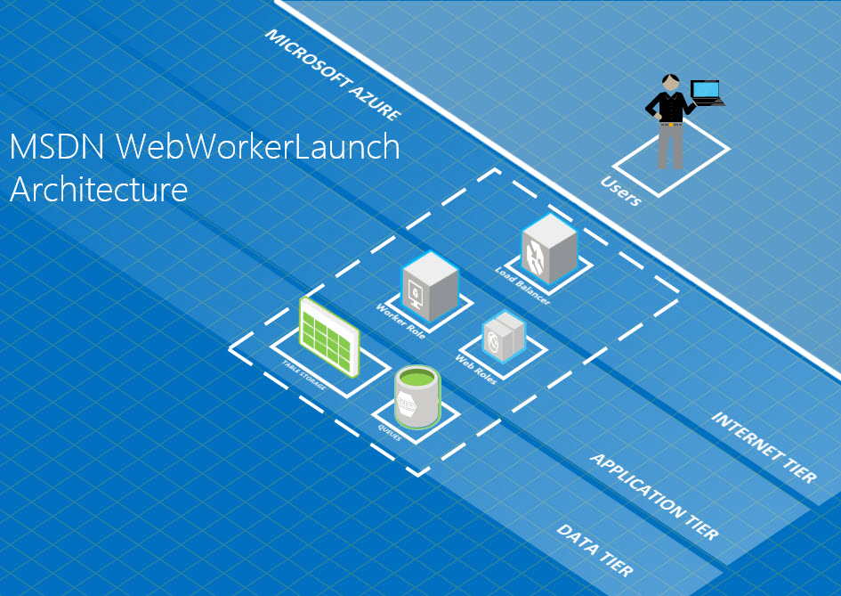
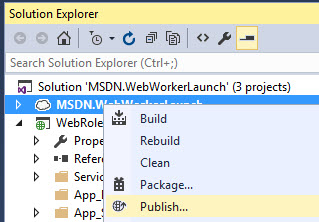

# Azure Web Role and Worker Role Communication using Queues
## Requires
- Visual Studio 2015
## License
- MS-LPL
## Technologies
- C#
- ASP.NET
- Microsoft Azure
- Worker Role
- Windows Azure Cloud Services
- Web Role
- Windows Azure Storage Queues
- Windows Azure Storage Tables
- Azure Cloud Services
## Topics
- Asynchronous Programming
- Microsoft Azure
- Windows Azure Storage
- How to
- backgroundworker
- Cloud
## Updated
- 05/09/2016
## Description

<h1>Introduction</h1>

This uploaded project is a simple illustration of how a worker role could be triggered by a web role via a queue. &nbsp;The project was inspired by the forum post:
<a href="https://social.msdn.microsoft.com/Forums/azure/en-US/a0bf110b-6dde-42fb-8920-c62c058e328b/worker-role-does-not-start-when-deploying-web-application-on-azure-cloud-service?forum=windowsazuredevelopment">
Worker role does not start when deploying web application on azure cloud service</a>.

The scenario here is a website will provide a user the ability to launch a console application on the worker role virtual machine. &nbsp;In this project, an Azure Queue is used to provide a means of triggering the activity on the worker role. &nbsp;In order
 to show that the activity completed, a message is written to an Azure Table. &nbsp;The architecture is shown below:

The project was created using the Visual Studio Cloud Service template and consists of a worker and web role. &nbsp;The web role is MVC and supports two buttons:
<em>Send Message</em> and <em>Clear Message</em>. &nbsp;The site will poll the web server for messages written to an Azure Table. &nbsp;The
<em>Send Message</em>&nbsp;button will cause a message to be written to the queue where the
<em>Clear Message</em>&nbsp;will clear the messages on the page and remove the row in the table.

The worker role repeats the following steps:

<ul>
<li>Reads a message from the queue </li><li>Launches a process on the worker role virtual machine </li><li>Writes the result to the Azure Table </li><li>Deletes the message from the queue </li></ul>

<em>Please note the project is just a sample and is not meant to more to provide inspiration than to show a complete solution. &nbsp;</em>

<h1>Building the Sample</h1>

The project is build using nuget packages so should not require any special steps to get the solution to build.

In order to run the sample project, an Azure Storage and an Azure Cloud Service will need to be created.

The Azure Storage settings will need to be set in the web and worker role. &nbsp;These are hard coded in the methods and can be found by searching for &quot;[key]&quot;. &nbsp;There are four places to update:

&nbsp;

C#

Edit|Remove

csharp

<pre class="csharp">CloudStorageAccount&nbsp;storageAccount&nbsp;=&nbsp;CloudStorageAccount.Parse(&quot;DefaultEndpointsProtocol=https;AccountName=[name];AccountKey=[key]&quot;);</pre>

&nbsp;The project can be then published to a suitable Azure environment:

&nbsp;

Web Role

The three main methods in the controller to highlight are <em>Clear Messages, Get Message,
</em>and <em>Send Message.</em>

<strong><em>Clear Message</em></strong>

<strong><em>&nbsp;</em></strong>

<strong><em>

C#

Edit|Remove

csharp

<pre class="csharp">publicvoid&nbsp;ClearMessages()&nbsp;
{&nbsp;
&nbsp;&nbsp;&nbsp;&nbsp;CloudStorageAccount&nbsp;storageAccount&nbsp;=&nbsp;CloudStorageAccount.Parse(&quot;DefaultEndpointsProtocol=https;AccountName=[name];AccountKey=[key]&quot;);&nbsp;
&nbsp;&nbsp;&nbsp;&nbsp;CloudTableClient&nbsp;tableClient&nbsp;=&nbsp;storageAccount.CreateCloudTableClient();&nbsp;
&nbsp;&nbsp;&nbsp;&nbsp;CloudTable&nbsp;table&nbsp;=&nbsp;tableClient.GetTableReference(&quot;mytable&quot;);&nbsp;
&nbsp;
&nbsp;&nbsp;&nbsp;&nbsp;//&nbsp;Create&nbsp;the&nbsp;table&nbsp;if&nbsp;it&nbsp;doesn't&nbsp;exist.&nbsp;
&nbsp;&nbsp;&nbsp;&nbsp;table.CreateIfNotExists();&nbsp;
&nbsp;
&nbsp;&nbsp;&nbsp;&nbsp;//&nbsp;read&nbsp;the&nbsp;latest&nbsp;messages&nbsp;from&nbsp;the&nbsp;table&nbsp;&nbsp;&nbsp;&nbsp;&nbsp;&nbsp;&nbsp;&nbsp;&nbsp;&nbsp;&nbsp;&nbsp;&nbsp;
&nbsp;&nbsp;&nbsp;&nbsp;TableOperation&nbsp;retrieveOperation&nbsp;=&nbsp;TableOperation.Retrieve&lt;MyMessages&gt;(&quot;Partition0&quot;,&nbsp;&quot;Row0&quot;);&nbsp;
&nbsp;
&nbsp;&nbsp;&nbsp;&nbsp;//&nbsp;Execute&nbsp;the&nbsp;retrieve&nbsp;operation.&nbsp;
&nbsp;&nbsp;&nbsp;&nbsp;TableResult&nbsp;retrievedResult&nbsp;=&nbsp;table.Execute(retrieveOperation);&nbsp;
&nbsp;
&nbsp;&nbsp;&nbsp;&nbsp;if&nbsp;(retrievedResult.Result&nbsp;!=&nbsp;null)&nbsp;
&nbsp;&nbsp;&nbsp;&nbsp;{&nbsp;
&nbsp;&nbsp;&nbsp;&nbsp;&nbsp;&nbsp;&nbsp;&nbsp;TableOperation&nbsp;deleteOperation&nbsp;=&nbsp;TableOperation.Delete((MyMessages)retrievedResult.Result);&nbsp;
&nbsp;
&nbsp;&nbsp;&nbsp;&nbsp;&nbsp;&nbsp;&nbsp;&nbsp;table.Execute(deleteOperation);&nbsp;
&nbsp;&nbsp;&nbsp;&nbsp;}&nbsp;&nbsp;&nbsp;&nbsp;&nbsp;&nbsp;&nbsp;&nbsp;&nbsp;&nbsp;&nbsp;&nbsp;&nbsp;
}</pre>

</em>

<em>Get Message</em>

</strong>

&nbsp;

&nbsp;

C#

Edit|Remove

csharp

<pre class="csharp">public&nbsp;string&nbsp;GetMessage()&nbsp;
{&nbsp;
&nbsp;&nbsp;&nbsp;&nbsp;CloudStorageAccount&nbsp;storageAccount&nbsp;=&nbsp;CloudStorageAccount.Parse(&quot;DefaultEndpointsProtocol=https;AccountName=[name];AccountKey=[key]&quot;);&nbsp;&nbsp;&nbsp;&nbsp;&nbsp;&nbsp;&nbsp;&nbsp;&nbsp;&nbsp;&nbsp;&nbsp;&nbsp;
&nbsp;&nbsp;&nbsp;&nbsp;CloudTableClient&nbsp;tableClient&nbsp;=&nbsp;storageAccount.CreateCloudTableClient();&nbsp;
&nbsp;&nbsp;&nbsp;&nbsp;CloudTable&nbsp;table&nbsp;=&nbsp;tableClient.GetTableReference(&quot;mytable&quot;);&nbsp;
&nbsp;
&nbsp;&nbsp;&nbsp;&nbsp;//&nbsp;Create&nbsp;the&nbsp;table&nbsp;if&nbsp;it&nbsp;doesn't&nbsp;exist.&nbsp;
&nbsp;&nbsp;&nbsp;&nbsp;table.CreateIfNotExists();&nbsp;
&nbsp;
&nbsp;&nbsp;&nbsp;&nbsp;//&nbsp;read&nbsp;the&nbsp;latest&nbsp;messages&nbsp;from&nbsp;the&nbsp;table&nbsp;&nbsp;&nbsp;&nbsp;&nbsp;&nbsp;&nbsp;&nbsp;&nbsp;&nbsp;&nbsp;&nbsp;&nbsp;
&nbsp;&nbsp;&nbsp;&nbsp;TableOperation&nbsp;retrieveOperation&nbsp;=&nbsp;TableOperation.Retrieve&lt;MyMessages&gt;(&quot;Partition0&quot;,&nbsp;&quot;Row0&quot;);&nbsp;
&nbsp;
&nbsp;&nbsp;&nbsp;&nbsp;//&nbsp;Execute&nbsp;the&nbsp;retrieve&nbsp;operation.&nbsp;
&nbsp;&nbsp;&nbsp;&nbsp;TableResult&nbsp;retrievedResult&nbsp;=&nbsp;table.Execute(retrieveOperation);&nbsp;
&nbsp;
&nbsp;&nbsp;&nbsp;&nbsp;if&nbsp;(retrievedResult.Result&nbsp;!=&nbsp;null)&nbsp;
&nbsp;&nbsp;&nbsp;&nbsp;{&nbsp;&nbsp;&nbsp;&nbsp;&nbsp;&nbsp;&nbsp;&nbsp;&nbsp;&nbsp;&nbsp;&nbsp;&nbsp;&nbsp;&nbsp;&nbsp;&nbsp;
&nbsp;&nbsp;&nbsp;&nbsp;&nbsp;&nbsp;&nbsp;&nbsp;return&nbsp;((MyMessages)retrievedResult.Result).Messages;&nbsp;
&nbsp;&nbsp;&nbsp;&nbsp;}&nbsp;
&nbsp;&nbsp;&nbsp;&nbsp;else&nbsp;
&nbsp;&nbsp;&nbsp;&nbsp;&nbsp;&nbsp;&nbsp;&nbsp;return&nbsp;&quot;Failed&nbsp;to&nbsp;retrieve&nbsp;the&nbsp;messages&quot;;&nbsp;
}</pre>

<strong><em>Send Message</em></strong>

&nbsp;

<h1>

C#

Edit|Remove

csharp

<pre class="csharp">public&nbsp;void&nbsp;SendMessage()&nbsp;
{&nbsp;
&nbsp;&nbsp;&nbsp;&nbsp;CloudStorageAccount&nbsp;storageAccount&nbsp;=&nbsp;CloudStorageAccount.Parse(&quot;DefaultEndpointsProtocol=https;AccountName=[name];AccountKey=[key]&quot;);&nbsp;
&nbsp;&nbsp;&nbsp;&nbsp;CloudQueueClient&nbsp;queueClient&nbsp;=&nbsp;storageAccount.CreateCloudQueueClient();&nbsp;
&nbsp;&nbsp;&nbsp;&nbsp;CloudQueue&nbsp;queue&nbsp;=&nbsp;queueClient.GetQueueReference(&quot;myqueue&quot;);&nbsp;&nbsp;&nbsp;&nbsp;&nbsp;&nbsp;&nbsp;&nbsp;&nbsp;&nbsp;&nbsp;&nbsp;&nbsp;
&nbsp;
&nbsp;&nbsp;&nbsp;&nbsp;//&nbsp;Create&nbsp;the&nbsp;queue&nbsp;if&nbsp;it&nbsp;doesn't&nbsp;already&nbsp;exist&nbsp;
&nbsp;&nbsp;&nbsp;&nbsp;queue.CreateIfNotExists();&nbsp;
&nbsp;
&nbsp;&nbsp;&nbsp;&nbsp;//&nbsp;send&nbsp;a&nbsp;message&nbsp;to&nbsp;the&nbsp;queue&nbsp;
&nbsp;&nbsp;&nbsp;&nbsp;CloudQueueMessage&nbsp;message&nbsp;=&nbsp;new&nbsp;CloudQueueMessage(string.Format(&quot;Sending&nbsp;at&nbsp;{0}&nbsp;from&nbsp;{1}&quot;,&nbsp;DateTime.Now,&nbsp;RoleEnvironment.));&nbsp;
&nbsp;&nbsp;&nbsp;&nbsp;queue.AddMessage(message);&nbsp;
}</pre>

&nbsp;

Worker Role</h1>

In the worker role's RunAsync method, the following steps are performed:

Setup the storage account table and queue clients:

&nbsp;

C#

Edit|Remove

csharp

<pre class="js">CloudStorageAccount&nbsp;storageAccount&nbsp;=&nbsp;CloudStorageAccount.Parse(&quot;DefaultEndpointsProtocol=https;AccountName=[name];AccountKey=[key]&quot;);&nbsp;
CloudQueueClient&nbsp;queueClient&nbsp;=&nbsp;storageAccount.CreateCloudQueueClient();&nbsp;
CloudQueue&nbsp;queue&nbsp;=&nbsp;queueClient.GetQueueReference(&quot;myqueue&quot;);&nbsp;
CloudTableClient&nbsp;tableClient&nbsp;=&nbsp;storageAccount.CreateCloudTableClient();&nbsp;
CloudTable&nbsp;table&nbsp;=&nbsp;tableClient.GetTableReference(&quot;mytable&quot;);</pre>

Until a cancellation request is recieved, get the next message from the queue:

C#

Edit|Remove

csharp

<pre class="csharp">while&nbsp;(!cancellationToken.IsCancellationRequested)&nbsp;
{&nbsp;
&nbsp;&nbsp;&nbsp;&nbsp;//&nbsp;Get&nbsp;the&nbsp;next&nbsp;message&nbsp;
&nbsp;&nbsp;&nbsp;&nbsp;CloudQueueMessage&nbsp;retrievedMessage&nbsp;=&nbsp;queue.GetMessage();&nbsp;
&nbsp;
&nbsp;&nbsp;&nbsp;&nbsp;if&nbsp;(retrievedMessage&nbsp;!=&nbsp;null)&nbsp;
&nbsp;&nbsp;&nbsp;&nbsp;{</pre>

Launch a process and read the result (messages is a StringBuilder):

C#

Edit|Remove

csharp

<pre class="csharp">var&nbsp;filename&nbsp;=&nbsp;RoleEnvironment.IsEmulated&nbsp;
&nbsp;&nbsp;&nbsp;&nbsp;&nbsp;&nbsp;&nbsp;&nbsp;&nbsp;&nbsp;&nbsp;&nbsp;&nbsp;&nbsp;&nbsp;&nbsp;?&nbsp;@&quot;c:\windows\system32\cmd.exe&quot;&nbsp;
&nbsp;&nbsp;&nbsp;&nbsp;&nbsp;&nbsp;&nbsp;&nbsp;&nbsp;&nbsp;&nbsp;&nbsp;&nbsp;&nbsp;&nbsp;&nbsp;:&nbsp;@&quot;d:\windows\system32\cmd.exe&quot;;&nbsp;
&nbsp;
var&nbsp;processStartInfo&nbsp;=&nbsp;new&nbsp;ProcessStartInfo()&nbsp;
{&nbsp;
&nbsp;&nbsp;&nbsp;&nbsp;Arguments&nbsp;=&nbsp;&quot;/c&nbsp;echo&nbsp;\&quot;test&nbsp;message&nbsp;from&nbsp;a&nbsp;process&nbsp;on&nbsp;the&nbsp;worker&nbsp;vm\&quot;&quot;,&nbsp;
&nbsp;&nbsp;&nbsp;&nbsp;FileName&nbsp;=&nbsp;filename,&nbsp;
&nbsp;&nbsp;&nbsp;&nbsp;RedirectStandardOutput&nbsp;=&nbsp;true,&nbsp;
&nbsp;&nbsp;&nbsp;&nbsp;UseShellExecute&nbsp;=&nbsp;false&nbsp;
};&nbsp;
&nbsp;
var&nbsp;process&nbsp;=&nbsp;Process.Start(processStartInfo);&nbsp;
&nbsp;
using&nbsp;(var&nbsp;streamReader&nbsp;=&nbsp;new&nbsp;StreamReader(process.StandardOutput.BaseStream))&nbsp;
{&nbsp;
&nbsp;&nbsp;&nbsp;&nbsp;messages.AppendLine(streamReader.ReadToEnd()&nbsp;&#43;&nbsp;&quot;&nbsp;at&nbsp;&quot;&nbsp;&#43;&nbsp;DateTime.Now.ToString()&nbsp;&#43;&quot;&nbsp;on&nbsp;&quot;&nbsp;&#43;&nbsp;RoleEnvironment.CurrentRoleInstance);&nbsp;
}</pre>

The result is then saved to an Azure Table and the Azure Queue messages is deleted:

C#

Edit|Remove

csharp

<pre class="csharp">//&nbsp;read&nbsp;the&nbsp;latest&nbsp;messages&nbsp;from&nbsp;the&nbsp;table&nbsp;&nbsp;&nbsp;&nbsp;&nbsp;&nbsp;&nbsp;&nbsp;&nbsp;&nbsp;&nbsp;&nbsp;&nbsp;
TableOperation&nbsp;retrieveOperation&nbsp;=&nbsp;TableOperation.Retrieve&lt;MyMessages&gt;(&quot;Partition0&quot;,&nbsp;&quot;Row0&quot;);&nbsp;
&nbsp;
//&nbsp;Execute&nbsp;the&nbsp;retrieve&nbsp;operation.&nbsp;
TableResult&nbsp;retrievedResult&nbsp;=&nbsp;table.Execute(retrieveOperation);&nbsp;
&nbsp;
MyMessages&nbsp;myMessages&nbsp;=&nbsp;retrievedResult.Result&nbsp;==&nbsp;null&nbsp;
&nbsp;&nbsp;&nbsp;&nbsp;&nbsp;&nbsp;&nbsp;&nbsp;&nbsp;&nbsp;&nbsp;&nbsp;&nbsp;&nbsp;&nbsp;&nbsp;&nbsp;&nbsp;&nbsp;&nbsp;&nbsp;&nbsp;&nbsp;&nbsp;?&nbsp;new&nbsp;MyMessages&nbsp;{&nbsp;PartitionKey&nbsp;=&nbsp;&quot;Partition0&quot;,&nbsp;RowKey&nbsp;=&nbsp;&quot;Row0&quot;,&nbsp;LastUpdated&nbsp;=&nbsp;DateTime.Now&nbsp;}&nbsp;
&nbsp;&nbsp;&nbsp;&nbsp;&nbsp;&nbsp;&nbsp;&nbsp;&nbsp;&nbsp;&nbsp;&nbsp;&nbsp;&nbsp;&nbsp;&nbsp;&nbsp;&nbsp;&nbsp;&nbsp;&nbsp;&nbsp;&nbsp;&nbsp;:&nbsp;(MyMessages)retrievedResult.Result;&nbsp;
&nbsp;
&nbsp;
messages.AppendLine(myMessages.Messages);&nbsp;
&nbsp;
...&nbsp;
&nbsp;
//&nbsp;replace&nbsp;the&nbsp;messages&nbsp;
myMessages.Messages&nbsp;=&nbsp;messages.ToString();&nbsp;
myMessages.LastUpdated&nbsp;=&nbsp;DateTime.Now;&nbsp;
&nbsp;
//&nbsp;Create&nbsp;the&nbsp;Replace&nbsp;TableOperation.&nbsp;
TableOperation&nbsp;replaceOperation&nbsp;=&nbsp;TableOperation.InsertOrReplace(myMessages);&nbsp;
&nbsp;
//&nbsp;Execute&nbsp;the&nbsp;operation.&nbsp;
var&nbsp;result&nbsp;=&nbsp;table.Execute(replaceOperation);&nbsp;
&nbsp;
//Process&nbsp;the&nbsp;message&nbsp;in&nbsp;less&nbsp;than&nbsp;30&nbsp;seconds,&nbsp;and&nbsp;then&nbsp;delete&nbsp;the&nbsp;message&nbsp;
queue.DeleteMessage(retrievedMessage);</pre>

<h1 class="endscriptcode">Where to from here?</h1>

The project is just a rough illustration and is provided here as an illustration of how simple interconnecting roles via a queue is. &nbsp;As with many
<em>hello world</em>&nbsp;type examples, there are many pitfalls once it is adapted to the real world. &nbsp;

Please comment if a particular aspect should be expanded upon. &nbsp;Hope it save someone some effort!

&nbsp;

