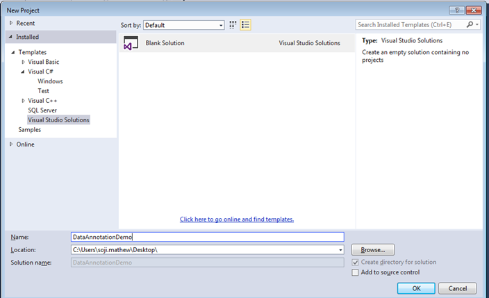
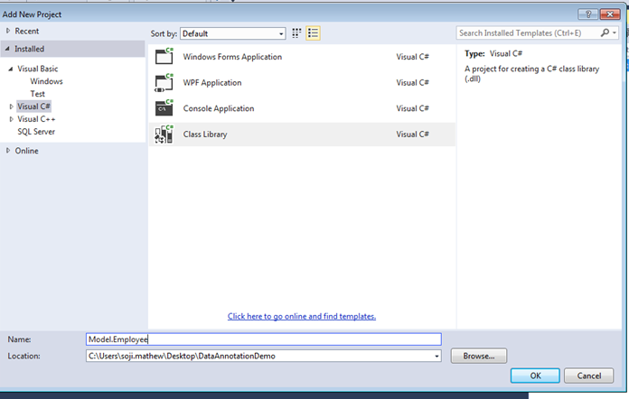
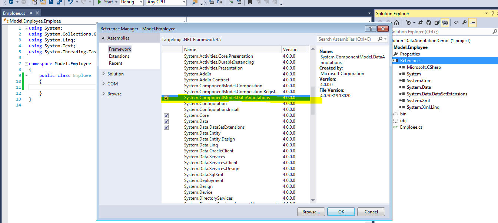
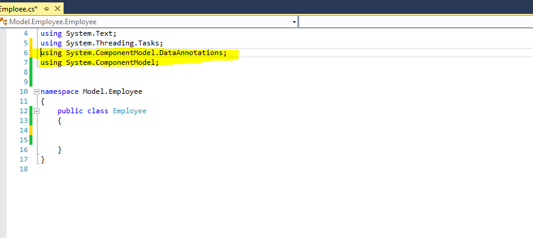
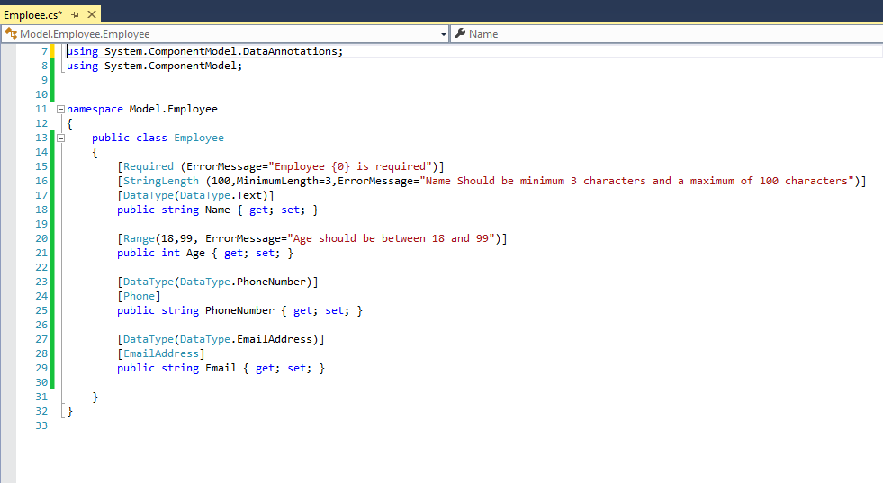
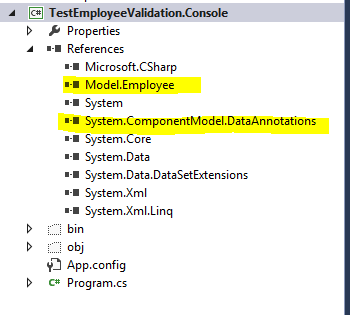
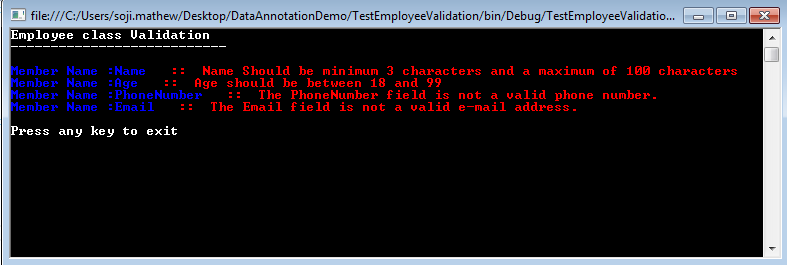

# Basic Introduction to Data Annotation in .Net Framework
## License
- Apache License, Version 2.0
## Technologies
- C#
- ASP.NET
- .NET Framework
- .NET Framework 4.0
- Data Annotation
- System.ComponentModel.DataAnnotations
## Topics
- C#
- .NET 4
- C# Language Features
- Data Annotation
## Updated
- 10/09/2014
## Description

<h1>Introduction</h1>

Data Annotation in .Net framework means add extra meaning to the data by adding attribute tags. The advantage of using Data Annotation feature is that by applying Data Attributes we can manage the data definition in a single place and do not need re-write
 the same rules in multiple places.

The Data Annotation feature got introduced in.Net 3.5 and the <strong><em><a class="libraryLink" href="https://msdn.microsoft.com/en-US/library/System.ComponentModel.DataAnnotations.aspx" target="_blank" title="Auto generated link to System.ComponentModel.DataAnnotations">System.ComponentModel.DataAnnotations</a></em></strong> namespace contains the classes that are used as data attributes.

The Data Annotation attributes falls into three categories:&ndash;

(1)<strong>Validation Attributes</strong>: Used to enforce validation rules.

(2)<strong>Display Attributes</strong>: Used to specify how data from a class /member is displayed in the UI.

(3) <strong>Modelling Attributes</strong>: Used to specify the intended use of class member and the relationship between classes.

Here in this article I will be walking through the basic steps involved in implementing the Data Annotation feature. I am using Visual Studio Express 2013 for Desktop as my development environment targeting .Net framework 4.5.

&nbsp;

First we will be creating our Data class, let call it <strong><em>Employee</em></strong>. The requirement says Employee class should have properties like Name, Age, Email and Phone Number with the below criteria.

<strong>Name </strong>cannot be blank and should be of 3 characters minimum and 100 maximum characters.

<strong>Age </strong>should be between 18 and 99.

<strong>Email and Phone number </strong>should hold the respective data type validations<strong>.</strong>

<strong>&nbsp;</strong>

<strong>Note: </strong>This is only a sample intended to demonstrate the .Net Data Annotation feature. I will be using some of the basic Data Annotation attributes and for more details on data annotation attribute please refer Data Annotation documentation.

To implement the above requirement we need to code in the UI layer to accommodate/validate the above criteria&rsquo;s. The disadvantage is that if are using the Employee class in multiple places we need to re-write the validation logic creating duplicate
 code which is not a good practice.

Here comes the beauty of .Net Data Annotation feature. We add Data Annotation attributes to the Employee class properties and the .Net frameworks takes care of the validation/display for us .We can add custom error messages as part of Data Annotation attribute.

<h1>Building the Sample</h1>

 

<strong>Step1</strong>

Create an empty solution as below. This will help us to add more Projects later.

&nbsp;

<strong>Step2</strong>

Next create a class library project to hold Employee class as below to the Solution .

&nbsp;

Add a class named <strong>Employee.cs</strong> and add reference to <strong><em><a class="libraryLink" href="https://msdn.microsoft.com/en-US/library/System.ComponentModel.DataAnnotations.aspx" target="_blank" title="Auto generated link to System.ComponentModel.DataAnnotations">System.ComponentModel.DataAnnotations</a>
</em></strong>assembly to utilize the Data Annotation feature as below.

&nbsp;

&nbsp;

&nbsp;

<strong>Step3</strong>

To allow the usage of types in <strong><em><a class="libraryLink" href="https://msdn.microsoft.com/en-US/library/System.ComponentModel.DataAnnotations.aspx" target="_blank" title="Auto generated link to System.ComponentModel.DataAnnotations">System.ComponentModel.DataAnnotations</a> add the below code to Employee.cs .</em></strong>

&nbsp;

C#

Edit|Remove

csharp

<pre class="csharp">using&nbsp;<a class="libraryLink" href="https://msdn.microsoft.com/en-US/library/System.ComponentModel.DataAnnotations.aspx" target="_blank" title="Auto generated link to System.ComponentModel.DataAnnotations">System.ComponentModel.DataAnnotations</a>;</pre>

&nbsp;

&nbsp;

<strong><em>&nbsp;</em></strong>

<strong><em> 
</em></strong>

<strong><em> 
</em></strong>

<strong><em> 
</em></strong>

&nbsp;

<strong>Step4</strong>

Add the below properties to the Employee class with the respective Data Annotation attributes.

&nbsp;

&nbsp;

C#

Edit|Remove

csharp

<pre class="csharp">publicclass&nbsp;Employee&nbsp;
&nbsp;&nbsp;&nbsp;&nbsp;{&nbsp;&nbsp;&nbsp;&nbsp;
&nbsp;&nbsp;&nbsp;&nbsp;&nbsp;&nbsp;&nbsp;&nbsp;[Required&nbsp;(ErrorMessage=&quot;Employee&nbsp;{0}&nbsp;is&nbsp;required&quot;)]&nbsp;
&nbsp;&nbsp;&nbsp;&nbsp;&nbsp;&nbsp;&nbsp;&nbsp;[StringLength&nbsp;(100,MinimumLength=3,ErrorMessage=&quot;Name&nbsp;Should&nbsp;be&nbsp;minimum&nbsp;3&nbsp;characters&nbsp;and&nbsp;a&nbsp;maximum&nbsp;of&nbsp;100&nbsp;characters&quot;)]&nbsp;
&nbsp;&nbsp;&nbsp;&nbsp;&nbsp;&nbsp;&nbsp;&nbsp;[DataType(DataType.Text)]&nbsp;
&nbsp;&nbsp;&nbsp;&nbsp;&nbsp;&nbsp;&nbsp;&nbsp;publicstring&nbsp;Name&nbsp;{&nbsp;get;&nbsp;set;&nbsp;}&nbsp;
&nbsp;
&nbsp;&nbsp;&nbsp;&nbsp;&nbsp;&nbsp;&nbsp;&nbsp;[Range(18,99,&nbsp;ErrorMessage=&quot;Age&nbsp;should&nbsp;be&nbsp;between&nbsp;18&nbsp;and&nbsp;99&quot;)]&nbsp;
&nbsp;&nbsp;&nbsp;&nbsp;&nbsp;&nbsp;&nbsp;&nbsp;publicint&nbsp;Age&nbsp;{&nbsp;get;&nbsp;set;&nbsp;}&nbsp;
&nbsp;
&nbsp;&nbsp;&nbsp;&nbsp;&nbsp;&nbsp;&nbsp;&nbsp;[DataType(DataType.PhoneNumber)]&nbsp;
&nbsp;&nbsp;&nbsp;&nbsp;&nbsp;&nbsp;&nbsp;&nbsp;[Phone]&nbsp;
&nbsp;&nbsp;&nbsp;&nbsp;&nbsp;&nbsp;&nbsp;&nbsp;Public&nbsp;string&nbsp;PhoneNumber&nbsp;{&nbsp;get;&nbsp;set;&nbsp;}&nbsp;
&nbsp;
&nbsp;&nbsp;&nbsp;&nbsp;&nbsp;&nbsp;&nbsp;&nbsp;[DataType(DataType.EmailAddress)]&nbsp;
&nbsp;&nbsp;&nbsp;&nbsp;&nbsp;&nbsp;&nbsp;&nbsp;[EmailAddress]&nbsp;
&nbsp;&nbsp;&nbsp;&nbsp;&nbsp;&nbsp;&nbsp;&nbsp;Public&nbsp;string&nbsp;Email&nbsp;{&nbsp;get;&nbsp;set;&nbsp;}&nbsp;
&nbsp;&nbsp;&nbsp;&nbsp;&nbsp;&nbsp;
&nbsp;&nbsp;&nbsp;&nbsp;}&nbsp;
</pre>

<strong>Step5 </strong>

<strong>Testing the Employee class Data Validation using a Console Application.</strong>

Create a new Console Application project and add reference to <strong><em>Employee</em></strong> class library and
<strong><em><a class="libraryLink" href="https://msdn.microsoft.com/en-US/library/System.ComponentModel.DataAnnotations.aspx" target="_blank" title="Auto generated link to System.ComponentModel.DataAnnotations">System.ComponentModel.DataAnnotations</a> </em></strong><em>assembly.</em>

Our Solution explorer looks as below.

&nbsp;

&nbsp;

<strong>Step6</strong>

To allow the usage of types in <strong><em><a class="libraryLink" href="https://msdn.microsoft.com/en-US/library/System.ComponentModel.DataAnnotations.aspx" target="_blank" title="Auto generated link to System.ComponentModel.DataAnnotations">System.ComponentModel.DataAnnotations</a>
</em></strong>and <strong><em>Employee </em></strong>class add the below code to <strong>
<em>Program.cs.</em></strong>

&nbsp;

&nbsp;

C#

Edit|Remove

csharp

<pre class="csharp">using&nbsp;Model.Employee;&nbsp;
using&nbsp;<a class="libraryLink" href="https://msdn.microsoft.com/en-US/library/System.ComponentModel.DataAnnotations.aspx" target="_blank" title="Auto generated link to System.ComponentModel.DataAnnotations">System.ComponentModel.DataAnnotations</a>;&nbsp;
&nbsp;
namespace&nbsp;TestEmployeeValidation&nbsp;
{&nbsp;
&nbsp;&nbsp;&nbsp;&nbsp;class&nbsp;Program&nbsp;
&nbsp;&nbsp;&nbsp;&nbsp;{&nbsp;
&nbsp;&nbsp;&nbsp;&nbsp;&nbsp;&nbsp;&nbsp;&nbsp;static&nbsp;void&nbsp;Main(string[]&nbsp;args)&nbsp;
&nbsp;&nbsp;&nbsp;&nbsp;&nbsp;&nbsp;&nbsp;&nbsp;{&nbsp;
&nbsp;&nbsp;&nbsp;&nbsp;&nbsp;&nbsp;&nbsp;&nbsp;&nbsp;&nbsp;&nbsp;&nbsp;Console.ForegroundColor&nbsp;=&nbsp;ConsoleColor.White;&nbsp;
&nbsp;&nbsp;&nbsp;&nbsp;&nbsp;&nbsp;&nbsp;&nbsp;&nbsp;&nbsp;&nbsp;&nbsp;Console.WriteLine(&quot;Employee&nbsp;class&nbsp;Validation&quot;);&nbsp;
&nbsp;&nbsp;&nbsp;&nbsp;&nbsp;&nbsp;&nbsp;&nbsp;&nbsp;&nbsp;&nbsp;&nbsp;Console.WriteLine(&quot;---------------------------\n&quot;);&nbsp;
&nbsp;
&nbsp;&nbsp;&nbsp;&nbsp;&nbsp;&nbsp;&nbsp;&nbsp;&nbsp;&nbsp;&nbsp;&nbsp;Employee&nbsp;objEmployee&nbsp;=&nbsp;new&nbsp;Employee&nbsp;();&nbsp;
&nbsp;&nbsp;&nbsp;&nbsp;&nbsp;&nbsp;&nbsp;&nbsp;&nbsp;&nbsp;&nbsp;&nbsp;objEmployee.Name&nbsp;=&nbsp;&quot;sa&quot;;&nbsp;
&nbsp;&nbsp;&nbsp;&nbsp;&nbsp;&nbsp;&nbsp;&nbsp;&nbsp;&nbsp;&nbsp;&nbsp;objEmployee.Age&nbsp;=&nbsp;12;&nbsp;
&nbsp;&nbsp;&nbsp;&nbsp;&nbsp;&nbsp;&nbsp;&nbsp;&nbsp;&nbsp;&nbsp;&nbsp;objEmployee.PhoneNumber&nbsp;=&nbsp;&quot;1234as&quot;;&nbsp;
&nbsp;&nbsp;&nbsp;&nbsp;&nbsp;&nbsp;&nbsp;&nbsp;&nbsp;&nbsp;&nbsp;&nbsp;objEmployee.Email&nbsp;=&nbsp;&quot;test@re&quot;;&nbsp;
&nbsp;
&nbsp;
&nbsp;&nbsp;&nbsp;&nbsp;&nbsp;&nbsp;&nbsp;&nbsp;&nbsp;&nbsp;&nbsp;&nbsp;ValidationContext&nbsp;context&nbsp;=&nbsp;new&nbsp;ValidationContext(objEmployee,&nbsp;null,&nbsp;null);&nbsp;
&nbsp;&nbsp;&nbsp;&nbsp;&nbsp;&nbsp;&nbsp;&nbsp;&nbsp;&nbsp;&nbsp;&nbsp;List&lt;ValidationResult&gt;&nbsp;results&nbsp;=&nbsp;new&nbsp;List&lt;ValidationResult&gt;();&nbsp;
&nbsp;&nbsp;&nbsp;&nbsp;&nbsp;&nbsp;&nbsp;&nbsp;&nbsp;&nbsp;&nbsp;&nbsp;bool&nbsp;valid&nbsp;=&nbsp;Validator.TryValidateObject(objEmployee,&nbsp;context,&nbsp;results,&nbsp;true);&nbsp;
&nbsp;
&nbsp;&nbsp;&nbsp;&nbsp;&nbsp;&nbsp;&nbsp;&nbsp;&nbsp;&nbsp;&nbsp;&nbsp;if&nbsp;(!valid)&nbsp;
&nbsp;&nbsp;&nbsp;&nbsp;&nbsp;&nbsp;&nbsp;&nbsp;&nbsp;&nbsp;&nbsp;&nbsp;{&nbsp;
&nbsp;&nbsp;&nbsp;&nbsp;&nbsp;&nbsp;&nbsp;&nbsp;&nbsp;&nbsp;&nbsp;&nbsp;&nbsp;&nbsp;&nbsp;&nbsp;foreach&nbsp;(ValidationResult&nbsp;vr&nbsp;in&nbsp;results)&nbsp;
&nbsp;&nbsp;&nbsp;&nbsp;&nbsp;&nbsp;&nbsp;&nbsp;&nbsp;&nbsp;&nbsp;&nbsp;&nbsp;&nbsp;&nbsp;&nbsp;{&nbsp;
&nbsp;&nbsp;&nbsp;&nbsp;&nbsp;&nbsp;&nbsp;&nbsp;&nbsp;&nbsp;&nbsp;&nbsp;&nbsp;&nbsp;&nbsp;&nbsp;&nbsp;&nbsp;&nbsp;&nbsp;Console.ForegroundColor&nbsp;=&nbsp;ConsoleColor.Blue;&nbsp;
&nbsp;&nbsp;&nbsp;&nbsp;&nbsp;&nbsp;&nbsp;&nbsp;&nbsp;&nbsp;&nbsp;&nbsp;&nbsp;&nbsp;&nbsp;&nbsp;&nbsp;&nbsp;&nbsp;&nbsp;Console.Write(&quot;Member&nbsp;Name&nbsp;:{0}&quot;,&nbsp;vr.MemberNames.First());&nbsp;
&nbsp;&nbsp;&nbsp;&nbsp;&nbsp;&nbsp;&nbsp;&nbsp;&nbsp;&nbsp;&nbsp;&nbsp;&nbsp;&nbsp;&nbsp;&nbsp;&nbsp;&nbsp;&nbsp;&nbsp;Console.ForegroundColor&nbsp;=&nbsp;ConsoleColor.Red;&nbsp;
&nbsp;&nbsp;&nbsp;&nbsp;&nbsp;&nbsp;&nbsp;&nbsp;&nbsp;&nbsp;&nbsp;&nbsp;&nbsp;&nbsp;&nbsp;&nbsp;&nbsp;&nbsp;&nbsp;&nbsp;Console.Write(&quot;&nbsp;&nbsp;&nbsp;::&nbsp;&nbsp;{0}{1}&quot;,&nbsp;vr.ErrorMessage,&nbsp;Environment.NewLine);&nbsp;
&nbsp;
&nbsp;&nbsp;&nbsp;&nbsp;&nbsp;&nbsp;&nbsp;&nbsp;&nbsp;&nbsp;&nbsp;&nbsp;&nbsp;&nbsp;&nbsp;&nbsp;}&nbsp;
&nbsp;
&nbsp;&nbsp;&nbsp;&nbsp;&nbsp;&nbsp;&nbsp;&nbsp;&nbsp;&nbsp;&nbsp;&nbsp;}&nbsp;
&nbsp;
&nbsp;&nbsp;&nbsp;&nbsp;&nbsp;&nbsp;&nbsp;&nbsp;&nbsp;&nbsp;&nbsp;&nbsp;Console.ForegroundColor&nbsp;=&nbsp;ConsoleColor.White;&nbsp;
&nbsp;&nbsp;&nbsp;&nbsp;&nbsp;&nbsp;&nbsp;&nbsp;&nbsp;&nbsp;&nbsp;&nbsp;Console.WriteLine(&quot;\nPress&nbsp;any&nbsp;key&nbsp;to&nbsp;exit&quot;);&nbsp;
&nbsp;&nbsp;&nbsp;&nbsp;&nbsp;&nbsp;&nbsp;&nbsp;&nbsp;&nbsp;&nbsp;&nbsp;Console.ReadKey();&nbsp;
&nbsp;&nbsp;&nbsp;&nbsp;&nbsp;&nbsp;&nbsp;&nbsp;}&nbsp;
&nbsp;&nbsp;&nbsp;&nbsp;}&nbsp;
}&nbsp;
</pre>

&nbsp;Hit F5 <em>(or whatever you have configured your debug key in Visual Studio)
</em>to validate <strong>Employee</strong> class.<em> </em>

Now we can see the validation details as below in the Console Window displaying Validation errors based on the Data Annotation attributes added to Employee class.

&nbsp;

Here the advantage of using Data Annotation attributes is that now if we want to reuse the Employee class in an ASP.Net MVC application or Windows Forms Application we can still use the same validation without writing any extra piece of Validation code.

