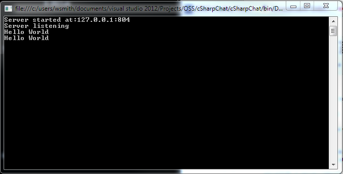

# Basic WinSock Sockets Programming with C# and .NET
## Requires
- Visual Studio 2012
## License
- Apache License, Version 2.0
## Technologies
- C#
- Sockets
- System.Net Namespace
- TCP/IP
- system.net.sockets
- Winsock
## Topics
- Sockets
- Networking
- Network Programming
- TCP/IP Client/Server
- Winsock
- client server programming
## Updated
- 01/07/2014
## Description

<h1>Introduction</h1>

<em>Have you ever wondered how your web browser connects to a website? &nbsp;Or how that IM client on your phone works? &nbsp;The answer is sockets. &nbsp;Sockets are a very powerful way to connect computers, and to exchange any sort of information that
 you would like between them using a network like the Internet. &nbsp;You can even use sockets to control a computer remotely. This example will show you the basics of how sockets work, and will introduce you to <a class="libraryLink" href="http://msdn.microsoft.com/en-US/library/System.Net.Sockets.aspx" target="_blank" title="Auto generated link to System.Net.Sockets">System.Net.Sockets</a>, a Microsoft library for implementing
 sockets on the .NET platform.</em>

<h1>Description</h1>

A long time ago, when most servers were based on Unix, and the Internet didn't really exist, AT&amp;T needed a way to communicate between computers. &nbsp;So they invented an API called Sockets and it became part of the Unix operating system. &nbsp;Later,
 Microsoft developed a similar API called Winsock, and it has shipped with every version of Windows ever (well almost).

Sockets allows two computers to exchange data using a connection that they both control. &nbsp;One computer is called the client, and the other is called the server. &nbsp;The server sets up a socket and listens for a client computer to connect. &nbsp;The
 client connects to the server at a well known address (usually an IP address) and a port that has a number (like port 80 for web servers).

In this sample, we will set up a server on our local computer, and we will connect to it from a client that is also on our local computer. &nbsp;To begin, we will define some basic socket components that we need to make the client and server sockets function.

C#

Edit|Remove

csharp

<pre class="csharp">using&nbsp;<a class="libraryLink" href="http://msdn.microsoft.com/en-US/library/System.Net.aspx" target="_blank" title="Auto generated link to System.Net">System.Net</a>;&nbsp;
using&nbsp;<a class="libraryLink" href="http://msdn.microsoft.com/en-US/library/System.Net.Sockets.aspx" target="_blank" title="Auto generated link to System.Net.Sockets">System.Net.Sockets</a>;&nbsp;
&nbsp;
namespace&nbsp;cSharpChat&nbsp;
{&nbsp;
&nbsp;&nbsp;&nbsp;&nbsp;public&nbsp;class&nbsp;OSCoreServer&nbsp;
&nbsp;&nbsp;&nbsp;&nbsp;{&nbsp;
&nbsp;&nbsp;&nbsp;&nbsp;&nbsp;&nbsp;&nbsp;&nbsp;const&nbsp;string&nbsp;DEFAULT_SERVER&nbsp;=&nbsp;&quot;localhost&quot;;&nbsp;
&nbsp;&nbsp;&nbsp;&nbsp;&nbsp;&nbsp;&nbsp;&nbsp;const&nbsp;int&nbsp;DEFAULT_PORT&nbsp;=&nbsp;804;&nbsp;
&nbsp;
&nbsp;&nbsp;&nbsp;&nbsp;&nbsp;&nbsp;&nbsp;&nbsp;//Server&nbsp;socket&nbsp;stuff&nbsp;
&nbsp;&nbsp;&nbsp;&nbsp;&nbsp;&nbsp;&nbsp;&nbsp;System.Net.Sockets.Socket&nbsp;serverSocket;&nbsp;
&nbsp;&nbsp;&nbsp;&nbsp;&nbsp;&nbsp;&nbsp;&nbsp;System.Net.Sockets.SocketInformation&nbsp;serverSocketInfo;&nbsp;
&nbsp;
&nbsp;&nbsp;&nbsp;&nbsp;&nbsp;&nbsp;&nbsp;&nbsp;//Client&nbsp;socket&nbsp;stuff&nbsp;
&nbsp;&nbsp;&nbsp;&nbsp;&nbsp;&nbsp;&nbsp;&nbsp;System.Net.Sockets.Socket&nbsp;clientSocket;&nbsp;
&nbsp;&nbsp;&nbsp;&nbsp;&nbsp;&nbsp;&nbsp;&nbsp;System.Net.Sockets.SocketInformation&nbsp;clientSocketInfo;&nbsp;
&nbsp;
.........</pre>

In the above code snippet, I have added two using statements to my code so that I can access the <a class="libraryLink" href="http://msdn.microsoft.com/en-US/library/System.Net.Sockets.aspx" target="_blank" title="Auto generated link to System.Net.Sockets">System.Net.Sockets</a> API in the Windows .NET framework. &nbsp;Then, within a namespace that I made up, I have added a class that will represent both my client
 and server code. &nbsp;I called it OSCoreServer. &nbsp;In that class, I have defined a constant that represents the name of my default server, and the default port to connect to that server. &nbsp;Finally, I have defined a server socket, and a structure that
 holds information about that socket, and a client socket with a similar information structure.

The first thing that this class will need to do is to start up a server socket that can listen for clients. &nbsp;We are going to start our server up on the localhost (your local computer) at port 804. &nbsp;We could use any port, but I happen to know that
 port 804 is unoccupied by other servers that might be running on your computer, so we will use this one. &nbsp;Here is the Startup method.

&nbsp;

C#

Edit|Remove

csharp

<pre class="csharp">&nbsp;&nbsp;&nbsp;&nbsp;&nbsp;&nbsp;&nbsp;public&nbsp;string&nbsp;Startup()&nbsp;
&nbsp;&nbsp;&nbsp;&nbsp;&nbsp;&nbsp;&nbsp;&nbsp;{&nbsp;
&nbsp;&nbsp;&nbsp;&nbsp;&nbsp;&nbsp;&nbsp;&nbsp;&nbsp;&nbsp;&nbsp;&nbsp;//&nbsp;The&nbsp;chat&nbsp;server&nbsp;always&nbsp;starts&nbsp;up&nbsp;on&nbsp;the&nbsp;localhost,&nbsp;using&nbsp;the&nbsp;default&nbsp;port&nbsp;
&nbsp;&nbsp;&nbsp;&nbsp;&nbsp;&nbsp;&nbsp;&nbsp;&nbsp;&nbsp;&nbsp;&nbsp;IPHostEntry&nbsp;hostInfo&nbsp;=&nbsp;Dns.GetHostByName(DEFAULT_SERVER);&nbsp;
&nbsp;&nbsp;&nbsp;&nbsp;&nbsp;&nbsp;&nbsp;&nbsp;&nbsp;&nbsp;&nbsp;&nbsp;IPAddress&nbsp;serverAddr&nbsp;=&nbsp;hostInfo.AddressList[0];&nbsp;
&nbsp;&nbsp;&nbsp;&nbsp;&nbsp;&nbsp;&nbsp;&nbsp;&nbsp;&nbsp;&nbsp;&nbsp;var&nbsp;serverEndPoint&nbsp;=&nbsp;new&nbsp;IPEndPoint(serverAddr,&nbsp;DEFAULT_PORT);&nbsp;
&nbsp;&nbsp;&nbsp;&nbsp;&nbsp;&nbsp;&nbsp;&nbsp;&nbsp;&nbsp;&nbsp;&nbsp;&nbsp;
&nbsp;&nbsp;&nbsp;&nbsp;&nbsp;&nbsp;&nbsp;&nbsp;&nbsp;&nbsp;&nbsp;&nbsp;//&nbsp;Create&nbsp;a&nbsp;listener&nbsp;socket&nbsp;and&nbsp;bind&nbsp;it&nbsp;to&nbsp;the&nbsp;endpoint&nbsp;
&nbsp;&nbsp;&nbsp;&nbsp;&nbsp;&nbsp;&nbsp;&nbsp;&nbsp;&nbsp;&nbsp;&nbsp;serverSocket&nbsp;=&nbsp;new&nbsp;<a class="libraryLink" href="http://msdn.microsoft.com/en-US/library/System.Net.Sockets.Socket.aspx" target="_blank" title="Auto generated link to System.Net.Sockets.Socket">System.Net.Sockets.Socket</a>(System.Net.Sockets.AddressFamily.InterNetwork,&nbsp;System.Net.Sockets.SocketType.Stream,&nbsp;System.Net.Sockets.ProtocolType.Tcp);&nbsp;
&nbsp;&nbsp;&nbsp;&nbsp;&nbsp;&nbsp;&nbsp;&nbsp;&nbsp;&nbsp;&nbsp;&nbsp;serverSocket.Bind(serverEndPoint);&nbsp;
&nbsp;
&nbsp;&nbsp;&nbsp;&nbsp;&nbsp;&nbsp;&nbsp;&nbsp;&nbsp;&nbsp;&nbsp;&nbsp;return&nbsp;serverSocket.LocalEndPoint.ToString();&nbsp;
&nbsp;&nbsp;&nbsp;&nbsp;&nbsp;&nbsp;&nbsp;&nbsp;}</pre>

&nbsp;As you can see in the method above, we first take the name of the default server and look it up in our Domain Name Services (Dns) records so that we can find the IP address of the server. &nbsp;Our server is using &quot;localhost&quot;,
 so our IP will always be 127.0.0.1. &nbsp;This value gets put in to the AddressList array at position 0, so we retrieve it from there and then create an IPEndPoint at this address, and our default port, which is 804. &nbsp;Next we create a server socket using
 parameters that will let the socket talk over TCP/IP, which are the Internet protocols. &nbsp;Then we bind the new server socket to our endpoint address and port. &nbsp;If all of this happens successfully, we return the IP and port as a string so that our
 controlling program will know where we set up the server.

&nbsp;

Now that our server socket is set up, we can listen on that socket for any clients that might connect to it. &nbsp;That is done by simply calling the Listen method, as shown below.

&nbsp;

C#

Edit|Remove

csharp

<pre class="csharp">&nbsp;&nbsp;&nbsp;&nbsp;&nbsp;&nbsp;&nbsp;public&nbsp;string&nbsp;Listen()&nbsp;
&nbsp;&nbsp;&nbsp;&nbsp;&nbsp;&nbsp;&nbsp;&nbsp;{&nbsp;
&nbsp;&nbsp;&nbsp;&nbsp;&nbsp;&nbsp;&nbsp;&nbsp;&nbsp;&nbsp;&nbsp;&nbsp;int&nbsp;backlog&nbsp;=&nbsp;0;&nbsp;
&nbsp;&nbsp;&nbsp;&nbsp;&nbsp;&nbsp;&nbsp;&nbsp;&nbsp;&nbsp;&nbsp;&nbsp;try&nbsp;
&nbsp;&nbsp;&nbsp;&nbsp;&nbsp;&nbsp;&nbsp;&nbsp;&nbsp;&nbsp;&nbsp;&nbsp;{&nbsp;
&nbsp;&nbsp;&nbsp;&nbsp;&nbsp;&nbsp;&nbsp;&nbsp;&nbsp;&nbsp;&nbsp;&nbsp;&nbsp;&nbsp;&nbsp;&nbsp;serverSocket.Listen(backlog);&nbsp;
&nbsp;&nbsp;&nbsp;&nbsp;&nbsp;&nbsp;&nbsp;&nbsp;&nbsp;&nbsp;&nbsp;&nbsp;&nbsp;&nbsp;&nbsp;&nbsp;return&nbsp;&quot;Server&nbsp;listening&quot;;&nbsp;
&nbsp;&nbsp;&nbsp;&nbsp;&nbsp;&nbsp;&nbsp;&nbsp;&nbsp;&nbsp;&nbsp;&nbsp;}&nbsp;
&nbsp;&nbsp;&nbsp;&nbsp;&nbsp;&nbsp;&nbsp;&nbsp;&nbsp;&nbsp;&nbsp;&nbsp;catch(Exception&nbsp;ex)&nbsp;
&nbsp;&nbsp;&nbsp;&nbsp;&nbsp;&nbsp;&nbsp;&nbsp;&nbsp;&nbsp;&nbsp;&nbsp;{&nbsp;
&nbsp;&nbsp;&nbsp;&nbsp;&nbsp;&nbsp;&nbsp;&nbsp;&nbsp;&nbsp;&nbsp;&nbsp;&nbsp;&nbsp;&nbsp;&nbsp;return&nbsp;&quot;Failed&nbsp;to&nbsp;listen&quot;&nbsp;&#43;&nbsp;ex.ToString();&nbsp;
&nbsp;&nbsp;&nbsp;&nbsp;&nbsp;&nbsp;&nbsp;&nbsp;&nbsp;&nbsp;&nbsp;&nbsp;}&nbsp;
&nbsp;&nbsp;&nbsp;&nbsp;&nbsp;&nbsp;&nbsp;&nbsp;}</pre>

Don't worry about the backlog parameter in the Listen method, it is not important in our simple example. &nbsp;In a real server, it would help control how many clients can connect to the server.

Now that we have a server listening, we can send it some text data from a client. &nbsp;We do that using our client socket, like this:

C#

Edit|Remove

csharp

<pre class="csharp">&nbsp;&nbsp;&nbsp;&nbsp;&nbsp;&nbsp;&nbsp;public&nbsp;bool&nbsp;SendData(string&nbsp;textdata)&nbsp;
&nbsp;&nbsp;&nbsp;&nbsp;&nbsp;&nbsp;&nbsp;&nbsp;{&nbsp;
&nbsp;&nbsp;&nbsp;&nbsp;&nbsp;&nbsp;&nbsp;&nbsp;&nbsp;&nbsp;&nbsp;&nbsp;if&nbsp;(string.IsNullOrEmpty(textdata))&nbsp;
&nbsp;&nbsp;&nbsp;&nbsp;&nbsp;&nbsp;&nbsp;&nbsp;&nbsp;&nbsp;&nbsp;&nbsp;{&nbsp;
&nbsp;&nbsp;&nbsp;&nbsp;&nbsp;&nbsp;&nbsp;&nbsp;&nbsp;&nbsp;&nbsp;&nbsp;&nbsp;&nbsp;&nbsp;&nbsp;return&nbsp;false;&nbsp;&nbsp;
&nbsp;&nbsp;&nbsp;&nbsp;&nbsp;&nbsp;&nbsp;&nbsp;&nbsp;&nbsp;&nbsp;&nbsp;}&nbsp;
&nbsp;
&nbsp;&nbsp;&nbsp;&nbsp;&nbsp;&nbsp;&nbsp;&nbsp;&nbsp;&nbsp;&nbsp;&nbsp;if&nbsp;(textdata.Trim().ToLower()&nbsp;==&nbsp;&quot;exit&quot;)&nbsp;
&nbsp;&nbsp;&nbsp;&nbsp;&nbsp;&nbsp;&nbsp;&nbsp;&nbsp;&nbsp;&nbsp;&nbsp;{&nbsp;
&nbsp;&nbsp;&nbsp;&nbsp;&nbsp;&nbsp;&nbsp;&nbsp;&nbsp;&nbsp;&nbsp;&nbsp;&nbsp;&nbsp;&nbsp;&nbsp;return&nbsp;true;&nbsp;
&nbsp;&nbsp;&nbsp;&nbsp;&nbsp;&nbsp;&nbsp;&nbsp;&nbsp;&nbsp;&nbsp;&nbsp;}&nbsp;
&nbsp;
&nbsp;&nbsp;&nbsp;&nbsp;&nbsp;&nbsp;&nbsp;&nbsp;&nbsp;&nbsp;&nbsp;&nbsp;//&nbsp;The&nbsp;chat&nbsp;client&nbsp;always&nbsp;starts&nbsp;up&nbsp;on&nbsp;the&nbsp;localhost,&nbsp;using&nbsp;the&nbsp;default&nbsp;port&nbsp;
&nbsp;&nbsp;&nbsp;&nbsp;&nbsp;&nbsp;&nbsp;&nbsp;&nbsp;&nbsp;&nbsp;&nbsp;IPHostEntry&nbsp;hostInfo&nbsp;=&nbsp;Dns.GetHostByName(DEFAULT_SERVER);&nbsp;
&nbsp;&nbsp;&nbsp;&nbsp;&nbsp;&nbsp;&nbsp;&nbsp;&nbsp;&nbsp;&nbsp;&nbsp;IPAddress&nbsp;serverAddr&nbsp;=&nbsp;hostInfo.AddressList[0];&nbsp;
&nbsp;&nbsp;&nbsp;&nbsp;&nbsp;&nbsp;&nbsp;&nbsp;&nbsp;&nbsp;&nbsp;&nbsp;var&nbsp;clientEndPoint&nbsp;=&nbsp;new&nbsp;IPEndPoint(serverAddr,&nbsp;DEFAULT_PORT);&nbsp;
&nbsp;
&nbsp;&nbsp;&nbsp;&nbsp;&nbsp;&nbsp;&nbsp;&nbsp;&nbsp;&nbsp;&nbsp;&nbsp;//&nbsp;Create&nbsp;a&nbsp;client&nbsp;socket&nbsp;and&nbsp;connect&nbsp;it&nbsp;to&nbsp;the&nbsp;endpoint&nbsp;
&nbsp;&nbsp;&nbsp;&nbsp;&nbsp;&nbsp;&nbsp;&nbsp;&nbsp;&nbsp;&nbsp;&nbsp;clientSocket&nbsp;=&nbsp;new&nbsp;<a class="libraryLink" href="http://msdn.microsoft.com/en-US/library/System.Net.Sockets.Socket.aspx" target="_blank" title="Auto generated link to System.Net.Sockets.Socket">System.Net.Sockets.Socket</a>(System.Net.Sockets.AddressFamily.InterNetwork,&nbsp;System.Net.Sockets.SocketType.Stream,&nbsp;System.Net.Sockets.ProtocolType.Tcp);&nbsp;
&nbsp;&nbsp;&nbsp;&nbsp;&nbsp;&nbsp;&nbsp;&nbsp;&nbsp;&nbsp;&nbsp;&nbsp;clientSocket.Connect(clientEndPoint);&nbsp;
&nbsp;
&nbsp;&nbsp;&nbsp;&nbsp;&nbsp;&nbsp;&nbsp;&nbsp;&nbsp;&nbsp;&nbsp;&nbsp;byte[]&nbsp;byData&nbsp;=&nbsp;System.Text.Encoding.ASCII.GetBytes(textdata);&nbsp;&nbsp;&nbsp;&nbsp;
&nbsp;&nbsp;&nbsp;&nbsp;&nbsp;&nbsp;&nbsp;&nbsp;&nbsp;&nbsp;&nbsp;&nbsp;clientSocket.Send(byData);&nbsp;
&nbsp;&nbsp;&nbsp;&nbsp;&nbsp;&nbsp;&nbsp;&nbsp;&nbsp;&nbsp;&nbsp;&nbsp;clientSocket.Close();&nbsp;
&nbsp;
&nbsp;&nbsp;&nbsp;&nbsp;&nbsp;&nbsp;&nbsp;&nbsp;&nbsp;&nbsp;&nbsp;&nbsp;return&nbsp;false;&nbsp;
&nbsp;&nbsp;&nbsp;&nbsp;&nbsp;&nbsp;&nbsp;&nbsp;}&nbsp;
</pre>

&nbsp;In the code above, we check to see if there is data to send in our string parameter, then we set up a client endpoint, which is exactly the same as setting up a server endpoint. &nbsp;But instead of listening on this client
 socket, we connect it to the server socket by calling the Connect method. &nbsp;Then we convert our text data to a byte array and use the Send method to transfer that data over the network to our server. &nbsp;Finally, we close the client socket.

When the server socket that is listening for clients senses a connection, we must receive the data from the connection. &nbsp;That is done like this:

C#

Edit|Remove

csharp

<pre class="csharp">&nbsp;&nbsp;&nbsp;&nbsp;&nbsp;&nbsp;&nbsp;&nbsp;public&nbsp;string&nbsp;ReceiveData()&nbsp;
&nbsp;&nbsp;&nbsp;&nbsp;&nbsp;&nbsp;&nbsp;&nbsp;{&nbsp;
&nbsp;&nbsp;&nbsp;&nbsp;&nbsp;&nbsp;&nbsp;&nbsp;&nbsp;&nbsp;&nbsp;&nbsp;System.Net.Sockets.Socket&nbsp;receiveSocket;&nbsp;
&nbsp;&nbsp;&nbsp;&nbsp;&nbsp;&nbsp;&nbsp;&nbsp;&nbsp;&nbsp;&nbsp;&nbsp;byte[]&nbsp;buffer&nbsp;=&nbsp;new&nbsp;byte[256];&nbsp;
&nbsp;
&nbsp;&nbsp;&nbsp;&nbsp;&nbsp;&nbsp;&nbsp;&nbsp;&nbsp;&nbsp;&nbsp;&nbsp;receiveSocket&nbsp;=&nbsp;serverSocket.Accept();&nbsp;
&nbsp;&nbsp;&nbsp;&nbsp;&nbsp;&nbsp;&nbsp;&nbsp;&nbsp;&nbsp;&nbsp;&nbsp;&nbsp;
&nbsp;&nbsp;&nbsp;&nbsp;&nbsp;&nbsp;&nbsp;&nbsp;&nbsp;&nbsp;&nbsp;&nbsp;var&nbsp;bytesrecd&nbsp;=&nbsp;receiveSocket.Receive(buffer);&nbsp;
&nbsp;
&nbsp;&nbsp;&nbsp;&nbsp;&nbsp;&nbsp;&nbsp;&nbsp;&nbsp;&nbsp;&nbsp;&nbsp;receiveSocket.Close();&nbsp;
&nbsp;
&nbsp;&nbsp;&nbsp;&nbsp;&nbsp;&nbsp;&nbsp;&nbsp;&nbsp;&nbsp;&nbsp;&nbsp;System.Text.Encoding&nbsp;encoding&nbsp;=&nbsp;<a class="libraryLink" href="http://msdn.microsoft.com/en-US/library/System.Text.Encoding.UTF8.aspx" target="_blank" title="Auto generated link to System.Text.Encoding.UTF8">System.Text.Encoding.UTF8</a>;&nbsp;
&nbsp;
&nbsp;&nbsp;&nbsp;&nbsp;&nbsp;&nbsp;&nbsp;&nbsp;&nbsp;&nbsp;&nbsp;&nbsp;return&nbsp;encoding.GetString(buffer);&nbsp;
&nbsp;&nbsp;&nbsp;&nbsp;&nbsp;&nbsp;&nbsp;&nbsp;}&nbsp;
</pre>

&nbsp;To receive data, we need another temporary socket. &nbsp;We do this so the listener socket can continue to listen for other clients. &nbsp;This receive socket is created using the Accept method on the listener socket. &nbsp;Then
 we use the Receive method on the receive socket to get the received data into a byte array. &nbsp;We can then close the receive socket as it is no longer needed. &nbsp;The received data is encoded, so we must decode it before we can put it into a string. &nbsp;In
 the case of IP, the encoding is UTF8. &nbsp;Once the array is decoded we can pass it back to our program.

To use our WinSock server class, I created a console application. &nbsp;The app is really simple, and it looks like this:

C#

Edit|Remove

csharp

<pre class="csharp">&nbsp;&nbsp;&nbsp;class&nbsp;Program&nbsp;
&nbsp;&nbsp;&nbsp;&nbsp;{&nbsp;
&nbsp;&nbsp;&nbsp;&nbsp;&nbsp;&nbsp;&nbsp;&nbsp;static&nbsp;OSCoreServer&nbsp;server&nbsp;=&nbsp;new&nbsp;OSCoreServer();&nbsp;
&nbsp;
&nbsp;&nbsp;&nbsp;&nbsp;&nbsp;&nbsp;&nbsp;&nbsp;static&nbsp;void&nbsp;Main(string[]&nbsp;args)&nbsp;
&nbsp;&nbsp;&nbsp;&nbsp;&nbsp;&nbsp;&nbsp;&nbsp;{&nbsp;
&nbsp;&nbsp;&nbsp;&nbsp;&nbsp;&nbsp;&nbsp;&nbsp;&nbsp;&nbsp;&nbsp;&nbsp;//string&nbsp;remoteServerName&nbsp;=&nbsp;server.ParseArgs(args);&nbsp;
&nbsp;
&nbsp;
&nbsp;&nbsp;&nbsp;&nbsp;&nbsp;&nbsp;&nbsp;&nbsp;&nbsp;&nbsp;&nbsp;&nbsp;string&nbsp;serverInfo&nbsp;=&nbsp;server.Startup();&nbsp;
&nbsp;&nbsp;&nbsp;&nbsp;&nbsp;&nbsp;&nbsp;&nbsp;&nbsp;&nbsp;&nbsp;&nbsp;Console.WriteLine(&quot;Server&nbsp;started&nbsp;at:&quot;&nbsp;&#43;&nbsp;serverInfo);&nbsp;
&nbsp;
&nbsp;&nbsp;&nbsp;&nbsp;&nbsp;&nbsp;&nbsp;&nbsp;&nbsp;&nbsp;&nbsp;&nbsp;serverInfo&nbsp;=&nbsp;server.Listen();&nbsp;
&nbsp;&nbsp;&nbsp;&nbsp;&nbsp;&nbsp;&nbsp;&nbsp;&nbsp;&nbsp;&nbsp;&nbsp;Console.WriteLine(serverInfo);&nbsp;
&nbsp;
&nbsp;&nbsp;&nbsp;&nbsp;&nbsp;&nbsp;&nbsp;&nbsp;&nbsp;&nbsp;&nbsp;&nbsp;string&nbsp;datatosend&nbsp;=&nbsp;Console.ReadLine();&nbsp;
&nbsp;&nbsp;&nbsp;&nbsp;&nbsp;&nbsp;&nbsp;&nbsp;&nbsp;&nbsp;&nbsp;&nbsp;server.SendData(datatosend);&nbsp;
&nbsp;
&nbsp;&nbsp;&nbsp;&nbsp;&nbsp;&nbsp;&nbsp;&nbsp;&nbsp;&nbsp;&nbsp;&nbsp;serverInfo&nbsp;=&nbsp;server.ReceiveData();&nbsp;
&nbsp;&nbsp;&nbsp;&nbsp;&nbsp;&nbsp;&nbsp;&nbsp;&nbsp;&nbsp;&nbsp;&nbsp;Console.WriteLine(serverInfo);&nbsp;
&nbsp;
&nbsp;&nbsp;&nbsp;&nbsp;&nbsp;&nbsp;&nbsp;&nbsp;&nbsp;&nbsp;&nbsp;&nbsp;Console.ReadLine();&nbsp;
&nbsp;&nbsp;&nbsp;&nbsp;&nbsp;&nbsp;&nbsp;&nbsp;&nbsp;&nbsp;&nbsp;&nbsp;//exit&nbsp;
&nbsp;&nbsp;&nbsp;&nbsp;&nbsp;&nbsp;&nbsp;&nbsp;}&nbsp;&nbsp;&nbsp;
&nbsp;&nbsp;&nbsp;&nbsp;}</pre>

&nbsp;The console app program contains a static version of the OSCoreServer class. &nbsp;When the program starts up, it starts up the server using the Startup() method. &nbsp;Then it writes out the information about where the server
 started (the IP address and port). &nbsp;Then the server begins to Listen for client connections. &nbsp;We simulate a client connection by reading the console for text that you type in on the command line. &nbsp;Then we invoke the SendData() method, passing
 in the typed in data. &nbsp;Then we use the ReceiveData() method to retrieve the data on the server side and write out the data that was sent. &nbsp;Finally, we wait for the user to press enter, and exit the program.

Here is a screenshot of the program in action:

This is very simple example, and it lacks some very basic abilities that a real sockets server would need, like the ability to receive multiple client connections, and the ability to stay alive between connections. &nbsp;It also lacks good error checking. &nbsp;But
 it does demonstrate the basic concepts of sockets programming and it might be a good launching point for your own explorations of client server programming in .NET. &nbsp;Who knows, you might create the next big Internet app.

