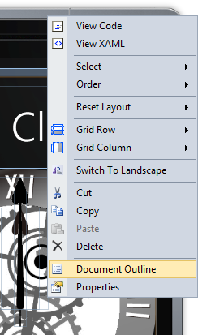
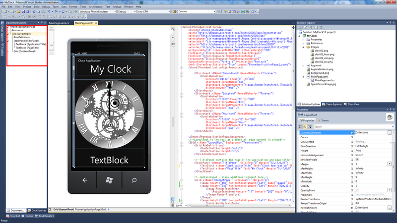
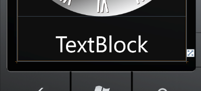

# Beginners for how to create Analog and Digital clock on Windows Phone
## Requires
- Visual Studio 2010
## License
- MS-LPL
## Technologies
- Windows Phone 7.1
## Topics
- Silverlight
- User Interface
## Updated
- 03/10/2012
## Description

<h1>Introduction</h1>

Do you want to create Analog clock and Digital clock on Windows Phone? With XAML, it's so easy to create Analog clock on windows phone without&nbsp;coordinate calculation. And, Digital clock too. Youi can create the clock
 with&nbsp;DispatchTimer class.

<h1>Building the Sample</h1>

Before running this sample, make sure that the following software is installed:

<ul>
<li class="unordered">Visual Studio 2010 </li><li class="unordered">Windows Phone Developer Tools
</li></ul>

Description

<strong>Analog Clock</strong>

1. Enable the <strong style="font-size:small">Document Outline</strong> tool window

What's the Document Outline?&nbsp;The&nbsp;<strong style="font-size:small">Document Outline</strong>&nbsp;tool window in Visual Studio 2010 is similar to the&nbsp;<strong style="font-size:small">Objects and Timeline</strong>&nbsp;window
 in Expression Blend.&nbsp; It is very useful when you have multiple visual states with different sections of the UI set to visible, collapsed, etc.&nbsp; An example scenario is that you want to set properties or event handlers on an object like a<strong style="font-size:small">Button</strong>&nbsp;or&nbsp;<strong style="font-size:small">MediaElement</strong>&nbsp;but
 it is hidden by other controls.&nbsp; You can easily find the desired object using the Document Outline tool window.

The&nbsp;<strong>Document Outline</strong>&nbsp;tool window is a very handy window for Windows Phone 7 developers in Visual Studio 2010 but it is hard to find if you try to find it by looking in the typical places such as the
 View | Other Windows menu item.

To open the&nbsp;<strong>Document Outline</strong>&nbsp;tool window right-click on the Windows Phone 7 designer and select&nbsp;<strong>Document Outline</strong>:

&nbsp;

Once opened&nbsp; you can select&nbsp; an object such as a hidden&nbsp;<strong>MediaElement</strong>&nbsp;in the outline and configure properties as needed as shown here:

&nbsp;

2. Create Second hand, Long hand and Hour hand.

XAML sour is as below.

&nbsp;

XAML

Edit|Remove

xaml
<pre class="hidden">&lt;phone:PhoneApplicationPage 
    x:Class=&quot;Analog_Clock.MainPage&quot;
    xmlns=&quot;http://schemas.microsoft.com/winfx/2006/xaml/presentation&quot;
    xmlns:x=&quot;http://schemas.microsoft.com/winfx/2006/xaml&quot;
    xmlns:phone=&quot;clr-namespace:Microsoft.Phone.Controls;assembly=Microsoft.Phone&quot;
    xmlns:shell=&quot;clr-namespace:Microsoft.Phone.Shell;assembly=Microsoft.Phone&quot;
    xmlns:d=&quot;http://schemas.microsoft.com/expression/blend/2008&quot;
    xmlns:mc=&quot;http://schemas.openxmlformats.org/markup-compatibility/2006&quot;
    mc:Ignorable=&quot;d&quot; d:DesignWidth=&quot;480&quot; d:DesignHeight=&quot;768&quot;
    FontFamily=&quot;{StaticResource PhoneFontFamilyNormal}&quot;
    FontSize=&quot;{StaticResource PhoneFontSizeNormal}&quot;
    Foreground=&quot;{StaticResource PhoneForegroundBrush}&quot;
    SupportedOrientations=&quot;Portrait&quot; Orientation=&quot;Portrait&quot;
    shell:SystemTray.IsVisible=&quot;True&quot; Loaded=&quot;PhoneApplicationPage_Loaded&quot;&gt;
    &lt;phone:PhoneApplicationPage.Resources&gt;

        &lt;Storyboard x:Name=&quot;SecondHand&quot; RepeatBehavior=&quot;Forever&quot;&gt;
            &lt;DoubleAnimation 
                Duration=&quot;0:1:0&quot; From=&quot;0&quot; To=&quot;360&quot;
                Storyboard.TargetName=&quot;Sec&quot;
                Storyboard.TargetProperty=&quot;(Image.RenderTransform).(RotateTransform.Angle)&quot;
                d:IsOptimized=&quot;True&quot; /&gt;
        &lt;/Storyboard&gt;
        &lt;Storyboard x:Name=&quot;LongHand&quot; RepeatBehavior=&quot;Forever&quot;&gt;
            &lt;DoubleAnimation 
                Duration=&quot;1:0:0&quot; From=&quot;0&quot; To=&quot;360&quot;
                Storyboard.TargetName=&quot;Min&quot;
                Storyboard.TargetProperty=&quot;(Image.RenderTransform).(RotateTransform.Angle)&quot;
                d:IsOptimized=&quot;True&quot; /&gt;
        &lt;/Storyboard&gt;
        &lt;Storyboard x:Name=&quot;HourHand&quot; RepeatBehavior=&quot;Forever&quot;&gt;
            &lt;DoubleAnimation 
                Duration=&quot;12:0:0&quot; From=&quot;0&quot; To=&quot;360&quot;
                Storyboard.TargetName=&quot;Hour&quot;
                Storyboard.TargetProperty=&quot;(Image.RenderTransform).(RotateTransform.Angle)&quot;
                d:IsOptimized=&quot;True&quot; /&gt;
        &lt;/Storyboard&gt;

    &lt;/phone:PhoneApplicationPage.Resources&gt;
    &lt;!--LayoutRoot is the root grid where all page content is placed--&gt;
    &lt;Grid x:Name=&quot;LayoutRoot&quot; Background=&quot;Transparent&quot;&gt;
        &lt;Grid.RowDefinitions&gt;
            &lt;RowDefinition Height=&quot;Auto&quot;/&gt;
            &lt;RowDefinition Height=&quot;*&quot;/&gt;
        &lt;/Grid.RowDefinitions&gt;

        &lt;!--TitlePanel contains the name of the application and page title--&gt;
        &lt;StackPanel x:Name=&quot;TitlePanel&quot; Grid.Row=&quot;0&quot; Margin=&quot;12,17,0,28&quot;&gt;
            &lt;TextBlock x:Name=&quot;ApplicationTitle&quot; Text=&quot;Clock Application&quot; Style=&quot;{StaticResource PhoneTextNormalStyle}&quot;/&gt;
            &lt;TextBlock x:Name=&quot;PageTitle&quot; Text=&quot;My Clock&quot; Margin=&quot;9,-7,0,0&quot; Style=&quot;{StaticResource PhoneTextTitle1Style}&quot; TextAlignment=&quot;Center&quot; /&gt;
        &lt;/StackPanel&gt;

        &lt;!--ContentPanel - place additional content here--&gt;
        &lt;Grid x:Name=&quot;ContentPanel&quot; Grid.Row=&quot;1&quot; Margin=&quot;0&quot;&gt;
            &lt;Image Height=&quot;480&quot; HorizontalAlignment=&quot;Left&quot; Name=&quot;image1&quot; Stretch=&quot;Fill&quot; VerticalAlignment=&quot;Top&quot; Width=&quot;480&quot; Source=&quot;/MyClock;component/Images/clock01.png&quot; /&gt;
            &lt;Image Height=&quot;240&quot; HorizontalAlignment=&quot;Left&quot; Margin=&quot;229,40,0,0&quot; Name=&quot;Sec&quot; Stretch=&quot;Fill&quot; VerticalAlignment=&quot;Top&quot; Width=&quot;22&quot; Source=&quot;/MyClock;component/Images/clock01_sec.png&quot; &gt;
                &lt;Image.RenderTransform&gt;
                    &lt;RotateTransform CenterX=&quot;11&quot; CenterY=&quot;200&quot; Angle=&quot;0&quot;&gt;&lt;/RotateTransform&gt;
                &lt;/Image.RenderTransform&gt;
            &lt;/Image&gt;
            &lt;Image Height=&quot;180&quot; HorizontalAlignment=&quot;Left&quot; Margin=&quot;206,70,0,0&quot; Name=&quot;Hour&quot; Stretch=&quot;Fill&quot; VerticalAlignment=&quot;Top&quot; Width=&quot;68&quot; Source=&quot;/MyClock;component/Images/clock01_hour.png&quot;&gt;
                &lt;Image.RenderTransform&gt;
                    &lt;RotateTransform CenterX=&quot;34&quot; CenterY=&quot;170&quot; Angle=&quot;0&quot;&gt;&lt;/RotateTransform&gt;
                &lt;/Image.RenderTransform&gt;
            &lt;/Image&gt;
            &lt;Image Height=&quot;234&quot; HorizontalAlignment=&quot;Left&quot; Margin=&quot;190,16,0,0&quot; Name=&quot;Min&quot; Stretch=&quot;Fill&quot; VerticalAlignment=&quot;Top&quot; Width=&quot;100&quot; Source=&quot;/MyClock;component/Images/clock01_min.png&quot;&gt;
                &lt;Image.RenderTransform&gt;
                    &lt;RotateTransform CenterX=&quot;50&quot; CenterY=&quot;224&quot; Angle=&quot;0&quot;&gt;&lt;/RotateTransform&gt;
                &lt;/Image.RenderTransform&gt;
            &lt;/Image&gt;
            &lt;TextBlock Height=&quot;88&quot; HorizontalAlignment=&quot;Left&quot; Margin=&quot;0,513,0,0&quot; Name=&quot;txtDigitalClock&quot; Text=&quot;TextBlock&quot; VerticalAlignment=&quot;Top&quot; Width=&quot;480&quot; FontSize=&quot;64&quot; TextAlignment=&quot;Center&quot; /&gt;
        &lt;/Grid&gt;
    &lt;/Grid&gt;
&lt;/phone:PhoneApplicationPage&gt;</pre>

<pre class="xaml">&lt;phone:PhoneApplicationPage&nbsp;&nbsp;
&nbsp;&nbsp;&nbsp;&nbsp;x:Class=&quot;Analog_Clock.MainPage&quot;&nbsp;
&nbsp;&nbsp;&nbsp;&nbsp;xmlns=&quot;http://schemas.microsoft.com/winfx/2006/xaml/presentation&quot;&nbsp;
&nbsp;&nbsp;&nbsp;&nbsp;xmlns:x=&quot;http://schemas.microsoft.com/winfx/2006/xaml&quot;&nbsp;
&nbsp;&nbsp;&nbsp;&nbsp;xmlns:phone=&quot;clr-namespace:Microsoft.Phone.Controls;assembly=Microsoft.Phone&quot;&nbsp;
&nbsp;&nbsp;&nbsp;&nbsp;xmlns:shell=&quot;clr-namespace:Microsoft.Phone.Shell;assembly=Microsoft.Phone&quot;&nbsp;
&nbsp;&nbsp;&nbsp;&nbsp;xmlns:d=&quot;http://schemas.microsoft.com/expression/blend/2008&quot;&nbsp;
&nbsp;&nbsp;&nbsp;&nbsp;xmlns:mc=&quot;http://schemas.openxmlformats.org/markup-compatibility/2006&quot;&nbsp;
&nbsp;&nbsp;&nbsp;&nbsp;mc:Ignorable=&quot;d&quot;&nbsp;d:DesignWidth=&quot;480&quot;&nbsp;d:DesignHeight=&quot;768&quot;&nbsp;
&nbsp;&nbsp;&nbsp;&nbsp;FontFamily=&quot;{StaticResource&nbsp;PhoneFontFamilyNormal}&quot;&nbsp;
&nbsp;&nbsp;&nbsp;&nbsp;FontSize=&quot;{StaticResource&nbsp;PhoneFontSizeNormal}&quot;&nbsp;
&nbsp;&nbsp;&nbsp;&nbsp;Foreground=&quot;{StaticResource&nbsp;PhoneForegroundBrush}&quot;&nbsp;
&nbsp;&nbsp;&nbsp;&nbsp;SupportedOrientations=&quot;Portrait&quot;&nbsp;Orientation=&quot;Portrait&quot;&nbsp;
&nbsp;&nbsp;&nbsp;&nbsp;shell:SystemTray.IsVisible=&quot;True&quot;&nbsp;Loaded=&quot;PhoneApplicationPage_Loaded&quot;&gt;&nbsp;
&nbsp;&nbsp;&nbsp;&nbsp;&lt;phone:PhoneApplicationPage.Resources&gt;&nbsp;
&nbsp;
<strong>&nbsp;&nbsp;&nbsp;&nbsp;&nbsp;&nbsp;&nbsp;&nbsp;&lt;Storyboard&nbsp;x:Name=&quot;SecondHand&quot;&nbsp;RepeatBehavior=&quot;Forever&quot;&gt;&nbsp;
&nbsp;&nbsp;&nbsp;&nbsp;&nbsp;&nbsp;&nbsp;&nbsp;&nbsp;&nbsp;&nbsp;&nbsp;&lt;DoubleAnimation&nbsp;&nbsp;
&nbsp;&nbsp;&nbsp;&nbsp;&nbsp;&nbsp;&nbsp;&nbsp;&nbsp;&nbsp;&nbsp;&nbsp;&nbsp;&nbsp;&nbsp;&nbsp;Duration=&quot;0:1:0&quot;&nbsp;From=&quot;0&quot;&nbsp;To=&quot;360&quot;&nbsp;
&nbsp;&nbsp;&nbsp;&nbsp;&nbsp;&nbsp;&nbsp;&nbsp;&nbsp;&nbsp;&nbsp;&nbsp;&nbsp;&nbsp;&nbsp;&nbsp;Storyboard.TargetName=&quot;Sec&quot;&nbsp;
&nbsp;&nbsp;&nbsp;&nbsp;&nbsp;&nbsp;&nbsp;&nbsp;&nbsp;&nbsp;&nbsp;&nbsp;&nbsp;&nbsp;&nbsp;&nbsp;Storyboard.TargetProperty=&quot;(Image.RenderTransform).(RotateTransform.Angle)&quot;&nbsp;
&nbsp;&nbsp;&nbsp;&nbsp;&nbsp;&nbsp;&nbsp;&nbsp;&nbsp;&nbsp;&nbsp;&nbsp;&nbsp;&nbsp;&nbsp;&nbsp;d:IsOptimized=&quot;True&quot;&nbsp;/&gt;&nbsp;
&nbsp;&nbsp;&nbsp;&nbsp;&nbsp;&nbsp;&nbsp;&nbsp;&lt;/Storyboard&gt;&nbsp;
&nbsp;&nbsp;&nbsp;&nbsp;&nbsp;&nbsp;&nbsp;&nbsp;&lt;Storyboard&nbsp;x:Name=&quot;LongHand&quot;&nbsp;RepeatBehavior=&quot;Forever&quot;&gt;&nbsp;
&nbsp;&nbsp;&nbsp;&nbsp;&nbsp;&nbsp;&nbsp;&nbsp;&nbsp;&nbsp;&nbsp;&nbsp;&lt;DoubleAnimation&nbsp;&nbsp;
&nbsp;&nbsp;&nbsp;&nbsp;&nbsp;&nbsp;&nbsp;&nbsp;&nbsp;&nbsp;&nbsp;&nbsp;&nbsp;&nbsp;&nbsp;&nbsp;Duration=&quot;1:0:0&quot;&nbsp;From=&quot;0&quot;&nbsp;To=&quot;360&quot;&nbsp;
&nbsp;&nbsp;&nbsp;&nbsp;&nbsp;&nbsp;&nbsp;&nbsp;&nbsp;&nbsp;&nbsp;&nbsp;&nbsp;&nbsp;&nbsp;&nbsp;Storyboard.TargetName=&quot;Min&quot;&nbsp;
&nbsp;&nbsp;&nbsp;&nbsp;&nbsp;&nbsp;&nbsp;&nbsp;&nbsp;&nbsp;&nbsp;&nbsp;&nbsp;&nbsp;&nbsp;&nbsp;Storyboard.TargetProperty=&quot;(Image.RenderTransform).(RotateTransform.Angle)&quot;&nbsp;
&nbsp;&nbsp;&nbsp;&nbsp;&nbsp;&nbsp;&nbsp;&nbsp;&nbsp;&nbsp;&nbsp;&nbsp;&nbsp;&nbsp;&nbsp;&nbsp;d:IsOptimized=&quot;True&quot;&nbsp;/&gt;&nbsp;
&nbsp;&nbsp;&nbsp;&nbsp;&nbsp;&nbsp;&nbsp;&nbsp;&lt;/Storyboard&gt;&nbsp;
&nbsp;&nbsp;&nbsp;&nbsp;&nbsp;&nbsp;&nbsp;&nbsp;&lt;Storyboard&nbsp;x:Name=&quot;HourHand&quot;&nbsp;RepeatBehavior=&quot;Forever&quot;&gt;&nbsp;
&nbsp;&nbsp;&nbsp;&nbsp;&nbsp;&nbsp;&nbsp;&nbsp;&nbsp;&nbsp;&nbsp;&nbsp;&lt;DoubleAnimation&nbsp;&nbsp;
&nbsp;&nbsp;&nbsp;&nbsp;&nbsp;&nbsp;&nbsp;&nbsp;&nbsp;&nbsp;&nbsp;&nbsp;&nbsp;&nbsp;&nbsp;&nbsp;Duration=&quot;12:0:0&quot;&nbsp;From=&quot;0&quot;&nbsp;To=&quot;360&quot;&nbsp;
&nbsp;&nbsp;&nbsp;&nbsp;&nbsp;&nbsp;&nbsp;&nbsp;&nbsp;&nbsp;&nbsp;&nbsp;&nbsp;&nbsp;&nbsp;&nbsp;Storyboard.TargetName=&quot;Hour&quot;&nbsp;
&nbsp;&nbsp;&nbsp;&nbsp;&nbsp;&nbsp;&nbsp;&nbsp;&nbsp;&nbsp;&nbsp;&nbsp;&nbsp;&nbsp;&nbsp;&nbsp;Storyboard.TargetProperty=&quot;(Image.RenderTransform).(RotateTransform.Angle)&quot;&nbsp;
&nbsp;&nbsp;&nbsp;&nbsp;&nbsp;&nbsp;&nbsp;&nbsp;&nbsp;&nbsp;&nbsp;&nbsp;&nbsp;&nbsp;&nbsp;&nbsp;d:IsOptimized=&quot;True&quot;&nbsp;/&gt;&nbsp;
&nbsp;&nbsp;&nbsp;&nbsp;&nbsp;&nbsp;&nbsp;&nbsp;&lt;/Storyboard&gt;&nbsp;</strong>
&nbsp;
&nbsp;&nbsp;&nbsp;&nbsp;&lt;/phone:PhoneApplicationPage.Resources&gt;&nbsp;
&nbsp;&nbsp;&nbsp;&nbsp;&lt;!--LayoutRoot&nbsp;is&nbsp;the&nbsp;root&nbsp;grid&nbsp;where&nbsp;all&nbsp;page&nbsp;content&nbsp;is&nbsp;placed--&gt;&nbsp;
&nbsp;&nbsp;&nbsp;&nbsp;&lt;Grid&nbsp;x:Name=&quot;LayoutRoot&quot;&nbsp;Background=&quot;Transparent&quot;&gt;&nbsp;
&nbsp;&nbsp;&nbsp;&nbsp;&nbsp;&nbsp;&nbsp;&nbsp;&lt;Grid.RowDefinitions&gt;&nbsp;
&nbsp;&nbsp;&nbsp;&nbsp;&nbsp;&nbsp;&nbsp;&nbsp;&nbsp;&nbsp;&nbsp;&nbsp;&lt;RowDefinition&nbsp;Height=&quot;Auto&quot;/&gt;&nbsp;
&nbsp;&nbsp;&nbsp;&nbsp;&nbsp;&nbsp;&nbsp;&nbsp;&nbsp;&nbsp;&nbsp;&nbsp;&lt;RowDefinition&nbsp;Height=&quot;*&quot;/&gt;&nbsp;
&nbsp;&nbsp;&nbsp;&nbsp;&nbsp;&nbsp;&nbsp;&nbsp;&lt;/Grid.RowDefinitions&gt;&nbsp;
&nbsp;
&nbsp;&nbsp;&nbsp;&nbsp;&nbsp;&nbsp;&nbsp;&nbsp;&lt;!--TitlePanel&nbsp;contains&nbsp;the&nbsp;name&nbsp;of&nbsp;the&nbsp;application&nbsp;and&nbsp;page&nbsp;title--&gt;&nbsp;
&nbsp;&nbsp;&nbsp;&nbsp;&nbsp;&nbsp;&nbsp;&nbsp;&lt;StackPanel&nbsp;x:Name=&quot;TitlePanel&quot;&nbsp;Grid.Row=&quot;0&quot;&nbsp;Margin=&quot;12,17,0,28&quot;&gt;&nbsp;
&nbsp;&nbsp;&nbsp;&nbsp;&nbsp;&nbsp;&nbsp;&nbsp;&nbsp;&nbsp;&nbsp;&nbsp;&lt;TextBlock&nbsp;x:Name=&quot;ApplicationTitle&quot;&nbsp;Text=&quot;Clock&nbsp;Application&quot;&nbsp;Style=&quot;{StaticResource&nbsp;PhoneTextNormalStyle}&quot;/&gt;&nbsp;
&nbsp;&nbsp;&nbsp;&nbsp;&nbsp;&nbsp;&nbsp;&nbsp;&nbsp;&nbsp;&nbsp;&nbsp;&lt;TextBlock&nbsp;x:Name=&quot;PageTitle&quot;&nbsp;Text=&quot;My&nbsp;Clock&quot;&nbsp;Margin=&quot;9,-7,0,0&quot;&nbsp;Style=&quot;{StaticResource&nbsp;PhoneTextTitle1Style}&quot;&nbsp;TextAlignment=&quot;Center&quot;&nbsp;/&gt;&nbsp;
&nbsp;&nbsp;&nbsp;&nbsp;&nbsp;&nbsp;&nbsp;&nbsp;&lt;/StackPanel&gt;&nbsp;
&nbsp;
&nbsp;&nbsp;&nbsp;&nbsp;&nbsp;&nbsp;&nbsp;&nbsp;&lt;!--ContentPanel&nbsp;-&nbsp;place&nbsp;additional&nbsp;content&nbsp;here--&gt;&nbsp;
&nbsp;&nbsp;&nbsp;&nbsp;&nbsp;&nbsp;&nbsp;&nbsp;&lt;Grid&nbsp;x:Name=&quot;ContentPanel&quot;&nbsp;Grid.Row=&quot;1&quot;&nbsp;Margin=&quot;0&quot;&gt;&nbsp;
<strong>&nbsp;&nbsp;&nbsp;&nbsp;&nbsp;&nbsp;&nbsp;&nbsp;&nbsp;&nbsp;&nbsp;&nbsp;&lt;Image&nbsp;Height=&quot;480&quot;&nbsp;HorizontalAlignment=&quot;Left&quot;&nbsp;Name=&quot;image1&quot;&nbsp;Stretch=&quot;Fill&quot;&nbsp;VerticalAlignment=&quot;Top&quot;&nbsp;Width=&quot;480&quot;&nbsp;Source=&quot;/MyClock;component/Images/clock01.png&quot;&nbsp;/&gt;&nbsp;
&nbsp;&nbsp;&nbsp;&nbsp;&nbsp;&nbsp;&nbsp;&nbsp;&nbsp;&nbsp;&nbsp;&nbsp;&lt;Image&nbsp;Height=&quot;240&quot;&nbsp;HorizontalAlignment=&quot;Left&quot;&nbsp;Margin=&quot;229,40,0,0&quot;&nbsp;Name=&quot;Sec&quot;&nbsp;Stretch=&quot;Fill&quot;&nbsp;VerticalAlignment=&quot;Top&quot;&nbsp;Width=&quot;22&quot;&nbsp;Source=&quot;/MyClock;component/Images/clock01_sec.png&quot;&nbsp;&gt;&nbsp;
&nbsp;&nbsp;&nbsp;&nbsp;&nbsp;&nbsp;&nbsp;&nbsp;&nbsp;&nbsp;&nbsp;&nbsp;&nbsp;&nbsp;&nbsp;&nbsp;&lt;Image.RenderTransform&gt;&nbsp;
&nbsp;&nbsp;&nbsp;&nbsp;&nbsp;&nbsp;&nbsp;&nbsp;&nbsp;&nbsp;&nbsp;&nbsp;&nbsp;&nbsp;&nbsp;&nbsp;&nbsp;&nbsp;&nbsp;&nbsp;&lt;RotateTransform&nbsp;CenterX=&quot;11&quot;&nbsp;CenterY=&quot;200&quot;&nbsp;Angle=&quot;0&quot;&gt;&lt;/RotateTransform&gt;&nbsp;
&nbsp;&nbsp;&nbsp;&nbsp;&nbsp;&nbsp;&nbsp;&nbsp;&nbsp;&nbsp;&nbsp;&nbsp;&nbsp;&nbsp;&nbsp;&nbsp;&lt;/Image.RenderTransform&gt;&nbsp;
&nbsp;&nbsp;&nbsp;&nbsp;&nbsp;&nbsp;&nbsp;&nbsp;&nbsp;&nbsp;&nbsp;&nbsp;&lt;/Image&gt;&nbsp;
&nbsp;&nbsp;&nbsp;&nbsp;&nbsp;&nbsp;&nbsp;&nbsp;&nbsp;&nbsp;&nbsp;&nbsp;&lt;Image&nbsp;Height=&quot;180&quot;&nbsp;HorizontalAlignment=&quot;Left&quot;&nbsp;Margin=&quot;206,70,0,0&quot;&nbsp;Name=&quot;Hour&quot;&nbsp;Stretch=&quot;Fill&quot;&nbsp;VerticalAlignment=&quot;Top&quot;&nbsp;Width=&quot;68&quot;&nbsp;Source=&quot;/MyClock;component/Images/clock01_hour.png&quot;&gt;&nbsp;
&nbsp;&nbsp;&nbsp;&nbsp;&nbsp;&nbsp;&nbsp;&nbsp;&nbsp;&nbsp;&nbsp;&nbsp;&nbsp;&nbsp;&nbsp;&nbsp;&lt;Image.RenderTransform&gt;&nbsp;
&nbsp;&nbsp;&nbsp;&nbsp;&nbsp;&nbsp;&nbsp;&nbsp;&nbsp;&nbsp;&nbsp;&nbsp;&nbsp;&nbsp;&nbsp;&nbsp;&nbsp;&nbsp;&nbsp;&nbsp;&lt;RotateTransform&nbsp;CenterX=&quot;34&quot;&nbsp;CenterY=&quot;170&quot;&nbsp;Angle=&quot;0&quot;&gt;&lt;/RotateTransform&gt;&nbsp;
&nbsp;&nbsp;&nbsp;&nbsp;&nbsp;&nbsp;&nbsp;&nbsp;&nbsp;&nbsp;&nbsp;&nbsp;&nbsp;&nbsp;&nbsp;&nbsp;&lt;/Image.RenderTransform&gt;&nbsp;
&nbsp;&nbsp;&nbsp;&nbsp;&nbsp;&nbsp;&nbsp;&nbsp;&nbsp;&nbsp;&nbsp;&nbsp;&lt;/Image&gt;&nbsp;
&nbsp;&nbsp;&nbsp;&nbsp;&nbsp;&nbsp;&nbsp;&nbsp;&nbsp;&nbsp;&nbsp;&nbsp;&lt;Image&nbsp;Height=&quot;234&quot;&nbsp;HorizontalAlignment=&quot;Left&quot;&nbsp;Margin=&quot;190,16,0,0&quot;&nbsp;Name=&quot;Min&quot;&nbsp;Stretch=&quot;Fill&quot;&nbsp;VerticalAlignment=&quot;Top&quot;&nbsp;Width=&quot;100&quot;&nbsp;Source=&quot;/MyClock;component/Images/clock01_min.png&quot;&gt;&nbsp;
&nbsp;&nbsp;&nbsp;&nbsp;&nbsp;&nbsp;&nbsp;&nbsp;&nbsp;&nbsp;&nbsp;&nbsp;&nbsp;&nbsp;&nbsp;&nbsp;&lt;Image.RenderTransform&gt;&nbsp;
&nbsp;&nbsp;&nbsp;&nbsp;&nbsp;&nbsp;&nbsp;&nbsp;&nbsp;&nbsp;&nbsp;&nbsp;&nbsp;&nbsp;&nbsp;&nbsp;&nbsp;&nbsp;&nbsp;&nbsp;&lt;RotateTransform&nbsp;CenterX=&quot;50&quot;&nbsp;CenterY=&quot;224&quot;&nbsp;Angle=&quot;0&quot;&gt;&lt;/RotateTransform&gt;&nbsp;
&nbsp;&nbsp;&nbsp;&nbsp;&nbsp;&nbsp;&nbsp;&nbsp;&nbsp;&nbsp;&nbsp;&nbsp;&nbsp;&nbsp;&nbsp;&nbsp;&lt;/Image.RenderTransform&gt;&nbsp;
&nbsp;&nbsp;&nbsp;&nbsp;&nbsp;&nbsp;&nbsp;&nbsp;&nbsp;&nbsp;&nbsp;&nbsp;&lt;/Image&gt;&nbsp;</strong>
&nbsp;&nbsp;&nbsp;&nbsp;&nbsp;&nbsp;&nbsp;&nbsp;&nbsp;&nbsp;&nbsp;&nbsp;&lt;TextBlock&nbsp;Height=&quot;88&quot;&nbsp;HorizontalAlignment=&quot;Left&quot;&nbsp;Margin=&quot;0,513,0,0&quot;&nbsp;Name=&quot;txtDigitalClock&quot;&nbsp;Text=&quot;TextBlock&quot;&nbsp;VerticalAlignment=&quot;Top&quot;&nbsp;Width=&quot;480&quot;&nbsp;FontSize=&quot;64&quot;&nbsp;TextAlignment=&quot;Center&quot;&nbsp;/&gt;&nbsp;
&nbsp;&nbsp;&nbsp;&nbsp;&nbsp;&nbsp;&nbsp;&nbsp;&lt;/Grid&gt;&nbsp;
&nbsp;&nbsp;&nbsp;&nbsp;&lt;/Grid&gt;&nbsp;
&lt;/phone:PhoneApplicationPage&gt;</pre>

&nbsp;

The following code will get currnet time when the applicaiton started.

&nbsp;

C#

Edit|Remove

csharp
<pre class="hidden">        private void PhoneApplicationPage_Loaded(object sender, RoutedEventArgs e)
        {
            SecondHand.Begin();
            LongHand.Begin();
            HourHand.Begin();

            int second = DateTime.Now.Second;
            SecondHand.Seek(new TimeSpan(0, 0, second));

            int minutes = DateTime.Now.Minute;
            LongHand.Seek(new TimeSpan(0, minutes, second));

            int hour = DateTime.Now.Hour;
            HourHand.Seek(new TimeSpan(hour, minutes, second));

        }</pre>

<pre class="csharp">&nbsp;&nbsp;&nbsp;&nbsp;&nbsp;&nbsp;&nbsp;&nbsp;private&nbsp;void&nbsp;PhoneApplicationPage_Loaded(object&nbsp;sender,&nbsp;RoutedEventArgs&nbsp;e)&nbsp;
&nbsp;&nbsp;&nbsp;&nbsp;&nbsp;&nbsp;&nbsp;&nbsp;{&nbsp;
&nbsp;&nbsp;&nbsp;&nbsp;&nbsp;&nbsp;&nbsp;&nbsp;&nbsp;&nbsp;&nbsp;&nbsp;SecondHand.Begin();&nbsp;
&nbsp;&nbsp;&nbsp;&nbsp;&nbsp;&nbsp;&nbsp;&nbsp;&nbsp;&nbsp;&nbsp;&nbsp;LongHand.Begin();&nbsp;
&nbsp;&nbsp;&nbsp;&nbsp;&nbsp;&nbsp;&nbsp;&nbsp;&nbsp;&nbsp;&nbsp;&nbsp;HourHand.Begin();&nbsp;
&nbsp;
&nbsp;&nbsp;&nbsp;&nbsp;&nbsp;&nbsp;&nbsp;&nbsp;&nbsp;&nbsp;&nbsp;&nbsp;int&nbsp;second&nbsp;=&nbsp;DateTime.Now.Second;&nbsp;
&nbsp;&nbsp;&nbsp;&nbsp;&nbsp;&nbsp;&nbsp;&nbsp;&nbsp;&nbsp;&nbsp;&nbsp;SecondHand.Seek(new&nbsp;TimeSpan(0,&nbsp;0,&nbsp;second));&nbsp;
&nbsp;
&nbsp;&nbsp;&nbsp;&nbsp;&nbsp;&nbsp;&nbsp;&nbsp;&nbsp;&nbsp;&nbsp;&nbsp;int&nbsp;minutes&nbsp;=&nbsp;DateTime.Now.Minute;&nbsp;
&nbsp;&nbsp;&nbsp;&nbsp;&nbsp;&nbsp;&nbsp;&nbsp;&nbsp;&nbsp;&nbsp;&nbsp;LongHand.Seek(new&nbsp;TimeSpan(0,&nbsp;minutes,&nbsp;second));&nbsp;
&nbsp;
&nbsp;&nbsp;&nbsp;&nbsp;&nbsp;&nbsp;&nbsp;&nbsp;&nbsp;&nbsp;&nbsp;&nbsp;int&nbsp;hour&nbsp;=&nbsp;DateTime.Now.Hour;&nbsp;
&nbsp;&nbsp;&nbsp;&nbsp;&nbsp;&nbsp;&nbsp;&nbsp;&nbsp;&nbsp;&nbsp;&nbsp;HourHand.Seek(new&nbsp;TimeSpan(hour,&nbsp;minutes,&nbsp;second));&nbsp;
&nbsp;
&nbsp;&nbsp;&nbsp;&nbsp;&nbsp;&nbsp;&nbsp;&nbsp;}</pre>

&nbsp;

&nbsp;

<strong>Digital Clock</strong>

1. Put the <strong>TextBlock </strong>from tool window

 

You should change the&nbsp;<strong>FontSize&nbsp;</strong>to 72 or 64 and you can change the<strong>Foreground</strong>&nbsp;for the font color. 

2. Add <strong>System.Windows.Threading</strong> namespace to use the
<strong>DispatchTimer</strong> class

&nbsp;

C#

Edit|Remove

csharp
<pre class="hidden">using System;
using System.Windows;
using Microsoft.Phone.Controls;
using System.Windows.Threading;
using Microsoft.Phone.Shell;</pre>

<pre class="js">using&nbsp;System;&nbsp;
using&nbsp;System.Windows;&nbsp;
using&nbsp;Microsoft.Phone.Controls;&nbsp;
<strong>using&nbsp;System.Windows.Threading;&nbsp;</strong>
using&nbsp;Microsoft.Phone.Shell;</pre>

3. Add the following codes in the Constractor method

C#

Edit|Remove

csharp
<pre class="hidden">        // Constructor
        public MainPage()
        {
            InitializeComponent();

            PhoneApplicationService phoneAppService = PhoneApplicationService.Current;
            phoneAppService.UserIdleDetectionMode = IdleDetectionMode.Disabled;

            DispatcherTimer timer = new DispatcherTimer();
            timer.Tick &#43;= new EventHandler(timer_Tick);
            timer.Start();
        }</pre>

<pre class="csharp">&nbsp;&nbsp;&nbsp;&nbsp;&nbsp;&nbsp;&nbsp;&nbsp;//&nbsp;Constructor&nbsp;
&nbsp;&nbsp;&nbsp;&nbsp;&nbsp;&nbsp;&nbsp;&nbsp;public&nbsp;MainPage()&nbsp;
&nbsp;&nbsp;&nbsp;&nbsp;&nbsp;&nbsp;&nbsp;&nbsp;{&nbsp;
&nbsp;&nbsp;&nbsp;&nbsp;&nbsp;&nbsp;&nbsp;&nbsp;&nbsp;&nbsp;&nbsp;&nbsp;InitializeComponent();&nbsp;
&nbsp;
&nbsp;&nbsp;&nbsp;&nbsp;&nbsp;&nbsp;&nbsp;&nbsp;&nbsp;&nbsp;&nbsp;&nbsp;PhoneApplicationService&nbsp;phoneAppService&nbsp;=&nbsp;PhoneApplicationService.Current;&nbsp;
&nbsp;&nbsp;&nbsp;&nbsp;&nbsp;&nbsp;&nbsp;&nbsp;&nbsp;&nbsp;&nbsp;&nbsp;phoneAppService.UserIdleDetectionMode&nbsp;=&nbsp;IdleDetectionMode.Disabled;&nbsp;
&nbsp;
<strong>&nbsp;&nbsp;&nbsp;&nbsp;&nbsp;&nbsp;&nbsp;&nbsp;&nbsp;&nbsp;&nbsp;&nbsp;DispatcherTimer&nbsp;timer&nbsp;=&nbsp;new&nbsp;DispatcherTimer();&nbsp;
&nbsp;&nbsp;&nbsp;&nbsp;&nbsp;&nbsp;&nbsp;&nbsp;&nbsp;&nbsp;&nbsp;&nbsp;timer.Tick&nbsp;&#43;=&nbsp;new&nbsp;EventHandler(timer_Tick);&nbsp;
&nbsp;&nbsp;&nbsp;&nbsp;&nbsp;&nbsp;&nbsp;&nbsp;&nbsp;&nbsp;&nbsp;&nbsp;timer.Start();&nbsp;</strong>
&nbsp;&nbsp;&nbsp;&nbsp;&nbsp;&nbsp;&nbsp;&nbsp;}</pre>

&nbsp;

4. timer_tick Event Hnadler will be created and you need delete the &quot;throw new NotImplementedException(); &quot; line. And, you need to add the following code to display current time to the TextBlock.

C#

Edit|Remove

csharp
<pre class="hidden">        void timer_Tick(object sender, EventArgs e)
        {
            DateTime dt = DateTime.Now;

            txtDigitalClock.Text = dt.ToString(&quot;MM/dd HH:mm:ss&quot;);
        }</pre>

<pre class="csharp">&nbsp;&nbsp;&nbsp;&nbsp;&nbsp;&nbsp;&nbsp;&nbsp;void&nbsp;timer_Tick(object&nbsp;sender,&nbsp;EventArgs&nbsp;e)&nbsp;
&nbsp;&nbsp;&nbsp;&nbsp;&nbsp;&nbsp;&nbsp;&nbsp;{&nbsp;
&nbsp;&nbsp;&nbsp;&nbsp;&nbsp;&nbsp;&nbsp;&nbsp;&nbsp;&nbsp;&nbsp;&nbsp;DateTime&nbsp;dt&nbsp;=&nbsp;DateTime.Now;&nbsp;
&nbsp;
&nbsp;&nbsp;&nbsp;&nbsp;&nbsp;&nbsp;&nbsp;&nbsp;&nbsp;&nbsp;&nbsp;&nbsp;txtDigitalClock.Text&nbsp;=&nbsp;dt.ToString(&quot;MM/dd&nbsp;HH:mm:ss&quot;);&nbsp;
&nbsp;&nbsp;&nbsp;&nbsp;&nbsp;&nbsp;&nbsp;&nbsp;}</pre>

&nbsp;
<h1>Building the sample</h1>

<strong>To run the sample on a Windows Phone 7 emulator</strong>

<ol>
<li>Unzip the sample files on the local computer.
</li><li>In Visual Studio, open the MediaPlayerSample.sln solution file in the directory of the sample.
</li><li>With the project loaded in Visual Studio, press F5.
</li></ol>

