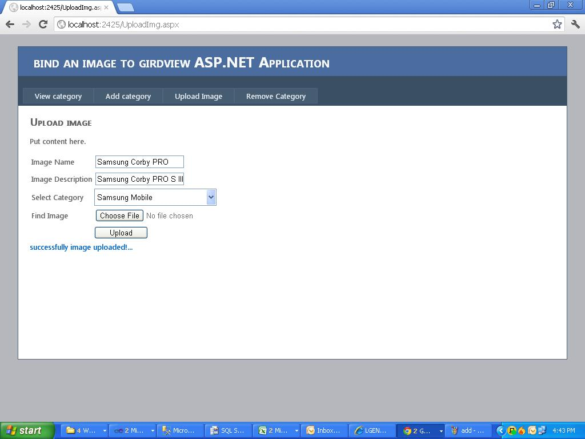
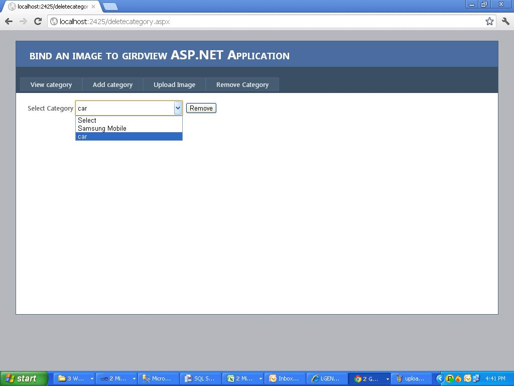

# Bind image in gridview using C#  with asp.net
## Requires
- Visual Studio 2010
## License
- Apache License, Version 2.0
## Technologies
- SQL Server
- ASP.NET
## Topics
- GridView
- image upload
- bind image in gridview
- how to bind image in gridview
- display image in gridview
- how to file upload
## Updated
- 10/10/2012
## Description

<h1>Introduction</h1>

<em>In case of using&nbsp;</em><em>image</em><em>&nbsp;uploading and downloading from database, the following sample will help you.</em>

<em>download the sample and change the connection string then it will work..</em>

<em>If you want to really have a data-bound GridViewImageColumn, the column in the database should contain the actual images. Since the column in your database contains only the paths to the images,&nbsp; 
</em>

<em> 
</em>

<h1>Building the Sample</h1>
<ol>
<li>ADD, </li><li>UPLOAD, </li><li>VIEW and </li><li>REMOVE CATEGORY: </li></ol>

Description

BIND THE IMAGE IN GRIDVIEW:

This application is developed to Bind and view the images in the grid along with their details. Here we can add the category name which specifies, under which the image and details to be bounded. In upload category, Specify
 the name and description Select the category under which you wish to upload the Image choose the file path and bind. Further view the image with its name and category in View category. Remove category will delete the entire category.

&nbsp;

&nbsp;

C#

Edit|Remove

csharp

<pre class="csharp">&nbsp;&lt;asp:GridView&nbsp;ID=&quot;GridView1&quot;&nbsp;runat=&quot;server&quot;&nbsp;CellPadding=&quot;4&quot;&nbsp;ForeColor=&quot;#333333&quot;&nbsp;&nbsp;&nbsp;
&nbsp;&nbsp;&nbsp;&nbsp;&nbsp;&nbsp;&nbsp;&nbsp;&nbsp;&nbsp;&nbsp;&nbsp;&nbsp;&nbsp;AutoGenerateColumns=&quot;false&quot;&nbsp;&gt;&nbsp;
&nbsp;&nbsp;&nbsp;&nbsp;&nbsp;&nbsp;&nbsp;&nbsp;&nbsp;&nbsp;&nbsp;&lt;AlternatingRowStyle&nbsp;BackColor=&quot;White&quot;&nbsp;/&gt;&nbsp;
&nbsp;&nbsp;&nbsp;&nbsp;&nbsp;&nbsp;&nbsp;&nbsp;&nbsp;&nbsp;&nbsp;&lt;Columns&gt;&nbsp;
&nbsp;&nbsp;&nbsp;&nbsp;&nbsp;&nbsp;&nbsp;&nbsp;&nbsp;&nbsp;&nbsp;&nbsp;&nbsp;&nbsp;&nbsp;&lt;asp:TemplateField&nbsp;HeaderText=&quot;Image&nbsp;Name&quot;&gt;&nbsp;
&nbsp;&nbsp;&nbsp;&nbsp;&nbsp;&nbsp;&nbsp;&nbsp;&nbsp;&nbsp;&nbsp;&nbsp;&nbsp;&nbsp;&nbsp;&nbsp;&nbsp;&nbsp;&nbsp;&nbsp;
&nbsp;&nbsp;&nbsp;&nbsp;&nbsp;&nbsp;&nbsp;&nbsp;&nbsp;&nbsp;&nbsp;&nbsp;&nbsp;&nbsp;&nbsp;&nbsp;&nbsp;&nbsp;&nbsp;&lt;ItemTemplate&gt;&nbsp;
&nbsp;&nbsp;&nbsp;&nbsp;&nbsp;&nbsp;&nbsp;&nbsp;&nbsp;&nbsp;&nbsp;&nbsp;&nbsp;&nbsp;&nbsp;&nbsp;&nbsp;&nbsp;&nbsp;&nbsp;&nbsp;&nbsp;&nbsp;&lt;asp:Label&nbsp;ID=&quot;Label1&quot;&nbsp;runat=&quot;server&quot;&nbsp;Text='&lt;%#Eval(&quot;ImgName&quot;)%&gt;'&gt;&lt;/asp:Label&gt;&nbsp;
&nbsp;&nbsp;&nbsp;&nbsp;&nbsp;&nbsp;&nbsp;&nbsp;&nbsp;&nbsp;&nbsp;&nbsp;&nbsp;&nbsp;&nbsp;&nbsp;&nbsp;&nbsp;&nbsp;&lt;/ItemTemplate&gt;&nbsp;
&nbsp;&nbsp;&nbsp;&nbsp;&nbsp;&nbsp;&nbsp;&nbsp;&nbsp;&nbsp;&nbsp;&nbsp;&nbsp;&nbsp;&nbsp;&lt;/asp:TemplateField&gt;&nbsp;
&nbsp;&nbsp;&nbsp;&nbsp;&nbsp;&nbsp;&nbsp;&nbsp;&nbsp;&nbsp;&nbsp;&nbsp;&nbsp;&nbsp;&nbsp;&lt;asp:TemplateField&nbsp;HeaderText=&quot;Image&nbsp;Description&quot;&nbsp;&gt;&nbsp;
&nbsp;&nbsp;&nbsp;&nbsp;&nbsp;&nbsp;&nbsp;&nbsp;&nbsp;&nbsp;&nbsp;&nbsp;&nbsp;&nbsp;&nbsp;&nbsp;&nbsp;&nbsp;&nbsp;&nbsp;
&nbsp;&nbsp;&nbsp;&nbsp;&nbsp;&nbsp;&nbsp;&nbsp;&nbsp;&nbsp;&nbsp;&nbsp;&nbsp;&nbsp;&nbsp;&nbsp;&nbsp;&nbsp;&nbsp;&lt;ItemTemplate&gt;&nbsp;
&nbsp;&nbsp;&nbsp;&nbsp;&nbsp;&nbsp;&nbsp;&nbsp;&nbsp;&nbsp;&nbsp;&nbsp;&nbsp;&nbsp;&nbsp;&nbsp;&nbsp;&nbsp;&nbsp;&nbsp;&nbsp;&nbsp;&nbsp;&lt;asp:Label&nbsp;ID=&quot;Label2&quot;&nbsp;runat=&quot;server&quot;&nbsp;Text='&lt;%#Eval(&quot;ImgDesc&quot;)%&gt;'&nbsp;Width=&quot;200&quot;&gt;&lt;/asp:Label&gt;&nbsp;
&nbsp;&nbsp;&nbsp;&nbsp;&nbsp;&nbsp;&nbsp;&nbsp;&nbsp;&nbsp;&nbsp;&nbsp;&nbsp;&nbsp;&nbsp;&nbsp;&nbsp;&nbsp;&nbsp;&lt;/ItemTemplate&gt;&nbsp;
&nbsp;&nbsp;&nbsp;&nbsp;&nbsp;&nbsp;&nbsp;&nbsp;&nbsp;&nbsp;&nbsp;&nbsp;&nbsp;&nbsp;&nbsp;&lt;/asp:TemplateField&gt;&nbsp;
&nbsp;&nbsp;&nbsp;&nbsp;&nbsp;&nbsp;&nbsp;&nbsp;&nbsp;&nbsp;&nbsp;&nbsp;&nbsp;&nbsp;&nbsp;&lt;asp:TemplateField&nbsp;HeaderText=&quot;Image&quot;&gt;&nbsp;
&nbsp;&nbsp;&nbsp;&nbsp;&nbsp;&nbsp;&nbsp;&nbsp;&nbsp;&nbsp;&nbsp;&nbsp;&nbsp;&nbsp;&nbsp;&nbsp;&nbsp;&nbsp;&nbsp;&nbsp;
&nbsp;&nbsp;&nbsp;&nbsp;&nbsp;&nbsp;&nbsp;&nbsp;&nbsp;&nbsp;&nbsp;&nbsp;&nbsp;&nbsp;&nbsp;&nbsp;&nbsp;&nbsp;&nbsp;&lt;ItemTemplate&gt;&nbsp;
&nbsp;&nbsp;&nbsp;&nbsp;&nbsp;&nbsp;&nbsp;&nbsp;&nbsp;&nbsp;&nbsp;&nbsp;&nbsp;&nbsp;&nbsp;&nbsp;&nbsp;&nbsp;&nbsp;&nbsp;&nbsp;&nbsp;&nbsp;&lt;asp:Image&nbsp;ID=&quot;Image1&quot;&nbsp;runat=&quot;server&quot;&nbsp;Width=&quot;150&quot;&nbsp;Height=&quot;100&quot;&nbsp;ImageUrl='&lt;%#Eval(&quot;ImgPath&quot;)%&gt;'/&gt;&nbsp;
&nbsp;&nbsp;&nbsp;&nbsp;&nbsp;&nbsp;&nbsp;&nbsp;&nbsp;&nbsp;&nbsp;&nbsp;&nbsp;&nbsp;&nbsp;&nbsp;&nbsp;&nbsp;&nbsp;&nbsp;&nbsp;&nbsp;&nbsp;&lt;asp:Label&nbsp;ID=&quot;Label3&quot;&nbsp;runat=&quot;server&quot;&gt;&lt;/asp:Label&gt;&nbsp;
&nbsp;&nbsp;&nbsp;&nbsp;&nbsp;&nbsp;&nbsp;&nbsp;&nbsp;&nbsp;&nbsp;&nbsp;&nbsp;&nbsp;&nbsp;&nbsp;&nbsp;&nbsp;&nbsp;&lt;/ItemTemplate&gt;&nbsp;
&nbsp;&nbsp;&nbsp;&nbsp;&nbsp;&nbsp;&nbsp;&nbsp;&nbsp;&nbsp;&nbsp;&nbsp;&nbsp;&nbsp;&nbsp;&lt;/asp:TemplateField&gt;&nbsp;
&nbsp;&nbsp;&nbsp;&nbsp;&nbsp;&nbsp;&nbsp;&nbsp;&nbsp;&nbsp;&nbsp;&lt;/Columns&gt;&nbsp;
&nbsp;&nbsp;&nbsp;&nbsp;&nbsp;&nbsp;&nbsp;&nbsp;&nbsp;&nbsp;&nbsp;&lt;EditRowStyle&nbsp;BackColor=&quot;#2461BF&quot;&nbsp;/&gt;&nbsp;
&nbsp;&nbsp;&nbsp;&nbsp;&nbsp;&nbsp;&nbsp;&nbsp;&nbsp;&nbsp;&nbsp;&lt;FooterStyle&nbsp;BackColor=&quot;#507CD1&quot;&nbsp;Font-Bold=&quot;True&quot;&nbsp;ForeColor=&quot;White&quot;&nbsp;/&gt;&nbsp;
&nbsp;&nbsp;&nbsp;&nbsp;&nbsp;&nbsp;&nbsp;&nbsp;&nbsp;&nbsp;&nbsp;&lt;HeaderStyle&nbsp;BackColor=&quot;#507CD1&quot;&nbsp;Font-Bold=&quot;True&quot;&nbsp;ForeColor=&quot;White&quot;&nbsp;/&gt;&nbsp;
&nbsp;&nbsp;&nbsp;&nbsp;&nbsp;&nbsp;&nbsp;&nbsp;&nbsp;&nbsp;&nbsp;&lt;PagerStyle&nbsp;BackColor=&quot;#2461BF&quot;&nbsp;ForeColor=&quot;White&quot;&nbsp;HorizontalAlign=&quot;Center&quot;&nbsp;/&gt;&nbsp;
&nbsp;&nbsp;&nbsp;&nbsp;&nbsp;&nbsp;&nbsp;&nbsp;&nbsp;&nbsp;&nbsp;&lt;RowStyle&nbsp;BackColor=&quot;#EFF3FB&quot;&nbsp;/&gt;&nbsp;
&nbsp;&nbsp;&nbsp;&nbsp;&nbsp;&nbsp;&nbsp;&nbsp;&nbsp;&nbsp;&nbsp;&lt;SelectedRowStyle&nbsp;BackColor=&quot;#D1DDF1&quot;&nbsp;Font-Bold=&quot;True&quot;&nbsp;ForeColor=&quot;#333333&quot;&nbsp;/&gt;&nbsp;
&nbsp;&nbsp;&nbsp;&nbsp;&nbsp;&nbsp;&nbsp;&nbsp;&nbsp;&nbsp;&nbsp;&lt;SortedAscendingCellStyle&nbsp;BackColor=&quot;#F5F7FB&quot;&nbsp;/&gt;&nbsp;
&nbsp;&nbsp;&nbsp;&nbsp;&nbsp;&nbsp;&nbsp;&nbsp;&nbsp;&nbsp;&nbsp;&lt;SortedAscendingHeaderStyle&nbsp;BackColor=&quot;#6D95E1&quot;&nbsp;/&gt;&nbsp;
&nbsp;&nbsp;&nbsp;&nbsp;&nbsp;&nbsp;&nbsp;&nbsp;&nbsp;&nbsp;&nbsp;&lt;SortedDescendingCellStyle&nbsp;BackColor=&quot;#E9EBEF&quot;&nbsp;/&gt;&nbsp;
&nbsp;&nbsp;&nbsp;&nbsp;&nbsp;&nbsp;&nbsp;&nbsp;&nbsp;&nbsp;&nbsp;&lt;SortedDescendingHeaderStyle&nbsp;BackColor=&quot;#4870BE&quot;&nbsp;/&gt;&nbsp;
&nbsp;&nbsp;&nbsp;&nbsp;&lt;/asp:GridView&gt;</pre>

<h1>Source Code Files</h1>
<ul>
<li><em>bindCategory.sql</em> </li><li><em><em>BindImage.sql</em></em> </li></ul>
<h1>More Information</h1>

<strong>ADD CATEGORY: Include the category Name.</strong>

&nbsp;

&nbsp;

<strong>UPLOAD CATEGORY: Give the Image Name, Image Description and select the category to which the Details to be bounded. Select the image file to be uploaded then Bind.</strong>

&nbsp;

&nbsp;

<strong>VIEW CATEGORY: Select the category to be viewed; this displays the image by category wise.</strong>

&nbsp;

<strong>REMOVE CATEGORY: Remove category deletes the category and its contents.</strong>

&nbsp;

