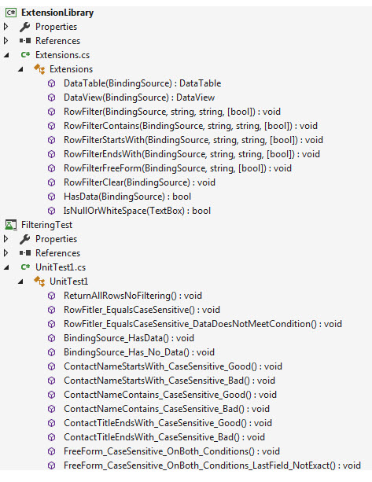

# BindingSource Filter with Starts, contains, ends with and case sensitive options
## Requires
- Visual Studio 2017
## License
- MIT
## Technologies
- Data Binding
- SQL Server
- DataTable
- Filter expression
- BindingSource
- dataview
## Topics
- Windows Forms
- Data filter
- BindingSource filtering
## Updated
- 03/10/2018
## Description

<h1>Description</h1>

This code sample focuses on filtering a BindingSource component where it&rsquo;s data source is a DataTable rather than filtering from the Filter property of a BindingSource. The reason is that many developers writing window
 form applications use a BindingSource in tangent with a TableAdapter or simply using a DataSet or DataTable and need case or case insensitive capabilities for filter where the BindingSource component filter does not have the ability to filter with case insensitive
 casing.

To provide this I created a language extension library which has extensions for a BindingSource with a DataSource set to a DataTable. There are methods focus on LIKE conditions for starts-with, ends-with and contains with one
 for a general equal, all provide an option for casing.

There is a language extensions library and a class project to load a Customers table where the class project would be for a production project yet only has enough functionality to load all of the data so we can use a unit test
 (also included) to test the extension methods against live data.

Many developers will create extension methods or functions in a class or write the functions in the form they will use the methods. I will not knock this but highly advocate using a class project to store the methods and optionally
 use extension methods as I have to allow for method based programming an allow these methods to be used in other applications.

There is no project with a user interface on purpose. First off many developers will more likely than not code directly in the form and when things go wrong have no clue how to fix the issues. If you start with a unit test project
 and have small test to test all scenarios that a user might enter into say Textbox controls to filter then there is less of a chance for issues in your actual project.

The unit test supplied goes through most common filtering, I kept things simple, no complex/compound filtering as we can in that case end up with a great deal of different filters. I will leave that up to you.

&nbsp;

How were the unit test written? I selected a generic table that could be in any application. Then in SQL-Server Management Studio ran SQL SELECT statements with case sensitive and case insensitive queries. Here is an example
 of one of the queries where I indicate that the query should be case sensitive.

&nbsp;

SQL

Edit|Remove

mysql
<pre class="hidden">SELECT  CustomerIdentifier ,
        CompanyName ,
        ContactName ,
        ContactTitle ,
        City ,
        PostalCode ,
        Country
FROM    Customers
WHERE   ContactTitle LIKE '%Manager'
        OR ContactTitle LIKE 'sales%' COLLATE Latin1_General_CS_AS;</pre>

<pre class="mysql">SELECT&nbsp;&nbsp;CustomerIdentifier&nbsp;,&nbsp;
&nbsp;&nbsp;&nbsp;&nbsp;&nbsp;&nbsp;&nbsp;&nbsp;CompanyName&nbsp;,&nbsp;
&nbsp;&nbsp;&nbsp;&nbsp;&nbsp;&nbsp;&nbsp;&nbsp;ContactName&nbsp;,&nbsp;
&nbsp;&nbsp;&nbsp;&nbsp;&nbsp;&nbsp;&nbsp;&nbsp;ContactTitle&nbsp;,&nbsp;
&nbsp;&nbsp;&nbsp;&nbsp;&nbsp;&nbsp;&nbsp;&nbsp;City&nbsp;,&nbsp;
&nbsp;&nbsp;&nbsp;&nbsp;&nbsp;&nbsp;&nbsp;&nbsp;PostalCode&nbsp;,&nbsp;
&nbsp;&nbsp;&nbsp;&nbsp;&nbsp;&nbsp;&nbsp;&nbsp;Country&nbsp;
FROM&nbsp;&nbsp;&nbsp;&nbsp;Customers&nbsp;
WHERE&nbsp;&nbsp;&nbsp;ContactTitle&nbsp;LIKE&nbsp;'%Manager'&nbsp;
&nbsp;&nbsp;&nbsp;&nbsp;&nbsp;&nbsp;&nbsp;&nbsp;OR&nbsp;ContactTitle&nbsp;LIKE&nbsp;'sales%'&nbsp;COLLATE&nbsp;Latin1_General_CS_AS;</pre>

Then write a unit test against the above query then followed that up with another test without&nbsp;COLLATE Latin1_General_CS_AS.&nbsp; Here are two test used for the above.

C#

Edit|Remove

csharp
<pre class="hidden">[TestMethod]
public void FreeForm_CaseSensitive_OnBoth_Conditions()
{
    var bsContact = new BindingSource();
    var ops = new DataOperations();
    bsContact.DataSource = ops.GetAll();
    bsContact.RowFilterFreeForm(&quot;ContactTitle LIKE '%Manager' OR ContactTitle LIKE 'Sales%'&quot;, true);
    Assert.IsTrue(bsContact.Count == 62, &quot;Expected 62 records&quot;);
}
/// &lt;summary&gt;
/// Deviation from above, note in the above test we had Sales case sensitive, here we kept case sensitive
/// but asked for sales which does not match what is in the table.
/// &lt;/summary&gt;
[TestMethod]
public void FreeForm_CaseSensitive_OnBoth_Conditions_LastField_NotExact()
{
    var bsContact = new BindingSource();
    var ops = new DataOperations();
    bsContact.DataSource = ops.GetAll();
    bsContact.RowFilterFreeForm(&quot;ContactTitle LIKE '%Manager' OR ContactTitle LIKE 'sales%'&quot;, true);
    Assert.IsTrue(bsContact.Count == 33, &quot;Expected 33 records&quot;);
}</pre>

<pre class="js">[TestMethod]&nbsp;
public&nbsp;void&nbsp;FreeForm_CaseSensitive_OnBoth_Conditions()&nbsp;
{&nbsp;
&nbsp;&nbsp;&nbsp;&nbsp;var&nbsp;bsContact&nbsp;=&nbsp;new&nbsp;BindingSource();&nbsp;
&nbsp;&nbsp;&nbsp;&nbsp;var&nbsp;ops&nbsp;=&nbsp;new&nbsp;DataOperations();&nbsp;
&nbsp;&nbsp;&nbsp;&nbsp;bsContact.DataSource&nbsp;=&nbsp;ops.GetAll();&nbsp;
&nbsp;&nbsp;&nbsp;&nbsp;bsContact.RowFilterFreeForm(&quot;ContactTitle&nbsp;LIKE&nbsp;'%Manager'&nbsp;OR&nbsp;ContactTitle&nbsp;LIKE&nbsp;'Sales%'&quot;,&nbsp;true);&nbsp;
&nbsp;&nbsp;&nbsp;&nbsp;Assert.IsTrue(bsContact.Count&nbsp;==&nbsp;62,&nbsp;&quot;Expected&nbsp;62&nbsp;records&quot;);&nbsp;
}&nbsp;
///&nbsp;&lt;summary&gt;&nbsp;
///&nbsp;Deviation&nbsp;from&nbsp;above,&nbsp;note&nbsp;in&nbsp;the&nbsp;above&nbsp;test&nbsp;we&nbsp;had&nbsp;Sales&nbsp;case&nbsp;sensitive,&nbsp;here&nbsp;we&nbsp;kept&nbsp;case&nbsp;sensitive&nbsp;
///&nbsp;but&nbsp;asked&nbsp;for&nbsp;sales&nbsp;which&nbsp;does&nbsp;not&nbsp;match&nbsp;what&nbsp;is&nbsp;in&nbsp;the&nbsp;table.&nbsp;
///&nbsp;&lt;/summary&gt;&nbsp;
[TestMethod]&nbsp;
public&nbsp;void&nbsp;FreeForm_CaseSensitive_OnBoth_Conditions_LastField_NotExact()&nbsp;
{&nbsp;
&nbsp;&nbsp;&nbsp;&nbsp;var&nbsp;bsContact&nbsp;=&nbsp;new&nbsp;BindingSource();&nbsp;
&nbsp;&nbsp;&nbsp;&nbsp;var&nbsp;ops&nbsp;=&nbsp;new&nbsp;DataOperations();&nbsp;
&nbsp;&nbsp;&nbsp;&nbsp;bsContact.DataSource&nbsp;=&nbsp;ops.GetAll();&nbsp;
&nbsp;&nbsp;&nbsp;&nbsp;bsContact.RowFilterFreeForm(&quot;ContactTitle&nbsp;LIKE&nbsp;'%Manager'&nbsp;OR&nbsp;ContactTitle&nbsp;LIKE&nbsp;'sales%'&quot;,&nbsp;true);&nbsp;
&nbsp;&nbsp;&nbsp;&nbsp;Assert.IsTrue(bsContact.Count&nbsp;==&nbsp;33,&nbsp;&quot;Expected&nbsp;33&nbsp;records&quot;);&nbsp;
}</pre>

&nbsp;Here we have the extensions and test in the Visual Studio solution

<h1 class="endscriptcode">To run the code</h1>

You will need to have SQL-Server installed and create the database using the supplied script located in Operations project.

 

<h1 class="endscriptcode">UPDATE</h1>

Added an overloaded version of RowFilter using an enum

C#

Edit|Remove

csharp
<pre class="hidden">public enum FilterCondition 
{
    StartsWith,
    Contains,
    EndsWith
}</pre>

<pre class="js">public&nbsp;enum&nbsp;FilterCondition&nbsp;&nbsp;
{&nbsp;
&nbsp;&nbsp;&nbsp;&nbsp;StartsWith,&nbsp;
&nbsp;&nbsp;&nbsp;&nbsp;Contains,&nbsp;
&nbsp;&nbsp;&nbsp;&nbsp;EndsWith&nbsp;
}</pre>

The extension.&nbsp;

C#

Edit|Remove

csharp
<pre class="hidden">/// &lt;summary&gt;
/// Provides filter for starts-with, contains or ends-with
/// &lt;/summary&gt;
/// &lt;param name=&quot;pSender&quot;&gt;&lt;/param&gt;
/// &lt;param name=&quot;pField&quot;&gt;Field to apply filter on&lt;/param&gt;
/// &lt;param name=&quot;pValue&quot;&gt;Value for filter&lt;/param&gt;
/// &lt;param name=&quot;pCondition&quot;&gt;Type of filter&lt;/param&gt;
/// &lt;param name=&quot;pCaseSensitive&quot;&gt;Filter should be case or case in-sensitive&lt;/param&gt;
public static void RowFilter(this BindingSource pSender, string pField, string pValue, 
    FilterCondition pCondition, bool pCaseSensitive = false)
{
    switch (pCondition)
    {
        case FilterCondition.StartsWith:
            pSender.RowFilterStartsWith(pField, pValue, pCaseSensitive);
            break;
        case FilterCondition.Contains:
            pSender.RowFilterContains(pField, pValue, pCaseSensitive);
            break;
        case FilterCondition.EndsWith:
            pSender.RowFilterEndsWith(pField, pValue, pCaseSensitive);
            break;
        default:
            break;
    }
}</pre>

<pre class="js">///&nbsp;&lt;summary&gt;&nbsp;
///&nbsp;Provides&nbsp;filter&nbsp;for&nbsp;starts-with,&nbsp;contains&nbsp;or&nbsp;ends-with&nbsp;
///&nbsp;&lt;/summary&gt;&nbsp;
///&nbsp;&lt;param&nbsp;name=&quot;pSender&quot;&gt;&lt;/param&gt;&nbsp;
///&nbsp;&lt;param&nbsp;name=&quot;pField&quot;&gt;Field&nbsp;to&nbsp;apply&nbsp;filter&nbsp;on&lt;/param&gt;&nbsp;
///&nbsp;&lt;param&nbsp;name=&quot;pValue&quot;&gt;Value&nbsp;for&nbsp;filter&lt;/param&gt;&nbsp;
///&nbsp;&lt;param&nbsp;name=&quot;pCondition&quot;&gt;Type&nbsp;of&nbsp;filter&lt;/param&gt;&nbsp;
///&nbsp;&lt;param&nbsp;name=&quot;pCaseSensitive&quot;&gt;Filter&nbsp;should&nbsp;be&nbsp;case&nbsp;or&nbsp;case&nbsp;in-sensitive&lt;/param&gt;&nbsp;
public&nbsp;static&nbsp;void&nbsp;RowFilter(this&nbsp;BindingSource&nbsp;pSender,&nbsp;string&nbsp;pField,&nbsp;string&nbsp;pValue,&nbsp;&nbsp;
&nbsp;&nbsp;&nbsp;&nbsp;FilterCondition&nbsp;pCondition,&nbsp;bool&nbsp;pCaseSensitive&nbsp;=&nbsp;false)&nbsp;
{&nbsp;
&nbsp;&nbsp;&nbsp;&nbsp;switch&nbsp;(pCondition)&nbsp;
&nbsp;&nbsp;&nbsp;&nbsp;{&nbsp;
&nbsp;&nbsp;&nbsp;&nbsp;&nbsp;&nbsp;&nbsp;&nbsp;case&nbsp;FilterCondition.StartsWith:&nbsp;
&nbsp;&nbsp;&nbsp;&nbsp;&nbsp;&nbsp;&nbsp;&nbsp;&nbsp;&nbsp;&nbsp;&nbsp;pSender.RowFilterStartsWith(pField,&nbsp;pValue,&nbsp;pCaseSensitive);&nbsp;
&nbsp;&nbsp;&nbsp;&nbsp;&nbsp;&nbsp;&nbsp;&nbsp;&nbsp;&nbsp;&nbsp;&nbsp;break;&nbsp;
&nbsp;&nbsp;&nbsp;&nbsp;&nbsp;&nbsp;&nbsp;&nbsp;case&nbsp;FilterCondition.Contains:&nbsp;
&nbsp;&nbsp;&nbsp;&nbsp;&nbsp;&nbsp;&nbsp;&nbsp;&nbsp;&nbsp;&nbsp;&nbsp;pSender.RowFilterContains(pField,&nbsp;pValue,&nbsp;pCaseSensitive);&nbsp;
&nbsp;&nbsp;&nbsp;&nbsp;&nbsp;&nbsp;&nbsp;&nbsp;&nbsp;&nbsp;&nbsp;&nbsp;break;&nbsp;
&nbsp;&nbsp;&nbsp;&nbsp;&nbsp;&nbsp;&nbsp;&nbsp;case&nbsp;FilterCondition.EndsWith:&nbsp;
&nbsp;&nbsp;&nbsp;&nbsp;&nbsp;&nbsp;&nbsp;&nbsp;&nbsp;&nbsp;&nbsp;&nbsp;pSender.RowFilterEndsWith(pField,&nbsp;pValue,&nbsp;pCaseSensitive);&nbsp;
&nbsp;&nbsp;&nbsp;&nbsp;&nbsp;&nbsp;&nbsp;&nbsp;&nbsp;&nbsp;&nbsp;&nbsp;break;&nbsp;
&nbsp;&nbsp;&nbsp;&nbsp;&nbsp;&nbsp;&nbsp;&nbsp;default:&nbsp;
&nbsp;&nbsp;&nbsp;&nbsp;&nbsp;&nbsp;&nbsp;&nbsp;&nbsp;&nbsp;&nbsp;&nbsp;break;&nbsp;
&nbsp;&nbsp;&nbsp;&nbsp;}&nbsp;
}</pre>

&nbsp;

One of the test.

C#

Edit|Remove

csharp
<pre class="hidden">[TestMethod]
public void ContactTitleEndsWith_CaseSensitive_OverLoad_Good()
{
    var bsContact = new BindingSource();
    var ops = new DataOperations();
    bsContact.DataSource = ops.GetAll();
    bsContact.RowFilter(&quot;ContactTitle&quot;, &quot;Manager&quot;, Extensions.FilterCondition.EndsWith, true);
    Assert.IsTrue(bsContact.Count == 33, &quot;Expected 33 records&quot;);
}</pre>

<pre class="csharp">[TestMethod]&nbsp;
public&nbsp;void&nbsp;ContactTitleEndsWith_CaseSensitive_OverLoad_Good()&nbsp;
{&nbsp;
&nbsp;&nbsp;&nbsp;&nbsp;var&nbsp;bsContact&nbsp;=&nbsp;new&nbsp;BindingSource();&nbsp;
&nbsp;&nbsp;&nbsp;&nbsp;var&nbsp;ops&nbsp;=&nbsp;new&nbsp;DataOperations();&nbsp;
&nbsp;&nbsp;&nbsp;&nbsp;bsContact.DataSource&nbsp;=&nbsp;ops.GetAll();&nbsp;
&nbsp;&nbsp;&nbsp;&nbsp;bsContact.RowFilter(&quot;ContactTitle&quot;,&nbsp;&quot;Manager&quot;,&nbsp;Extensions.FilterCondition.EndsWith,&nbsp;true);&nbsp;
&nbsp;&nbsp;&nbsp;&nbsp;Assert.IsTrue(bsContact.Count&nbsp;==&nbsp;33,&nbsp;&quot;Expected&nbsp;33&nbsp;records&quot;);&nbsp;
}</pre>

&nbsp;

EDIT: Source code has been

<ul>
<li>Updated to Visual Studio 2017 </li><li>Added new extensions for filtering </li><li>Added a extension method to escape apostrophes in filter values
</li></ul>

&nbsp;

&nbsp;

 

