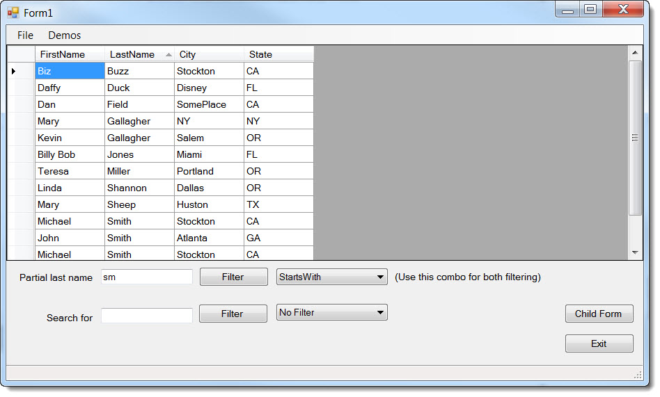

# BindingSource Find and Filtering basics to advance operations
## Requires
- Visual Studio 2012
## License
- Apache License, Version 2.0
## Technologies
- Windows Forms
- BindingSource
## Topics
- Data Binding
- Data Access
## Updated
- 06/11/2014
## Description

<h1>Introduction</h1>

The intent here is to demonstrate two things, filtering and finding data using the BindingSource. &nbsp;When working with data in Windows form projects were there are classes generated by a data wizard in the Visual Studio IDE
 a BindingSource component (class) is utilized for traversing data via a Binding Navigator control. For novice developers learning to use these classes past simple operations can be frustrating.

<h1>UPDATE 1/23/2014&nbsp;</h1>

I created a VS2010 solution but excluded the SQL-Server demo, only does MS-Access. The VS2010 solution is on
<a href="https://skydrive.live.com/redir?resid=A3D5A9A9A28080D1!488&authkey=!ALcKUufEdhNmyIc&ithint=file%2c.zip">
SkyDrive here</a>. 
 
<strong>See also</strong> <a href="http://code.msdn.microsoft.com/Working-with-a-BindingSourc-d8f4051d">
Custom BindingSource</a>.

Description

A BindingSource can also be used when manually accessing data using one of the native data providers i.e. SqlClient, OleDb or a third party data provider such as IBM-DB2. The Visual Studio 2012 solution is broken down as follows,
 one class project for reading data from a MS-Access MDB database, another class project for language extension methods for working with filtering and finding data specifically with a BindingSource instance. There are two Windows Forms projects which uses the
 two class projects. One of the projects uses a MS-SQL Server local database to demonstrate using the BindingSource extensions to locate data. The other Windows Form project works against the MS-Access database. Both work at the DataTable level.

In WindowsApplication1 (a windows form project) there are four child forms. DateForm demonstrates how to locate a specific record/row by a specific date. IncSearchForm demonstrates how to find the first row that starts with
 specific characters using an extension. There is a ComboBox which allows for the demonstration you to select which field to find data with. Caveat, even though I have in short hard coded the search to the start of a field in the form MultiColumnSearch there
 is a demonstration that shows how to use the like operator and have an enumeration to do a starts with, contains or ends with search. This logic can be used in the search in incSearchForm to extend past starts with search.

In the MultiColumnSearch form there is code which demonstrates using a like operator to do starts with, contains and end with searchs.

One of my pet peeves is when a developer creates an application, displays data in a DataGridView but does not consider keeping the current row current after a sort operation has completed. In all of the child forms you will
 find simple code to keep the current row prior to a sort current after a sort.

Lastly, the best way to learn with this solution is to first review the code, build/run the main project. Now go back and dig deeper into the code and see what is under the covers. The core code is in BindingSourceExtensions.vb
 in the project LanguageExtensionsLibrary.

<h1><em><em>&nbsp;</em></em></h1>
<h1>More Information</h1>

Check out <a href="http://code.msdn.microsoft.com/Basics-of-manuall-creating-aa1a5c3d" target="_blank">
my article on Master/Details</a> with a BindingSource.

Will be doing another article on adding and editing data with a BindingSource.

