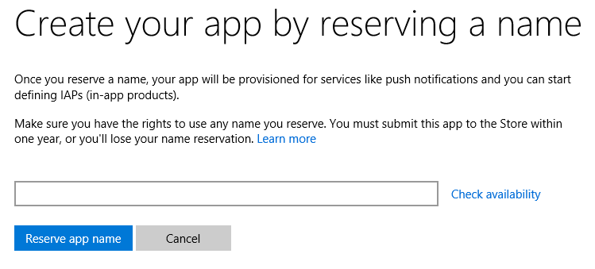
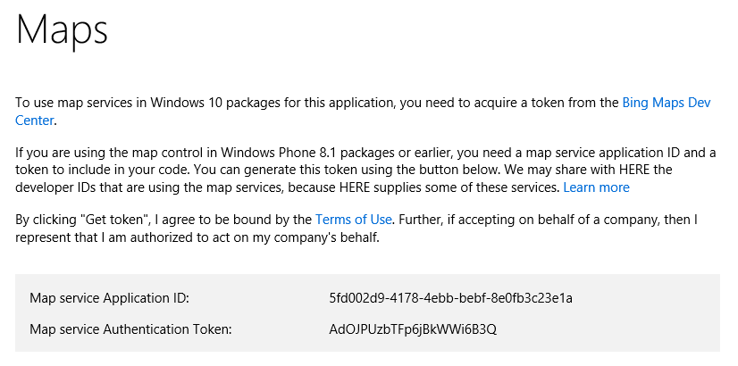
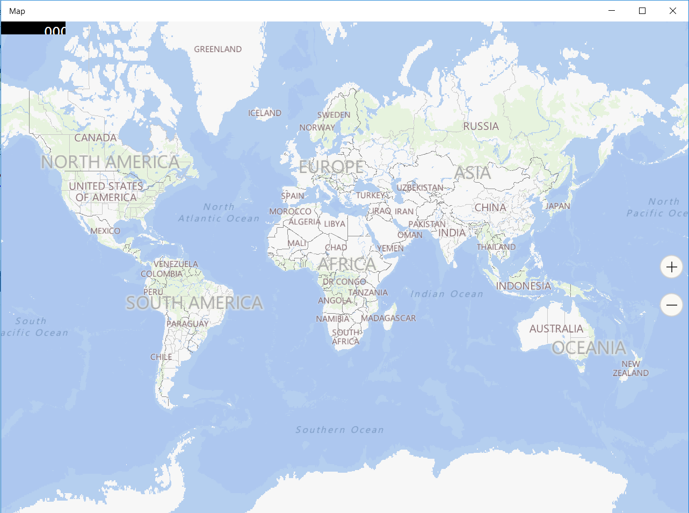

# Bing Maps for Windows 10 Application (UWP)
## Requires
- Visual Studio 2015
## License
- MIT
## Technologies
- C#
- Bing Maps
- Windows Phone
- universal windows app
- Windows 10
## Topics
- C#
- Bing Maps
- Windows Phone
- universal app
- Windows 10
## Updated
- 01/05/2016
## Description

<h1>Introduction</h1>

After beginning your universal app with creating your wonderful
<a href="https://code.msdn.microsoft.com/Splash-Screen-in-Universal-42c0b57a">splashcreen</a>, the MapControl is now part of the Windows.UI.Xaml.Controls namespace. If you've created a previous application that integrates with the old Bing Maps control, you'll
 find the new implementation minimal since the changes are only slight.

<h1>Building the Sample</h1>

1- First of all you have to navigate to your <a href="https://dev.windows.com/overview">
developer dashboard</a> in the Windows Dev Center.<strong>&nbsp;</strong>

2- If you haven't yet, <a href="https://msdn.microsoft.com/en-us/library/windows/apps/xaml/jj657967.aspx">
reserve your app's name</a>.

<strong>&nbsp;</strong><em>&nbsp;</em>

3- Look for the <strong>Services</strong> section in the left navigation menu, and expand it to show the
<strong>Maps</strong> page.

4- Click <strong>Get token</strong>, the <strong>ApplicationID</strong> and <strong>
AuthenticationToken</strong> will be generated and will appear on this page.<em> 
</em>

<em></em>

&nbsp;

XAML

Edit|Remove

xaml

<pre class="xaml">&lt;Maps:MapControl&nbsp;
&nbsp;&nbsp;&nbsp;&nbsp;&nbsp;&nbsp;&nbsp;&nbsp;&nbsp;&nbsp;&nbsp;&nbsp;x:Name=&quot;Map&quot;&nbsp;
&nbsp;&nbsp;&nbsp;&nbsp;&nbsp;&nbsp;&nbsp;&nbsp;&nbsp;&nbsp;&nbsp;&nbsp;MapServiceToken=&quot;Enter&nbsp;your&nbsp;mapservicetoken&quot;&nbsp;
&nbsp;&nbsp;&nbsp;&nbsp;&nbsp;&nbsp;&nbsp;&nbsp;&nbsp;&nbsp;&nbsp;&nbsp;ZoomInteractionMode=&quot;GestureAndControl&quot;&nbsp;
&nbsp;&nbsp;&nbsp;&nbsp;&nbsp;&nbsp;&nbsp;&nbsp;&nbsp;&nbsp;&nbsp;&nbsp;LandmarksVisible=&quot;True&quot;&nbsp;
&nbsp;&nbsp;&nbsp;&nbsp;&nbsp;&nbsp;&nbsp;&nbsp;&nbsp;&nbsp;&nbsp;&nbsp;IsRightTapEnabled=&quot;true&quot;&nbsp;
&nbsp;&nbsp;&nbsp;&nbsp;&nbsp;&nbsp;&nbsp;&nbsp;&nbsp;&nbsp;&nbsp;/&gt;</pre>

<h1></h1>

There are some major improvements with the updates to the universal app model that will see more controls across WinRT being unified so that they can be used across multiple devices and multiple platforms.

This makes it much easier for developers to create maps within their applications in an MVVM friendly way with the freedom to customise them as they wish.<strong>&nbsp;</strong><em>&nbsp;</em>

Let me know in the comments below if you've had a go with the Windows 10 SDK and what you think of some of the changes you've found!
<strong>&nbsp;</strong><em>&nbsp;</em>

<h1>Source Code Files</h1>
<ul>
<li><em>MainPage.xaml&nbsp;- summary for this source code file.</em> </li></ul>
<h1>More Information</h1>

<em>For more information , you can contact me through my website : <a href="http://www.hjaiejchourouk.com">
hjaiejchourouk.com/</a></em>

