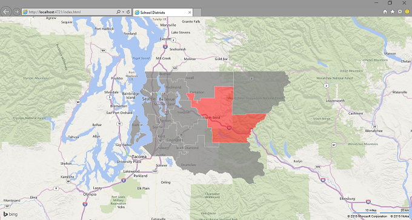

# Bing Maps, D3 and TopoJSON
## Requires
- Visual Studio 2015
## License
- MIT
## Technologies
- Bing Maps
- Apache Cordova
- d3
- TopoJSON
## Topics
- AJAX
- Maps
- data visualization
- Bing Maps
- Apache Cordova
- geospatial
- Cross-Platform
## Updated
- 03/02/2015
## Description

<h1>Introduction</h1>

<em><em>This sample leverages the Bing Maps AJAX Control version, D3.js and TopoJSON to render geospatial data as SVG</em></em>

<h1>Description</h1>

<em><em>The sample visulizes the school district areas in King County as a D3 overlay on top of Bing Maps.The Bing Maps AJAX Control v7 comes as a small core control that can be extended through modules such as search, directions, venue maps, traffic, themes,
 advanced shapes or custom modules. A number of <a href="https://bingmapsv7modules.codeplex.com/" target="_blank">
custrom modules</a> is available on CodePlex.</em></em><em><em>T</em>he D3.js Map Overlay Module for the Bing Maps AJAX Control version 7 was developed by Ricky Brundritt and is available. The source data come from the
<a href="http://www5.kingcounty.gov/gisdataportal/Default.aspx" target="_blank">King County GIS Data Portal</a>.</em>

<em><em><em>The project was built using Visual Studio 2015 CTP 6. However, all code is written in HTML, JavaScript and CSS and can be imported in older versions of Visual Studio as well. The mobile device application is written with the Apache Cordova Tools
 for Visual Studio.&nbsp;</em></em></em>

<em><em><em>&nbsp;</em></em></em><em><em><em>In order to run the sample you will need a Bing Maps key. If you don't have one yet, you can sign up or a free Bing Maps developer account&nbsp;<a href="https://www.bingmapsportal.com/" target="_blank">here</a>.Once
 you have a key use it to replace the place-holder in index.js:&nbsp;</em></em></em>

<em><em><em>

JavaScript

Edit|Remove

js
<pre class="hidden">var bmKey = &quot;YOUR_BING_MAPS_KEY&quot;;</pre>

<pre class="js">var&nbsp;bmKey&nbsp;=&nbsp;&quot;YOUR_BING_MAPS_KEY&quot;;</pre>

</em></em></em>

<em><em><em>&nbsp;</em></em></em>

<em><em><em>Happy Mapping!</em></em></em>

<em><em><em>&nbsp;</em></em></em>

<em><em><em>&nbsp;</em></em></em>

<em><em><em>&nbsp;</em></em></em>

<em><em><em>

<em></em>

</em></em></em>

&nbsp;

&nbsp;

&nbsp;

&nbsp;

&nbsp;

<h1>Source Code Files</h1>
<ul>
<li>D3-TopoJSON.zip: Website </li><li>D3-TopoJSON-Cordova.zip: cross-platform mobile app build with Visual Studio Tools for Apache Cordova 
</li></ul>
