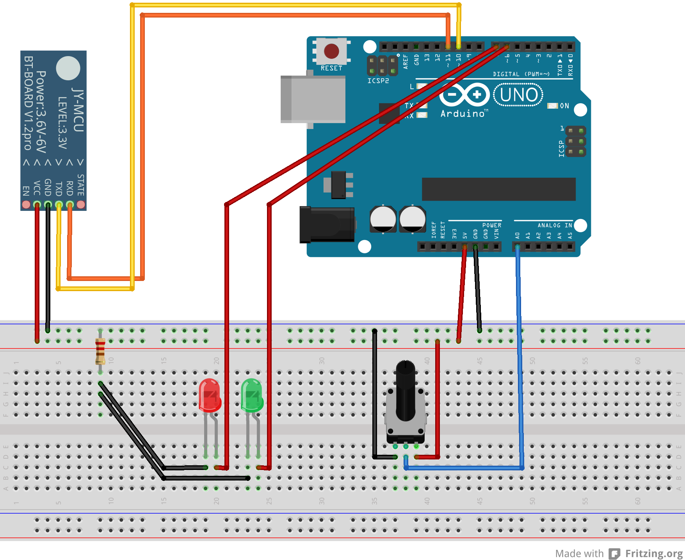

# Bluetooth communication between Arduino and Windows 8.1
## Requires
- Visual Studio 2013
## License
- MS-LPL
## Technologies
- Bluetooth
- arduino
- Windows 8.1
## Topics
- Bluetooth
- Bluetooth RF Comm
## Updated
- 11/13/2014
## Description

<h1>Introduction</h1>

In this sample you can learn how to establish a serial Bluetooth link between an Arduino and a Windows 8.1 app.<em> 
</em>

<h1>Building the Sample</h1>

To test this, you need an <strong>Arduino with Bluetooth capabilities</strong> (for example an Arduino Uno R3 and a JY-MCU Bluetooth module) and a
<strong>Windows 8.1 device with Bluetooth</strong> capabilities. (A Bluetooth dongle will do as well.)

The sample is provided as a Visual Studio 2013 solution that includes the Windows Store app code and the Arduino code. You can open the Arduino code with the default Arduino IDE.

This sample was inspired by and is based on the <a href="http://developer.nokia.com/Community/Wiki/Windows_Phone_8_communicating_with_Arduino_using_Bluetooth" target="_blank">
Windows Phone 8 implementation of Bluetooth/Arduino communication</a> by Marcos Pereira. This
<a href="http://channel9.msdn.com/Events/Build/2013/3-026" target="_blank">BUILD talk by Ellick Sung</a> and the related sample application were also helpful in porting the code to WinRT.<em> 
</em>

Description

Set up the Arduino with a <strong>Bluetooth module, two LEDs and a potentiometer</strong>, according to the following diagram:

<em> 
</em>

Communication with the Bluetooth module is accomplished using the <strong>SoftwareSerial.h</strong> library.

The Windows 8.1 app has to <strong>declare Bluetooth serial communication capabilities in Package.appxmanifest</strong>:

&nbsp;

XML

Edit|Remove

xml

<pre class="xml">&lt;Capabilities&gt;&nbsp;
&nbsp;&nbsp;&lt;m2:DeviceCapability&nbsp;Name=&quot;bluetooth.rfcomm&quot;&gt;&nbsp;
&nbsp;&nbsp;&nbsp;&nbsp;&lt;m2:Device&nbsp;Id=&quot;any&quot;&gt;&nbsp;
&nbsp;&nbsp;&nbsp;&nbsp;&nbsp;&nbsp;&lt;m2:Function&nbsp;Type=&quot;name:serialPort&quot;&nbsp;/&gt;&nbsp;
&nbsp;&nbsp;&nbsp;&nbsp;&lt;/m2:Device&gt;&nbsp;
&nbsp;&nbsp;&lt;/m2:DeviceCapability&gt;&nbsp;
&lt;/Capabilities&gt;</pre>

To deploy the Arduino code with VisualMicro, right click the Project in the Solution Explorer and select Debug\Start new instance.

<strong>IMPORTANT: Before running the Windows App you need to &quot;pair&quot; your Bluetooth device with your computer. To do this, go to the &quot;PC Settings&quot; and select Devices/Bluetooth. Then select your Bluetooth device, enter the pin (try 1234 if you are not sure..)
 and the device will be paired. (You only have to do this once!)</strong>

When the Windows 8.1 app starts, you can establish a connection and control the LEDs, or subscribe to analog inputs as seen in the following video:

&lt;object type=&quot;application/x-silverlight-2&quot; width=&quot;350&quot; height=&quot;300&quot; data=&quot;data:application/x-silverlight-2,&quot;&gt; &lt;param name=&quot;source&quot; value=&quot;/Content/Common/videoplayer.xap&quot; /&gt; &lt;param name=&quot;initParams&quot; value=&quot;deferredLoad=false,duration=0,m=http://i1.code.msdn.s-msft.com/bluetooth-communication-7130c260/image/file/113904/1/bluetoothcommunicationsample.wmv,autostart=false,autohide=true,showembed=true&quot;
 /&gt; &lt;param name=&quot;background&quot; value=&quot;#00FFFFFF&quot; /&gt; &lt;param name=&quot;minRuntimeVersion&quot; value=&quot;3.0.40624.0&quot; /&gt; &lt;param name=&quot;enableHtmlAccess&quot; value=&quot;true&quot; /&gt; &lt;param name=&quot;src&quot; value=&quot;http://i1.code.msdn.s-msft.com/bluetooth-communication-7130c260/image/file/113904/1/bluetoothcommunicationsample.wmv&quot;
 /&gt; &lt;param name=&quot;id&quot; value=&quot;113904&quot; /&gt; &lt;param name=&quot;name&quot; value=&quot;BluetoothCommunicationSample.wmv&quot; /&gt;
 &lt;/object&gt;  
<em>&nbsp;</em><a id="x_/site/view/file/97046/1/BluetoothCommunicationSample.wmv" href="http://code.msdn.microsoft.com/site/view/file/97046/1/BluetoothCommunicationSample.wmv">Download video</a>

<a href="http://www.youtube.com/watch?v=lhj0aShdcz8" target="_blank">Youtube backup link</a>

<h1>Source Code Files</h1>
<ul>
<li>BluetoothCommunicationSample.zip - VS 2013 solution with Arduino &amp; Windows 8.1 code
</li></ul>
<h1>More Information</h1>

For more information on this sample, see <a href="http://blog.mosthege.net/2013/09/24/bluetooth-communication-between-arduino-and-windows-8-1" target="_blank">
my blogpost about it</a>.

