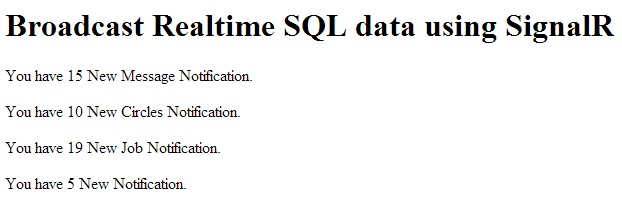

# Broadcast Real-time SQL data using SignalR
## Requires
- Visual Studio 2013
## License
- Apache License, Version 2.0
## Technologies
- C#
- ASP.NET
- .NET Framework
- SignalR
- ASP.NET SignalR
- SignalR 2.0
## Topics
- Broadcast data using SIgnalR
- How to show data using SignalR
- How to load sql data without page refresh
- how to get notification without page refresh
- how to display data without page refresh
- how to user signalr in asp.net
- signalr with asp.net
## Updated
- 03/31/2014
## Description

<strong>Introduction</strong>

<strong>SignalR &ndash; </strong>SignalR is an ASP.Net server library for adding real-time functionality to a web application. This includes client libraries for JavaScript and other clients.<strong>&nbsp;</strong>

Building the Sample

<strong>Getting started</strong> 
 
to get started with SignalR:

<ul>
<li>

Start Visual Studio 2013

</li><li>

Create a new website

</li><li>

Provide the name and location of website

</li><li>

Click &quot;Next&quot;

</li></ul>

<strong style="font-size:small">Install SignalR</strong>

<strong> 
</strong>Click &quot;Tools&quot; | &quot;Library Package Manager&quot; | &quot;Package Manager Console&quot; and run&nbsp;the command: &quot;<strong>install-package Microsoft.AspNet.SignalR&quot;</strong>

&nbsp;

Screenshot 1. 
 
Or&nbsp; 
 
Install using NuGet package Manager, right-click on &quot;Project&quot; and click on &quot;Manage Nuget packages&quot; and search for &quot;SignalR&quot; then click &quot;Install&quot;.

&nbsp;

Screenshot 2.

This is my database table screenshot.

&nbsp;

Screenshot 3.

Now define connection string in web.config.

&lt;connectionStrings&gt;

&lt;add name=&quot;DefaultConnection&quot; connectionString=&quot;data source=SERVER-NAME;database=DATABASENAME;user id =USERID;password=PASSOWRD&quot; providerName=&quot;System.Data.SqlClient&quot; /&gt;

&lt;/connectionStrings&gt;

Now add a new hub class

&nbsp;

Screenshot 4.

&nbsp;

&nbsp;

C#

Edit|Remove

csharp 
<pre class="hidden">NotificationHub.cs

using Microsoft.AspNet.SignalR;
using Microsoft.AspNet.SignalR.Hubs;

[HubName(&quot;notificationHub&quot;)]
public class NotificationHub : Hub
{
    private static readonly ConcurrentDictionary&lt;string, User&gt; Users = new ConcurrentDictionary&lt;string, User&gt;(StringComparer.InvariantCultureIgnoreCase);

    #region Methods
    /// &lt;summary&gt;
    /// Provides the handler for SignalR OnConnected event
    /// supports async threading
    /// &lt;/summary&gt;
    /// &lt;returns&gt;&lt;/returns&gt;
    public override Task OnConnected()
    {
        string profileId = &quot;111&quot;; //Context.QueryString[&quot;id&quot;];
        string connectionId = Context.ConnectionId;
        var user = Users.GetOrAdd(profileId, _ =&gt; new User
        {
            ProfileId = profileId,
            ConnectionIds = new HashSet&lt;string&gt;()
        });
        lock (user.ConnectionIds)
        {
            user.ConnectionIds.Add(connectionId);
            Groups.Add(connectionId, user.ProfileId);
        }
        return base.OnConnected();
    }

    /// &lt;summary&gt;
    /// Provides the handler for SignalR OnDisconnected event
    /// supports async threading
    /// &lt;/summary&gt;
    /// &lt;returns&gt;&lt;/returns&gt;
    public override Task OnDisconnected()
    {
        string profileId = Context.QueryString[&quot;id&quot;];
        string connectionId = Context.ConnectionId;
        User user;
        Users.TryGetValue(profileId, out user);
        if (user != null)
        {
            lock (user.ConnectionIds)
            {
                user.ConnectionIds.RemoveWhere(cid =&gt; cid.Equals(connectionId));
                Groups.Remove(connectionId, user.ProfileId);
                if (!user.ConnectionIds.Any())
                {
                    User removedUser;
                    Users.TryRemove(profileId, out removedUser);
                }
            }
        }
        return base.OnDisconnected();
    }

    /// &lt;summary&gt;
    /// Provides the handler for SignalR OnReconnected event
    /// supports async threading
    /// &lt;/summary&gt;
    /// &lt;returns&gt;&lt;/returns&gt;
    public override Task OnReconnected()
    {
        return base.OnReconnected();
    }

    /// &lt;summary&gt;
    /// Provides the facility to send individual user notification message
    /// &lt;/summary&gt;
    /// &lt;param name=&quot;profileId&quot;&gt;
    /// Set to the ProfileId of user who will receive the notification
    /// &lt;/param&gt;
    /// &lt;param name=&quot;message&quot;&gt;
    /// set to the notification message
    /// &lt;/param&gt;
    public void Send(string profileId, string message)
    {
        //Clients.User(profileId).send(message);
    }

    /// &lt;summary&gt;
    /// Provides the facility to send group notification message
    /// &lt;/summary&gt;
    /// &lt;param name=&quot;username&quot;&gt;
    /// set to the user groupd name who will receive the message
    /// &lt;/param&gt;
    /// &lt;param name=&quot;message&quot;&gt;
    /// set to the notification message
    /// &lt;/param&gt;
    public void SendUserMessage(String username, String message)
    {
        Clients.Group(username).sendUserMessage(message);
    }

    /// &lt;summary&gt;
    /// Provides the ability to get User from the dictionary for passed in profileId
    /// &lt;/summary&gt;
    /// &lt;param name=&quot;profileId&quot;&gt;
    /// set to the profileId of user that need to be fetched from the dictionary
    /// &lt;/param&gt;
    /// &lt;returns&gt;
    /// return User object if found otherwise returns null
    /// &lt;/returns&gt;
    private User GetUser(string profileId)
    {
        User user;
        Users.TryGetValue(profileId, out user);
        return user;
    }

    /// &lt;summary&gt;
    /// Provide theability to get currently connected user
    /// &lt;/summary&gt;
    /// &lt;returns&gt;
    /// profileId of user based on current connectionId
    /// &lt;/returns&gt;
    public IEnumerable&lt;string&gt; GetConnectedUser()
    {
        return Users.Where(x =&gt;
        {
            lock (x.Value.ConnectionIds)
            {
                return !x.Value.ConnectionIds.Contains(Context.ConnectionId, StringComparer.InvariantCultureIgnoreCase);
            }
        }).Select(x =&gt; x.Key);
    }
    #endregion

    Int16 totalNewMessages = 0;
    Int16 totalNewCircles = 0;
    Int16 totalNewJobs = 0;
    Int16 totalNewNotification = 0;

    [HubMethodName(&quot;sendNotifications&quot;)]
    public string SendNotifications()
    {
        using (var connection = new SqlConnection(ConfigurationManager.ConnectionStrings[&quot;DefaultConnection&quot;].ConnectionString))
        {
            string query = &quot;SELECT  NewMessageCount, NewCircleRequestCount, NewNotificationsCount, NewJobNotificationsCount FROM [dbo].[Modeling_NewMessageNotificationCount] WHERE UserProfileId=&quot; &#43; &quot;62021&quot;;
            connection.Open();
            using (SqlCommand command = new SqlCommand(query, connection))
            {
                try { 
                command.Notification = null;
                DataTable dt = new DataTable();
                SqlDependency dependency = new SqlDependency(command);
                dependency.OnChange &#43;= new OnChangeEventHandler(dependency_OnChange);                
                if (connection.State == ConnectionState.Closed)
                    connection.Open();
                var reader = command.ExecuteReader();
                dt.Load(reader);
                if (dt.Rows.Count &gt; 0)
                {
                    totalNewMessages = Int16.Parse(dt.Rows[0][&quot;NewMessageCount&quot;].ToString());
                    totalNewCircles = Int16.Parse(dt.Rows[0][&quot;NewCircleRequestCount&quot;].ToString());
                    totalNewJobs = Int16.Parse(dt.Rows[0][&quot;NewJobNotificationsCount&quot;].ToString());
                    totalNewNotification = Int16.Parse(dt.Rows[0][&quot;NewNotificationsCount&quot;].ToString());
                }
                connection.Close();
            }
            catch(Exception ex)
            {
                throw;
            }
            }
        }
        IHubContext context = GlobalHost.ConnectionManager.GetHubContext&lt;NotificationHub&gt;();
        return context.Clients.All.RecieveNotification(totalNewMessages, totalNewCircles, totalNewJobs, totalNewNotification);
    }

    private void dependency_OnChange(object sender, SqlNotificationEventArgs e)
    {
        if (e.Type == SqlNotificationType.Change)
        {
            NotificationHub nHub = new NotificationHub();
            nHub.SendNotifications();
        }
    }
}

Startup.cs
[assembly: OwinStartup(&quot;TestingConfiguration&quot;, typeof(EmployeeStartup))]
    public class EmployeeStartup
    {
        public void Configuration(IAppBuilder app)
        {
            app.MapSignalR();          
        }
    }
User.cs
    #region Properties

    /// &lt;summary&gt;
    /// Property to get/set ProfileId
    /// &lt;/summary&gt;
    public string ProfileId
    {
        get;
        set;
    }

    /// &lt;summary&gt;
    /// Propoerty to get/set multiple ConnectionId
    /// &lt;/summary&gt;
    public HashSet&lt;string&gt; ConnectionIds
    {
        get;
        set;
    }

    #endregion
}

Index.html
&lt;head&gt;
    &lt;title&gt;New Notifications&lt;/title&gt;
    &lt;script src=&quot;Scripts/jquery-1.6.4.min.js&quot;&gt;&lt;/script&gt;
    &lt;script src=&quot;Scripts/jquery.signalR-2.0.2.min.js&quot;&gt;&lt;/script&gt;        
    &lt;script src=&quot;signalr/hubs&quot;&gt;&lt;/script&gt;
    &lt;script type=&quot;text/javascript&quot;&gt;
        $(function () {            
            // Declare a proxy to reference the hub.
            var notifications = $.connection.notificationHub;
            debugger;
            // Create a function that the hub can call to broadcast messages.
            notifications.client.recieveNotification = function (totalNewMessages, totalNewCircles, totalNewJobs, totalNewNotifications) {
                // Add the message to the page.                
                $('#spanNewMessages').text(totalNewMessages);
                $('#spanNewCircles').text(totalNewCircles);
                $('#spanNewJobNotifications').text(totalNewJobs);
                $('#spanNewNotifications').text(totalNewNotifications);
            };
            // Start the connection.
            $.connection.hub.start().done(function () {
                notifications.server.sendNotifications();
            }).fail(function (e) {
                alert(e);
            });
            //$.connection.hub.start();            
        });
    &lt;/script&gt;
&lt;/head&gt;
&lt;body&gt;
    &lt;h1&gt;Broadcast Realtime SQL data using SignalR&lt;/h1&gt;
    &lt;div&gt;
        &lt;p&gt;You have &lt;span id=&quot;spanNewMessages&quot;&gt;0&lt;/span&gt; New Message Notification.&lt;/p&gt;
        &lt;p&gt;You have &lt;span id=&quot;spanNewCircles&quot;&gt;0&lt;/span&gt; New Circles Notification.&lt;/p&gt;
        &lt;p&gt;You have &lt;span id=&quot;spanNewJobNotifications&quot;&gt;0&lt;/span&gt; New Job Notification.&lt;/p&gt;
        &lt;p&gt;You have &lt;span id=&quot;spanNewNotifications&quot;&gt;0&lt;/span&gt; New Notification.&lt;/p&gt;
    &lt;/div&gt;
&lt;/body&gt;
</pre>

<pre class="csharp"><strong>NotificationHub.cs&nbsp;</strong>
&nbsp;
using&nbsp;Microsoft.AspNet.SignalR;&nbsp;
using&nbsp;Microsoft.AspNet.SignalR.Hubs;&nbsp;
&nbsp;
[HubName(&quot;notificationHub&quot;)]&nbsp;
public&nbsp;class&nbsp;NotificationHub&nbsp;:&nbsp;Hub&nbsp;
{&nbsp;
&nbsp;&nbsp;&nbsp;&nbsp;private&nbsp;static&nbsp;readonly&nbsp;ConcurrentDictionary&lt;string,&nbsp;User&gt;&nbsp;Users&nbsp;=&nbsp;new&nbsp;ConcurrentDictionary&lt;string,&nbsp;User&gt;(StringComparer.InvariantCultureIgnoreCase);&nbsp;
&nbsp;
&nbsp;&nbsp;&nbsp;&nbsp;#region&nbsp;Methods&nbsp;
&nbsp;&nbsp;&nbsp;&nbsp;///&nbsp;&lt;summary&gt;&nbsp;
&nbsp;&nbsp;&nbsp;&nbsp;///&nbsp;Provides&nbsp;the&nbsp;handler&nbsp;for&nbsp;SignalR&nbsp;OnConnected&nbsp;event&nbsp;
&nbsp;&nbsp;&nbsp;&nbsp;///&nbsp;supports&nbsp;async&nbsp;threading&nbsp;
&nbsp;&nbsp;&nbsp;&nbsp;///&nbsp;&lt;/summary&gt;&nbsp;
&nbsp;&nbsp;&nbsp;&nbsp;///&nbsp;&lt;returns&gt;&lt;/returns&gt;&nbsp;
&nbsp;&nbsp;&nbsp;&nbsp;public&nbsp;override&nbsp;Task&nbsp;OnConnected()&nbsp;
&nbsp;&nbsp;&nbsp;&nbsp;{&nbsp;
&nbsp;&nbsp;&nbsp;&nbsp;&nbsp;&nbsp;&nbsp;&nbsp;string&nbsp;profileId&nbsp;=&nbsp;&quot;111&quot;;&nbsp;//Context.QueryString[&quot;id&quot;];&nbsp;
&nbsp;&nbsp;&nbsp;&nbsp;&nbsp;&nbsp;&nbsp;&nbsp;string&nbsp;connectionId&nbsp;=&nbsp;Context.ConnectionId;&nbsp;
&nbsp;&nbsp;&nbsp;&nbsp;&nbsp;&nbsp;&nbsp;&nbsp;var&nbsp;user&nbsp;=&nbsp;Users.GetOrAdd(profileId,&nbsp;_&nbsp;=&gt;&nbsp;new&nbsp;User&nbsp;
&nbsp;&nbsp;&nbsp;&nbsp;&nbsp;&nbsp;&nbsp;&nbsp;{&nbsp;
&nbsp;&nbsp;&nbsp;&nbsp;&nbsp;&nbsp;&nbsp;&nbsp;&nbsp;&nbsp;&nbsp;&nbsp;ProfileId&nbsp;=&nbsp;profileId,&nbsp;
&nbsp;&nbsp;&nbsp;&nbsp;&nbsp;&nbsp;&nbsp;&nbsp;&nbsp;&nbsp;&nbsp;&nbsp;ConnectionIds&nbsp;=&nbsp;new&nbsp;HashSet&lt;string&gt;()&nbsp;
&nbsp;&nbsp;&nbsp;&nbsp;&nbsp;&nbsp;&nbsp;&nbsp;});&nbsp;
&nbsp;&nbsp;&nbsp;&nbsp;&nbsp;&nbsp;&nbsp;&nbsp;lock&nbsp;(user.ConnectionIds)&nbsp;
&nbsp;&nbsp;&nbsp;&nbsp;&nbsp;&nbsp;&nbsp;&nbsp;{&nbsp;
&nbsp;&nbsp;&nbsp;&nbsp;&nbsp;&nbsp;&nbsp;&nbsp;&nbsp;&nbsp;&nbsp;&nbsp;user.ConnectionIds.Add(connectionId);&nbsp;
&nbsp;&nbsp;&nbsp;&nbsp;&nbsp;&nbsp;&nbsp;&nbsp;&nbsp;&nbsp;&nbsp;&nbsp;Groups.Add(connectionId,&nbsp;user.ProfileId);&nbsp;
&nbsp;&nbsp;&nbsp;&nbsp;&nbsp;&nbsp;&nbsp;&nbsp;}&nbsp;
&nbsp;&nbsp;&nbsp;&nbsp;&nbsp;&nbsp;&nbsp;&nbsp;return&nbsp;base.OnConnected();&nbsp;
&nbsp;&nbsp;&nbsp;&nbsp;}&nbsp;
&nbsp;
&nbsp;&nbsp;&nbsp;&nbsp;///&nbsp;&lt;summary&gt;&nbsp;
&nbsp;&nbsp;&nbsp;&nbsp;///&nbsp;Provides&nbsp;the&nbsp;handler&nbsp;for&nbsp;SignalR&nbsp;OnDisconnected&nbsp;event&nbsp;
&nbsp;&nbsp;&nbsp;&nbsp;///&nbsp;supports&nbsp;async&nbsp;threading&nbsp;
&nbsp;&nbsp;&nbsp;&nbsp;///&nbsp;&lt;/summary&gt;&nbsp;
&nbsp;&nbsp;&nbsp;&nbsp;///&nbsp;&lt;returns&gt;&lt;/returns&gt;&nbsp;
&nbsp;&nbsp;&nbsp;&nbsp;public&nbsp;override&nbsp;Task&nbsp;OnDisconnected()&nbsp;
&nbsp;&nbsp;&nbsp;&nbsp;{&nbsp;
&nbsp;&nbsp;&nbsp;&nbsp;&nbsp;&nbsp;&nbsp;&nbsp;string&nbsp;profileId&nbsp;=&nbsp;Context.QueryString[&quot;id&quot;];&nbsp;
&nbsp;&nbsp;&nbsp;&nbsp;&nbsp;&nbsp;&nbsp;&nbsp;string&nbsp;connectionId&nbsp;=&nbsp;Context.ConnectionId;&nbsp;
&nbsp;&nbsp;&nbsp;&nbsp;&nbsp;&nbsp;&nbsp;&nbsp;User&nbsp;user;&nbsp;
&nbsp;&nbsp;&nbsp;&nbsp;&nbsp;&nbsp;&nbsp;&nbsp;Users.TryGetValue(profileId,&nbsp;out&nbsp;user);&nbsp;
&nbsp;&nbsp;&nbsp;&nbsp;&nbsp;&nbsp;&nbsp;&nbsp;if&nbsp;(user&nbsp;!=&nbsp;null)&nbsp;
&nbsp;&nbsp;&nbsp;&nbsp;&nbsp;&nbsp;&nbsp;&nbsp;{&nbsp;
&nbsp;&nbsp;&nbsp;&nbsp;&nbsp;&nbsp;&nbsp;&nbsp;&nbsp;&nbsp;&nbsp;&nbsp;lock&nbsp;(user.ConnectionIds)&nbsp;
&nbsp;&nbsp;&nbsp;&nbsp;&nbsp;&nbsp;&nbsp;&nbsp;&nbsp;&nbsp;&nbsp;&nbsp;{&nbsp;
&nbsp;&nbsp;&nbsp;&nbsp;&nbsp;&nbsp;&nbsp;&nbsp;&nbsp;&nbsp;&nbsp;&nbsp;&nbsp;&nbsp;&nbsp;&nbsp;user.ConnectionIds.RemoveWhere(cid&nbsp;=&gt;&nbsp;cid.Equals(connectionId));&nbsp;
&nbsp;&nbsp;&nbsp;&nbsp;&nbsp;&nbsp;&nbsp;&nbsp;&nbsp;&nbsp;&nbsp;&nbsp;&nbsp;&nbsp;&nbsp;&nbsp;Groups.Remove(connectionId,&nbsp;user.ProfileId);&nbsp;
&nbsp;&nbsp;&nbsp;&nbsp;&nbsp;&nbsp;&nbsp;&nbsp;&nbsp;&nbsp;&nbsp;&nbsp;&nbsp;&nbsp;&nbsp;&nbsp;if&nbsp;(!user.ConnectionIds.Any())&nbsp;
&nbsp;&nbsp;&nbsp;&nbsp;&nbsp;&nbsp;&nbsp;&nbsp;&nbsp;&nbsp;&nbsp;&nbsp;&nbsp;&nbsp;&nbsp;&nbsp;{&nbsp;
&nbsp;&nbsp;&nbsp;&nbsp;&nbsp;&nbsp;&nbsp;&nbsp;&nbsp;&nbsp;&nbsp;&nbsp;&nbsp;&nbsp;&nbsp;&nbsp;&nbsp;&nbsp;&nbsp;&nbsp;User&nbsp;removedUser;&nbsp;
&nbsp;&nbsp;&nbsp;&nbsp;&nbsp;&nbsp;&nbsp;&nbsp;&nbsp;&nbsp;&nbsp;&nbsp;&nbsp;&nbsp;&nbsp;&nbsp;&nbsp;&nbsp;&nbsp;&nbsp;Users.TryRemove(profileId,&nbsp;out&nbsp;removedUser);&nbsp;
&nbsp;&nbsp;&nbsp;&nbsp;&nbsp;&nbsp;&nbsp;&nbsp;&nbsp;&nbsp;&nbsp;&nbsp;&nbsp;&nbsp;&nbsp;&nbsp;}&nbsp;
&nbsp;&nbsp;&nbsp;&nbsp;&nbsp;&nbsp;&nbsp;&nbsp;&nbsp;&nbsp;&nbsp;&nbsp;}&nbsp;
&nbsp;&nbsp;&nbsp;&nbsp;&nbsp;&nbsp;&nbsp;&nbsp;}&nbsp;
&nbsp;&nbsp;&nbsp;&nbsp;&nbsp;&nbsp;&nbsp;&nbsp;return&nbsp;base.OnDisconnected();&nbsp;
&nbsp;&nbsp;&nbsp;&nbsp;}&nbsp;
&nbsp;
&nbsp;&nbsp;&nbsp;&nbsp;///&nbsp;&lt;summary&gt;&nbsp;
&nbsp;&nbsp;&nbsp;&nbsp;///&nbsp;Provides&nbsp;the&nbsp;handler&nbsp;for&nbsp;SignalR&nbsp;OnReconnected&nbsp;event&nbsp;
&nbsp;&nbsp;&nbsp;&nbsp;///&nbsp;supports&nbsp;async&nbsp;threading&nbsp;
&nbsp;&nbsp;&nbsp;&nbsp;///&nbsp;&lt;/summary&gt;&nbsp;
&nbsp;&nbsp;&nbsp;&nbsp;///&nbsp;&lt;returns&gt;&lt;/returns&gt;&nbsp;
&nbsp;&nbsp;&nbsp;&nbsp;public&nbsp;override&nbsp;Task&nbsp;OnReconnected()&nbsp;
&nbsp;&nbsp;&nbsp;&nbsp;{&nbsp;
&nbsp;&nbsp;&nbsp;&nbsp;&nbsp;&nbsp;&nbsp;&nbsp;return&nbsp;base.OnReconnected();&nbsp;
&nbsp;&nbsp;&nbsp;&nbsp;}&nbsp;
&nbsp;
&nbsp;&nbsp;&nbsp;&nbsp;///&nbsp;&lt;summary&gt;&nbsp;
&nbsp;&nbsp;&nbsp;&nbsp;///&nbsp;Provides&nbsp;the&nbsp;facility&nbsp;to&nbsp;send&nbsp;individual&nbsp;user&nbsp;notification&nbsp;message&nbsp;
&nbsp;&nbsp;&nbsp;&nbsp;///&nbsp;&lt;/summary&gt;&nbsp;
&nbsp;&nbsp;&nbsp;&nbsp;///&nbsp;&lt;param&nbsp;name=&quot;profileId&quot;&gt;&nbsp;
&nbsp;&nbsp;&nbsp;&nbsp;///&nbsp;Set&nbsp;to&nbsp;the&nbsp;ProfileId&nbsp;of&nbsp;user&nbsp;who&nbsp;will&nbsp;receive&nbsp;the&nbsp;notification&nbsp;
&nbsp;&nbsp;&nbsp;&nbsp;///&nbsp;&lt;/param&gt;&nbsp;
&nbsp;&nbsp;&nbsp;&nbsp;///&nbsp;&lt;param&nbsp;name=&quot;message&quot;&gt;&nbsp;
&nbsp;&nbsp;&nbsp;&nbsp;///&nbsp;set&nbsp;to&nbsp;the&nbsp;notification&nbsp;message&nbsp;
&nbsp;&nbsp;&nbsp;&nbsp;///&nbsp;&lt;/param&gt;&nbsp;
&nbsp;&nbsp;&nbsp;&nbsp;public&nbsp;void&nbsp;Send(string&nbsp;profileId,&nbsp;string&nbsp;message)&nbsp;
&nbsp;&nbsp;&nbsp;&nbsp;{&nbsp;
&nbsp;&nbsp;&nbsp;&nbsp;&nbsp;&nbsp;&nbsp;&nbsp;//Clients.User(profileId).send(message);&nbsp;
&nbsp;&nbsp;&nbsp;&nbsp;}&nbsp;
&nbsp;
&nbsp;&nbsp;&nbsp;&nbsp;///&nbsp;&lt;summary&gt;&nbsp;
&nbsp;&nbsp;&nbsp;&nbsp;///&nbsp;Provides&nbsp;the&nbsp;facility&nbsp;to&nbsp;send&nbsp;group&nbsp;notification&nbsp;message&nbsp;
&nbsp;&nbsp;&nbsp;&nbsp;///&nbsp;&lt;/summary&gt;&nbsp;
&nbsp;&nbsp;&nbsp;&nbsp;///&nbsp;&lt;param&nbsp;name=&quot;username&quot;&gt;&nbsp;
&nbsp;&nbsp;&nbsp;&nbsp;///&nbsp;set&nbsp;to&nbsp;the&nbsp;user&nbsp;groupd&nbsp;name&nbsp;who&nbsp;will&nbsp;receive&nbsp;the&nbsp;message&nbsp;
&nbsp;&nbsp;&nbsp;&nbsp;///&nbsp;&lt;/param&gt;&nbsp;
&nbsp;&nbsp;&nbsp;&nbsp;///&nbsp;&lt;param&nbsp;name=&quot;message&quot;&gt;&nbsp;
&nbsp;&nbsp;&nbsp;&nbsp;///&nbsp;set&nbsp;to&nbsp;the&nbsp;notification&nbsp;message&nbsp;
&nbsp;&nbsp;&nbsp;&nbsp;///&nbsp;&lt;/param&gt;&nbsp;
&nbsp;&nbsp;&nbsp;&nbsp;public&nbsp;void&nbsp;SendUserMessage(String&nbsp;username,&nbsp;String&nbsp;message)&nbsp;
&nbsp;&nbsp;&nbsp;&nbsp;{&nbsp;
&nbsp;&nbsp;&nbsp;&nbsp;&nbsp;&nbsp;&nbsp;&nbsp;Clients.Group(username).sendUserMessage(message);&nbsp;
&nbsp;&nbsp;&nbsp;&nbsp;}&nbsp;
&nbsp;
&nbsp;&nbsp;&nbsp;&nbsp;///&nbsp;&lt;summary&gt;&nbsp;
&nbsp;&nbsp;&nbsp;&nbsp;///&nbsp;Provides&nbsp;the&nbsp;ability&nbsp;to&nbsp;get&nbsp;User&nbsp;from&nbsp;the&nbsp;dictionary&nbsp;for&nbsp;passed&nbsp;in&nbsp;profileId&nbsp;
&nbsp;&nbsp;&nbsp;&nbsp;///&nbsp;&lt;/summary&gt;&nbsp;
&nbsp;&nbsp;&nbsp;&nbsp;///&nbsp;&lt;param&nbsp;name=&quot;profileId&quot;&gt;&nbsp;
&nbsp;&nbsp;&nbsp;&nbsp;///&nbsp;set&nbsp;to&nbsp;the&nbsp;profileId&nbsp;of&nbsp;user&nbsp;that&nbsp;need&nbsp;to&nbsp;be&nbsp;fetched&nbsp;from&nbsp;the&nbsp;dictionary&nbsp;
&nbsp;&nbsp;&nbsp;&nbsp;///&nbsp;&lt;/param&gt;&nbsp;
&nbsp;&nbsp;&nbsp;&nbsp;///&nbsp;&lt;returns&gt;&nbsp;
&nbsp;&nbsp;&nbsp;&nbsp;///&nbsp;return&nbsp;User&nbsp;object&nbsp;if&nbsp;found&nbsp;otherwise&nbsp;returns&nbsp;null&nbsp;
&nbsp;&nbsp;&nbsp;&nbsp;///&nbsp;&lt;/returns&gt;&nbsp;
&nbsp;&nbsp;&nbsp;&nbsp;private&nbsp;User&nbsp;GetUser(string&nbsp;profileId)&nbsp;
&nbsp;&nbsp;&nbsp;&nbsp;{&nbsp;
&nbsp;&nbsp;&nbsp;&nbsp;&nbsp;&nbsp;&nbsp;&nbsp;User&nbsp;user;&nbsp;
&nbsp;&nbsp;&nbsp;&nbsp;&nbsp;&nbsp;&nbsp;&nbsp;Users.TryGetValue(profileId,&nbsp;out&nbsp;user);&nbsp;
&nbsp;&nbsp;&nbsp;&nbsp;&nbsp;&nbsp;&nbsp;&nbsp;return&nbsp;user;&nbsp;
&nbsp;&nbsp;&nbsp;&nbsp;}&nbsp;
&nbsp;
&nbsp;&nbsp;&nbsp;&nbsp;///&nbsp;&lt;summary&gt;&nbsp;
&nbsp;&nbsp;&nbsp;&nbsp;///&nbsp;Provide&nbsp;theability&nbsp;to&nbsp;get&nbsp;currently&nbsp;connected&nbsp;user&nbsp;
&nbsp;&nbsp;&nbsp;&nbsp;///&nbsp;&lt;/summary&gt;&nbsp;
&nbsp;&nbsp;&nbsp;&nbsp;///&nbsp;&lt;returns&gt;&nbsp;
&nbsp;&nbsp;&nbsp;&nbsp;///&nbsp;profileId&nbsp;of&nbsp;user&nbsp;based&nbsp;on&nbsp;current&nbsp;connectionId&nbsp;
&nbsp;&nbsp;&nbsp;&nbsp;///&nbsp;&lt;/returns&gt;&nbsp;
&nbsp;&nbsp;&nbsp;&nbsp;public&nbsp;IEnumerable&lt;string&gt;&nbsp;GetConnectedUser()&nbsp;
&nbsp;&nbsp;&nbsp;&nbsp;{&nbsp;
&nbsp;&nbsp;&nbsp;&nbsp;&nbsp;&nbsp;&nbsp;&nbsp;return&nbsp;Users.Where(x&nbsp;=&gt;&nbsp;
&nbsp;&nbsp;&nbsp;&nbsp;&nbsp;&nbsp;&nbsp;&nbsp;{&nbsp;
&nbsp;&nbsp;&nbsp;&nbsp;&nbsp;&nbsp;&nbsp;&nbsp;&nbsp;&nbsp;&nbsp;&nbsp;lock&nbsp;(x.Value.ConnectionIds)&nbsp;
&nbsp;&nbsp;&nbsp;&nbsp;&nbsp;&nbsp;&nbsp;&nbsp;&nbsp;&nbsp;&nbsp;&nbsp;{&nbsp;
&nbsp;&nbsp;&nbsp;&nbsp;&nbsp;&nbsp;&nbsp;&nbsp;&nbsp;&nbsp;&nbsp;&nbsp;&nbsp;&nbsp;&nbsp;&nbsp;return&nbsp;!x.Value.ConnectionIds.Contains(Context.ConnectionId,&nbsp;StringComparer.InvariantCultureIgnoreCase);&nbsp;
&nbsp;&nbsp;&nbsp;&nbsp;&nbsp;&nbsp;&nbsp;&nbsp;&nbsp;&nbsp;&nbsp;&nbsp;}&nbsp;
&nbsp;&nbsp;&nbsp;&nbsp;&nbsp;&nbsp;&nbsp;&nbsp;}).Select(x&nbsp;=&gt;&nbsp;x.Key);&nbsp;
&nbsp;&nbsp;&nbsp;&nbsp;}&nbsp;
&nbsp;&nbsp;&nbsp;&nbsp;#endregion&nbsp;
&nbsp;
&nbsp;&nbsp;&nbsp;&nbsp;Int16&nbsp;totalNewMessages&nbsp;=&nbsp;0;&nbsp;
&nbsp;&nbsp;&nbsp;&nbsp;Int16&nbsp;totalNewCircles&nbsp;=&nbsp;0;&nbsp;
&nbsp;&nbsp;&nbsp;&nbsp;Int16&nbsp;totalNewJobs&nbsp;=&nbsp;0;&nbsp;
&nbsp;&nbsp;&nbsp;&nbsp;Int16&nbsp;totalNewNotification&nbsp;=&nbsp;0;&nbsp;
&nbsp;
&nbsp;&nbsp;&nbsp;&nbsp;[HubMethodName(&quot;sendNotifications&quot;)]&nbsp;
&nbsp;&nbsp;&nbsp;&nbsp;public&nbsp;string&nbsp;SendNotifications()&nbsp;
&nbsp;&nbsp;&nbsp;&nbsp;{&nbsp;
&nbsp;&nbsp;&nbsp;&nbsp;&nbsp;&nbsp;&nbsp;&nbsp;using&nbsp;(var&nbsp;connection&nbsp;=&nbsp;new&nbsp;SqlConnection(ConfigurationManager.ConnectionStrings[&quot;DefaultConnection&quot;].ConnectionString))&nbsp;
&nbsp;&nbsp;&nbsp;&nbsp;&nbsp;&nbsp;&nbsp;&nbsp;{&nbsp;
&nbsp;&nbsp;&nbsp;&nbsp;&nbsp;&nbsp;&nbsp;&nbsp;&nbsp;&nbsp;&nbsp;&nbsp;string&nbsp;query&nbsp;=&nbsp;&quot;SELECT&nbsp;&nbsp;NewMessageCount,&nbsp;NewCircleRequestCount,&nbsp;NewNotificationsCount,&nbsp;NewJobNotificationsCount&nbsp;FROM&nbsp;[dbo].[Modeling_NewMessageNotificationCount]&nbsp;WHERE&nbsp;UserProfileId=&quot;&nbsp;&#43;&nbsp;&quot;62021&quot;;&nbsp;
&nbsp;&nbsp;&nbsp;&nbsp;&nbsp;&nbsp;&nbsp;&nbsp;&nbsp;&nbsp;&nbsp;&nbsp;connection.Open();&nbsp;
&nbsp;&nbsp;&nbsp;&nbsp;&nbsp;&nbsp;&nbsp;&nbsp;&nbsp;&nbsp;&nbsp;&nbsp;using&nbsp;(SqlCommand&nbsp;command&nbsp;=&nbsp;new&nbsp;SqlCommand(query,&nbsp;connection))&nbsp;
&nbsp;&nbsp;&nbsp;&nbsp;&nbsp;&nbsp;&nbsp;&nbsp;&nbsp;&nbsp;&nbsp;&nbsp;{&nbsp;
&nbsp;&nbsp;&nbsp;&nbsp;&nbsp;&nbsp;&nbsp;&nbsp;&nbsp;&nbsp;&nbsp;&nbsp;&nbsp;&nbsp;&nbsp;&nbsp;try&nbsp;{&nbsp;&nbsp;
&nbsp;&nbsp;&nbsp;&nbsp;&nbsp;&nbsp;&nbsp;&nbsp;&nbsp;&nbsp;&nbsp;&nbsp;&nbsp;&nbsp;&nbsp;&nbsp;command.Notification&nbsp;=&nbsp;null;&nbsp;
&nbsp;&nbsp;&nbsp;&nbsp;&nbsp;&nbsp;&nbsp;&nbsp;&nbsp;&nbsp;&nbsp;&nbsp;&nbsp;&nbsp;&nbsp;&nbsp;DataTable&nbsp;dt&nbsp;=&nbsp;new&nbsp;DataTable();&nbsp;
&nbsp;&nbsp;&nbsp;&nbsp;&nbsp;&nbsp;&nbsp;&nbsp;&nbsp;&nbsp;&nbsp;&nbsp;&nbsp;&nbsp;&nbsp;&nbsp;SqlDependency&nbsp;dependency&nbsp;=&nbsp;new&nbsp;SqlDependency(command);&nbsp;
&nbsp;&nbsp;&nbsp;&nbsp;&nbsp;&nbsp;&nbsp;&nbsp;&nbsp;&nbsp;&nbsp;&nbsp;&nbsp;&nbsp;&nbsp;&nbsp;dependency.OnChange&nbsp;&#43;=&nbsp;new&nbsp;OnChangeEventHandler(dependency_OnChange);&nbsp;&nbsp;&nbsp;&nbsp;&nbsp;&nbsp;&nbsp;&nbsp;&nbsp;&nbsp;&nbsp;&nbsp;&nbsp;&nbsp;&nbsp;&nbsp;&nbsp;
&nbsp;&nbsp;&nbsp;&nbsp;&nbsp;&nbsp;&nbsp;&nbsp;&nbsp;&nbsp;&nbsp;&nbsp;&nbsp;&nbsp;&nbsp;&nbsp;if&nbsp;(connection.State&nbsp;==&nbsp;ConnectionState.Closed)&nbsp;
&nbsp;&nbsp;&nbsp;&nbsp;&nbsp;&nbsp;&nbsp;&nbsp;&nbsp;&nbsp;&nbsp;&nbsp;&nbsp;&nbsp;&nbsp;&nbsp;&nbsp;&nbsp;&nbsp;&nbsp;connection.Open();&nbsp;
&nbsp;&nbsp;&nbsp;&nbsp;&nbsp;&nbsp;&nbsp;&nbsp;&nbsp;&nbsp;&nbsp;&nbsp;&nbsp;&nbsp;&nbsp;&nbsp;var&nbsp;reader&nbsp;=&nbsp;command.ExecuteReader();&nbsp;
&nbsp;&nbsp;&nbsp;&nbsp;&nbsp;&nbsp;&nbsp;&nbsp;&nbsp;&nbsp;&nbsp;&nbsp;&nbsp;&nbsp;&nbsp;&nbsp;dt.Load(reader);&nbsp;
&nbsp;&nbsp;&nbsp;&nbsp;&nbsp;&nbsp;&nbsp;&nbsp;&nbsp;&nbsp;&nbsp;&nbsp;&nbsp;&nbsp;&nbsp;&nbsp;if&nbsp;(dt.Rows.Count&nbsp;&gt;&nbsp;0)&nbsp;
&nbsp;&nbsp;&nbsp;&nbsp;&nbsp;&nbsp;&nbsp;&nbsp;&nbsp;&nbsp;&nbsp;&nbsp;&nbsp;&nbsp;&nbsp;&nbsp;{&nbsp;
&nbsp;&nbsp;&nbsp;&nbsp;&nbsp;&nbsp;&nbsp;&nbsp;&nbsp;&nbsp;&nbsp;&nbsp;&nbsp;&nbsp;&nbsp;&nbsp;&nbsp;&nbsp;&nbsp;&nbsp;totalNewMessages&nbsp;=&nbsp;Int16.Parse(dt.Rows[0][&quot;NewMessageCount&quot;].ToString());&nbsp;
&nbsp;&nbsp;&nbsp;&nbsp;&nbsp;&nbsp;&nbsp;&nbsp;&nbsp;&nbsp;&nbsp;&nbsp;&nbsp;&nbsp;&nbsp;&nbsp;&nbsp;&nbsp;&nbsp;&nbsp;totalNewCircles&nbsp;=&nbsp;Int16.Parse(dt.Rows[0][&quot;NewCircleRequestCount&quot;].ToString());&nbsp;
&nbsp;&nbsp;&nbsp;&nbsp;&nbsp;&nbsp;&nbsp;&nbsp;&nbsp;&nbsp;&nbsp;&nbsp;&nbsp;&nbsp;&nbsp;&nbsp;&nbsp;&nbsp;&nbsp;&nbsp;totalNewJobs&nbsp;=&nbsp;Int16.Parse(dt.Rows[0][&quot;NewJobNotificationsCount&quot;].ToString());&nbsp;
&nbsp;&nbsp;&nbsp;&nbsp;&nbsp;&nbsp;&nbsp;&nbsp;&nbsp;&nbsp;&nbsp;&nbsp;&nbsp;&nbsp;&nbsp;&nbsp;&nbsp;&nbsp;&nbsp;&nbsp;totalNewNotification&nbsp;=&nbsp;Int16.Parse(dt.Rows[0][&quot;NewNotificationsCount&quot;].ToString());&nbsp;
&nbsp;&nbsp;&nbsp;&nbsp;&nbsp;&nbsp;&nbsp;&nbsp;&nbsp;&nbsp;&nbsp;&nbsp;&nbsp;&nbsp;&nbsp;&nbsp;}&nbsp;
&nbsp;&nbsp;&nbsp;&nbsp;&nbsp;&nbsp;&nbsp;&nbsp;&nbsp;&nbsp;&nbsp;&nbsp;&nbsp;&nbsp;&nbsp;&nbsp;connection.Close();&nbsp;
&nbsp;&nbsp;&nbsp;&nbsp;&nbsp;&nbsp;&nbsp;&nbsp;&nbsp;&nbsp;&nbsp;&nbsp;}&nbsp;
&nbsp;&nbsp;&nbsp;&nbsp;&nbsp;&nbsp;&nbsp;&nbsp;&nbsp;&nbsp;&nbsp;&nbsp;catch(Exception&nbsp;ex)&nbsp;
&nbsp;&nbsp;&nbsp;&nbsp;&nbsp;&nbsp;&nbsp;&nbsp;&nbsp;&nbsp;&nbsp;&nbsp;{&nbsp;
&nbsp;&nbsp;&nbsp;&nbsp;&nbsp;&nbsp;&nbsp;&nbsp;&nbsp;&nbsp;&nbsp;&nbsp;&nbsp;&nbsp;&nbsp;&nbsp;throw;&nbsp;
&nbsp;&nbsp;&nbsp;&nbsp;&nbsp;&nbsp;&nbsp;&nbsp;&nbsp;&nbsp;&nbsp;&nbsp;}&nbsp;
&nbsp;&nbsp;&nbsp;&nbsp;&nbsp;&nbsp;&nbsp;&nbsp;&nbsp;&nbsp;&nbsp;&nbsp;}&nbsp;
&nbsp;&nbsp;&nbsp;&nbsp;&nbsp;&nbsp;&nbsp;&nbsp;}&nbsp;
&nbsp;&nbsp;&nbsp;&nbsp;&nbsp;&nbsp;&nbsp;&nbsp;IHubContext&nbsp;context&nbsp;=&nbsp;GlobalHost.ConnectionManager.GetHubContext&lt;NotificationHub&gt;();&nbsp;
&nbsp;&nbsp;&nbsp;&nbsp;&nbsp;&nbsp;&nbsp;&nbsp;return&nbsp;context.Clients.All.RecieveNotification(totalNewMessages,&nbsp;totalNewCircles,&nbsp;totalNewJobs,&nbsp;totalNewNotification);&nbsp;
&nbsp;&nbsp;&nbsp;&nbsp;}&nbsp;
&nbsp;
&nbsp;
&nbsp;&nbsp;&nbsp;&nbsp;private&nbsp;void&nbsp;dependency_OnChange(object&nbsp;sender,&nbsp;SqlNotificationEventArgs&nbsp;e)&nbsp;
&nbsp;&nbsp;&nbsp;&nbsp;{&nbsp;
&nbsp;&nbsp;&nbsp;&nbsp;&nbsp;&nbsp;&nbsp;&nbsp;if&nbsp;(e.Type&nbsp;==&nbsp;SqlNotificationType.Change)&nbsp;
&nbsp;&nbsp;&nbsp;&nbsp;&nbsp;&nbsp;&nbsp;&nbsp;{&nbsp;
&nbsp;&nbsp;&nbsp;&nbsp;&nbsp;&nbsp;&nbsp;&nbsp;&nbsp;&nbsp;&nbsp;&nbsp;NotificationHub&nbsp;nHub&nbsp;=&nbsp;new&nbsp;NotificationHub();&nbsp;
&nbsp;&nbsp;&nbsp;&nbsp;&nbsp;&nbsp;&nbsp;&nbsp;&nbsp;&nbsp;&nbsp;&nbsp;nHub.SendNotifications();&nbsp;
&nbsp;&nbsp;&nbsp;&nbsp;&nbsp;&nbsp;&nbsp;&nbsp;}&nbsp;
&nbsp;&nbsp;&nbsp;&nbsp;}&nbsp;
}&nbsp;
&nbsp;
Startup.cs&nbsp;
[assembly:&nbsp;OwinStartup(&quot;TestingConfiguration&quot;,&nbsp;typeof(EmployeeStartup))]&nbsp;
&nbsp;&nbsp;&nbsp;&nbsp;public&nbsp;class&nbsp;EmployeeStartup&nbsp;
&nbsp;&nbsp;&nbsp;&nbsp;{&nbsp;
&nbsp;&nbsp;&nbsp;&nbsp;&nbsp;&nbsp;&nbsp;&nbsp;public&nbsp;void&nbsp;Configuration(IAppBuilder&nbsp;app)&nbsp;
&nbsp;&nbsp;&nbsp;&nbsp;&nbsp;&nbsp;&nbsp;&nbsp;{&nbsp;
&nbsp;&nbsp;&nbsp;&nbsp;&nbsp;&nbsp;&nbsp;&nbsp;&nbsp;&nbsp;&nbsp;&nbsp;app.MapSignalR();&nbsp;&nbsp;&nbsp;&nbsp;&nbsp;&nbsp;&nbsp;&nbsp;&nbsp;&nbsp;&nbsp;
&nbsp;&nbsp;&nbsp;&nbsp;&nbsp;&nbsp;&nbsp;&nbsp;}&nbsp;
&nbsp;&nbsp;&nbsp;&nbsp;}&nbsp;
User.cs&nbsp;
&nbsp;&nbsp;&nbsp;&nbsp;#region&nbsp;Properties&nbsp;
&nbsp;
&nbsp;&nbsp;&nbsp;&nbsp;///&nbsp;&lt;summary&gt;&nbsp;
&nbsp;&nbsp;&nbsp;&nbsp;///&nbsp;Property&nbsp;to&nbsp;get/set&nbsp;ProfileId&nbsp;
&nbsp;&nbsp;&nbsp;&nbsp;///&nbsp;&lt;/summary&gt;&nbsp;
&nbsp;&nbsp;&nbsp;&nbsp;public&nbsp;string&nbsp;ProfileId&nbsp;
&nbsp;&nbsp;&nbsp;&nbsp;{&nbsp;
&nbsp;&nbsp;&nbsp;&nbsp;&nbsp;&nbsp;&nbsp;&nbsp;get;&nbsp;
&nbsp;&nbsp;&nbsp;&nbsp;&nbsp;&nbsp;&nbsp;&nbsp;set;&nbsp;
&nbsp;&nbsp;&nbsp;&nbsp;}&nbsp;
&nbsp;
&nbsp;&nbsp;&nbsp;&nbsp;///&nbsp;&lt;summary&gt;&nbsp;
&nbsp;&nbsp;&nbsp;&nbsp;///&nbsp;Propoerty&nbsp;to&nbsp;get/set&nbsp;multiple&nbsp;ConnectionId&nbsp;
&nbsp;&nbsp;&nbsp;&nbsp;///&nbsp;&lt;/summary&gt;&nbsp;
&nbsp;&nbsp;&nbsp;&nbsp;public&nbsp;HashSet&lt;string&gt;&nbsp;ConnectionIds&nbsp;
&nbsp;&nbsp;&nbsp;&nbsp;{&nbsp;
&nbsp;&nbsp;&nbsp;&nbsp;&nbsp;&nbsp;&nbsp;&nbsp;get;&nbsp;
&nbsp;&nbsp;&nbsp;&nbsp;&nbsp;&nbsp;&nbsp;&nbsp;set;&nbsp;
&nbsp;&nbsp;&nbsp;&nbsp;}&nbsp;
&nbsp;
&nbsp;&nbsp;&nbsp;&nbsp;#endregion&nbsp;
}&nbsp;
&nbsp;
Index.html&nbsp;
&lt;head&gt;&nbsp;
&nbsp;&nbsp;&nbsp;&nbsp;&lt;title&gt;New&nbsp;Notifications&lt;/title&gt;&nbsp;
&nbsp;&nbsp;&nbsp;&nbsp;&lt;script&nbsp;src=&quot;Scripts/jquery-1.6.4.min.js&quot;&gt;&lt;/script&gt;&nbsp;
&nbsp;&nbsp;&nbsp;&nbsp;&lt;script&nbsp;src=&quot;Scripts/jquery.signalR-2.0.2.min.js&quot;&gt;&lt;/script&gt;&nbsp;&nbsp;&nbsp;&nbsp;&nbsp;&nbsp;&nbsp;&nbsp;&nbsp;
&nbsp;&nbsp;&nbsp;&nbsp;&lt;script&nbsp;src=&quot;signalr/hubs&quot;&gt;&lt;/script&gt;&nbsp;
&nbsp;&nbsp;&nbsp;&nbsp;&lt;script&nbsp;type=&quot;text/javascript&quot;&gt;&nbsp;
&nbsp;&nbsp;&nbsp;&nbsp;&nbsp;&nbsp;&nbsp;&nbsp;$(function&nbsp;()&nbsp;{&nbsp;&nbsp;&nbsp;&nbsp;&nbsp;&nbsp;&nbsp;&nbsp;&nbsp;&nbsp;&nbsp;&nbsp;&nbsp;
&nbsp;&nbsp;&nbsp;&nbsp;&nbsp;&nbsp;&nbsp;&nbsp;&nbsp;&nbsp;&nbsp;&nbsp;//&nbsp;Declare&nbsp;a&nbsp;proxy&nbsp;to&nbsp;reference&nbsp;the&nbsp;hub.&nbsp;
&nbsp;&nbsp;&nbsp;&nbsp;&nbsp;&nbsp;&nbsp;&nbsp;&nbsp;&nbsp;&nbsp;&nbsp;var&nbsp;notifications&nbsp;=&nbsp;$.connection.notificationHub;&nbsp;
&nbsp;&nbsp;&nbsp;&nbsp;&nbsp;&nbsp;&nbsp;&nbsp;&nbsp;&nbsp;&nbsp;&nbsp;debugger;&nbsp;
&nbsp;&nbsp;&nbsp;&nbsp;&nbsp;&nbsp;&nbsp;&nbsp;&nbsp;&nbsp;&nbsp;&nbsp;//&nbsp;Create&nbsp;a&nbsp;function&nbsp;that&nbsp;the&nbsp;hub&nbsp;can&nbsp;call&nbsp;to&nbsp;broadcast&nbsp;messages.&nbsp;
&nbsp;&nbsp;&nbsp;&nbsp;&nbsp;&nbsp;&nbsp;&nbsp;&nbsp;&nbsp;&nbsp;&nbsp;notifications.client.recieveNotification&nbsp;=&nbsp;function&nbsp;(totalNewMessages,&nbsp;totalNewCircles,&nbsp;totalNewJobs,&nbsp;totalNewNotifications)&nbsp;{&nbsp;
&nbsp;&nbsp;&nbsp;&nbsp;&nbsp;&nbsp;&nbsp;&nbsp;&nbsp;&nbsp;&nbsp;&nbsp;&nbsp;&nbsp;&nbsp;&nbsp;//&nbsp;Add&nbsp;the&nbsp;message&nbsp;to&nbsp;the&nbsp;page.&nbsp;&nbsp;&nbsp;&nbsp;&nbsp;&nbsp;&nbsp;&nbsp;&nbsp;&nbsp;&nbsp;&nbsp;&nbsp;&nbsp;&nbsp;&nbsp;&nbsp;
&nbsp;&nbsp;&nbsp;&nbsp;&nbsp;&nbsp;&nbsp;&nbsp;&nbsp;&nbsp;&nbsp;&nbsp;&nbsp;&nbsp;&nbsp;&nbsp;$('#spanNewMessages').text(totalNewMessages);&nbsp;
&nbsp;&nbsp;&nbsp;&nbsp;&nbsp;&nbsp;&nbsp;&nbsp;&nbsp;&nbsp;&nbsp;&nbsp;&nbsp;&nbsp;&nbsp;&nbsp;$('#spanNewCircles').text(totalNewCircles);&nbsp;
&nbsp;&nbsp;&nbsp;&nbsp;&nbsp;&nbsp;&nbsp;&nbsp;&nbsp;&nbsp;&nbsp;&nbsp;&nbsp;&nbsp;&nbsp;&nbsp;$('#spanNewJobNotifications').text(totalNewJobs);&nbsp;
&nbsp;&nbsp;&nbsp;&nbsp;&nbsp;&nbsp;&nbsp;&nbsp;&nbsp;&nbsp;&nbsp;&nbsp;&nbsp;&nbsp;&nbsp;&nbsp;$('#spanNewNotifications').text(totalNewNotifications);&nbsp;
&nbsp;&nbsp;&nbsp;&nbsp;&nbsp;&nbsp;&nbsp;&nbsp;&nbsp;&nbsp;&nbsp;&nbsp;};&nbsp;
&nbsp;&nbsp;&nbsp;&nbsp;&nbsp;&nbsp;&nbsp;&nbsp;&nbsp;&nbsp;&nbsp;&nbsp;//&nbsp;Start&nbsp;the&nbsp;connection.&nbsp;
&nbsp;&nbsp;&nbsp;&nbsp;&nbsp;&nbsp;&nbsp;&nbsp;&nbsp;&nbsp;&nbsp;&nbsp;$.connection.hub.start().done(function&nbsp;()&nbsp;{&nbsp;
&nbsp;&nbsp;&nbsp;&nbsp;&nbsp;&nbsp;&nbsp;&nbsp;&nbsp;&nbsp;&nbsp;&nbsp;&nbsp;&nbsp;&nbsp;&nbsp;notifications.server.sendNotifications();&nbsp;
&nbsp;&nbsp;&nbsp;&nbsp;&nbsp;&nbsp;&nbsp;&nbsp;&nbsp;&nbsp;&nbsp;&nbsp;}).fail(function&nbsp;(e)&nbsp;{&nbsp;
&nbsp;&nbsp;&nbsp;&nbsp;&nbsp;&nbsp;&nbsp;&nbsp;&nbsp;&nbsp;&nbsp;&nbsp;&nbsp;&nbsp;&nbsp;&nbsp;alert(e);&nbsp;
&nbsp;&nbsp;&nbsp;&nbsp;&nbsp;&nbsp;&nbsp;&nbsp;&nbsp;&nbsp;&nbsp;&nbsp;});&nbsp;
&nbsp;&nbsp;&nbsp;&nbsp;&nbsp;&nbsp;&nbsp;&nbsp;&nbsp;&nbsp;&nbsp;&nbsp;//$.connection.hub.start();&nbsp;&nbsp;&nbsp;&nbsp;&nbsp;&nbsp;&nbsp;&nbsp;&nbsp;&nbsp;&nbsp;&nbsp;&nbsp;
&nbsp;&nbsp;&nbsp;&nbsp;&nbsp;&nbsp;&nbsp;&nbsp;});&nbsp;
&nbsp;&nbsp;&nbsp;&nbsp;&lt;/script&gt;&nbsp;
&lt;/head&gt;&nbsp;
&lt;body&gt;&nbsp;
&nbsp;&nbsp;&nbsp;&nbsp;&lt;h1&gt;Broadcast&nbsp;Realtime&nbsp;SQL&nbsp;data&nbsp;using&nbsp;SignalR&lt;/h1&gt;&nbsp;
&nbsp;&nbsp;&nbsp;&nbsp;&lt;div&gt;&nbsp;
&nbsp;&nbsp;&nbsp;&nbsp;&nbsp;&nbsp;&nbsp;&nbsp;&lt;p&gt;You&nbsp;have&nbsp;&lt;span&nbsp;id=&quot;spanNewMessages&quot;&gt;0&lt;/span&gt;&nbsp;New&nbsp;Message&nbsp;Notification.&lt;/p&gt;&nbsp;
&nbsp;&nbsp;&nbsp;&nbsp;&nbsp;&nbsp;&nbsp;&nbsp;&lt;p&gt;You&nbsp;have&nbsp;&lt;span&nbsp;id=&quot;spanNewCircles&quot;&gt;0&lt;/span&gt;&nbsp;New&nbsp;Circles&nbsp;Notification.&lt;/p&gt;&nbsp;
&nbsp;&nbsp;&nbsp;&nbsp;&nbsp;&nbsp;&nbsp;&nbsp;&lt;p&gt;You&nbsp;have&nbsp;&lt;span&nbsp;id=&quot;spanNewJobNotifications&quot;&gt;0&lt;/span&gt;&nbsp;New&nbsp;Job&nbsp;Notification.&lt;/p&gt;&nbsp;
&nbsp;&nbsp;&nbsp;&nbsp;&nbsp;&nbsp;&nbsp;&nbsp;&lt;p&gt;You&nbsp;have&nbsp;&lt;span&nbsp;id=&quot;spanNewNotifications&quot;&gt;0&lt;/span&gt;&nbsp;New&nbsp;Notification.&lt;/p&gt;&nbsp;
&nbsp;&nbsp;&nbsp;&nbsp;&lt;/div&gt;&nbsp;
&lt;/body&gt;&nbsp;
</pre>

C#

Edit|Remove

csharp 
<pre class="hidden">Global.asax
void Application_Start(object sender, EventArgs e) 
    {
        // Code that runs on application startup
        System.Data.SqlClient.SqlDependency.Start(ConfigurationManager.ConnectionStrings[&quot;DefaultConnection&quot;].ConnectionString);
    }
    
    void Application_End(object sender, EventArgs e) 
    {
        //  Code that runs on application shutdown
        System.Data.SqlClient.SqlDependency.Stop(ConfigurationManager.ConnectionStrings[&quot;DefaultConnection&quot;].ConnectionString);

    }
</pre>

<pre class="csharp"><strong>Global.asax&nbsp;</strong>void&nbsp;Application_Start(object&nbsp;sender,&nbsp;EventArgs&nbsp;e)&nbsp;&nbsp;
&nbsp;&nbsp;&nbsp;&nbsp;{&nbsp;
&nbsp;&nbsp;&nbsp;&nbsp;&nbsp;&nbsp;&nbsp;&nbsp;//&nbsp;Code&nbsp;that&nbsp;runs&nbsp;on&nbsp;application&nbsp;startup&nbsp;
&nbsp;&nbsp;&nbsp;&nbsp;&nbsp;&nbsp;&nbsp;&nbsp;System.Data.SqlClient.SqlDependency.Start(ConfigurationManager.ConnectionStrings[&quot;DefaultConnection&quot;].ConnectionString);&nbsp;
&nbsp;&nbsp;&nbsp;&nbsp;}&nbsp;
&nbsp;&nbsp;&nbsp;&nbsp;&nbsp;
&nbsp;&nbsp;&nbsp;&nbsp;void&nbsp;Application_End(object&nbsp;sender,&nbsp;EventArgs&nbsp;e)&nbsp;&nbsp;
&nbsp;&nbsp;&nbsp;&nbsp;{&nbsp;
&nbsp;&nbsp;&nbsp;&nbsp;&nbsp;&nbsp;&nbsp;&nbsp;//&nbsp;&nbsp;Code&nbsp;that&nbsp;runs&nbsp;on&nbsp;application&nbsp;shutdown&nbsp;
&nbsp;&nbsp;&nbsp;&nbsp;&nbsp;&nbsp;&nbsp;&nbsp;System.Data.SqlClient.SqlDependency.Stop(ConfigurationManager.ConnectionStrings[&quot;DefaultConnection&quot;].ConnectionString);&nbsp;
&nbsp;
&nbsp;&nbsp;&nbsp;&nbsp;}&nbsp;
</pre>

Now run the application:

<strong>&nbsp;</strong><strong>&nbsp;</strong>

Screenshot 5.

&nbsp;

Now let me change notification 5 to 50 in database and don&rsquo;t refresh or reload page.

&nbsp;

Screenshot 6.

