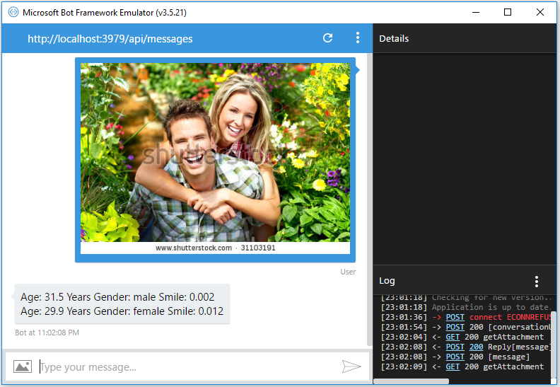

# Build First Bot Application With Bot Framework
## Requires
- Visual Studio 2015
## License
- MIT
## Technologies
- Microsoft Bot Framework
- Cognitive Service
## Topics
- Microsoft Bot Framework
- Cognitive Services
- Face API
## Updated
- 12/04/2016
## Description

<h1>Introduction</h1>

A Visual Studio 2015 project which shows the face attributes such as Age, Gender and Smile using Cognitive Service Face API in the Microsoft Bot Application.

The code illustrates the following topics:

<ol>
<li>Develop first Bot application with Microsoft Bot Framework. </li><li>Integration of Cognitive Service Face API in the Microsoft Bot Application. </li><li>Shows the face attributes such as Age, Gender and Smile from an image. </li><li>Image as an input in the Bot application. </li></ol>
<h1>Getting Started</h1>

To build and run this sample as-is, you must have Visual Studio 2015 and Bot framework template installed. In most cases you can run the application by following these steps:

<ol>
<li>Download and extract the .zip file. </li><li>Open the solution file in Visual Studio. </li><li>Change Face API key in the web.config file. </li><li>Run the application. </li></ol>
<h1>Running the Sample</h1>

To run the sample, hit F5 or choose the Debug | Start Debugging menu command.

Run the Bot emulator and choose an image which has face as an input and send to bot connector. The result shows as follows based on face image.

Figure 1: Bot Application

<h1>Source Code Overview</h1>

There are following files to perform operation in the application.

<ol>
<li>MessagesController.cs : It holds request method and send response. </li><li>Utility.cs : It holds the Cognitive Service Face API integration. </li><li>Web.Config: It holds configuration data for both the Bot and Congnitive service.
</li></ol>
