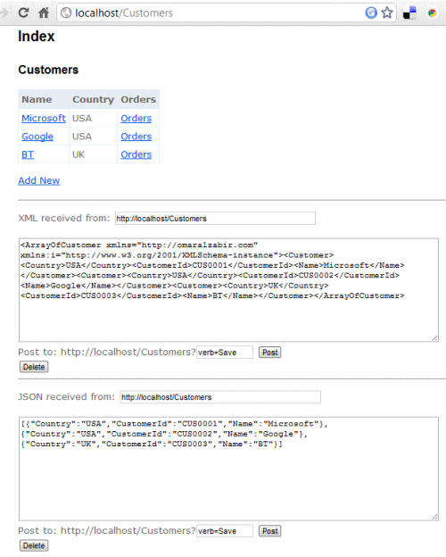

# Build truly RESTful API and website using same ASP.NET MVC code
## Requires
- Visual Studio 2010
## License
- Apache License, Version 2.0
## Technologies
- ASP.NET MVC
## Topics
- ASP.NET
- ASP.NET MVC
## Updated
- 07/29/2011
## Description

<h2>Introduction</h2>

A truly RESTful API means you have unique URLs to uniquely represent entities and collections, and there is no verb/action on the URL. You cannot have URL like&nbsp;<code>/Customers/Create&nbsp;</code>or&nbsp;<code>/Customers/John/Update</code>,<code>/Customers/John/Delete</code>&nbsp;where
 the action is part of the URL that represents the entity. An URL can only represent the state of an entity, like&nbsp;<code>/Customers/John</code>&nbsp;represents the state of John, a customer, and allow GET, POST, PUT, DELETE on that very URL to perform CRUD
 operations. Same goes for a collection where&nbsp;<code>/Customers</code>returns list of customers and a POST to that URL adds new customer(s). Usually we create separate controllers to deal with API part of the website but I will show you how you can create
 both RESTful website and API using the same controller code working over the exact same URL that a browser can use to browse through the website and a client application can perform CRUD operations on the entities.

I have tried Scott Gu&rsquo;s examples on creating RESTful routes, this&nbsp;<a href="http://msdn.microsoft.com/en-us/magazine/dd943053.aspx">MSDN Magazine article</a>, Phil Haack&rsquo;s&nbsp;<a href="http://haacked.com/archive/2009/08/17/rest-for-mvc.aspx">REST
 SDK for ASP.NET MVC</a>, and various other examples. But they have all made the same classic mistake - the action is part of the URL. You have to have URLs like&nbsp;<code>http://localhost:8082/MovieApp/Home/Edit/5?format=Xml</code>&nbsp;to edit a certain
 entity and define the format eg xml, that you need to support. They aren&rsquo;t truly RESTful since the URL does not uniquely represent the state of an entity. The action is part of the URL. When you put the action on the URL, then it is straightforward to
 do it using ASP.NET MVC. Only when you take the action out of the URL and you have to support CRUD over the same URL, using three different formats &ndash; html, xml and json, it becomes tricky and you need some custom filters to do the job. It&rsquo;s not
 very tricky though, you just need to keep in mind your controller actions are serving multiple formats and design your website in a certain way that makes it API friendly. You make the website URLs look like API URL.

The example code has a library of&nbsp;<code>ActionFilterAttribute</code>&nbsp;and&nbsp;<code>ValurProvider</code>&nbsp;that make it possible to serve and accept html, json and xml over the same URL. A regular browser gets html output, an AJAX call expecting
 json gets json response and an XmlHttp call gets xml response.

You might ask why not use WCF REST SDK? The idea is to reuse the same logic to retrieve models and emit html, json, xml all from the same code so that we do not have to duplicate logic in the website and then in the API. If we use WCF REST SDK, you have
 to create a WCF API layer that replicates the model handling logic in the controllers.

The example shown here offers the following RESTful URLs:

<ul>
<li>/Customers &ndash; returns a list of customers. A POST to this URL adds a new customer.
</li><li>/Customers/C0001 &ndash; returns details of the customer having id C001. Update and Delete supported on the same URL.
</li><li>/Customers/C0001/Orders &ndash; returns the orders of the specified customer. Post to this adds new order to the customer.
</li><li>/Customers/C0001/Orders/O0001 &ndash; returns a specific order and allows update and delete on the same URL.
</li></ul>

All these URLs support GET, POST, PUT, DELETE. Users can browse to these URLs and get html page rendered. Client apps can make AJAX calls to these URLs to perform CRUD on these. Thus making a truly RESTful API and website.

They also support verbs over POST in case you don&rsquo;t have PUT, DELETE allowed on your webserver or through firewalls. They are usually disabled by default in most webservers and firewalls due to security common practices. In that case you can use POST
 and pass the verb as query string. For ex,&nbsp;<code>/Customers/C0001?verb=Delete</code>&nbsp;to delete the customer. This does not break the RESTfulness since the URL&nbsp;<code>/Customers/C0001</code>&nbsp;is still uniquely identifying the entity. You are
 passing additional context on the URL. Query strings are also used to do filtering, sorting operations on REST URLs. For ex,&nbsp;<code>/Customers?filter=John&amp;sort=Location&amp;limit=100</code>&nbsp;tells the server to return a filtered, sorted, and paged
 collection of customers.

<h2>Registering routes for truly RESTful URLs</h2>

For each level of entity in the hierarchical entity model, you need to register a route that serves both the collection of an entity and the individual entity. For ex, first level if Customer and then second level is Orders. So, you need to register the
 routes in this way:

&nbsp;

C#

Edit|Remove

csharp

<pre class="csharp">public&nbsp;static&nbsp;void&nbsp;RegisterRoutes(RouteCollection&nbsp;routes)&nbsp;
{&nbsp;
&nbsp;&nbsp;routes.IgnoreRoute(&quot;{resource}.axd/{*pathInfo}&quot;);&nbsp;
&nbsp;
&nbsp;&nbsp;routes.MapRoute(&nbsp;
&nbsp;&nbsp;&nbsp;&nbsp;&quot;SingleCustomer&quot;,&nbsp;
&nbsp;&nbsp;&nbsp;&nbsp;&quot;Customers/{customerId}&quot;,&nbsp;
&nbsp;&nbsp;&nbsp;&nbsp;new&nbsp;{&nbsp;controller&nbsp;=&nbsp;&quot;Customers&quot;,&nbsp;action&nbsp;=&nbsp;&quot;SingleCustomer&quot;&nbsp;});&nbsp;
&nbsp;
&nbsp;&nbsp;routes.MapRoute(&nbsp;
&nbsp;&nbsp;&nbsp;&nbsp;&quot;CustomerOrders&quot;,&nbsp;
&nbsp;&nbsp;&nbsp;&nbsp;&quot;Customers/{customerId}/Orders/{orderId}&quot;,&nbsp;
&nbsp;&nbsp;&nbsp;&nbsp;new&nbsp;{&nbsp;controller&nbsp;=&nbsp;&quot;Customers&quot;,&nbsp;action&nbsp;=&nbsp;&quot;SingleCustomerOrders&quot;,&nbsp;orderId&nbsp;=&nbsp;UrlParameter.Optional&nbsp;});&nbsp;&nbsp;&nbsp;&nbsp;&nbsp;&nbsp;&nbsp;
&nbsp;
&nbsp;&nbsp;routes.MapRoute(&nbsp;
&nbsp;&nbsp;&nbsp;&nbsp;&quot;Default&quot;,&nbsp;//&nbsp;Route&nbsp;name&nbsp;
&nbsp;&nbsp;&nbsp;&nbsp;&quot;{controller}/{action}/{id}&quot;,&nbsp;//&nbsp;URL&nbsp;with&nbsp;parameters&nbsp;
&nbsp;&nbsp;&nbsp;&nbsp;new&nbsp;{&nbsp;controller&nbsp;=&nbsp;&quot;Home&quot;,&nbsp;action&nbsp;=&nbsp;&quot;Index&quot;,&nbsp;id&nbsp;=&nbsp;UrlParameter.Optional&nbsp;}&nbsp;//&nbsp;Parameter&nbsp;defaults&nbsp;
&nbsp;&nbsp;);&nbsp;
}</pre>

&nbsp;

The default map takes care of hits to&nbsp;<code>/Customers</code>. It calls&nbsp;<code>Index()</code>&nbsp;action on&nbsp;<code>CustomersController</code>. Index action renders the collection of customers. Hits to individual customers like&nbsp;<code>/Customers/C0001</code>&nbsp;is
 handled by the<code>SingleCustomer</code>&nbsp;route. Hits to a customer&rsquo;s orders&nbsp;<code>/Customers/C001/Orders</code>&nbsp;and to individual orders eg<code>/Customers/C001/Orders/O0001</code>&nbsp;are both handled by the second route&nbsp;<code>CustomerOrders</code>.

<h2>Rendering JSON and XML output from actions</h2>

In order to emit JSON and XML from actions, you need to use some custom&nbsp;<code>ActionFilter</code>. ASP.NET MVC comes with&nbsp;<code>JsonResult</code>, but it uses the deprecated&nbsp;<code>JavascriptSerializer</code>. So, I have made one using .NET
 3.5&rsquo;s<code>DataContractJsonSerializer</code>.

&nbsp;

C#

Edit|Remove

csharp

<pre class="csharp">internal&nbsp;class&nbsp;JsonResult2&nbsp;:&nbsp;ActionResult&nbsp;
&nbsp;&nbsp;{&nbsp;
&nbsp;&nbsp;&nbsp;&nbsp;public&nbsp;JsonResult2()&nbsp;{&nbsp;}&nbsp;
&nbsp;&nbsp;&nbsp;&nbsp;public&nbsp;JsonResult2(object&nbsp;data)&nbsp;{&nbsp;this.Data&nbsp;=&nbsp;data;&nbsp;}&nbsp;
&nbsp;
&nbsp;&nbsp;&nbsp;&nbsp;public&nbsp;string&nbsp;ContentType&nbsp;{&nbsp;get;&nbsp;set;&nbsp;}&nbsp;
&nbsp;&nbsp;&nbsp;&nbsp;public&nbsp;Encoding&nbsp;ContentEncoding&nbsp;{&nbsp;get;&nbsp;set;&nbsp;}&nbsp;
&nbsp;&nbsp;&nbsp;&nbsp;public&nbsp;object&nbsp;Data&nbsp;{&nbsp;get;&nbsp;set;&nbsp;}&nbsp;
&nbsp;
&nbsp;&nbsp;&nbsp;&nbsp;public&nbsp;override&nbsp;void&nbsp;ExecuteResult(ControllerContext&nbsp;context)&nbsp;
&nbsp;&nbsp;&nbsp;&nbsp;{&nbsp;
&nbsp;&nbsp;&nbsp;&nbsp;&nbsp;&nbsp;if&nbsp;(context&nbsp;==&nbsp;null)&nbsp;
&nbsp;&nbsp;&nbsp;&nbsp;&nbsp;&nbsp;&nbsp;&nbsp;throw&nbsp;new&nbsp;ArgumentNullException(&quot;context&quot;);&nbsp;
&nbsp;
&nbsp;&nbsp;&nbsp;&nbsp;&nbsp;&nbsp;HttpResponseBase&nbsp;response&nbsp;=&nbsp;context.HttpContext.Response;&nbsp;
&nbsp;&nbsp;&nbsp;&nbsp;&nbsp;&nbsp;if&nbsp;(!string.IsNullOrEmpty(this.ContentType))&nbsp;
&nbsp;&nbsp;&nbsp;&nbsp;&nbsp;&nbsp;&nbsp;&nbsp;response.ContentType&nbsp;=&nbsp;this.ContentType;&nbsp;
&nbsp;&nbsp;&nbsp;&nbsp;&nbsp;&nbsp;else&nbsp;
&nbsp;&nbsp;&nbsp;&nbsp;&nbsp;&nbsp;&nbsp;&nbsp;response.ContentType&nbsp;=&nbsp;&quot;application/json&quot;;&nbsp;
&nbsp;
&nbsp;&nbsp;&nbsp;&nbsp;&nbsp;&nbsp;if&nbsp;(this.ContentEncoding&nbsp;!=&nbsp;null)&nbsp;
&nbsp;&nbsp;&nbsp;&nbsp;&nbsp;&nbsp;&nbsp;&nbsp;response.ContentEncoding&nbsp;=&nbsp;this.ContentEncoding;&nbsp;
&nbsp;
&nbsp;&nbsp;&nbsp;&nbsp;&nbsp;&nbsp;DataContractJsonSerializer&nbsp;serializer&nbsp;=&nbsp;new&nbsp;DataContractJsonSerializer(this.Data.GetType());&nbsp;
&nbsp;&nbsp;&nbsp;&nbsp;&nbsp;&nbsp;serializer.WriteObject(response.OutputStream,&nbsp;this.Data);&nbsp;
&nbsp;&nbsp;&nbsp;&nbsp;}&nbsp;
&nbsp;&nbsp;}</pre>

&nbsp;

In the same way I have created&nbsp;<code>XmlResult</code>&nbsp;that I found from from&nbsp;<a href="http://www.hackersbasement.com/csharp/post/2009/06/07/XmlResult-for-ASPNet-MVC.aspx">here</a>&nbsp;and have made some modifications to support Generic types:

<pre id="pre2" class="brush: x_x_csharp" lang="cs">

C#

Edit|Remove
csharp

<pre class="csharp">//&nbsp;Source:&nbsp;http://www.hackersbasement.com/csharp/post/2009/06/07/XmlResult-for-ASPNet-MVC.aspx&nbsp;
&nbsp;&nbsp;internal&nbsp;class&nbsp;XmlResult&nbsp;:&nbsp;ActionResult&nbsp;
&nbsp;&nbsp;{&nbsp;
&nbsp;&nbsp;&nbsp;&nbsp;public&nbsp;XmlResult()&nbsp;{&nbsp;}&nbsp;
&nbsp;&nbsp;&nbsp;&nbsp;public&nbsp;XmlResult(object&nbsp;data)&nbsp;{&nbsp;this.Data&nbsp;=&nbsp;data;&nbsp;}&nbsp;
&nbsp;
&nbsp;&nbsp;&nbsp;&nbsp;public&nbsp;string&nbsp;ContentType&nbsp;{&nbsp;get;&nbsp;set;&nbsp;}&nbsp;
&nbsp;&nbsp;&nbsp;&nbsp;public&nbsp;Encoding&nbsp;ContentEncoding&nbsp;{&nbsp;get;&nbsp;set;&nbsp;}&nbsp;
&nbsp;&nbsp;&nbsp;&nbsp;public&nbsp;object&nbsp;Data&nbsp;{&nbsp;get;&nbsp;set;&nbsp;}&nbsp;
&nbsp;
&nbsp;&nbsp;&nbsp;&nbsp;public&nbsp;override&nbsp;void&nbsp;ExecuteResult(ControllerContext&nbsp;context)&nbsp;
&nbsp;&nbsp;&nbsp;&nbsp;{&nbsp;
&nbsp;&nbsp;&nbsp;&nbsp;&nbsp;&nbsp;if&nbsp;(context&nbsp;==&nbsp;null)&nbsp;
&nbsp;&nbsp;&nbsp;&nbsp;&nbsp;&nbsp;&nbsp;&nbsp;throw&nbsp;new&nbsp;ArgumentNullException(&quot;context&quot;);&nbsp;
&nbsp;
&nbsp;&nbsp;&nbsp;&nbsp;&nbsp;&nbsp;HttpResponseBase&nbsp;response&nbsp;=&nbsp;context.HttpContext.Response;&nbsp;
&nbsp;&nbsp;&nbsp;&nbsp;&nbsp;&nbsp;if&nbsp;(!string.IsNullOrEmpty(this.ContentType))&nbsp;
&nbsp;&nbsp;&nbsp;&nbsp;&nbsp;&nbsp;&nbsp;&nbsp;response.ContentType&nbsp;=&nbsp;this.ContentType;&nbsp;
&nbsp;&nbsp;&nbsp;&nbsp;&nbsp;&nbsp;else&nbsp;
&nbsp;&nbsp;&nbsp;&nbsp;&nbsp;&nbsp;&nbsp;&nbsp;response.ContentType&nbsp;=&nbsp;&quot;text/xml&quot;;&nbsp;
&nbsp;
&nbsp;&nbsp;&nbsp;&nbsp;&nbsp;&nbsp;if&nbsp;(this.ContentEncoding&nbsp;!=&nbsp;null)&nbsp;
&nbsp;&nbsp;&nbsp;&nbsp;&nbsp;&nbsp;&nbsp;&nbsp;response.ContentEncoding&nbsp;=&nbsp;this.ContentEncoding;&nbsp;
&nbsp;
&nbsp;&nbsp;&nbsp;&nbsp;&nbsp;&nbsp;if&nbsp;(this.Data&nbsp;!=&nbsp;null)&nbsp;
&nbsp;&nbsp;&nbsp;&nbsp;&nbsp;&nbsp;{&nbsp;
&nbsp;&nbsp;&nbsp;&nbsp;&nbsp;&nbsp;&nbsp;&nbsp;if&nbsp;(this.Data&nbsp;is&nbsp;XmlNode)&nbsp;
&nbsp;&nbsp;&nbsp;&nbsp;&nbsp;&nbsp;&nbsp;&nbsp;&nbsp;&nbsp;response.Write(((XmlNode)this.Data).OuterXml);&nbsp;
&nbsp;&nbsp;&nbsp;&nbsp;&nbsp;&nbsp;&nbsp;&nbsp;else&nbsp;if&nbsp;(this.Data&nbsp;is&nbsp;XNode)&nbsp;
&nbsp;&nbsp;&nbsp;&nbsp;&nbsp;&nbsp;&nbsp;&nbsp;&nbsp;&nbsp;response.Write(((XNode)this.Data).ToString());&nbsp;
&nbsp;&nbsp;&nbsp;&nbsp;&nbsp;&nbsp;&nbsp;&nbsp;else&nbsp;
&nbsp;&nbsp;&nbsp;&nbsp;&nbsp;&nbsp;&nbsp;&nbsp;{&nbsp;
&nbsp;&nbsp;&nbsp;&nbsp;&nbsp;&nbsp;&nbsp;&nbsp;&nbsp;&nbsp;var&nbsp;dataType&nbsp;=&nbsp;this.Data.GetType();&nbsp;
&nbsp;&nbsp;&nbsp;&nbsp;&nbsp;&nbsp;&nbsp;&nbsp;&nbsp;&nbsp;//&nbsp;OMAR:&nbsp;For&nbsp;generic&nbsp;types,&nbsp;use&nbsp;DataContractSerializer&nbsp;because&nbsp;&nbsp;
&nbsp;&nbsp;&nbsp;&nbsp;&nbsp;&nbsp;&nbsp;&nbsp;&nbsp;&nbsp;//&nbsp;XMLSerializer&nbsp;cannot&nbsp;serialize&nbsp;generic&nbsp;interface&nbsp;lists&nbsp;or&nbsp;types.&nbsp;
&nbsp;&nbsp;&nbsp;&nbsp;&nbsp;&nbsp;&nbsp;&nbsp;&nbsp;&nbsp;if&nbsp;(dataType.IsGenericType&nbsp;||&nbsp;&nbsp;
&nbsp;&nbsp;&nbsp;&nbsp;&nbsp;&nbsp;&nbsp;&nbsp;&nbsp;&nbsp;&nbsp;&nbsp;dataType.GetCustomAttributes(typeof(DataContractAttribute),&nbsp;true).FirstOrDefault()&nbsp;!=&nbsp;null)&nbsp;
&nbsp;&nbsp;&nbsp;&nbsp;&nbsp;&nbsp;&nbsp;&nbsp;&nbsp;&nbsp;{&nbsp;
&nbsp;&nbsp;&nbsp;&nbsp;&nbsp;&nbsp;&nbsp;&nbsp;&nbsp;&nbsp;&nbsp;&nbsp;var&nbsp;dSer&nbsp;=&nbsp;new&nbsp;DataContractSerializer(dataType);&nbsp;
&nbsp;&nbsp;&nbsp;&nbsp;&nbsp;&nbsp;&nbsp;&nbsp;&nbsp;&nbsp;&nbsp;&nbsp;dSer.WriteObject(response.OutputStream,&nbsp;this.Data);&nbsp;
&nbsp;&nbsp;&nbsp;&nbsp;&nbsp;&nbsp;&nbsp;&nbsp;&nbsp;&nbsp;}&nbsp;
&nbsp;&nbsp;&nbsp;&nbsp;&nbsp;&nbsp;&nbsp;&nbsp;&nbsp;&nbsp;else&nbsp;
&nbsp;&nbsp;&nbsp;&nbsp;&nbsp;&nbsp;&nbsp;&nbsp;&nbsp;&nbsp;{&nbsp;
&nbsp;&nbsp;&nbsp;&nbsp;&nbsp;&nbsp;&nbsp;&nbsp;&nbsp;&nbsp;&nbsp;&nbsp;var&nbsp;xSer&nbsp;=&nbsp;new&nbsp;XmlSerializer(dataType);&nbsp;
&nbsp;&nbsp;&nbsp;&nbsp;&nbsp;&nbsp;&nbsp;&nbsp;&nbsp;&nbsp;&nbsp;&nbsp;xSer.Serialize(response.OutputStream,&nbsp;this.Data);&nbsp;
&nbsp;&nbsp;&nbsp;&nbsp;&nbsp;&nbsp;&nbsp;&nbsp;&nbsp;&nbsp;}&nbsp;
&nbsp;&nbsp;&nbsp;&nbsp;&nbsp;&nbsp;&nbsp;&nbsp;}&nbsp;
&nbsp;&nbsp;&nbsp;&nbsp;&nbsp;&nbsp;}&nbsp;
&nbsp;&nbsp;&nbsp;&nbsp;}&nbsp;
&nbsp;&nbsp;}&nbsp;</pre>

 </pre>
<pre id="pre2" class="brush: x_x_csharp" lang="cs">Now that we have the&nbsp;<code>JsonResult2</code>&nbsp;and&nbsp;<code>XmlResult</code>, we need to create the&nbsp;<code>ActionFilter</code>&nbsp;attributes that will intercept the response and use the right Result class to render the result.</pre>

First we have the&nbsp;<code>EnableJsonAttribute</code>&nbsp;that emits JSON:

&nbsp;

C#

Edit|Remove

csharp

<pre class="csharp">public&nbsp;class&nbsp;EnableJsonAttribute&nbsp;:&nbsp;ActionFilterAttribute&nbsp;
&nbsp;&nbsp;{&nbsp;
&nbsp;&nbsp;&nbsp;&nbsp;private&nbsp;readonly&nbsp;static&nbsp;string[]&nbsp;_jsonTypes&nbsp;=&nbsp;new&nbsp;string[]&nbsp;{&nbsp;&quot;application/json&quot;,&nbsp;&quot;text/json&quot;&nbsp;};&nbsp;
&nbsp;&nbsp;&nbsp;&nbsp;&nbsp;
&nbsp;&nbsp;&nbsp;&nbsp;public&nbsp;override&nbsp;void&nbsp;OnActionExecuted(ActionExecutedContext&nbsp;filterContext)&nbsp;
&nbsp;&nbsp;&nbsp;&nbsp;{&nbsp;
&nbsp;&nbsp;&nbsp;&nbsp;&nbsp;&nbsp;if&nbsp;(typeof(RedirectToRouteResult).IsInstanceOfType(filterContext.Result))&nbsp;
&nbsp;&nbsp;&nbsp;&nbsp;&nbsp;&nbsp;&nbsp;&nbsp;return;&nbsp;
&nbsp;
&nbsp;&nbsp;&nbsp;&nbsp;&nbsp;&nbsp;var&nbsp;acceptTypes&nbsp;=&nbsp;filterContext.HttpContext.Request.AcceptTypes&nbsp;??&nbsp;new[]&nbsp;{&nbsp;&quot;text/html&quot;&nbsp;};&nbsp;
&nbsp;
&nbsp;&nbsp;&nbsp;&nbsp;&nbsp;&nbsp;var&nbsp;model&nbsp;=&nbsp;filterContext.Controller.ViewData.Model;&nbsp;
&nbsp;
&nbsp;&nbsp;&nbsp;&nbsp;&nbsp;&nbsp;var&nbsp;contentEncoding&nbsp;=&nbsp;filterContext.HttpContext.Request.ContentEncoding&nbsp;??&nbsp;Encoding.UTF8;&nbsp;
&nbsp;
&nbsp;&nbsp;&nbsp;&nbsp;&nbsp;&nbsp;if&nbsp;(_jsonTypes.Any(type&nbsp;=&gt;&nbsp;acceptTypes.Contains(type)))&nbsp;
&nbsp;&nbsp;&nbsp;&nbsp;&nbsp;&nbsp;&nbsp;&nbsp;filterContext.Result&nbsp;=&nbsp;new&nbsp;JsonResult2()&nbsp;&nbsp;
&nbsp;&nbsp;&nbsp;&nbsp;&nbsp;&nbsp;&nbsp;&nbsp;{&nbsp;&nbsp;
&nbsp;&nbsp;&nbsp;&nbsp;&nbsp;&nbsp;&nbsp;&nbsp;&nbsp;&nbsp;Data&nbsp;=&nbsp;model,&nbsp;&nbsp;
&nbsp;&nbsp;&nbsp;&nbsp;&nbsp;&nbsp;&nbsp;&nbsp;&nbsp;&nbsp;ContentEncoding&nbsp;=&nbsp;contentEncoding,&nbsp;
&nbsp;&nbsp;&nbsp;&nbsp;&nbsp;&nbsp;&nbsp;&nbsp;&nbsp;&nbsp;ContentType&nbsp;=&nbsp;filterContext.HttpContext.Request.ContentType&nbsp;
&nbsp;&nbsp;&nbsp;&nbsp;&nbsp;&nbsp;&nbsp;&nbsp;};&nbsp;&nbsp;&nbsp;&nbsp;&nbsp;&nbsp;&nbsp;
&nbsp;&nbsp;&nbsp;&nbsp;}&nbsp;
&nbsp;&nbsp;}</pre>

&nbsp;

Then we have the&nbsp;<code>EnableXmlAttribute</code>&nbsp;that emits XML:

C#

Edit|Remove

csharp

<pre class="csharp">public&nbsp;class&nbsp;EnableXmlAttribute&nbsp;:&nbsp;ActionFilterAttribute&nbsp;
&nbsp;&nbsp;{&nbsp;
&nbsp;&nbsp;&nbsp;&nbsp;private&nbsp;readonly&nbsp;static&nbsp;string[]&nbsp;_xmlTypes&nbsp;=&nbsp;new&nbsp;string[]&nbsp;{&nbsp;&quot;application/xml&quot;,&nbsp;&quot;text/xml&quot;&nbsp;};&nbsp;
&nbsp;
&nbsp;&nbsp;&nbsp;&nbsp;public&nbsp;override&nbsp;void&nbsp;OnActionExecuted(ActionExecutedContext&nbsp;filterContext)&nbsp;
&nbsp;&nbsp;&nbsp;&nbsp;{&nbsp;
&nbsp;&nbsp;&nbsp;&nbsp;&nbsp;&nbsp;if&nbsp;(typeof(RedirectToRouteResult).IsInstanceOfType(filterContext.Result))&nbsp;
&nbsp;&nbsp;&nbsp;&nbsp;&nbsp;&nbsp;&nbsp;&nbsp;return;&nbsp;
&nbsp;
&nbsp;&nbsp;&nbsp;&nbsp;&nbsp;&nbsp;var&nbsp;acceptTypes&nbsp;=&nbsp;filterContext.HttpContext.Request.AcceptTypes&nbsp;??&nbsp;new[]&nbsp;{&nbsp;&quot;text/html&quot;&nbsp;};&nbsp;
&nbsp;
&nbsp;&nbsp;&nbsp;&nbsp;&nbsp;&nbsp;var&nbsp;model&nbsp;=&nbsp;filterContext.Controller.ViewData.Model;&nbsp;
&nbsp;
&nbsp;&nbsp;&nbsp;&nbsp;&nbsp;&nbsp;var&nbsp;contentEncoding&nbsp;=&nbsp;filterContext.HttpContext.Request.ContentEncoding&nbsp;??&nbsp;Encoding.UTF8;&nbsp;
&nbsp;
&nbsp;&nbsp;&nbsp;&nbsp;&nbsp;&nbsp;if&nbsp;(_xmlTypes.Any(type&nbsp;=&gt;&nbsp;acceptTypes.Contains(type)))&nbsp;
&nbsp;&nbsp;&nbsp;&nbsp;&nbsp;&nbsp;&nbsp;&nbsp;filterContext.Result&nbsp;=&nbsp;new&nbsp;XmlResult()&nbsp;
&nbsp;&nbsp;&nbsp;&nbsp;&nbsp;&nbsp;&nbsp;&nbsp;{&nbsp;
&nbsp;&nbsp;&nbsp;&nbsp;&nbsp;&nbsp;&nbsp;&nbsp;&nbsp;&nbsp;Data&nbsp;=&nbsp;model,&nbsp;
&nbsp;&nbsp;&nbsp;&nbsp;&nbsp;&nbsp;&nbsp;&nbsp;&nbsp;&nbsp;ContentEncoding&nbsp;=&nbsp;contentEncoding,&nbsp;
&nbsp;&nbsp;&nbsp;&nbsp;&nbsp;&nbsp;&nbsp;&nbsp;&nbsp;&nbsp;ContentType&nbsp;=&nbsp;filterContext.HttpContext.Request.ContentType&nbsp;
&nbsp;&nbsp;&nbsp;&nbsp;&nbsp;&nbsp;&nbsp;&nbsp;};&nbsp;
&nbsp;&nbsp;&nbsp;&nbsp;}&nbsp;
&nbsp;&nbsp;}&nbsp;</pre>

<pre id="pre4" class="brush: x_x_csharp" lang="cs">Both of these filters have same logic. They look at the requested content type. If they find the right content type, then do their job.</pre>

All you need to do is put these attributes on the Actions and they do their magic:

<pre id="pre5" class="brush: x_x_csharp" lang="cs">

C#

Edit|Remove
csharp

<pre class="csharp">[EnableJson,&nbsp;EnableXml]&nbsp;
public&nbsp;ActionResult&nbsp;Index(string&nbsp;verb)&nbsp;
{&nbsp;
&nbsp;&nbsp;&nbsp;&nbsp;return&nbsp;View(GetModel().Customers);&nbsp;
}</pre>

 </pre>

These filter work for GET, POST, PUT, DELETE and for single entities and collections.

<h2>Accepting JSON and XML serialized objects as request</h2>

ASP.NET MVC 2 out of the box does not support JSON or XML serialized objects in request. You need to use the<a href="http://haacked.com/archive/2010/04/15/sending-json-to-an-asp-net-mvc-action-method-argument.aspx">ASP.NET MVC 2 Futures library</a>&nbsp;to
 allow JSON serialized objects to be sent as request. Futures has a<code>JsonValueProvider</code>&nbsp;that can accept JSON post and convert it to object. But there&rsquo;s no&nbsp;<code>ValueProvider</code>&nbsp;for XML in the futures library. There&rsquo;s
 one available&nbsp;<a href="http://www.nogginbox.co.uk/blog/xml-to-asp.net-mvc-action-method">here</a>&nbsp;that I have used.

In order to enable JSON and XML in request

C#

Edit|Remove

csharp

<pre class="csharp">protected&nbsp;void&nbsp;Application_Start()&nbsp;
{&nbsp;
&nbsp;&nbsp;AreaRegistration.RegisterAllAreas();&nbsp;
&nbsp;
&nbsp;&nbsp;RegisterRoutes(RouteTable.Routes);&nbsp;
&nbsp;
&nbsp;&nbsp;//&nbsp;Source:&nbsp;http://haacked.com/archive/2010/04/15/sending-json-to-an-asp-net-mvc-action-method-argument.aspx&nbsp;
&nbsp;&nbsp;//&nbsp;This&nbsp;must&nbsp;be&nbsp;added&nbsp;to&nbsp;accept&nbsp;JSON&nbsp;as&nbsp;request&nbsp;
&nbsp;&nbsp;ValueProviderFactories.Factories.Add(new&nbsp;JsonValueProviderFactory());&nbsp;
&nbsp;&nbsp;//&nbsp;This&nbsp;must&nbsp;be&nbsp;added&nbsp;to&nbsp;accept&nbsp;XML&nbsp;as&nbsp;request&nbsp;
&nbsp;&nbsp;//&nbsp;Source:&nbsp;http://www.nogginbox.co.uk/blog/xml-to-asp.net-mvc-action-method&nbsp;
&nbsp;&nbsp;ValueProviderFactories.Factories.Add(new&nbsp;XmlValueProviderFactory());&nbsp;
}&nbsp;</pre>

<pre id="pre6" class="brush: x_x_csharp" lang="cs">When both of these Value Providers are used, ASP.NET MVC can accept JSON and XML serialized objects as request and automatically deserialize them. Most importantly,&nbsp;<code>ModelState.IsValid</code>&nbsp;works. If you just use an<code>ActionFilter</code>&nbsp;to intercept request and do the deserialization there, which is what most have tried, it does not validate the model. The model validation happens before the&nbsp;<code>ActionFilter</code>&nbsp;is hit. The only way so far to make model validation work is to use the value providers.</pre>
<pre id="pre6" class="brush: x_x_csharp" lang="cs"> </pre>
<pre id="pre6" class="brush: x_x_csharp" lang="cs">You can find a detail walkthrough of this project here:</pre>
<pre id="pre6" class="brush: x_x_csharp" lang="cs"><a href="http://omaralzabir.com/build-truly-restful-api-and-website-using-same-asp-net-mvc-code/">http://omaralzabir.com/build-truly-restful-api-and-website-using-same-asp-net-mvc-code/</a> </pre>
