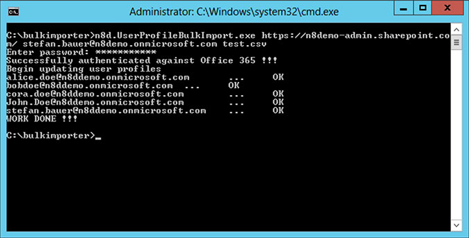

# Bulk update SharePoint Online user profiles
## Requires
- Visual Studio 2012
## License
- Apache License, Version 2.0
## Technologies
- C#
- Web Services
- Office 365
- Sharepoint Online
- Claims Authentication
## Topics
- Bulk Update
- User Profiles
## Updated
- 01/06/2014
## Description

This sample code show how user profiles in SharePoint Online can be updated via the legacy SOAP web service. It also provides information how the authentication procedure works in SharePoint Online. Through the limitation to the user profile REST API this
 is the only way to update.

In Office 365 the authentication is a bit different and an authentication cookie needs to be passed.

The longer explanation how to authentication against Office 365 work can be found in the MSDN article
<a href="http://msdn.microsoft.com/en-us/library/hh147177(v=office.14).aspx">Remote Authentication in SharePoint Online Using Claims-Based Authentication</a>. Another great source of information is the blog post &ldquo;<a href="http://www.wictorwilen.se/post/How-to-do-active-authentication-to-Office-365-and-SharePoint-Online.aspx">How
 to do active authentication to Office 365 and SharePoint Online</a>&rdquo; by Wictor Wil&eacute;n. In this article Wictor provides a helper object that make the authentication process easy. His solution is mainly targeted on SharePoint 2010 in Office 365 but
 this still works in the recent version of SharePoint Online.

<em>The Authentication against SharePoint Online Web Services is much simpler now and is also covered in this sample. The new introduced authentication object
<a href="http://msdn.microsoft.com/en-us/library/microsoft.sharepoint.client.sharepointonlinecredentials.aspx">
SharePointOnlineCredentials.</a>&nbsp;</em>

&nbsp;

<em>The followin code provides the basic steps to do this.</em>

C#

Edit|Remove

csharp
<pre class="hidden">// Pass the username and password to SharePointOnlineCredentials constructor
// Password needs to be passed as a System.Security.SecureString
SharePointOnlineCredentials onlineCred = new SharePointOnlineCredentials(_username, mySecurePassword);

// Get the authentication cookie by passing the url of the web service
string authCookie = onlineCred.GetAuthenticationCookie(_adminUrl);

// Create a CookieContainer to authenticate against the web service
CookieContainer authContainer = new CookieContainer();

// Put the authenticationCookie string in the container
authContainer.SetCookies(_adminUrl, _authCookie);

// Setting up the user profile web service
UserProfileWS.UserProfileService upService = new UserProfileWS.UserProfileService();

// assign the correct url to the web service
upService.Url = _adminUrl.AbsoluteUri;

// Assign previously created auth container to web service
upService.CookieContainer = authContainer;
</pre>

<pre class="csharp">//&nbsp;Pass&nbsp;the&nbsp;username&nbsp;and&nbsp;password&nbsp;to&nbsp;SharePointOnlineCredentials&nbsp;constructor&nbsp;
//&nbsp;Password&nbsp;needs&nbsp;to&nbsp;be&nbsp;passed&nbsp;as&nbsp;a&nbsp;System.Security.SecureString&nbsp;
SharePointOnlineCredentials&nbsp;onlineCred&nbsp;=&nbsp;new&nbsp;SharePointOnlineCredentials(_username,&nbsp;mySecurePassword);&nbsp;
&nbsp;
//&nbsp;Get&nbsp;the&nbsp;authentication&nbsp;cookie&nbsp;by&nbsp;passing&nbsp;the&nbsp;url&nbsp;of&nbsp;the&nbsp;web&nbsp;service&nbsp;
string&nbsp;authCookie&nbsp;=&nbsp;onlineCred.GetAuthenticationCookie(_adminUrl);&nbsp;
&nbsp;
//&nbsp;Create&nbsp;a&nbsp;CookieContainer&nbsp;to&nbsp;authenticate&nbsp;against&nbsp;the&nbsp;web&nbsp;service&nbsp;
CookieContainer&nbsp;authContainer&nbsp;=&nbsp;new&nbsp;CookieContainer();&nbsp;
&nbsp;
//&nbsp;Put&nbsp;the&nbsp;authenticationCookie&nbsp;string&nbsp;in&nbsp;the&nbsp;container&nbsp;
authContainer.SetCookies(_adminUrl,&nbsp;_authCookie);&nbsp;
&nbsp;
//&nbsp;Setting&nbsp;up&nbsp;the&nbsp;user&nbsp;profile&nbsp;web&nbsp;service&nbsp;
UserProfileWS.UserProfileService&nbsp;upService&nbsp;=&nbsp;new&nbsp;UserProfileWS.UserProfileService();&nbsp;
&nbsp;
//&nbsp;assign&nbsp;the&nbsp;correct&nbsp;url&nbsp;to&nbsp;the&nbsp;web&nbsp;service&nbsp;
upService.Url&nbsp;=&nbsp;_adminUrl.AbsoluteUri;&nbsp;
&nbsp;
//&nbsp;Assign&nbsp;previously&nbsp;created&nbsp;auth&nbsp;container&nbsp;to&nbsp;web&nbsp;service&nbsp;
upService.CookieContainer&nbsp;=&nbsp;authContainer;&nbsp;</pre>

<ul>
</ul>
<h1>How it works</h1>

The data will be imported from a tab separated text file. The following amage shows the update working.

<h1>More Information</h1>

<em>I wrote a blog post that covers all the parts in this solution. This can be found under the title &quot;<a href="http://www.n8d.at/blog/bulk-update-sharepoint-user-profiles-in-office-365/">Bulk update SharePoint User Profiles in Office 365</a>&quot;&nbsp;</em>

