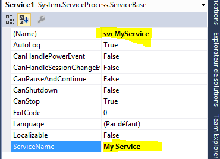
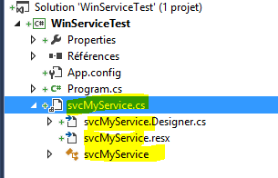
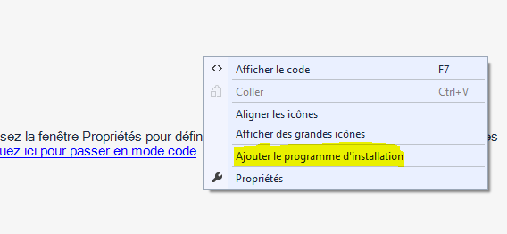
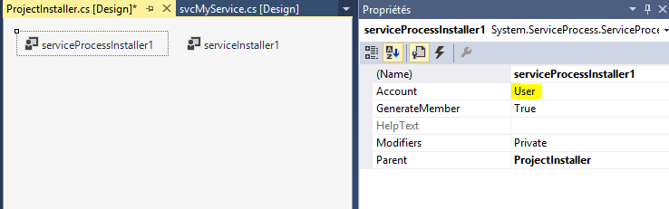
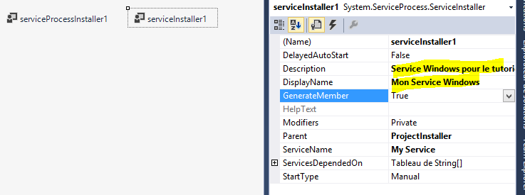

# C# : Windows Service Windows in console mode for debug and admin

Remark: all screenshots are created on a french Visual Studio, so the images are in french, but I'll try to convert the terms in english.

When we develop .Net Windows Services we are soon faced of debugging problem.

In addition we regularly start, stop the service, as well install and uninstall it. All of these actions require to use differents commandlines (installutil, net start, etc.).

This article propose to transform our Windows Service to application console to allow to debug more easier, as well as manage all service through command line parameters, and thus simplify its management. 

All that will be presented is not new, you will find a lot of articles on the subject across the Web, I am just to gather all in one article, as a reminder.

# Create a Windows Service

Quick reminder for the create of a service named "My Service":
- Start the new project creation
- Select the template "Templates > Visual C# > Windows Desktop > Windows Service"


We rename the class "Service1" to "svcMyService" and the name of the service "My Service" in the property grid opened:



So, in the Solution Explorer, we rename the file "Service1.cs" of the service "svcMyService.cs":



The underlying files will be automatically renamed.

The last step is to create a service installer. From the designer of the service (if it's closed, open it with a double click on "svcMyService.cs" from the Solution Explorer), right click on the designer and select "Add installer".



In the opened designer, select "serviceProcessInstaller1" to change the running service account, in our case choose "LocalSystem".



By selecting "serviceInstaller1" we can change the display informations in the services manager.



Build the program with the menu "Build > Build the solution". If you run the program a dialog is displayed to inform you that is a service that need to be installed and started.

We make a test by installing the service, and by starting it:
- Open a command shell as administrator
- Go to the folder where is the compiled service "bin\debug" of the folder solution

We can open directly the folder of the solution from the Solution Explorer, right click on the project et choose "Open in the Explorer" and navigate to "bin\debug". On Windows 8.1 use the menu "File > Open command shell > Open command shell as administrator".

Install the service:

```
"%SystemRoot%\Microsoft.NET\Framework\v4.0.30319\InstallUtil.exe" WinServiceTest.exe
```

And we start our service.

```
net start "My Service"
```

Normally all it works:
- In the exe folder we can find the log files.
- In the Services Manager we can find our service (with the informations defined in the service installer).
- In the events viewer a new source is available "My Service" if you keep "True" the value of "AutoLog" property from the service designer.

We can stop all:

```
net stop "My Service""%SystemRoot%\Microsoft.NET\Framework\v4.0.30319\InstallUtil.exe" /u WinServiceTest.exe
```

# Debugging Windows Service

Reminder : to debug a service you need to do many things:
- Install the service with "InstallUtil.exe"
- Start the service with "net start"
- Run Visual Studio as Administrator
- Attach the debuger to the running service

Of course, before update your code and recompile your service, you must at least stop your service with "net stop".

This whole procedure is sometimes tedious, and also poses a problem in debugging, if the service does not correctly startup, you haven't time to attach the debugger to trace what happens.

# Convert a Service to Console Application for Debugging

The idea to help us debugging is to create a console application that simulate the service execution when it run under Visual Studio.

The first step is to change the project application type.
- Right clic on the service project ("WinServiceTest" in our case) and select "Properties".
- In the "Application" tab, "Output type" select "Console Application" ("Windows Application" by default).
- Save the changes.

After, the idea is to check if we are in service mode or debug mode, for this we need to known if we are in interactive mode, we use the `Environment.UserInteractive` property for that, and we need to know if we are in debug mode with the `System.Diagnostics.Debugger.IsAttached` property.

In the "Program.cs" file we change the Main code like this

``` csharp
/// <summary>
/// Main entry point of the application.
/// </summary>
static void Main()
{
    // Initialize the service to start
    ServiceBase[] ServicesToRun;
    ServicesToRun = new ServiceBase[] 
    { 
        new svcMyService() 
    };

    // In interactive and debug mode ?
    if (Environment.UserInteractive && System.Diagnostics.Debugger.IsAttached)
    {
        // Simulate the services execution
        RunInteractiveServices(ServicesToRun);
    }
    else
    {
        // Normal service execution
        ServiceBase.Run(ServicesToRun);
    }
}
```

Then we adding the "RunInteractiveServices" method that start each service :

``` csharp
/// <summary>
/// Run services in interactive mode
/// </summary>
static void RunInteractiveServices(ServiceBase[] servicesToRun)
{
    Console.WriteLine();
    Console.WriteLine("Start the services in interactive mode.");
    Console.WriteLine();

    // Get the method to invoke on each service to start it
    MethodInfo onStartMethod = typeof(ServiceBase).GetMethod("OnStart", BindingFlags.Instance | BindingFlags.NonPublic);

    // Start services loop
    foreach (ServiceBase service in servicesToRun)
    {
        Console.Write("Starting {0} ... ", service.ServiceName);
        onStartMethod.Invoke(service, new object[] { new string[] { } });
        Console.WriteLine("Started");
    }

    // Waiting the end
    Console.WriteLine();
    Console.WriteLine("Press a key to stop services et finish process...");
    Console.ReadKey();
    Console.WriteLine();

    // Get the method to invoke on each service to stop it
    MethodInfo onStopMethod = typeof(ServiceBase).GetMethod("OnStop", BindingFlags.Instance | BindingFlags.NonPublic);

    // Stop loop
    foreach (ServiceBase service in servicesToRun)
    {
        Console.Write("Stopping {0} ... ", service.ServiceName);
        onStopMethod.Invoke(service, null);
        Console.WriteLine("Stopped");
    }

    Console.WriteLine();
    Console.WriteLine("All services are stopped.");

    // Waiting a key press to not return to VS directly
    if (System.Diagnostics.Debugger.IsAttached)
    {
        Console.WriteLine();
        Console.Write("=== Press a key to quit ===");
        Console.ReadKey();
    }
}
```

Each service start on its own thread, we do not have to manage it.

## Advantages

Therefore the first advantage is to be able to debug the entire chain to start your service.

Another advantage is that you can create a log system that display message on the console, it's direct and readable.

## Disadvantages

However ther are some disadvantages.

A Windows Service generally run as an Administrator account (LocalSystem, LocalNetwork, etc.), wich can cause some rights problems depending of what the service doing. You can resolve this problem, by running Visual Studio as Administrator, and the when the service is launched it get the administrator rights.

A service, when it starting, do some tasks (create an event log source, etc.), our small application don't do that. It's your job to d all it's needed for your service.

## Remarks

Caution, this mode don't make you free to debug as service mode, it allows you to quickly debug your service, but your to test in service mode to ensure the correct behavior of the service in is normal mode.

# Install and Unistall the service

A service for running, need to be installed (it registered to the Windows ServiceManager). To install a .Net Service we need to run the command "InstallUtil.exe" in the .Net Framework folder.

This command is sometimes a bit long to write, even when it is necessary to install the service with an installer, it is necessary to locate the folder of the corresponding framework, etc.

As we have now a console application, we can use it to facilitate the work. For example with the command line arguments to install/uninstall the service.

To manage the install/uninstall service we can use the class `System.Configuration.Install.ManagedInstallerClass` that contains some helpers methods to do it.

We will change our console application to supports 'commands' like `install` and `uninstall`.

We will need to change the application behavior:
- if we are in debug mode we run the services in interactive mode
- if we are in interactive mode, we check if we have somme commands. In this case we run the commands, otherwise we print a message usage.
- if we are not in interative mode, we run normally the services.

We create a `HasCommand` method to check if there are a command in the command line:
``` csharp

/// <summary>
/// Helper for check if we are a command in the command line arguments
/// </summary>
static bool HasCommand(String[] args, String command)
{
    if (args == null || args.Length == 0 || String.IsNullOrWhiteSpace(command)) return false;
    return args.Any(a => String.Equals(a, command, StringComparison.OrdinalIgnoreCase));
}

```

The we change the Main method to supports arguments, and to process the commands:

``` csharp

/// <summary>
/// Main entry point of the application.
/// </summary>
static void Main(String[] args)
{
    // Initialize the service to start
    ServiceBase[] ServicesToRun;
    ServicesToRun = new ServiceBase[] 
    { 
        new svcMyService() 
    };

    // In interactive mode ?
    if (Environment.UserInteractive)
    {
        // In debug mode ?
        if (System.Diagnostics.Debugger.IsAttached)
        {
            // Simulate the services execution
            RunInteractiveServices(ServicesToRun);
        }
        else
        {
            try
            {
                bool hasCommands = false;
                // Having an install command ?
                if (HasCommand(args, "install"))
                {
                    ManagedInstallerClass.InstallHelper(new String[] { typeof(Program).Assembly.Location });
                    hasCommands = true;
                }
                // Having an uninstall command ?
                if (HasCommand(args, "uninstall"))
                {
                    ManagedInstallerClass.InstallHelper(new String[] { "/u", typeof(Program).Assembly.Location });
                    hasCommands = true;
                }
                // If we don't have commands we print usage message
                if (!hasCommands)
                {
                    Console.WriteLine("Usage : {0} [command] [command ...]", Environment.GetCommandLineArgs());
                    Console.WriteLine("Commands : ");
                    Console.WriteLine(" - install : Install the services");
                    Console.WriteLine(" - uninstall : Uninstall the services");
                }
            }
            catch (Exception ex)
            {
                var oldColor = Console.ForegroundColor;
                Console.ForegroundColor = ConsoleColor.Red;
                Console.WriteLine("Error : {0}", ex.GetBaseException().Message);
                Console.ForegroundColor = oldColor;
            }
        }
    }
    else
    {
        // Normal service execution
        ServiceBase.Run(ServicesToRun);
    }
}


```

# Start and Stop the service

Same as the installation, for starting and stopping our service we must use a command "net start/stop" or the service manager.

For the same reasons as before, we will use some command line arguments of our console application. And for this we use the `System.ServiceProcess.ServiceController` class.

So we add deux commands `start` and `stop` between our two commands insall and uninstall.

``` csharp

...
// Having a start command ?
if (HasCommand(args, "start"))
{
    foreach (var service in ServicesToRun)
    {
        ServiceController sc = new ServiceController(service.ServiceName);
        sc.Start();
        sc.WaitForStatus(ServiceControllerStatus.Running, TimeSpan.FromSeconds(10));
    }
    hasCommands = true;
}
// Having a stop command ?
if (HasCommand(args, "stop"))
{
    foreach (var service in ServicesToRun)
    {
        ServiceController sc = new ServiceController(service.ServiceName);
        sc.Stop();
        sc.WaitForStatus(ServiceControllerStatus.Stopped, TimeSpan.FromSeconds(10));
    }
    hasCommands = false;
}
...

```

How we process the commands, allows us to combine installation and startup in one command line. Same for stop and uninstall.

```
WinServiceTest.exe install start
WinServiceTest.exe uninstall stop
```

The order of the commands in the command line is not important, because we process the commands in the good order (we test 'stop' before 'uninstall').

# Do More

Of course we can add more commands helpers.

## Command to combine installation and startup

We can create a command to process in one command the installation and the startup. Same as for stopping and uninstall the service.

In our example, we implement it with the commands 'start-services' and 'stop-services', we process these commands first.

## Run the services in interactive mode

We run the services in interactive mode only in debug mode. But it could be usefull to run the services in interactive mode. Si we can add a command for it.

In our example, we implement it with the command 'run-services'.

