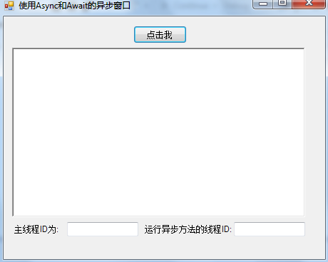
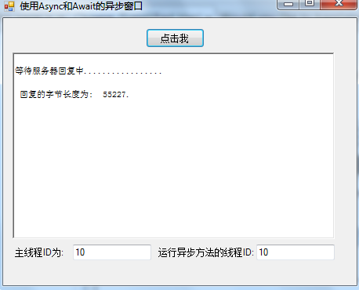

# C# 5.0中async和await的使用
## Requires
- Visual Studio 2012
## License
- Apache License, Version 2.0
## Technologies
- C#
- Async
- .NET 4.5
## Topics
- Async
- C# 5.0
## Updated
- 05/25/2013
## Description

<h1>简介</h1>

使用同步代码存在一个很严重的问题，例如我们向一个Web服务器发出一个请求时，如果我们发出请求的代码是同步实现的话，这时候我们的应用程序就会处于等待状态，直到收回一个响应信息为止，然而在这个等待的状态，对于用户不能操作任何的UI界面以及也没有任何的消息，如果我们试图去操作界面时，此时我们就会看到&quot;应用程序为响应&quot;的信息(在应用程序的窗口旁)，相信大家在平常使用桌面软件或者访问web的时候，肯定都遇到过这样类&#20284;的情况的，对于这个，大家肯定会觉得看上去非常不舒服。引起这个原因正是因为代码的实现是同步实现的，所以在没有得到一个响应消息之前，界面就成了一个&quot;卡死&quot;状态了，所以这对于用户来说肯定是不可接受的，因为如果我要从服务器上下载一个很大的文件时，此时我们甚至不能对窗体进行关闭的操作的。

使用传统的异步编程模型(APM)来解决同步代码所存在的问题，然而在.NET 2.0，.NET 4.0和.NET 4.5中，微软都有推出新的方式来解决同步代码的问题，他们分别为基于事件的异步模式，基于任务的异步模式和提供async和await关键字来对异步编程支持。.NET 4.5 的推出，对于C#又有了新特性的增加&mdash;&mdash;就是C#5.0中async和await两个关键字，这两个关键字简化了异步编程。

<h1>运行示例</h1>

第一步、下载示例代码，然后打开 &ldquo;ASyncAndAwaitTestProject.sln&rdquo;文件来打开项目

第二步、按F5运行该示例程序，你将看到下面的窗体：

第三步、点击 窗体中&ldquo;点击我&rdquo;按钮将开始执行一个异步操作，此时异步操作不会阻塞UI线程，用户还是可以操作窗体的，当异步操作完成时，将看到下面的界面：

 

<strong>使用代码</strong>

第一步、使用Visual Studio 2012 创建一个WinForm应用程序。

第二步、从工具箱中托控件来设计UI界面

第三步、实现 &ldquo;点击我&rdquo;按钮的点击事件：

C#

编辑脚本|Remove

csharp

<pre class="csharp">private&nbsp;async&nbsp;void&nbsp;btnClick_Click(object&nbsp;sender,&nbsp;EventArgs&nbsp;e)&nbsp;
&nbsp;&nbsp;&nbsp;&nbsp;&nbsp;&nbsp;&nbsp;&nbsp;{&nbsp;
&nbsp;&nbsp;&nbsp;&nbsp;&nbsp;&nbsp;&nbsp;&nbsp;&nbsp;&nbsp;&nbsp;&nbsp;long&nbsp;length&nbsp;=&nbsp;await&nbsp;AccessWebAsync();&nbsp;
&nbsp;&nbsp;&nbsp;&nbsp;&nbsp;&nbsp;&nbsp;&nbsp;&nbsp;&nbsp;&nbsp;&nbsp;
&nbsp;&nbsp;&nbsp;&nbsp;&nbsp;&nbsp;&nbsp;&nbsp;&nbsp;&nbsp;&nbsp;&nbsp;//&nbsp;这里可以做一些不依赖回复的操作&nbsp;
&nbsp;&nbsp;&nbsp;&nbsp;&nbsp;&nbsp;&nbsp;&nbsp;&nbsp;&nbsp;&nbsp;&nbsp;OtherWork();&nbsp;
&nbsp;
&nbsp;&nbsp;&nbsp;&nbsp;&nbsp;&nbsp;&nbsp;&nbsp;&nbsp;&nbsp;&nbsp;&nbsp;this.richTextBox1.Text&nbsp;&#43;=&nbsp;String.Format(&quot;\n&nbsp;回复的字节长度为:&nbsp;&nbsp;{0}.\r\n&quot;,&nbsp;length);&nbsp;
&nbsp;&nbsp;&nbsp;&nbsp;&nbsp;&nbsp;&nbsp;&nbsp;&nbsp;&nbsp;&nbsp;&nbsp;txbMainThreadID.Text&nbsp;=&nbsp;Thread.CurrentThread.ManagedThreadId.ToString();&nbsp;
&nbsp;&nbsp;&nbsp;&nbsp;&nbsp;&nbsp;&nbsp;&nbsp;}&nbsp;
&nbsp;
&nbsp;&nbsp;&nbsp;&nbsp;&nbsp;&nbsp;&nbsp;&nbsp;//&nbsp;使用C#&nbsp;5.0中提供的async&nbsp;和await关键字来定义异步方法&nbsp;
&nbsp;&nbsp;&nbsp;&nbsp;&nbsp;&nbsp;&nbsp;&nbsp;//&nbsp;从代码中可以看出C#5.0&nbsp;中定义异步方法就像定义同步方法一样简单。&nbsp;
&nbsp;&nbsp;&nbsp;&nbsp;&nbsp;&nbsp;&nbsp;&nbsp;//&nbsp;使用async&nbsp;和await定义异步方法不会创建新线程,&nbsp;
&nbsp;&nbsp;&nbsp;&nbsp;&nbsp;&nbsp;&nbsp;&nbsp;//&nbsp;它运行在现有线程上执行多个任务.&nbsp;
&nbsp;&nbsp;&nbsp;&nbsp;&nbsp;&nbsp;&nbsp;&nbsp;//&nbsp;此时不知道大家有没有一个疑问的？在现有线程上(即UI线程上)运行一个耗时的操作时，&nbsp;
&nbsp;&nbsp;&nbsp;&nbsp;&nbsp;&nbsp;&nbsp;&nbsp;//&nbsp;为什么不会堵塞UI线程的呢？&nbsp;
&nbsp;&nbsp;&nbsp;&nbsp;&nbsp;&nbsp;&nbsp;&nbsp;//&nbsp;这个问题的答案就是&nbsp;当编译器看到await关键字时，线程会&nbsp;
&nbsp;&nbsp;&nbsp;&nbsp;&nbsp;&nbsp;&nbsp;&nbsp;private&nbsp;async&nbsp;Task&lt;long&gt;&nbsp;AccessWebAsync()&nbsp;
&nbsp;&nbsp;&nbsp;&nbsp;&nbsp;&nbsp;&nbsp;&nbsp;{&nbsp;
&nbsp;&nbsp;&nbsp;&nbsp;&nbsp;&nbsp;&nbsp;&nbsp;&nbsp;&nbsp;&nbsp;&nbsp;MemoryStream&nbsp;content&nbsp;=&nbsp;new&nbsp;MemoryStream();&nbsp;
&nbsp;
&nbsp;&nbsp;&nbsp;&nbsp;&nbsp;&nbsp;&nbsp;&nbsp;&nbsp;&nbsp;&nbsp;&nbsp;//&nbsp;对MSDN发起一个Web请求&nbsp;
&nbsp;&nbsp;&nbsp;&nbsp;&nbsp;&nbsp;&nbsp;&nbsp;&nbsp;&nbsp;&nbsp;&nbsp;HttpWebRequest&nbsp;webRequest&nbsp;=&nbsp;WebRequest.Create(&quot;http://msdn.microsoft.com/zh-cn/&quot;)&nbsp;as&nbsp;HttpWebRequest;&nbsp;
&nbsp;&nbsp;&nbsp;&nbsp;&nbsp;&nbsp;&nbsp;&nbsp;&nbsp;&nbsp;&nbsp;&nbsp;if&nbsp;(webRequest&nbsp;!=&nbsp;null)&nbsp;
&nbsp;&nbsp;&nbsp;&nbsp;&nbsp;&nbsp;&nbsp;&nbsp;&nbsp;&nbsp;&nbsp;&nbsp;{&nbsp;
&nbsp;&nbsp;&nbsp;&nbsp;&nbsp;&nbsp;&nbsp;&nbsp;&nbsp;&nbsp;&nbsp;&nbsp;&nbsp;&nbsp;&nbsp;&nbsp;//&nbsp;返回回复结果&nbsp;
&nbsp;&nbsp;&nbsp;&nbsp;&nbsp;&nbsp;&nbsp;&nbsp;&nbsp;&nbsp;&nbsp;&nbsp;&nbsp;&nbsp;&nbsp;&nbsp;using&nbsp;(WebResponse&nbsp;response&nbsp;=&nbsp;await&nbsp;webRequest.GetResponseAsync())&nbsp;
&nbsp;&nbsp;&nbsp;&nbsp;&nbsp;&nbsp;&nbsp;&nbsp;&nbsp;&nbsp;&nbsp;&nbsp;&nbsp;&nbsp;&nbsp;&nbsp;{&nbsp;
&nbsp;&nbsp;&nbsp;&nbsp;&nbsp;&nbsp;&nbsp;&nbsp;&nbsp;&nbsp;&nbsp;&nbsp;&nbsp;&nbsp;&nbsp;&nbsp;&nbsp;&nbsp;&nbsp;&nbsp;using&nbsp;(Stream&nbsp;responseStream&nbsp;=&nbsp;response.GetResponseStream())&nbsp;
&nbsp;&nbsp;&nbsp;&nbsp;&nbsp;&nbsp;&nbsp;&nbsp;&nbsp;&nbsp;&nbsp;&nbsp;&nbsp;&nbsp;&nbsp;&nbsp;&nbsp;&nbsp;&nbsp;&nbsp;{&nbsp;
&nbsp;&nbsp;&nbsp;&nbsp;&nbsp;&nbsp;&nbsp;&nbsp;&nbsp;&nbsp;&nbsp;&nbsp;&nbsp;&nbsp;&nbsp;&nbsp;&nbsp;&nbsp;&nbsp;&nbsp;&nbsp;&nbsp;&nbsp;&nbsp;await&nbsp;responseStream.CopyToAsync(content);&nbsp;
&nbsp;&nbsp;&nbsp;&nbsp;&nbsp;&nbsp;&nbsp;&nbsp;&nbsp;&nbsp;&nbsp;&nbsp;&nbsp;&nbsp;&nbsp;&nbsp;&nbsp;&nbsp;&nbsp;&nbsp;}&nbsp;
&nbsp;&nbsp;&nbsp;&nbsp;&nbsp;&nbsp;&nbsp;&nbsp;&nbsp;&nbsp;&nbsp;&nbsp;&nbsp;&nbsp;&nbsp;&nbsp;}&nbsp;
&nbsp;&nbsp;&nbsp;&nbsp;&nbsp;&nbsp;&nbsp;&nbsp;&nbsp;&nbsp;&nbsp;&nbsp;}&nbsp;
&nbsp;
&nbsp;&nbsp;&nbsp;&nbsp;&nbsp;&nbsp;&nbsp;&nbsp;&nbsp;&nbsp;&nbsp;&nbsp;txbAsynMethodID.Text&nbsp;=&nbsp;Thread.CurrentThread.ManagedThreadId.ToString()&nbsp;;&nbsp;
&nbsp;&nbsp;&nbsp;&nbsp;&nbsp;&nbsp;&nbsp;&nbsp;&nbsp;&nbsp;&nbsp;&nbsp;return&nbsp;content.Length;&nbsp;
&nbsp;&nbsp;&nbsp;&nbsp;&nbsp;&nbsp;&nbsp;&nbsp;}&nbsp;
&nbsp;
&nbsp;&nbsp;&nbsp;&nbsp;&nbsp;&nbsp;&nbsp;&nbsp;private&nbsp;void&nbsp;OtherWork()&nbsp;
&nbsp;&nbsp;&nbsp;&nbsp;&nbsp;&nbsp;&nbsp;&nbsp;{&nbsp;
&nbsp;&nbsp;&nbsp;&nbsp;&nbsp;&nbsp;&nbsp;&nbsp;&nbsp;&nbsp;&nbsp;&nbsp;this.richTextBox1.Text&nbsp;&#43;=&nbsp;&quot;\r\n等待服务器回复中.................\n&quot;;&nbsp;
&nbsp;&nbsp;&nbsp;&nbsp;&nbsp;&nbsp;&nbsp;&nbsp;}</pre>

<ul>
</ul>
<h1>更多信息</h1>

使用 Async 和 Await 的异步编程（C# 和 Visual Basic）

<a href="http://msdn.microsoft.com/zh-cn/library/hh191443.aspx">http://msdn.microsoft.com/zh-cn/library/hh191443.aspx</a>

异步返回类型（C# 和 Visual Basic）

<a href="http://msdn.microsoft.com/zh-cn/library/hh524395.aspx">http://msdn.microsoft.com/zh-cn/library/hh524395.aspx</a> 

C# 5.0 新特性&mdash;&mdash;Async和Await使异步编程更简单

<a href="http://www.cnblogs.com/zhili/archive/2013/05/15/Csharp5asyncandawait.html">http://www.cnblogs.com/zhili/archive/2013/05/15/Csharp5asyncandawait.html</a>

异步编程模式 

<a href="http://msdn.microsoft.com/zh-cn/library/jj152938.aspx">http://msdn.microsoft.com/zh-cn/library/jj152938.aspx</a> 

