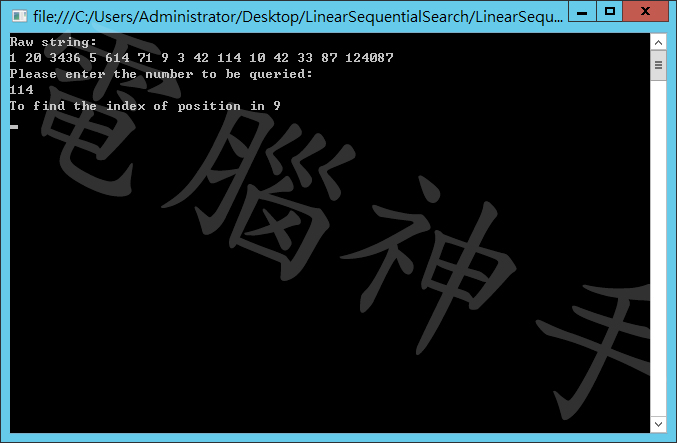
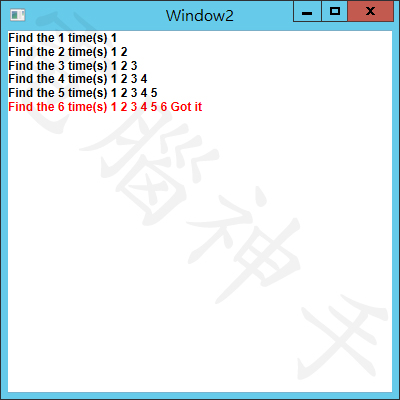

# C# Console - Linear Sequential Search Algorithm
## Requires
- Visual Studio 2013
## License
- MIT
## Technologies
- C#
- Console
- Visual C#
## Topics
- C#
- Console Window
- Visual C#
## Updated
- 08/14/2017
## Description

<strong>Console Version</strong>

The algorithm is a very important basic subject for computer science. In short, the algorithm is to use the computer to learn mathematics (ancient people with arithmetic, modern computer operator), can be said to be math subjects. 
To solve all kinds of problems in real life, computer scientists put real problems corresponding to mathematical problems, and then design formulas, the formula written procedures, so that the computer program to calculate the answer - these formulas are called
 algorithms. 
Although the word &quot;formula&quot; is used to describe the algorithm, it is not the mathematical formula in the impression. As the computer can perform complex calculations, so the formula can be designed into dozens of rows, hundreds of lines, and even use a lot
 of mathematical theory. 
So, even if the study of the algorithm of the people, but also do not know how to design algorithms; because mathematics, program things are too complicated. Want to correspond to the real problem of mathematics, it is more complicated.

The algorithm is in the computer project inside, I would like to have someone who wrote the program, should have at least heard the noun.

Introduce a common search algorithm - Linear / Sequential Search algorithm, named thought, is the way to find the matching information,

The concept is very simple, but also commonly used, that is, directly with the loop to compare, find the return when the results.

In the following example, in the window of the Console through a long list of incomplete numbers, find the number you want to search:

&nbsp;

&nbsp;

C#

Edit|Remove

csharp
<pre class="hidden">int value = -1;
for (int i = 0; i &lt; list.Length; i&#43;&#43;)
{
	if (list[i] == item)
	{
		value = i;
		break;
	}
}
return value;</pre>

<pre class="csharp">int&nbsp;value&nbsp;=&nbsp;-1;&nbsp;
for&nbsp;(int&nbsp;i&nbsp;=&nbsp;0;&nbsp;i&nbsp;&lt;&nbsp;list.Length;&nbsp;i&#43;&#43;)&nbsp;
{&nbsp;
&nbsp;&nbsp;&nbsp;&nbsp;if&nbsp;(list[i]&nbsp;==&nbsp;item)&nbsp;
&nbsp;&nbsp;&nbsp;&nbsp;{&nbsp;
&nbsp;&nbsp;&nbsp;&nbsp;&nbsp;&nbsp;&nbsp;&nbsp;value&nbsp;=&nbsp;i;&nbsp;
&nbsp;&nbsp;&nbsp;&nbsp;&nbsp;&nbsp;&nbsp;&nbsp;break;&nbsp;
&nbsp;&nbsp;&nbsp;&nbsp;}&nbsp;
}&nbsp;
return&nbsp;value;</pre>

&nbsp;

The same use in the WPF, but also can operate the same way to design:

&nbsp;

&nbsp;

You can see the results of the algorithm：

&nbsp;

This method is not the same way, it will be the result of the latter is not dealt with, to reduce the effectiveness of the system, which for a large number of data search, a great help.

Of course, it can be used with a string processing.

There is a complete program and interface design structure, I will not explain in detail how to design interface.

