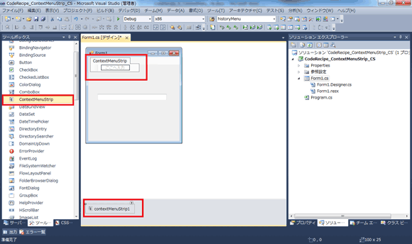
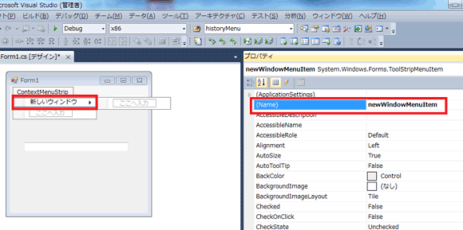

# C#: ContextMenuStrip の使用
## License
- Apache License, Version 2.0
## Technologies
- Visual Studio 2010
- .NET Framework 2.0
- Windows 7 Ultimate 64 bit
## Topics
- Windows フォーム
- 逆引きサンプル コード
## Updated
- 03/02/2011
## Description

執筆者: <a href="http://msdn.microsoft.com/ja-jp/gg585574#ikehara" target="_blank">
インフラジスティックス・ジャパン株式会社　池原 大然</a>

動作確認環境: Visual Studio 2010、.NET Framework 2.0、Windows 7 Ultimate 64 bit

Windows のエクスプローラーではマウスの右クリック ボタンを押下することで切り取り、貼り付けなどの項目を含んだコンテキスト メニューを表示することが可能です。Windows フォーム アプリケーションにおいては
<a href="http://msdn.microsoft.com/ja-jp/library/aszetbbk%28v=VS.100%29.aspx" target="_blank">
ContextMenuStrip</a>&nbsp;を用いてこの機能を下記のように実装することが可能です。なお、Windows フォーム アプリケーションの作成方法については
<a href="/ja-jp//C-Windows-dc42087f/">[C#]&nbsp;Windows フォームによるクライアント アプリケーション開発</a>を参照してください。

<ol>
<li>Windows フォーム アプリケーション プロジェクトを作成し、フォームに TextBox コントロール、ContextMenuStrip コントロールを追加します。

</li><li>ContextMenuStrip コントロールに &ldquo;新しいウィンドウ&rdquo; という表記の項目を追加し、追加された <a href="http://msdn.microsoft.com/ja-jp/library/system.windows.forms.toolstripmenuitem%28v=VS.100%29.aspx" target="_blank">
ToolStripMenuItem</a>&nbsp;の Name を &ldquo;newWindowMenuItem&rdquo; と設定します。

</li><li>メニュー項目がマウスでクリックされたイベントについては、<a href="http://msdn.microsoft.com/ja-jp/library/system.windows.forms.toolstrip.itemclicked.aspx" target="_blank">ContextMenuStrip.ItemClicked</a>&nbsp;イベント、あるいは 先ほど追加したアイテムの
<a href="http://msdn.microsoft.com/ja-jp/library/system.windows.forms.toolstripitem.click.aspx" target="_blank">
ToolStripMenuItem.Click</a>&nbsp;イベントのいずれかをハンドルします。ContextMenuStrip.ItemClicked イベントをハンドルし、Name プロパティを判定基準として新しいウィンドウを表示させるコードは下記の通りです。

 
 

C#

スクリプトの編集

csharp

<pre class="csharp">private&nbsp;void&nbsp;contextMenuStrip1_ItemClicked(object&nbsp;sender,&nbsp;ToolStripItemClickedEventArgs&nbsp;e)&nbsp;
{&nbsp;
&nbsp;&nbsp;&nbsp;&nbsp;//&nbsp;クリックされた項目の&nbsp;Name&nbsp;を判定します。&nbsp;
&nbsp;&nbsp;&nbsp;&nbsp;switch&nbsp;(e.ClickedItem.Name)&nbsp;
&nbsp;&nbsp;&nbsp;&nbsp;{&nbsp;
&nbsp;&nbsp;&nbsp;&nbsp;&nbsp;&nbsp;&nbsp;&nbsp;case&nbsp;&quot;newWindowMenuItem&quot;:&nbsp;
&nbsp;&nbsp;&nbsp;&nbsp;&nbsp;&nbsp;&nbsp;&nbsp;&nbsp;&nbsp;&nbsp;&nbsp;Form&nbsp;frm&nbsp;=&nbsp;new&nbsp;Form();&nbsp;
&nbsp;&nbsp;&nbsp;&nbsp;&nbsp;&nbsp;&nbsp;&nbsp;&nbsp;&nbsp;&nbsp;&nbsp;frm.Text&nbsp;=&nbsp;this.textBox1.Text;&nbsp;
&nbsp;&nbsp;&nbsp;&nbsp;&nbsp;&nbsp;&nbsp;&nbsp;&nbsp;&nbsp;&nbsp;&nbsp;frm.Show();&nbsp;
&nbsp;&nbsp;&nbsp;&nbsp;&nbsp;&nbsp;&nbsp;&nbsp;&nbsp;&nbsp;&nbsp;&nbsp;break;&nbsp;
&nbsp;&nbsp;&nbsp;&nbsp;&nbsp;&nbsp;&nbsp;&nbsp;default:&nbsp;
&nbsp;&nbsp;&nbsp;&nbsp;&nbsp;&nbsp;&nbsp;&nbsp;&nbsp;&nbsp;&nbsp;&nbsp;break;&nbsp;
&nbsp;&nbsp;&nbsp;&nbsp;}&nbsp;
}&nbsp;
&nbsp;
</pre>

&nbsp;

</li><li>最後に TextBox.ContextMenuStrip プロパティに先ほどの ContextMenuStrip を設定します。

実行結果は下記の通りです。

TextBox に入力したタイトルを持ったウィンドウが作成されます。

</li></ol>

今回は UI 部分についてはデザイナーを使用しました。コードでの UI 部分を含めた設定方法については <a href="/ja-jp/10-ContextMenuStrip-C-0eb623dc/">
10 行でズバリ!! ContextMenuStrip の利用 (C#)</a>&nbsp;において解説されていますのでこちらもご確認ください。

<h2>関連リンク</h2>
<ul>
<li><a href="http://msdn.microsoft.com/ja-jp/library/aszetbbk.aspx" target="_blank">ContextMenuStrip&nbsp;クラス</a>
</li><li><a href="http://msdn.microsoft.com/ja-jp/library/z5b29tk4.aspx" target="_blank">ToolMenuStripItem クラス</a>
</li><li><a href="/ja-jp/10-ContextMenuStrip-C-0eb623dc/">10 行でズバリ!! ContextMenuStrip の利用 (C#)</a>
</li></ul>

<table>
<tbody>
<tr>
<td></td>
<td></td>
<td>
<ul>
<li>もっと他のコンテンツを見る &gt;&gt; <a href="http://msdn.microsoft.com/ja-jp/ff363212" target="_blank">
逆引きサンプル コード一覧へ</a> </li><li>もっと他のレシピを見る &gt;&gt; <a href="http://code.msdn.microsoft.com/ja-jp">Code Recipe へ</a>
</li><li>もっと Windows の情報を見る &gt;&gt; <a href="http://msdn.microsoft.com/ja-jp/windows/" target="_blank">
Windows デベロッパー センターへ</a> </li></ul>
</td>
</tr>
</tbody>
</table>

<a href="#top">ページのトップへ</a>

