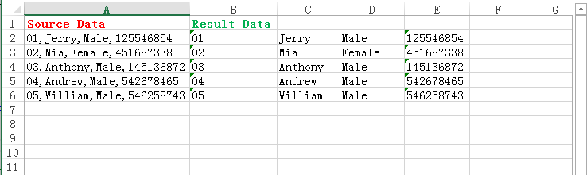

# C# How to Split data into multiple columns in Excel
## Requires
- Visual Studio 2013
## License
- MS-LPL
## Technologies
- C#
- ASP.NET
- Excel
- .NET
- Class Library
- Excel API
## Topics
- C#
- Excel
- .Net Programming
- c# control
## Updated
- 02/08/2018
## Description

<h1>Introduction</h1>

It may be easy to Split cells data into multiple columns in Microsoft Excel, but how to realize it programmatically in C#? This sample will show you how to complete it with the free component.&nbsp;

<strong>The preparations</strong>

First, you need to install the component <a href="https://www.e-iceblue.com/Download/download-excel-for-net-free.html">
Free Spire.XLS for .NET</a> correctly; second, add the Spire.XLS.dll into the program assemblies as the reference, the detail steps are presented as below.&nbsp;

<strong>Step 1: Add using directive to the namespace</strong>

C#

编辑脚本|Remove

csharp
<pre class="hidden">using Spire.Xls;</pre>

<pre class="csharp">using&nbsp;Spire.Xls;</pre>

<strong>Step 2: Main code snippet</strong>

<h1>

C#

编辑脚本|Remove

csharp
<pre class="hidden">//Initialize an instance of Workbook class, load the excel from file and get the first worksheet of workbook
            Workbook book = new Workbook();
            book.LoadFromFile(@&quot;C:\Users\Administrator\Desktop\SAMPLE.xlsx&quot;);
            Worksheet sheet = book.Worksheets[0];

            //Initialize a string and string array
            string[] splitText = null;
            string text = null;
            //Traverse from the second row to the last row
            for (int i = 1; i &lt; sheet.LastRow; i&#43;&#43;)
            {
                text = sheet.Range[i &#43; 1, 1].Text;
                //Split the data by the delimited character of comma
                splitText = text.Split(',');
                //Save the data that has been split into the array and write the array items into separate columns
                for (int j = 0; j &lt; splitText.Length; j&#43;&#43;)
                {
                    sheet.Range[i &#43; 1, 1 &#43; j &#43; 1].Text = splitText[j];
                }
            }
            //Save to file and open the result
            book.SaveToFile(&quot;result.xlsx&quot;, ExcelVersion.Version2010);
            System.Diagnostics.Process.Start(&quot;result.xlsx&quot;);
</pre>

<pre class="csharp">//Initialize&nbsp;an&nbsp;instance&nbsp;of&nbsp;Workbook&nbsp;class,&nbsp;load&nbsp;the&nbsp;excel&nbsp;from&nbsp;file&nbsp;and&nbsp;get&nbsp;the&nbsp;first&nbsp;worksheet&nbsp;of&nbsp;workbook&nbsp;
&nbsp;&nbsp;&nbsp;&nbsp;&nbsp;&nbsp;&nbsp;&nbsp;&nbsp;&nbsp;&nbsp;&nbsp;Workbook&nbsp;book&nbsp;=&nbsp;new&nbsp;Workbook();&nbsp;
&nbsp;&nbsp;&nbsp;&nbsp;&nbsp;&nbsp;&nbsp;&nbsp;&nbsp;&nbsp;&nbsp;&nbsp;book.LoadFromFile(@&quot;C:\Users\Administrator\Desktop\SAMPLE.xlsx&quot;);&nbsp;
&nbsp;&nbsp;&nbsp;&nbsp;&nbsp;&nbsp;&nbsp;&nbsp;&nbsp;&nbsp;&nbsp;&nbsp;Worksheet&nbsp;sheet&nbsp;=&nbsp;book.Worksheets[0];&nbsp;
&nbsp;
&nbsp;&nbsp;&nbsp;&nbsp;&nbsp;&nbsp;&nbsp;&nbsp;&nbsp;&nbsp;&nbsp;&nbsp;//Initialize&nbsp;a&nbsp;string&nbsp;and&nbsp;string&nbsp;arraystring[]&nbsp;splitText&nbsp;=&nbsp;null;&nbsp;
&nbsp;&nbsp;&nbsp;&nbsp;&nbsp;&nbsp;&nbsp;&nbsp;&nbsp;&nbsp;&nbsp;&nbsp;string&nbsp;text&nbsp;=&nbsp;null;&nbsp;
&nbsp;&nbsp;&nbsp;&nbsp;&nbsp;&nbsp;&nbsp;&nbsp;&nbsp;&nbsp;&nbsp;&nbsp;//Traverse&nbsp;from&nbsp;the&nbsp;second&nbsp;row&nbsp;to&nbsp;the&nbsp;last&nbsp;rowfor&nbsp;(int&nbsp;i&nbsp;=&nbsp;1;&nbsp;i&nbsp;&lt;&nbsp;sheet.LastRow;&nbsp;i&#43;&#43;)&nbsp;
&nbsp;&nbsp;&nbsp;&nbsp;&nbsp;&nbsp;&nbsp;&nbsp;&nbsp;&nbsp;&nbsp;&nbsp;{&nbsp;
&nbsp;&nbsp;&nbsp;&nbsp;&nbsp;&nbsp;&nbsp;&nbsp;&nbsp;&nbsp;&nbsp;&nbsp;&nbsp;&nbsp;&nbsp;&nbsp;text&nbsp;=&nbsp;sheet.Range[i&nbsp;&#43;&nbsp;1,&nbsp;1].Text;&nbsp;
&nbsp;&nbsp;&nbsp;&nbsp;&nbsp;&nbsp;&nbsp;&nbsp;&nbsp;&nbsp;&nbsp;&nbsp;&nbsp;&nbsp;&nbsp;&nbsp;//Split&nbsp;the&nbsp;data&nbsp;by&nbsp;the&nbsp;delimited&nbsp;character&nbsp;of&nbsp;comma&nbsp;
&nbsp;&nbsp;&nbsp;&nbsp;&nbsp;&nbsp;&nbsp;&nbsp;&nbsp;&nbsp;&nbsp;&nbsp;&nbsp;&nbsp;&nbsp;&nbsp;splitText&nbsp;=&nbsp;text.Split(',');&nbsp;
&nbsp;&nbsp;&nbsp;&nbsp;&nbsp;&nbsp;&nbsp;&nbsp;&nbsp;&nbsp;&nbsp;&nbsp;&nbsp;&nbsp;&nbsp;&nbsp;//Save&nbsp;the&nbsp;data&nbsp;that&nbsp;has&nbsp;been&nbsp;split&nbsp;into&nbsp;the&nbsp;array&nbsp;and&nbsp;write&nbsp;the&nbsp;array&nbsp;items&nbsp;into&nbsp;separate&nbsp;columnsfor&nbsp;(int&nbsp;j&nbsp;=&nbsp;0;&nbsp;j&nbsp;&lt;&nbsp;splitText.Length;&nbsp;j&#43;&#43;)&nbsp;
&nbsp;&nbsp;&nbsp;&nbsp;&nbsp;&nbsp;&nbsp;&nbsp;&nbsp;&nbsp;&nbsp;&nbsp;&nbsp;&nbsp;&nbsp;&nbsp;{&nbsp;
&nbsp;&nbsp;&nbsp;&nbsp;&nbsp;&nbsp;&nbsp;&nbsp;&nbsp;&nbsp;&nbsp;&nbsp;&nbsp;&nbsp;&nbsp;&nbsp;&nbsp;&nbsp;&nbsp;&nbsp;sheet.Range[i&nbsp;&#43;&nbsp;1,&nbsp;1&nbsp;&#43;&nbsp;j&nbsp;&#43;&nbsp;1].Text&nbsp;=&nbsp;splitText[j];&nbsp;
&nbsp;&nbsp;&nbsp;&nbsp;&nbsp;&nbsp;&nbsp;&nbsp;&nbsp;&nbsp;&nbsp;&nbsp;&nbsp;&nbsp;&nbsp;&nbsp;}&nbsp;
&nbsp;&nbsp;&nbsp;&nbsp;&nbsp;&nbsp;&nbsp;&nbsp;&nbsp;&nbsp;&nbsp;&nbsp;}&nbsp;
&nbsp;&nbsp;&nbsp;&nbsp;&nbsp;&nbsp;&nbsp;&nbsp;&nbsp;&nbsp;&nbsp;&nbsp;//Save&nbsp;to&nbsp;file&nbsp;and&nbsp;open&nbsp;the&nbsp;result&nbsp;
&nbsp;&nbsp;&nbsp;&nbsp;&nbsp;&nbsp;&nbsp;&nbsp;&nbsp;&nbsp;&nbsp;&nbsp;book.SaveToFile(&quot;result.xlsx&quot;,&nbsp;ExcelVersion.Version2010);&nbsp;
&nbsp;&nbsp;&nbsp;&nbsp;&nbsp;&nbsp;&nbsp;&nbsp;&nbsp;&nbsp;&nbsp;&nbsp;System.Diagnostics.Process.Start(&quot;result.xlsx&quot;);&nbsp;
</pre>

</h1>

Run the project and generate the result file.

<strong>Screenshot :</strong>

<strong> 
</strong>

<strong>Useful information</strong>

This professional .NET Excel component is a standalone Excel .NET managed assembly and does not depend on Microsoft Office Excel.

<strong>Supports </strong>

&nbsp;

<ul>
<li>Create and Edit Excel </li><li>Find and Replace Data </li><li>Print excel files </li><li>Import/Export data from a DataTable, DataView, Array, DataGrid etc. </li><li>Save Excel to file/Stream or as web response </li><li>Create charts </li><li>Read and write hyperlinks </li><li>Create auto filters </li><li>Implement Data Sorting </li><li>Implement Data Validations </li><li>Merge/Unmerge Cells and files </li><li>Group/UnGroup Rows and Columns </li><li>Insert/Delete or Hide Rows, Columns and Sheets </li><li>Calculate Complex Excel Formula </li><li>Freeze/Unfreeze Panes </li><li>Insert Hyperlinks to link data </li><li>Protect/Unprotect Worksheets </li><li>Create Pivot Tables </li><li>Encrypt/Decrypt Files </li><li>Load/Save Excel VBA </li><li>Merge data into Excel with MarkerDesigner </li></ul>

&nbsp;

<strong>More functions，see the links below:</strong><strong>&nbsp;</strong>

Website: <a href="https://www.e-iceblue.com/">https://www.e-iceblue.com/</a>

Product introduction:<a href="https://www.e-iceblue.com/Introduce/free-xls-component.html">https://www.e-iceblue.com/Introduce/free-xls-component.html</a>

Download address: <a href="https://www.e-iceblue.com/Download/download-excel-for-net-free.html">
https://www.e-iceblue.com/Download/download-excel-for-net-free.html</a>

