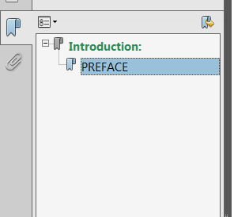
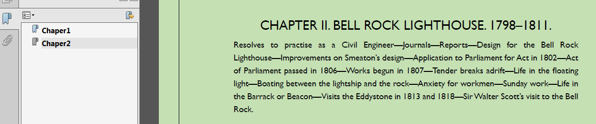
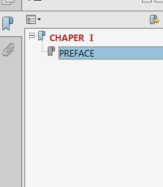

# C# How to add, modify and delete bookmark in PDF
## Requires
- Visual Studio 2013
## License
- MS-LPL
## Technologies
- C#
- ASP.NET
- .NET
- Class Library
- PDF API
## Topics
- C#
- .Net Programming
- c# control
- bookmark in PDF
## Updated
- 02/08/2018
## Description

<h1>Introduction</h1>

The bookmark function in the files provides a good convenience to us to locate the special paragraph. We can freely edit the bookmark in the document according to our needs. This sample is aimed to show you how to add、modify and delete the bookmark in PDF
 document with component Free Spire.PDF for .NET in C#. You should download and install the component first and add the Spire.PDF.dll file to the project as a reference and add the using directives as well. The further detail has been given below.

<strong>Tools we need</strong>

<ul>
<li>Free Spire.PDF for .NET </li><li>Visual Studio </li></ul>

<strong>1.How to add bookmark</strong><strong>？</strong>

<strong>&nbsp; &nbsp; 1.1 Create a new document and add bookmark</strong>

<strong>Step 1</strong>: Add name space as blow

C#

编辑脚本|Remove

csharp

<pre class="csharp">using&nbsp;System;&nbsp;
using&nbsp;Spire.Pdf;&nbsp;
using&nbsp;<a class="libraryLink" href="https://msdn.microsoft.com/en-US/library/System.Drawing.aspx" target="_blank" title="Auto generated link to System.Drawing">System.Drawing</a>;&nbsp;
using&nbsp;Spire.Pdf.Bookmarks;&nbsp;
using&nbsp;Spire.Pdf.General;&nbsp;
</pre>

<ul>
</ul>

<strong>Step 2: </strong>Main code snippets

<h1>

C#

编辑脚本|Remove

csharp

<pre class="csharp">//Create&nbsp;an&nbsp;object&nbsp;of&nbsp;PdfDocument&nbsp;class&nbsp;and&nbsp;add&nbsp;page&nbsp;to&nbsp;the&nbsp;document&nbsp;
PdfDocument&nbsp;pdf&nbsp;=&nbsp;new&nbsp;PdfDocument();&nbsp;
PdfPageBase&nbsp;page&nbsp;=&nbsp;pdf.Pages.Add();&nbsp;
&nbsp;
//Add&nbsp;bookmark&nbsp;to&nbsp;the&nbsp;appointed&nbsp;location&nbsp;in&nbsp;the&nbsp;page&nbsp;
PdfBookmark&nbsp;bookmark&nbsp;=&nbsp;pdf.Bookmarks.Add(&quot;Introduction:&quot;);&nbsp;
bookmark.Destination&nbsp;=&nbsp;new&nbsp;PdfDestination(page);&nbsp;
bookmark.Destination.Location&nbsp;=&nbsp;new&nbsp;PointF(0,&nbsp;0);&nbsp;
&nbsp;
//Set&nbsp;the&nbsp;bookmark&nbsp;font&nbsp;style&nbsp;and&nbsp;color&nbsp;
bookmark.DisplayStyle&nbsp;=&nbsp;PdfTextStyle.Bold;&nbsp;
bookmark.Color&nbsp;=&nbsp;Color.SeaGreen;&nbsp;
&nbsp;
//Add&nbsp;childbookmark&nbsp;to&nbsp;the&nbsp;appointed&nbsp;location&nbsp;in&nbsp;the&nbsp;page&nbsp;
PdfBookmark&nbsp;childBookmark&nbsp;=&nbsp;bookmark.Insert(0,&nbsp;&quot;PREFACE&quot;);&nbsp;
childBookmark.Destination&nbsp;=&nbsp;new&nbsp;PdfDestination(page);&nbsp;
childBookmark.Destination.Location&nbsp;=&nbsp;new&nbsp;PointF(400,&nbsp;300);&nbsp;
&nbsp;
//Set&nbsp;the&nbsp;childbookmark&nbsp;font&nbsp;style&nbsp;and&nbsp;color&nbsp;
childBookmark.DisplayStyle&nbsp;=&nbsp;PdfTextStyle.Regular;&nbsp;
childBookmark.Color&nbsp;=&nbsp;Color.Black;&nbsp;
&nbsp;
//Save&nbsp;to&nbsp;file&nbsp;and&nbsp;open&nbsp;the&nbsp;document&nbsp;
pdf.SaveToFile(&quot;Bookmark.pdf&quot;);&nbsp;
<a class="libraryLink" href="https://msdn.microsoft.com/en-US/library/System.Diagnostics.Process.Start.aspx" target="_blank" title="Auto generated link to System.Diagnostics.Process.Start">System.Diagnostics.Process.Start</a>(&quot;Bookmark.pdf&quot;);&nbsp;
</pre>

</h1>

Run the program and generate the document.

<strong>Screenshot:</strong>

&nbsp;

<strong>1.2 Add bookmark to the existing document</strong>

<strong>&nbsp;Step 1:</strong> Add name space as blow

C#

编辑脚本|Remove

csharp

<pre class="csharp">using&nbsp;System;&nbsp;
using&nbsp;Spire.Pdf;&nbsp;
using&nbsp;<a class="libraryLink" href="https://msdn.microsoft.com/en-US/library/System.Drawing.aspx" target="_blank" title="Auto generated link to System.Drawing">System.Drawing</a>;&nbsp;
using&nbsp;Spire.Pdf.Bookmarks;&nbsp;
using&nbsp;Spire.Pdf.General;&nbsp;</pre>

<strong>Step 2: </strong>Main code snippets

C#

编辑脚本|Remove

csharp

<pre class="csharp">//Initialize&nbsp;an&nbsp;instance&nbsp;of&nbsp;PdfDocument&nbsp;class&nbsp;and&nbsp;load&nbsp;the&nbsp;PDF&nbsp;file&nbsp;
PdfDocument&nbsp;pdf&nbsp;=&nbsp;new&nbsp;PdfDocument();&nbsp;
pdf.LoadFromFile(@&quot;C:\Users\Administrator\Desktop\sample.pdf&quot;);&nbsp;
//Traverse&nbsp;all&nbsp;pagesfor&nbsp;(int&nbsp;i&nbsp;=&nbsp;0;&nbsp;i&nbsp;&lt;&nbsp;pdf.Pages.Count;&nbsp;i&#43;&#43;)&nbsp;
{&nbsp;&nbsp;&nbsp;&nbsp;&nbsp;
//Add&nbsp;bookmark&nbsp;to&nbsp;the&nbsp;appointed&nbsp;location&nbsp;in&nbsp;the&nbsp;page&nbsp;
PdfBookmark&nbsp;bookmark&nbsp;=&nbsp;pdf.Bookmarks.Add(string.Format(&quot;Chaper{0}&quot;,&nbsp;i&nbsp;&#43;&nbsp;1));&nbsp;
bookmark.Destination&nbsp;=&nbsp;new&nbsp;PdfDestination(pdf.Pages[i]);&nbsp;
bookmark.Destination.Location&nbsp;=&nbsp;new&nbsp;PointF(0,&nbsp;2);&nbsp;
&nbsp;
//Set&nbsp;the&nbsp;bookmark&nbsp;font&nbsp;style&nbsp;and&nbsp;color&nbsp;
bookmark.DisplayStyle&nbsp;=&nbsp;PdfTextStyle.Bold;&nbsp;
bookmark.Color&nbsp;=&nbsp;Color.Black;&nbsp;
}&nbsp;
//Save&nbsp;to&nbsp;file&nbsp;and&nbsp;open&nbsp;the&nbsp;document&nbsp;
pdf.SaveToFile(&quot;Bookmark1.pdf&quot;);&nbsp;
<a class="libraryLink" href="https://msdn.microsoft.com/en-US/library/System.Diagnostics.Process.Start.aspx" target="_blank" title="Auto generated link to System.Diagnostics.Process.Start">System.Diagnostics.Process.Start</a>(&quot;Bookmark1.pdf&quot;);&nbsp;</pre>

Run the program and generate the document

<strong>Screenshot:</strong>

<strong>2. How to modify the bookmark in PDF?</strong>

<strong>Step1: </strong>Add name space as blow

C#

编辑脚本|Remove

csharp

<pre class="csharp">using&nbsp;System;&nbsp;
using&nbsp;Spire.Pdf;&nbsp;
using&nbsp;Spire.Pdf.Bookmarks;&nbsp;
using&nbsp;Spire.Pdf.General;&nbsp;
using&nbsp;<a class="libraryLink" href="https://msdn.microsoft.com/en-US/library/System.Drawing.aspx" target="_blank" title="Auto generated link to System.Drawing">System.Drawing</a>;&nbsp;</pre>

<strong>Step2:</strong> Main code snippets

C#

编辑脚本|Remove

csharp

<pre class="csharp">//Initialize&nbsp;an&nbsp;instance&nbsp;of&nbsp;PdfDocument&nbsp;class&nbsp;and&nbsp;load&nbsp;the&nbsp;PDF&nbsp;file&nbsp;
PdfDocument&nbsp;pdf&nbsp;=&nbsp;new&nbsp;PdfDocument();&nbsp;
pdf.LoadFromFile(@&quot;C:\Users\Administrator\Desktop\Bookmark.pdf&quot;);&nbsp;
&nbsp;
//Get&nbsp;the&nbsp;first&nbsp;bookmark&nbsp;&nbsp;
PdfBookmarkCollection&nbsp;bookmarks&nbsp;=&nbsp;pdf.Bookmarks;&nbsp;
PdfBookmark&nbsp;childbookmark&nbsp;=&nbsp;bookmarks[0];&nbsp;
&nbsp;
//Modify&nbsp;the&nbsp;bookmark&nbsp;font&nbsp;and&nbsp;color&nbsp;in&nbsp;the&nbsp;appointed&nbsp;bookmark&nbsp;of&nbsp;the&nbsp;page&nbsp;
childbookmark.Destination&nbsp;=&nbsp;new&nbsp;PdfDestination(pdf.Pages[1]);&nbsp;
childbookmark.DisplayStyle&nbsp;=&nbsp;PdfTextStyle.Bold;&nbsp;
childbookmark.Color&nbsp;=&nbsp;Color.Brown;&nbsp;
//Modify&nbsp;the&nbsp;title&nbsp;of&nbsp;bookmark&nbsp;
childbookmark.Title&nbsp;=&nbsp;&quot;CHAPER&nbsp;Ⅰ&quot;;&nbsp;
&nbsp;
//Save&nbsp;to&nbsp;file&nbsp;and&nbsp;open&nbsp;the&nbsp;document&nbsp;
pdf.SaveToFile(&quot;ModifyBookmark.pdf&quot;);&nbsp;
<a class="libraryLink" href="https://msdn.microsoft.com/en-US/library/System.Diagnostics.Process.Start.aspx" target="_blank" title="Auto generated link to System.Diagnostics.Process.Start">System.Diagnostics.Process.Start</a>(&quot;ModifyBookmark.pdf&quot;);&nbsp;</pre>

<strong>Screenshot:</strong>

<strong>3. How to delete the bookmarks in PDF?</strong>

<strong>Full code:</strong>

C#

编辑脚本|Remove

csharp

<pre class="csharp">using&nbsp;System;&nbsp;
using&nbsp;Spire.Pdf;&nbsp;
using&nbsp;Spire.Pdf.Bookmarks;&nbsp;
&nbsp;
namespace&nbsp;RemoveBookmark_PDF&nbsp;
{&nbsp;
&nbsp;&nbsp;&nbsp;&nbsp;class&nbsp;Program&nbsp;
&nbsp;&nbsp;&nbsp;&nbsp;{&nbsp;
&nbsp;&nbsp;&nbsp;&nbsp;&nbsp;&nbsp;&nbsp;&nbsp;staticvoid&nbsp;Main(string[]&nbsp;args)&nbsp;
&nbsp;&nbsp;&nbsp;&nbsp;&nbsp;&nbsp;&nbsp;&nbsp;{&nbsp;
&nbsp;&nbsp;&nbsp;&nbsp;&nbsp;&nbsp;&nbsp;&nbsp;&nbsp;&nbsp;&nbsp;&nbsp;//Initialize&nbsp;an&nbsp;instance&nbsp;of&nbsp;PdfDocument&nbsp;class&nbsp;and&nbsp;load&nbsp;the&nbsp;PDF&nbsp;file&nbsp;
&nbsp;&nbsp;&nbsp;&nbsp;&nbsp;&nbsp;&nbsp;&nbsp;&nbsp;&nbsp;&nbsp;&nbsp;PdfDocument&nbsp;pdf&nbsp;=&nbsp;new&nbsp;PdfDocument();&nbsp;
&nbsp;&nbsp;&nbsp;&nbsp;&nbsp;&nbsp;&nbsp;&nbsp;&nbsp;&nbsp;&nbsp;&nbsp;pdf.LoadFromFile(@&quot;C:\Users\Administrator\Desktop\Bookmark1.pdf&quot;);&nbsp;
&nbsp;
&nbsp;&nbsp;&nbsp;&nbsp;&nbsp;&nbsp;&nbsp;&nbsp;&nbsp;&nbsp;&nbsp;&nbsp;//Get&nbsp;all&nbsp;bookmarks&nbsp;and&nbsp;remove&nbsp;the&nbsp;first&nbsp;one&nbsp;
&nbsp;&nbsp;&nbsp;&nbsp;&nbsp;&nbsp;&nbsp;&nbsp;&nbsp;&nbsp;&nbsp;&nbsp;PdfBookmarkCollection&nbsp;bookmarks&nbsp;=&nbsp;pdf.Bookmarks;&nbsp;
&nbsp;&nbsp;&nbsp;&nbsp;&nbsp;&nbsp;&nbsp;&nbsp;&nbsp;&nbsp;&nbsp;&nbsp;bookmarks.RemoveAt(0);&nbsp;
&nbsp;
&nbsp;&nbsp;&nbsp;&nbsp;&nbsp;&nbsp;&nbsp;&nbsp;&nbsp;&nbsp;&nbsp;&nbsp;//Save&nbsp;to&nbsp;file&nbsp;and&nbsp;open&nbsp;the&nbsp;document&nbsp;
&nbsp;&nbsp;&nbsp;&nbsp;&nbsp;&nbsp;&nbsp;&nbsp;&nbsp;&nbsp;&nbsp;&nbsp;pdf.SaveToFile(&quot;DemoveBookmark.pdf&quot;);&nbsp;
&nbsp;&nbsp;&nbsp;&nbsp;&nbsp;&nbsp;&nbsp;&nbsp;&nbsp;&nbsp;&nbsp;&nbsp;<a class="libraryLink" href="https://msdn.microsoft.com/en-US/library/System.Diagnostics.Process.Start.aspx" target="_blank" title="Auto generated link to System.Diagnostics.Process.Start">System.Diagnostics.Process.Start</a>(&quot;DemoveBookmark.pdf&quot;);&nbsp;
&nbsp;&nbsp;&nbsp;&nbsp;&nbsp;&nbsp;&nbsp;&nbsp;}&nbsp;
&nbsp;&nbsp;&nbsp;&nbsp;}&nbsp;
}&nbsp;</pre>

Run the program and the bookmarks in the PDF has been removed.

&nbsp;

<h1>More Information</h1>

<strong>Spire.PDF for .NET</strong> is a professional PDF component applied to creating, writing, editing, handling and reading PDF files without any external dependencies within .NET application.

Many rich features can be supported by the .NET PDF API, such as security setting (including digital signature), PDF text/attachment/image extract, PDF merge/split, metadata update, section, graph/image drawing and inserting, table creation and processing,
 and importing data etc. Besides, Spire.PDF for .NET can be applied to easily converting Text, Image and HTML to PDF with C#/VB.NET in high quality.

<strong>Related links</strong>

Website: <a href="https://www.e-iceblue.com/">https://www.e-iceblue.com/</a>

Download: <a href="https://www.e-iceblue.com/Download/download-pdf-for-net-free.html">
https://www.e-iceblue.com/Download/download-pdf-for-net-free.html</a>

