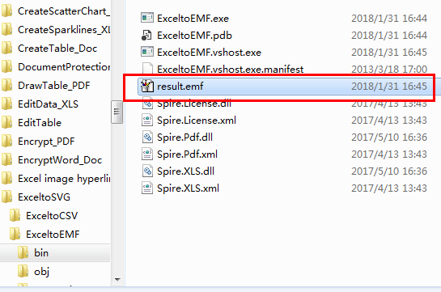

# C# How to convert Excel to multiple formats file via free .NET library
## Requires
- Visual Studio 2013
## License
- MS-LPL
## Technologies
- C#
- .NET
- Class Library
- c# control
- Excel API
## Topics
- C#
- Excel
- .Net Programming
- Convert Excel to SVG/CSV/Ods/Emf
## Updated
- 02/08/2018
## Description

<h1>Introduction</h1>

This sample demonstrates how to convert the Excel file to multiple formats file including EXCEL to SVG, EXCEL to CSV, EXCEL to XLSM, EXCEL to EMF and EXCEL to ODS using the Free 3rd party library.

<strong>Tools you need</strong>

<ul>
<li><a href="https://www.e-iceblue.com/Introduce/free-xls-component.html"><strong><em>Free Spire.XLS for .NET</em></strong>.</a>
</li><li>Visual Studio 2013 </li></ul>

<strong>Prerequisites</strong>

<a href="https://www.e-iceblue.com/Download/download-excel-for-net-free.html"><strong>Download</strong></a><strong>
</strong>the <strong><em>Free Spire.XLS for .NET </em></strong>first and install it correctly, then reference the Spire.XLS.dll file into the project. The samples below illustrate the details.

Description

<strong>1. Excel to SVG</strong>

C#

编辑脚本|Remove

csharp

<pre class="csharp">using&nbsp;<a class="libraryLink" href="https://msdn.microsoft.com/en-US/library/System.IO.aspx" target="_blank" title="Auto generated link to System.IO">System.IO</a>;&nbsp;
using&nbsp;Spire.Xls;&nbsp;
&nbsp;
namespace&nbsp;Excel_to_SVG&nbsp;
{&nbsp;
&nbsp;&nbsp;&nbsp;&nbsp;class&nbsp;Program&nbsp;
&nbsp;&nbsp;&nbsp;&nbsp;{&nbsp;
&nbsp;&nbsp;&nbsp;&nbsp;&nbsp;&nbsp;&nbsp;&nbsp;static&nbsp;void&nbsp;Main(string[]&nbsp;args)&nbsp;
&nbsp;&nbsp;&nbsp;&nbsp;&nbsp;&nbsp;&nbsp;&nbsp;{&nbsp;
&nbsp;&nbsp;&nbsp;&nbsp;&nbsp;&nbsp;&nbsp;&nbsp;&nbsp;&nbsp;&nbsp;&nbsp;//Create&nbsp;an&nbsp;object&nbsp;of&nbsp;Workbook&nbsp;class&nbsp;and&nbsp;load&nbsp;the&nbsp;excel&nbsp;file&nbsp;
&nbsp;&nbsp;&nbsp;&nbsp;&nbsp;&nbsp;&nbsp;&nbsp;&nbsp;&nbsp;&nbsp;&nbsp;Workbook&nbsp;workbook&nbsp;=&nbsp;new&nbsp;Workbook();&nbsp;
&nbsp;&nbsp;&nbsp;&nbsp;&nbsp;&nbsp;&nbsp;&nbsp;&nbsp;&nbsp;&nbsp;&nbsp;workbook.LoadFromFile(@&quot;C:\Users\Administrator\Desktop\test.xlsx&quot;);&nbsp;
&nbsp;&nbsp;&nbsp;&nbsp;&nbsp;&nbsp;&nbsp;&nbsp;&nbsp;&nbsp;&nbsp;&nbsp;/*Create&nbsp;a&nbsp;file&nbsp;stream,&nbsp;call&nbsp;ToSVGStream(Stream&nbsp;stream,&nbsp;int&nbsp;firstRow,&nbsp;int&nbsp;firstColumn,&nbsp;int&nbsp;lastRow,&nbsp;int&nbsp;lastColumn)&nbsp;method&nbsp;to&nbsp;save&nbsp;each&nbsp;worksheet&nbsp;of&nbsp;the&nbsp;workbook&nbsp;to&nbsp;SVG&nbsp;stream&nbsp;and&nbsp;then&nbsp;save&nbsp;to&nbsp;the&nbsp;file&nbsp;stream.*/&nbsp;
&nbsp;&nbsp;&nbsp;&nbsp;&nbsp;&nbsp;&nbsp;&nbsp;&nbsp;&nbsp;&nbsp;&nbsp;for&nbsp;(int&nbsp;i&nbsp;=&nbsp;0;&nbsp;i&nbsp;&lt;&nbsp;workbook.Worksheets.Count;&nbsp;i&#43;&#43;)&nbsp;
&nbsp;&nbsp;&nbsp;&nbsp;&nbsp;&nbsp;&nbsp;&nbsp;&nbsp;&nbsp;&nbsp;&nbsp;{&nbsp;
&nbsp;&nbsp;&nbsp;&nbsp;&nbsp;&nbsp;&nbsp;&nbsp;&nbsp;&nbsp;&nbsp;&nbsp;&nbsp;&nbsp;&nbsp;&nbsp;FileStream&nbsp;fs&nbsp;=&nbsp;new&nbsp;FileStream(string.Format(&quot;E:\\Program&nbsp;Files\\sheet-{0}.svg&quot;,&nbsp;i),&nbsp;FileMode.Create);&nbsp;
&nbsp;&nbsp;&nbsp;&nbsp;&nbsp;&nbsp;&nbsp;&nbsp;&nbsp;&nbsp;&nbsp;&nbsp;&nbsp;&nbsp;&nbsp;&nbsp;workbook.Worksheets[i].ToSVGStream(fs,&nbsp;0,&nbsp;0,&nbsp;0,&nbsp;0);&nbsp;
&nbsp;&nbsp;&nbsp;&nbsp;&nbsp;&nbsp;&nbsp;&nbsp;&nbsp;&nbsp;&nbsp;&nbsp;&nbsp;&nbsp;&nbsp;&nbsp;fs.Flush();&nbsp;
&nbsp;&nbsp;&nbsp;&nbsp;&nbsp;&nbsp;&nbsp;&nbsp;&nbsp;&nbsp;&nbsp;&nbsp;&nbsp;&nbsp;&nbsp;&nbsp;fs.Close();&nbsp;
&nbsp;&nbsp;&nbsp;&nbsp;&nbsp;&nbsp;&nbsp;&nbsp;&nbsp;&nbsp;&nbsp;&nbsp;}&nbsp;
&nbsp;&nbsp;&nbsp;&nbsp;&nbsp;&nbsp;&nbsp;&nbsp;}&nbsp;
&nbsp;&nbsp;&nbsp;&nbsp;}&nbsp;
}&nbsp;
</pre>

Output:

<strong>2. Excel to CSV</strong>

C#

编辑脚本|Remove

csharp

<pre class="csharp">using&nbsp;Spire.Xls;&nbsp;
using&nbsp;<a class="libraryLink" href="https://msdn.microsoft.com/en-US/library/System.Text.aspx" target="_blank" title="Auto generated link to System.Text">System.Text</a>;&nbsp;
&nbsp;
namespace&nbsp;ExceltoCSV&nbsp;
{&nbsp;
&nbsp;&nbsp;&nbsp;&nbsp;class&nbsp;Program&nbsp;
&nbsp;&nbsp;&nbsp;&nbsp;{&nbsp;
&nbsp;&nbsp;&nbsp;&nbsp;&nbsp;&nbsp;&nbsp;&nbsp;static&nbsp;void&nbsp;Main(string[]&nbsp;args)&nbsp;
&nbsp;&nbsp;&nbsp;&nbsp;&nbsp;&nbsp;&nbsp;&nbsp;{&nbsp;
&nbsp;&nbsp;&nbsp;&nbsp;&nbsp;&nbsp;&nbsp;&nbsp;&nbsp;&nbsp;&nbsp;&nbsp;//Initialize&nbsp;an&nbsp;instance&nbsp;of&nbsp;Workbook&nbsp;class&nbsp;and&nbsp;load&nbsp;the&nbsp;excel&nbsp;file&nbsp;
&nbsp;&nbsp;&nbsp;&nbsp;&nbsp;&nbsp;&nbsp;&nbsp;&nbsp;&nbsp;&nbsp;&nbsp;Workbook&nbsp;workbook&nbsp;=&nbsp;new&nbsp;Workbook();&nbsp;
&nbsp;&nbsp;&nbsp;&nbsp;&nbsp;&nbsp;&nbsp;&nbsp;&nbsp;&nbsp;&nbsp;&nbsp;workbook.LoadFromFile(@&quot;C:\Users\Administrator\Desktop\test.xlsx&quot;);&nbsp;
&nbsp;&nbsp;&nbsp;&nbsp;&nbsp;&nbsp;&nbsp;&nbsp;&nbsp;&nbsp;&nbsp;&nbsp;//Get&nbsp;the&nbsp;first&nbsp;sheet&nbsp;and&nbsp;save&nbsp;to&nbsp;csv&nbsp;format&nbsp;file&nbsp;&nbsp;
&nbsp;&nbsp;&nbsp;&nbsp;&nbsp;&nbsp;&nbsp;&nbsp;&nbsp;&nbsp;&nbsp;&nbsp;Worksheet&nbsp;sheet&nbsp;=&nbsp;workbook.Worksheets[0];&nbsp;
&nbsp;&nbsp;&nbsp;&nbsp;&nbsp;&nbsp;&nbsp;&nbsp;&nbsp;&nbsp;&nbsp;&nbsp;sheet.SaveToFile(&quot;sample.csv&quot;,&nbsp;&quot;&nbsp;&quot;,&nbsp;Encoding.UTF8);&nbsp;
&nbsp;
&nbsp;&nbsp;&nbsp;&nbsp;&nbsp;&nbsp;&nbsp;&nbsp;}&nbsp;
&nbsp;&nbsp;&nbsp;&nbsp;}&nbsp;
}&nbsp;
</pre>

<strong>output:</strong>

<strong> 
</strong>

<strong>3. Excel to XLSM</strong>

C#

编辑脚本|Remove

csharp

<pre class="csharp">using&nbsp;Spire.Xls;&nbsp;
&nbsp;
namespace&nbsp;XLStoXLSM&nbsp;
{&nbsp;
&nbsp;&nbsp;&nbsp;&nbsp;class&nbsp;Program&nbsp;
&nbsp;&nbsp;&nbsp;&nbsp;{&nbsp;
&nbsp;&nbsp;&nbsp;&nbsp;&nbsp;&nbsp;&nbsp;&nbsp;static&nbsp;void&nbsp;Main(string[]&nbsp;args)&nbsp;
&nbsp;&nbsp;&nbsp;&nbsp;&nbsp;&nbsp;&nbsp;&nbsp;{&nbsp;
&nbsp;&nbsp;&nbsp;&nbsp;&nbsp;&nbsp;&nbsp;&nbsp;&nbsp;&nbsp;&nbsp;&nbsp;//Initialize&nbsp;an&nbsp;instance&nbsp;of&nbsp;Workbook&nbsp;class&nbsp;and&nbsp;load&nbsp;the&nbsp;file&nbsp;&nbsp;
&nbsp;&nbsp;&nbsp;&nbsp;&nbsp;&nbsp;&nbsp;&nbsp;&nbsp;&nbsp;&nbsp;&nbsp;Workbook&nbsp;workbook&nbsp;=&nbsp;new&nbsp;Workbook();&nbsp;
&nbsp;&nbsp;&nbsp;&nbsp;&nbsp;&nbsp;&nbsp;&nbsp;&nbsp;&nbsp;&nbsp;&nbsp;workbook.LoadFromFile(@&quot;C:\Users\Administrator\Desktop\test.xlsx&quot;,&nbsp;ExcelVersion.Version97to2003);&nbsp;
&nbsp;&nbsp;&nbsp;&nbsp;&nbsp;&nbsp;&nbsp;&nbsp;&nbsp;&nbsp;&nbsp;&nbsp;//Save&nbsp;to&nbsp;the&nbsp;XLSM&nbsp;format&nbsp;file&nbsp;
&nbsp;&nbsp;&nbsp;&nbsp;&nbsp;&nbsp;&nbsp;&nbsp;&nbsp;&nbsp;&nbsp;&nbsp;workbook.SaveToFile(&quot;result.xlsm&quot;,&nbsp;FileFormat.Version2007);&nbsp;
&nbsp;&nbsp;&nbsp;&nbsp;&nbsp;&nbsp;&nbsp;&nbsp;}&nbsp;
&nbsp;&nbsp;&nbsp;&nbsp;}&nbsp;
}&nbsp;</pre>

<strong>4. Excel to ODS</strong>

C#

编辑脚本|Remove

csharp

<pre class="csharp">using&nbsp;Spire.Xls;&nbsp;
&nbsp;
namespace&nbsp;ExceltoOds&nbsp;
{&nbsp;
&nbsp;&nbsp;&nbsp;&nbsp;class&nbsp;Program&nbsp;
&nbsp;&nbsp;&nbsp;&nbsp;{&nbsp;
&nbsp;&nbsp;&nbsp;&nbsp;&nbsp;&nbsp;&nbsp;&nbsp;static&nbsp;void&nbsp;Main(string[]&nbsp;args)&nbsp;
&nbsp;&nbsp;&nbsp;&nbsp;&nbsp;&nbsp;&nbsp;&nbsp;{&nbsp;
&nbsp;&nbsp;&nbsp;&nbsp;&nbsp;&nbsp;&nbsp;&nbsp;&nbsp;&nbsp;&nbsp;&nbsp;//Create&nbsp;an&nbsp;object&nbsp;of&nbsp;Workbook&nbsp;class&nbsp;and&nbsp;load&nbsp;excel&nbsp;file&nbsp;from&nbsp;system&nbsp;
&nbsp;&nbsp;&nbsp;&nbsp;&nbsp;&nbsp;&nbsp;&nbsp;&nbsp;&nbsp;&nbsp;&nbsp;Workbook&nbsp;workbook&nbsp;=&nbsp;new&nbsp;Workbook();&nbsp;
&nbsp;&nbsp;&nbsp;&nbsp;&nbsp;&nbsp;&nbsp;&nbsp;&nbsp;&nbsp;&nbsp;&nbsp;workbook.LoadFromFile(@&quot;C:\Users\Administrator\Desktop\test.xlsx&quot;);&nbsp;
&nbsp;&nbsp;&nbsp;&nbsp;&nbsp;&nbsp;&nbsp;&nbsp;&nbsp;&nbsp;&nbsp;&nbsp;//Save&nbsp;to&nbsp;ODS&nbsp;format&nbsp;file&nbsp;
&nbsp;&nbsp;&nbsp;&nbsp;&nbsp;&nbsp;&nbsp;&nbsp;&nbsp;&nbsp;&nbsp;&nbsp;workbook.SaveToFile(&quot;Result.ods&quot;,&nbsp;FileFormat.ODS);&nbsp;
&nbsp;&nbsp;&nbsp;&nbsp;&nbsp;&nbsp;&nbsp;&nbsp;}&nbsp;
&nbsp;&nbsp;&nbsp;&nbsp;}&nbsp;
}&nbsp;</pre>

<strong>Result:</strong>

<strong> 
</strong>

<strong>5.<strong>Excel to EMF</strong></strong>

C#

编辑脚本|Remove

csharp

<pre class="csharp">using&nbsp;Spire.Xls;&nbsp;
&nbsp;
namespace&nbsp;ExceltoEMF&nbsp;
{&nbsp;
&nbsp;&nbsp;&nbsp;&nbsp;class&nbsp;Program&nbsp;
&nbsp;&nbsp;&nbsp;&nbsp;{&nbsp;
&nbsp;&nbsp;&nbsp;&nbsp;&nbsp;&nbsp;&nbsp;&nbsp;static&nbsp;void&nbsp;Main(string[]&nbsp;args)&nbsp;
&nbsp;&nbsp;&nbsp;&nbsp;&nbsp;&nbsp;&nbsp;&nbsp;{&nbsp;
&nbsp;&nbsp;&nbsp;&nbsp;&nbsp;&nbsp;&nbsp;&nbsp;&nbsp;&nbsp;&nbsp;&nbsp;//Create&nbsp;an&nbsp;object&nbsp;of&nbsp;Workbook&nbsp;class&nbsp;and&nbsp;load&nbsp;excel&nbsp;file&nbsp;from&nbsp;system&nbsp;
&nbsp;&nbsp;&nbsp;&nbsp;&nbsp;&nbsp;&nbsp;&nbsp;&nbsp;&nbsp;&nbsp;&nbsp;Workbook&nbsp;workbook&nbsp;=&nbsp;new&nbsp;Workbook();&nbsp;
&nbsp;&nbsp;&nbsp;&nbsp;&nbsp;&nbsp;&nbsp;&nbsp;&nbsp;&nbsp;&nbsp;&nbsp;workbook.LoadFromFile(@&quot;C:\Users\Administrator\Desktop\test.xlsx&quot;);&nbsp;
&nbsp;&nbsp;&nbsp;&nbsp;&nbsp;&nbsp;&nbsp;&nbsp;&nbsp;&nbsp;&nbsp;&nbsp;//Get&nbsp;the&nbsp;first&nbsp;worksheet&nbsp;and&nbsp;save&nbsp;to&nbsp;EMF&nbsp;format&nbsp;file&nbsp;
&nbsp;&nbsp;&nbsp;&nbsp;&nbsp;&nbsp;&nbsp;&nbsp;&nbsp;&nbsp;&nbsp;&nbsp;Worksheet&nbsp;sheet&nbsp;=&nbsp;workbook.Worksheets[0];&nbsp;
&nbsp;&nbsp;&nbsp;&nbsp;&nbsp;&nbsp;&nbsp;&nbsp;&nbsp;&nbsp;&nbsp;&nbsp;sheet.SaveToEMFImage(&quot;result.emf&quot;,&nbsp;1,&nbsp;1,&nbsp;19,&nbsp;6,&nbsp;System.Drawing.Imaging.EmfType.EmfPlusDual);&nbsp;
&nbsp;&nbsp;&nbsp;&nbsp;&nbsp;&nbsp;&nbsp;&nbsp;}&nbsp;
&nbsp;&nbsp;&nbsp;&nbsp;}&nbsp;
}&nbsp;
</pre>

<strong>&nbsp;Result:</strong>

<strong></strong>

<strong>About Free Spire.XLS for .NET</strong>

As a standalone C#/VB.NET component, <em>Free Spire.XLS for .NET</em> is a totally free Excel component for commercial and personal use, and enables developers to create, manage and manipulate Excel files on any .NET applications. More about the powerful
 conversion capacities, see the samples here.

<ul>
<li><a href="https://code.msdn.microsoft.com/Processing-excel-document-8969f948">EXCEL to PDF</a>
</li><li><a href="https://code.msdn.microsoft.com/Export-Excel-documents-to-ed0f418b#content">EXCEL to IMAGE</a>
</li><li><a href="https://code.msdn.microsoft.com/Convert-Excel-to-XML-and-8995eb98">EXCEL to XML and XML to EXCEL</a>
</li><li><a href="https://code.msdn.microsoft.com/Convert-Excel-to-HTML-with-a8760154">EXCEL to HTML</a>
</li><li><a href="https://code.msdn.microsoft.com/Convert-Excel-to-XPS-in-C-19b35b25">EXCEL to XPS</a>
</li><li><a href="https://code.msdn.microsoft.com/Export-Excel-Data-to-Text-015bc013">EXCEL to TXT</a>
</li></ul>

&nbsp;

<strong>More Features</strong>

<ul>
<li>Find and Replace Data </li><li>Print excel files </li><li>Import/Export data from a DataTable, DataView, Array, DataGrid etc. </li><li>Save Excel to file/Stream or as web response </li><li>Create charts </li><li>Read and write hyperlinks </li><li>Create auto filters </li><li>Implement Data Sorting </li><li>Implement Data Validations </li><li>Merge/Unmerge Cells and files </li><li>Group/UnGroup Rows and Columns </li><li>Insert/Delete or Hide Rows, Columns and Sheets </li><li>Calculate Complex Excel Formula </li><li>Freeze/Unfreeze Panes </li><li>Insert Hyperlinks to link data </li><li>Protect/Unprotect Worksheets </li><li>Create Pivot Tables </li><li>Encrypt/Decrypt Files </li><li>Load/Save Excel VBA </li><li>Merge data into Excel with MarkerDesigner </li></ul>

&nbsp;

<strong>Related links</strong>

Website: <a href="https://www.e-iceblue.com/">https://www.e-iceblue.com/</a>

Product Introduction: <a href="https://www.e-iceblue.com/Introduce/free-xls-component.html">
https://www.e-iceblue.com/Introduce/free-xls-component.html</a>

Download Address: <a href="https://www.e-iceblue.com/Download/download-excel-for-net-free.html">
https://www.e-iceblue.com/Download/download-excel-for-net-free.html</a>

Contact: <a href="https://www.e-iceblue.com/Misc/maillist.html">https://www.e-iceblue.com/Misc/maillist.html</a>

