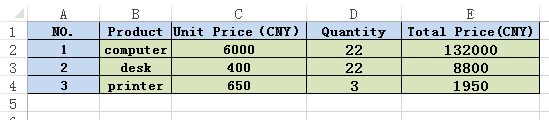

# C# How to export table from Excel to Word preserving formatting
## Requires
- Visual Studio 2013
## License
- MS-LPL
## Technologies
- Controls
- C#
- ASP.NET
- .NET
- Class Library
- Visual Studio 2013
- C# programming
## Topics
- C#
- .NET
- How to
- Export to Word
- export table from Excel to Word
## Updated
- 02/27/2018
## Description

<h1>Introduction</h1>

<strong>The tools you need</strong>: Free Spire.Office for .NET

&nbsp; &nbsp; &nbsp; &nbsp; &nbsp; &nbsp; &nbsp; &nbsp; &nbsp; &nbsp; &nbsp; &nbsp; &nbsp; &nbsp; &nbsp; &nbsp; Visual studio 2013

<strong>Preparations before coding</strong>: you should download and install the package of Free Spire.Office for .NET correctly, then add the dll files of Spire.Doc and Spire.XLS into the program assemblies as references, and add the using directives as
 well.&nbsp;

C#

编辑脚本|Remove

csharp

<pre class="csharp">using&nbsp;Spire.Doc;&nbsp;
using&nbsp;Spire.Doc.Documents;&nbsp;
using&nbsp;Spire.Doc.Fields;&nbsp;
using&nbsp;Spire.Doc.Formatting;&nbsp;
using&nbsp;Spire.Xls;&nbsp;
using&nbsp;Spire.Xls.Collections;&nbsp;
using&nbsp;Spire.Xls.Core;&nbsp;
using&nbsp;System;&nbsp;
&nbsp;
namespace&nbsp;Xls2Doc&nbsp;
{&nbsp;
&nbsp;&nbsp;&nbsp;&nbsp;class&nbsp;Program&nbsp;
&nbsp;&nbsp;&nbsp;&nbsp;{&nbsp;
&nbsp;&nbsp;&nbsp;&nbsp;&nbsp;&nbsp;&nbsp;&nbsp;static&nbsp;void&nbsp;Main(string[]&nbsp;args)&nbsp;
&nbsp;&nbsp;&nbsp;&nbsp;&nbsp;&nbsp;&nbsp;&nbsp;{&nbsp;
&nbsp;&nbsp;&nbsp;&nbsp;&nbsp;&nbsp;&nbsp;&nbsp;&nbsp;&nbsp;&nbsp;&nbsp;//Initialize&nbsp;an&nbsp;instance&nbsp;of&nbsp;Workbook&nbsp;class&nbsp;and&nbsp;load&nbsp;excel&nbsp;from&nbsp;file&nbsp;
&nbsp;&nbsp;&nbsp;&nbsp;&nbsp;&nbsp;&nbsp;&nbsp;&nbsp;&nbsp;&nbsp;&nbsp;Workbook&nbsp;workbook&nbsp;=&nbsp;new&nbsp;Workbook();&nbsp;
&nbsp;&nbsp;&nbsp;&nbsp;&nbsp;&nbsp;&nbsp;&nbsp;&nbsp;&nbsp;&nbsp;&nbsp;workbook.LoadFromFile(@&quot;C:\Users\Administrator\Desktop\sample.xlsx&quot;);&nbsp;
&nbsp;&nbsp;&nbsp;&nbsp;&nbsp;&nbsp;&nbsp;&nbsp;&nbsp;&nbsp;&nbsp;&nbsp;//Get&nbsp;the&nbsp;first&nbsp;worksheet&nbsp;
&nbsp;&nbsp;&nbsp;&nbsp;&nbsp;&nbsp;&nbsp;&nbsp;&nbsp;&nbsp;&nbsp;&nbsp;Worksheet&nbsp;sheet&nbsp;=&nbsp;workbook.Worksheets[0];&nbsp;
&nbsp;
&nbsp;&nbsp;&nbsp;&nbsp;&nbsp;&nbsp;&nbsp;&nbsp;&nbsp;&nbsp;&nbsp;&nbsp;//Create&nbsp;an&nbsp;object&nbsp;of&nbsp;Document&nbsp;class,&nbsp;add&nbsp;table&nbsp;to&nbsp;Word&nbsp;and&nbsp;set&nbsp;the&nbsp;rows&nbsp;and&nbsp;columns&nbsp;number&nbsp;based&nbsp;on&nbsp;the&nbsp;cells&nbsp;range&nbsp;that&nbsp;contains&nbsp;data&nbsp;&nbsp;
&nbsp;&nbsp;&nbsp;&nbsp;&nbsp;&nbsp;&nbsp;&nbsp;&nbsp;&nbsp;&nbsp;&nbsp;Document&nbsp;doc&nbsp;=&nbsp;new&nbsp;Document();&nbsp;
&nbsp;&nbsp;&nbsp;&nbsp;&nbsp;&nbsp;&nbsp;&nbsp;&nbsp;&nbsp;&nbsp;&nbsp;Table&nbsp;table&nbsp;=&nbsp;doc.AddSection().AddTable(true);&nbsp;
&nbsp;&nbsp;&nbsp;&nbsp;&nbsp;&nbsp;&nbsp;&nbsp;&nbsp;&nbsp;&nbsp;&nbsp;table.ResetCells(sheet.LastRow,&nbsp;sheet.LastColumn);&nbsp;
&nbsp;
&nbsp;&nbsp;&nbsp;&nbsp;&nbsp;&nbsp;&nbsp;&nbsp;&nbsp;&nbsp;&nbsp;&nbsp;//Traverse&nbsp;the&nbsp;rows&nbsp;and&nbsp;columns&nbsp;of&nbsp;table&nbsp;in&nbsp;worksheet&nbsp;and&nbsp;get&nbsp;the&nbsp;cells,&nbsp;call&nbsp;a&nbsp;custom&nbsp;function&nbsp;CopyStyle()&nbsp;to&nbsp;copy&nbsp;the&nbsp;font&nbsp;style&nbsp;and&nbsp;cell&nbsp;style&nbsp;from&nbsp;Excel&nbsp;to&nbsp;Word&nbsp;table.&nbsp;
&nbsp;&nbsp;&nbsp;&nbsp;&nbsp;&nbsp;&nbsp;&nbsp;&nbsp;&nbsp;&nbsp;&nbsp;for&nbsp;(int&nbsp;r&nbsp;=&nbsp;1;&nbsp;r&nbsp;&lt;=&nbsp;sheet.LastRow;&nbsp;r&#43;&#43;)&nbsp;
&nbsp;&nbsp;&nbsp;&nbsp;&nbsp;&nbsp;&nbsp;&nbsp;&nbsp;&nbsp;&nbsp;&nbsp;{&nbsp;
&nbsp;&nbsp;&nbsp;&nbsp;&nbsp;&nbsp;&nbsp;&nbsp;&nbsp;&nbsp;&nbsp;&nbsp;&nbsp;&nbsp;&nbsp;&nbsp;for&nbsp;(int&nbsp;c&nbsp;=&nbsp;1;&nbsp;c&nbsp;&lt;=&nbsp;sheet.LastColumn;&nbsp;c&#43;&#43;)&nbsp;
&nbsp;&nbsp;&nbsp;&nbsp;&nbsp;&nbsp;&nbsp;&nbsp;&nbsp;&nbsp;&nbsp;&nbsp;&nbsp;&nbsp;&nbsp;&nbsp;{&nbsp;
&nbsp;&nbsp;&nbsp;&nbsp;&nbsp;&nbsp;&nbsp;&nbsp;&nbsp;&nbsp;&nbsp;&nbsp;&nbsp;&nbsp;&nbsp;&nbsp;&nbsp;&nbsp;&nbsp;&nbsp;CellRange&nbsp;xCell&nbsp;=&nbsp;sheet.Range[r,&nbsp;c];&nbsp;
&nbsp;&nbsp;&nbsp;&nbsp;&nbsp;&nbsp;&nbsp;&nbsp;&nbsp;&nbsp;&nbsp;&nbsp;&nbsp;&nbsp;&nbsp;&nbsp;&nbsp;&nbsp;&nbsp;&nbsp;TableCell&nbsp;wCell&nbsp;=&nbsp;table.Rows[r&nbsp;-&nbsp;1].Cells[c&nbsp;-&nbsp;1];&nbsp;
&nbsp;&nbsp;&nbsp;&nbsp;&nbsp;&nbsp;&nbsp;&nbsp;&nbsp;&nbsp;&nbsp;&nbsp;&nbsp;&nbsp;&nbsp;&nbsp;&nbsp;&nbsp;&nbsp;&nbsp;//Fill&nbsp;data&nbsp;to&nbsp;Word&nbsp;table&nbsp;
&nbsp;&nbsp;&nbsp;&nbsp;&nbsp;&nbsp;&nbsp;&nbsp;&nbsp;&nbsp;&nbsp;&nbsp;&nbsp;&nbsp;&nbsp;&nbsp;&nbsp;&nbsp;&nbsp;&nbsp;TextRange&nbsp;textRange&nbsp;=&nbsp;wCell.AddParagraph().AppendText(xCell.NumberText);&nbsp;
&nbsp;&nbsp;&nbsp;&nbsp;&nbsp;&nbsp;&nbsp;&nbsp;&nbsp;&nbsp;&nbsp;&nbsp;&nbsp;&nbsp;&nbsp;&nbsp;&nbsp;&nbsp;&nbsp;&nbsp;//Copy&nbsp;the&nbsp;formatting&nbsp;of&nbsp;table&nbsp;to&nbsp;Word&nbsp;
&nbsp;&nbsp;&nbsp;&nbsp;&nbsp;&nbsp;&nbsp;&nbsp;&nbsp;&nbsp;&nbsp;&nbsp;&nbsp;&nbsp;&nbsp;&nbsp;&nbsp;&nbsp;&nbsp;&nbsp;CopyStyle(textRange,&nbsp;xCell,&nbsp;wCell);&nbsp;
&nbsp;&nbsp;&nbsp;&nbsp;&nbsp;&nbsp;&nbsp;&nbsp;&nbsp;&nbsp;&nbsp;&nbsp;&nbsp;&nbsp;&nbsp;&nbsp;}&nbsp;
&nbsp;&nbsp;&nbsp;&nbsp;&nbsp;&nbsp;&nbsp;&nbsp;&nbsp;&nbsp;&nbsp;&nbsp;}&nbsp;
&nbsp;&nbsp;&nbsp;&nbsp;&nbsp;&nbsp;&nbsp;&nbsp;&nbsp;&nbsp;&nbsp;&nbsp;//Set&nbsp;column&nbsp;width&nbsp;of&nbsp;Word&nbsp;table&nbsp;in&nbsp;Word&nbsp;
&nbsp;&nbsp;&nbsp;&nbsp;&nbsp;&nbsp;&nbsp;&nbsp;&nbsp;&nbsp;&nbsp;&nbsp;for&nbsp;(int&nbsp;i&nbsp;=&nbsp;0;&nbsp;i&nbsp;&lt;&nbsp;table.Rows.Count;&nbsp;i&#43;&#43;)&nbsp;
&nbsp;&nbsp;&nbsp;&nbsp;&nbsp;&nbsp;&nbsp;&nbsp;&nbsp;&nbsp;&nbsp;&nbsp;{&nbsp;
&nbsp;&nbsp;&nbsp;&nbsp;&nbsp;&nbsp;&nbsp;&nbsp;&nbsp;&nbsp;&nbsp;&nbsp;&nbsp;&nbsp;&nbsp;&nbsp;for&nbsp;(int&nbsp;j&nbsp;=&nbsp;0;&nbsp;j&nbsp;&lt;&nbsp;table.Rows[i].Cells.Count;&nbsp;j&#43;&#43;)&nbsp;
&nbsp;&nbsp;&nbsp;&nbsp;&nbsp;&nbsp;&nbsp;&nbsp;&nbsp;&nbsp;&nbsp;&nbsp;&nbsp;&nbsp;&nbsp;&nbsp;{&nbsp;
&nbsp;&nbsp;&nbsp;&nbsp;&nbsp;&nbsp;&nbsp;&nbsp;&nbsp;&nbsp;&nbsp;&nbsp;&nbsp;&nbsp;&nbsp;&nbsp;&nbsp;&nbsp;&nbsp;&nbsp;table.Rows[i].Cells[j].Width&nbsp;=&nbsp;100f;&nbsp;
&nbsp;&nbsp;&nbsp;&nbsp;&nbsp;&nbsp;&nbsp;&nbsp;&nbsp;&nbsp;&nbsp;&nbsp;&nbsp;&nbsp;&nbsp;&nbsp;}&nbsp;
&nbsp;&nbsp;&nbsp;&nbsp;&nbsp;&nbsp;&nbsp;&nbsp;&nbsp;&nbsp;&nbsp;&nbsp;}&nbsp;
&nbsp;&nbsp;&nbsp;&nbsp;&nbsp;&nbsp;&nbsp;&nbsp;&nbsp;&nbsp;&nbsp;&nbsp;//Save&nbsp;document&nbsp;
&nbsp;&nbsp;&nbsp;&nbsp;&nbsp;&nbsp;&nbsp;&nbsp;&nbsp;&nbsp;&nbsp;&nbsp;doc.SaveToFile(&quot;result.doc&quot;,&nbsp;Spire.Doc.FileFormat.Docx);&nbsp;
&nbsp;&nbsp;&nbsp;&nbsp;&nbsp;&nbsp;&nbsp;&nbsp;&nbsp;&nbsp;&nbsp;&nbsp;<a class="libraryLink" href="https://msdn.microsoft.com/en-US/library/System.Diagnostics.Process.Start.aspx" target="_blank" title="Auto generated link to System.Diagnostics.Process.Start">System.Diagnostics.Process.Start</a>(&quot;result.doc&quot;);&nbsp;
&nbsp;&nbsp;&nbsp;&nbsp;&nbsp;&nbsp;&nbsp;&nbsp;}&nbsp;
&nbsp;&nbsp;&nbsp;&nbsp;&nbsp;&nbsp;&nbsp;&nbsp;//The&nbsp;custom&nbsp;function&nbsp;CopyStyle()&nbsp;is&nbsp;defined&nbsp;as&nbsp;below&nbsp;
&nbsp;&nbsp;&nbsp;&nbsp;&nbsp;&nbsp;&nbsp;&nbsp;private&nbsp;static&nbsp;void&nbsp;CopyStyle(TextRange&nbsp;wTextRange,&nbsp;CellRange&nbsp;xCell,&nbsp;TableCell&nbsp;wCell)&nbsp;
&nbsp;&nbsp;&nbsp;&nbsp;&nbsp;&nbsp;&nbsp;&nbsp;{&nbsp;
&nbsp;&nbsp;&nbsp;&nbsp;&nbsp;&nbsp;&nbsp;&nbsp;&nbsp;&nbsp;&nbsp;&nbsp;//Copy&nbsp;font&nbsp;style&nbsp;
&nbsp;&nbsp;&nbsp;&nbsp;&nbsp;&nbsp;&nbsp;&nbsp;&nbsp;&nbsp;&nbsp;&nbsp;wTextRange.CharacterFormat.TextColor&nbsp;=&nbsp;xCell.Style.Font.Color;&nbsp;
&nbsp;&nbsp;&nbsp;&nbsp;&nbsp;&nbsp;&nbsp;&nbsp;&nbsp;&nbsp;&nbsp;&nbsp;wTextRange.CharacterFormat.FontSize&nbsp;=&nbsp;(float)xCell.Style.Font.Size;&nbsp;
&nbsp;&nbsp;&nbsp;&nbsp;&nbsp;&nbsp;&nbsp;&nbsp;&nbsp;&nbsp;&nbsp;&nbsp;wTextRange.CharacterFormat.FontName&nbsp;=&nbsp;xCell.Style.Font.FontName;&nbsp;
&nbsp;&nbsp;&nbsp;&nbsp;&nbsp;&nbsp;&nbsp;&nbsp;&nbsp;&nbsp;&nbsp;&nbsp;wTextRange.CharacterFormat.Bold&nbsp;=&nbsp;xCell.Style.Font.IsBold;&nbsp;
&nbsp;&nbsp;&nbsp;&nbsp;&nbsp;&nbsp;&nbsp;&nbsp;&nbsp;&nbsp;&nbsp;&nbsp;wTextRange.CharacterFormat.Italic&nbsp;=&nbsp;xCell.Style.Font.IsItalic;&nbsp;
&nbsp;&nbsp;&nbsp;&nbsp;&nbsp;&nbsp;&nbsp;&nbsp;&nbsp;&nbsp;&nbsp;&nbsp;//Copy&nbsp;backcolor&nbsp;
&nbsp;&nbsp;&nbsp;&nbsp;&nbsp;&nbsp;&nbsp;&nbsp;&nbsp;&nbsp;&nbsp;&nbsp;wCell.CellFormat.BackColor&nbsp;=&nbsp;xCell.Style.Color;&nbsp;
&nbsp;&nbsp;&nbsp;&nbsp;&nbsp;&nbsp;&nbsp;&nbsp;&nbsp;&nbsp;&nbsp;&nbsp;//Copy&nbsp;text&nbsp;alignment&nbsp;
&nbsp;&nbsp;&nbsp;&nbsp;&nbsp;&nbsp;&nbsp;&nbsp;&nbsp;&nbsp;&nbsp;&nbsp;switch&nbsp;(xCell.HorizontalAlignment)&nbsp;
&nbsp;&nbsp;&nbsp;&nbsp;&nbsp;&nbsp;&nbsp;&nbsp;&nbsp;&nbsp;&nbsp;&nbsp;{&nbsp;
&nbsp;&nbsp;&nbsp;&nbsp;&nbsp;&nbsp;&nbsp;&nbsp;&nbsp;&nbsp;&nbsp;&nbsp;&nbsp;&nbsp;&nbsp;&nbsp;case&nbsp;HorizontalAlignType.Left:&nbsp;
&nbsp;&nbsp;&nbsp;&nbsp;&nbsp;&nbsp;&nbsp;&nbsp;&nbsp;&nbsp;&nbsp;&nbsp;&nbsp;&nbsp;&nbsp;&nbsp;&nbsp;&nbsp;&nbsp;&nbsp;wTextRange.OwnerParagraph.Format.HorizontalAlignment&nbsp;=&nbsp;HorizontalAlignment.Left;&nbsp;
&nbsp;&nbsp;&nbsp;&nbsp;&nbsp;&nbsp;&nbsp;&nbsp;&nbsp;&nbsp;&nbsp;&nbsp;&nbsp;&nbsp;&nbsp;&nbsp;&nbsp;&nbsp;&nbsp;&nbsp;break;&nbsp;
&nbsp;&nbsp;&nbsp;&nbsp;&nbsp;&nbsp;&nbsp;&nbsp;&nbsp;&nbsp;&nbsp;&nbsp;&nbsp;&nbsp;&nbsp;&nbsp;case&nbsp;HorizontalAlignType.Center:&nbsp;
&nbsp;&nbsp;&nbsp;&nbsp;&nbsp;&nbsp;&nbsp;&nbsp;&nbsp;&nbsp;&nbsp;&nbsp;&nbsp;&nbsp;&nbsp;&nbsp;&nbsp;&nbsp;&nbsp;&nbsp;wTextRange.OwnerParagraph.Format.HorizontalAlignment&nbsp;=&nbsp;HorizontalAlignment.Center;&nbsp;
&nbsp;&nbsp;&nbsp;&nbsp;&nbsp;&nbsp;&nbsp;&nbsp;&nbsp;&nbsp;&nbsp;&nbsp;&nbsp;&nbsp;&nbsp;&nbsp;&nbsp;&nbsp;&nbsp;&nbsp;break;&nbsp;
&nbsp;&nbsp;&nbsp;&nbsp;&nbsp;&nbsp;&nbsp;&nbsp;&nbsp;&nbsp;&nbsp;&nbsp;&nbsp;&nbsp;&nbsp;&nbsp;case&nbsp;HorizontalAlignType.Right:&nbsp;
&nbsp;&nbsp;&nbsp;&nbsp;&nbsp;&nbsp;&nbsp;&nbsp;&nbsp;&nbsp;&nbsp;&nbsp;&nbsp;&nbsp;&nbsp;&nbsp;&nbsp;&nbsp;&nbsp;&nbsp;wTextRange.OwnerParagraph.Format.HorizontalAlignment&nbsp;=&nbsp;HorizontalAlignment.Right;&nbsp;
&nbsp;&nbsp;&nbsp;&nbsp;&nbsp;&nbsp;&nbsp;&nbsp;&nbsp;&nbsp;&nbsp;&nbsp;&nbsp;&nbsp;&nbsp;&nbsp;&nbsp;&nbsp;&nbsp;&nbsp;break;&nbsp;
&nbsp;&nbsp;&nbsp;&nbsp;&nbsp;&nbsp;&nbsp;&nbsp;&nbsp;&nbsp;&nbsp;&nbsp;}&nbsp;
&nbsp;&nbsp;&nbsp;&nbsp;&nbsp;&nbsp;&nbsp;&nbsp;}&nbsp;
&nbsp;&nbsp;&nbsp;&nbsp;}&nbsp;
}&nbsp;
</pre>

<strong>Before: Table in EXCEL</strong>

<strong>After: Table in Word</strong>

<strong> 
</strong>

&nbsp;

<strong>More information</strong>

About Free Spire.Office for .NET

Free Spire.Office for .NET is a combination of Enterprise-Level Office .NET components offered by E-iceblue which allows developers to open, create, modify, convert, print, View MS Word, Excel, PowerPoint and PDF documents. It includes Free Spire.Doc, Free
 Spire.XLS, Free Spire.Spreadsheet, Free Spire.Presentation, Free Spire.PDF, Free Spire.DataExport, Free Spire.OfficeViewer, Free Spire.PDFViewer, Free Spire.DocViewer, Free Spire.Barcode and Free Spire.Email.&nbsp;Furthermore, it allows users to export
 data to popular files such as MS Word/Excel/RTF/Access, PowerPoint, PDF, XPS, HTML, XML, Text, CSV, DBF, Clipboard, SYLK, etc.

More information about those free components, you can visit the official website below.

<strong>Website</strong>: <a href="https://www.e-iceblue.com/">https://www.e-iceblue.com/</a>

<strong>Download address</strong>: <a href="https://www.e-iceblue.com/Download/office-for-net-free.html">
https://www.e-iceblue.com/Download/office-for-net-free.html</a>

