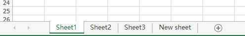
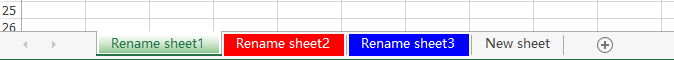

# C# How to rename the Excel worksheet and set tab color
## Requires
- Visual Studio 2013
## License
- MS-LPL
## Technologies
- C#
- .NET
- Windows Forms
- .NET Framework 4.0
- Visual Studio 2013
- Programming Languages
- Excel API
- 3rd class library
## Topics
- Controls
- C#
- Excel
- .NET
- Code Sample
- How to
- rename worksheet
## Updated
- 02/27/2018
## Description

<strong>Introduction</strong>

In this operation, you should download and install the component Free Spire.XLS for .NET first, and then add the dll file as a reference into the project assemblies. These code would show you how it works.

C#

编辑脚本|Remove

csharp

<pre class="csharp">using&nbsp;System;&nbsp;
using&nbsp;Spire.Xls;&nbsp;
using&nbsp;<a class="libraryLink" href="https://msdn.microsoft.com/en-US/library/System.Drawing.aspx" target="_blank" title="Auto generated link to System.Drawing">System.Drawing</a>;&nbsp;
&nbsp;
namespace&nbsp;RenameWorksheet_Excel&nbsp;
{&nbsp;
&nbsp;&nbsp;&nbsp;&nbsp;class&nbsp;Program&nbsp;
&nbsp;&nbsp;&nbsp;&nbsp;{&nbsp;
&nbsp;&nbsp;&nbsp;&nbsp;&nbsp;&nbsp;&nbsp;&nbsp;static&nbsp;void&nbsp;Main(string[]&nbsp;args)&nbsp;
&nbsp;&nbsp;&nbsp;&nbsp;&nbsp;&nbsp;&nbsp;&nbsp;{&nbsp;
&nbsp;&nbsp;&nbsp;&nbsp;&nbsp;&nbsp;&nbsp;&nbsp;&nbsp;&nbsp;&nbsp;//Create&nbsp;a&nbsp;Workbook&nbsp;class&nbsp;and&nbsp;load&nbsp;an&nbsp;instance&nbsp;from&nbsp;files&nbsp;
&nbsp;&nbsp;&nbsp;&nbsp;&nbsp;&nbsp;&nbsp;&nbsp;&nbsp;&nbsp;&nbsp;&nbsp;Workbook&nbsp;workbook&nbsp;=&nbsp;new&nbsp;Workbook();&nbsp;
&nbsp;&nbsp;&nbsp;&nbsp;&nbsp;&nbsp;&nbsp;&nbsp;&nbsp;&nbsp;&nbsp;&nbsp;workbook.LoadFromFile(@&quot;C:\Users\Administrator\Desktop\sampletest1.xlsx&quot;);&nbsp;
&nbsp;
&nbsp;&nbsp;&nbsp;&nbsp;&nbsp;&nbsp;&nbsp;&nbsp;&nbsp;&nbsp;&nbsp;&nbsp;//Get&nbsp;the&nbsp;sheet1,sheet2&nbsp;and&nbsp;sheet3&nbsp;
&nbsp;&nbsp;&nbsp;&nbsp;&nbsp;&nbsp;&nbsp;&nbsp;&nbsp;&nbsp;&nbsp;&nbsp;Worksheet&nbsp;worksheet&nbsp;=&nbsp;workbook.Worksheets[0];&nbsp;
&nbsp;&nbsp;&nbsp;&nbsp;&nbsp;&nbsp;&nbsp;&nbsp;&nbsp;&nbsp;&nbsp;&nbsp;Worksheet&nbsp;worksheet1&nbsp;=&nbsp;workbook.Worksheets[1];&nbsp;
&nbsp;&nbsp;&nbsp;&nbsp;&nbsp;&nbsp;&nbsp;&nbsp;&nbsp;&nbsp;&nbsp;&nbsp;Worksheet&nbsp;worksheet2&nbsp;=&nbsp;workbook.Worksheets[2];&nbsp;
&nbsp;
&nbsp;&nbsp;&nbsp;&nbsp;&nbsp;&nbsp;&nbsp;&nbsp;&nbsp;&nbsp;&nbsp;&nbsp;//Rename&nbsp;the&nbsp;sheets&nbsp;
&nbsp;&nbsp;&nbsp;&nbsp;&nbsp;&nbsp;&nbsp;&nbsp;&nbsp;&nbsp;&nbsp;&nbsp;worksheet.Name&nbsp;=&nbsp;&quot;Rename&nbsp;sheet1&quot;;&nbsp;
&nbsp;&nbsp;&nbsp;&nbsp;&nbsp;&nbsp;&nbsp;&nbsp;&nbsp;&nbsp;&nbsp;&nbsp;worksheet1.Name&nbsp;=&nbsp;&quot;Rename&nbsp;sheet2&quot;;&nbsp;
&nbsp;&nbsp;&nbsp;&nbsp;&nbsp;&nbsp;&nbsp;&nbsp;&nbsp;&nbsp;&nbsp;&nbsp;worksheet2.Name&nbsp;=&nbsp;&quot;Rename&nbsp;sheet3&quot;;&nbsp;
&nbsp;
&nbsp;&nbsp;&nbsp;&nbsp;&nbsp;&nbsp;&nbsp;&nbsp;&nbsp;&nbsp;&nbsp;&nbsp;//Set&nbsp;tab&nbsp;color&nbsp;
&nbsp;&nbsp;&nbsp;&nbsp;&nbsp;&nbsp;&nbsp;&nbsp;&nbsp;&nbsp;&nbsp;&nbsp;worksheet.TabColor&nbsp;=&nbsp;Color.DarkGreen;&nbsp;
&nbsp;&nbsp;&nbsp;&nbsp;&nbsp;&nbsp;&nbsp;&nbsp;&nbsp;&nbsp;&nbsp;&nbsp;worksheet1.TabColor&nbsp;=&nbsp;Color.Red;&nbsp;
&nbsp;&nbsp;&nbsp;&nbsp;&nbsp;&nbsp;&nbsp;&nbsp;&nbsp;&nbsp;&nbsp;&nbsp;worksheet2.TabColor&nbsp;=&nbsp;Color.Blue;&nbsp;
&nbsp;
&nbsp;&nbsp;&nbsp;&nbsp;&nbsp;&nbsp;&nbsp;&nbsp;&nbsp;&nbsp;&nbsp;&nbsp;//Save&nbsp;the&nbsp;file&nbsp;
&nbsp;&nbsp;&nbsp;&nbsp;&nbsp;&nbsp;&nbsp;&nbsp;&nbsp;&nbsp;&nbsp;&nbsp;workbook.SaveToFile(&quot;Rename.xlsx&quot;,&nbsp;ExcelVersion.Version2010);&nbsp;
&nbsp;&nbsp;&nbsp;&nbsp;&nbsp;&nbsp;&nbsp;&nbsp;&nbsp;&nbsp;&nbsp;&nbsp;<a class="libraryLink" href="https://msdn.microsoft.com/en-US/library/System.Diagnostics.Process.Start.aspx" target="_blank" title="Auto generated link to System.Diagnostics.Process.Start">System.Diagnostics.Process.Start</a>(workbook.FileName);&nbsp;
&nbsp;&nbsp;&nbsp;&nbsp;&nbsp;&nbsp;&nbsp;&nbsp;}&nbsp;
&nbsp;&nbsp;&nbsp;&nbsp;}&nbsp;
}&nbsp;
</pre>

<h1>Before</h1>

<ul>
</ul>
<h1>After</h1>

<strong>More about Spire.XLS for .NET</strong>

<strong>Supports</strong>

&nbsp;

<ul>
<li>Create and Edit Excel </li><li>&nbsp;Find and Replace Data </li><li>Print excel files </li><li>Import/Export data from a DataTable, DataView, Array, DataGrid etc. </li><li>Save Excel to file/Stream or as web response </li><li>Create charts </li><li>Read and write hyperlinks </li><li>Create auto filters </li><li>Implement Data Sorting </li><li>Implement Data Validations </li><li>Merge/Unmerge Cells and files </li><li>Group/UnGroup Rows and Columns </li><li>Insert/Delete or Hide Rows, Columns and Sheets </li><li>Calculate Complex Excel Formula </li><li>Freeze/Unfreeze Panes </li><li>Insert Hyperlinks to link data </li><li>Protect/Unprotect Worksheets </li><li>Create Pivot Tables </li><li>Encrypt/Decrypt Files </li><li>Load/Save Excel VBA </li><li>Merge data into Excel with MarkerDesigner </li></ul>

<strong>&nbsp;</strong>

&nbsp;

&nbsp;

<strong>Related links</strong>

Website: <a href="https://www.e-iceblue.com/">https://www.e-iceblue.com/</a>

Product introduction:<a href="https://www.e-iceblue.com/Introduce/free-xls-component.html">https://www.e-iceblue.com/Introduce/free-xls-component.html</a>

Download address: <a href="https://www.e-iceblue.com/Download/download-excel-for-net-free.html">
https://www.e-iceblue.com/Download/download-excel-for-net-free.html</a>

Forum: <a href="https://www.e-iceblue.com/forum/spire-xls-f4.html">https://www.e-iceblue.com/forum/spire-xls-f4.html</a>

