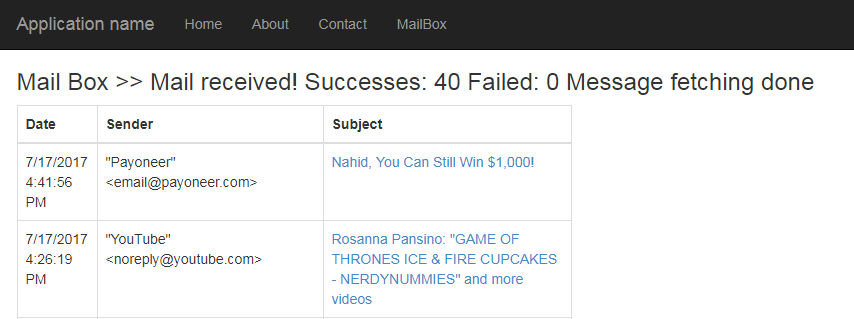

# C# Read emails from Inbox
## Requires
- Visual Studio 2017
## License
- MIT
## Technologies
- C#
- POP3
- ASP.NET MVC 5
## Topics
- Email
## Updated
- 07/17/2017
## Description

<h1>Introduction</h1>

<em>This will read email using pop3 &nbsp;from gmail, yahoo, office 365 and other</em>

&nbsp;

Building the Sample

<em>using nuget You need to install :&nbsp;OpenPop.NET and&nbsp;AE.Net.Mail</em>

Description

<em>According to your&nbsp;POPServer, POPUsername and &nbsp;POPpassword it will read your all email.</em>

<em>At first it will &nbsp;read all inbox email, and every email has a unique ID, when you click details, according to this message id it will load details.&nbsp;</em>

&nbsp;

private DashBoardMailBoxJob ReceiveMails()&nbsp; &nbsp; &nbsp; &nbsp; {&nbsp; &nbsp; &nbsp; &nbsp; &nbsp; &nbsp; DashBoardMailBoxJob model = new DashBoardMailBoxJob();&nbsp; &nbsp; &nbsp; &nbsp; &nbsp; &nbsp; model.Inbox = new List&lt;MailMessege&gt;(); 
&nbsp; &nbsp; &nbsp; &nbsp; &nbsp; &nbsp; try&nbsp; &nbsp; &nbsp; &nbsp; &nbsp; &nbsp; {&nbsp; &nbsp; &nbsp; &nbsp; &nbsp; &nbsp; &nbsp; &nbsp; EmailConfiguration email = new EmailConfiguration ();&nbsp; &nbsp; &nbsp; &nbsp; &nbsp; &nbsp; &nbsp; &nbsp; email.POPServer
 = &quot;imap.gmail.com&quot;;&nbsp; &nbsp; &nbsp; &nbsp; &nbsp; &nbsp; &nbsp; &nbsp; email.POPUsername = &quot;&quot;; // type your username credential&nbsp; &nbsp; &nbsp; &nbsp; &nbsp; &nbsp; &nbsp; &nbsp; email.POPpassword = &quot;&quot;; // type your username credential&nbsp; &nbsp;
 &nbsp; &nbsp; &nbsp; &nbsp; &nbsp; &nbsp; email.IncomingPort = &quot;993&quot;;&nbsp; &nbsp; &nbsp; &nbsp; &nbsp; &nbsp; &nbsp; &nbsp; email.IsPOPssl = true; 
 
&nbsp; &nbsp; &nbsp; &nbsp; &nbsp; &nbsp; &nbsp; &nbsp; int success = 0;&nbsp; &nbsp; &nbsp; &nbsp; &nbsp; &nbsp; &nbsp; &nbsp; int fail = 0;&nbsp; &nbsp; &nbsp; &nbsp; &nbsp; &nbsp; &nbsp; &nbsp; ImapClient ic = new ImapClient(email.POPServer, email.POPUsername,
 email.POPpassword, AuthMethods.Login, Convert.ToInt32(email.IncomingPort), (bool)email.IsPOPssl);&nbsp; &nbsp; &nbsp; &nbsp; &nbsp; &nbsp; &nbsp; &nbsp; // Select a mailbox. Case-insensitive&nbsp; &nbsp; &nbsp; &nbsp; &nbsp; &nbsp; &nbsp; &nbsp; ic.SelectMailbox(&quot;INBOX&quot;);&nbsp;
 &nbsp; &nbsp; &nbsp; &nbsp; &nbsp; &nbsp; &nbsp; int i = 1;&nbsp; &nbsp; &nbsp; &nbsp; &nbsp; &nbsp; &nbsp; &nbsp; int msgcount = ic.GetMessageCount(&quot;INBOX&quot;);&nbsp; &nbsp; &nbsp; &nbsp; &nbsp; &nbsp; &nbsp; &nbsp; int end = msgcount - 1;&nbsp; &nbsp; &nbsp;
 &nbsp; &nbsp; &nbsp; &nbsp; &nbsp; int start = msgcount - 40;&nbsp; &nbsp; &nbsp; &nbsp; &nbsp; &nbsp; &nbsp; &nbsp; // Note that you must specify that headersonly = false&nbsp; &nbsp; &nbsp; &nbsp; &nbsp; &nbsp; &nbsp; &nbsp; // when using GetMesssages().&nbsp;
 &nbsp; &nbsp; &nbsp; &nbsp; &nbsp; &nbsp; &nbsp; MailMessage[] mm = ic.GetMessages(start, end, false);&nbsp; &nbsp; &nbsp; &nbsp; &nbsp; &nbsp; &nbsp; &nbsp; foreach (var item in mm)&nbsp; &nbsp; &nbsp; &nbsp; &nbsp; &nbsp; &nbsp; &nbsp; {&nbsp; &nbsp; &nbsp;
 &nbsp; &nbsp; &nbsp; &nbsp; &nbsp; &nbsp; &nbsp; MailMessege obj = new MailMessege();&nbsp; &nbsp; &nbsp; &nbsp; &nbsp; &nbsp; &nbsp; &nbsp; &nbsp; &nbsp; try&nbsp; &nbsp; &nbsp; &nbsp; &nbsp; &nbsp; &nbsp; &nbsp; &nbsp; &nbsp; { 
&nbsp; &nbsp; &nbsp; &nbsp; &nbsp; &nbsp; &nbsp; &nbsp; &nbsp; &nbsp; &nbsp; &nbsp; obj.UID = item.Uid;&nbsp; &nbsp; &nbsp; &nbsp; &nbsp; &nbsp; &nbsp; &nbsp; &nbsp; &nbsp; &nbsp; &nbsp; obj.subject = item.Subject;&nbsp; &nbsp; &nbsp; &nbsp; &nbsp; &nbsp; &nbsp;
 &nbsp; &nbsp; &nbsp; &nbsp; &nbsp; obj.sender = item.From.ToString();&nbsp; &nbsp; &nbsp; &nbsp; &nbsp; &nbsp; &nbsp; &nbsp; &nbsp; &nbsp; &nbsp; &nbsp; obj.sendDate = item.Date;&nbsp; &nbsp; &nbsp; &nbsp; &nbsp; &nbsp; &nbsp; &nbsp; &nbsp; &nbsp; &nbsp; &nbsp;
 if (item.Attachments == null) { }&nbsp; &nbsp; &nbsp; &nbsp; &nbsp; &nbsp; &nbsp; &nbsp; &nbsp; &nbsp; &nbsp; &nbsp; else obj.Attachments = item.Attachments;&nbsp;&nbsp; &nbsp; &nbsp; &nbsp; &nbsp; &nbsp; &nbsp; &nbsp; &nbsp; &nbsp; &nbsp; &nbsp; model.Inbox.Add(obj);&nbsp;
 &nbsp; &nbsp; &nbsp; &nbsp; &nbsp; &nbsp; &nbsp; &nbsp; &nbsp; &nbsp; &nbsp; success&#43;&#43;;&nbsp; &nbsp; &nbsp; &nbsp; &nbsp; &nbsp; &nbsp; &nbsp; &nbsp; &nbsp; }&nbsp; &nbsp; &nbsp; &nbsp; &nbsp; &nbsp; &nbsp; &nbsp; &nbsp; &nbsp; catch (Exception e)&nbsp; &nbsp;
 &nbsp; &nbsp; &nbsp; &nbsp; &nbsp; &nbsp; &nbsp; &nbsp; {&nbsp; &nbsp; &nbsp; &nbsp; &nbsp; &nbsp; &nbsp; &nbsp; &nbsp; &nbsp; &nbsp; &nbsp; DefaultLogger.Log.LogError(&nbsp; &nbsp; &nbsp; &nbsp; &nbsp; &nbsp; &nbsp; &nbsp; &nbsp; &nbsp; &nbsp; &nbsp; &nbsp;
 &nbsp; &quot;TestForm: Message fetching failed: &quot; &#43; e.Message &#43; &quot;\r\n&quot; &#43;&nbsp; &nbsp; &nbsp; &nbsp; &nbsp; &nbsp; &nbsp; &nbsp; &nbsp; &nbsp; &nbsp; &nbsp; &nbsp; &nbsp; &quot;Stack trace:\r\n&quot; &#43;&nbsp; &nbsp; &nbsp; &nbsp; &nbsp; &nbsp; &nbsp; &nbsp; &nbsp; &nbsp; &nbsp;
 &nbsp; &nbsp; &nbsp; e.StackTrace);&nbsp; &nbsp; &nbsp; &nbsp; &nbsp; &nbsp; &nbsp; &nbsp; &nbsp; &nbsp; &nbsp; &nbsp; fail&#43;&#43;;&nbsp; &nbsp; &nbsp; &nbsp; &nbsp; &nbsp; &nbsp; &nbsp; &nbsp; &nbsp; }&nbsp; &nbsp; &nbsp; &nbsp; &nbsp; &nbsp; &nbsp; &nbsp; &nbsp;
 &nbsp; i&#43;&#43;; 
&nbsp; &nbsp; &nbsp; &nbsp; &nbsp; &nbsp; &nbsp; &nbsp; }&nbsp; &nbsp; &nbsp; &nbsp; &nbsp; &nbsp; &nbsp; &nbsp; ic.Dispose();&nbsp; &nbsp; &nbsp; &nbsp; &nbsp; &nbsp; &nbsp; &nbsp; model.Inbox = model.Inbox.OrderByDescending(m =&gt; m.sendDate).ToList();&nbsp;
 &nbsp; &nbsp; &nbsp; &nbsp; &nbsp; &nbsp; &nbsp; model.mess = &quot;Mail received!\nSuccesses: &quot; &#43; success &#43; &quot;\nFailed: &quot; &#43; fail &#43; &quot;\nMessage fetching done&quot;; 
&nbsp; &nbsp; &nbsp; &nbsp; &nbsp; &nbsp; &nbsp; &nbsp; if (fail &gt; 0)&nbsp; &nbsp; &nbsp; &nbsp; &nbsp; &nbsp; &nbsp; &nbsp; {&nbsp; &nbsp; &nbsp; &nbsp; &nbsp; &nbsp; &nbsp; &nbsp; &nbsp; &nbsp; model.mess = &quot;Since some of the emails were not parsed correctly
 (exceptions were thrown)\r\n&quot; &#43;&nbsp; &nbsp; &nbsp; &nbsp; &nbsp; &nbsp; &nbsp; &nbsp; &nbsp; &nbsp; &nbsp; &nbsp; &nbsp; &nbsp; &nbsp; &nbsp; &nbsp; &nbsp; &quot;please consider sending your log file to the developer for fixing.\r\n&quot; &#43;&nbsp; &nbsp; &nbsp; &nbsp;
 &nbsp; &nbsp; &nbsp; &nbsp; &nbsp; &nbsp; &nbsp; &nbsp; &nbsp; &nbsp; &nbsp; &nbsp; &nbsp; &nbsp; &quot;If you are able to include any extra information, please do so.&quot;;&nbsp; &nbsp; &nbsp; &nbsp; &nbsp; &nbsp; &nbsp; &nbsp; }&nbsp; &nbsp; &nbsp; &nbsp; &nbsp;
 &nbsp; } 
&nbsp; &nbsp; &nbsp; &nbsp; &nbsp; &nbsp; catch (Exception e)&nbsp; &nbsp; &nbsp; &nbsp; &nbsp; &nbsp; {&nbsp; &nbsp; &nbsp; &nbsp; &nbsp; &nbsp; &nbsp; &nbsp; model.mess = &quot;Error occurred retrieving mail. &quot; &#43; e.Message;&nbsp; &nbsp; &nbsp; &nbsp; &nbsp; &nbsp;
 }&nbsp; &nbsp; &nbsp; &nbsp; &nbsp; &nbsp; finally&nbsp; &nbsp; &nbsp; &nbsp; &nbsp; &nbsp; { 
&nbsp; &nbsp; &nbsp; &nbsp; &nbsp; &nbsp; }&nbsp; &nbsp; &nbsp; &nbsp; &nbsp; &nbsp; return model;&nbsp; &nbsp; &nbsp; &nbsp; }

<em>&nbsp; </em>

&nbsp;<em>When user will click details of any email, it will load the details of the selected email.</em>

&nbsp;

<h1>More Information</h1>

&nbsp;

&nbsp;

&nbsp;

