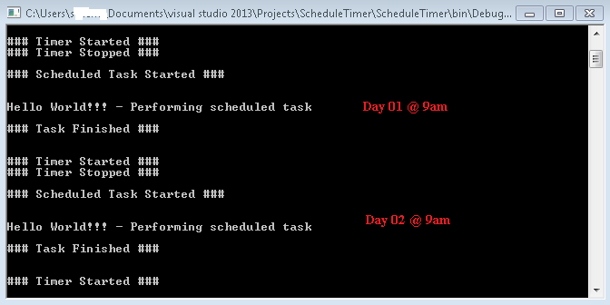

# C# Timer: Schedule a Task
## Requires
- Visual Studio 2013
## License
- MIT
## Technologies
- C#
- .NET Framework
## Topics
- Timer
- Scheduled Task
- Background tasks
## Updated
- 02/25/2017
## Description

<h1>Introduction</h1>

In this article we will see how to use Timer class in .NET Framework under <a class="libraryLink" href="https://msdn.microsoft.com/en-US/library/System.Timers.aspx" target="_blank" title="Auto generated link to System.Timers">System.Timers</a> namespace. The example is made of C# use under Console Application. Often we need to schedule our task like need for an event to be triggered at various absolute time.
 For example every 24 hour, everyday at certain time etc. We can achieve this in various way like using Windows Task Scheduler. But here we will see how we can use Timer class in .NET Framework to achieve this scheduled job. This sample illustrates a way to
 let user to know how they can schedule a task using timer.

<h1>What is timer?</h1>

According to MSDN <a href="https://msdn.microsoft.com/en-us/library/system.timers.timer(v=vs.110).aspx" target="_blank" style="margin:0px; padding:0px; outline:0px; border:currentcolor; color:#0076a3; line-height:16.12px; font-family:'Segoe UI','Lucida Grande',Verdana,Arial,Helvetica,sans-serif; font-size:12px; list-style-type:none; background-color:#ffffff">
documentation</a> <strong>Generates an event after a set interval, with an option to generate recurring events.</strong> So, the Timer allows us to set a time interval to periodically execute an event at a specified interval. It is useful when we want to execute
 certain functions/applications after a certain interval.  
 
The C# timer event keeps track of time just like a clock would, it is basically an accessible clock and counts in milliseconds, thousandths of a second. This allows for great detail.
 
 
Code structure inside the timer:

&nbsp;

C#

Edit|Remove

csharp

<pre class="csharp">private&nbsp;void&nbsp;timer1_Tick(object&nbsp;sender,&nbsp;EventArgs&nbsp;e)&nbsp;
{&nbsp;
&nbsp;&nbsp;&nbsp;&nbsp;//events&nbsp;occur&nbsp;when&nbsp;timer&nbsp;stops&nbsp;
&nbsp;&nbsp;&nbsp;&nbsp;timer.Stop();&nbsp;
&nbsp;&nbsp;&nbsp;&nbsp;Console.WriteLine(&quot;Hello&nbsp;World!!!&quot;);&nbsp;//Code&nbsp;to&nbsp;&nbsp;&nbsp;&nbsp;&nbsp;Perform&nbsp;Task&nbsp;goes&nbsp;in&nbsp;between&nbsp;here&nbsp;
&nbsp;&nbsp;&nbsp;&nbsp;timer.Start();&nbsp;
}&nbsp;
</pre>

<h1>Schedule a Task</h1>

<em>Scheduling a task in code</em> this term means any code that does something, causes something to happen, and has action to it. Example:

<ul>
<li>Making an object appear </li><li>Making an object move </li><li>Fire any event </li><li>Trigger functions </li></ul>

Timer counts automatically. When the timer counts down the amount of time set in the preferences, it executes whatever code is in it, then it automatically restarts and counts down again.

<h1>Output</h1>
<h1></h1>
<h1>Technicalities</h1>

We looked at the Timer class from the <em><a class="libraryLink" href="https://msdn.microsoft.com/en-US/library/System.Timers.aspx" target="_blank" title="Auto generated link to System.Timers">System.Timers</a></em> namespace in .NET Framework. One point we may want to consider when working with timers is whether our problem can be solved more simply by using the Windows Scheduler to run a standard executable
 periodically. Here timer is used to fires off a program at a given time. We could also use timer in following cases:

<ul>
<li>Fire off a program at a given time </li><li>Display the time on the screen </li><li>Create a backup routine that copies important data at a given interval </li><li>Can create a routine to automatically log off a user or end a program after a given time period with no activity
</li><li>Create a WCF service add timer to schedule a job </li></ul>

Beside these numerous ways timer can be used.

<h1>Note</h1>
<ul>
<li>Article detailed the creation of this project: <a href="https://social.technet.microsoft.com/wiki/contents/articles/37252.c-timer-schedule-a-task.aspx" target="_blank" style="margin:0px; padding:0px; outline:0px; border:currentcolor; color:#0076a3; line-height:16.12px; font-family:'Segoe UI','Lucida Grande',Verdana,Arial,Helvetica,sans-serif; font-size:12px; list-style-type:none; background-color:#ffffff">
C# Timer: Schedule a Task </a></li><li>Timer class under <em><a class="libraryLink" href="https://msdn.microsoft.com/en-US/library/System.Timers.aspx" target="_blank" title="Auto generated link to System.Timers">System.Timers</a></em> namespace <a href="https://msdn.microsoft.com/en-us/library/system.timers.timer(v=vs.110).aspx" target="_blank" style="margin:0px; padding:0px; outline:0px; border:currentcolor; color:#0076a3; line-height:16.12px; font-family:'Segoe UI','Lucida Grande',Verdana,Arial,Helvetica,sans-serif; font-size:12px; list-style-type:none; background-color:#ffffff">
here</a> </li><li>All about .NET Timers - A Comparison <a href="https://www.codeproject.com/Articles/167365/All-about-NET-Timers-A-Comparison" target="_blank" style="margin:0px; padding:0px; outline:0px; border:currentcolor; color:#0076a3; line-height:16.12px; font-family:'Segoe UI','Lucida Grande',Verdana,Arial,Helvetica,sans-serif; font-size:12px; list-style-type:none; background-color:#ffffff">
here</a> </li><li>Introduction to Server-Based Timers <a href="https://msdn.microsoft.com/en-us/library/tb9yt5e6(v=vs.110).aspx" target="_blank" style="margin:0px; padding:0px; outline:0px; border:currentcolor; color:#0076a3; line-height:16.12px; font-family:'Segoe UI','Lucida Grande',Verdana,Arial,Helvetica,sans-serif; font-size:12px; list-style-type:none; background-color:#ffffff">
here</a> </li><li>Task Scheduler <a href="https://msdn.microsoft.com/en-us/library/windows/desktop/aa383614(v=vs.85).aspx" target="_blank" style="margin:0px; padding:0px; outline:0px; border:currentcolor; color:#0076a3; line-height:16.12px; font-family:'Segoe UI','Lucida Grande',Verdana,Arial,Helvetica,sans-serif; font-size:12px; list-style-type:none; background-color:#ffffff">
here</a> </li></ul>
