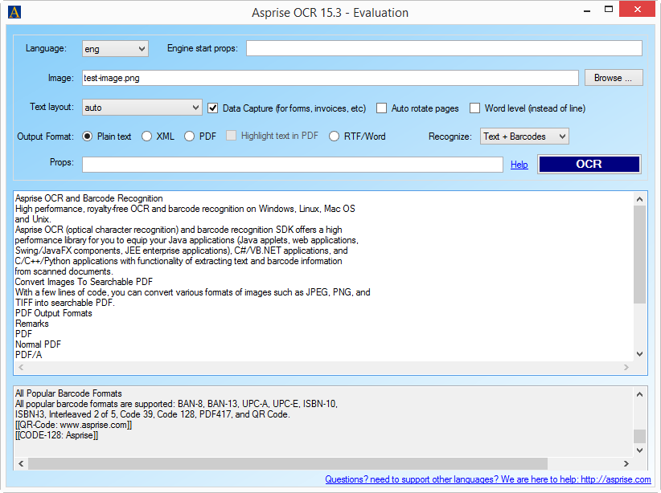

# C# VB.NET OCR Image to Text, Word, searchable PDF & QR Barcode Read Recognition
## Requires
- Visual Studio 2013
## License
- MIT
## Technologies
- C#
- WCF
- GDI+
- Silverlight
- ASP.NET
- Win32
- .NET
- Class Library
- Windows Forms
- WPF
- Microsoft Azure
- ASP.NET MVC
- C++
- .NET Framework 4
- .NET Framework
- Windows
- Visual Basic .NET
- Office 365
- VB.Net
- .NET Framework 4.0
- SharePoint Server 2010
- Library
- Windows General
- Service Bus
- C# Language
- Windows Runtime
- ASP.NET MVC 4
- .NET Framework 4.5
- Windows 8
- .NET Framwork
- Cloud
- Visual C#
- ASP.NET Web API
- Visual C Sharp .NET
- Image process
- SharePoint Server 2013
- Windows Store app
- .NET Development
- Image Processing
- Bing OCR
- OCR
- Windows Imaging Component (WIC)
- Windows 10
- Barcode
- Barcode Recognition
- Barcode Reading
- Optical Character Recognition
- Royalty Free
## Topics
- Controls
- Graphics
- C#
- WCF
- ASP.NET
- Class Library
- User Interface
- Windows Forms
- Graphics and 3D
- WPF
- Microsoft Azure
- Data Access
- Images
- Media
- 2d graphics
- Image manipulation
- Code Sample
- Image Gallery
- Image
- .NET 4
- Imaging
- Drawing
- How to
- Numerical Computing
- Text
- Windows Forms Controls
- Graphics Functions
- BitmapImage
- Bing OCR Control
- OCR
- Read Barcode
- Barcode
- Barcode Recognition
- Optical Character Recognition
- Barcode scanner
## Updated
- 08/23/2016
## Description

<h1>Introduction</h1>

This code sample shows how to do <a href="http://asprise.com/royalty-free-library/c%23-sharp.net-ocr-api-overview.html" target="_blank">
C# VB.NET OCR and barcode recognition to&nbsp;convert images (in various formats like JPEG, PNG, TIFF, PDF, etc.) into editable document formats</a> (<a href="https://asprise.com/royalty-free-library/c%23-sharp.net-ocr-source-code-examples-demos.html#xml" target="_blank">Word,
 XML, searchable PDF, etc.</a>) and read barcodes in formats of&nbsp;EAN-8, EAN-13, UPC-A, UPC-E, ISBN-10, ISBN-13, Interleaved 2 of 5, Code 39, Code 128, PDF417, and QR Code.

<h1>Build the Sample</h1>

Download and unzip the sample project. Open it with Visual Studio 2013 or higher, Tools -&gt; NuGet Package Manager -&gt; Restore, then Press F5 to run it.

Alternatively, install from NuGet directly:

<pre><strong>&nbsp;Install-Package asprise-ocr-api</strong></pre>

You can invoke the OCR demo Form by copying the following code to Program.cs (for C#):

C#

Edit|Remove

csharp
<pre class="hidden">...
static class Program { // Program.cs
    [STAThread]
    static void Main() {
        Application.EnableVisualStyles();
        Application.SetCompatibleTextRenderingDefault(false);
        Application.Run(new asprise_ocr_api.OcrSampleForm());
    }
}</pre>

<pre class="csharp">...&nbsp;
static&nbsp;class&nbsp;Program&nbsp;{&nbsp;//&nbsp;Program.cs&nbsp;
&nbsp;&nbsp;&nbsp;&nbsp;[STAThread]&nbsp;
&nbsp;&nbsp;&nbsp;&nbsp;static&nbsp;void&nbsp;Main()&nbsp;{&nbsp;
&nbsp;&nbsp;&nbsp;&nbsp;&nbsp;&nbsp;&nbsp;&nbsp;Application.EnableVisualStyles();&nbsp;
&nbsp;&nbsp;&nbsp;&nbsp;&nbsp;&nbsp;&nbsp;&nbsp;Application.SetCompatibleTextRenderingDefault(false);&nbsp;
&nbsp;&nbsp;&nbsp;&nbsp;&nbsp;&nbsp;&nbsp;&nbsp;Application.Run(new&nbsp;asprise_ocr_api.OcrSampleForm());&nbsp;
&nbsp;&nbsp;&nbsp;&nbsp;}&nbsp;
}</pre>

&nbsp;

<object width="180" height="100" data="data:application/x-silverlight-2," type="application/x-silverlight-2"> <param name="source" value="/Content/Common/videoplayer.xap" /> <param name="initParams" value="deferredLoad=false,duration=0,m=https://code.msdn.microsoft.com/site/view/file/158459/1/AspriseOcrDemo_WindowsMedia%20-%20HD%20720i_ConstrainedVBR.wmv,autostart=false,autohide=true,showembed=true"
 /> <param name="background" value="#00FFFFFF" /> <param name="minRuntimeVersion" value="3.0.40624.0" /> <param name="enableHtmlAccess" value="true" /> <param name="src" value="/site/view/file/158459/1/AspriseOcrDemo_WindowsMedia%20-%20HD%20720i_ConstrainedVBR.wmv"
 /> <param name="id" value="158459" /> <param name="name" value="AspriseOcrDemo_WindowsMedia - HD 720i_ConstrainedVBR.wmv" />
 </object> &nbsp;&nbsp;<a id="x_/site/view/file/158459/1/AspriseOcrDemo_WindowsMedia%20-%20HD%20720i_ConstrainedVBR.wmv" href="https://code.msdn.microsoft.com/site/view/file/158459/1/AspriseOcrDemo_WindowsMedia%20-%20HD%20720i_ConstrainedVBR.wmv">Download
 video</a>&nbsp;| <a href="https://www.youtube.com/watch?v=v17hhJHXNiA" target="_blank">
View video on Youtube</a>

<h1>C# VB.NET OCR in Action</h1>
<h2>Jump Start</h2>

The following code demonstrates the basic usage of Asprise <a href="http://asprise.com/royalty-free-library/c%23-sharp.net-ocr-api-overview.html" target="_blank">
C# VB.NET OCR and Barcode Recognition</a>:

C#Visual Basic

Edit|Remove

csharpvb
<pre class="hidden">using asprise_ocr_api;

AspriseOCR.SetUp();
AspriseOCR ocr = new AspriseOCR();
ocr.StartEngine(&quot;eng&quot;, AspriseOCR.SPEED_FASTEST);

string s = ocr.Recognize(&quot;C:\path\img.jpg&quot;, -1, -1, -1, -1, -1, AspriseOCR.RECOGNIZE_TYPE_ALL, AspriseOCR.OUTPUT_FORMAT_PLAINTEXT);
Console.WriteLine(&quot;OCR Result: &quot; &#43; s);
// process more images here ...

ocr.StopEngine();</pre>
<pre class="hidden">Imports asprise_ocr_api
Private ocr As AspriseOCR
AspriseOCR.SetUp()
ocr = New AspriseOCR()
ocr.StartEngine(&quot;eng&quot;, AspriseOCR.SPEED_FASTEST)

Dim s As String = ocr.Recognize(&quot;C:\img.jpg&quot;, -1, -1, -1, -1, -1, AspriseOCR.RECOGNIZE_TYPE_ALL, AspriseOCR.OUTPUT_FORMAT_PLAINTEXT)
Console.WriteLine(&quot;OCR Result: &quot; &amp; s)
' process more images here ...

ocr.StopEngine()</pre>

<pre class="csharp">using&nbsp;asprise_ocr_api;&nbsp;
&nbsp;
AspriseOCR.SetUp();&nbsp;
AspriseOCR&nbsp;ocr&nbsp;=&nbsp;new&nbsp;AspriseOCR();&nbsp;
ocr.StartEngine(&quot;eng&quot;,&nbsp;AspriseOCR.SPEED_FASTEST);&nbsp;
&nbsp;
string&nbsp;s&nbsp;=&nbsp;ocr.Recognize(&quot;C:\path\img.jpg&quot;,&nbsp;-1,&nbsp;-1,&nbsp;-1,&nbsp;-1,&nbsp;-1,&nbsp;AspriseOCR.RECOGNIZE_TYPE_ALL,&nbsp;AspriseOCR.OUTPUT_FORMAT_PLAINTEXT);&nbsp;
Console.WriteLine(&quot;OCR&nbsp;Result:&nbsp;&quot;&nbsp;&#43;&nbsp;s);&nbsp;
//&nbsp;process&nbsp;more&nbsp;images&nbsp;here&nbsp;...&nbsp;
&nbsp;
ocr.StopEngine();</pre>

Line 3: performs one-time setup if it has not been done;

Lines 4 &amp; 5: Creates a new Ocr engine that recognizes English in fastest speed setting; The evaluation version is able to recognize English (eng), Spanish (spa), Portuguese (por), German (deu) and French (fra). For other languages, please contact us.
 The list of languages supported can be found&nbsp;<a class="reference internal" href="http://asprise.com/ocr/docs/html/intro-ocr-sdk-library.html#intro-langs">Languages Supported</a>.

Line 7: All the OCR work is done here. The Recognize method of the AspriseOCR class recognizes all the characters and barcodes from the image and output them as plain text. Other supported output formats are: XML (<code class="docutils literal">AspriseOCR.OUTPUT_FORMAT_XML</code>),
 searchable PDF (<code class="docutils literal">Ocr.OUTPUT_FORMAT_PDF</code>) and user editable RTF (<code class="docutils literal">Ocr.OUTPUT_FORMAT_RTF</code>).

<h2>OCR to Searchable PDF Format</h2>

If you set the output format as OUTPUT_FORMAT_PDF, you need to specify the target PDF output file as following:

C#

Edit|Remove

csharp
<pre class="hidden">ocr.Recognize(&quot;C:\test-image.png&quot;, -1, -1, -1, -1, -1,
  Ocr.RECOGNIZE_TYPE_ALL, Ocr.OUTPUT_FORMAT_PDF,
  &quot;PROP_PDF_OUTPUT_FILE=ocr-result.pdf|PROP_PDF_OUTPUT_TEXT_VISIBLE=true&quot;);
</pre>

<pre class="csharp">ocr.Recognize(&quot;C:\test-image.png&quot;,&nbsp;-1,&nbsp;-1,&nbsp;-1,&nbsp;-1,&nbsp;-1,&nbsp;
&nbsp;&nbsp;Ocr.RECOGNIZE_TYPE_ALL,&nbsp;Ocr.OUTPUT_FORMAT_PDF,&nbsp;
&nbsp;&nbsp;&quot;PROP_PDF_OUTPUT_FILE=ocr-result.pdf|PROP_PDF_OUTPUT_TEXT_VISIBLE=true&quot;);&nbsp;</pre>

In above code, properties are specified in a single string separated by&nbsp;<code class="docutils literal">|</code>&nbsp;(with key and value separated by&nbsp;<code class="docutils literal">=</code>).
 Alternatively, you may specify properties separately in pairs:

C#

Edit|Remove

csharp
<pre class="hidden">ocr.Recognize(&quot;C:\test-image.png&quot;, -1, -1, -1, -1, -1,
  Ocr.RECOGNIZE_TYPE_ALL, Ocr.OUTPUT_FORMAT_PDF,
  AspriseOCR.PROP_PDF_OUTPUT_FILE, &quot;ocr-result.pdf&quot;,
  AspriseOCR.PROP_PDF_OUTPUT_TEXT_VISIBLE, true);
</pre>

<pre class="csharp">ocr.Recognize(&quot;C:\test-image.png&quot;,&nbsp;-1,&nbsp;-1,&nbsp;-1,&nbsp;-1,&nbsp;-1,&nbsp;
&nbsp;&nbsp;Ocr.RECOGNIZE_TYPE_ALL,&nbsp;Ocr.OUTPUT_FORMAT_PDF,&nbsp;
&nbsp;&nbsp;AspriseOCR.PROP_PDF_OUTPUT_FILE,&nbsp;&quot;ocr-result.pdf&quot;,&nbsp;
&nbsp;&nbsp;AspriseOCR.PROP_PDF_OUTPUT_TEXT_VISIBLE,&nbsp;true);&nbsp;</pre>

<h2>Recognizes Text Only Or Barcode Only</h2>

To save OCR time, you can choose to OCR text or barcode only. Text only:

C#

Edit|Remove

csharp
<pre class="hidden">string s = ocr.Recognize(&quot;C:\path\img.jpg&quot;, -1, -1, -1, -1, -1,
   AspriseOCR.RECOGNIZE_TYPE_TEXT, AspriseOCR.OUTPUT_FORMAT_PLAINTEXT);</pre>

<pre class="csharp">string&nbsp;s&nbsp;=&nbsp;ocr.Recognize(&quot;C:\path\img.jpg&quot;,&nbsp;-1,&nbsp;-1,&nbsp;-1,&nbsp;-1,&nbsp;-1,&nbsp;
&nbsp;&nbsp;&nbsp;AspriseOCR.RECOGNIZE_TYPE_TEXT,&nbsp;AspriseOCR.OUTPUT_FORMAT_PLAINTEXT);</pre>

<a href="http://asprise.com/royalty-free-library/c%23-sharp.net-ocr-api-overview.html" target="_blank">Read barcode and QR codes in C# and VB.NET</a>:

C#

Edit|Remove

csharp
<pre class="hidden">string s = ocr.Recognize(&quot;C:\path\img.jpg&quot;, -1, -1, -1, -1, -1,
   AspriseOCR.RECOGNIZE_TYPE_BARCODE, AspriseOCR.OUTPUT_FORMAT_PLAINTEXT);</pre>

<pre class="js">string&nbsp;s&nbsp;=&nbsp;ocr.Recognize(&quot;C:\path\img.jpg&quot;,&nbsp;-1,&nbsp;-1,&nbsp;-1,&nbsp;-1,&nbsp;-1,&nbsp;
&nbsp;&nbsp;&nbsp;AspriseOCR.RECOGNIZE_TYPE_BARCODE,&nbsp;AspriseOCR.OUTPUT_FORMAT_PLAINTEXT);</pre>

<h2>Perform OCR On Part Of The Image</h2>

In some cases, you might not want to OCR the whole image. In that case, you can OCR on part of the image to save time:

C#

Edit|Remove

csharp
<pre class="hidden">string s = ocr.Recognize(&quot;C:\path\img.jpg&quot;, -1, 0, 0, 400, 200,
   AspriseOCR.RECOGNIZE_TYPE_ALL, AspriseOCR.OUTPUT_FORMAT_PLAINTEXT);</pre>

<pre class="csharp">string&nbsp;s&nbsp;=&nbsp;ocr.Recognize(&quot;C:\path\img.jpg&quot;,&nbsp;-1,&nbsp;0,&nbsp;0,&nbsp;400,&nbsp;200,&nbsp;
&nbsp;&nbsp;&nbsp;AspriseOCR.RECOGNIZE_TYPE_ALL,&nbsp;AspriseOCR.OUTPUT_FORMAT_PLAINTEXT);</pre>

<h2 class="endscriptcode">Perform OCR On A Certain Page From The Specified TIFF File</h2>

A PDF or TIFF file may contain multiple pages. If you need to recognize only a certain page, you can specify the page number as following:

C#

Edit|Remove

csharp
<pre class="hidden">string s = ocr.Recognize(&quot;C:\img1.tif&quot;, 1, -1, -1, -1, -1,
   AspriseOCR.RECOGNIZE_TYPE_ALL, AspriseOCR.OUTPUT_FORMAT_PLAINTEXT);</pre>

<pre class="csharp">string&nbsp;s&nbsp;=&nbsp;ocr.Recognize(&quot;C:\img1.tif&quot;,&nbsp;1,&nbsp;-1,&nbsp;-1,&nbsp;-1,&nbsp;-1,&nbsp;
&nbsp;&nbsp;&nbsp;AspriseOCR.RECOGNIZE_TYPE_ALL,&nbsp;AspriseOCR.OUTPUT_FORMAT_PLAINTEXT);</pre>

&nbsp;Note 1 means the second page (the page number of the first page is 0). -1 means all pages.

<h1>More Information</h1>

<a href="http://asprise.com/royalty-free-library/c%23-sharp.net-ocr-api-overview.html" target="_blank" style="text-decoration:none; color:#0066aa">Learn
 more about Asprise OCR and Barcode Recognition C# VB.NET API SDK</a>

<a href="http://asprise.com/royalty-free-library/c%23-sharp.net-ocr-barcode-reader-sdk-samples-docs.html" target="_blank" style="text-decoration:none; color:#0066aa">Access
 to Asprise C# VB.NET OCR and Barcode Reading Developer's Guide</a>

<a href="http://asprise.com/ocr/docs/Help/html/429a5bd5-3f62-f489-ede7-025e47709dab.htm" target="_blank" style="text-decoration:none; color:#0066aa">Browse
 API (MSDN style) online</a>

