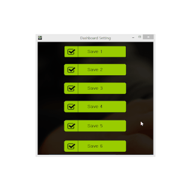
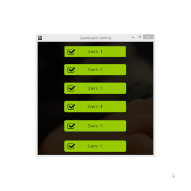
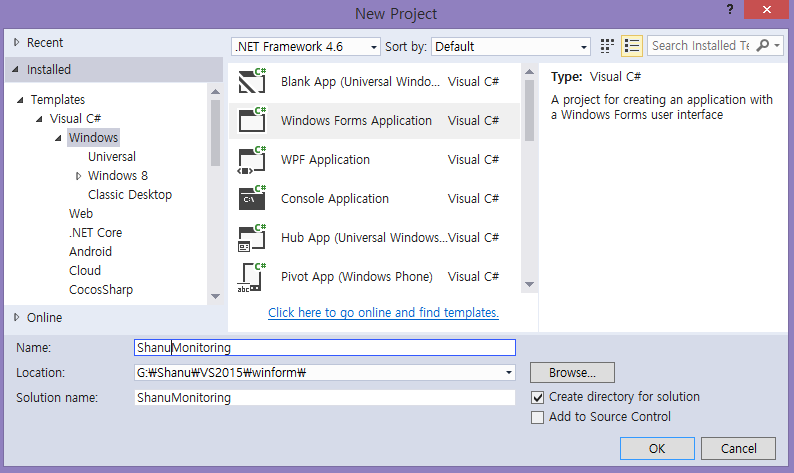
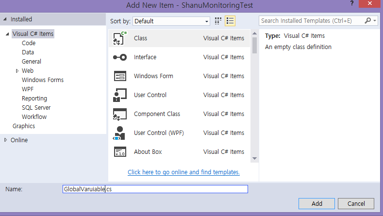
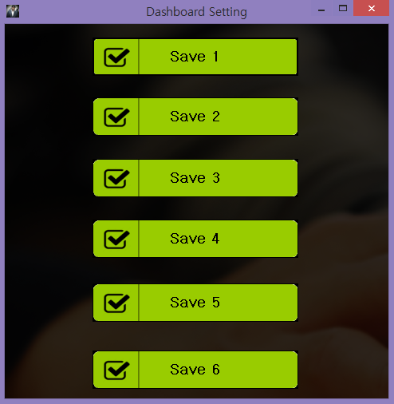

# C# WinForms Dashboard Monitoring with Animation
## Requires
- Visual Studio 2015
## License
- MIT
## Technologies
- C#
- WinForms
## Topics
- C#
- WinForms
## Updated
- 12/04/2016
## Description

<h1>Introduction</h1>

&nbsp;

In this article, we will see in detail how to develop a simple WinForms C# application to create a Dashboard Monitoring application for load monitoring the forms one-by-one, within a certain time frame, by user setting. 
 
We can see monitoring systems everywhere where users can easily get quick information of current happenings, such as - in factories- the production results; in shopping malls- each floor shop and food court details; in hospitals- doctor&rsquo;s availability
 and patients waiting list, on airports- departure and arrival flight details, at stations- train schedule information, etc. 
 
Here, in this article, let&rsquo;s see how to create a simple monitoring dashboard system to be displayed on any department with user settings. 
<strong>&nbsp;</strong>

<h2><strong>Dashboard User Setting</strong></h2>

In some cases, we need to display only certain forms in each floor. For example, &nbsp;let&rsquo;s consider factories with 4 floors and on each floor, there is a different kind of production. We will create different forms to display the production
 results of each floor. Now, admin needs to set each floor monitoring form display. For example - In the first floor Manager room, the &nbsp;admin needs to display all floor monitoring results; that is, all monitoring forms need to be displayed within few seconds.
 On the second floor, the admin needs to set monitoring forms to display only the production result of second floor. For example - the monitoring form2, form4, form6 are related to 2nd floor and need to be display one by one. 
 
To achieve this, first we create a Setting form. In this form, we can load the form display order and form display time from database or by storing in global class file. In this article, for demo purposes, I have used the setting to be stored in class
 file globally for each to display.

<h2><strong>Floor 1 - Manager Room display</strong></h2>

Here, from the below image, we can see that when we click Save 1 Button, the Dashboard Monitoring form will display the results of all floor results. Each monitoring form displays simple animation of each floor production result with Message display
 with animation. 
 

<h2><strong>Floor 2 - Production Room display</strong></h2>

Here, from the below image, we can see that when we click Save 2 button, we load the Dashboard Monitoring Form 2,Form 4, and Form 6 showing the second floor production result. Each monitoring form displays simple animation with each floor production
 result, with Message display with animation.

<h1>Building the Sample</h1>
<h1><strong>Prerequisites</strong></h1>
<ul>
<li>Visual Studio 2015: You can download it from&nbsp;<a href="https://www.visualstudio.com/en-us/downloads/visual-studio-2015-downloads-vs.aspx" target="_blank">here</a>&nbsp;.
</li></ul>

Description

<h1><strong>Step 1 - Create C# Windows Forms Application</strong></h1>

After installing Visual Studio 2015, from your desktop, go to Start &gt;&gt; Programs &gt;&gt; Visual Studio 2015 and click on &quot;Visual Studio 2015&quot;.

Click New &gt;&gt; Project &gt;&gt; Visual C# &gt;&gt; Windows &gt;&gt; Windows Forms Application.

&nbsp;

Enter your Project Name and click OK.

<h1><strong>Step 2 - Create a GlobalVariable Class file</strong></h1>

Next, we need to create a class for declaring all global variables, for storing all form monitoring display settings, and to set the time for each form display.

In this class, let's declare 3 variables, 2 of which will be arrays, to store the form displayindex, the time (in seconds) for each form display, and the total number of forms we are going to display in our Dashboard monitoring application.

&nbsp;

C#

Edit|Remove

csharp

<pre class="js">public&nbsp;class&nbsp;GlobalVariable&nbsp;&nbsp;&nbsp;
&nbsp;&nbsp;&nbsp;&nbsp;{&nbsp;&nbsp;&nbsp;
&nbsp;&nbsp;&nbsp;&nbsp;&nbsp;&nbsp;&nbsp;&nbsp;///&nbsp;&lt;summary&gt;Index&nbsp;to&nbsp;Display&nbsp;all&nbsp;forms&nbsp;one&nbsp;by&nbsp;one&lt;/summary&gt;&nbsp;&nbsp;&nbsp;&nbsp;
&nbsp;&nbsp;&nbsp;&nbsp;&nbsp;&nbsp;&nbsp;&nbsp;public&nbsp;static&nbsp;int[]&nbsp;frmDisplayIndex&nbsp;=&nbsp;new&nbsp;int[6]&nbsp;{&nbsp;1,&nbsp;2,&nbsp;3,&nbsp;4,&nbsp;5,&nbsp;6&nbsp;};&nbsp;&nbsp;&nbsp;
&nbsp;&nbsp;&nbsp;
&nbsp;&nbsp;&nbsp;&nbsp;&nbsp;&nbsp;&nbsp;&nbsp;///&nbsp;&lt;summary&gt;Timer&nbsp;Interval&nbsp;to&nbsp;display&nbsp;each&nbsp;Forms&lt;/summary&gt;&nbsp;&nbsp;&nbsp;
&nbsp;&nbsp;&nbsp;&nbsp;&nbsp;&nbsp;&nbsp;&nbsp;public&nbsp;static&nbsp;int[]&nbsp;interval&nbsp;=&nbsp;new&nbsp;int[6]&nbsp;{&nbsp;4000,&nbsp;5000,&nbsp;6000,&nbsp;5000,&nbsp;6000,&nbsp;7000&nbsp;};&nbsp;&nbsp;&nbsp;
&nbsp;&nbsp;&nbsp;
&nbsp;&nbsp;&nbsp;&nbsp;&nbsp;&nbsp;&nbsp;&nbsp;///&nbsp;&lt;summary&gt;Maximum&nbsp;number&nbsp;of&nbsp;Forms&nbsp;to&nbsp;be&nbsp;displayed&lt;/summary&gt;&nbsp;&nbsp;&nbsp;
&nbsp;&nbsp;&nbsp;&nbsp;&nbsp;&nbsp;&nbsp;&nbsp;public&nbsp;static&nbsp;int&nbsp;formDisplayCount&nbsp;=&nbsp;6;&nbsp;&nbsp;&nbsp;
&nbsp;&nbsp;&nbsp;&nbsp;}&nbsp;&nbsp;</pre>

<h1 class="endscriptcode">&nbsp;S<strong>tep 3 - Form Setting</strong></h1>

<strong> 
</strong>

We create a common function in form Setting as loadDashboard(). In each button click, we pass the number as floor number. 
 
For example, on Save 1 and Save 2 buttons, we pass the numbers as 1, 2 to the loadDashboard() function.

&nbsp;

&nbsp;

C#

Edit|Remove

csharp

<pre class="js">private&nbsp;void&nbsp;button1_Click(object&nbsp;sender,&nbsp;EventArgs&nbsp;e)&nbsp;&nbsp;&nbsp;
&nbsp;&nbsp;&nbsp;&nbsp;&nbsp;&nbsp;&nbsp;&nbsp;{&nbsp;&nbsp;&nbsp;
&nbsp;&nbsp;&nbsp;&nbsp;&nbsp;&nbsp;&nbsp;&nbsp;&nbsp;&nbsp;&nbsp;&nbsp;loadDashboard(1);&nbsp;&nbsp;&nbsp;
&nbsp;&nbsp;&nbsp;&nbsp;&nbsp;&nbsp;&nbsp;&nbsp;}&nbsp;&nbsp;&nbsp;
&nbsp;&nbsp;&nbsp;
&nbsp;&nbsp;&nbsp;&nbsp;&nbsp;&nbsp;&nbsp;&nbsp;private&nbsp;void&nbsp;button2_Click(object&nbsp;sender,&nbsp;EventArgs&nbsp;e)&nbsp;&nbsp;&nbsp;
&nbsp;&nbsp;&nbsp;&nbsp;&nbsp;&nbsp;&nbsp;&nbsp;{&nbsp;&nbsp;&nbsp;
&nbsp;&nbsp;&nbsp;&nbsp;&nbsp;&nbsp;&nbsp;&nbsp;&nbsp;&nbsp;&nbsp;&nbsp;loadDashboard(2);&nbsp;&nbsp;&nbsp;
&nbsp;&nbsp;&nbsp;&nbsp;&nbsp;&nbsp;&nbsp;&nbsp;}&nbsp;&nbsp;</pre>

&nbsp;Here, in loadDashboard() function, the admin can set each floor the form displays or not. Here in our dashboard, we have set to display 6 forms. In frmDisplayIndex array if in each floor the form needs to be displayed
 we use the formdisplayIndex .If the forms do not need to be displayed, then we hide the form to displayed. On button 1 click, we display all forms with each form display time. On button 2 click, we display only form 2, 4, and 6. We can see that index 1,3 and
 5 are set to 0.

C#

Edit|Remove

csharp

<pre class="js">private&nbsp;void&nbsp;loadDashboard(int&nbsp;formDispCount)&nbsp;&nbsp;&nbsp;
&nbsp;&nbsp;&nbsp;&nbsp;&nbsp;&nbsp;&nbsp;&nbsp;{&nbsp;&nbsp;&nbsp;
&nbsp;&nbsp;&nbsp;&nbsp;&nbsp;&nbsp;&nbsp;&nbsp;&nbsp;&nbsp;&nbsp;&nbsp;switch&nbsp;(formDispCount)&nbsp;&nbsp;&nbsp;
&nbsp;&nbsp;&nbsp;&nbsp;&nbsp;&nbsp;&nbsp;&nbsp;&nbsp;&nbsp;&nbsp;&nbsp;{&nbsp;&nbsp;&nbsp;
&nbsp;&nbsp;&nbsp;&nbsp;&nbsp;&nbsp;&nbsp;&nbsp;&nbsp;&nbsp;&nbsp;&nbsp;&nbsp;&nbsp;&nbsp;&nbsp;case&nbsp;1:&nbsp;&nbsp;&nbsp;
&nbsp;&nbsp;&nbsp;&nbsp;&nbsp;&nbsp;&nbsp;&nbsp;&nbsp;&nbsp;&nbsp;&nbsp;&nbsp;&nbsp;&nbsp;&nbsp;&nbsp;&nbsp;&nbsp;&nbsp;GlobalVariable.frmDisplayIndex&nbsp;=&nbsp;new&nbsp;int[6]&nbsp;{&nbsp;1,&nbsp;2,&nbsp;3,&nbsp;4,&nbsp;5,&nbsp;6&nbsp;};&nbsp;&nbsp;&nbsp;
&nbsp;&nbsp;&nbsp;&nbsp;&nbsp;&nbsp;&nbsp;&nbsp;&nbsp;&nbsp;&nbsp;&nbsp;&nbsp;&nbsp;&nbsp;&nbsp;&nbsp;&nbsp;&nbsp;&nbsp;GlobalVariable.interval&nbsp;=&nbsp;new&nbsp;int[6]&nbsp;{&nbsp;4000,&nbsp;2000,&nbsp;4000,&nbsp;3000,&nbsp;4000,&nbsp;3000&nbsp;};&nbsp;&nbsp;&nbsp;
&nbsp;&nbsp;&nbsp;&nbsp;&nbsp;&nbsp;&nbsp;&nbsp;&nbsp;&nbsp;&nbsp;&nbsp;&nbsp;&nbsp;&nbsp;&nbsp;&nbsp;&nbsp;&nbsp;&nbsp;break;&nbsp;&nbsp;&nbsp;
&nbsp;&nbsp;&nbsp;&nbsp;&nbsp;&nbsp;&nbsp;&nbsp;&nbsp;&nbsp;&nbsp;&nbsp;&nbsp;&nbsp;&nbsp;&nbsp;case&nbsp;2:&nbsp;&nbsp;&nbsp;
&nbsp;&nbsp;&nbsp;&nbsp;&nbsp;&nbsp;&nbsp;&nbsp;&nbsp;&nbsp;&nbsp;&nbsp;&nbsp;&nbsp;&nbsp;&nbsp;&nbsp;&nbsp;&nbsp;&nbsp;GlobalVariable.frmDisplayIndex&nbsp;=&nbsp;new&nbsp;int[6]&nbsp;{&nbsp;0,&nbsp;2,&nbsp;0,&nbsp;4,0,&nbsp;6&nbsp;};&nbsp;&nbsp;&nbsp;
&nbsp;&nbsp;&nbsp;&nbsp;&nbsp;&nbsp;&nbsp;&nbsp;&nbsp;&nbsp;&nbsp;&nbsp;&nbsp;&nbsp;&nbsp;&nbsp;&nbsp;&nbsp;&nbsp;&nbsp;GlobalVariable.interval&nbsp;=&nbsp;new&nbsp;int[6]&nbsp;{&nbsp;500,&nbsp;1500,&nbsp;200,&nbsp;1200,&nbsp;1000,&nbsp;1000&nbsp;};&nbsp;&nbsp;&nbsp;
&nbsp;&nbsp;&nbsp;&nbsp;&nbsp;&nbsp;&nbsp;&nbsp;&nbsp;&nbsp;&nbsp;&nbsp;&nbsp;&nbsp;&nbsp;&nbsp;&nbsp;&nbsp;&nbsp;&nbsp;break;&nbsp;&nbsp;&nbsp;
&nbsp;&nbsp;&nbsp;&nbsp;&nbsp;&nbsp;&nbsp;&nbsp;&nbsp;&nbsp;&nbsp;&nbsp;&nbsp;&nbsp;&nbsp;&nbsp;case&nbsp;3:&nbsp;&nbsp;&nbsp;
&nbsp;&nbsp;&nbsp;&nbsp;&nbsp;&nbsp;&nbsp;&nbsp;&nbsp;&nbsp;&nbsp;&nbsp;&nbsp;&nbsp;&nbsp;&nbsp;&nbsp;&nbsp;&nbsp;&nbsp;GlobalVariable.frmDisplayIndex&nbsp;=&nbsp;new&nbsp;int[6]&nbsp;{&nbsp;1,&nbsp;0,&nbsp;3,&nbsp;4,&nbsp;0,&nbsp;6&nbsp;};&nbsp;&nbsp;&nbsp;
&nbsp;&nbsp;&nbsp;&nbsp;&nbsp;&nbsp;&nbsp;&nbsp;&nbsp;&nbsp;&nbsp;&nbsp;&nbsp;&nbsp;&nbsp;&nbsp;&nbsp;&nbsp;&nbsp;&nbsp;GlobalVariable.interval&nbsp;=&nbsp;new&nbsp;int[6]&nbsp;{&nbsp;1000,&nbsp;2000,&nbsp;3000,&nbsp;2000,&nbsp;1000,&nbsp;2000&nbsp;};&nbsp;&nbsp;&nbsp;
&nbsp;&nbsp;&nbsp;&nbsp;&nbsp;&nbsp;&nbsp;&nbsp;&nbsp;&nbsp;&nbsp;&nbsp;&nbsp;&nbsp;&nbsp;&nbsp;&nbsp;&nbsp;&nbsp;&nbsp;break;&nbsp;&nbsp;&nbsp;
&nbsp;&nbsp;&nbsp;&nbsp;&nbsp;&nbsp;&nbsp;&nbsp;&nbsp;&nbsp;&nbsp;&nbsp;&nbsp;&nbsp;&nbsp;&nbsp;case&nbsp;4:&nbsp;&nbsp;&nbsp;
&nbsp;&nbsp;&nbsp;&nbsp;&nbsp;&nbsp;&nbsp;&nbsp;&nbsp;&nbsp;&nbsp;&nbsp;&nbsp;&nbsp;&nbsp;&nbsp;&nbsp;&nbsp;&nbsp;&nbsp;GlobalVariable.frmDisplayIndex&nbsp;=&nbsp;new&nbsp;int[6]&nbsp;{&nbsp;1,&nbsp;2,&nbsp;0,&nbsp;4,&nbsp;5,&nbsp;6&nbsp;};&nbsp;&nbsp;&nbsp;
&nbsp;&nbsp;&nbsp;&nbsp;&nbsp;&nbsp;&nbsp;&nbsp;&nbsp;&nbsp;&nbsp;&nbsp;&nbsp;&nbsp;&nbsp;&nbsp;&nbsp;&nbsp;&nbsp;&nbsp;GlobalVariable.interval&nbsp;=&nbsp;new&nbsp;int[6]&nbsp;{&nbsp;5000,&nbsp;5000,&nbsp;6000,&nbsp;4000,&nbsp;6000,&nbsp;3000&nbsp;};&nbsp;&nbsp;&nbsp;
&nbsp;&nbsp;&nbsp;&nbsp;&nbsp;&nbsp;&nbsp;&nbsp;&nbsp;&nbsp;&nbsp;&nbsp;&nbsp;&nbsp;&nbsp;&nbsp;&nbsp;&nbsp;&nbsp;&nbsp;break;&nbsp;&nbsp;&nbsp;
&nbsp;&nbsp;&nbsp;&nbsp;&nbsp;&nbsp;&nbsp;&nbsp;&nbsp;&nbsp;&nbsp;&nbsp;&nbsp;&nbsp;&nbsp;&nbsp;case&nbsp;5:&nbsp;&nbsp;&nbsp;
&nbsp;&nbsp;&nbsp;&nbsp;&nbsp;&nbsp;&nbsp;&nbsp;&nbsp;&nbsp;&nbsp;&nbsp;&nbsp;&nbsp;&nbsp;&nbsp;&nbsp;&nbsp;&nbsp;&nbsp;GlobalVariable.frmDisplayIndex&nbsp;=&nbsp;new&nbsp;int[6]&nbsp;{&nbsp;1,&nbsp;2,&nbsp;3,&nbsp;4,&nbsp;5,&nbsp;0&nbsp;};&nbsp;&nbsp;&nbsp;
&nbsp;&nbsp;&nbsp;&nbsp;&nbsp;&nbsp;&nbsp;&nbsp;&nbsp;&nbsp;&nbsp;&nbsp;&nbsp;&nbsp;&nbsp;&nbsp;&nbsp;&nbsp;&nbsp;&nbsp;GlobalVariable.interval&nbsp;=&nbsp;new&nbsp;int[6]&nbsp;{&nbsp;3000,&nbsp;5000,&nbsp;6000,&nbsp;2000,&nbsp;6000,&nbsp;3000&nbsp;};&nbsp;&nbsp;&nbsp;
&nbsp;&nbsp;&nbsp;&nbsp;&nbsp;&nbsp;&nbsp;&nbsp;&nbsp;&nbsp;&nbsp;&nbsp;&nbsp;&nbsp;&nbsp;&nbsp;&nbsp;&nbsp;&nbsp;&nbsp;break;&nbsp;&nbsp;&nbsp;
&nbsp;&nbsp;&nbsp;&nbsp;&nbsp;&nbsp;&nbsp;&nbsp;&nbsp;&nbsp;&nbsp;&nbsp;&nbsp;&nbsp;&nbsp;&nbsp;case&nbsp;6:&nbsp;&nbsp;&nbsp;
&nbsp;&nbsp;&nbsp;&nbsp;&nbsp;&nbsp;&nbsp;&nbsp;&nbsp;&nbsp;&nbsp;&nbsp;&nbsp;&nbsp;&nbsp;&nbsp;&nbsp;&nbsp;&nbsp;&nbsp;GlobalVariable.frmDisplayIndex&nbsp;=&nbsp;new&nbsp;int[6]&nbsp;{&nbsp;1,&nbsp;2,&nbsp;3,&nbsp;0,&nbsp;5,&nbsp;6&nbsp;};&nbsp;&nbsp;&nbsp;
&nbsp;&nbsp;&nbsp;&nbsp;&nbsp;&nbsp;&nbsp;&nbsp;&nbsp;&nbsp;&nbsp;&nbsp;&nbsp;&nbsp;&nbsp;&nbsp;&nbsp;&nbsp;&nbsp;&nbsp;GlobalVariable.interval&nbsp;=&nbsp;new&nbsp;int[6]&nbsp;{&nbsp;4000,&nbsp;5000,&nbsp;2000,&nbsp;6000,&nbsp;2000,&nbsp;4000&nbsp;};&nbsp;&nbsp;&nbsp;
&nbsp;&nbsp;&nbsp;&nbsp;&nbsp;&nbsp;&nbsp;&nbsp;&nbsp;&nbsp;&nbsp;&nbsp;&nbsp;&nbsp;&nbsp;&nbsp;&nbsp;&nbsp;&nbsp;&nbsp;break;&nbsp;&nbsp;&nbsp;
&nbsp;&nbsp;&nbsp;&nbsp;&nbsp;&nbsp;&nbsp;&nbsp;&nbsp;&nbsp;&nbsp;&nbsp;}&nbsp;&nbsp;&nbsp;
&nbsp;&nbsp;&nbsp;&nbsp;&nbsp;&nbsp;&nbsp;&nbsp;&nbsp;&nbsp;&nbsp;&nbsp;this.Opacity&nbsp;=&nbsp;0;&nbsp;&nbsp;&nbsp;
&nbsp;&nbsp;&nbsp;&nbsp;&nbsp;&nbsp;&nbsp;&nbsp;&nbsp;&nbsp;&nbsp;&nbsp;this.FormClosed&nbsp;&#43;=&nbsp;new&nbsp;FormClosedEventHandler(Form1_FormClosed);&nbsp;&nbsp;&nbsp;
&nbsp;&nbsp;&nbsp;&nbsp;&nbsp;&nbsp;&nbsp;&nbsp;&nbsp;&nbsp;&nbsp;&nbsp;this.Close();&nbsp;&nbsp;&nbsp;
&nbsp;&nbsp;&nbsp;
&nbsp;&nbsp;&nbsp;&nbsp;&nbsp;&nbsp;&nbsp;&nbsp;}&nbsp;&nbsp;</pre>

&nbsp;<strong>Step 4 - Form Main 
 
</strong>Now, we add our main form and name the form as frmMain. 
 
<strong>Main form Load 
 
</strong>In this form load, we add 2 timers for animation and displaying each monitoring form within time range.

 

C#

Edit|Remove

csharp

<pre class="js">private&nbsp;void&nbsp;frmMain_Load(object&nbsp;sender,&nbsp;EventArgs&nbsp;e)&nbsp;&nbsp;&nbsp;
&nbsp;&nbsp;&nbsp;&nbsp;&nbsp;&nbsp;&nbsp;&nbsp;{&nbsp;&nbsp;&nbsp;
//timer&nbsp;to&nbsp;display&nbsp;form&nbsp;one&nbsp;by&nbsp;one&nbsp;with&nbsp;in&nbsp;user&nbsp;defined&nbsp;time&nbsp;range&nbsp;&nbsp;&nbsp;
&nbsp;&nbsp;&nbsp;&nbsp;&nbsp;&nbsp;&nbsp;&nbsp;&nbsp;&nbsp;&nbsp;&nbsp;tmrfrmDisplay.Enabled&nbsp;=&nbsp;true;&nbsp;&nbsp;&nbsp;
&nbsp;&nbsp;&nbsp;&nbsp;&nbsp;&nbsp;&nbsp;&nbsp;&nbsp;&nbsp;&nbsp;&nbsp;tmrfrmDisplay.Tick&nbsp;&#43;=&nbsp;new&nbsp;EventHandler(tmrformDisplay_Tick);&nbsp;&nbsp;&nbsp;
&nbsp;&nbsp;&nbsp;&nbsp;&nbsp;&nbsp;&nbsp;&nbsp;&nbsp;&nbsp;&nbsp;&nbsp;tmrfrmDisplay.Start();&nbsp;&nbsp;&nbsp;
&nbsp;&nbsp;&nbsp;
//timer&nbsp;to&nbsp;change&nbsp;the&nbsp;message&nbsp;color&nbsp;and&nbsp;move&nbsp;from&nbsp;left&nbsp;to&nbsp;right&nbsp;&nbsp;&nbsp;
timerAnimation.Tick&nbsp;&#43;=&nbsp;new&nbsp;EventHandler(timerAnimation_Tick);&nbsp;&nbsp;&nbsp;&nbsp;&nbsp;&nbsp;&nbsp;&nbsp;&nbsp;&nbsp;&nbsp;&nbsp;timer.Enabled&nbsp;=&nbsp;true;&nbsp;&nbsp;&nbsp;
&nbsp;&nbsp;&nbsp;&nbsp;&nbsp;&nbsp;&nbsp;&nbsp;&nbsp;&nbsp;&nbsp;&nbsp;timer.Interval&nbsp;=&nbsp;colorTimmer;&nbsp;&nbsp;&nbsp;
&nbsp;&nbsp;&nbsp;&nbsp;&nbsp;&nbsp;&nbsp;&nbsp;}&nbsp;&nbsp;</pre>

&nbsp;<strong>Timer Form Display 
 
</strong>This is our main timer; here, we display each monitoring form depending on user setting. Each line is explained well, for easy understanding.

C#

Edit|Remove

csharp

<pre class="csharp">//timer&nbsp;to&nbsp;display&nbsp;form&nbsp;one&nbsp;by&nbsp;one&nbsp;with&nbsp;in&nbsp;user&nbsp;defined&nbsp;time&nbsp;range&nbsp;&nbsp;&nbsp;
&nbsp;&nbsp;private&nbsp;void&nbsp;tmrformDisplay_Tick(object&nbsp;sender,&nbsp;EventArgs&nbsp;e)&nbsp;&nbsp;&nbsp;
&nbsp;&nbsp;{&nbsp;&nbsp;&nbsp;
//Here&nbsp;we&nbsp;check&nbsp;if&nbsp;the&nbsp;form&nbsp;index&nbsp;value&nbsp;has&nbsp;value&nbsp;as&nbsp;0&nbsp;then&nbsp;increase&nbsp;the&nbsp;count&nbsp;to&nbsp;display&nbsp;the&nbsp;next&nbsp;form.&nbsp;&nbsp;&nbsp;
&nbsp;&nbsp;&nbsp;&nbsp;if&nbsp;(GlobalVariable.frmDisplayIndex[counter]&nbsp;==&nbsp;0)&nbsp;&nbsp;&nbsp;
&nbsp;&nbsp;&nbsp;&nbsp;{&nbsp;&nbsp;&nbsp;
&nbsp;&nbsp;&nbsp;&nbsp;&nbsp;&nbsp;&nbsp;&nbsp;counter&nbsp;=&nbsp;counter&nbsp;&#43;&nbsp;1;&nbsp;&nbsp;&nbsp;
&nbsp;&nbsp;&nbsp;&nbsp;}&nbsp;&nbsp;&nbsp;
&nbsp;&nbsp;&nbsp;&nbsp;&nbsp;&nbsp;&nbsp;&nbsp;&nbsp;&nbsp;&nbsp;&nbsp;//Call&nbsp;the&nbsp;Formdisplay&nbsp;method&nbsp;to&nbsp;bind&nbsp;forms&nbsp;to&nbsp;the&nbsp;main&nbsp;form&nbsp;panel&nbsp;&nbsp;&nbsp;&nbsp;
&nbsp;&nbsp;&nbsp;&nbsp;&nbsp;&nbsp;&nbsp;&nbsp;&nbsp;&nbsp;&nbsp;&nbsp;Formdisplay(GlobalVariable.frmDisplayIndex[counter]);&nbsp;&nbsp;&nbsp;
&nbsp;&nbsp;&nbsp;&nbsp;&nbsp;&nbsp;&nbsp;&nbsp;&nbsp;&nbsp;&nbsp;&nbsp;//wait&nbsp;till&nbsp;the&nbsp;time&nbsp;for&nbsp;each&nbsp;form&nbsp;display.&nbsp;&nbsp;&nbsp;
&nbsp;&nbsp;&nbsp;&nbsp;tmrfrmDisplay.Interval&nbsp;=&nbsp;GlobalVariable.interval[counter];&nbsp;&nbsp;&nbsp;
&nbsp;&nbsp;&nbsp;&nbsp;&nbsp;&nbsp;&nbsp;&nbsp;&nbsp;&nbsp;&nbsp;&nbsp;//increament&nbsp;the&nbsp;coutner&nbsp;to&nbsp;load&nbsp;next&nbsp;form.&nbsp;&nbsp;&nbsp;
&nbsp;&nbsp;&nbsp;&nbsp;counter&#43;&#43;;&nbsp;&nbsp;&nbsp;
&nbsp;&nbsp;&nbsp;&nbsp;&nbsp;&nbsp;&nbsp;&nbsp;&nbsp;&nbsp;&nbsp;&nbsp;//if&nbsp;the&nbsp;counter&nbsp;reach&nbsp;the&nbsp;total&nbsp;form&nbsp;displayed&nbsp;for&nbsp;this&nbsp;dashb&nbsp;oard&nbsp;application&nbsp;set&nbsp;the&nbsp;counter&nbsp;to&nbsp;0&nbsp;to&nbsp;load&nbsp;the&nbsp;monitoring&nbsp;form&nbsp;from&nbsp;first&nbsp;&nbsp;&nbsp;
&nbsp;&nbsp;&nbsp;&nbsp;if&nbsp;(counter&nbsp;&gt;=&nbsp;GlobalVariable.formDisplayCount)&nbsp;&nbsp;&nbsp;
&nbsp;&nbsp;&nbsp;&nbsp;{&nbsp;&nbsp;&nbsp;
&nbsp;&nbsp;&nbsp;&nbsp;&nbsp;&nbsp;&nbsp;&nbsp;counter&nbsp;=&nbsp;0;&nbsp;&nbsp;&nbsp;
&nbsp;&nbsp;&nbsp;&nbsp;&nbsp;&nbsp;&nbsp;&nbsp;tmrfrmDisplay.Enabled&nbsp;=&nbsp;true;&nbsp;&nbsp;&nbsp;
&nbsp;&nbsp;&nbsp;&nbsp;}&nbsp;&nbsp;&nbsp;
}&nbsp;&nbsp;</pre>

&nbsp;From the timer, we call the FormDisplay method to load each monitoring form after the time limit for each display. In this form, we set the main form opacity to .2 to start animation effect displaying while loading.

&nbsp;

&nbsp;

C#

Edit|Remove

csharp

<pre class="js">private&nbsp;void&nbsp;Formdisplay(int&nbsp;formNumber)&nbsp;&nbsp;&nbsp;
&nbsp;&nbsp;&nbsp;&nbsp;&nbsp;&nbsp;&nbsp;&nbsp;{&nbsp;&nbsp;&nbsp;
&nbsp;&nbsp;&nbsp;&nbsp;&nbsp;&nbsp;&nbsp;&nbsp;&nbsp;&nbsp;&nbsp;&nbsp;pnlGrid.Controls.Clear();&nbsp;&nbsp;&nbsp;
&nbsp;&nbsp;&nbsp;&nbsp;&nbsp;&nbsp;&nbsp;&nbsp;&nbsp;&nbsp;&nbsp;&nbsp;this.Opacity&nbsp;=&nbsp;.2;&nbsp;&nbsp;&nbsp;
&nbsp;&nbsp;&nbsp;
&nbsp;&nbsp;&nbsp;&nbsp;&nbsp;&nbsp;&nbsp;&nbsp;&nbsp;&nbsp;&nbsp;&nbsp;switch&nbsp;(formNumber)&nbsp;&nbsp;&nbsp;
&nbsp;&nbsp;&nbsp;&nbsp;&nbsp;&nbsp;&nbsp;&nbsp;&nbsp;&nbsp;&nbsp;&nbsp;{&nbsp;&nbsp;&nbsp;
&nbsp;&nbsp;&nbsp;&nbsp;&nbsp;&nbsp;&nbsp;&nbsp;&nbsp;&nbsp;&nbsp;&nbsp;&nbsp;&nbsp;&nbsp;&nbsp;case&nbsp;1:&nbsp;&nbsp;&nbsp;
&nbsp;&nbsp;&nbsp;&nbsp;&nbsp;&nbsp;&nbsp;&nbsp;&nbsp;&nbsp;&nbsp;&nbsp;&nbsp;&nbsp;&nbsp;&nbsp;&nbsp;&nbsp;&nbsp;&nbsp;frmSave1&nbsp;obj1&nbsp;=&nbsp;new&nbsp;frmSave1();&nbsp;&nbsp;&nbsp;
&nbsp;&nbsp;&nbsp;
&nbsp;&nbsp;&nbsp;&nbsp;&nbsp;&nbsp;&nbsp;&nbsp;&nbsp;&nbsp;&nbsp;&nbsp;&nbsp;&nbsp;&nbsp;&nbsp;&nbsp;&nbsp;&nbsp;&nbsp;innerform&nbsp;=&nbsp;obj1;&nbsp;&nbsp;&nbsp;
&nbsp;&nbsp;&nbsp;&nbsp;&nbsp;&nbsp;&nbsp;&nbsp;&nbsp;&nbsp;&nbsp;&nbsp;&nbsp;&nbsp;&nbsp;&nbsp;&nbsp;&nbsp;&nbsp;&nbsp;obj1.TopLevel&nbsp;=&nbsp;false;&nbsp;&nbsp;&nbsp;
&nbsp;&nbsp;&nbsp;&nbsp;&nbsp;&nbsp;&nbsp;&nbsp;&nbsp;&nbsp;&nbsp;&nbsp;&nbsp;&nbsp;&nbsp;&nbsp;&nbsp;&nbsp;&nbsp;&nbsp;pnlGrid.Controls.Add(obj1);&nbsp;&nbsp;&nbsp;
&nbsp;&nbsp;&nbsp;&nbsp;&nbsp;&nbsp;&nbsp;&nbsp;&nbsp;&nbsp;&nbsp;&nbsp;&nbsp;&nbsp;&nbsp;&nbsp;&nbsp;&nbsp;&nbsp;&nbsp;obj1.FormBorderStyle&nbsp;=&nbsp;System.Windows.Forms.FormBorderStyle.None;&nbsp;&nbsp;&nbsp;
&nbsp;&nbsp;&nbsp;&nbsp;&nbsp;&nbsp;&nbsp;&nbsp;&nbsp;&nbsp;&nbsp;&nbsp;&nbsp;&nbsp;&nbsp;&nbsp;&nbsp;&nbsp;&nbsp;&nbsp;obj1.Dock&nbsp;=&nbsp;DockStyle.Fill;&nbsp;&nbsp;&nbsp;
&nbsp;&nbsp;&nbsp;&nbsp;&nbsp;&nbsp;&nbsp;&nbsp;&nbsp;&nbsp;&nbsp;&nbsp;&nbsp;&nbsp;&nbsp;&nbsp;&nbsp;&nbsp;&nbsp;&nbsp;obj1.Show();&nbsp;&nbsp;&nbsp;
&nbsp;&nbsp;&nbsp;&nbsp;&nbsp;&nbsp;&nbsp;&nbsp;&nbsp;&nbsp;&nbsp;&nbsp;&nbsp;&nbsp;&nbsp;&nbsp;&nbsp;&nbsp;&nbsp;&nbsp;&nbsp;&nbsp;&nbsp;&nbsp;
&nbsp;&nbsp;&nbsp;&nbsp;&nbsp;&nbsp;&nbsp;&nbsp;&nbsp;&nbsp;&nbsp;&nbsp;&nbsp;&nbsp;&nbsp;&nbsp;&nbsp;&nbsp;&nbsp;&nbsp;break;&nbsp;&nbsp;&nbsp;
&nbsp;&nbsp;&nbsp;&nbsp;&nbsp;&nbsp;&nbsp;&nbsp;&nbsp;&nbsp;&nbsp;&nbsp;&nbsp;&nbsp;&nbsp;&nbsp;case&nbsp;2:&nbsp;&nbsp;&nbsp;
&nbsp;&nbsp;&nbsp;&nbsp;&nbsp;&nbsp;&nbsp;&nbsp;&nbsp;&nbsp;&nbsp;&nbsp;&nbsp;&nbsp;&nbsp;&nbsp;&nbsp;&nbsp;&nbsp;&nbsp;frmSave2&nbsp;obj2&nbsp;=&nbsp;new&nbsp;frmSave2();&nbsp;&nbsp;&nbsp;
&nbsp;&nbsp;&nbsp;&nbsp;&nbsp;&nbsp;&nbsp;&nbsp;&nbsp;&nbsp;&nbsp;&nbsp;&nbsp;&nbsp;&nbsp;&nbsp;&nbsp;&nbsp;&nbsp;&nbsp;innerform&nbsp;=&nbsp;obj2;&nbsp;&nbsp;&nbsp;
&nbsp;&nbsp;&nbsp;&nbsp;&nbsp;&nbsp;&nbsp;&nbsp;&nbsp;&nbsp;&nbsp;&nbsp;&nbsp;&nbsp;&nbsp;&nbsp;&nbsp;&nbsp;&nbsp;&nbsp;obj2.TopLevel&nbsp;=&nbsp;false;&nbsp;&nbsp;&nbsp;
&nbsp;&nbsp;&nbsp;&nbsp;&nbsp;&nbsp;&nbsp;&nbsp;&nbsp;&nbsp;&nbsp;&nbsp;&nbsp;&nbsp;&nbsp;&nbsp;&nbsp;&nbsp;&nbsp;&nbsp;pnlGrid.Controls.Add(obj2);&nbsp;&nbsp;&nbsp;
&nbsp;&nbsp;&nbsp;&nbsp;&nbsp;&nbsp;&nbsp;&nbsp;&nbsp;&nbsp;&nbsp;&nbsp;&nbsp;&nbsp;&nbsp;&nbsp;&nbsp;&nbsp;&nbsp;&nbsp;obj2.FormBorderStyle&nbsp;=&nbsp;System.Windows.Forms.FormBorderStyle.None;&nbsp;&nbsp;&nbsp;
&nbsp;&nbsp;&nbsp;&nbsp;&nbsp;&nbsp;&nbsp;&nbsp;&nbsp;&nbsp;&nbsp;&nbsp;&nbsp;&nbsp;&nbsp;&nbsp;&nbsp;&nbsp;&nbsp;&nbsp;obj2.Dock&nbsp;=&nbsp;DockStyle.Fill;&nbsp;&nbsp;&nbsp;
&nbsp;&nbsp;&nbsp;&nbsp;&nbsp;&nbsp;&nbsp;&nbsp;&nbsp;&nbsp;&nbsp;&nbsp;&nbsp;&nbsp;&nbsp;&nbsp;&nbsp;&nbsp;&nbsp;&nbsp;obj2.Show();&nbsp;&nbsp;&nbsp;
&nbsp;&nbsp;&nbsp;&nbsp;&nbsp;&nbsp;&nbsp;&nbsp;&nbsp;&nbsp;&nbsp;&nbsp;&nbsp;&nbsp;&nbsp;&nbsp;&nbsp;&nbsp;&nbsp;&nbsp;&nbsp;&nbsp;
&nbsp;&nbsp;&nbsp;&nbsp;&nbsp;&nbsp;&nbsp;&nbsp;&nbsp;&nbsp;&nbsp;&nbsp;&nbsp;&nbsp;&nbsp;&nbsp;&nbsp;&nbsp;&nbsp;&nbsp;break;&nbsp;&nbsp;&nbsp;
&nbsp;&nbsp;&nbsp;&nbsp;&nbsp;&nbsp;&nbsp;&nbsp;&nbsp;&nbsp;&nbsp;&nbsp;&nbsp;&nbsp;&nbsp;&nbsp;case&nbsp;3:&nbsp;&nbsp;&nbsp;
&nbsp;&nbsp;&nbsp;&nbsp;&nbsp;&nbsp;&nbsp;&nbsp;&nbsp;&nbsp;&nbsp;&nbsp;&nbsp;&nbsp;&nbsp;&nbsp;&nbsp;&nbsp;&nbsp;&nbsp;frmSave3&nbsp;obj3&nbsp;=&nbsp;new&nbsp;frmSave3();&nbsp;&nbsp;&nbsp;
&nbsp;&nbsp;&nbsp;&nbsp;&nbsp;&nbsp;&nbsp;&nbsp;&nbsp;&nbsp;&nbsp;&nbsp;&nbsp;&nbsp;&nbsp;&nbsp;&nbsp;&nbsp;&nbsp;&nbsp;innerform&nbsp;=&nbsp;obj3;&nbsp;&nbsp;&nbsp;
&nbsp;&nbsp;&nbsp;&nbsp;&nbsp;&nbsp;&nbsp;&nbsp;&nbsp;&nbsp;&nbsp;&nbsp;&nbsp;&nbsp;&nbsp;&nbsp;&nbsp;&nbsp;&nbsp;&nbsp;obj3.TopLevel&nbsp;=&nbsp;false;&nbsp;&nbsp;&nbsp;
&nbsp;&nbsp;&nbsp;&nbsp;&nbsp;&nbsp;&nbsp;&nbsp;&nbsp;&nbsp;&nbsp;&nbsp;&nbsp;&nbsp;&nbsp;&nbsp;&nbsp;&nbsp;&nbsp;&nbsp;pnlGrid.Controls.Add(obj3);&nbsp;&nbsp;&nbsp;
&nbsp;&nbsp;&nbsp;&nbsp;&nbsp;&nbsp;&nbsp;&nbsp;&nbsp;&nbsp;&nbsp;&nbsp;&nbsp;&nbsp;&nbsp;&nbsp;&nbsp;&nbsp;&nbsp;&nbsp;obj3.FormBorderStyle&nbsp;=&nbsp;System.Windows.Forms.FormBorderStyle.None;&nbsp;&nbsp;&nbsp;
&nbsp;&nbsp;&nbsp;&nbsp;&nbsp;&nbsp;&nbsp;&nbsp;&nbsp;&nbsp;&nbsp;&nbsp;&nbsp;&nbsp;&nbsp;&nbsp;&nbsp;&nbsp;&nbsp;&nbsp;obj3.Dock&nbsp;=&nbsp;DockStyle.Fill;&nbsp;&nbsp;&nbsp;
&nbsp;&nbsp;&nbsp;&nbsp;&nbsp;&nbsp;&nbsp;&nbsp;&nbsp;&nbsp;&nbsp;&nbsp;&nbsp;&nbsp;&nbsp;&nbsp;&nbsp;&nbsp;&nbsp;&nbsp;obj3.Show();&nbsp;&nbsp;&nbsp;
&nbsp;&nbsp;&nbsp;&nbsp;&nbsp;&nbsp;&nbsp;&nbsp;&nbsp;&nbsp;&nbsp;&nbsp;&nbsp;&nbsp;&nbsp;&nbsp;&nbsp;&nbsp;&nbsp;&nbsp;
&nbsp;&nbsp;&nbsp;&nbsp;&nbsp;&nbsp;&nbsp;&nbsp;&nbsp;&nbsp;&nbsp;&nbsp;&nbsp;&nbsp;&nbsp;&nbsp;&nbsp;&nbsp;&nbsp;&nbsp;break;&nbsp;&nbsp;&nbsp;
&nbsp;&nbsp;&nbsp;&nbsp;&nbsp;&nbsp;&nbsp;&nbsp;&nbsp;&nbsp;&nbsp;&nbsp;&nbsp;&nbsp;&nbsp;&nbsp;case&nbsp;4:&nbsp;&nbsp;&nbsp;
&nbsp;&nbsp;&nbsp;&nbsp;&nbsp;&nbsp;&nbsp;&nbsp;&nbsp;&nbsp;&nbsp;&nbsp;&nbsp;&nbsp;&nbsp;&nbsp;&nbsp;&nbsp;&nbsp;&nbsp;frmSave4&nbsp;obj4&nbsp;=&nbsp;new&nbsp;frmSave4();&nbsp;&nbsp;&nbsp;
&nbsp;&nbsp;&nbsp;&nbsp;&nbsp;&nbsp;&nbsp;&nbsp;&nbsp;&nbsp;&nbsp;&nbsp;&nbsp;&nbsp;&nbsp;&nbsp;&nbsp;&nbsp;&nbsp;&nbsp;innerform&nbsp;=&nbsp;obj4;&nbsp;&nbsp;&nbsp;
&nbsp;&nbsp;&nbsp;&nbsp;&nbsp;&nbsp;&nbsp;&nbsp;&nbsp;&nbsp;&nbsp;&nbsp;&nbsp;&nbsp;&nbsp;&nbsp;&nbsp;&nbsp;&nbsp;&nbsp;obj4.TopLevel&nbsp;=&nbsp;false;&nbsp;&nbsp;&nbsp;
&nbsp;&nbsp;&nbsp;&nbsp;&nbsp;&nbsp;&nbsp;&nbsp;&nbsp;&nbsp;&nbsp;&nbsp;&nbsp;&nbsp;&nbsp;&nbsp;&nbsp;&nbsp;&nbsp;&nbsp;pnlGrid.Controls.Add(obj4);&nbsp;&nbsp;&nbsp;
&nbsp;&nbsp;&nbsp;&nbsp;&nbsp;&nbsp;&nbsp;&nbsp;&nbsp;&nbsp;&nbsp;&nbsp;&nbsp;&nbsp;&nbsp;&nbsp;&nbsp;&nbsp;&nbsp;&nbsp;obj4.FormBorderStyle&nbsp;=&nbsp;System.Windows.Forms.FormBorderStyle.None;&nbsp;&nbsp;&nbsp;
&nbsp;&nbsp;&nbsp;&nbsp;&nbsp;&nbsp;&nbsp;&nbsp;&nbsp;&nbsp;&nbsp;&nbsp;&nbsp;&nbsp;&nbsp;&nbsp;&nbsp;&nbsp;&nbsp;&nbsp;obj4.Dock&nbsp;=&nbsp;DockStyle.Fill;&nbsp;&nbsp;&nbsp;
&nbsp;&nbsp;&nbsp;&nbsp;&nbsp;&nbsp;&nbsp;&nbsp;&nbsp;&nbsp;&nbsp;&nbsp;&nbsp;&nbsp;&nbsp;&nbsp;&nbsp;&nbsp;&nbsp;&nbsp;obj4.Show();&nbsp;&nbsp;&nbsp;
&nbsp;&nbsp;&nbsp;&nbsp;&nbsp;&nbsp;&nbsp;&nbsp;&nbsp;&nbsp;&nbsp;&nbsp;&nbsp;&nbsp;&nbsp;&nbsp;&nbsp;&nbsp;&nbsp;&nbsp;&nbsp;
&nbsp;&nbsp;&nbsp;&nbsp;&nbsp;&nbsp;&nbsp;&nbsp;&nbsp;&nbsp;&nbsp;&nbsp;&nbsp;&nbsp;&nbsp;&nbsp;&nbsp;&nbsp;&nbsp;&nbsp;break;&nbsp;&nbsp;&nbsp;
&nbsp;&nbsp;&nbsp;&nbsp;&nbsp;&nbsp;&nbsp;&nbsp;&nbsp;&nbsp;&nbsp;&nbsp;&nbsp;&nbsp;&nbsp;&nbsp;case&nbsp;5:&nbsp;&nbsp;&nbsp;
&nbsp;&nbsp;&nbsp;&nbsp;&nbsp;&nbsp;&nbsp;&nbsp;&nbsp;&nbsp;&nbsp;&nbsp;&nbsp;&nbsp;&nbsp;&nbsp;&nbsp;&nbsp;&nbsp;&nbsp;frmSave5&nbsp;obj5&nbsp;=&nbsp;new&nbsp;frmSave5();&nbsp;&nbsp;&nbsp;
&nbsp;&nbsp;&nbsp;&nbsp;&nbsp;&nbsp;&nbsp;&nbsp;&nbsp;&nbsp;&nbsp;&nbsp;&nbsp;&nbsp;&nbsp;&nbsp;&nbsp;&nbsp;&nbsp;&nbsp;innerform&nbsp;=&nbsp;obj5;&nbsp;&nbsp;&nbsp;
&nbsp;&nbsp;&nbsp;&nbsp;&nbsp;&nbsp;&nbsp;&nbsp;&nbsp;&nbsp;&nbsp;&nbsp;&nbsp;&nbsp;&nbsp;&nbsp;&nbsp;&nbsp;&nbsp;&nbsp;obj5.TopLevel&nbsp;=&nbsp;false;&nbsp;&nbsp;&nbsp;
&nbsp;&nbsp;&nbsp;&nbsp;&nbsp;&nbsp;&nbsp;&nbsp;&nbsp;&nbsp;&nbsp;&nbsp;&nbsp;&nbsp;&nbsp;&nbsp;&nbsp;&nbsp;&nbsp;&nbsp;pnlGrid.Controls.Add(obj5);&nbsp;&nbsp;&nbsp;
&nbsp;&nbsp;&nbsp;&nbsp;&nbsp;&nbsp;&nbsp;&nbsp;&nbsp;&nbsp;&nbsp;&nbsp;&nbsp;&nbsp;&nbsp;&nbsp;&nbsp;&nbsp;&nbsp;&nbsp;obj5.FormBorderStyle&nbsp;=&nbsp;System.Windows.Forms.FormBorderStyle.None;&nbsp;&nbsp;&nbsp;
&nbsp;&nbsp;&nbsp;&nbsp;&nbsp;&nbsp;&nbsp;&nbsp;&nbsp;&nbsp;&nbsp;&nbsp;&nbsp;&nbsp;&nbsp;&nbsp;&nbsp;&nbsp;&nbsp;&nbsp;obj5.Dock&nbsp;=&nbsp;DockStyle.Fill;&nbsp;&nbsp;&nbsp;
&nbsp;&nbsp;&nbsp;&nbsp;&nbsp;&nbsp;&nbsp;&nbsp;&nbsp;&nbsp;&nbsp;&nbsp;&nbsp;&nbsp;&nbsp;&nbsp;&nbsp;&nbsp;&nbsp;&nbsp;obj5.Show();&nbsp;&nbsp;&nbsp;
&nbsp;&nbsp;&nbsp;&nbsp;&nbsp;&nbsp;&nbsp;&nbsp;&nbsp;&nbsp;&nbsp;&nbsp;&nbsp;&nbsp;&nbsp;&nbsp;&nbsp;&nbsp;&nbsp;&nbsp;&nbsp;&nbsp;
&nbsp;&nbsp;&nbsp;&nbsp;&nbsp;&nbsp;&nbsp;&nbsp;&nbsp;&nbsp;&nbsp;&nbsp;&nbsp;&nbsp;&nbsp;&nbsp;&nbsp;&nbsp;&nbsp;&nbsp;break;&nbsp;&nbsp;&nbsp;
&nbsp;&nbsp;&nbsp;&nbsp;&nbsp;&nbsp;&nbsp;&nbsp;&nbsp;&nbsp;&nbsp;&nbsp;&nbsp;&nbsp;&nbsp;&nbsp;case&nbsp;6:&nbsp;&nbsp;&nbsp;
&nbsp;&nbsp;&nbsp;&nbsp;&nbsp;&nbsp;&nbsp;&nbsp;&nbsp;&nbsp;&nbsp;&nbsp;&nbsp;&nbsp;&nbsp;&nbsp;&nbsp;&nbsp;&nbsp;&nbsp;frmSave6&nbsp;obj6&nbsp;=&nbsp;new&nbsp;frmSave6();&nbsp;&nbsp;&nbsp;
&nbsp;&nbsp;&nbsp;&nbsp;&nbsp;&nbsp;&nbsp;&nbsp;&nbsp;&nbsp;&nbsp;&nbsp;&nbsp;&nbsp;&nbsp;&nbsp;&nbsp;&nbsp;&nbsp;&nbsp;innerform&nbsp;=&nbsp;obj6;&nbsp;&nbsp;&nbsp;
&nbsp;&nbsp;&nbsp;&nbsp;&nbsp;&nbsp;&nbsp;&nbsp;&nbsp;&nbsp;&nbsp;&nbsp;&nbsp;&nbsp;&nbsp;&nbsp;&nbsp;&nbsp;&nbsp;&nbsp;obj6.TopLevel&nbsp;=&nbsp;false;&nbsp;&nbsp;&nbsp;
&nbsp;&nbsp;&nbsp;&nbsp;&nbsp;&nbsp;&nbsp;&nbsp;&nbsp;&nbsp;&nbsp;&nbsp;&nbsp;&nbsp;&nbsp;&nbsp;&nbsp;&nbsp;&nbsp;&nbsp;pnlGrid.Controls.Add(obj6);&nbsp;&nbsp;&nbsp;
&nbsp;&nbsp;&nbsp;&nbsp;&nbsp;&nbsp;&nbsp;&nbsp;&nbsp;&nbsp;&nbsp;&nbsp;&nbsp;&nbsp;&nbsp;&nbsp;&nbsp;&nbsp;&nbsp;&nbsp;obj6.FormBorderStyle&nbsp;=&nbsp;System.Windows.Forms.FormBorderStyle.None;&nbsp;&nbsp;&nbsp;
&nbsp;&nbsp;&nbsp;&nbsp;&nbsp;&nbsp;&nbsp;&nbsp;&nbsp;&nbsp;&nbsp;&nbsp;&nbsp;&nbsp;&nbsp;&nbsp;&nbsp;&nbsp;&nbsp;&nbsp;obj6.Dock&nbsp;=&nbsp;DockStyle.Fill;&nbsp;&nbsp;&nbsp;
&nbsp;&nbsp;&nbsp;&nbsp;&nbsp;&nbsp;&nbsp;&nbsp;&nbsp;&nbsp;&nbsp;&nbsp;&nbsp;&nbsp;&nbsp;&nbsp;&nbsp;&nbsp;&nbsp;&nbsp;obj6.Show();&nbsp;&nbsp;&nbsp;
&nbsp;&nbsp;&nbsp;&nbsp;&nbsp;&nbsp;&nbsp;&nbsp;&nbsp;&nbsp;&nbsp;&nbsp;&nbsp;&nbsp;&nbsp;&nbsp;&nbsp;&nbsp;&nbsp;&nbsp;
&nbsp;&nbsp;&nbsp;&nbsp;&nbsp;&nbsp;&nbsp;&nbsp;&nbsp;&nbsp;&nbsp;&nbsp;&nbsp;&nbsp;&nbsp;&nbsp;&nbsp;&nbsp;&nbsp;&nbsp;break;&nbsp;&nbsp;&nbsp;
&nbsp;&nbsp;&nbsp;&nbsp;&nbsp;&nbsp;&nbsp;&nbsp;&nbsp;&nbsp;&nbsp;&nbsp;}&nbsp;&nbsp;&nbsp;
&nbsp;&nbsp;&nbsp;&nbsp;&nbsp;&nbsp;&nbsp;&nbsp;&nbsp;&nbsp;&nbsp;&nbsp;&nbsp;&nbsp;
&nbsp;&nbsp;&nbsp;&nbsp;&nbsp;&nbsp;&nbsp;&nbsp;}&nbsp;&nbsp;</pre>

&nbsp;<strong>Timer for Message and main form Animation 
 
</strong>In this timer, we display the main form with animation as increasing the opacity . We will be getting the result each time when the main form is loaded, with Fade In effect. In this timer we also randomly change the alert message font color and
 move the message from right to left continuously.&nbsp;

C#

Edit|Remove

csharp

<pre class="js">//timer&nbsp;to&nbsp;display&nbsp;form&nbsp;one&nbsp;by&nbsp;one&nbsp;with&nbsp;in&nbsp;user&nbsp;defined&nbsp;time&nbsp;range&nbsp;&nbsp;&nbsp;
&nbsp;&nbsp;private&nbsp;void&nbsp;tmrformDisplay_Tick(object&nbsp;sender,&nbsp;EventArgs&nbsp;e)&nbsp;&nbsp;&nbsp;
&nbsp;&nbsp;{&nbsp;&nbsp;&nbsp;
//Here&nbsp;we&nbsp;check&nbsp;if&nbsp;the&nbsp;form&nbsp;index&nbsp;value&nbsp;has&nbsp;value&nbsp;as&nbsp;0&nbsp;then&nbsp;increase&nbsp;the&nbsp;count&nbsp;to&nbsp;display&nbsp;the&nbsp;next&nbsp;form.&nbsp;&nbsp;&nbsp;
&nbsp;&nbsp;&nbsp;&nbsp;if&nbsp;(GlobalVariable.frmDisplayIndex[counter]&nbsp;==&nbsp;0)&nbsp;&nbsp;&nbsp;
&nbsp;&nbsp;&nbsp;&nbsp;{&nbsp;&nbsp;&nbsp;
&nbsp;&nbsp;&nbsp;&nbsp;&nbsp;&nbsp;&nbsp;&nbsp;counter&nbsp;=&nbsp;counter&nbsp;&#43;&nbsp;1;&nbsp;&nbsp;&nbsp;
&nbsp;&nbsp;&nbsp;&nbsp;}&nbsp;&nbsp;&nbsp;
&nbsp;&nbsp;&nbsp;&nbsp;&nbsp;&nbsp;&nbsp;&nbsp;&nbsp;&nbsp;&nbsp;&nbsp;//Call&nbsp;the&nbsp;Formdisplay&nbsp;method&nbsp;to&nbsp;bind&nbsp;forms&nbsp;to&nbsp;the&nbsp;main&nbsp;form&nbsp;panel&nbsp;&nbsp;&nbsp;&nbsp;
&nbsp;&nbsp;&nbsp;&nbsp;&nbsp;&nbsp;&nbsp;&nbsp;&nbsp;&nbsp;&nbsp;&nbsp;Formdisplay(GlobalVariable.frmDisplayIndex[counter]);&nbsp;&nbsp;&nbsp;
&nbsp;&nbsp;&nbsp;&nbsp;&nbsp;&nbsp;&nbsp;&nbsp;&nbsp;&nbsp;&nbsp;&nbsp;//wait&nbsp;till&nbsp;the&nbsp;time&nbsp;for&nbsp;each&nbsp;form&nbsp;display.&nbsp;&nbsp;&nbsp;
&nbsp;&nbsp;&nbsp;&nbsp;tmrfrmDisplay.Interval&nbsp;=&nbsp;GlobalVariable.interval[counter];&nbsp;&nbsp;&nbsp;
&nbsp;&nbsp;&nbsp;&nbsp;&nbsp;&nbsp;&nbsp;&nbsp;&nbsp;&nbsp;&nbsp;&nbsp;//increament&nbsp;the&nbsp;coutner&nbsp;to&nbsp;load&nbsp;next&nbsp;form.&nbsp;&nbsp;&nbsp;
&nbsp;&nbsp;&nbsp;&nbsp;counter&#43;&#43;;&nbsp;&nbsp;&nbsp;
&nbsp;&nbsp;&nbsp;&nbsp;&nbsp;&nbsp;&nbsp;&nbsp;&nbsp;&nbsp;&nbsp;&nbsp;//if&nbsp;the&nbsp;counter&nbsp;reach&nbsp;the&nbsp;total&nbsp;form&nbsp;displayed&nbsp;for&nbsp;this&nbsp;dashb&nbsp;oard&nbsp;application&nbsp;set&nbsp;the&nbsp;counter&nbsp;to&nbsp;0&nbsp;to&nbsp;load&nbsp;the&nbsp;monitoring&nbsp;form&nbsp;from&nbsp;first&nbsp;&nbsp;&nbsp;
&nbsp;&nbsp;&nbsp;&nbsp;if&nbsp;(counter&nbsp;&gt;=&nbsp;GlobalVariable.formDisplayCount)&nbsp;&nbsp;&nbsp;
&nbsp;&nbsp;&nbsp;&nbsp;{&nbsp;&nbsp;&nbsp;
&nbsp;&nbsp;&nbsp;&nbsp;&nbsp;&nbsp;&nbsp;&nbsp;counter&nbsp;=&nbsp;0;&nbsp;&nbsp;&nbsp;
&nbsp;&nbsp;&nbsp;&nbsp;&nbsp;&nbsp;&nbsp;&nbsp;tmrfrmDisplay.Enabled&nbsp;=&nbsp;true;&nbsp;&nbsp;&nbsp;
&nbsp;&nbsp;&nbsp;&nbsp;}&nbsp;&nbsp;&nbsp;
}&nbsp;&nbsp;</pre>

&nbsp;

&nbsp;

<h1>Source Code Files</h1>
<ul>
<li><a class="LinkNormalBlue">shanuDashboardMonitorAnim.zip</a><em><em>.</em></em>
</li></ul>
