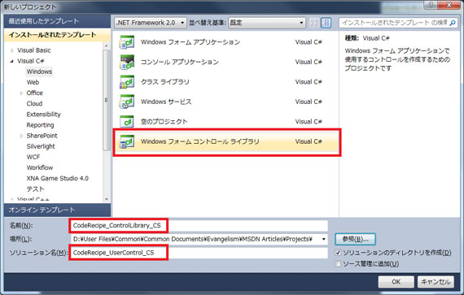
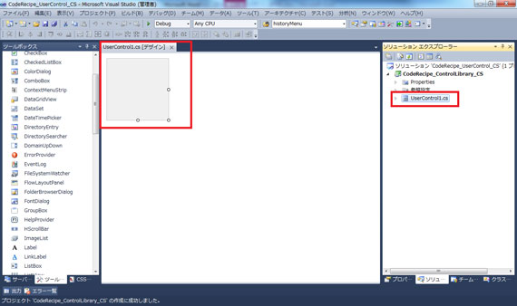
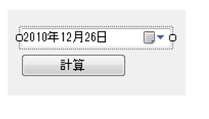
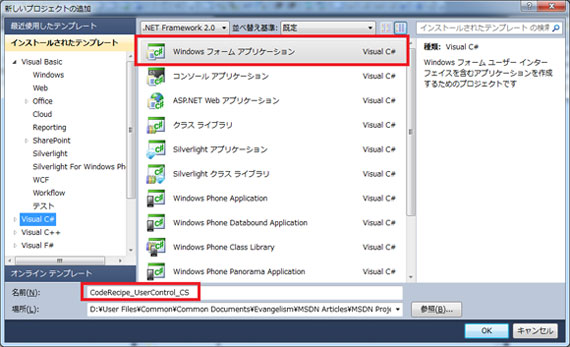
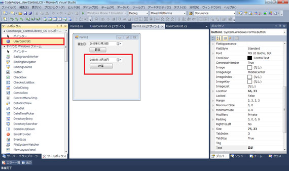
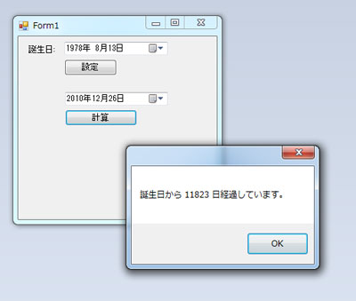

# C#: Windows フォーム向けユーザー コントロールの作成
## License
- Apache License, Version 2.0
## Technologies
- Visual Studio 2010
- .NET Framework 2.0
- Windows 7 Ultimate 64 bit
## Topics
- Windows フォーム
- 逆引きサンプル コード
## Updated
- 02/22/2011
## Description

執筆者: <a href="http://msdn.microsoft.com/ja-jp/gg585574#ikehara" target="_blank">
インフラジスティックス・ジャパン株式会社　池原 大然</a>

動作確認環境: Visual Studio 2010、.NET Framework 2.0、Windows 7 Ultimate 64 bit

アプリケーションの開発規模や画面数によっては複数のコントロールを 1 つにまとめたものを再利用し開発効率を上げることができます。Windows フォームでは標準で提供されているコントロールのほか、<a href="http://msdn.microsoft.com/ja-jp/library/97855yck" target="_blank">System.Windows.Forms.UserControl</a> コントロールを用いて複数のコントロールをまとめることが可能になっています。

<ol>
<li>Windows フォーム アプリケーション コントロール ライブラリ プロジェクトを作成し名前を &quot;CodeRecipe_ControlLibrary_CS&quot;、ソリューション名を &quot;CodeRecipe_UserControl_CS&quot; と設定します。

</li><li>プロジェクトには既定で UserControl1 が追加されており、デザイン画面にはコントロール領域にツール ボックスからコントロールを追加することが可能です。

</li><li>このユーザー コントロールには DateTimePicker コントロール、Button コントロールを追加します。

</li><li>

コード ビハインドでこの Usercontrol 独自のプロパティである、DateTime 型の BirthDate プロパティを実装します。その際に <a href="http://msdn.microsoft.com/ja-jp/library/system.componentmodel.defaultvalueattribute" target="_blank">
DefaultValueAttribute</a> を設定し、既定値を設定することが可能です。また、計算ボタンクリック時に BirthDate と DateTimePicker で選択した日付の経過日数を表示させるロジックを記述します。

C#

スクリプトの編集

csharp

<pre id="codePreview" class="csharp">using&nbsp;System;&nbsp;
using&nbsp;<a class="libraryLink" href="http://msdn.microsoft.com/ja-JP/library/System.ComponentModel.aspx" target="_blank" title="Auto generated link to System.ComponentModel">System.ComponentModel</a>;&nbsp;
using&nbsp;<a class="libraryLink" href="http://msdn.microsoft.com/ja-JP/library/System.Windows.Forms.aspx" target="_blank" title="Auto generated link to System.Windows.Forms">System.Windows.Forms</a>;&nbsp;
&nbsp;
namespace&nbsp;CodeRecipe_ControlLibrary_CS&nbsp;
{&nbsp;
&nbsp;&nbsp;&nbsp;&nbsp;public&nbsp;partial&nbsp;class&nbsp;UserControl1&nbsp;:&nbsp;UserControl&nbsp;
&nbsp;&nbsp;&nbsp;&nbsp;{&nbsp;
&nbsp;&nbsp;&nbsp;&nbsp;&nbsp;&nbsp;&nbsp;&nbsp;public&nbsp;UserControl1()&nbsp;
&nbsp;&nbsp;&nbsp;&nbsp;&nbsp;&nbsp;&nbsp;&nbsp;{&nbsp;
&nbsp;&nbsp;&nbsp;&nbsp;&nbsp;&nbsp;&nbsp;&nbsp;&nbsp;&nbsp;&nbsp;&nbsp;InitializeComponent();&nbsp;
&nbsp;&nbsp;&nbsp;&nbsp;&nbsp;&nbsp;&nbsp;&nbsp;&nbsp;&nbsp;&nbsp;&nbsp;//&nbsp;プロパティの初期値を設定&nbsp;
&nbsp;&nbsp;&nbsp;&nbsp;&nbsp;&nbsp;&nbsp;&nbsp;&nbsp;&nbsp;&nbsp;&nbsp;this.BirthDate&nbsp;=&nbsp;new&nbsp;DateTime(2000,&nbsp;1,&nbsp;1);&nbsp;
&nbsp;&nbsp;&nbsp;&nbsp;&nbsp;&nbsp;&nbsp;&nbsp;}&nbsp;
&nbsp;
&nbsp;&nbsp;&nbsp;&nbsp;&nbsp;&nbsp;&nbsp;&nbsp;//&nbsp;BirthDate&nbsp;プロパティを設定&nbsp;
&nbsp;&nbsp;&nbsp;&nbsp;&nbsp;&nbsp;&nbsp;&nbsp;[DefaultValue(typeof(DateTime),&nbsp;&quot;2000/01/01&quot;)]&nbsp;
&nbsp;&nbsp;&nbsp;&nbsp;&nbsp;&nbsp;&nbsp;&nbsp;public&nbsp;DateTime&nbsp;BirthDate&nbsp;{&nbsp;get;&nbsp;set;&nbsp;}&nbsp;
&nbsp;
&nbsp;&nbsp;&nbsp;&nbsp;&nbsp;&nbsp;&nbsp;&nbsp;private&nbsp;void&nbsp;button1_Click(object&nbsp;sender,&nbsp;EventArgs&nbsp;e)&nbsp;
&nbsp;&nbsp;&nbsp;&nbsp;&nbsp;&nbsp;&nbsp;&nbsp;{&nbsp;
&nbsp;&nbsp;&nbsp;&nbsp;&nbsp;&nbsp;&nbsp;&nbsp;&nbsp;&nbsp;&nbsp;&nbsp;//&nbsp;差分を表示&nbsp;
&nbsp;&nbsp;&nbsp;&nbsp;&nbsp;&nbsp;&nbsp;&nbsp;&nbsp;&nbsp;&nbsp;&nbsp;MessageBox.Show(&nbsp;
&nbsp;&nbsp;&nbsp;&nbsp;&nbsp;&nbsp;&nbsp;&nbsp;&nbsp;&nbsp;&nbsp;&nbsp;&nbsp;&nbsp;&nbsp;&nbsp;String.Format(&quot;誕生日から&nbsp;{0}&nbsp;日経過しています。&quot;,&nbsp;&nbsp;
&nbsp;&nbsp;&nbsp;&nbsp;&nbsp;&nbsp;&nbsp;&nbsp;&nbsp;&nbsp;&nbsp;&nbsp;&nbsp;&nbsp;&nbsp;&nbsp;(this.dateTimePicker1.Value&nbsp;-&nbsp;BirthDate).Days));&nbsp;
&nbsp;&nbsp;&nbsp;&nbsp;&nbsp;&nbsp;&nbsp;&nbsp;}&nbsp;
&nbsp;&nbsp;&nbsp;&nbsp;}&nbsp;
}&nbsp;
&nbsp;
</pre>

</li><li>

次にこのコントロールをホストする Windows フォーム アプリケーションプロジェクトを &quot;CodeRecipe_UserControl_CS&quot; と名前を付けて作成します。なお、Windows フォーム アプリケーションの作成方法については
<a href="http://code.msdn.microsoft.com/C-Windows-dc42087f">[C#] Windows フォームによるクライアント アプリケーション開発</a>を参照してください。

</li><li>Form1 のデザイナー画面を開き、Label, DateTimePicker, そして先ほど作成した UserControl1 コントロールを追加します。

</li><li>

Form1 の [設定] ボタンのクリック ハンドラーでは UserControl1.BirthDate プロパティに値を設定します。

C#

スクリプトの編集

csharp

<pre id="codePreview" class="csharp">private&nbsp;void&nbsp;button1_Click(object&nbsp;sender,&nbsp;EventArgs&nbsp;e)&nbsp;
{&nbsp;
&nbsp;&nbsp;&nbsp;&nbsp;this.userControl11.BirthDate&nbsp;=&nbsp;this.dateTimePicker1.Value;&nbsp;
}&nbsp;
&nbsp;
</pre>

CodeRecipe_UserControl_CS をスタートアップ プロジェクトに設定したのちの実行結果は下記の通りです。

上下の DatePicker で設定した日付の差分が表示されます。このフォームの下半分がパーツ化されたことになります。

</li></ol>
<h3>関連リンク</h3>
<ul>
<li><a href="http://msdn.microsoft.com/ja-jp/library/97855yck" target="_blank">UserControl クラス</a>
</li><li><a href="http://msdn.microsoft.com/ja-jp/library/ms171724" target="_blank">Windows フォーム コントロールの属性</a>
</li><li><a href="http://code.msdn.microsoft.com/10-Windows-C-6e4683ea">10 行でズバリ!! Windows フォーム向けユーザー コントロールの作成 (C#)
</a></li></ul>

<table>
<tbody>
<tr>
<td></td>
<td></td>
<td>
<ul>
<li>もっと他のコンテンツを見る &gt;&gt; <a href="http://msdn.microsoft.com/ja-jp/ff363212" target="_blank">
逆引きサンプル コード一覧へ</a> </li><li>もっと他のレシピを見る &gt;&gt; <a href="http://msdn.microsoft.com/ja-jp/samplecode.recipe">
Code Recipe へ</a> </li><li>もっと Windows の情報を見る &gt;&gt; <a href="http://msdn.microsoft.com/ja-jp/windows/" target="_blank">
Windows デベロッパー センターへ</a> </li></ul>
</td>
</tr>
</tbody>
</table>

<a href="#top">ページのトップへ</a>

