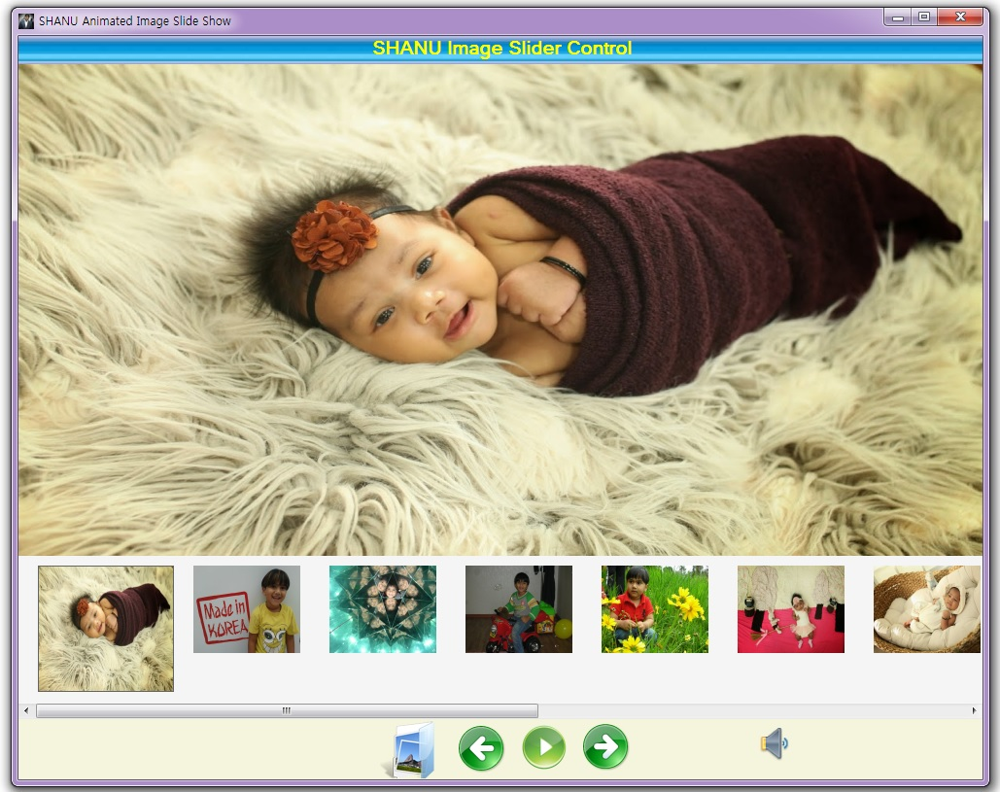
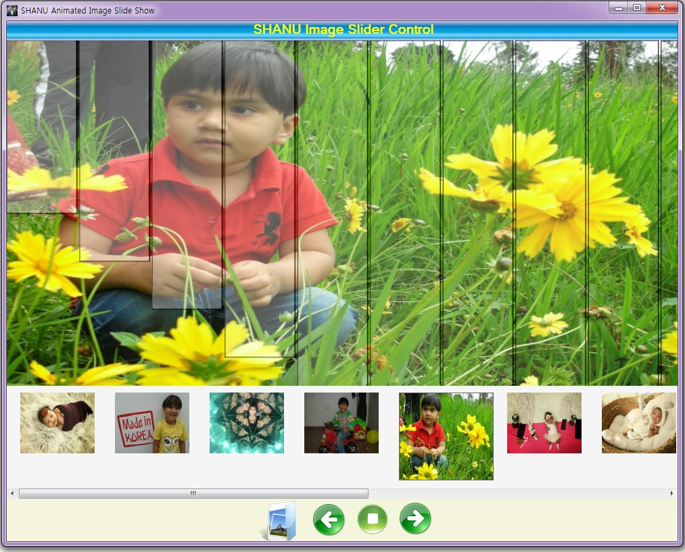

# C# Winform Animated Image Slide Show in Winform
## Requires
- Visual Studio 2010
## License
- MIT
## Technologies
- C#
- Windows Forms
## Topics
- C#
- Windows Forms
## Updated
- 04/14/2016
## Description

<h1>Introduction</h1>

<em>The main purpose of this article is to explain on how to create a simple Animated Image Slide Show for windows applications using C#.&nbsp;</em>

<em></em>

This Animated Image Slide Show User control has features as

 
1) Load Images. 
2) Display both Thumb and Large size Image. 
3) Highlight the Selected and Current Image in Thumb image View. 
4) Previous, Next and Play Animation. 
5) Small to Big Zoom out Image Animation. 
6) Left to Right Scroll Animation. 
7) Right to Left Scroll Animation 
8) Top to Bottom Scroll Animation. 
9) Image Fade In Animation 
10) Transparent Horizontal Bar display on image Animation. 
11) Transparent Vertical Bar display on image Animation. 
12) Transparent Text display on Image Animation. 
13) Random Block transparent Animation. 
14) Play and Stop Music

<h1>Building the Sample</h1>

<em>&nbsp;This application was developed using C# GDI&#43; functionality. The goal was to create a flash style animated Image Slide show for Windows Applications. We have added basic animation features for the Image Slide Show user control. Here we can
 see Fade and Vertical Transparent Bar Animation Screens.</em>

<em></em>

<em></em>

<em>Here we can see the Selected and Current Image in Thump View will be Highlighted with Border and little big Image size.</em>

<em>Now we start with our Code: 
We have created a Animated Image Slide Show as a User Control so that it can be used easily in all projects. 
In this article we have attached zip file named as SHANUImageSlideShow.zip. Which contains . 
1) &quot;ShanuImageSlideShow_Cntrl&quot; Folder (This folder contains the Image Slide Show User control Source code). 
2) &quot;SHANUImageSlideShow_Demo&quot; Folder (This folder conains the Demo program which includes the Image Slide Show user control ). 
</em>

Description

1) First we will start with the User Control .To Create a user control .

<ol type="1">
<li>Create a new Windows Control Library project. </li><li>Set the Name of Project and Click Ok(here my user control name is ShanuImageSlideShow_Cntrl).
</li><li>Add all the controls which is needed. </li><li>In code behind declare all the public variables and Public property variables.
</li><li>Image Load Button Click.Here we load all the image from the Folder as Thump image view in our control.
</li></ol>

C#

Edit|Remove

csharp

<pre class="js">public&nbsp;void&nbsp;LoadImages()&nbsp;
&nbsp;&nbsp;&nbsp;&nbsp;&nbsp;&nbsp;&nbsp;&nbsp;{&nbsp;
&nbsp;&nbsp;&nbsp;&nbsp;&nbsp;&nbsp;&nbsp;&nbsp;&nbsp;&nbsp;&nbsp;&nbsp;DirectoryInfo&nbsp;Folder;&nbsp;
&nbsp;&nbsp;&nbsp;&nbsp;&nbsp;&nbsp;&nbsp;&nbsp;&nbsp;&nbsp;&nbsp;&nbsp;DialogResult&nbsp;result&nbsp;=&nbsp;this.folderBrowserDlg.ShowDialog();&nbsp;
&nbsp;&nbsp;&nbsp;&nbsp;&nbsp;&nbsp;&nbsp;&nbsp;&nbsp;&nbsp;&nbsp;&nbsp;imageselected&nbsp;=&nbsp;false;&nbsp;
&nbsp;&nbsp;&nbsp;&nbsp;&nbsp;&nbsp;&nbsp;&nbsp;&nbsp;&nbsp;&nbsp;&nbsp;if&nbsp;(result&nbsp;==&nbsp;DialogResult.OK)&nbsp;
&nbsp;&nbsp;&nbsp;&nbsp;&nbsp;&nbsp;&nbsp;&nbsp;&nbsp;&nbsp;&nbsp;&nbsp;{&nbsp;
&nbsp;&nbsp;&nbsp;&nbsp;&nbsp;&nbsp;&nbsp;&nbsp;&nbsp;&nbsp;&nbsp;&nbsp;&nbsp;&nbsp;&nbsp;&nbsp;Folder&nbsp;=&nbsp;new&nbsp;DirectoryInfo(folderBrowserDlg.SelectedPath);&nbsp;
&nbsp;
&nbsp;
&nbsp;&nbsp;&nbsp;&nbsp;&nbsp;&nbsp;&nbsp;&nbsp;&nbsp;&nbsp;&nbsp;&nbsp;&nbsp;&nbsp;&nbsp;&nbsp;var&nbsp;imageFiles&nbsp;=&nbsp;Folder.GetFiles(&quot;*.jpg&quot;)&nbsp;
&nbsp;&nbsp;&nbsp;&nbsp;&nbsp;&nbsp;&nbsp;&nbsp;&nbsp;&nbsp;&nbsp;&nbsp;&nbsp;&nbsp;&nbsp;&nbsp;&nbsp;&nbsp;&nbsp;&nbsp;&nbsp;&nbsp;.Concat(Folder.GetFiles(&quot;*.gif&quot;))&nbsp;
&nbsp;&nbsp;&nbsp;&nbsp;&nbsp;&nbsp;&nbsp;&nbsp;&nbsp;&nbsp;&nbsp;&nbsp;&nbsp;&nbsp;&nbsp;&nbsp;&nbsp;&nbsp;&nbsp;&nbsp;&nbsp;&nbsp;.Concat(Folder.GetFiles(&quot;*.png&quot;))&nbsp;
&nbsp;&nbsp;&nbsp;&nbsp;&nbsp;&nbsp;&nbsp;&nbsp;&nbsp;&nbsp;&nbsp;&nbsp;&nbsp;&nbsp;&nbsp;&nbsp;&nbsp;&nbsp;&nbsp;&nbsp;&nbsp;&nbsp;.Concat(Folder.GetFiles(&quot;*.jpeg&quot;))&nbsp;
&nbsp;&nbsp;&nbsp;&nbsp;&nbsp;&nbsp;&nbsp;&nbsp;&nbsp;&nbsp;&nbsp;&nbsp;&nbsp;&nbsp;&nbsp;&nbsp;&nbsp;&nbsp;&nbsp;&nbsp;&nbsp;&nbsp;.Concat(Folder.GetFiles(&quot;*.bmp&quot;)).ToArray();&nbsp;//&nbsp;Here&nbsp;we&nbsp;filter&nbsp;all&nbsp;image&nbsp;files&nbsp;&nbsp;
&nbsp;&nbsp;&nbsp;&nbsp;&nbsp;&nbsp;&nbsp;&nbsp;&nbsp;&nbsp;&nbsp;&nbsp;&nbsp;&nbsp;&nbsp;&nbsp;pnlThumb.Controls.Clear();&nbsp;
&nbsp;&nbsp;&nbsp;&nbsp;&nbsp;&nbsp;&nbsp;&nbsp;&nbsp;&nbsp;&nbsp;&nbsp;&nbsp;&nbsp;&nbsp;&nbsp;if&nbsp;(imageFiles.Length&nbsp;&gt;&nbsp;0)&nbsp;
&nbsp;&nbsp;&nbsp;&nbsp;&nbsp;&nbsp;&nbsp;&nbsp;&nbsp;&nbsp;&nbsp;&nbsp;&nbsp;&nbsp;&nbsp;&nbsp;{&nbsp;
&nbsp;&nbsp;&nbsp;&nbsp;&nbsp;&nbsp;&nbsp;&nbsp;&nbsp;&nbsp;&nbsp;&nbsp;&nbsp;&nbsp;&nbsp;&nbsp;&nbsp;&nbsp;&nbsp;&nbsp;imageselected&nbsp;=&nbsp;true;&nbsp;
&nbsp;&nbsp;&nbsp;&nbsp;&nbsp;&nbsp;&nbsp;&nbsp;&nbsp;&nbsp;&nbsp;&nbsp;&nbsp;&nbsp;&nbsp;&nbsp;&nbsp;&nbsp;&nbsp;&nbsp;TotalimageFiles&nbsp;=&nbsp;imageFiles.Length;&nbsp;
&nbsp;&nbsp;&nbsp;&nbsp;&nbsp;&nbsp;&nbsp;&nbsp;&nbsp;&nbsp;&nbsp;&nbsp;&nbsp;&nbsp;&nbsp;&nbsp;}else{return;&nbsp;
&nbsp;&nbsp;&nbsp;&nbsp;&nbsp;&nbsp;&nbsp;&nbsp;&nbsp;&nbsp;&nbsp;&nbsp;&nbsp;&nbsp;&nbsp;&nbsp;}&nbsp;
&nbsp;&nbsp;&nbsp;&nbsp;&nbsp;&nbsp;&nbsp;&nbsp;&nbsp;&nbsp;&nbsp;&nbsp;&nbsp;&nbsp;&nbsp;&nbsp;int&nbsp;locnewX&nbsp;=&nbsp;locX;&nbsp;
&nbsp;&nbsp;&nbsp;&nbsp;&nbsp;&nbsp;&nbsp;&nbsp;&nbsp;&nbsp;&nbsp;&nbsp;&nbsp;&nbsp;&nbsp;&nbsp;int&nbsp;locnewY&nbsp;=&nbsp;locY;&nbsp;
&nbsp;
&nbsp;&nbsp;&nbsp;&nbsp;&nbsp;&nbsp;&nbsp;&nbsp;&nbsp;&nbsp;&nbsp;&nbsp;&nbsp;&nbsp;&nbsp;&nbsp;ctrl&nbsp;=&nbsp;new&nbsp;PictureBox[TotalimageFiles];&nbsp;
&nbsp;&nbsp;&nbsp;&nbsp;&nbsp;&nbsp;&nbsp;&nbsp;&nbsp;&nbsp;&nbsp;&nbsp;&nbsp;&nbsp;&nbsp;&nbsp;AllImageFielsNames&nbsp;=&nbsp;newString[TotalimageFiles];&nbsp;
&nbsp;&nbsp;&nbsp;&nbsp;&nbsp;&nbsp;&nbsp;&nbsp;&nbsp;&nbsp;&nbsp;&nbsp;&nbsp;&nbsp;&nbsp;&nbsp;int&nbsp;imageindexs&nbsp;=&nbsp;0;&nbsp;
&nbsp;&nbsp;&nbsp;&nbsp;&nbsp;&nbsp;&nbsp;&nbsp;&nbsp;&nbsp;&nbsp;&nbsp;&nbsp;&nbsp;&nbsp;&nbsp;foreach&nbsp;(FileInfo&nbsp;img&nbsp;in&nbsp;imageFiles)&nbsp;
&nbsp;&nbsp;&nbsp;&nbsp;&nbsp;&nbsp;&nbsp;&nbsp;&nbsp;&nbsp;&nbsp;&nbsp;&nbsp;&nbsp;&nbsp;&nbsp;{&nbsp;
&nbsp;&nbsp;&nbsp;&nbsp;&nbsp;&nbsp;&nbsp;&nbsp;&nbsp;&nbsp;&nbsp;&nbsp;&nbsp;&nbsp;&nbsp;&nbsp;&nbsp;&nbsp;&nbsp;&nbsp;AllImageFielsNames[imageindexs]&nbsp;=&nbsp;img.FullName;&nbsp;
&nbsp;&nbsp;&nbsp;&nbsp;&nbsp;&nbsp;&nbsp;&nbsp;&nbsp;&nbsp;&nbsp;&nbsp;&nbsp;&nbsp;&nbsp;&nbsp;&nbsp;&nbsp;&nbsp;&nbsp;loadImagestoPanel(img.Name,&nbsp;img.FullName,&nbsp;locnewX,&nbsp;locnewY,&nbsp;imageindexs);&nbsp;
&nbsp;&nbsp;&nbsp;&nbsp;&nbsp;&nbsp;&nbsp;&nbsp;&nbsp;&nbsp;&nbsp;&nbsp;&nbsp;&nbsp;&nbsp;&nbsp;&nbsp;&nbsp;&nbsp;&nbsp;locnewX&nbsp;=&nbsp;locnewX&nbsp;&#43;&nbsp;sizeWidth&nbsp;&#43;&nbsp;10;&nbsp;
&nbsp;&nbsp;&nbsp;&nbsp;&nbsp;&nbsp;&nbsp;&nbsp;&nbsp;&nbsp;&nbsp;&nbsp;&nbsp;&nbsp;&nbsp;&nbsp;&nbsp;&nbsp;&nbsp;&nbsp;imageindexs&nbsp;=&nbsp;imageindexs&nbsp;&#43;&nbsp;1;&nbsp;
&nbsp;
&nbsp;&nbsp;&nbsp;&nbsp;&nbsp;&nbsp;&nbsp;&nbsp;&nbsp;&nbsp;&nbsp;&nbsp;&nbsp;&nbsp;&nbsp;&nbsp;}&nbsp;
&nbsp;&nbsp;&nbsp;&nbsp;&nbsp;&nbsp;&nbsp;&nbsp;&nbsp;&nbsp;&nbsp;&nbsp;&nbsp;&nbsp;&nbsp;&nbsp;CurrentIndex&nbsp;=&nbsp;0;&nbsp;
&nbsp;&nbsp;&nbsp;&nbsp;&nbsp;&nbsp;&nbsp;&nbsp;&nbsp;&nbsp;&nbsp;&nbsp;&nbsp;&nbsp;&nbsp;&nbsp;StartIndex&nbsp;=&nbsp;0;&nbsp;
&nbsp;&nbsp;&nbsp;&nbsp;&nbsp;&nbsp;&nbsp;&nbsp;&nbsp;&nbsp;&nbsp;&nbsp;&nbsp;&nbsp;&nbsp;&nbsp;LastIndex&nbsp;=&nbsp;0;&nbsp;
&nbsp;
&nbsp;&nbsp;&nbsp;&nbsp;&nbsp;&nbsp;&nbsp;&nbsp;&nbsp;&nbsp;&nbsp;&nbsp;&nbsp;&nbsp;&nbsp;&nbsp;DrawImageSlideShows();&nbsp;
&nbsp;&nbsp;&nbsp;&nbsp;&nbsp;&nbsp;&nbsp;&nbsp;&nbsp;&nbsp;&nbsp;&nbsp;}}//&nbsp;This&nbsp;Function&nbsp;will&nbsp;display&nbsp;the&nbsp;Thumb&nbsp;Images.&nbsp;
&nbsp;&nbsp;&nbsp;&nbsp;&nbsp;&nbsp;&nbsp;&nbsp;private&nbsp;void&nbsp;loadImagestoPanel(String&nbsp;imageName,&nbsp;String&nbsp;ImageFullName,&nbsp;int&nbsp;newLocX,&nbsp;int&nbsp;newLocY,&nbsp;int&nbsp;imageindexs)&nbsp;
&nbsp;&nbsp;&nbsp;&nbsp;&nbsp;&nbsp;&nbsp;&nbsp;{&nbsp;
&nbsp;&nbsp;&nbsp;&nbsp;&nbsp;&nbsp;&nbsp;&nbsp;&nbsp;&nbsp;&nbsp;&nbsp;ctrl[imageindexs]&nbsp;=&nbsp;new&nbsp;PictureBox();&nbsp;
&nbsp;&nbsp;&nbsp;&nbsp;&nbsp;&nbsp;&nbsp;&nbsp;&nbsp;&nbsp;&nbsp;&nbsp;ctrl[imageindexs].Image&nbsp;=&nbsp;Image.FromFile(ImageFullName);&nbsp;
&nbsp;&nbsp;&nbsp;&nbsp;&nbsp;&nbsp;&nbsp;&nbsp;&nbsp;&nbsp;&nbsp;&nbsp;ctrl[imageindexs].BackColor&nbsp;=&nbsp;Color.Black;&nbsp;
&nbsp;&nbsp;&nbsp;&nbsp;&nbsp;&nbsp;&nbsp;&nbsp;&nbsp;&nbsp;&nbsp;&nbsp;ctrl[imageindexs].Location&nbsp;=&nbsp;new&nbsp;Point(newLocX,&nbsp;newLocY);&nbsp;
&nbsp;&nbsp;&nbsp;&nbsp;&nbsp;&nbsp;&nbsp;&nbsp;&nbsp;&nbsp;&nbsp;&nbsp;ctrl[imageindexs].Size&nbsp;=&nbsp;new&nbsp;<a class="libraryLink" href="https://msdn.microsoft.com/en-US/library/System.Drawing.Size.aspx" target="_blank" title="Auto generated link to System.Drawing.Size">System.Drawing.Size</a>(sizeWidth&nbsp;-&nbsp;30,&nbsp;sizeHeight&nbsp;-&nbsp;60);&nbsp;
&nbsp;&nbsp;&nbsp;&nbsp;&nbsp;&nbsp;&nbsp;&nbsp;&nbsp;&nbsp;&nbsp;&nbsp;ctrl[imageindexs].BorderStyle&nbsp;=&nbsp;BorderStyle.None;&nbsp;
&nbsp;&nbsp;&nbsp;&nbsp;&nbsp;&nbsp;&nbsp;&nbsp;&nbsp;&nbsp;&nbsp;&nbsp;ctrl[imageindexs].SizeMode&nbsp;=&nbsp;PictureBoxSizeMode.StretchImage;&nbsp;
&nbsp;&nbsp;&nbsp;&nbsp;&nbsp;&nbsp;&nbsp;&nbsp;&nbsp;&nbsp;&nbsp;&nbsp;//&nbsp;&nbsp;ctrl[imageindexs].MouseClick&nbsp;&#43;=&nbsp;new&nbsp;MouseEventHandler(control_MouseMove);&nbsp;
&nbsp;&nbsp;&nbsp;&nbsp;&nbsp;&nbsp;&nbsp;&nbsp;&nbsp;&nbsp;&nbsp;&nbsp;pnlThumb.Controls.Add(ctrl[imageindexs]);&nbsp;
&nbsp;
&nbsp;
&nbsp;&nbsp;&nbsp;&nbsp;&nbsp;&nbsp;&nbsp;&nbsp;}</pre>

Here we call the above function in Load Image Click Event.In this function load and display all the Images from the selected folder.

6.Once Image loaded we need highlight the selected and current image .for this we call the below function which will check for the current image and set the image border and Increase the Size of the present image.

C#

Edit|Remove

csharp

<pre class="js">#region&nbsp;Highlight&nbsp;The&nbsp;Current&nbsp;Slected&nbsp;image&nbsp;
&nbsp;&nbsp;&nbsp;&nbsp;&nbsp;&nbsp;public&nbsp;void&nbsp;HighlightCurrentImage()&nbsp;
&nbsp;&nbsp;&nbsp;&nbsp;&nbsp;&nbsp;{&nbsp;
&nbsp;&nbsp;&nbsp;&nbsp;&nbsp;&nbsp;&nbsp;&nbsp;&nbsp;&nbsp;for&nbsp;(int&nbsp;i&nbsp;=&nbsp;0;&nbsp;i&nbsp;&lt;=&nbsp;ctrl.Length&nbsp;-&nbsp;1;&nbsp;i&#43;&#43;)&nbsp;
&nbsp;&nbsp;&nbsp;&nbsp;&nbsp;&nbsp;&nbsp;&nbsp;&nbsp;&nbsp;{&nbsp;
&nbsp;&nbsp;&nbsp;&nbsp;&nbsp;&nbsp;&nbsp;&nbsp;&nbsp;&nbsp;&nbsp;&nbsp;&nbsp;&nbsp;if&nbsp;(i&nbsp;==&nbsp;CurrentIndex)&nbsp;
&nbsp;&nbsp;&nbsp;&nbsp;&nbsp;&nbsp;&nbsp;&nbsp;&nbsp;&nbsp;&nbsp;&nbsp;&nbsp;&nbsp;{&nbsp;
&nbsp;&nbsp;&nbsp;&nbsp;&nbsp;&nbsp;&nbsp;&nbsp;&nbsp;&nbsp;&nbsp;&nbsp;&nbsp;&nbsp;&nbsp;&nbsp;&nbsp;&nbsp;ctrl[i].Left&nbsp;=&nbsp;ctrl[i].Left&nbsp;-&nbsp;20;&nbsp;
&nbsp;&nbsp;&nbsp;&nbsp;&nbsp;&nbsp;&nbsp;&nbsp;&nbsp;&nbsp;&nbsp;&nbsp;&nbsp;&nbsp;&nbsp;&nbsp;&nbsp;&nbsp;ctrl[i].Size&nbsp;=&nbsp;new&nbsp;<a class="libraryLink" href="https://msdn.microsoft.com/en-US/library/System.Drawing.Size.aspx" target="_blank" title="Auto generated link to System.Drawing.Size">System.Drawing.Size</a>(sizeWidth&nbsp;&#43;&nbsp;10,&nbsp;sizeHeight);&nbsp;
&nbsp;&nbsp;&nbsp;&nbsp;&nbsp;&nbsp;&nbsp;&nbsp;&nbsp;&nbsp;&nbsp;&nbsp;&nbsp;&nbsp;&nbsp;&nbsp;&nbsp;&nbsp;ctrl[i].BorderStyle&nbsp;=&nbsp;BorderStyle.FixedSingle;&nbsp;
&nbsp;
&nbsp;&nbsp;&nbsp;&nbsp;&nbsp;&nbsp;&nbsp;&nbsp;&nbsp;&nbsp;&nbsp;&nbsp;&nbsp;&nbsp;}&nbsp;
&nbsp;&nbsp;&nbsp;&nbsp;&nbsp;&nbsp;&nbsp;&nbsp;&nbsp;&nbsp;&nbsp;&nbsp;&nbsp;&nbsp;else&nbsp;
&nbsp;&nbsp;&nbsp;&nbsp;&nbsp;&nbsp;&nbsp;&nbsp;&nbsp;&nbsp;&nbsp;&nbsp;&nbsp;&nbsp;{&nbsp;
&nbsp;&nbsp;&nbsp;&nbsp;&nbsp;&nbsp;&nbsp;&nbsp;&nbsp;&nbsp;&nbsp;&nbsp;&nbsp;&nbsp;&nbsp;&nbsp;&nbsp;&nbsp;//&nbsp;ctrl[i].Location&nbsp;=&nbsp;new&nbsp;Point(newLocX,&nbsp;newLocY);&nbsp;
&nbsp;&nbsp;&nbsp;&nbsp;&nbsp;&nbsp;&nbsp;&nbsp;&nbsp;&nbsp;&nbsp;&nbsp;&nbsp;&nbsp;&nbsp;&nbsp;&nbsp;&nbsp;ctrl[i].Size&nbsp;=&nbsp;new&nbsp;<a class="libraryLink" href="https://msdn.microsoft.com/en-US/library/System.Drawing.Size.aspx" target="_blank" title="Auto generated link to System.Drawing.Size">System.Drawing.Size</a>(sizeWidth&nbsp;-&nbsp;20,&nbsp;sizeHeight&nbsp;-&nbsp;40);&nbsp;
&nbsp;&nbsp;&nbsp;&nbsp;&nbsp;&nbsp;&nbsp;&nbsp;&nbsp;&nbsp;&nbsp;&nbsp;&nbsp;&nbsp;&nbsp;&nbsp;&nbsp;&nbsp;ctrl[i].BorderStyle&nbsp;=&nbsp;BorderStyle.None;&nbsp;
&nbsp;&nbsp;&nbsp;&nbsp;&nbsp;&nbsp;&nbsp;&nbsp;&nbsp;&nbsp;&nbsp;&nbsp;&nbsp;&nbsp;}&nbsp;
&nbsp;&nbsp;&nbsp;&nbsp;&nbsp;&nbsp;&nbsp;&nbsp;&nbsp;&nbsp;}&nbsp;
&nbsp;&nbsp;&nbsp;&nbsp;&nbsp;&nbsp;}&nbsp;
&nbsp;&nbsp;&nbsp;&nbsp;&nbsp;&nbsp;#endregion</pre>

&nbsp;7.This is the important function of User control where wedo the Animation for the selected current Image.This function will be called in Timer Tick event .After the Animation is finished we stop the timer and activate the
 main timer to load next image.From main Timer we create the Random no from 1 to 11 and activate the sub timer ,Sub timer is used to display the animation.

C#

Edit|Remove

csharp

<pre class="js">#region&nbsp;Draw&nbsp;Animation&nbsp;on&nbsp;seleced&nbsp;Image&nbsp;
&nbsp;&nbsp;&nbsp;&nbsp;&nbsp;&nbsp;public&nbsp;void&nbsp;drawAnimation()&nbsp;
&nbsp;&nbsp;&nbsp;&nbsp;&nbsp;{try{switch&nbsp;(SlideType)&nbsp;
&nbsp;&nbsp;&nbsp;&nbsp;&nbsp;&nbsp;&nbsp;&nbsp;&nbsp;&nbsp;&nbsp;&nbsp;&nbsp;{case0://&nbsp;Small&nbsp;to&nbsp;big&nbsp;
&nbsp;&nbsp;&nbsp;&nbsp;&nbsp;&nbsp;&nbsp;&nbsp;&nbsp;&nbsp;&nbsp;&nbsp;&nbsp;&nbsp;&nbsp;&nbsp;&nbsp;&nbsp;&nbsp;&nbsp;&nbsp;SmalltoBigImage_Animation();&nbsp;
&nbsp;&nbsp;&nbsp;&nbsp;&nbsp;&nbsp;&nbsp;&nbsp;&nbsp;&nbsp;&nbsp;&nbsp;&nbsp;&nbsp;&nbsp;&nbsp;&nbsp;&nbsp;&nbsp;&nbsp;&nbsp;break;&nbsp;
&nbsp;
&nbsp;&nbsp;&nbsp;&nbsp;&nbsp;&nbsp;&nbsp;&nbsp;&nbsp;&nbsp;&nbsp;&nbsp;&nbsp;&nbsp;&nbsp;&nbsp;&nbsp;case1://&nbsp;left&nbsp;to&nbsp;right&nbsp;
&nbsp;&nbsp;&nbsp;&nbsp;&nbsp;&nbsp;&nbsp;&nbsp;&nbsp;&nbsp;&nbsp;&nbsp;&nbsp;&nbsp;&nbsp;&nbsp;&nbsp;&nbsp;&nbsp;&nbsp;&nbsp;LefttoRight_Animation();&nbsp;
&nbsp;&nbsp;&nbsp;&nbsp;&nbsp;&nbsp;&nbsp;&nbsp;&nbsp;&nbsp;&nbsp;&nbsp;&nbsp;&nbsp;&nbsp;&nbsp;&nbsp;&nbsp;&nbsp;&nbsp;&nbsp;break;&nbsp;
&nbsp;
&nbsp;&nbsp;&nbsp;&nbsp;&nbsp;&nbsp;&nbsp;&nbsp;&nbsp;&nbsp;&nbsp;&nbsp;&nbsp;&nbsp;&nbsp;&nbsp;&nbsp;case2://&nbsp;Rectangle&nbsp;Transparent&nbsp;
&nbsp;&nbsp;&nbsp;&nbsp;&nbsp;&nbsp;&nbsp;&nbsp;&nbsp;&nbsp;&nbsp;&nbsp;&nbsp;&nbsp;&nbsp;&nbsp;&nbsp;&nbsp;&nbsp;&nbsp;&nbsp;Transparent_Bar_Animation();&nbsp;
&nbsp;&nbsp;&nbsp;&nbsp;&nbsp;&nbsp;&nbsp;&nbsp;&nbsp;&nbsp;&nbsp;&nbsp;&nbsp;&nbsp;&nbsp;&nbsp;&nbsp;&nbsp;&nbsp;&nbsp;&nbsp;break;&nbsp;
&nbsp;
&nbsp;&nbsp;&nbsp;&nbsp;&nbsp;&nbsp;&nbsp;&nbsp;&nbsp;&nbsp;&nbsp;&nbsp;&nbsp;&nbsp;&nbsp;&nbsp;&nbsp;case3://&nbsp;Right&nbsp;to&nbsp;Left&nbsp;
&nbsp;&nbsp;&nbsp;&nbsp;&nbsp;&nbsp;&nbsp;&nbsp;&nbsp;&nbsp;&nbsp;&nbsp;&nbsp;&nbsp;&nbsp;&nbsp;&nbsp;&nbsp;&nbsp;&nbsp;&nbsp;RighttoLeft_Animation();&nbsp;
&nbsp;&nbsp;&nbsp;&nbsp;&nbsp;&nbsp;&nbsp;&nbsp;&nbsp;&nbsp;&nbsp;&nbsp;&nbsp;&nbsp;&nbsp;&nbsp;&nbsp;&nbsp;&nbsp;&nbsp;&nbsp;break;&nbsp;
&nbsp;
&nbsp;&nbsp;&nbsp;&nbsp;&nbsp;&nbsp;&nbsp;&nbsp;&nbsp;&nbsp;&nbsp;&nbsp;&nbsp;&nbsp;&nbsp;&nbsp;&nbsp;case4://&nbsp;Top&nbsp;to&nbsp;Bottom&nbsp;
&nbsp;&nbsp;&nbsp;&nbsp;&nbsp;&nbsp;&nbsp;&nbsp;&nbsp;&nbsp;&nbsp;&nbsp;&nbsp;&nbsp;&nbsp;&nbsp;&nbsp;&nbsp;&nbsp;&nbsp;&nbsp;ToptoBottom_Animation();&nbsp;
&nbsp;&nbsp;&nbsp;&nbsp;&nbsp;&nbsp;&nbsp;&nbsp;&nbsp;&nbsp;&nbsp;&nbsp;&nbsp;&nbsp;&nbsp;&nbsp;&nbsp;&nbsp;&nbsp;&nbsp;&nbsp;break;&nbsp;
&nbsp;
&nbsp;&nbsp;&nbsp;&nbsp;&nbsp;&nbsp;&nbsp;&nbsp;&nbsp;&nbsp;&nbsp;&nbsp;&nbsp;&nbsp;&nbsp;&nbsp;&nbsp;case5://&nbsp;Bottom&nbsp;to&nbsp;Top&nbsp;
&nbsp;&nbsp;&nbsp;&nbsp;&nbsp;&nbsp;&nbsp;&nbsp;&nbsp;&nbsp;&nbsp;&nbsp;&nbsp;&nbsp;&nbsp;&nbsp;&nbsp;&nbsp;&nbsp;&nbsp;&nbsp;BottomTop_Animation();&nbsp;
&nbsp;&nbsp;&nbsp;&nbsp;&nbsp;&nbsp;&nbsp;&nbsp;&nbsp;&nbsp;&nbsp;&nbsp;&nbsp;&nbsp;&nbsp;&nbsp;&nbsp;&nbsp;&nbsp;&nbsp;&nbsp;break;&nbsp;
&nbsp;
&nbsp;&nbsp;&nbsp;&nbsp;&nbsp;&nbsp;&nbsp;&nbsp;&nbsp;&nbsp;&nbsp;&nbsp;&nbsp;&nbsp;&nbsp;&nbsp;&nbsp;case6://&nbsp;Rectangle&nbsp;Vertical&nbsp;Block&nbsp;Transparent&nbsp;
&nbsp;&nbsp;&nbsp;&nbsp;&nbsp;&nbsp;&nbsp;&nbsp;&nbsp;&nbsp;&nbsp;&nbsp;&nbsp;&nbsp;&nbsp;&nbsp;&nbsp;&nbsp;&nbsp;&nbsp;&nbsp;Vertical_Bar_Animation();&nbsp;
&nbsp;&nbsp;&nbsp;&nbsp;&nbsp;&nbsp;&nbsp;&nbsp;&nbsp;&nbsp;&nbsp;&nbsp;&nbsp;&nbsp;&nbsp;&nbsp;&nbsp;&nbsp;&nbsp;&nbsp;&nbsp;break;&nbsp;
&nbsp;
&nbsp;&nbsp;&nbsp;&nbsp;&nbsp;&nbsp;&nbsp;&nbsp;&nbsp;&nbsp;&nbsp;&nbsp;&nbsp;&nbsp;&nbsp;&nbsp;&nbsp;case7://&nbsp;Random&nbsp;Block&nbsp;Transparent&nbsp;
&nbsp;&nbsp;&nbsp;&nbsp;&nbsp;&nbsp;&nbsp;&nbsp;&nbsp;&nbsp;&nbsp;&nbsp;&nbsp;&nbsp;&nbsp;&nbsp;&nbsp;&nbsp;&nbsp;&nbsp;&nbsp;Random_Bar_Animation();&nbsp;
&nbsp;&nbsp;&nbsp;&nbsp;&nbsp;&nbsp;&nbsp;&nbsp;&nbsp;&nbsp;&nbsp;&nbsp;&nbsp;&nbsp;&nbsp;&nbsp;&nbsp;&nbsp;&nbsp;&nbsp;&nbsp;break;&nbsp;
&nbsp;
&nbsp;&nbsp;&nbsp;&nbsp;&nbsp;&nbsp;&nbsp;&nbsp;&nbsp;&nbsp;&nbsp;&nbsp;&nbsp;&nbsp;&nbsp;&nbsp;&nbsp;case8://&nbsp;Rectangle&nbsp;Horizontal&nbsp;Block&nbsp;Transparent&nbsp;
&nbsp;&nbsp;&nbsp;&nbsp;&nbsp;&nbsp;&nbsp;&nbsp;&nbsp;&nbsp;&nbsp;&nbsp;&nbsp;&nbsp;&nbsp;&nbsp;&nbsp;&nbsp;&nbsp;&nbsp;Horizontal_Bar_Animation();&nbsp;
&nbsp;&nbsp;&nbsp;&nbsp;&nbsp;&nbsp;&nbsp;&nbsp;&nbsp;&nbsp;&nbsp;&nbsp;&nbsp;&nbsp;&nbsp;&nbsp;&nbsp;&nbsp;&nbsp;&nbsp;&nbsp;break;&nbsp;
&nbsp;
&nbsp;&nbsp;&nbsp;&nbsp;&nbsp;&nbsp;&nbsp;&nbsp;&nbsp;&nbsp;&nbsp;&nbsp;&nbsp;&nbsp;&nbsp;&nbsp;&nbsp;case9://&nbsp;Text&nbsp;Transparent&nbsp;
&nbsp;&nbsp;&nbsp;&nbsp;&nbsp;&nbsp;&nbsp;&nbsp;&nbsp;&nbsp;&nbsp;&nbsp;&nbsp;&nbsp;&nbsp;&nbsp;&nbsp;&nbsp;&nbsp;&nbsp;&nbsp;Transparent_Text_Animation();&nbsp;
&nbsp;&nbsp;&nbsp;&nbsp;&nbsp;&nbsp;&nbsp;&nbsp;&nbsp;&nbsp;&nbsp;&nbsp;&nbsp;&nbsp;&nbsp;&nbsp;&nbsp;&nbsp;&nbsp;&nbsp;&nbsp;break;&nbsp;
&nbsp;
&nbsp;&nbsp;&nbsp;&nbsp;&nbsp;&nbsp;&nbsp;&nbsp;&nbsp;&nbsp;&nbsp;&nbsp;&nbsp;&nbsp;&nbsp;&nbsp;&nbsp;case10://&nbsp;Random&nbsp;Circle&nbsp;and&nbsp;Bar&nbsp;Transparent&nbsp;
&nbsp;&nbsp;&nbsp;&nbsp;&nbsp;&nbsp;&nbsp;&nbsp;&nbsp;&nbsp;&nbsp;&nbsp;&nbsp;&nbsp;&nbsp;&nbsp;&nbsp;&nbsp;&nbsp;&nbsp;&nbsp;Random_Circle_Animation();&nbsp;
&nbsp;&nbsp;&nbsp;&nbsp;&nbsp;&nbsp;&nbsp;&nbsp;&nbsp;&nbsp;&nbsp;&nbsp;&nbsp;&nbsp;&nbsp;&nbsp;&nbsp;&nbsp;&nbsp;&nbsp;&nbsp;break;&nbsp;
&nbsp;
&nbsp;
&nbsp;&nbsp;&nbsp;&nbsp;&nbsp;&nbsp;&nbsp;&nbsp;&nbsp;&nbsp;&nbsp;&nbsp;&nbsp;&nbsp;&nbsp;&nbsp;&nbsp;default:&nbsp;//&nbsp;In&nbsp;Default&nbsp;there&nbsp;is&nbsp;no&nbsp;animation&nbsp;but&nbsp;load&nbsp;next&nbsp;image&nbsp;in&nbsp;time&nbsp;intervals.&nbsp;
&nbsp;&nbsp;&nbsp;&nbsp;&nbsp;&nbsp;&nbsp;&nbsp;&nbsp;&nbsp;&nbsp;&nbsp;&nbsp;&nbsp;&nbsp;&nbsp;&nbsp;&nbsp;&nbsp;&nbsp;&nbsp;picImageSlide.Width&nbsp;=&nbsp;pnlImg.Width;&nbsp;
&nbsp;&nbsp;&nbsp;&nbsp;&nbsp;&nbsp;&nbsp;&nbsp;&nbsp;&nbsp;&nbsp;&nbsp;&nbsp;&nbsp;&nbsp;&nbsp;&nbsp;&nbsp;&nbsp;&nbsp;&nbsp;picImageSlide.Height&nbsp;=&nbsp;pnlImg.Height;&nbsp;
&nbsp;
&nbsp;&nbsp;&nbsp;&nbsp;&nbsp;&nbsp;&nbsp;&nbsp;&nbsp;&nbsp;&nbsp;&nbsp;&nbsp;&nbsp;&nbsp;&nbsp;&nbsp;&nbsp;&nbsp;&nbsp;&nbsp;timer1.Enabled&nbsp;=&nbsp;true;&nbsp;
&nbsp;&nbsp;&nbsp;&nbsp;&nbsp;&nbsp;&nbsp;&nbsp;&nbsp;&nbsp;&nbsp;&nbsp;&nbsp;&nbsp;&nbsp;&nbsp;&nbsp;&nbsp;&nbsp;&nbsp;&nbsp;timer1.Start();&nbsp;
&nbsp;
&nbsp;&nbsp;&nbsp;&nbsp;&nbsp;&nbsp;&nbsp;&nbsp;&nbsp;&nbsp;&nbsp;&nbsp;&nbsp;&nbsp;&nbsp;&nbsp;&nbsp;&nbsp;&nbsp;&nbsp;&nbsp;break;&nbsp;
&nbsp;&nbsp;&nbsp;&nbsp;&nbsp;&nbsp;&nbsp;&nbsp;&nbsp;&nbsp;&nbsp;&nbsp;&nbsp;}}catch&nbsp;(Exception&nbsp;ex)&nbsp;
&nbsp;&nbsp;&nbsp;&nbsp;&nbsp;&nbsp;&nbsp;&nbsp;&nbsp;{}}//&nbsp;Small&nbsp;to&nbsp;Big&nbsp;Size&nbsp;Image&nbsp;
&nbsp;&nbsp;&nbsp;&nbsp;&nbsp;private&nbsp;void&nbsp;SmalltoBigImage_Animation()&nbsp;
&nbsp;&nbsp;&nbsp;&nbsp;&nbsp;{&nbsp;
&nbsp;&nbsp;&nbsp;&nbsp;&nbsp;&nbsp;&nbsp;&nbsp;&nbsp;int&nbsp;leftConstant_adjust&nbsp;=&nbsp;40;&nbsp;
&nbsp;&nbsp;&nbsp;&nbsp;&nbsp;&nbsp;&nbsp;&nbsp;&nbsp;int&nbsp;topconstant_adjust&nbsp;=&nbsp;30;&nbsp;
&nbsp;&nbsp;&nbsp;&nbsp;&nbsp;&nbsp;&nbsp;&nbsp;&nbsp;if&nbsp;((picImageSlide.Width&nbsp;&lt;&nbsp;(MINMAX&nbsp;*&nbsp;pnlImg.Width))&nbsp;&amp;&amp;&nbsp;
&nbsp;&nbsp;&nbsp;&nbsp;&nbsp;&nbsp;&nbsp;&nbsp;&nbsp;&nbsp;(picImageSlide.Height&nbsp;&lt;&nbsp;(MINMAX&nbsp;*&nbsp;pnlImg.Height)))&nbsp;
&nbsp;&nbsp;&nbsp;&nbsp;&nbsp;&nbsp;&nbsp;&nbsp;&nbsp;{&nbsp;
&nbsp;&nbsp;&nbsp;&nbsp;&nbsp;&nbsp;&nbsp;&nbsp;&nbsp;&nbsp;&nbsp;&nbsp;&nbsp;picImageSlide.Width&nbsp;=&nbsp;Convert.ToInt32(picImageSlide.Width&nbsp;*&nbsp;ZOOMFACTOR);&nbsp;
&nbsp;&nbsp;&nbsp;&nbsp;&nbsp;&nbsp;&nbsp;&nbsp;&nbsp;&nbsp;&nbsp;&nbsp;&nbsp;picImageSlide.Height&nbsp;=&nbsp;Convert.ToInt32(picImageSlide.Height&nbsp;*&nbsp;ZOOMFACTOR);&nbsp;
&nbsp;&nbsp;&nbsp;&nbsp;&nbsp;&nbsp;&nbsp;&nbsp;&nbsp;&nbsp;&nbsp;&nbsp;&nbsp;picImageSlide.Left&nbsp;=&nbsp;Convert.ToInt32(picImageSlide.Left&nbsp;-&nbsp;leftConstant_adjust);&nbsp;
&nbsp;&nbsp;&nbsp;&nbsp;&nbsp;&nbsp;&nbsp;&nbsp;&nbsp;&nbsp;&nbsp;&nbsp;&nbsp;if&nbsp;(picImageSlide.Top&nbsp;&lt;=&nbsp;0)&nbsp;
&nbsp;&nbsp;&nbsp;&nbsp;&nbsp;&nbsp;&nbsp;&nbsp;&nbsp;&nbsp;&nbsp;&nbsp;&nbsp;{&nbsp;
&nbsp;&nbsp;&nbsp;&nbsp;&nbsp;&nbsp;&nbsp;&nbsp;&nbsp;&nbsp;&nbsp;&nbsp;&nbsp;&nbsp;&nbsp;&nbsp;&nbsp;picImageSlide.Left&nbsp;=&nbsp;0;&nbsp;
&nbsp;&nbsp;&nbsp;&nbsp;&nbsp;&nbsp;&nbsp;&nbsp;&nbsp;&nbsp;&nbsp;&nbsp;&nbsp;&nbsp;&nbsp;&nbsp;&nbsp;picImageSlide.Top&nbsp;=&nbsp;0;&nbsp;
&nbsp;&nbsp;&nbsp;&nbsp;&nbsp;&nbsp;&nbsp;&nbsp;&nbsp;&nbsp;&nbsp;&nbsp;&nbsp;}&nbsp;
&nbsp;&nbsp;&nbsp;&nbsp;&nbsp;&nbsp;&nbsp;&nbsp;&nbsp;&nbsp;&nbsp;&nbsp;&nbsp;picImageSlide.Top&nbsp;=&nbsp;Convert.ToInt32(picImageSlide.Top&nbsp;-&nbsp;topconstant_adjust);&nbsp;
&nbsp;&nbsp;&nbsp;&nbsp;&nbsp;&nbsp;&nbsp;&nbsp;&nbsp;&nbsp;&nbsp;&nbsp;&nbsp;picImageSlide.SizeMode&nbsp;=&nbsp;PictureBoxSizeMode.StretchImage;&nbsp;
&nbsp;&nbsp;&nbsp;&nbsp;&nbsp;&nbsp;&nbsp;&nbsp;&nbsp;}&nbsp;
&nbsp;&nbsp;&nbsp;&nbsp;&nbsp;&nbsp;&nbsp;&nbsp;&nbsp;else&nbsp;//In&nbsp;else&nbsp;part&nbsp;i&nbsp;check&nbsp;for&nbsp;the&nbsp;animation&nbsp;completed&nbsp;if&nbsp;its&nbsp;completed&nbsp;stop&nbsp;the&nbsp;timer&nbsp;2&nbsp;and&nbsp;start&nbsp;the&nbsp;timer&nbsp;1&nbsp;to&nbsp;load&nbsp;the&nbsp;next&nbsp;image&nbsp;.&nbsp;
&nbsp;&nbsp;&nbsp;&nbsp;&nbsp;&nbsp;&nbsp;&nbsp;&nbsp;{&nbsp;
&nbsp;&nbsp;&nbsp;&nbsp;&nbsp;&nbsp;&nbsp;&nbsp;&nbsp;&nbsp;&nbsp;&nbsp;&nbsp;picImageSlide.Width&nbsp;=&nbsp;pnlImg.Width;&nbsp;
&nbsp;&nbsp;&nbsp;&nbsp;&nbsp;&nbsp;&nbsp;&nbsp;&nbsp;&nbsp;&nbsp;&nbsp;&nbsp;picImageSlide.Height&nbsp;=&nbsp;pnlImg.Height;&nbsp;
&nbsp;&nbsp;&nbsp;&nbsp;&nbsp;&nbsp;&nbsp;&nbsp;&nbsp;&nbsp;&nbsp;&nbsp;&nbsp;Start_Stop_Timer_1(true);&nbsp;//&nbsp;Start&nbsp;the&nbsp;Timer&nbsp;1&nbsp;to&nbsp;load&nbsp;the&nbsp;next&nbsp;Image&nbsp;
&nbsp;&nbsp;&nbsp;&nbsp;&nbsp;&nbsp;&nbsp;&nbsp;&nbsp;&nbsp;&nbsp;&nbsp;&nbsp;Start_Stop_Timer_2(false);//&nbsp;Stop&nbsp;the&nbsp;Timer&nbsp;2&nbsp;to&nbsp;stop&nbsp;the&nbsp;animation&nbsp;till&nbsp;the&nbsp;next&nbsp;image&nbsp;loaded.}}//Left&nbsp;to&nbsp;Right&nbsp;Animation&nbsp;
&nbsp;&nbsp;&nbsp;&nbsp;&nbsp;private&nbsp;void&nbsp;LefttoRight_Animation()&nbsp;
&nbsp;&nbsp;&nbsp;&nbsp;&nbsp;{&nbsp;
&nbsp;&nbsp;&nbsp;&nbsp;&nbsp;&nbsp;&nbsp;&nbsp;&nbsp;picImageSlide.Invalidate();&nbsp;
&nbsp;&nbsp;&nbsp;&nbsp;&nbsp;&nbsp;&nbsp;&nbsp;&nbsp;if&nbsp;(picImageSlide.Location.X&nbsp;&gt;=&nbsp;10)&nbsp;
&nbsp;&nbsp;&nbsp;&nbsp;&nbsp;&nbsp;&nbsp;&nbsp;&nbsp;{&nbsp;
&nbsp;&nbsp;&nbsp;&nbsp;&nbsp;&nbsp;&nbsp;&nbsp;&nbsp;&nbsp;&nbsp;&nbsp;&nbsp;picImageSlide.Left&nbsp;=&nbsp;0;&nbsp;
&nbsp;
&nbsp;&nbsp;&nbsp;&nbsp;&nbsp;&nbsp;&nbsp;&nbsp;&nbsp;&nbsp;&nbsp;&nbsp;&nbsp;Start_Stop_Timer_1(true);&nbsp;//&nbsp;Start&nbsp;the&nbsp;Timer&nbsp;1&nbsp;to&nbsp;load&nbsp;the&nbsp;next&nbsp;Image&nbsp;
&nbsp;&nbsp;&nbsp;&nbsp;&nbsp;&nbsp;&nbsp;&nbsp;&nbsp;&nbsp;&nbsp;&nbsp;&nbsp;Start_Stop_Timer_2(false);//&nbsp;Stop&nbsp;the&nbsp;Timer&nbsp;2&nbsp;to&nbsp;stop&nbsp;the&nbsp;animation&nbsp;till&nbsp;the&nbsp;next&nbsp;image&nbsp;loaded.}else{&nbsp;
&nbsp;
&nbsp;&nbsp;&nbsp;&nbsp;&nbsp;&nbsp;&nbsp;&nbsp;&nbsp;&nbsp;&nbsp;&nbsp;&nbsp;picImageSlide.Left&nbsp;=&nbsp;xval;&nbsp;
&nbsp;&nbsp;&nbsp;&nbsp;&nbsp;&nbsp;&nbsp;&nbsp;&nbsp;&nbsp;&nbsp;&nbsp;&nbsp;xval&nbsp;=&nbsp;xval&nbsp;&#43;&nbsp;100;&nbsp;
&nbsp;&nbsp;&nbsp;&nbsp;&nbsp;&nbsp;&nbsp;&nbsp;&nbsp;}&nbsp;
&nbsp;&nbsp;&nbsp;&nbsp;&nbsp;&nbsp;&nbsp;&nbsp;&nbsp;picImageSlide.Width&nbsp;=&nbsp;pnlImg.Width;&nbsp;
&nbsp;&nbsp;&nbsp;&nbsp;&nbsp;&nbsp;&nbsp;&nbsp;&nbsp;picImageSlide.Height&nbsp;=&nbsp;pnlImg.Height;&nbsp;
&nbsp;&nbsp;&nbsp;&nbsp;&nbsp;}//Left&nbsp;to&nbsp;Right&nbsp;Animation&nbsp;
&nbsp;&nbsp;&nbsp;&nbsp;&nbsp;private&nbsp;void&nbsp;Transparent_Bar_Animation()&nbsp;
&nbsp;&nbsp;&nbsp;&nbsp;&nbsp;{//&nbsp;&nbsp;&nbsp;picImageSlide.Invalidate();if&nbsp;(opacity&nbsp;&gt;=&nbsp;90)&nbsp;
&nbsp;&nbsp;&nbsp;&nbsp;&nbsp;&nbsp;&nbsp;&nbsp;&nbsp;{&nbsp;
&nbsp;&nbsp;&nbsp;&nbsp;&nbsp;&nbsp;&nbsp;&nbsp;&nbsp;&nbsp;&nbsp;&nbsp;&nbsp;Start_Stop_Timer_1(true);&nbsp;//&nbsp;Start&nbsp;the&nbsp;Timer&nbsp;1&nbsp;to&nbsp;load&nbsp;the&nbsp;next&nbsp;Image&nbsp;
&nbsp;&nbsp;&nbsp;&nbsp;&nbsp;&nbsp;&nbsp;&nbsp;&nbsp;&nbsp;&nbsp;&nbsp;&nbsp;Start_Stop_Timer_2(false);//&nbsp;Stop&nbsp;the&nbsp;Timer&nbsp;2&nbsp;to&nbsp;stop&nbsp;the&nbsp;animation&nbsp;till&nbsp;the&nbsp;next&nbsp;image&nbsp;loaded.&nbsp;
&nbsp;
&nbsp;&nbsp;&nbsp;&nbsp;&nbsp;&nbsp;&nbsp;&nbsp;&nbsp;&nbsp;&nbsp;&nbsp;&nbsp;opacity&nbsp;=&nbsp;100;&nbsp;
&nbsp;&nbsp;&nbsp;&nbsp;&nbsp;&nbsp;&nbsp;&nbsp;&nbsp;}//&nbsp;&nbsp;&nbsp;picImageSlide.Refresh();&nbsp;
&nbsp;&nbsp;&nbsp;&nbsp;&nbsp;&nbsp;&nbsp;&nbsp;&nbsp;Graphics&nbsp;g&nbsp;=&nbsp;Graphics.FromImage(picImageSlide.Image);&nbsp;
&nbsp;&nbsp;&nbsp;&nbsp;&nbsp;&nbsp;&nbsp;&nbsp;&nbsp;g.FillRectangle(new&nbsp;SolidBrush(Color.FromArgb(58,&nbsp;Color.White)),&nbsp;0,&nbsp;0,&nbsp;picImageSlide.Image.Width,&nbsp;picImageSlide.Image.Height);&nbsp;
&nbsp;&nbsp;&nbsp;&nbsp;&nbsp;&nbsp;&nbsp;&nbsp;&nbsp;opacity&nbsp;=&nbsp;opacity&nbsp;&#43;&nbsp;10;&nbsp;
&nbsp;&nbsp;&nbsp;&nbsp;&nbsp;&nbsp;&nbsp;&nbsp;&nbsp;picImageSlide.Image&nbsp;=&nbsp;PictuerBoxFadeIn(picImageSlide.Image,&nbsp;opacity);&nbsp;&nbsp;//calling&nbsp;ChangeOpacity&nbsp;Function}//&nbsp;Right&nbsp;to&nbsp;Left&nbsp;Animation&nbsp;
&nbsp;&nbsp;&nbsp;&nbsp;&nbsp;private&nbsp;void&nbsp;RighttoLeft_Animation()&nbsp;
&nbsp;&nbsp;&nbsp;&nbsp;&nbsp;{&nbsp;
&nbsp;&nbsp;&nbsp;&nbsp;&nbsp;&nbsp;&nbsp;&nbsp;&nbsp;picImageSlide.Invalidate();&nbsp;
&nbsp;&nbsp;&nbsp;&nbsp;&nbsp;&nbsp;&nbsp;&nbsp;&nbsp;if&nbsp;(xval_Right&nbsp;&lt;=&nbsp;100)&nbsp;
&nbsp;&nbsp;&nbsp;&nbsp;&nbsp;&nbsp;&nbsp;&nbsp;&nbsp;{&nbsp;
&nbsp;&nbsp;&nbsp;&nbsp;&nbsp;&nbsp;&nbsp;&nbsp;&nbsp;&nbsp;&nbsp;&nbsp;&nbsp;picImageSlide.Left&nbsp;=&nbsp;0;&nbsp;
&nbsp;&nbsp;&nbsp;&nbsp;&nbsp;&nbsp;&nbsp;&nbsp;&nbsp;&nbsp;&nbsp;&nbsp;&nbsp;xval_Right&nbsp;=&nbsp;0;&nbsp;
&nbsp;&nbsp;&nbsp;&nbsp;&nbsp;&nbsp;&nbsp;&nbsp;&nbsp;&nbsp;&nbsp;&nbsp;&nbsp;Start_Stop_Timer_1(true);&nbsp;//&nbsp;Start&nbsp;the&nbsp;Timer&nbsp;1&nbsp;to&nbsp;load&nbsp;the&nbsp;next&nbsp;Image&nbsp;
&nbsp;&nbsp;&nbsp;&nbsp;&nbsp;&nbsp;&nbsp;&nbsp;&nbsp;&nbsp;&nbsp;&nbsp;&nbsp;Start_Stop_Timer_2(false);//&nbsp;Stop&nbsp;the&nbsp;Timer&nbsp;2&nbsp;to&nbsp;stop&nbsp;the&nbsp;animation&nbsp;till&nbsp;the&nbsp;next&nbsp;image&nbsp;loaded.}else{&nbsp;
&nbsp;
&nbsp;&nbsp;&nbsp;&nbsp;&nbsp;&nbsp;&nbsp;&nbsp;&nbsp;&nbsp;&nbsp;&nbsp;&nbsp;picImageSlide.Left&nbsp;=&nbsp;xval_Right;&nbsp;
&nbsp;&nbsp;&nbsp;&nbsp;&nbsp;&nbsp;&nbsp;&nbsp;&nbsp;&nbsp;&nbsp;&nbsp;&nbsp;xval_Right&nbsp;=&nbsp;xval_Right&nbsp;-&nbsp;100;&nbsp;
&nbsp;&nbsp;&nbsp;&nbsp;&nbsp;&nbsp;&nbsp;&nbsp;&nbsp;}&nbsp;
&nbsp;&nbsp;&nbsp;&nbsp;&nbsp;&nbsp;&nbsp;&nbsp;&nbsp;picImageSlide.Width&nbsp;=&nbsp;pnlImg.Width;&nbsp;
&nbsp;&nbsp;&nbsp;&nbsp;&nbsp;&nbsp;&nbsp;&nbsp;&nbsp;picImageSlide.Height&nbsp;=&nbsp;pnlImg.Height;&nbsp;
&nbsp;&nbsp;&nbsp;&nbsp;&nbsp;}//&nbsp;Top&nbsp;to&nbsp;Bottom&nbsp;Slide&nbsp;Animation&nbsp;
&nbsp;&nbsp;&nbsp;&nbsp;&nbsp;private&nbsp;void&nbsp;ToptoBottom_Animation()&nbsp;
&nbsp;&nbsp;&nbsp;&nbsp;&nbsp;{&nbsp;
&nbsp;&nbsp;&nbsp;&nbsp;&nbsp;&nbsp;&nbsp;&nbsp;&nbsp;picImageSlide.Invalidate();&nbsp;
&nbsp;&nbsp;&nbsp;&nbsp;&nbsp;&nbsp;&nbsp;&nbsp;&nbsp;if&nbsp;(yval&nbsp;&#43;&nbsp;60&nbsp;&gt;=&nbsp;30)&nbsp;
&nbsp;&nbsp;&nbsp;&nbsp;&nbsp;&nbsp;&nbsp;&nbsp;&nbsp;{&nbsp;
&nbsp;&nbsp;&nbsp;&nbsp;&nbsp;&nbsp;&nbsp;&nbsp;&nbsp;&nbsp;&nbsp;&nbsp;&nbsp;picImageSlide.Top&nbsp;=&nbsp;0;&nbsp;
&nbsp;
&nbsp;&nbsp;&nbsp;&nbsp;&nbsp;&nbsp;&nbsp;&nbsp;&nbsp;&nbsp;&nbsp;&nbsp;&nbsp;Start_Stop_Timer_1(true);&nbsp;//&nbsp;Start&nbsp;the&nbsp;Timer&nbsp;1&nbsp;to&nbsp;load&nbsp;the&nbsp;next&nbsp;Image&nbsp;
&nbsp;&nbsp;&nbsp;&nbsp;&nbsp;&nbsp;&nbsp;&nbsp;&nbsp;&nbsp;&nbsp;&nbsp;&nbsp;Start_Stop_Timer_2(false);//&nbsp;Stop&nbsp;the&nbsp;Timer&nbsp;2&nbsp;to&nbsp;stop&nbsp;the&nbsp;animation&nbsp;till&nbsp;the&nbsp;next&nbsp;image&nbsp;loaded.}else{&nbsp;
&nbsp;
&nbsp;&nbsp;&nbsp;&nbsp;&nbsp;&nbsp;&nbsp;&nbsp;&nbsp;&nbsp;&nbsp;&nbsp;&nbsp;picImageSlide.Top&nbsp;=&nbsp;yval;&nbsp;
&nbsp;&nbsp;&nbsp;&nbsp;&nbsp;&nbsp;&nbsp;&nbsp;&nbsp;&nbsp;&nbsp;&nbsp;&nbsp;yval&nbsp;=&nbsp;yval&nbsp;&#43;&nbsp;100;&nbsp;
&nbsp;&nbsp;&nbsp;&nbsp;&nbsp;&nbsp;&nbsp;&nbsp;&nbsp;}&nbsp;
&nbsp;&nbsp;&nbsp;&nbsp;&nbsp;&nbsp;&nbsp;&nbsp;&nbsp;picImageSlide.Width&nbsp;=&nbsp;pnlImg.Width;&nbsp;
&nbsp;&nbsp;&nbsp;&nbsp;&nbsp;&nbsp;&nbsp;&nbsp;&nbsp;picImageSlide.Height&nbsp;=&nbsp;pnlImg.Height;&nbsp;
&nbsp;&nbsp;&nbsp;&nbsp;&nbsp;}//&nbsp;Bottom&nbsp;to&nbsp;Top&nbsp;Slide&nbsp;Animation&nbsp;
&nbsp;&nbsp;&nbsp;&nbsp;&nbsp;private&nbsp;void&nbsp;BottomTop_Animation()&nbsp;
&nbsp;&nbsp;&nbsp;&nbsp;&nbsp;{&nbsp;
&nbsp;&nbsp;&nbsp;&nbsp;&nbsp;&nbsp;&nbsp;&nbsp;&nbsp;picImageSlide.Invalidate();&nbsp;
&nbsp;&nbsp;&nbsp;&nbsp;&nbsp;&nbsp;&nbsp;&nbsp;&nbsp;if&nbsp;(yval_Right&nbsp;&lt;=&nbsp;0)&nbsp;
&nbsp;&nbsp;&nbsp;&nbsp;&nbsp;&nbsp;&nbsp;&nbsp;&nbsp;{&nbsp;
&nbsp;&nbsp;&nbsp;&nbsp;&nbsp;&nbsp;&nbsp;&nbsp;&nbsp;&nbsp;&nbsp;&nbsp;&nbsp;picImageSlide.Left&nbsp;=&nbsp;0;&nbsp;
&nbsp;&nbsp;&nbsp;&nbsp;&nbsp;&nbsp;&nbsp;&nbsp;&nbsp;&nbsp;&nbsp;&nbsp;&nbsp;xval_Right&nbsp;=&nbsp;0;&nbsp;
&nbsp;
&nbsp;&nbsp;&nbsp;&nbsp;&nbsp;&nbsp;&nbsp;&nbsp;&nbsp;&nbsp;&nbsp;&nbsp;&nbsp;Start_Stop_Timer_1(true);&nbsp;//&nbsp;Start&nbsp;the&nbsp;Timer&nbsp;1&nbsp;to&nbsp;load&nbsp;the&nbsp;next&nbsp;Image&nbsp;
&nbsp;&nbsp;&nbsp;&nbsp;&nbsp;&nbsp;&nbsp;&nbsp;&nbsp;&nbsp;&nbsp;&nbsp;&nbsp;Start_Stop_Timer_2(false);//&nbsp;Stop&nbsp;the&nbsp;Timer&nbsp;2&nbsp;to&nbsp;stop&nbsp;the&nbsp;animation&nbsp;till&nbsp;the&nbsp;next&nbsp;image&nbsp;loaded.}else{&nbsp;
&nbsp;
&nbsp;&nbsp;&nbsp;&nbsp;&nbsp;&nbsp;&nbsp;&nbsp;&nbsp;&nbsp;&nbsp;&nbsp;&nbsp;picImageSlide.Top&nbsp;=&nbsp;yval_Right;&nbsp;
&nbsp;&nbsp;&nbsp;&nbsp;&nbsp;&nbsp;&nbsp;&nbsp;&nbsp;&nbsp;&nbsp;&nbsp;&nbsp;yval_Right&nbsp;=&nbsp;yval_Right&nbsp;-&nbsp;100;&nbsp;
&nbsp;&nbsp;&nbsp;&nbsp;&nbsp;&nbsp;&nbsp;&nbsp;&nbsp;}&nbsp;
&nbsp;&nbsp;&nbsp;&nbsp;&nbsp;&nbsp;&nbsp;&nbsp;&nbsp;picImageSlide.Width&nbsp;=&nbsp;pnlImg.Width;&nbsp;
&nbsp;&nbsp;&nbsp;&nbsp;&nbsp;&nbsp;&nbsp;&nbsp;&nbsp;picImageSlide.Height&nbsp;=&nbsp;pnlImg.Height;&nbsp;
&nbsp;
&nbsp;&nbsp;&nbsp;&nbsp;&nbsp;}//&nbsp;vertical&nbsp;transparent&nbsp;Bar&nbsp;Animation&nbsp;
&nbsp;&nbsp;&nbsp;&nbsp;&nbsp;private&nbsp;void&nbsp;Vertical_Bar_Animation()&nbsp;
&nbsp;&nbsp;&nbsp;&nbsp;&nbsp;{if&nbsp;(opacity_new&nbsp;&lt;=&nbsp;0)&nbsp;
&nbsp;&nbsp;&nbsp;&nbsp;&nbsp;&nbsp;&nbsp;&nbsp;&nbsp;{&nbsp;
&nbsp;&nbsp;&nbsp;&nbsp;&nbsp;&nbsp;&nbsp;&nbsp;&nbsp;&nbsp;&nbsp;&nbsp;&nbsp;Start_Stop_Timer_1(true);&nbsp;//&nbsp;Start&nbsp;the&nbsp;Timer&nbsp;1&nbsp;to&nbsp;load&nbsp;the&nbsp;next&nbsp;Image&nbsp;
&nbsp;&nbsp;&nbsp;&nbsp;&nbsp;&nbsp;&nbsp;&nbsp;&nbsp;&nbsp;&nbsp;&nbsp;&nbsp;Start_Stop_Timer_2(false);//&nbsp;Stop&nbsp;the&nbsp;Timer&nbsp;2&nbsp;to&nbsp;stop&nbsp;the&nbsp;animation&nbsp;till&nbsp;the&nbsp;next&nbsp;image&nbsp;loaded.&nbsp;
&nbsp;&nbsp;&nbsp;&nbsp;&nbsp;&nbsp;&nbsp;&nbsp;&nbsp;&nbsp;&nbsp;&nbsp;&nbsp;opacity_new&nbsp;=&nbsp;100;&nbsp;
&nbsp;&nbsp;&nbsp;&nbsp;&nbsp;&nbsp;&nbsp;&nbsp;&nbsp;}//&nbsp;picImageSlide.Refresh();&nbsp;
&nbsp;&nbsp;&nbsp;&nbsp;&nbsp;&nbsp;&nbsp;&nbsp;&nbsp;Graphics&nbsp;g2&nbsp;=&nbsp;Graphics.FromImage(picImageSlide.Image);&nbsp;
&nbsp;
&nbsp;
&nbsp;&nbsp;&nbsp;&nbsp;&nbsp;&nbsp;&nbsp;&nbsp;&nbsp;recBlockYval&nbsp;=&nbsp;0;&nbsp;
&nbsp;&nbsp;&nbsp;&nbsp;&nbsp;&nbsp;&nbsp;&nbsp;&nbsp;barheight&nbsp;=&nbsp;barheight&nbsp;&#43;&nbsp;100;&nbsp;
&nbsp;
&nbsp;&nbsp;&nbsp;&nbsp;&nbsp;&nbsp;&nbsp;&nbsp;&nbsp;g2.DrawRectangle(Pens.Black,&nbsp;recBlockXval,&nbsp;recBlockYval,&nbsp;barwidth,&nbsp;barheight);&nbsp;
&nbsp;&nbsp;&nbsp;&nbsp;&nbsp;&nbsp;&nbsp;&nbsp;&nbsp;g2.FillRectangle(new&nbsp;SolidBrush(Color.FromArgb(opacity_new,&nbsp;Color.White)),&nbsp;recBlockXval,&nbsp;recBlockYval,&nbsp;barwidth&nbsp;-&nbsp;1,&nbsp;barheight&nbsp;-&nbsp;1);&nbsp;
&nbsp;&nbsp;&nbsp;&nbsp;&nbsp;&nbsp;&nbsp;&nbsp;&nbsp;opacity_new&nbsp;=&nbsp;opacity_new&nbsp;-&nbsp;10;&nbsp;
&nbsp;&nbsp;&nbsp;&nbsp;&nbsp;&nbsp;&nbsp;&nbsp;&nbsp;recBlockXval&nbsp;=&nbsp;recBlockXval&nbsp;&#43;&nbsp;barwidth&nbsp;&#43;&nbsp;4;&nbsp;
&nbsp;
&nbsp;&nbsp;&nbsp;&nbsp;&nbsp;&nbsp;&nbsp;&nbsp;&nbsp;picImageSlide.Refresh();&nbsp;
&nbsp;&nbsp;&nbsp;&nbsp;&nbsp;}//&nbsp;Random&nbsp;bar&nbsp;and&nbsp;Circle&nbsp;transparent&nbsp;&nbsp;Animation&nbsp;
&nbsp;&nbsp;&nbsp;&nbsp;&nbsp;private&nbsp;void&nbsp;Random_Bar_Animation()&nbsp;
&nbsp;&nbsp;&nbsp;&nbsp;&nbsp;{if&nbsp;(opacity_new&nbsp;&lt;=&nbsp;0)&nbsp;
&nbsp;&nbsp;&nbsp;&nbsp;&nbsp;&nbsp;&nbsp;&nbsp;&nbsp;{&nbsp;
&nbsp;&nbsp;&nbsp;&nbsp;&nbsp;&nbsp;&nbsp;&nbsp;&nbsp;&nbsp;&nbsp;&nbsp;&nbsp;Start_Stop_Timer_1(true);&nbsp;//&nbsp;Start&nbsp;the&nbsp;Timer&nbsp;1&nbsp;to&nbsp;load&nbsp;the&nbsp;next&nbsp;Image&nbsp;
&nbsp;&nbsp;&nbsp;&nbsp;&nbsp;&nbsp;&nbsp;&nbsp;&nbsp;&nbsp;&nbsp;&nbsp;&nbsp;Start_Stop_Timer_2(false);//&nbsp;Stop&nbsp;the&nbsp;Timer&nbsp;2&nbsp;to&nbsp;stop&nbsp;the&nbsp;animation&nbsp;till&nbsp;the&nbsp;next&nbsp;image&nbsp;loaded.&nbsp;
&nbsp;&nbsp;&nbsp;&nbsp;&nbsp;&nbsp;&nbsp;&nbsp;&nbsp;&nbsp;&nbsp;&nbsp;&nbsp;opacity_new&nbsp;=&nbsp;100;&nbsp;
&nbsp;&nbsp;&nbsp;&nbsp;&nbsp;&nbsp;&nbsp;&nbsp;&nbsp;}//&nbsp;picImageSlide.Refresh();&nbsp;
&nbsp;&nbsp;&nbsp;&nbsp;&nbsp;&nbsp;&nbsp;&nbsp;&nbsp;Graphics&nbsp;g3&nbsp;=&nbsp;Graphics.FromImage(picImageSlide.Image);&nbsp;
&nbsp;
&nbsp;
&nbsp;&nbsp;&nbsp;&nbsp;&nbsp;&nbsp;&nbsp;&nbsp;&nbsp;recBlockXval&nbsp;=&nbsp;0;&nbsp;
&nbsp;&nbsp;&nbsp;&nbsp;&nbsp;&nbsp;&nbsp;&nbsp;&nbsp;barwidth&nbsp;=&nbsp;barwidth&nbsp;&#43;&nbsp;100;&nbsp;
&nbsp;
&nbsp;&nbsp;&nbsp;&nbsp;&nbsp;&nbsp;&nbsp;&nbsp;&nbsp;//&nbsp;g3.DrawRectangle(Pens.Black,&nbsp;rnd.Next(0,&nbsp;200),&nbsp;rnd.Next(0,&nbsp;200),&nbsp;rnd.Next(100,&nbsp;600),&nbsp;rnd.Next(60,&nbsp;400));&nbsp;
&nbsp;&nbsp;&nbsp;&nbsp;&nbsp;&nbsp;&nbsp;&nbsp;&nbsp;g3.FillRectangle(new&nbsp;SolidBrush(Color.FromArgb(opacity_new,&nbsp;Color.White)),&nbsp;rnd.Next(10,&nbsp;600),&nbsp;rnd.Next(10,&nbsp;600),&nbsp;rnd.Next(100,&nbsp;600),&nbsp;rnd.Next(60,&nbsp;400));&nbsp;
&nbsp;&nbsp;&nbsp;&nbsp;&nbsp;&nbsp;&nbsp;&nbsp;&nbsp;opacity_new&nbsp;=&nbsp;opacity_new&nbsp;-&nbsp;5;&nbsp;
&nbsp;&nbsp;&nbsp;&nbsp;&nbsp;&nbsp;&nbsp;&nbsp;&nbsp;recBlockYval&nbsp;=&nbsp;recBlockYval&nbsp;&#43;&nbsp;barheight&nbsp;&#43;&nbsp;4;&nbsp;
&nbsp;&nbsp;&nbsp;&nbsp;&nbsp;&nbsp;&nbsp;&nbsp;&nbsp;//recBlockYval&nbsp;=&nbsp;recBlockYval&nbsp;&#43;&nbsp;100;//barheight&nbsp;=&nbsp;barheight&nbsp;&#43;&nbsp;100;&nbsp;
&nbsp;&nbsp;&nbsp;&nbsp;&nbsp;&nbsp;&nbsp;&nbsp;&nbsp;picImageSlide.Refresh();&nbsp;
&nbsp;&nbsp;&nbsp;&nbsp;&nbsp;}//Horizontal&nbsp;transparent&nbsp;Bar&nbsp;Animation&nbsp;
&nbsp;&nbsp;&nbsp;&nbsp;&nbsp;private&nbsp;void&nbsp;Horizontal_Bar_Animation()&nbsp;
&nbsp;&nbsp;&nbsp;&nbsp;&nbsp;{if&nbsp;(opacity_new&nbsp;&lt;=&nbsp;0)&nbsp;
&nbsp;&nbsp;&nbsp;&nbsp;&nbsp;&nbsp;&nbsp;&nbsp;&nbsp;{&nbsp;
&nbsp;&nbsp;&nbsp;&nbsp;&nbsp;&nbsp;&nbsp;&nbsp;&nbsp;&nbsp;&nbsp;&nbsp;&nbsp;Start_Stop_Timer_1(true);&nbsp;//&nbsp;Start&nbsp;the&nbsp;Timer&nbsp;1&nbsp;to&nbsp;load&nbsp;the&nbsp;next&nbsp;Image&nbsp;
&nbsp;&nbsp;&nbsp;&nbsp;&nbsp;&nbsp;&nbsp;&nbsp;&nbsp;&nbsp;&nbsp;&nbsp;&nbsp;Start_Stop_Timer_2(false);//&nbsp;Stop&nbsp;the&nbsp;Timer&nbsp;2&nbsp;to&nbsp;stop&nbsp;the&nbsp;animation&nbsp;till&nbsp;the&nbsp;next&nbsp;image&nbsp;loaded.&nbsp;
&nbsp;&nbsp;&nbsp;&nbsp;&nbsp;&nbsp;&nbsp;&nbsp;&nbsp;&nbsp;&nbsp;&nbsp;&nbsp;opacity_new&nbsp;=&nbsp;100;&nbsp;
&nbsp;&nbsp;&nbsp;&nbsp;&nbsp;&nbsp;&nbsp;&nbsp;&nbsp;}&nbsp;
&nbsp;&nbsp;&nbsp;&nbsp;&nbsp;&nbsp;&nbsp;&nbsp;&nbsp;recBlockXval&nbsp;=&nbsp;0;&nbsp;
&nbsp;&nbsp;&nbsp;&nbsp;&nbsp;&nbsp;&nbsp;&nbsp;&nbsp;barwidth&nbsp;=&nbsp;barwidth&nbsp;&#43;&nbsp;100;&nbsp;
&nbsp;&nbsp;&nbsp;&nbsp;&nbsp;&nbsp;&nbsp;&nbsp;&nbsp;Graphics&nbsp;g4&nbsp;=&nbsp;Graphics.FromImage(picImageSlide.Image);&nbsp;
&nbsp;&nbsp;&nbsp;&nbsp;&nbsp;&nbsp;&nbsp;&nbsp;&nbsp;g4.DrawRectangle(Pens.Black,&nbsp;recBlockXval,&nbsp;recBlockYval,&nbsp;barwidth,&nbsp;barheight);&nbsp;
&nbsp;&nbsp;&nbsp;&nbsp;&nbsp;&nbsp;&nbsp;&nbsp;&nbsp;g4.FillRectangle(new&nbsp;SolidBrush(Color.FromArgb(opacity_new,&nbsp;Color.White)),&nbsp;recBlockXval,&nbsp;recBlockYval,&nbsp;barwidth&nbsp;-&nbsp;1,&nbsp;barheight&nbsp;-&nbsp;1);&nbsp;
&nbsp;&nbsp;&nbsp;&nbsp;&nbsp;&nbsp;&nbsp;&nbsp;&nbsp;opacity_new&nbsp;=&nbsp;opacity_new&nbsp;-&nbsp;10;&nbsp;
&nbsp;&nbsp;&nbsp;&nbsp;&nbsp;&nbsp;&nbsp;&nbsp;&nbsp;recBlockYval&nbsp;=&nbsp;recBlockYval&nbsp;&#43;&nbsp;barheight&nbsp;&#43;&nbsp;4;&nbsp;
&nbsp;&nbsp;&nbsp;&nbsp;&nbsp;&nbsp;&nbsp;&nbsp;&nbsp;picImageSlide.Refresh();&nbsp;
&nbsp;&nbsp;&nbsp;&nbsp;&nbsp;}//&nbsp;transparent&nbsp;text&nbsp;Animation&nbsp;
&nbsp;&nbsp;&nbsp;&nbsp;&nbsp;private&nbsp;void&nbsp;&nbsp;Transparent_Text_Animation()&nbsp;
&nbsp;&nbsp;&nbsp;&nbsp;&nbsp;{if&nbsp;(opacity_new&nbsp;&lt;=&nbsp;0)&nbsp;
&nbsp;&nbsp;&nbsp;&nbsp;&nbsp;&nbsp;&nbsp;&nbsp;&nbsp;&nbsp;&nbsp;&nbsp;&nbsp;&nbsp;&nbsp;&nbsp;&nbsp;&nbsp;&nbsp;&nbsp;&nbsp;{&nbsp;
&nbsp;&nbsp;&nbsp;&nbsp;&nbsp;&nbsp;&nbsp;&nbsp;&nbsp;&nbsp;&nbsp;&nbsp;&nbsp;&nbsp;&nbsp;&nbsp;&nbsp;&nbsp;&nbsp;&nbsp;&nbsp;&nbsp;&nbsp;&nbsp;&nbsp;Start_Stop_Timer_1(true);&nbsp;//&nbsp;Start&nbsp;the&nbsp;Timer&nbsp;1&nbsp;to&nbsp;load&nbsp;the&nbsp;next&nbsp;Image&nbsp;
&nbsp;&nbsp;&nbsp;&nbsp;&nbsp;&nbsp;&nbsp;&nbsp;&nbsp;&nbsp;&nbsp;&nbsp;&nbsp;&nbsp;&nbsp;&nbsp;&nbsp;&nbsp;&nbsp;&nbsp;&nbsp;&nbsp;&nbsp;&nbsp;&nbsp;Start_Stop_Timer_2(false);//&nbsp;Stop&nbsp;the&nbsp;Timer&nbsp;2&nbsp;to&nbsp;stop&nbsp;the&nbsp;animation&nbsp;till&nbsp;the&nbsp;next&nbsp;image&nbsp;loaded.&nbsp;
&nbsp;&nbsp;&nbsp;&nbsp;&nbsp;&nbsp;&nbsp;&nbsp;&nbsp;&nbsp;&nbsp;&nbsp;&nbsp;&nbsp;&nbsp;&nbsp;&nbsp;&nbsp;&nbsp;&nbsp;&nbsp;&nbsp;&nbsp;&nbsp;&nbsp;opacity_new&nbsp;=&nbsp;100;&nbsp;
&nbsp;&nbsp;&nbsp;&nbsp;&nbsp;&nbsp;&nbsp;&nbsp;&nbsp;&nbsp;&nbsp;&nbsp;&nbsp;&nbsp;&nbsp;&nbsp;&nbsp;&nbsp;&nbsp;&nbsp;&nbsp;}//&nbsp;picImageSlide.Refresh();&nbsp;
&nbsp;&nbsp;&nbsp;&nbsp;&nbsp;&nbsp;&nbsp;&nbsp;&nbsp;&nbsp;&nbsp;&nbsp;&nbsp;&nbsp;&nbsp;&nbsp;&nbsp;&nbsp;&nbsp;&nbsp;&nbsp;Graphics&nbsp;g5&nbsp;=&nbsp;Graphics.FromImage(picImageSlide.Image);&nbsp;
&nbsp;
&nbsp;&nbsp;&nbsp;&nbsp;&nbsp;&nbsp;&nbsp;&nbsp;&nbsp;&nbsp;&nbsp;&nbsp;&nbsp;&nbsp;&nbsp;&nbsp;&nbsp;&nbsp;&nbsp;&nbsp;&nbsp;g5.DrawString(&quot;Shanu&nbsp;Slide&nbsp;Show&quot;,&nbsp;new&nbsp;Font(&quot;Arial&quot;,&nbsp;86),&nbsp;
&nbsp;&nbsp;&nbsp;&nbsp;&nbsp;&nbsp;&nbsp;&nbsp;&nbsp;&nbsp;&nbsp;&nbsp;&nbsp;&nbsp;&nbsp;new&nbsp;SolidBrush(Color.FromArgb(opacity_new,&nbsp;Color.FromArgb(this.rnd.Next(256),&nbsp;this.rnd.Next(256),&nbsp;this.rnd.Next(256)))),&nbsp;
&nbsp;&nbsp;&nbsp;&nbsp;&nbsp;&nbsp;&nbsp;&nbsp;&nbsp;&nbsp;&nbsp;&nbsp;&nbsp;&nbsp;&nbsp;rnd.Next(600),&nbsp;rnd.Next(400));&nbsp;
&nbsp;
&nbsp;&nbsp;&nbsp;&nbsp;&nbsp;&nbsp;&nbsp;&nbsp;&nbsp;&nbsp;&nbsp;&nbsp;&nbsp;&nbsp;&nbsp;&nbsp;&nbsp;&nbsp;&nbsp;&nbsp;&nbsp;opacity_new&nbsp;=&nbsp;opacity_new&nbsp;-&nbsp;5;&nbsp;
&nbsp;
&nbsp;&nbsp;&nbsp;&nbsp;&nbsp;&nbsp;&nbsp;&nbsp;&nbsp;&nbsp;&nbsp;&nbsp;&nbsp;&nbsp;&nbsp;&nbsp;&nbsp;&nbsp;&nbsp;&nbsp;&nbsp;picImageSlide.Refresh();&nbsp;
&nbsp;&nbsp;&nbsp;&nbsp;&nbsp;}//&nbsp;Random&nbsp;Circle&nbsp;Animation&nbsp;
&nbsp;&nbsp;&nbsp;&nbsp;&nbsp;private&nbsp;void&nbsp;Random_Circle_Animation()&nbsp;
&nbsp;&nbsp;&nbsp;&nbsp;&nbsp;{if&nbsp;(opacity_new&nbsp;&lt;=&nbsp;0)&nbsp;
&nbsp;&nbsp;&nbsp;&nbsp;&nbsp;&nbsp;&nbsp;&nbsp;&nbsp;{&nbsp;
&nbsp;&nbsp;&nbsp;&nbsp;&nbsp;&nbsp;&nbsp;&nbsp;&nbsp;&nbsp;&nbsp;&nbsp;&nbsp;Start_Stop_Timer_1(true);&nbsp;//&nbsp;Start&nbsp;the&nbsp;Timer&nbsp;1&nbsp;to&nbsp;load&nbsp;the&nbsp;next&nbsp;Image&nbsp;
&nbsp;&nbsp;&nbsp;&nbsp;&nbsp;&nbsp;&nbsp;&nbsp;&nbsp;&nbsp;&nbsp;&nbsp;&nbsp;Start_Stop_Timer_2(false);//&nbsp;Stop&nbsp;the&nbsp;Timer&nbsp;2&nbsp;to&nbsp;stop&nbsp;the&nbsp;animation&nbsp;till&nbsp;the&nbsp;next&nbsp;image&nbsp;loaded.&nbsp;
&nbsp;&nbsp;&nbsp;&nbsp;&nbsp;&nbsp;&nbsp;&nbsp;&nbsp;&nbsp;&nbsp;&nbsp;&nbsp;opacity_new&nbsp;=&nbsp;100;&nbsp;
&nbsp;&nbsp;&nbsp;&nbsp;&nbsp;&nbsp;&nbsp;&nbsp;&nbsp;}//&nbsp;picImageSlide.Refresh();&nbsp;
&nbsp;&nbsp;&nbsp;&nbsp;&nbsp;&nbsp;&nbsp;&nbsp;&nbsp;Graphics&nbsp;g6&nbsp;=&nbsp;Graphics.FromImage(picImageSlide.Image);&nbsp;
&nbsp;
&nbsp;&nbsp;&nbsp;&nbsp;&nbsp;&nbsp;&nbsp;&nbsp;&nbsp;recBlockXval&nbsp;=&nbsp;0;&nbsp;
&nbsp;&nbsp;&nbsp;&nbsp;&nbsp;&nbsp;&nbsp;&nbsp;&nbsp;barwidth&nbsp;=&nbsp;barwidth&nbsp;&#43;&nbsp;100;&nbsp;
&nbsp;
&nbsp;&nbsp;&nbsp;&nbsp;&nbsp;&nbsp;&nbsp;&nbsp;&nbsp;//&nbsp;g3.DrawRectangle(Pens.Black,&nbsp;rnd.Next(0,&nbsp;200),&nbsp;rnd.Next(0,&nbsp;200),&nbsp;rnd.Next(100,&nbsp;600),&nbsp;rnd.Next(60,&nbsp;400));&nbsp;
&nbsp;&nbsp;&nbsp;&nbsp;&nbsp;&nbsp;&nbsp;&nbsp;&nbsp;g6.FillRectangle(new&nbsp;SolidBrush(Color.FromArgb(opacity_new,&nbsp;Color.White)),&nbsp;rnd.Next(10,&nbsp;600),&nbsp;rnd.Next(10,&nbsp;600),&nbsp;rnd.Next(400,&nbsp;800),&nbsp;rnd.Next(60,&nbsp;400));&nbsp;
&nbsp;&nbsp;&nbsp;&nbsp;&nbsp;&nbsp;&nbsp;&nbsp;&nbsp;g6.FillPie(new&nbsp;SolidBrush(Color.FromArgb(opacity_new,&nbsp;Color.FromArgb(this.rnd.Next(256),&nbsp;this.rnd.Next(256),&nbsp;this.rnd.Next(256)))),&nbsp;rnd.Next(600),&nbsp;rnd.Next(400),&nbsp;rnd.Next(400,&nbsp;800),&nbsp;rnd.Next(400),&nbsp;0,&nbsp;360);&nbsp;
&nbsp;&nbsp;&nbsp;&nbsp;&nbsp;&nbsp;&nbsp;&nbsp;&nbsp;opacity_new&nbsp;=&nbsp;opacity_new&nbsp;-&nbsp;5;&nbsp;
&nbsp;&nbsp;&nbsp;&nbsp;&nbsp;&nbsp;&nbsp;&nbsp;&nbsp;recBlockYval&nbsp;=&nbsp;recBlockYval&nbsp;&#43;&nbsp;barheight&nbsp;&#43;&nbsp;4;&nbsp;
&nbsp;&nbsp;&nbsp;&nbsp;&nbsp;&nbsp;&nbsp;&nbsp;&nbsp;//recBlockYval&nbsp;=&nbsp;recBlockYval&nbsp;&#43;&nbsp;100;//barheight&nbsp;=&nbsp;barheight&nbsp;&#43;&nbsp;100;&nbsp;
&nbsp;&nbsp;&nbsp;&nbsp;&nbsp;&nbsp;&nbsp;&nbsp;&nbsp;picImageSlide.Refresh();&nbsp;
&nbsp;&nbsp;&nbsp;&nbsp;&nbsp;}//for&nbsp;the&nbsp;Image&nbsp;Transparent&nbsp;
&nbsp;&nbsp;&nbsp;&nbsp;&nbsp;public&nbsp;static&nbsp;Bitmap&nbsp;PictuerBoxFadeIn(Image&nbsp;img,&nbsp;int&nbsp;opacity)&nbsp;
&nbsp;&nbsp;&nbsp;&nbsp;&nbsp;{&nbsp;
&nbsp;&nbsp;&nbsp;&nbsp;&nbsp;&nbsp;&nbsp;&nbsp;&nbsp;Bitmap&nbsp;bmp&nbsp;=&nbsp;new&nbsp;Bitmap(img.Width,&nbsp;img.Height);&nbsp;
&nbsp;
&nbsp;&nbsp;&nbsp;&nbsp;&nbsp;&nbsp;&nbsp;&nbsp;&nbsp;Graphics&nbsp;g&nbsp;=&nbsp;Graphics.FromImage(bmp);&nbsp;
&nbsp;&nbsp;&nbsp;&nbsp;&nbsp;&nbsp;&nbsp;&nbsp;&nbsp;ColorMatrix&nbsp;colmat&nbsp;=&nbsp;new&nbsp;ColorMatrix();&nbsp;
&nbsp;&nbsp;&nbsp;&nbsp;&nbsp;&nbsp;&nbsp;&nbsp;&nbsp;colmat.Matrix33&nbsp;=&nbsp;opacity;&nbsp;
&nbsp;&nbsp;&nbsp;&nbsp;&nbsp;&nbsp;&nbsp;&nbsp;&nbsp;ImageAttributes&nbsp;imgAttr&nbsp;=&nbsp;new&nbsp;ImageAttributes();&nbsp;
&nbsp;&nbsp;&nbsp;&nbsp;&nbsp;&nbsp;&nbsp;&nbsp;&nbsp;imgAttr.SetColorMatrix(colmat,&nbsp;ColorMatrixFlag.Default,&nbsp;ColorAdjustType.Bitmap);&nbsp;
&nbsp;&nbsp;&nbsp;&nbsp;&nbsp;&nbsp;&nbsp;&nbsp;&nbsp;g.DrawImage(img,&nbsp;new&nbsp;Rectangle(0,&nbsp;0,&nbsp;bmp.Width,&nbsp;bmp.Height),&nbsp;0,&nbsp;0,&nbsp;img.Width,&nbsp;img.Height,&nbsp;GraphicsUnit.Pixel,&nbsp;imgAttr);&nbsp;
&nbsp;&nbsp;&nbsp;&nbsp;&nbsp;&nbsp;&nbsp;&nbsp;&nbsp;g.Dispose();&nbsp;
&nbsp;&nbsp;&nbsp;&nbsp;&nbsp;&nbsp;&nbsp;&nbsp;&nbsp;//&nbsp;return&nbsp;the&nbsp;new&nbsp;fade&nbsp;in&nbsp;Imagereturn&nbsp;bmp;&nbsp;
&nbsp;&nbsp;&nbsp;&nbsp;&nbsp;}&nbsp;
&nbsp;&nbsp;&nbsp;&nbsp;&nbsp;#endregion</pre>

8.After completion save,Build and run the project.

2) Now we create a Windows application and add test our &quot;SHANUImageSlideShow_Demo&quot; User Control.

<ol type="1">
<li>Create a new Windows project. </li><li>Open your form and then from<strong>&nbsp;Toolbox &gt; right click &gt; choose items &gt;&nbsp;</strong>browse select your user control dll and add.
</li><li><strong>&nbsp;</strong>Drag the User Control to your windows form. </li><li>Run your program.now you can see the user control will be added in windows form.You can open your image folder and load all the images and play the Animated Image Slide Show.
</li></ol>
<h1>Source Code Files</h1>
<ul>
<li>SHANUImageSlideShow_Demo.zip </li></ul>
