# CRUD Operation With ASP.NET Core MVC Web App Using ADO.NET
## Requires
- Visual Studio 2017
## License
- MIT
## Technologies
- C#
- .NET Framework
- ASP.NET Core CRUD
## Topics
- ASP.NET Core CRUD
## Updated
- 01/29/2018
## Description

<h1>Introduction</h1>

In this article, I am going to explain how to create an MVC web application in ASP.NET Core 2.0 using ADO.NET. We will be creating a sample Employee Record Management System and performing CRUD operations on it.

We will be using Visual Studio 2017 (Version 15.3.5 or above) and SQL Server.

<h1>Prerequisites</h1>
<ul>
<li>

Install .NET Core 2.0.0 or above SDK from&nbsp;<a href="https://www.microsoft.com/net/core#windowscmd" target="_blank">here</a>&nbsp;

</li><li>

Install Visual Studio 2017 Community Edition (Version 15.3.5 or above) from&nbsp;<a href="https://www.visualstudio.com/downloads/" target="_blank" style="font-size:small">here</a>

</li></ul>

Now, we are ready to proceed with the creation of our MVC web application.

<h1>Creating Table and Stored Procedures</h1>

We will be using a DB table to store all the records of employees.

Open SQL Server and use the following script to create&nbsp;<em>tblEmployee&nbsp;</em>table.

SQL

Edit|Remove

mysql

<pre class="mysql">Create&nbsp;table&nbsp;tblEmployee(&nbsp;&nbsp;&nbsp;&nbsp;&nbsp;
&nbsp;&nbsp;&nbsp;&nbsp;EmployeeId&nbsp;int&nbsp;IDENTITY(1,1)&nbsp;NOT&nbsp;NULL,&nbsp;&nbsp;&nbsp;&nbsp;&nbsp;
&nbsp;&nbsp;&nbsp;&nbsp;Name&nbsp;varchar(20)&nbsp;NOT&nbsp;NULL,&nbsp;&nbsp;&nbsp;&nbsp;&nbsp;
&nbsp;&nbsp;&nbsp;&nbsp;City&nbsp;varchar(20)&nbsp;NOT&nbsp;NULL,&nbsp;&nbsp;&nbsp;&nbsp;&nbsp;
&nbsp;&nbsp;&nbsp;&nbsp;Department&nbsp;varchar(20)&nbsp;NOT&nbsp;NULL,&nbsp;&nbsp;&nbsp;&nbsp;&nbsp;
&nbsp;&nbsp;&nbsp;&nbsp;Gender&nbsp;varchar(6)&nbsp;NOT&nbsp;NULL&nbsp;&nbsp;&nbsp;&nbsp;&nbsp;
)&nbsp;</pre>

Now, we will create stored procedures to add, delete, update, and get employee data.

<h2>To insert an Employee Record</h2>

<strong>

SQL

Edit|Remove

mysql

<pre class="js">Create&nbsp;procedure&nbsp;spAddEmployee&nbsp;&nbsp;&nbsp;&nbsp;&nbsp;&nbsp;
(&nbsp;&nbsp;&nbsp;&nbsp;&nbsp;
&nbsp;&nbsp;&nbsp;&nbsp;@Name&nbsp;VARCHAR(20),&nbsp;&nbsp;&nbsp;&nbsp;&nbsp;&nbsp;
&nbsp;&nbsp;&nbsp;&nbsp;@City&nbsp;VARCHAR(20),&nbsp;&nbsp;&nbsp;&nbsp;&nbsp;
&nbsp;&nbsp;&nbsp;&nbsp;@Department&nbsp;VARCHAR(20),&nbsp;&nbsp;&nbsp;&nbsp;&nbsp;
&nbsp;&nbsp;&nbsp;&nbsp;@Gender&nbsp;VARCHAR(6)&nbsp;&nbsp;&nbsp;&nbsp;&nbsp;
)&nbsp;&nbsp;&nbsp;&nbsp;&nbsp;
as&nbsp;&nbsp;&nbsp;&nbsp;&nbsp;&nbsp;
Begin&nbsp;&nbsp;&nbsp;&nbsp;&nbsp;&nbsp;
&nbsp;&nbsp;&nbsp;&nbsp;Insert&nbsp;into&nbsp;tblEmployee&nbsp;(Name,City,Department,&nbsp;Gender)&nbsp;&nbsp;&nbsp;&nbsp;&nbsp;&nbsp;
&nbsp;&nbsp;&nbsp;&nbsp;Values&nbsp;(@Name,@City,@Department,&nbsp;@Gender)&nbsp;&nbsp;&nbsp;&nbsp;&nbsp;&nbsp;
End</pre>

</strong>
<h2 class="endscriptcode">To update an Employee Record</h2>
<strong></strong>

SQL

Edit|Remove

mysql

<pre class="mysql">Create&nbsp;procedure&nbsp;spUpdateEmployee&nbsp;&nbsp;&nbsp;&nbsp;&nbsp;&nbsp;&nbsp;
(&nbsp;&nbsp;&nbsp;&nbsp;&nbsp;&nbsp;&nbsp;
&nbsp;&nbsp;&nbsp;@EmpId&nbsp;INTEGER&nbsp;,&nbsp;&nbsp;&nbsp;&nbsp;&nbsp;
&nbsp;&nbsp;&nbsp;@Name&nbsp;VARCHAR(20),&nbsp;&nbsp;&nbsp;&nbsp;&nbsp;&nbsp;
&nbsp;&nbsp;&nbsp;@City&nbsp;VARCHAR(20),&nbsp;&nbsp;&nbsp;&nbsp;&nbsp;
&nbsp;&nbsp;&nbsp;@Department&nbsp;VARCHAR(20),&nbsp;&nbsp;&nbsp;&nbsp;&nbsp;
&nbsp;&nbsp;&nbsp;@Gender&nbsp;VARCHAR(6)&nbsp;&nbsp;&nbsp;&nbsp;&nbsp;
)&nbsp;&nbsp;&nbsp;&nbsp;&nbsp;&nbsp;&nbsp;
as&nbsp;&nbsp;&nbsp;&nbsp;&nbsp;&nbsp;&nbsp;
begin&nbsp;&nbsp;&nbsp;&nbsp;&nbsp;&nbsp;&nbsp;
&nbsp;&nbsp;&nbsp;Update&nbsp;tblEmployee&nbsp;&nbsp;&nbsp;&nbsp;&nbsp;&nbsp;&nbsp;&nbsp;
&nbsp;&nbsp;&nbsp;set&nbsp;Name=@Name,&nbsp;&nbsp;&nbsp;&nbsp;&nbsp;&nbsp;&nbsp;
&nbsp;&nbsp;&nbsp;City=@City,&nbsp;&nbsp;&nbsp;&nbsp;&nbsp;&nbsp;&nbsp;
&nbsp;&nbsp;&nbsp;Department=@Department,&nbsp;&nbsp;&nbsp;&nbsp;&nbsp;
&nbsp;&nbsp;&nbsp;Gender=@Gender&nbsp;&nbsp;&nbsp;&nbsp;&nbsp;&nbsp;&nbsp;
&nbsp;&nbsp;&nbsp;where&nbsp;EmployeeId=@EmpId&nbsp;&nbsp;&nbsp;&nbsp;&nbsp;&nbsp;&nbsp;
End</pre>

<h2 class="endscriptcode">&nbsp;To delete an Employee Record<strong><strong style="font-size:1.5em"><strong>&nbsp;</strong></strong></strong></h2>

<strong><strong style="font-size:1.5em"><strong>

SQL

Edit|Remove

mysql

<pre class="mysql">Create&nbsp;procedure&nbsp;spDeleteEmployee&nbsp;&nbsp;&nbsp;&nbsp;&nbsp;&nbsp;
(&nbsp;&nbsp;&nbsp;&nbsp;&nbsp;&nbsp;&nbsp;
&nbsp;&nbsp;&nbsp;@EmpId&nbsp;int&nbsp;&nbsp;&nbsp;&nbsp;&nbsp;&nbsp;&nbsp;
)&nbsp;&nbsp;&nbsp;&nbsp;&nbsp;&nbsp;&nbsp;
as&nbsp;&nbsp;&nbsp;&nbsp;&nbsp;&nbsp;&nbsp;&nbsp;
begin&nbsp;&nbsp;&nbsp;&nbsp;&nbsp;&nbsp;&nbsp;
&nbsp;&nbsp;&nbsp;Delete&nbsp;from&nbsp;tblEmployee&nbsp;where&nbsp;EmployeeId=@EmpId&nbsp;&nbsp;&nbsp;&nbsp;&nbsp;&nbsp;&nbsp;
End</pre>

</strong></strong></strong>

<strong></strong>
<h2 class="endscriptcode">&nbsp;To view all Employee Records</h2>
<strong>

SQL

Edit|Remove

mysql

<pre class="js">Create&nbsp;procedure&nbsp;spGetAllEmployees&nbsp;&nbsp;&nbsp;&nbsp;&nbsp;
as&nbsp;&nbsp;&nbsp;&nbsp;&nbsp;
Begin&nbsp;&nbsp;&nbsp;&nbsp;&nbsp;
&nbsp;&nbsp;&nbsp;&nbsp;select&nbsp;*&nbsp;&nbsp;&nbsp;&nbsp;&nbsp;
&nbsp;&nbsp;&nbsp;&nbsp;from&nbsp;tblEmployee&nbsp;&nbsp;&nbsp;&nbsp;&nbsp;
End&nbsp;</pre>

</strong>

Now, our Database part has been completed. So, we will proceed to create the MVC application using Visual Studio.

<h1>Create MVC Web Application</h1>

Open Visual Studio and select File &gt;&gt; New &gt;&gt; Project.

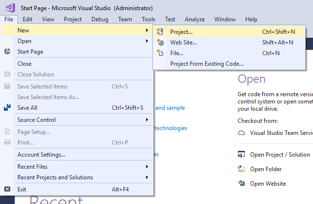

After selecting the project, a &quot;New Project&quot; dialog will open. Select .NET Core inside Visual C# menu from the left panel.

Then, select &ldquo;ASP.NET Core Web Application&rdquo; from available project types. Put the name of the project as&nbsp;<em>MVCDemoApp&nbsp;</em>and press OK. Refer to this image.

 

After clicking on OK, a new dialog will open asking to select the project template. You can observe two drop-down menus at the top left of the template window. Select &ldquo;.NET Core&rdquo; and &ldquo;ASP.NET Core 2.0&rdquo;
 from these dropdowns. Then, select &ldquo;Web application(Model-View-Controller)&rdquo; template and press OK.

Now our project will open. You can observe that we have Models, Views and Controllers folders already created. We will be adding our files to these folders only.

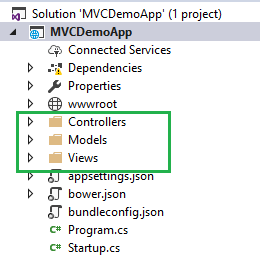

<h1>Adding the Controller to the Application</h1>

Right click on Controllers folder and select Add &gt;&gt; New Item

An &ldquo;Add New Item&rdquo; dialog box will open. Select Web from the left panel, then select &ldquo;MVC Controller Class&rdquo; from templates panel, and put the name as&nbsp;<em style="font-size:small">EmployeeController.cs</em>.
 Press OK.

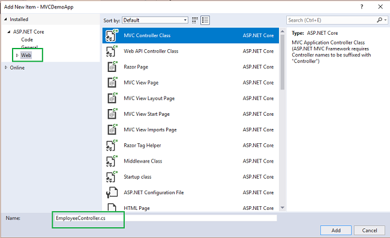

Now our EmployeeController has been created. We will put all our business logic in this controller.

<h1>Adding the Model to the Application</h1>

Right click on Models folder and select Add &gt;&gt; Class. Name your class Employee.cs. This class will contain our Employee model properties. 
Add one more class file to Models folder. Name it as EmployeeDataAccessLayer.cs . This class will contain our Database related operations. 
Now, the Models folder has the following structure.

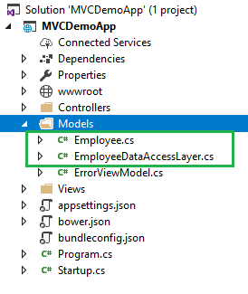

Open&nbsp;<em>Employee.cs</em>&nbsp;and put the following code in it. Since we are adding the required validators to the fields of Employee class, so we need to use <a class="libraryLink" href="https://msdn.microsoft.com/en-US/library/System.ComponentModel.DataAnnotations.aspx" target="_blank" title="Auto generated link to System.ComponentModel.DataAnnotations">System.ComponentModel.DataAnnotations</a> at the top.

C#

Edit|Remove

csharp

<pre class="csharp">using&nbsp;System;&nbsp;&nbsp;&nbsp;
using&nbsp;<a class="libraryLink" href="https://msdn.microsoft.com/en-US/library/System.Collections.Generic.aspx" target="_blank" title="Auto generated link to System.Collections.Generic">System.Collections.Generic</a>;&nbsp;&nbsp;&nbsp;
using&nbsp;<a class="libraryLink" href="https://msdn.microsoft.com/en-US/library/System.ComponentModel.DataAnnotations.aspx" target="_blank" title="Auto generated link to System.ComponentModel.DataAnnotations">System.ComponentModel.DataAnnotations</a>;&nbsp;&nbsp;&nbsp;
using&nbsp;<a class="libraryLink" href="https://msdn.microsoft.com/en-US/library/System.Linq.aspx" target="_blank" title="Auto generated link to System.Linq">System.Linq</a>;&nbsp;&nbsp;&nbsp;
using&nbsp;<a class="libraryLink" href="https://msdn.microsoft.com/en-US/library/System.Threading.Tasks.aspx" target="_blank" title="Auto generated link to System.Threading.Tasks">System.Threading.Tasks</a>;&nbsp;&nbsp;&nbsp;
&nbsp;&nbsp;&nbsp;
namespace&nbsp;MVCDemoApp.Models&nbsp;&nbsp;&nbsp;
{&nbsp;&nbsp;&nbsp;
&nbsp;&nbsp;&nbsp;&nbsp;public&nbsp;class&nbsp;Employee&nbsp;&nbsp;&nbsp;
&nbsp;&nbsp;&nbsp;&nbsp;{&nbsp;&nbsp;&nbsp;
&nbsp;&nbsp;&nbsp;&nbsp;&nbsp;&nbsp;&nbsp;&nbsp;public&nbsp;int&nbsp;ID&nbsp;{&nbsp;get;&nbsp;set;&nbsp;}&nbsp;&nbsp;&nbsp;
&nbsp;&nbsp;&nbsp;&nbsp;&nbsp;&nbsp;&nbsp;&nbsp;[Required]&nbsp;&nbsp;&nbsp;
&nbsp;&nbsp;&nbsp;&nbsp;&nbsp;&nbsp;&nbsp;&nbsp;public&nbsp;string&nbsp;Name&nbsp;{&nbsp;get;&nbsp;set;&nbsp;}&nbsp;&nbsp;&nbsp;
&nbsp;&nbsp;&nbsp;&nbsp;&nbsp;&nbsp;&nbsp;&nbsp;[Required]&nbsp;&nbsp;&nbsp;
&nbsp;&nbsp;&nbsp;&nbsp;&nbsp;&nbsp;&nbsp;&nbsp;public&nbsp;string&nbsp;Gender&nbsp;{&nbsp;get;&nbsp;set;&nbsp;}&nbsp;&nbsp;&nbsp;
&nbsp;&nbsp;&nbsp;&nbsp;&nbsp;&nbsp;&nbsp;&nbsp;[Required]&nbsp;&nbsp;&nbsp;
&nbsp;&nbsp;&nbsp;&nbsp;&nbsp;&nbsp;&nbsp;&nbsp;public&nbsp;string&nbsp;Department&nbsp;{&nbsp;get;&nbsp;set;&nbsp;}&nbsp;&nbsp;&nbsp;
&nbsp;&nbsp;&nbsp;&nbsp;&nbsp;&nbsp;&nbsp;&nbsp;[Required]&nbsp;&nbsp;&nbsp;
&nbsp;&nbsp;&nbsp;&nbsp;&nbsp;&nbsp;&nbsp;&nbsp;public&nbsp;string&nbsp;City&nbsp;{&nbsp;get;&nbsp;set;&nbsp;}&nbsp;&nbsp;&nbsp;
&nbsp;&nbsp;&nbsp;&nbsp;}&nbsp;&nbsp;&nbsp;
}&nbsp;</pre>

Open&nbsp;<em style="font-size:small">EmployeeDataAccessLayer.cs&nbsp;</em>and put the following code to handle database operations. Make sure to put your connection
 string.

 

C#

Edit|Remove

csharp

<pre class="csharp">using&nbsp;System;&nbsp;&nbsp;&nbsp;
using&nbsp;<a class="libraryLink" href="https://msdn.microsoft.com/en-US/library/System.Collections.Generic.aspx" target="_blank" title="Auto generated link to System.Collections.Generic">System.Collections.Generic</a>;&nbsp;&nbsp;&nbsp;
using&nbsp;<a class="libraryLink" href="https://msdn.microsoft.com/en-US/library/System.Data.aspx" target="_blank" title="Auto generated link to System.Data">System.Data</a>;&nbsp;&nbsp;&nbsp;
using&nbsp;<a class="libraryLink" href="https://msdn.microsoft.com/en-US/library/System.Data.SqlClient.aspx" target="_blank" title="Auto generated link to System.Data.SqlClient">System.Data.SqlClient</a>;&nbsp;&nbsp;&nbsp;
using&nbsp;<a class="libraryLink" href="https://msdn.microsoft.com/en-US/library/System.Linq.aspx" target="_blank" title="Auto generated link to System.Linq">System.Linq</a>;&nbsp;&nbsp;&nbsp;
using&nbsp;<a class="libraryLink" href="https://msdn.microsoft.com/en-US/library/System.Threading.Tasks.aspx" target="_blank" title="Auto generated link to System.Threading.Tasks">System.Threading.Tasks</a>;&nbsp;&nbsp;&nbsp;
&nbsp;&nbsp;&nbsp;
namespace&nbsp;MVCDemoApp.Models&nbsp;&nbsp;&nbsp;
{&nbsp;&nbsp;&nbsp;
&nbsp;&nbsp;&nbsp;&nbsp;publicclass&nbsp;EmployeeDataAccessLayer&nbsp;&nbsp;&nbsp;
&nbsp;&nbsp;&nbsp;&nbsp;{&nbsp;&nbsp;&nbsp;
&nbsp;&nbsp;&nbsp;&nbsp;&nbsp;&nbsp;&nbsp;&nbsp;string&nbsp;connectionString&nbsp;=&nbsp;&quot;Put&nbsp;Your&nbsp;Connection&nbsp;string&nbsp;here&quot;;&nbsp;&nbsp;&nbsp;
&nbsp;&nbsp;&nbsp;
&nbsp;&nbsp;&nbsp;&nbsp;&nbsp;&nbsp;&nbsp;&nbsp;//To&nbsp;View&nbsp;all&nbsp;employees&nbsp;details&nbsp;&nbsp;&nbsp;&nbsp;public&nbsp;IEnumerable&lt;Employee&gt;&nbsp;GetAllEmployees()&nbsp;&nbsp;&nbsp;
&nbsp;&nbsp;&nbsp;&nbsp;&nbsp;&nbsp;&nbsp;&nbsp;{&nbsp;&nbsp;&nbsp;
&nbsp;&nbsp;&nbsp;&nbsp;&nbsp;&nbsp;&nbsp;&nbsp;&nbsp;&nbsp;&nbsp;&nbsp;List&lt;Employee&gt;&nbsp;lstemployee&nbsp;=&nbsp;new&nbsp;List&lt;Employee&gt;();&nbsp;&nbsp;&nbsp;
&nbsp;&nbsp;&nbsp;
&nbsp;&nbsp;&nbsp;&nbsp;&nbsp;&nbsp;&nbsp;&nbsp;&nbsp;&nbsp;&nbsp;&nbsp;using&nbsp;(SqlConnection&nbsp;con&nbsp;=&nbsp;new&nbsp;SqlConnection(connectionString))&nbsp;&nbsp;&nbsp;
&nbsp;&nbsp;&nbsp;&nbsp;&nbsp;&nbsp;&nbsp;&nbsp;&nbsp;&nbsp;&nbsp;&nbsp;{&nbsp;&nbsp;&nbsp;
&nbsp;&nbsp;&nbsp;&nbsp;&nbsp;&nbsp;&nbsp;&nbsp;&nbsp;&nbsp;&nbsp;&nbsp;&nbsp;&nbsp;&nbsp;&nbsp;SqlCommand&nbsp;cmd&nbsp;=&nbsp;new&nbsp;SqlCommand(&quot;spGetAllEmployees&quot;,&nbsp;con);&nbsp;&nbsp;&nbsp;
&nbsp;&nbsp;&nbsp;&nbsp;&nbsp;&nbsp;&nbsp;&nbsp;&nbsp;&nbsp;&nbsp;&nbsp;&nbsp;&nbsp;&nbsp;&nbsp;cmd.CommandType&nbsp;=&nbsp;CommandType.StoredProcedure;&nbsp;&nbsp;&nbsp;
&nbsp;&nbsp;&nbsp;
&nbsp;&nbsp;&nbsp;&nbsp;&nbsp;&nbsp;&nbsp;&nbsp;&nbsp;&nbsp;&nbsp;&nbsp;&nbsp;&nbsp;&nbsp;&nbsp;con.Open();&nbsp;&nbsp;&nbsp;
&nbsp;&nbsp;&nbsp;&nbsp;&nbsp;&nbsp;&nbsp;&nbsp;&nbsp;&nbsp;&nbsp;&nbsp;&nbsp;&nbsp;&nbsp;&nbsp;SqlDataReader&nbsp;rdr&nbsp;=&nbsp;cmd.ExecuteReader();&nbsp;&nbsp;&nbsp;
&nbsp;&nbsp;&nbsp;
&nbsp;&nbsp;&nbsp;&nbsp;&nbsp;&nbsp;&nbsp;&nbsp;&nbsp;&nbsp;&nbsp;&nbsp;&nbsp;&nbsp;&nbsp;&nbsp;while&nbsp;(rdr.Read())&nbsp;&nbsp;&nbsp;
&nbsp;&nbsp;&nbsp;&nbsp;&nbsp;&nbsp;&nbsp;&nbsp;&nbsp;&nbsp;&nbsp;&nbsp;&nbsp;&nbsp;&nbsp;&nbsp;{&nbsp;&nbsp;&nbsp;
&nbsp;&nbsp;&nbsp;&nbsp;&nbsp;&nbsp;&nbsp;&nbsp;&nbsp;&nbsp;&nbsp;&nbsp;&nbsp;&nbsp;&nbsp;&nbsp;&nbsp;&nbsp;&nbsp;&nbsp;Employee&nbsp;employee&nbsp;=&nbsp;new&nbsp;Employee();&nbsp;&nbsp;&nbsp;
&nbsp;&nbsp;&nbsp;
&nbsp;&nbsp;&nbsp;&nbsp;&nbsp;&nbsp;&nbsp;&nbsp;&nbsp;&nbsp;&nbsp;&nbsp;&nbsp;&nbsp;&nbsp;&nbsp;&nbsp;&nbsp;&nbsp;&nbsp;employee.ID&nbsp;=&nbsp;Convert.ToInt32(rdr[&quot;EmployeeID&quot;]);&nbsp;&nbsp;&nbsp;
&nbsp;&nbsp;&nbsp;&nbsp;&nbsp;&nbsp;&nbsp;&nbsp;&nbsp;&nbsp;&nbsp;&nbsp;&nbsp;&nbsp;&nbsp;&nbsp;&nbsp;&nbsp;&nbsp;&nbsp;employee.Name&nbsp;=&nbsp;rdr[&quot;Name&quot;].ToString();&nbsp;&nbsp;&nbsp;
&nbsp;&nbsp;&nbsp;&nbsp;&nbsp;&nbsp;&nbsp;&nbsp;&nbsp;&nbsp;&nbsp;&nbsp;&nbsp;&nbsp;&nbsp;&nbsp;&nbsp;&nbsp;&nbsp;&nbsp;employee.Gender&nbsp;=&nbsp;rdr[&quot;Gender&quot;].ToString();&nbsp;&nbsp;&nbsp;
&nbsp;&nbsp;&nbsp;&nbsp;&nbsp;&nbsp;&nbsp;&nbsp;&nbsp;&nbsp;&nbsp;&nbsp;&nbsp;&nbsp;&nbsp;&nbsp;&nbsp;&nbsp;&nbsp;&nbsp;employee.Department&nbsp;=&nbsp;rdr[&quot;Department&quot;].ToString();&nbsp;&nbsp;&nbsp;
&nbsp;&nbsp;&nbsp;&nbsp;&nbsp;&nbsp;&nbsp;&nbsp;&nbsp;&nbsp;&nbsp;&nbsp;&nbsp;&nbsp;&nbsp;&nbsp;&nbsp;&nbsp;&nbsp;&nbsp;employee.City&nbsp;=&nbsp;rdr[&quot;City&quot;].ToString();&nbsp;&nbsp;&nbsp;
&nbsp;&nbsp;&nbsp;
&nbsp;&nbsp;&nbsp;&nbsp;&nbsp;&nbsp;&nbsp;&nbsp;&nbsp;&nbsp;&nbsp;&nbsp;&nbsp;&nbsp;&nbsp;&nbsp;&nbsp;&nbsp;&nbsp;&nbsp;lstemployee.Add(employee);&nbsp;&nbsp;&nbsp;
&nbsp;&nbsp;&nbsp;&nbsp;&nbsp;&nbsp;&nbsp;&nbsp;&nbsp;&nbsp;&nbsp;&nbsp;&nbsp;&nbsp;&nbsp;&nbsp;}&nbsp;&nbsp;&nbsp;
&nbsp;&nbsp;&nbsp;&nbsp;&nbsp;&nbsp;&nbsp;&nbsp;&nbsp;&nbsp;&nbsp;&nbsp;&nbsp;&nbsp;&nbsp;&nbsp;con.Close();&nbsp;&nbsp;&nbsp;
&nbsp;&nbsp;&nbsp;&nbsp;&nbsp;&nbsp;&nbsp;&nbsp;&nbsp;&nbsp;&nbsp;&nbsp;}&nbsp;&nbsp;&nbsp;
&nbsp;&nbsp;&nbsp;&nbsp;&nbsp;&nbsp;&nbsp;&nbsp;&nbsp;&nbsp;&nbsp;&nbsp;return&nbsp;lstemployee;&nbsp;&nbsp;&nbsp;
&nbsp;&nbsp;&nbsp;&nbsp;&nbsp;&nbsp;&nbsp;&nbsp;}&nbsp;&nbsp;&nbsp;
&nbsp;&nbsp;&nbsp;
&nbsp;&nbsp;&nbsp;&nbsp;&nbsp;&nbsp;&nbsp;&nbsp;//To&nbsp;Add&nbsp;new&nbsp;employee&nbsp;record&nbsp;&nbsp;&nbsp;&nbsp;publicvoid&nbsp;AddEmployee(Employee&nbsp;employee)&nbsp;&nbsp;&nbsp;
&nbsp;&nbsp;&nbsp;&nbsp;&nbsp;&nbsp;&nbsp;&nbsp;{&nbsp;&nbsp;&nbsp;
&nbsp;&nbsp;&nbsp;&nbsp;&nbsp;&nbsp;&nbsp;&nbsp;&nbsp;&nbsp;&nbsp;&nbsp;using&nbsp;(SqlConnection&nbsp;con&nbsp;=&nbsp;new&nbsp;SqlConnection(connectionString))&nbsp;&nbsp;&nbsp;
&nbsp;&nbsp;&nbsp;&nbsp;&nbsp;&nbsp;&nbsp;&nbsp;&nbsp;&nbsp;&nbsp;&nbsp;{&nbsp;&nbsp;&nbsp;
&nbsp;&nbsp;&nbsp;&nbsp;&nbsp;&nbsp;&nbsp;&nbsp;&nbsp;&nbsp;&nbsp;&nbsp;&nbsp;&nbsp;&nbsp;&nbsp;SqlCommand&nbsp;cmd&nbsp;=&nbsp;new&nbsp;SqlCommand(&quot;spAddEmployee&quot;,&nbsp;con);&nbsp;&nbsp;&nbsp;
&nbsp;&nbsp;&nbsp;&nbsp;&nbsp;&nbsp;&nbsp;&nbsp;&nbsp;&nbsp;&nbsp;&nbsp;&nbsp;&nbsp;&nbsp;&nbsp;cmd.CommandType&nbsp;=&nbsp;CommandType.StoredProcedure;&nbsp;&nbsp;&nbsp;
&nbsp;&nbsp;&nbsp;
&nbsp;&nbsp;&nbsp;&nbsp;&nbsp;&nbsp;&nbsp;&nbsp;&nbsp;&nbsp;&nbsp;&nbsp;&nbsp;&nbsp;&nbsp;&nbsp;cmd.Parameters.AddWithValue(&quot;@Name&quot;,&nbsp;employee.Name);&nbsp;&nbsp;&nbsp;
&nbsp;&nbsp;&nbsp;&nbsp;&nbsp;&nbsp;&nbsp;&nbsp;&nbsp;&nbsp;&nbsp;&nbsp;&nbsp;&nbsp;&nbsp;&nbsp;cmd.Parameters.AddWithValue(&quot;@Gender&quot;,&nbsp;employee.Gender);&nbsp;&nbsp;&nbsp;
&nbsp;&nbsp;&nbsp;&nbsp;&nbsp;&nbsp;&nbsp;&nbsp;&nbsp;&nbsp;&nbsp;&nbsp;&nbsp;&nbsp;&nbsp;&nbsp;cmd.Parameters.AddWithValue(&quot;@Department&quot;,&nbsp;employee.Department);&nbsp;&nbsp;&nbsp;
&nbsp;&nbsp;&nbsp;&nbsp;&nbsp;&nbsp;&nbsp;&nbsp;&nbsp;&nbsp;&nbsp;&nbsp;&nbsp;&nbsp;&nbsp;&nbsp;cmd.Parameters.AddWithValue(&quot;@City&quot;,&nbsp;employee.City);&nbsp;&nbsp;&nbsp;
&nbsp;&nbsp;&nbsp;
&nbsp;&nbsp;&nbsp;&nbsp;&nbsp;&nbsp;&nbsp;&nbsp;&nbsp;&nbsp;&nbsp;&nbsp;&nbsp;&nbsp;&nbsp;&nbsp;con.Open();&nbsp;&nbsp;&nbsp;
&nbsp;&nbsp;&nbsp;&nbsp;&nbsp;&nbsp;&nbsp;&nbsp;&nbsp;&nbsp;&nbsp;&nbsp;&nbsp;&nbsp;&nbsp;&nbsp;cmd.ExecuteNonQuery();&nbsp;&nbsp;&nbsp;
&nbsp;&nbsp;&nbsp;&nbsp;&nbsp;&nbsp;&nbsp;&nbsp;&nbsp;&nbsp;&nbsp;&nbsp;&nbsp;&nbsp;&nbsp;&nbsp;con.Close();&nbsp;&nbsp;&nbsp;
&nbsp;&nbsp;&nbsp;&nbsp;&nbsp;&nbsp;&nbsp;&nbsp;&nbsp;&nbsp;&nbsp;&nbsp;}&nbsp;&nbsp;&nbsp;
&nbsp;&nbsp;&nbsp;&nbsp;&nbsp;&nbsp;&nbsp;&nbsp;}&nbsp;&nbsp;&nbsp;
&nbsp;&nbsp;&nbsp;
&nbsp;&nbsp;&nbsp;&nbsp;&nbsp;&nbsp;&nbsp;&nbsp;//To&nbsp;Update&nbsp;the&nbsp;records&nbsp;of&nbsp;a&nbsp;particluar&nbsp;employee&nbsp;&nbsp;publicvoid&nbsp;UpdateEmployee(Employee&nbsp;employee)&nbsp;&nbsp;&nbsp;
&nbsp;&nbsp;&nbsp;&nbsp;&nbsp;&nbsp;&nbsp;&nbsp;{&nbsp;&nbsp;&nbsp;
&nbsp;&nbsp;&nbsp;&nbsp;&nbsp;&nbsp;&nbsp;&nbsp;&nbsp;&nbsp;&nbsp;&nbsp;using&nbsp;(SqlConnection&nbsp;con&nbsp;=&nbsp;new&nbsp;SqlConnection(connectionString))&nbsp;&nbsp;&nbsp;
&nbsp;&nbsp;&nbsp;&nbsp;&nbsp;&nbsp;&nbsp;&nbsp;&nbsp;&nbsp;&nbsp;&nbsp;{&nbsp;&nbsp;&nbsp;
&nbsp;&nbsp;&nbsp;&nbsp;&nbsp;&nbsp;&nbsp;&nbsp;&nbsp;&nbsp;&nbsp;&nbsp;&nbsp;&nbsp;&nbsp;&nbsp;SqlCommand&nbsp;cmd&nbsp;=&nbsp;new&nbsp;SqlCommand(&quot;spUpdateEmployee&quot;,&nbsp;con);&nbsp;&nbsp;&nbsp;
&nbsp;&nbsp;&nbsp;&nbsp;&nbsp;&nbsp;&nbsp;&nbsp;&nbsp;&nbsp;&nbsp;&nbsp;&nbsp;&nbsp;&nbsp;&nbsp;cmd.CommandType&nbsp;=&nbsp;CommandType.StoredProcedure;&nbsp;&nbsp;&nbsp;
&nbsp;&nbsp;&nbsp;
&nbsp;&nbsp;&nbsp;&nbsp;&nbsp;&nbsp;&nbsp;&nbsp;&nbsp;&nbsp;&nbsp;&nbsp;&nbsp;&nbsp;&nbsp;&nbsp;cmd.Parameters.AddWithValue(&quot;@EmpId&quot;,&nbsp;employee.ID);&nbsp;&nbsp;&nbsp;
&nbsp;&nbsp;&nbsp;&nbsp;&nbsp;&nbsp;&nbsp;&nbsp;&nbsp;&nbsp;&nbsp;&nbsp;&nbsp;&nbsp;&nbsp;&nbsp;cmd.Parameters.AddWithValue(&quot;@Name&quot;,&nbsp;employee.Name);&nbsp;&nbsp;&nbsp;
&nbsp;&nbsp;&nbsp;&nbsp;&nbsp;&nbsp;&nbsp;&nbsp;&nbsp;&nbsp;&nbsp;&nbsp;&nbsp;&nbsp;&nbsp;&nbsp;cmd.Parameters.AddWithValue(&quot;@Gender&quot;,&nbsp;employee.Gender);&nbsp;&nbsp;&nbsp;
&nbsp;&nbsp;&nbsp;&nbsp;&nbsp;&nbsp;&nbsp;&nbsp;&nbsp;&nbsp;&nbsp;&nbsp;&nbsp;&nbsp;&nbsp;&nbsp;cmd.Parameters.AddWithValue(&quot;@Department&quot;,&nbsp;employee.Department);&nbsp;&nbsp;&nbsp;
&nbsp;&nbsp;&nbsp;&nbsp;&nbsp;&nbsp;&nbsp;&nbsp;&nbsp;&nbsp;&nbsp;&nbsp;&nbsp;&nbsp;&nbsp;&nbsp;cmd.Parameters.AddWithValue(&quot;@City&quot;,&nbsp;employee.City);&nbsp;&nbsp;&nbsp;
&nbsp;&nbsp;&nbsp;
&nbsp;&nbsp;&nbsp;&nbsp;&nbsp;&nbsp;&nbsp;&nbsp;&nbsp;&nbsp;&nbsp;&nbsp;&nbsp;&nbsp;&nbsp;&nbsp;con.Open();&nbsp;&nbsp;&nbsp;
&nbsp;&nbsp;&nbsp;&nbsp;&nbsp;&nbsp;&nbsp;&nbsp;&nbsp;&nbsp;&nbsp;&nbsp;&nbsp;&nbsp;&nbsp;&nbsp;cmd.ExecuteNonQuery();&nbsp;&nbsp;&nbsp;
&nbsp;&nbsp;&nbsp;&nbsp;&nbsp;&nbsp;&nbsp;&nbsp;&nbsp;&nbsp;&nbsp;&nbsp;&nbsp;&nbsp;&nbsp;&nbsp;con.Close();&nbsp;&nbsp;&nbsp;
&nbsp;&nbsp;&nbsp;&nbsp;&nbsp;&nbsp;&nbsp;&nbsp;&nbsp;&nbsp;&nbsp;&nbsp;}&nbsp;&nbsp;&nbsp;
&nbsp;&nbsp;&nbsp;&nbsp;&nbsp;&nbsp;&nbsp;&nbsp;}&nbsp;&nbsp;&nbsp;
&nbsp;&nbsp;&nbsp;
&nbsp;&nbsp;&nbsp;&nbsp;&nbsp;&nbsp;&nbsp;&nbsp;//Get&nbsp;the&nbsp;details&nbsp;of&nbsp;a&nbsp;particular&nbsp;employee&nbsp;&nbsp;public&nbsp;Employee&nbsp;GetEmployeeData(int?&nbsp;id)&nbsp;&nbsp;&nbsp;
&nbsp;&nbsp;&nbsp;&nbsp;&nbsp;&nbsp;&nbsp;&nbsp;{&nbsp;&nbsp;&nbsp;
&nbsp;&nbsp;&nbsp;&nbsp;&nbsp;&nbsp;&nbsp;&nbsp;&nbsp;&nbsp;&nbsp;&nbsp;Employee&nbsp;employee&nbsp;=&nbsp;new&nbsp;Employee();&nbsp;&nbsp;&nbsp;
&nbsp;&nbsp;&nbsp;
&nbsp;&nbsp;&nbsp;&nbsp;&nbsp;&nbsp;&nbsp;&nbsp;&nbsp;&nbsp;&nbsp;&nbsp;using&nbsp;(SqlConnection&nbsp;con&nbsp;=&nbsp;new&nbsp;SqlConnection(connectionString))&nbsp;&nbsp;&nbsp;
&nbsp;&nbsp;&nbsp;&nbsp;&nbsp;&nbsp;&nbsp;&nbsp;&nbsp;&nbsp;&nbsp;&nbsp;{&nbsp;&nbsp;&nbsp;
&nbsp;&nbsp;&nbsp;&nbsp;&nbsp;&nbsp;&nbsp;&nbsp;&nbsp;&nbsp;&nbsp;&nbsp;&nbsp;&nbsp;&nbsp;&nbsp;string&nbsp;sqlQuery&nbsp;=&nbsp;&quot;SELECT&nbsp;*&nbsp;FROM&nbsp;tblEmployee&nbsp;WHERE&nbsp;EmployeeID=&nbsp;&quot;&nbsp;&#43;&nbsp;id;&nbsp;&nbsp;&nbsp;
&nbsp;&nbsp;&nbsp;&nbsp;&nbsp;&nbsp;&nbsp;&nbsp;&nbsp;&nbsp;&nbsp;&nbsp;&nbsp;&nbsp;&nbsp;&nbsp;SqlCommand&nbsp;cmd&nbsp;=&nbsp;new&nbsp;SqlCommand(sqlQuery,&nbsp;con);&nbsp;&nbsp;&nbsp;
&nbsp;&nbsp;&nbsp;
&nbsp;&nbsp;&nbsp;&nbsp;&nbsp;&nbsp;&nbsp;&nbsp;&nbsp;&nbsp;&nbsp;&nbsp;&nbsp;&nbsp;&nbsp;&nbsp;con.Open();&nbsp;&nbsp;&nbsp;
&nbsp;&nbsp;&nbsp;&nbsp;&nbsp;&nbsp;&nbsp;&nbsp;&nbsp;&nbsp;&nbsp;&nbsp;&nbsp;&nbsp;&nbsp;&nbsp;SqlDataReader&nbsp;rdr&nbsp;=&nbsp;cmd.ExecuteReader();&nbsp;&nbsp;&nbsp;
&nbsp;&nbsp;&nbsp;
&nbsp;&nbsp;&nbsp;&nbsp;&nbsp;&nbsp;&nbsp;&nbsp;&nbsp;&nbsp;&nbsp;&nbsp;&nbsp;&nbsp;&nbsp;&nbsp;while&nbsp;(rdr.Read())&nbsp;&nbsp;&nbsp;
&nbsp;&nbsp;&nbsp;&nbsp;&nbsp;&nbsp;&nbsp;&nbsp;&nbsp;&nbsp;&nbsp;&nbsp;&nbsp;&nbsp;&nbsp;&nbsp;{&nbsp;&nbsp;&nbsp;
&nbsp;&nbsp;&nbsp;&nbsp;&nbsp;&nbsp;&nbsp;&nbsp;&nbsp;&nbsp;&nbsp;&nbsp;&nbsp;&nbsp;&nbsp;&nbsp;&nbsp;&nbsp;&nbsp;&nbsp;employee.ID&nbsp;=&nbsp;Convert.ToInt32(rdr[&quot;EmployeeID&quot;]);&nbsp;&nbsp;&nbsp;
&nbsp;&nbsp;&nbsp;&nbsp;&nbsp;&nbsp;&nbsp;&nbsp;&nbsp;&nbsp;&nbsp;&nbsp;&nbsp;&nbsp;&nbsp;&nbsp;&nbsp;&nbsp;&nbsp;&nbsp;employee.Name&nbsp;=&nbsp;rdr[&quot;Name&quot;].ToString();&nbsp;&nbsp;&nbsp;
&nbsp;&nbsp;&nbsp;&nbsp;&nbsp;&nbsp;&nbsp;&nbsp;&nbsp;&nbsp;&nbsp;&nbsp;&nbsp;&nbsp;&nbsp;&nbsp;&nbsp;&nbsp;&nbsp;&nbsp;employee.Gender&nbsp;=&nbsp;rdr[&quot;Gender&quot;].ToString();&nbsp;&nbsp;&nbsp;
&nbsp;&nbsp;&nbsp;&nbsp;&nbsp;&nbsp;&nbsp;&nbsp;&nbsp;&nbsp;&nbsp;&nbsp;&nbsp;&nbsp;&nbsp;&nbsp;&nbsp;&nbsp;&nbsp;&nbsp;employee.Department&nbsp;=&nbsp;rdr[&quot;Department&quot;].ToString();&nbsp;&nbsp;&nbsp;
&nbsp;&nbsp;&nbsp;&nbsp;&nbsp;&nbsp;&nbsp;&nbsp;&nbsp;&nbsp;&nbsp;&nbsp;&nbsp;&nbsp;&nbsp;&nbsp;&nbsp;&nbsp;&nbsp;&nbsp;employee.City&nbsp;=&nbsp;rdr[&quot;City&quot;].ToString();&nbsp;&nbsp;&nbsp;
&nbsp;&nbsp;&nbsp;&nbsp;&nbsp;&nbsp;&nbsp;&nbsp;&nbsp;&nbsp;&nbsp;&nbsp;&nbsp;&nbsp;&nbsp;&nbsp;}&nbsp;&nbsp;&nbsp;
&nbsp;&nbsp;&nbsp;&nbsp;&nbsp;&nbsp;&nbsp;&nbsp;&nbsp;&nbsp;&nbsp;&nbsp;}&nbsp;&nbsp;&nbsp;
&nbsp;&nbsp;&nbsp;&nbsp;&nbsp;&nbsp;&nbsp;&nbsp;&nbsp;&nbsp;&nbsp;&nbsp;return&nbsp;employee;&nbsp;&nbsp;&nbsp;
&nbsp;&nbsp;&nbsp;&nbsp;&nbsp;&nbsp;&nbsp;&nbsp;}&nbsp;&nbsp;&nbsp;
&nbsp;&nbsp;&nbsp;
&nbsp;&nbsp;&nbsp;&nbsp;&nbsp;&nbsp;&nbsp;&nbsp;//To&nbsp;Delete&nbsp;the&nbsp;record&nbsp;on&nbsp;a&nbsp;particular&nbsp;employee&nbsp;&nbsp;publicvoid&nbsp;DeleteEmployee(int?&nbsp;id)&nbsp;&nbsp;&nbsp;
&nbsp;&nbsp;&nbsp;&nbsp;&nbsp;&nbsp;&nbsp;&nbsp;{&nbsp;&nbsp;&nbsp;
&nbsp;&nbsp;&nbsp;
&nbsp;&nbsp;&nbsp;&nbsp;&nbsp;&nbsp;&nbsp;&nbsp;&nbsp;&nbsp;&nbsp;&nbsp;using&nbsp;(SqlConnection&nbsp;con&nbsp;=&nbsp;new&nbsp;SqlConnection(connectionString))&nbsp;&nbsp;&nbsp;
&nbsp;&nbsp;&nbsp;&nbsp;&nbsp;&nbsp;&nbsp;&nbsp;&nbsp;&nbsp;&nbsp;&nbsp;{&nbsp;&nbsp;&nbsp;
&nbsp;&nbsp;&nbsp;&nbsp;&nbsp;&nbsp;&nbsp;&nbsp;&nbsp;&nbsp;&nbsp;&nbsp;&nbsp;&nbsp;&nbsp;&nbsp;SqlCommand&nbsp;cmd&nbsp;=&nbsp;new&nbsp;SqlCommand(&quot;spDeleteEmployee&quot;,&nbsp;con);&nbsp;&nbsp;&nbsp;
&nbsp;&nbsp;&nbsp;&nbsp;&nbsp;&nbsp;&nbsp;&nbsp;&nbsp;&nbsp;&nbsp;&nbsp;&nbsp;&nbsp;&nbsp;&nbsp;cmd.CommandType&nbsp;=&nbsp;CommandType.StoredProcedure;&nbsp;&nbsp;&nbsp;
&nbsp;&nbsp;&nbsp;
&nbsp;&nbsp;&nbsp;&nbsp;&nbsp;&nbsp;&nbsp;&nbsp;&nbsp;&nbsp;&nbsp;&nbsp;&nbsp;&nbsp;&nbsp;&nbsp;cmd.Parameters.AddWithValue(&quot;@EmpId&quot;,&nbsp;id);&nbsp;&nbsp;&nbsp;
&nbsp;&nbsp;&nbsp;
&nbsp;&nbsp;&nbsp;&nbsp;&nbsp;&nbsp;&nbsp;&nbsp;&nbsp;&nbsp;&nbsp;&nbsp;&nbsp;&nbsp;&nbsp;&nbsp;con.Open();&nbsp;&nbsp;&nbsp;
&nbsp;&nbsp;&nbsp;&nbsp;&nbsp;&nbsp;&nbsp;&nbsp;&nbsp;&nbsp;&nbsp;&nbsp;&nbsp;&nbsp;&nbsp;&nbsp;cmd.ExecuteNonQuery();&nbsp;&nbsp;&nbsp;
&nbsp;&nbsp;&nbsp;&nbsp;&nbsp;&nbsp;&nbsp;&nbsp;&nbsp;&nbsp;&nbsp;&nbsp;&nbsp;&nbsp;&nbsp;&nbsp;con.Close();&nbsp;&nbsp;&nbsp;
&nbsp;&nbsp;&nbsp;&nbsp;&nbsp;&nbsp;&nbsp;&nbsp;&nbsp;&nbsp;&nbsp;&nbsp;}&nbsp;&nbsp;&nbsp;
&nbsp;&nbsp;&nbsp;&nbsp;&nbsp;&nbsp;&nbsp;&nbsp;}&nbsp;&nbsp;&nbsp;
&nbsp;&nbsp;&nbsp;&nbsp;}&nbsp;&nbsp;&nbsp;
}&nbsp;&nbsp;</pre>

Now, we will proceed to create our Views.

<h1>Adding Views to the Application</h1>

To add views for our controller class, we need to create a folder inside&nbsp;<em>Views&nbsp;</em>folder with the same name as our controller and then add our views to that folder.

Right-click on the&nbsp;<em>Views&nbsp;</em>folder, and then Add &gt;&gt; New Folder and name the folder as&nbsp;<em>Employee</em>.

Now Right click on the&nbsp;<em style="font-size:small">Views/Employee</em>&nbsp;folder, and then select Add &gt;&gt; New Item.

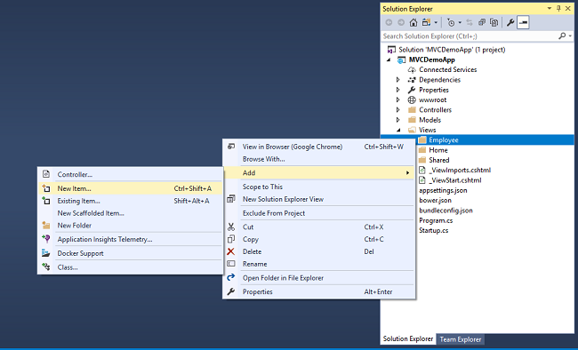

An &ldquo;Add New Item&rdquo; dialog box will open. Select Web from the left panel, then select &ldquo;MVC View Page&rdquo; from templates panel, and put the name as<em style="font-size:small">&nbsp;Index.cshtml</em>.
 Press OK.

Thus we have created our first view. Similarly add 4 more views in&nbsp;<em>Views/Employee</em>&nbsp;folder,&nbsp;<em>Create.cshtml, Delete.cshtml, Details.cshtml,&nbsp;</em>and&nbsp;<em>Edit.cshtml.</em>

Now, our&nbsp;<em>Views&nbsp;</em>folder will look like this

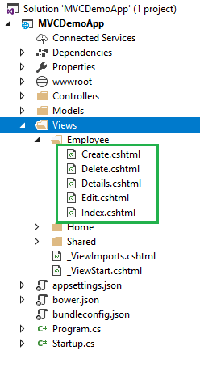

Since our Views has been created, we will put codes in View and Controller for performing CRUD operations.

<h2>Create View</h2>

This view will be used to Add new employee data to the database

Open&nbsp;<em>Create.cshtml&nbsp;</em>and put following code into it.

HTML

Edit|Remove

html

<pre class="html">@model&nbsp;MVCDemoApp.Models.Employee&nbsp;&nbsp;&nbsp;
&nbsp;&nbsp;&nbsp;
@{&nbsp;&nbsp;&nbsp;
&nbsp;&nbsp;&nbsp;&nbsp;ViewData[&quot;Title&quot;]&nbsp;=&nbsp;&quot;Create&quot;;&nbsp;&nbsp;&nbsp;
}&nbsp;&nbsp;&nbsp;
&lt;h2&gt;Create&lt;/h2&gt;&nbsp;&nbsp;&nbsp;
&lt;h4&gt;Employees&lt;/h4&gt;&nbsp;&nbsp;&nbsp;
&lt;hr&nbsp;/&gt;&nbsp;&nbsp;&nbsp;
&lt;div&nbsp;class=&quot;row&quot;&gt;&nbsp;&nbsp;&nbsp;
&nbsp;&nbsp;&nbsp;&nbsp;&lt;div&nbsp;class=&quot;col-md-4&quot;&gt;&nbsp;&nbsp;&nbsp;
&nbsp;&nbsp;&nbsp;&nbsp;&nbsp;&nbsp;&nbsp;&nbsp;&lt;form&nbsp;asp-action=&quot;Create&quot;&gt;&nbsp;&nbsp;&nbsp;
&nbsp;&nbsp;&nbsp;&nbsp;&nbsp;&nbsp;&nbsp;&nbsp;&nbsp;&nbsp;&nbsp;&nbsp;&lt;div&nbsp;asp-validation-summary=&quot;ModelOnly&quot;&nbsp;class=&quot;text-danger&quot;&gt;&lt;/div&gt;&nbsp;&nbsp;&nbsp;
&nbsp;&nbsp;&nbsp;&nbsp;&nbsp;&nbsp;&nbsp;&nbsp;&nbsp;&nbsp;&nbsp;&nbsp;&lt;div&nbsp;class=&quot;form-group&quot;&gt;&nbsp;&nbsp;&nbsp;
&nbsp;&nbsp;&nbsp;&nbsp;&nbsp;&nbsp;&nbsp;&nbsp;&nbsp;&nbsp;&nbsp;&nbsp;&nbsp;&nbsp;&nbsp;&nbsp;&lt;label&nbsp;asp-for=&quot;Name&quot;&nbsp;class=&quot;control-label&quot;&gt;&lt;/label&gt;&nbsp;&nbsp;&nbsp;
&nbsp;&nbsp;&nbsp;&nbsp;&nbsp;&nbsp;&nbsp;&nbsp;&nbsp;&nbsp;&nbsp;&nbsp;&nbsp;&nbsp;&nbsp;&nbsp;&lt;input&nbsp;asp-for=&quot;Name&quot;&nbsp;class=&quot;form-control&quot;&nbsp;/&gt;&nbsp;&nbsp;&nbsp;
&nbsp;&nbsp;&nbsp;&nbsp;&nbsp;&nbsp;&nbsp;&nbsp;&nbsp;&nbsp;&nbsp;&nbsp;&nbsp;&nbsp;&nbsp;&nbsp;&lt;span&nbsp;asp-validation-for=&quot;Name&quot;&nbsp;class=&quot;text-danger&quot;&gt;&lt;/span&gt;&nbsp;&nbsp;&nbsp;
&nbsp;&nbsp;&nbsp;&nbsp;&nbsp;&nbsp;&nbsp;&nbsp;&nbsp;&nbsp;&nbsp;&nbsp;&lt;/div&gt;&nbsp;&nbsp;&nbsp;
&nbsp;&nbsp;&nbsp;&nbsp;&nbsp;&nbsp;&nbsp;&nbsp;&nbsp;&nbsp;&nbsp;&nbsp;&lt;div&nbsp;class=&quot;form-group&quot;&gt;&nbsp;&nbsp;&nbsp;
&nbsp;&nbsp;&nbsp;&nbsp;&nbsp;&nbsp;&nbsp;&nbsp;&nbsp;&nbsp;&nbsp;&nbsp;&nbsp;&nbsp;&nbsp;&nbsp;&lt;label&nbsp;asp-for=&quot;Gender&quot;&nbsp;class=&quot;control-label&quot;&gt;&lt;/label&gt;&nbsp;&nbsp;&nbsp;
&nbsp;&nbsp;&nbsp;&nbsp;&nbsp;&nbsp;&nbsp;&nbsp;&nbsp;&nbsp;&nbsp;&nbsp;&nbsp;&nbsp;&nbsp;&nbsp;&lt;select&nbsp;asp-for=&quot;Gender&quot;&nbsp;class=&quot;form-control&quot;&gt;&nbsp;&nbsp;&nbsp;
&nbsp;&nbsp;&nbsp;&nbsp;&nbsp;&nbsp;&nbsp;&nbsp;&nbsp;&nbsp;&nbsp;&nbsp;&nbsp;&nbsp;&nbsp;&nbsp;&nbsp;&nbsp;&nbsp;&nbsp;&lt;option&nbsp;value=&quot;&quot;&gt;--&nbsp;Select&nbsp;Gender&nbsp;--&lt;/option&gt;&nbsp;&nbsp;&nbsp;
&nbsp;&nbsp;&nbsp;&nbsp;&nbsp;&nbsp;&nbsp;&nbsp;&nbsp;&nbsp;&nbsp;&nbsp;&nbsp;&nbsp;&nbsp;&nbsp;&nbsp;&nbsp;&nbsp;&nbsp;&lt;option&nbsp;value=&quot;Male&quot;&gt;Male&lt;/option&gt;&nbsp;&nbsp;&nbsp;
&nbsp;&nbsp;&nbsp;&nbsp;&nbsp;&nbsp;&nbsp;&nbsp;&nbsp;&nbsp;&nbsp;&nbsp;&nbsp;&nbsp;&nbsp;&nbsp;&nbsp;&nbsp;&nbsp;&nbsp;&lt;option&nbsp;value=&quot;Female&quot;&gt;Female&lt;/option&gt;&nbsp;&nbsp;&nbsp;
&nbsp;&nbsp;&nbsp;&nbsp;&nbsp;&nbsp;&nbsp;&nbsp;&nbsp;&nbsp;&nbsp;&nbsp;&nbsp;&nbsp;&nbsp;&nbsp;&lt;/select&gt;&nbsp;&nbsp;&nbsp;
&nbsp;&nbsp;&nbsp;&nbsp;&nbsp;&nbsp;&nbsp;&nbsp;&nbsp;&nbsp;&nbsp;&nbsp;&nbsp;&nbsp;&nbsp;&nbsp;&lt;span&nbsp;asp-validation-for=&quot;Gender&quot;&nbsp;class=&quot;text-danger&quot;&gt;&lt;/span&gt;&nbsp;&nbsp;&nbsp;
&nbsp;&nbsp;&nbsp;&nbsp;&nbsp;&nbsp;&nbsp;&nbsp;&nbsp;&nbsp;&nbsp;&nbsp;&lt;/div&gt;&nbsp;&nbsp;&nbsp;
&nbsp;&nbsp;&nbsp;&nbsp;&nbsp;&nbsp;&nbsp;&nbsp;&nbsp;&nbsp;&nbsp;&nbsp;&lt;div&nbsp;class=&quot;form-group&quot;&gt;&nbsp;&nbsp;&nbsp;
&nbsp;&nbsp;&nbsp;&nbsp;&nbsp;&nbsp;&nbsp;&nbsp;&nbsp;&nbsp;&nbsp;&nbsp;&nbsp;&nbsp;&nbsp;&nbsp;&lt;label&nbsp;asp-for=&quot;Department&quot;&nbsp;class=&quot;control-label&quot;&gt;&lt;/label&gt;&nbsp;&nbsp;&nbsp;
&nbsp;&nbsp;&nbsp;&nbsp;&nbsp;&nbsp;&nbsp;&nbsp;&nbsp;&nbsp;&nbsp;&nbsp;&nbsp;&nbsp;&nbsp;&nbsp;&lt;input&nbsp;asp-for=&quot;Department&quot;&nbsp;class=&quot;form-control&quot;&nbsp;/&gt;&nbsp;&nbsp;&nbsp;
&nbsp;&nbsp;&nbsp;&nbsp;&nbsp;&nbsp;&nbsp;&nbsp;&nbsp;&nbsp;&nbsp;&nbsp;&nbsp;&nbsp;&nbsp;&nbsp;&lt;span&nbsp;asp-validation-for=&quot;Department&quot;&nbsp;class=&quot;text-danger&quot;&gt;&lt;/span&gt;&nbsp;&nbsp;&nbsp;
&nbsp;&nbsp;&nbsp;&nbsp;&nbsp;&nbsp;&nbsp;&nbsp;&nbsp;&nbsp;&nbsp;&nbsp;&lt;/div&gt;&nbsp;&nbsp;&nbsp;
&nbsp;&nbsp;&nbsp;&nbsp;&nbsp;&nbsp;&nbsp;&nbsp;&nbsp;&nbsp;&nbsp;&nbsp;&lt;div&nbsp;class=&quot;form-group&quot;&gt;&nbsp;&nbsp;&nbsp;
&nbsp;&nbsp;&nbsp;&nbsp;&nbsp;&nbsp;&nbsp;&nbsp;&nbsp;&nbsp;&nbsp;&nbsp;&nbsp;&nbsp;&nbsp;&nbsp;&lt;label&nbsp;asp-for=&quot;City&quot;&nbsp;class=&quot;control-label&quot;&gt;&lt;/label&gt;&nbsp;&nbsp;&nbsp;
&nbsp;&nbsp;&nbsp;&nbsp;&nbsp;&nbsp;&nbsp;&nbsp;&nbsp;&nbsp;&nbsp;&nbsp;&nbsp;&nbsp;&nbsp;&nbsp;&lt;input&nbsp;asp-for=&quot;City&quot;&nbsp;class=&quot;form-control&quot;&nbsp;/&gt;&nbsp;&nbsp;&nbsp;
&nbsp;&nbsp;&nbsp;&nbsp;&nbsp;&nbsp;&nbsp;&nbsp;&nbsp;&nbsp;&nbsp;&nbsp;&nbsp;&nbsp;&nbsp;&nbsp;&lt;span&nbsp;asp-validation-for=&quot;City&quot;&nbsp;class=&quot;text-danger&quot;&gt;&lt;/span&gt;&nbsp;&nbsp;&nbsp;
&nbsp;&nbsp;&nbsp;&nbsp;&nbsp;&nbsp;&nbsp;&nbsp;&nbsp;&nbsp;&nbsp;&nbsp;&lt;/div&gt;&nbsp;&nbsp;&nbsp;
&nbsp;&nbsp;&nbsp;&nbsp;&nbsp;&nbsp;&nbsp;&nbsp;&nbsp;&nbsp;&nbsp;&nbsp;&lt;div&nbsp;class=&quot;form-group&quot;&gt;&nbsp;&nbsp;&nbsp;
&nbsp;&nbsp;&nbsp;&nbsp;&nbsp;&nbsp;&nbsp;&nbsp;&nbsp;&nbsp;&nbsp;&nbsp;&nbsp;&nbsp;&nbsp;&nbsp;&lt;input&nbsp;type=&quot;submit&quot;&nbsp;value=&quot;Create&quot;&nbsp;class=&quot;btn&nbsp;btn-default&quot;&nbsp;/&gt;&nbsp;&nbsp;&nbsp;
&nbsp;&nbsp;&nbsp;&nbsp;&nbsp;&nbsp;&nbsp;&nbsp;&nbsp;&nbsp;&nbsp;&nbsp;&lt;/div&gt;&nbsp;&nbsp;&nbsp;
&nbsp;&nbsp;&nbsp;&nbsp;&nbsp;&nbsp;&nbsp;&nbsp;&lt;/form&gt;&nbsp;&nbsp;&nbsp;
&nbsp;&nbsp;&nbsp;&nbsp;&lt;/div&gt;&nbsp;&nbsp;&nbsp;
&lt;/div&gt;&nbsp;&nbsp;&nbsp;
&lt;div&gt;&nbsp;&nbsp;&nbsp;
&nbsp;&nbsp;&nbsp;&nbsp;&lt;a&nbsp;asp-action=&quot;Index&quot;&gt;Back&nbsp;to&nbsp;List&lt;/a&gt;&nbsp;&nbsp;&nbsp;
&lt;/div&gt;&nbsp;&nbsp;&nbsp;
@section&nbsp;Scripts&nbsp;{&nbsp;&nbsp;&nbsp;
&nbsp;&nbsp;&nbsp;&nbsp;@{await&nbsp;Html.RenderPartialAsync(&quot;_ValidationScriptsPartial&quot;);}&nbsp;&nbsp;&nbsp;
}&nbsp;&nbsp;</pre>

To handle database operations, we will create an object of&nbsp;<em>EmployeeDataAccessLayer&nbsp;</em>class inside the&nbsp;<em>EmployeeController&nbsp;</em>class.

C#

Edit|Remove

csharp

<pre class="csharp">public&nbsp;class&nbsp;EmployeeController&nbsp;:&nbsp;Controller&nbsp;&nbsp;&nbsp;
{&nbsp;&nbsp;&nbsp;
&nbsp;&nbsp;&nbsp;&nbsp;EmployeeDataAccessLayer&nbsp;objemployee&nbsp;=&nbsp;new&nbsp;EmployeeDataAccessLayer();&nbsp;&nbsp;&nbsp;
&nbsp;&nbsp;&nbsp;
&nbsp;&nbsp;&nbsp;&nbsp;//&nbsp;GET:&nbsp;/&lt;controller&gt;/&nbsp;&nbsp;&nbsp;
&nbsp;&nbsp;&nbsp;&nbsp;public&nbsp;IActionResult&nbsp;Index()&nbsp;&nbsp;&nbsp;
&nbsp;&nbsp;&nbsp;&nbsp;{&nbsp;&nbsp;&nbsp;&nbsp;
&nbsp;&nbsp;&nbsp;&nbsp;}&nbsp;&nbsp;&nbsp;
}&nbsp;</pre>

To handle the business logic of create, open&nbsp;<em>EmployeeController.cs&nbsp;</em>and put following code into it.

C#

Edit|Remove

csharp

<pre class="csharp">[HttpGet]&nbsp;&nbsp;&nbsp;&nbsp;&nbsp;
public&nbsp;IActionResult&nbsp;Create()&nbsp;&nbsp;&nbsp;&nbsp;&nbsp;
{&nbsp;&nbsp;&nbsp;&nbsp;&nbsp;
&nbsp;&nbsp;&nbsp;&nbsp;return&nbsp;View();&nbsp;&nbsp;&nbsp;&nbsp;&nbsp;
}&nbsp;&nbsp;&nbsp;&nbsp;&nbsp;
&nbsp;&nbsp;&nbsp;
[HttpPost]&nbsp;&nbsp;&nbsp;&nbsp;&nbsp;
[ValidateAntiForgeryToken]&nbsp;&nbsp;&nbsp;&nbsp;&nbsp;
public&nbsp;IActionResult&nbsp;Create([Bind]&nbsp;Employee&nbsp;employee)&nbsp;&nbsp;&nbsp;&nbsp;&nbsp;
{&nbsp;&nbsp;&nbsp;&nbsp;&nbsp;
&nbsp;&nbsp;&nbsp;&nbsp;if&nbsp;(ModelState.IsValid)&nbsp;&nbsp;&nbsp;&nbsp;&nbsp;
&nbsp;&nbsp;&nbsp;&nbsp;{&nbsp;&nbsp;&nbsp;&nbsp;&nbsp;
&nbsp;&nbsp;&nbsp;&nbsp;&nbsp;&nbsp;&nbsp;&nbsp;objemployee.AddEmployee(employee);&nbsp;&nbsp;&nbsp;&nbsp;&nbsp;
&nbsp;&nbsp;&nbsp;&nbsp;&nbsp;&nbsp;&nbsp;&nbsp;return&nbsp;RedirectToAction(&quot;Index&quot;);&nbsp;&nbsp;&nbsp;&nbsp;&nbsp;
&nbsp;&nbsp;&nbsp;&nbsp;}&nbsp;&nbsp;&nbsp;&nbsp;&nbsp;
&nbsp;&nbsp;&nbsp;&nbsp;return&nbsp;View(employee);&nbsp;&nbsp;&nbsp;&nbsp;&nbsp;
}&nbsp;</pre>

The [Bind] attribute is used with parameter &ldquo;employee&rdquo; to protect against over-posting.To know more about over-posting visit&nbsp;<a href="https://docs.microsoft.com/en-gb/aspnet/mvc/overview/getting-started/getting-started-with-ef-using-mvc/implementing-basic-crud-functionality-with-the-entity-framework-in-asp-net-mvc-application#overpost" target="_blank" style="font-size:small">here</a>&nbsp;

<h2>Index View</h2>

This view will be displaying all the employee records present in the database.&nbsp;Additionally, we will also be providing action methods Edit, Details and Delete on each record.

Open&nbsp;<em>Index.cshtml</em>&nbsp;and put following code in it

HTML

Edit|Remove

html

<pre class="html">@model&nbsp;IEnumerable&lt;MVCDemoApp.Models.Employee&gt;&nbsp;&nbsp;&nbsp;
&nbsp;&nbsp;&nbsp;&nbsp;&nbsp;&nbsp;
@{&nbsp;&nbsp;&nbsp;
&nbsp;&nbsp;&nbsp;&nbsp;&nbsp;&nbsp;&nbsp;&nbsp;ViewData[&quot;Title&quot;]&nbsp;=&nbsp;&quot;Index&quot;;&nbsp;&nbsp;&nbsp;
&nbsp;&nbsp;&nbsp;&nbsp;}&nbsp;&nbsp;&nbsp;
&lt;h2&gt;Index&lt;/h2&gt;&nbsp;&nbsp;&nbsp;
&lt;p&gt;&nbsp;&nbsp;&nbsp;
&nbsp;&nbsp;&nbsp;&nbsp;&lt;a&nbsp;asp-action=&quot;Create&quot;&gt;Create&nbsp;New&lt;/a&gt;&nbsp;&nbsp;&nbsp;
&lt;/p&gt;&nbsp;&nbsp;&nbsp;
&lt;table&nbsp;class=&quot;table&quot;&gt;&nbsp;&nbsp;&nbsp;
&nbsp;&nbsp;&nbsp;&nbsp;&lt;thead&gt;&nbsp;&nbsp;&nbsp;
&nbsp;&nbsp;&nbsp;&nbsp;&nbsp;&nbsp;&nbsp;&nbsp;&lt;tr&gt;&nbsp;&nbsp;&nbsp;
&nbsp;&nbsp;&nbsp;&nbsp;&nbsp;&nbsp;&nbsp;&nbsp;&nbsp;&nbsp;&nbsp;&nbsp;&lt;th&gt;&nbsp;&nbsp;&nbsp;
&nbsp;&nbsp;&nbsp;&nbsp;&nbsp;&nbsp;&nbsp;&nbsp;&nbsp;&nbsp;&nbsp;&nbsp;&nbsp;&nbsp;&nbsp;&nbsp;@Html.DisplayNameFor(model&nbsp;=&gt;&nbsp;model.Name)&nbsp;&nbsp;&nbsp;
&nbsp;&nbsp;&nbsp;&nbsp;&nbsp;&nbsp;&nbsp;&nbsp;&nbsp;&nbsp;&nbsp;&nbsp;&lt;/th&gt;&nbsp;&nbsp;&nbsp;
&nbsp;&nbsp;&nbsp;&nbsp;&nbsp;&nbsp;&nbsp;&nbsp;&nbsp;&nbsp;&nbsp;&nbsp;&lt;th&gt;&nbsp;&nbsp;&nbsp;
&nbsp;&nbsp;&nbsp;&nbsp;&nbsp;&nbsp;&nbsp;&nbsp;&nbsp;&nbsp;&nbsp;&nbsp;&nbsp;&nbsp;&nbsp;&nbsp;@Html.DisplayNameFor(model&nbsp;=&gt;&nbsp;model.Gender)&nbsp;&nbsp;&nbsp;
&nbsp;&nbsp;&nbsp;&nbsp;&nbsp;&nbsp;&nbsp;&nbsp;&nbsp;&nbsp;&nbsp;&nbsp;&lt;/th&gt;&nbsp;&nbsp;&nbsp;
&nbsp;&nbsp;&nbsp;&nbsp;&nbsp;&nbsp;&nbsp;&nbsp;&nbsp;&nbsp;&nbsp;&nbsp;&lt;th&gt;&nbsp;&nbsp;&nbsp;
&nbsp;&nbsp;&nbsp;&nbsp;&nbsp;&nbsp;&nbsp;&nbsp;&nbsp;&nbsp;&nbsp;&nbsp;&nbsp;&nbsp;&nbsp;&nbsp;@Html.DisplayNameFor(model&nbsp;=&gt;&nbsp;model.Department)&nbsp;&nbsp;&nbsp;
&nbsp;&nbsp;&nbsp;&nbsp;&nbsp;&nbsp;&nbsp;&nbsp;&nbsp;&nbsp;&nbsp;&nbsp;&lt;/th&gt;&nbsp;&nbsp;&nbsp;
&nbsp;&nbsp;&nbsp;&nbsp;&nbsp;&nbsp;&nbsp;&nbsp;&nbsp;&nbsp;&nbsp;&nbsp;&lt;th&gt;&nbsp;&nbsp;&nbsp;
&nbsp;&nbsp;&nbsp;&nbsp;&nbsp;&nbsp;&nbsp;&nbsp;&nbsp;&nbsp;&nbsp;&nbsp;&nbsp;&nbsp;&nbsp;&nbsp;@Html.DisplayNameFor(model&nbsp;=&gt;&nbsp;model.City)&nbsp;&nbsp;&nbsp;
&nbsp;&nbsp;&nbsp;&nbsp;&nbsp;&nbsp;&nbsp;&nbsp;&nbsp;&nbsp;&nbsp;&nbsp;&lt;/th&gt;&nbsp;&nbsp;&nbsp;
&nbsp;&nbsp;&nbsp;&nbsp;&nbsp;&nbsp;&nbsp;&nbsp;&nbsp;&nbsp;&nbsp;&nbsp;&lt;th&gt;&lt;/th&gt;&nbsp;&nbsp;&nbsp;
&nbsp;&nbsp;&nbsp;&nbsp;&nbsp;&nbsp;&nbsp;&nbsp;&lt;/tr&gt;&nbsp;&nbsp;&nbsp;
&nbsp;&nbsp;&nbsp;&nbsp;&lt;/thead&gt;&nbsp;&nbsp;&nbsp;
&nbsp;&nbsp;&nbsp;&nbsp;&lt;tbody&gt;&nbsp;&nbsp;&nbsp;
&nbsp;&nbsp;&nbsp;&nbsp;&nbsp;&nbsp;&nbsp;&nbsp;@foreach&nbsp;(var&nbsp;item&nbsp;in&nbsp;Model)&nbsp;&nbsp;&nbsp;
&nbsp;&nbsp;&nbsp;&nbsp;&nbsp;{&nbsp;&nbsp;&nbsp;
&nbsp;&nbsp;&nbsp;&nbsp;&nbsp;&nbsp;&nbsp;&nbsp;&nbsp;&nbsp;&nbsp;&nbsp;&lt;tr&gt;&nbsp;&nbsp;&nbsp;
&nbsp;&nbsp;&nbsp;&nbsp;&nbsp;&nbsp;&nbsp;&nbsp;&nbsp;&nbsp;&nbsp;&nbsp;&nbsp;&nbsp;&nbsp;&nbsp;&lt;td&gt;&nbsp;&nbsp;&nbsp;
&nbsp;&nbsp;&nbsp;&nbsp;&nbsp;&nbsp;&nbsp;&nbsp;&nbsp;&nbsp;&nbsp;&nbsp;&nbsp;&nbsp;&nbsp;&nbsp;&nbsp;&nbsp;&nbsp;&nbsp;@Html.DisplayFor(modelItem&nbsp;=&gt;&nbsp;item.Name)&nbsp;&nbsp;&nbsp;
&nbsp;&nbsp;&nbsp;&nbsp;&nbsp;&nbsp;&nbsp;&nbsp;&nbsp;&nbsp;&nbsp;&nbsp;&nbsp;&nbsp;&nbsp;&nbsp;&lt;/td&gt;&nbsp;&nbsp;&nbsp;
&nbsp;&nbsp;&nbsp;&nbsp;&nbsp;&nbsp;&nbsp;&nbsp;&nbsp;&nbsp;&nbsp;&nbsp;&nbsp;&nbsp;&nbsp;&nbsp;&lt;td&gt;&nbsp;&nbsp;&nbsp;
&nbsp;&nbsp;&nbsp;&nbsp;&nbsp;&nbsp;&nbsp;&nbsp;&nbsp;&nbsp;&nbsp;&nbsp;&nbsp;&nbsp;&nbsp;&nbsp;&nbsp;&nbsp;&nbsp;&nbsp;@Html.DisplayFor(modelItem&nbsp;=&gt;&nbsp;item.Gender)&nbsp;&nbsp;&nbsp;
&nbsp;&nbsp;&nbsp;&nbsp;&nbsp;&nbsp;&nbsp;&nbsp;&nbsp;&nbsp;&nbsp;&nbsp;&nbsp;&nbsp;&nbsp;&nbsp;&lt;/td&gt;&nbsp;&nbsp;&nbsp;
&nbsp;&nbsp;&nbsp;&nbsp;&nbsp;&nbsp;&nbsp;&nbsp;&nbsp;&nbsp;&nbsp;&nbsp;&nbsp;&nbsp;&nbsp;&nbsp;&lt;td&gt;&nbsp;&nbsp;&nbsp;
&nbsp;&nbsp;&nbsp;&nbsp;&nbsp;&nbsp;&nbsp;&nbsp;&nbsp;&nbsp;&nbsp;&nbsp;&nbsp;&nbsp;&nbsp;&nbsp;&nbsp;&nbsp;&nbsp;&nbsp;@Html.DisplayFor(modelItem&nbsp;=&gt;&nbsp;item.Department)&nbsp;&nbsp;&nbsp;
&nbsp;&nbsp;&nbsp;&nbsp;&nbsp;&nbsp;&nbsp;&nbsp;&nbsp;&nbsp;&nbsp;&nbsp;&nbsp;&nbsp;&nbsp;&nbsp;&lt;/td&gt;&nbsp;&nbsp;&nbsp;
&nbsp;&nbsp;&nbsp;&nbsp;&nbsp;&nbsp;&nbsp;&nbsp;&nbsp;&nbsp;&nbsp;&nbsp;&nbsp;&nbsp;&nbsp;&nbsp;&lt;td&gt;&nbsp;&nbsp;&nbsp;
&nbsp;&nbsp;&nbsp;&nbsp;&nbsp;&nbsp;&nbsp;&nbsp;&nbsp;&nbsp;&nbsp;&nbsp;&nbsp;&nbsp;&nbsp;&nbsp;&nbsp;&nbsp;&nbsp;&nbsp;@Html.DisplayFor(modelItem&nbsp;=&gt;&nbsp;item.City)&nbsp;&nbsp;&nbsp;
&nbsp;&nbsp;&nbsp;&nbsp;&nbsp;&nbsp;&nbsp;&nbsp;&nbsp;&nbsp;&nbsp;&nbsp;&nbsp;&nbsp;&nbsp;&nbsp;&lt;/td&gt;&nbsp;&nbsp;&nbsp;
&nbsp;&nbsp;&nbsp;&nbsp;&nbsp;&nbsp;&nbsp;&nbsp;&nbsp;&nbsp;&nbsp;&nbsp;&nbsp;&nbsp;&nbsp;&nbsp;&lt;td&gt;&nbsp;&nbsp;&nbsp;
&nbsp;&nbsp;&nbsp;&nbsp;&nbsp;&nbsp;&nbsp;&nbsp;&nbsp;&nbsp;&nbsp;&nbsp;&nbsp;&nbsp;&nbsp;&nbsp;&nbsp;&nbsp;&nbsp;&nbsp;&lt;a&nbsp;asp-action=&quot;Edit&quot;&nbsp;asp-route-id=&quot;@item.ID&quot;&gt;Edit&lt;/a&gt;&nbsp;|&nbsp;&nbsp;&nbsp;
&nbsp;&nbsp;&nbsp;&nbsp;&nbsp;&nbsp;&nbsp;&nbsp;&nbsp;&nbsp;&nbsp;&nbsp;&nbsp;&nbsp;&nbsp;&nbsp;&nbsp;&nbsp;&nbsp;&nbsp;&lt;a&nbsp;asp-action=&quot;Details&quot;&nbsp;asp-route-id=&quot;@item.ID&quot;&gt;Details&lt;/a&gt;&nbsp;|&nbsp;&nbsp;&nbsp;
&nbsp;&nbsp;&nbsp;&nbsp;&nbsp;&nbsp;&nbsp;&nbsp;&nbsp;&nbsp;&nbsp;&nbsp;&nbsp;&nbsp;&nbsp;&nbsp;&nbsp;&nbsp;&nbsp;&nbsp;&lt;a&nbsp;asp-action=&quot;Delete&quot;&nbsp;asp-route-id=&quot;@item.ID&quot;&gt;Delete&lt;/a&gt;&nbsp;&nbsp;&nbsp;
&nbsp;&nbsp;&nbsp;&nbsp;&nbsp;&nbsp;&nbsp;&nbsp;&nbsp;&nbsp;&nbsp;&nbsp;&nbsp;&nbsp;&nbsp;&nbsp;&lt;/td&gt;&nbsp;&nbsp;&nbsp;
&nbsp;&nbsp;&nbsp;&nbsp;&nbsp;&nbsp;&nbsp;&nbsp;&nbsp;&nbsp;&nbsp;&nbsp;&lt;/tr&gt;&nbsp;&nbsp;&nbsp;
&nbsp;&nbsp;&nbsp;&nbsp;&nbsp;&nbsp;&nbsp;&nbsp;}&nbsp;&nbsp;&nbsp;
&nbsp;&nbsp;&nbsp;&nbsp;&lt;/tbody&gt;&nbsp;&nbsp;&nbsp;
&lt;/table&gt;&nbsp;&nbsp;</pre>

To handle the business logic of Index view, open&nbsp;<em>EmployeeController.cs&nbsp;</em>and add following code in Index method.

C#

Edit|Remove

csharp

<pre class="csharp">public&nbsp;IActionResult&nbsp;Index()&nbsp;&nbsp;&nbsp;
{&nbsp;&nbsp;&nbsp;
&nbsp;&nbsp;&nbsp;&nbsp;List&lt;Employee&gt;&nbsp;lstEmployee&nbsp;=&nbsp;new&nbsp;List&lt;Employee&gt;();&nbsp;&nbsp;&nbsp;
&nbsp;&nbsp;&nbsp;&nbsp;lstEmployee&nbsp;=&nbsp;objemployee.GetAllEmployees().ToList();&nbsp;&nbsp;&nbsp;
&nbsp;&nbsp;&nbsp;
&nbsp;&nbsp;&nbsp;&nbsp;return&nbsp;View(lstEmployee);&nbsp;&nbsp;&nbsp;
}</pre>

<h2>Edit View</h2>

This view will enable us to edit an existing employee data.

Open&nbsp;<em>Edit.cshtml&nbsp;</em>and put following code into it.

HTML

Edit|Remove

html

<pre class="html">@model&nbsp;MVCDemoApp.Models.Employee&nbsp;&nbsp;&nbsp;
&nbsp;&nbsp;&nbsp;
@{&nbsp;&nbsp;&nbsp;
&nbsp;&nbsp;&nbsp;&nbsp;ViewData[&quot;Title&quot;]&nbsp;=&nbsp;&quot;Edit&quot;;&nbsp;&nbsp;&nbsp;
}&nbsp;&nbsp;&nbsp;
&lt;h2&gt;Edit&lt;/h2&gt;&nbsp;&nbsp;&nbsp;
&lt;h4&gt;Employees&lt;/h4&gt;&nbsp;&nbsp;&nbsp;
&lt;hr&nbsp;/&gt;&nbsp;&nbsp;&nbsp;
&lt;div&nbsp;class=&quot;row&quot;&gt;&nbsp;&nbsp;&nbsp;
&nbsp;&nbsp;&nbsp;&nbsp;&lt;div&nbsp;class=&quot;col-md-4&quot;&gt;&nbsp;&nbsp;&nbsp;
&nbsp;&nbsp;&nbsp;&nbsp;&nbsp;&nbsp;&nbsp;&nbsp;&lt;form&nbsp;asp-action=&quot;Edit&quot;&gt;&nbsp;&nbsp;&nbsp;
&nbsp;&nbsp;&nbsp;&nbsp;&nbsp;&nbsp;&nbsp;&nbsp;&nbsp;&nbsp;&nbsp;&nbsp;&lt;div&nbsp;asp-validation-summary=&quot;ModelOnly&quot;&nbsp;class=&quot;text-danger&quot;&gt;&lt;/div&gt;&nbsp;&nbsp;&nbsp;
&nbsp;&nbsp;&nbsp;&nbsp;&nbsp;&nbsp;&nbsp;&nbsp;&nbsp;&nbsp;&nbsp;&nbsp;&lt;input&nbsp;type=&quot;hidden&quot;&nbsp;asp-for=&quot;ID&quot;&nbsp;/&gt;&nbsp;&nbsp;&nbsp;
&nbsp;&nbsp;&nbsp;&nbsp;&nbsp;&nbsp;&nbsp;&nbsp;&nbsp;&nbsp;&nbsp;&nbsp;&lt;div&nbsp;class=&quot;form-group&quot;&gt;&nbsp;&nbsp;&nbsp;
&nbsp;&nbsp;&nbsp;&nbsp;&nbsp;&nbsp;&nbsp;&nbsp;&nbsp;&nbsp;&nbsp;&nbsp;&nbsp;&nbsp;&nbsp;&nbsp;&lt;label&nbsp;asp-for=&quot;Name&quot;&nbsp;class=&quot;control-label&quot;&gt;&lt;/label&gt;&nbsp;&nbsp;&nbsp;
&nbsp;&nbsp;&nbsp;&nbsp;&nbsp;&nbsp;&nbsp;&nbsp;&nbsp;&nbsp;&nbsp;&nbsp;&nbsp;&nbsp;&nbsp;&nbsp;&lt;input&nbsp;asp-for=&quot;Name&quot;&nbsp;class=&quot;form-control&quot;&nbsp;/&gt;&nbsp;&nbsp;&nbsp;
&nbsp;&nbsp;&nbsp;&nbsp;&nbsp;&nbsp;&nbsp;&nbsp;&nbsp;&nbsp;&nbsp;&nbsp;&nbsp;&nbsp;&nbsp;&nbsp;&lt;span&nbsp;asp-validation-for=&quot;Name&quot;&nbsp;class=&quot;text-danger&quot;&gt;&lt;/span&gt;&nbsp;&nbsp;&nbsp;
&nbsp;&nbsp;&nbsp;&nbsp;&nbsp;&nbsp;&nbsp;&nbsp;&nbsp;&nbsp;&nbsp;&nbsp;&lt;/div&gt;&nbsp;&nbsp;&nbsp;
&nbsp;&nbsp;&nbsp;&nbsp;&nbsp;&nbsp;&nbsp;&nbsp;&nbsp;&nbsp;&nbsp;&nbsp;&lt;div&nbsp;class=&quot;form-group&quot;&gt;&nbsp;&nbsp;&nbsp;
&nbsp;&nbsp;&nbsp;&nbsp;&nbsp;&nbsp;&nbsp;&nbsp;&nbsp;&nbsp;&nbsp;&nbsp;&nbsp;&nbsp;&nbsp;&nbsp;&lt;label&nbsp;asp-for=&quot;Gender&quot;&nbsp;class=&quot;control-label&quot;&gt;&lt;/label&gt;&nbsp;&nbsp;&nbsp;
&nbsp;&nbsp;&nbsp;&nbsp;&nbsp;&nbsp;&nbsp;&nbsp;&nbsp;&nbsp;&nbsp;&nbsp;&nbsp;&nbsp;&nbsp;&nbsp;&lt;select&nbsp;asp-for=&quot;Gender&quot;&nbsp;class=&quot;form-control&quot;&gt;&nbsp;&nbsp;&nbsp;
&nbsp;&nbsp;&nbsp;&nbsp;&nbsp;&nbsp;&nbsp;&nbsp;&nbsp;&nbsp;&nbsp;&nbsp;&nbsp;&nbsp;&nbsp;&nbsp;&nbsp;&nbsp;&nbsp;&nbsp;&lt;option&nbsp;value=&quot;&quot;&gt;--&nbsp;Select&nbsp;Gender&nbsp;--&lt;/option&gt;&nbsp;&nbsp;&nbsp;
&nbsp;&nbsp;&nbsp;&nbsp;&nbsp;&nbsp;&nbsp;&nbsp;&nbsp;&nbsp;&nbsp;&nbsp;&nbsp;&nbsp;&nbsp;&nbsp;&nbsp;&nbsp;&nbsp;&nbsp;&lt;option&nbsp;value=&quot;Male&quot;&gt;Male&lt;/option&gt;&nbsp;&nbsp;&nbsp;
&nbsp;&nbsp;&nbsp;&nbsp;&nbsp;&nbsp;&nbsp;&nbsp;&nbsp;&nbsp;&nbsp;&nbsp;&nbsp;&nbsp;&nbsp;&nbsp;&nbsp;&nbsp;&nbsp;&nbsp;&lt;option&nbsp;value=&quot;Female&quot;&gt;Female&lt;/option&gt;&nbsp;&nbsp;&nbsp;
&nbsp;&nbsp;&nbsp;&nbsp;&nbsp;&nbsp;&nbsp;&nbsp;&nbsp;&nbsp;&nbsp;&nbsp;&nbsp;&nbsp;&nbsp;&nbsp;&lt;/select&gt;&nbsp;&nbsp;&nbsp;
&nbsp;&nbsp;&nbsp;&nbsp;&nbsp;&nbsp;&nbsp;&nbsp;&nbsp;&nbsp;&nbsp;&nbsp;&nbsp;&nbsp;&nbsp;&nbsp;&lt;span&nbsp;asp-validation-for=&quot;Gender&quot;&nbsp;class=&quot;text-danger&quot;&gt;&lt;/span&gt;&nbsp;&nbsp;&nbsp;
&nbsp;&nbsp;&nbsp;&nbsp;&nbsp;&nbsp;&nbsp;&nbsp;&nbsp;&nbsp;&nbsp;&nbsp;&lt;/div&gt;&nbsp;&nbsp;&nbsp;
&nbsp;&nbsp;&nbsp;&nbsp;&nbsp;&nbsp;&nbsp;&nbsp;&nbsp;&nbsp;&nbsp;&nbsp;&lt;div&nbsp;class=&quot;form-group&quot;&gt;&nbsp;&nbsp;&nbsp;
&nbsp;&nbsp;&nbsp;&nbsp;&nbsp;&nbsp;&nbsp;&nbsp;&nbsp;&nbsp;&nbsp;&nbsp;&nbsp;&nbsp;&nbsp;&nbsp;&lt;label&nbsp;asp-for=&quot;Department&quot;&nbsp;class=&quot;control-label&quot;&gt;&lt;/label&gt;&nbsp;&nbsp;&nbsp;
&nbsp;&nbsp;&nbsp;&nbsp;&nbsp;&nbsp;&nbsp;&nbsp;&nbsp;&nbsp;&nbsp;&nbsp;&nbsp;&nbsp;&nbsp;&nbsp;&lt;input&nbsp;asp-for=&quot;Department&quot;&nbsp;class=&quot;form-control&quot;&nbsp;/&gt;&nbsp;&nbsp;&nbsp;
&nbsp;&nbsp;&nbsp;&nbsp;&nbsp;&nbsp;&nbsp;&nbsp;&nbsp;&nbsp;&nbsp;&nbsp;&nbsp;&nbsp;&nbsp;&nbsp;&lt;span&nbsp;asp-validation-for=&quot;Department&quot;&nbsp;class=&quot;text-danger&quot;&gt;&lt;/span&gt;&nbsp;&nbsp;&nbsp;
&nbsp;&nbsp;&nbsp;&nbsp;&nbsp;&nbsp;&nbsp;&nbsp;&nbsp;&nbsp;&nbsp;&nbsp;&lt;/div&gt;&nbsp;&nbsp;&nbsp;
&nbsp;&nbsp;&nbsp;&nbsp;&nbsp;&nbsp;&nbsp;&nbsp;&nbsp;&nbsp;&nbsp;&nbsp;&lt;div&nbsp;class=&quot;form-group&quot;&gt;&nbsp;&nbsp;&nbsp;
&nbsp;&nbsp;&nbsp;&nbsp;&nbsp;&nbsp;&nbsp;&nbsp;&nbsp;&nbsp;&nbsp;&nbsp;&nbsp;&nbsp;&nbsp;&nbsp;&lt;label&nbsp;asp-for=&quot;City&quot;&nbsp;class=&quot;control-label&quot;&gt;&lt;/label&gt;&nbsp;&nbsp;&nbsp;
&nbsp;&nbsp;&nbsp;&nbsp;&nbsp;&nbsp;&nbsp;&nbsp;&nbsp;&nbsp;&nbsp;&nbsp;&nbsp;&nbsp;&nbsp;&nbsp;&lt;input&nbsp;asp-for=&quot;City&quot;&nbsp;class=&quot;form-control&quot;&nbsp;/&gt;&nbsp;&nbsp;&nbsp;
&nbsp;&nbsp;&nbsp;&nbsp;&nbsp;&nbsp;&nbsp;&nbsp;&nbsp;&nbsp;&nbsp;&nbsp;&nbsp;&nbsp;&nbsp;&nbsp;&lt;span&nbsp;asp-validation-for=&quot;City&quot;&nbsp;class=&quot;text-danger&quot;&gt;&lt;/span&gt;&nbsp;&nbsp;&nbsp;
&nbsp;&nbsp;&nbsp;&nbsp;&nbsp;&nbsp;&nbsp;&nbsp;&nbsp;&nbsp;&nbsp;&nbsp;&lt;/div&gt;&nbsp;&nbsp;&nbsp;&nbsp;&nbsp;&nbsp;&nbsp;&nbsp;&nbsp;&nbsp;&nbsp;&nbsp;&nbsp;&nbsp;&nbsp;
&nbsp;&nbsp;&nbsp;&nbsp;&nbsp;&nbsp;&nbsp;&nbsp;&nbsp;&nbsp;&nbsp;&nbsp;&lt;div&nbsp;class=&quot;form-group&quot;&gt;&nbsp;&nbsp;&nbsp;
&nbsp;&nbsp;&nbsp;&nbsp;&nbsp;&nbsp;&nbsp;&nbsp;&nbsp;&nbsp;&nbsp;&nbsp;&nbsp;&nbsp;&nbsp;&nbsp;&lt;input&nbsp;type=&quot;submit&quot;&nbsp;value=&quot;Save&quot;&nbsp;class=&quot;btn&nbsp;btn-default&quot;&nbsp;/&gt;&nbsp;&nbsp;&nbsp;
&nbsp;&nbsp;&nbsp;&nbsp;&nbsp;&nbsp;&nbsp;&nbsp;&nbsp;&nbsp;&nbsp;&nbsp;&lt;/div&gt;&nbsp;&nbsp;&nbsp;
&nbsp;&nbsp;&nbsp;&nbsp;&nbsp;&nbsp;&nbsp;&nbsp;&lt;/form&gt;&nbsp;&nbsp;&nbsp;
&nbsp;&nbsp;&nbsp;&nbsp;&lt;/div&gt;&nbsp;&nbsp;&nbsp;
&lt;/div&gt;&nbsp;&nbsp;&nbsp;
&lt;div&gt;&nbsp;&nbsp;&nbsp;
&nbsp;&nbsp;&nbsp;&nbsp;&lt;a&nbsp;asp-action=&quot;Index&quot;&gt;Back&nbsp;to&nbsp;List&lt;/a&gt;&nbsp;&nbsp;&nbsp;
&lt;/div&gt;&nbsp;&nbsp;&nbsp;
@section&nbsp;Scripts&nbsp;{&nbsp;&nbsp;&nbsp;
&nbsp;&nbsp;&nbsp;&nbsp;@{await&nbsp;Html.RenderPartialAsync(&quot;_ValidationScriptsPartial&quot;);}&nbsp;&nbsp;&nbsp;
}&nbsp;&nbsp;</pre>

To handle the business logic of Edit view, open&nbsp;<em style="font-size:small">EmployeeController.cs&nbsp;</em>and add following code to it.

C#

Edit|Remove

csharp

<pre class="csharp">[HttpGet]&nbsp;&nbsp;&nbsp;
public&nbsp;IActionResult&nbsp;Edit(int?&nbsp;id)&nbsp;&nbsp;&nbsp;
{&nbsp;&nbsp;&nbsp;
&nbsp;&nbsp;&nbsp;&nbsp;if&nbsp;(id&nbsp;==&nbsp;null)&nbsp;&nbsp;&nbsp;
&nbsp;&nbsp;&nbsp;&nbsp;{&nbsp;&nbsp;&nbsp;
&nbsp;&nbsp;&nbsp;&nbsp;&nbsp;&nbsp;&nbsp;&nbsp;return&nbsp;NotFound();&nbsp;&nbsp;&nbsp;
&nbsp;&nbsp;&nbsp;&nbsp;}&nbsp;&nbsp;&nbsp;
&nbsp;&nbsp;&nbsp;&nbsp;Employee&nbsp;employee&nbsp;=&nbsp;objemployee.GetEmployeeData(id);&nbsp;&nbsp;&nbsp;
&nbsp;&nbsp;&nbsp;
&nbsp;&nbsp;&nbsp;&nbsp;if&nbsp;(employee&nbsp;==&nbsp;null)&nbsp;&nbsp;&nbsp;
&nbsp;&nbsp;&nbsp;&nbsp;{&nbsp;&nbsp;&nbsp;
&nbsp;&nbsp;&nbsp;&nbsp;&nbsp;&nbsp;&nbsp;&nbsp;return&nbsp;NotFound();&nbsp;&nbsp;&nbsp;
&nbsp;&nbsp;&nbsp;&nbsp;}&nbsp;&nbsp;&nbsp;
&nbsp;&nbsp;&nbsp;&nbsp;return&nbsp;View(employee);&nbsp;&nbsp;&nbsp;
}&nbsp;&nbsp;&nbsp;
&nbsp;&nbsp;&nbsp;
[HttpPost]&nbsp;&nbsp;&nbsp;
[ValidateAntiForgeryToken]&nbsp;&nbsp;&nbsp;
public&nbsp;IActionResult&nbsp;Edit(int&nbsp;id,&nbsp;[Bind]Employee&nbsp;employee)&nbsp;&nbsp;&nbsp;
{&nbsp;&nbsp;&nbsp;
&nbsp;&nbsp;&nbsp;&nbsp;if&nbsp;(id&nbsp;!=&nbsp;employee.ID)&nbsp;&nbsp;&nbsp;
&nbsp;&nbsp;&nbsp;&nbsp;{&nbsp;&nbsp;&nbsp;
&nbsp;&nbsp;&nbsp;&nbsp;&nbsp;&nbsp;&nbsp;&nbsp;return&nbsp;NotFound();&nbsp;&nbsp;&nbsp;
&nbsp;&nbsp;&nbsp;&nbsp;}&nbsp;&nbsp;&nbsp;
&nbsp;&nbsp;&nbsp;&nbsp;if&nbsp;(ModelState.IsValid)&nbsp;&nbsp;&nbsp;
&nbsp;&nbsp;&nbsp;&nbsp;{&nbsp;&nbsp;&nbsp;
&nbsp;&nbsp;&nbsp;&nbsp;&nbsp;&nbsp;&nbsp;&nbsp;objemployee.UpdateEmployee(employee);&nbsp;&nbsp;&nbsp;
&nbsp;&nbsp;&nbsp;&nbsp;&nbsp;&nbsp;&nbsp;&nbsp;return&nbsp;RedirectToAction(&quot;Index&quot;);&nbsp;&nbsp;&nbsp;
&nbsp;&nbsp;&nbsp;&nbsp;}&nbsp;&nbsp;&nbsp;
&nbsp;&nbsp;&nbsp;&nbsp;return&nbsp;View(employee);&nbsp;&nbsp;&nbsp;
}&nbsp;&nbsp;</pre>

As you can observe that we have two Edit action methods, one for HttpGet and another for HttpPost.The HttpGet Edit action method will fetch the employee data and populates the fields of edit view. Once the user clicks on Save
 button after editing the record, a Post request will be generated which is handled by HttpPost Edit action method.

<h2>Details View</h2>

This view will display the details of a particular employee.

Open&nbsp;<em>Details.cshtml&nbsp;</em>and put following code into it.

HTML

Edit|Remove

html

<pre class="html">@model&nbsp;MVCDemoApp.Models.Employee&nbsp;&nbsp;&nbsp;
&nbsp;&nbsp;&nbsp;
@{&nbsp;&nbsp;&nbsp;
&nbsp;&nbsp;&nbsp;&nbsp;ViewData[&quot;Title&quot;]&nbsp;=&nbsp;&quot;Details&quot;;&nbsp;&nbsp;&nbsp;
}&nbsp;&nbsp;&nbsp;
&lt;h2&gt;Details&lt;/h2&gt;&nbsp;&nbsp;&nbsp;
&lt;div&gt;&nbsp;&nbsp;&nbsp;
&nbsp;&nbsp;&nbsp;&nbsp;&lt;h4&gt;Employees&lt;/h4&gt;&nbsp;&nbsp;&nbsp;
&nbsp;&nbsp;&nbsp;&nbsp;&lt;hr&nbsp;/&gt;&nbsp;&nbsp;&nbsp;
&nbsp;&nbsp;&nbsp;&nbsp;&lt;dl&nbsp;class=&quot;dl-horizontal&quot;&gt;&nbsp;&nbsp;&nbsp;
&nbsp;&nbsp;&nbsp;&nbsp;&nbsp;&nbsp;&nbsp;&nbsp;&lt;dt&gt;&nbsp;&nbsp;&nbsp;
&nbsp;&nbsp;&nbsp;&nbsp;&nbsp;&nbsp;&nbsp;&nbsp;&nbsp;&nbsp;&nbsp;&nbsp;@Html.DisplayNameFor(model&nbsp;=&gt;&nbsp;model.Name)&nbsp;&nbsp;&nbsp;
&nbsp;&nbsp;&nbsp;&nbsp;&nbsp;&nbsp;&nbsp;&nbsp;&lt;/dt&gt;&nbsp;&nbsp;&nbsp;
&nbsp;&nbsp;&nbsp;&nbsp;&nbsp;&nbsp;&nbsp;&nbsp;&lt;dd&gt;&nbsp;&nbsp;&nbsp;
&nbsp;&nbsp;&nbsp;&nbsp;&nbsp;&nbsp;&nbsp;&nbsp;&nbsp;&nbsp;&nbsp;&nbsp;@Html.DisplayFor(model&nbsp;=&gt;&nbsp;model.Name)&nbsp;&nbsp;&nbsp;
&nbsp;&nbsp;&nbsp;&nbsp;&nbsp;&nbsp;&nbsp;&nbsp;&lt;/dd&gt;&nbsp;&nbsp;&nbsp;
&nbsp;&nbsp;&nbsp;&nbsp;&nbsp;&nbsp;&nbsp;&nbsp;&lt;dt&gt;&nbsp;&nbsp;&nbsp;
&nbsp;&nbsp;&nbsp;&nbsp;&nbsp;&nbsp;&nbsp;&nbsp;&nbsp;&nbsp;&nbsp;&nbsp;@Html.DisplayNameFor(model&nbsp;=&gt;&nbsp;model.Gender)&nbsp;&nbsp;&nbsp;
&nbsp;&nbsp;&nbsp;&nbsp;&nbsp;&nbsp;&nbsp;&nbsp;&lt;/dt&gt;&nbsp;&nbsp;&nbsp;
&nbsp;&nbsp;&nbsp;&nbsp;&nbsp;&nbsp;&nbsp;&nbsp;&lt;dd&gt;&nbsp;&nbsp;&nbsp;
&nbsp;&nbsp;&nbsp;&nbsp;&nbsp;&nbsp;&nbsp;&nbsp;&nbsp;&nbsp;&nbsp;&nbsp;@Html.DisplayFor(model&nbsp;=&gt;&nbsp;model.Gender)&nbsp;&nbsp;&nbsp;
&nbsp;&nbsp;&nbsp;&nbsp;&nbsp;&nbsp;&nbsp;&nbsp;&lt;/dd&gt;&nbsp;&nbsp;&nbsp;
&nbsp;&nbsp;&nbsp;&nbsp;&nbsp;&nbsp;&nbsp;&nbsp;&lt;dt&gt;&nbsp;&nbsp;&nbsp;
&nbsp;&nbsp;&nbsp;&nbsp;&nbsp;&nbsp;&nbsp;&nbsp;&nbsp;&nbsp;&nbsp;&nbsp;@Html.DisplayNameFor(model&nbsp;=&gt;&nbsp;model.Department)&nbsp;&nbsp;&nbsp;
&nbsp;&nbsp;&nbsp;&nbsp;&nbsp;&nbsp;&nbsp;&nbsp;&lt;/dt&gt;&nbsp;&nbsp;&nbsp;
&nbsp;&nbsp;&nbsp;&nbsp;&nbsp;&nbsp;&nbsp;&nbsp;&lt;dd&gt;&nbsp;&nbsp;&nbsp;
&nbsp;&nbsp;&nbsp;&nbsp;&nbsp;&nbsp;&nbsp;&nbsp;&nbsp;&nbsp;&nbsp;&nbsp;@Html.DisplayFor(model&nbsp;=&gt;&nbsp;model.Department)&nbsp;&nbsp;&nbsp;
&nbsp;&nbsp;&nbsp;&nbsp;&nbsp;&nbsp;&nbsp;&nbsp;&lt;/dd&gt;&nbsp;&nbsp;&nbsp;
&nbsp;&nbsp;&nbsp;&nbsp;&nbsp;&nbsp;&nbsp;&nbsp;&lt;dt&gt;&nbsp;&nbsp;&nbsp;
&nbsp;&nbsp;&nbsp;&nbsp;&nbsp;&nbsp;&nbsp;&nbsp;&nbsp;&nbsp;&nbsp;&nbsp;@Html.DisplayNameFor(model&nbsp;=&gt;&nbsp;model.City)&nbsp;&nbsp;&nbsp;
&nbsp;&nbsp;&nbsp;&nbsp;&nbsp;&nbsp;&nbsp;&nbsp;&lt;/dt&gt;&nbsp;&nbsp;&nbsp;
&nbsp;&nbsp;&nbsp;&nbsp;&nbsp;&nbsp;&nbsp;&nbsp;&lt;dd&gt;&nbsp;&nbsp;&nbsp;
&nbsp;&nbsp;&nbsp;&nbsp;&nbsp;&nbsp;&nbsp;&nbsp;&nbsp;&nbsp;&nbsp;&nbsp;@Html.DisplayFor(model&nbsp;=&gt;&nbsp;model.City)&nbsp;&nbsp;&nbsp;
&nbsp;&nbsp;&nbsp;&nbsp;&nbsp;&nbsp;&nbsp;&nbsp;&lt;/dd&gt;&nbsp;&nbsp;&nbsp;
&nbsp;&nbsp;&nbsp;&nbsp;&lt;/dl&gt;&nbsp;&nbsp;&nbsp;
&lt;/div&gt;&nbsp;&nbsp;&nbsp;
&lt;div&gt;&nbsp;&nbsp;&nbsp;
&nbsp;&nbsp;&nbsp;&nbsp;&lt;a&nbsp;asp-action=&quot;Edit&quot;&nbsp;asp-route-id=&quot;@Model.ID&quot;&gt;Edit&lt;/a&gt;&nbsp;|&nbsp;&nbsp;&nbsp;
&nbsp;&nbsp;&nbsp;&nbsp;&lt;a&nbsp;asp-action=&quot;Index&quot;&gt;Back&nbsp;to&nbsp;List&lt;/a&gt;&nbsp;&nbsp;&nbsp;
&lt;/div&gt;&nbsp;&nbsp;</pre>

To handle the business logic of Details view,open&nbsp;<em style="font-size:small">EmployeeController.cs&nbsp;</em>and add following code to it.

C#

Edit|Remove

csharp

<pre class="csharp">[HttpGet]&nbsp;&nbsp;&nbsp;
public&nbsp;IActionResult&nbsp;Details(int?&nbsp;id)&nbsp;&nbsp;&nbsp;
{&nbsp;&nbsp;&nbsp;
&nbsp;&nbsp;&nbsp;&nbsp;if&nbsp;(id&nbsp;==&nbsp;null)&nbsp;&nbsp;&nbsp;
&nbsp;&nbsp;&nbsp;&nbsp;{&nbsp;&nbsp;&nbsp;
&nbsp;&nbsp;&nbsp;&nbsp;&nbsp;&nbsp;&nbsp;&nbsp;return&nbsp;NotFound();&nbsp;&nbsp;&nbsp;
&nbsp;&nbsp;&nbsp;&nbsp;}&nbsp;&nbsp;&nbsp;
&nbsp;&nbsp;&nbsp;&nbsp;Employee&nbsp;employee&nbsp;=&nbsp;objemployee.GetEmployeeData(id);&nbsp;&nbsp;&nbsp;
&nbsp;&nbsp;&nbsp;
&nbsp;&nbsp;&nbsp;&nbsp;if&nbsp;(employee&nbsp;==&nbsp;null)&nbsp;&nbsp;&nbsp;
&nbsp;&nbsp;&nbsp;&nbsp;{&nbsp;&nbsp;&nbsp;
&nbsp;&nbsp;&nbsp;&nbsp;&nbsp;&nbsp;&nbsp;&nbsp;return&nbsp;NotFound();&nbsp;&nbsp;&nbsp;
&nbsp;&nbsp;&nbsp;&nbsp;}&nbsp;&nbsp;&nbsp;
&nbsp;&nbsp;&nbsp;&nbsp;return&nbsp;View(employee);&nbsp;&nbsp;&nbsp;
}</pre>

<h2 class="endscriptcode">Delete View</h2>

This view will help us to remove employee data .

Open&nbsp;<em>Delete.cshtml&nbsp;</em>and put following code into it.

XML

Edit|Remove

xml

<pre class="js">@model&nbsp;MVCDemoApp.Models.Employee&nbsp;&nbsp;&nbsp;
&nbsp;&nbsp;&nbsp;
@{&nbsp;&nbsp;&nbsp;
&nbsp;&nbsp;&nbsp;&nbsp;ViewData[&quot;Title&quot;]&nbsp;=&nbsp;&quot;Delete&quot;;&nbsp;&nbsp;&nbsp;
}&nbsp;&nbsp;&nbsp;
&lt;h2&gt;Delete&lt;/h2&gt;&nbsp;&nbsp;&nbsp;
&lt;h3&gt;Are&nbsp;you&nbsp;sure&nbsp;you&nbsp;want&nbsp;to&nbsp;delete&nbsp;this?&lt;/h3&gt;&nbsp;&nbsp;&nbsp;
&lt;div&gt;&nbsp;&nbsp;&nbsp;
&nbsp;&nbsp;&nbsp;&nbsp;&lt;h4&gt;Employees&lt;/h4&gt;&nbsp;&nbsp;&nbsp;
&nbsp;&nbsp;&nbsp;&nbsp;&lt;hr&nbsp;/&gt;&nbsp;&nbsp;&nbsp;
&nbsp;&nbsp;&nbsp;&nbsp;&lt;dl&nbsp;class=&quot;dl-horizontal&quot;&gt;&nbsp;&nbsp;&nbsp;
&nbsp;&nbsp;&nbsp;&nbsp;&nbsp;&nbsp;&nbsp;&nbsp;&lt;dt&gt;&nbsp;&nbsp;&nbsp;
&nbsp;&nbsp;&nbsp;&nbsp;&nbsp;&nbsp;&nbsp;&nbsp;&nbsp;&nbsp;&nbsp;&nbsp;@Html.DisplayNameFor(model&nbsp;=&gt;&nbsp;model.Name)&nbsp;&nbsp;&nbsp;
&nbsp;&nbsp;&nbsp;&nbsp;&nbsp;&nbsp;&nbsp;&nbsp;&lt;/dt&gt;&nbsp;&nbsp;&nbsp;
&nbsp;&nbsp;&nbsp;&nbsp;&nbsp;&nbsp;&nbsp;&nbsp;&lt;dd&gt;&nbsp;&nbsp;&nbsp;
&nbsp;&nbsp;&nbsp;&nbsp;&nbsp;&nbsp;&nbsp;&nbsp;&nbsp;&nbsp;&nbsp;&nbsp;@Html.DisplayFor(model&nbsp;=&gt;&nbsp;model.Name)&nbsp;&nbsp;&nbsp;
&nbsp;&nbsp;&nbsp;&nbsp;&nbsp;&nbsp;&nbsp;&nbsp;&lt;/dd&gt;&nbsp;&nbsp;&nbsp;
&nbsp;&nbsp;&nbsp;&nbsp;&nbsp;&nbsp;&nbsp;&nbsp;&lt;dt&gt;&nbsp;&nbsp;&nbsp;
&nbsp;&nbsp;&nbsp;&nbsp;&nbsp;&nbsp;&nbsp;&nbsp;&nbsp;&nbsp;&nbsp;&nbsp;@Html.DisplayNameFor(model&nbsp;=&gt;&nbsp;model.Gender)&nbsp;&nbsp;&nbsp;
&nbsp;&nbsp;&nbsp;&nbsp;&nbsp;&nbsp;&nbsp;&nbsp;&lt;/dt&gt;&nbsp;&nbsp;&nbsp;
&nbsp;&nbsp;&nbsp;&nbsp;&nbsp;&nbsp;&nbsp;&nbsp;&lt;dd&gt;&nbsp;&nbsp;&nbsp;
&nbsp;&nbsp;&nbsp;&nbsp;&nbsp;&nbsp;&nbsp;&nbsp;&nbsp;&nbsp;&nbsp;&nbsp;@Html.DisplayFor(model&nbsp;=&gt;&nbsp;model.Gender)&nbsp;&nbsp;&nbsp;
&nbsp;&nbsp;&nbsp;&nbsp;&nbsp;&nbsp;&nbsp;&nbsp;&lt;/dd&gt;&nbsp;&nbsp;&nbsp;
&nbsp;&nbsp;&nbsp;&nbsp;&nbsp;&nbsp;&nbsp;&nbsp;&lt;dt&gt;&nbsp;&nbsp;&nbsp;
&nbsp;&nbsp;&nbsp;&nbsp;&nbsp;&nbsp;&nbsp;&nbsp;&nbsp;&nbsp;&nbsp;&nbsp;@Html.DisplayNameFor(model&nbsp;=&gt;&nbsp;model.Department)&nbsp;&nbsp;&nbsp;
&nbsp;&nbsp;&nbsp;&nbsp;&nbsp;&nbsp;&nbsp;&nbsp;&lt;/dt&gt;&nbsp;&nbsp;&nbsp;
&nbsp;&nbsp;&nbsp;&nbsp;&nbsp;&nbsp;&nbsp;&nbsp;&lt;dd&gt;&nbsp;&nbsp;&nbsp;
&nbsp;&nbsp;&nbsp;&nbsp;&nbsp;&nbsp;&nbsp;&nbsp;&nbsp;&nbsp;&nbsp;&nbsp;@Html.DisplayFor(model&nbsp;=&gt;&nbsp;model.Department)&nbsp;&nbsp;&nbsp;
&nbsp;&nbsp;&nbsp;&nbsp;&nbsp;&nbsp;&nbsp;&nbsp;&lt;/dd&gt;&nbsp;&nbsp;&nbsp;
&nbsp;&nbsp;&nbsp;&nbsp;&nbsp;&nbsp;&nbsp;&nbsp;&lt;dt&gt;&nbsp;&nbsp;&nbsp;
&nbsp;&nbsp;&nbsp;&nbsp;&nbsp;&nbsp;&nbsp;&nbsp;&nbsp;&nbsp;&nbsp;&nbsp;@Html.DisplayNameFor(model&nbsp;=&gt;&nbsp;model.City)&nbsp;&nbsp;&nbsp;
&nbsp;&nbsp;&nbsp;&nbsp;&nbsp;&nbsp;&nbsp;&nbsp;&lt;/dt&gt;&nbsp;&nbsp;&nbsp;
&nbsp;&nbsp;&nbsp;&nbsp;&nbsp;&nbsp;&nbsp;&nbsp;&lt;dd&gt;&nbsp;&nbsp;&nbsp;
&nbsp;&nbsp;&nbsp;&nbsp;&nbsp;&nbsp;&nbsp;&nbsp;&nbsp;&nbsp;&nbsp;&nbsp;@Html.DisplayFor(model&nbsp;=&gt;&nbsp;model.City)&nbsp;&nbsp;&nbsp;
&nbsp;&nbsp;&nbsp;&nbsp;&nbsp;&nbsp;&nbsp;&nbsp;&lt;/dd&gt;&nbsp;&nbsp;&nbsp;
&nbsp;&nbsp;&nbsp;&nbsp;&lt;/dl&gt;&nbsp;&nbsp;&nbsp;
&nbsp;&nbsp;&nbsp;
&nbsp;&nbsp;&nbsp;&nbsp;&lt;form&nbsp;asp-action=&quot;Delete&quot;&gt;&nbsp;&nbsp;&nbsp;
&nbsp;&nbsp;&nbsp;&nbsp;&nbsp;&nbsp;&nbsp;&nbsp;&lt;input&nbsp;type=&quot;hidden&quot;&nbsp;asp-for=&quot;ID&quot;&nbsp;/&gt;&nbsp;&nbsp;&nbsp;
&nbsp;&nbsp;&nbsp;&nbsp;&nbsp;&nbsp;&nbsp;&nbsp;&lt;input&nbsp;type=&quot;submit&quot;&nbsp;value=&quot;Delete&quot;&nbsp;class=&quot;btn&nbsp;btn-default&quot;&nbsp;/&gt;&nbsp;|&nbsp;&nbsp;&nbsp;
&nbsp;&nbsp;&nbsp;&nbsp;&nbsp;&nbsp;&nbsp;&nbsp;&lt;a&nbsp;asp-action=&quot;Index&quot;&gt;Back&nbsp;to&nbsp;List&lt;/a&gt;&nbsp;&nbsp;&nbsp;
&nbsp;&nbsp;&nbsp;&nbsp;&lt;/form&gt;&nbsp;&nbsp;&nbsp;
&lt;/div&gt;&nbsp;&nbsp;</pre>

To handle the business logic of Delete view, open&nbsp;<em style="font-size:small">EmployeeController.cs&nbsp;</em>and add following code to it.

C#

Edit|Remove

csharp

<pre class="csharp">[HttpGet]&nbsp;&nbsp;&nbsp;
public&nbsp;IActionResult&nbsp;Delete(int?&nbsp;id)&nbsp;&nbsp;&nbsp;
{&nbsp;&nbsp;&nbsp;
&nbsp;&nbsp;&nbsp;&nbsp;if&nbsp;(id&nbsp;==&nbsp;null)&nbsp;&nbsp;&nbsp;
&nbsp;&nbsp;&nbsp;&nbsp;{&nbsp;&nbsp;&nbsp;
&nbsp;&nbsp;&nbsp;&nbsp;&nbsp;&nbsp;&nbsp;&nbsp;return&nbsp;NotFound();&nbsp;&nbsp;&nbsp;
&nbsp;&nbsp;&nbsp;&nbsp;}&nbsp;&nbsp;&nbsp;
&nbsp;&nbsp;&nbsp;&nbsp;Employee&nbsp;employee&nbsp;=&nbsp;objemployee.GetEmployeeData(id);&nbsp;&nbsp;&nbsp;
&nbsp;&nbsp;&nbsp;
&nbsp;&nbsp;&nbsp;&nbsp;if&nbsp;(employee&nbsp;==&nbsp;null)&nbsp;&nbsp;&nbsp;
&nbsp;&nbsp;&nbsp;&nbsp;{&nbsp;&nbsp;&nbsp;
&nbsp;&nbsp;&nbsp;&nbsp;&nbsp;&nbsp;&nbsp;&nbsp;return&nbsp;NotFound();&nbsp;&nbsp;&nbsp;
&nbsp;&nbsp;&nbsp;&nbsp;}&nbsp;&nbsp;&nbsp;
&nbsp;&nbsp;&nbsp;&nbsp;return&nbsp;View(employee);&nbsp;&nbsp;&nbsp;
}&nbsp;&nbsp;&nbsp;
&nbsp;&nbsp;&nbsp;
[HttpPost,&nbsp;ActionName(&quot;Delete&quot;)]&nbsp;&nbsp;&nbsp;
[ValidateAntiForgeryToken]&nbsp;&nbsp;&nbsp;
public&nbsp;IActionResult&nbsp;DeleteConfirmed(int?&nbsp;id)&nbsp;&nbsp;&nbsp;
{&nbsp;&nbsp;&nbsp;
&nbsp;&nbsp;&nbsp;&nbsp;objemployee.DeleteEmployee(id);&nbsp;&nbsp;&nbsp;
&nbsp;&nbsp;&nbsp;&nbsp;return&nbsp;RedirectToAction(&quot;Index&quot;);&nbsp;&nbsp;&nbsp;
}&nbsp;</pre>

To complete Delete operation we need two Delete methods accepting same parameter (Employee Id). But two methods with same name and method signature will create a compile time error and if we rename the Delete method then routing
 won't be able to find it as asp.net maps URL segments to action methods by name. So, to resolve this issue we put ActionName(&quot;Delete&quot;) attribute to the DeleteConfirmed method. That attribute performs mapping for the routing system so that a URL that includes
 /Delete/ for a POST request will find the DeleteConfirmed method.

When we click on Delete link on the Index page, it will send a Get request and return a View of the employee using HttpGet Delete method. When we click on Delete button on this view, it will send a Post request to delete the
 record which is handled by the HttpPost DeleteConfirmed method. Performing a delete operation in response to a Get request (or for that matter, performing an edit operation, create operation, or any other operation that changes data) opens up a security hole.
 Hence, we have two separate methods.

And that&rsquo;s it. We have created our first ASP.NET Core MVC web application. Before launching the application, we will configure route URLs.&nbsp;Open&nbsp;<em>Startup.cs</em>&nbsp;file to set the format for routing.Scroll
 down to app.UseMvc method, where you can set the route url. 

Make sure that your route url is set like this

C#

Edit|Remove

csharp

<pre class="csharp">app.UseMvc(routes&nbsp;=&gt;&nbsp;&nbsp;&nbsp;
{&nbsp;&nbsp;&nbsp;
&nbsp;&nbsp;&nbsp;&nbsp;routes.MapRoute(&nbsp;&nbsp;&nbsp;
&nbsp;&nbsp;&nbsp;&nbsp;&nbsp;&nbsp;&nbsp;&nbsp;name:&nbsp;&quot;default&quot;,&nbsp;&nbsp;&nbsp;
&nbsp;&nbsp;&nbsp;&nbsp;&nbsp;&nbsp;&nbsp;&nbsp;template:&nbsp;&quot;{controller=Home}/{action=Index}/{id?}&quot;);&nbsp;&nbsp;&nbsp;
});&nbsp;&nbsp;</pre>

This url pattern sets HomeController as default controller and Index method as default action method, whereas Id parameter is optional. Default and optional route parameters need not be present in the
 URL path for a match. If we do not append any controller name in the URL then it will take HomeController as default controller and Index method of HomeController as default action method. Similarly, if we append only Controller name in the URL, it will navigate
 to Index action method of that controller.

Now press F5 to launch the application and navigate to Employee controller by appending&nbsp;<em>/Employee</em>in the URL.

You can see the page as shown below.

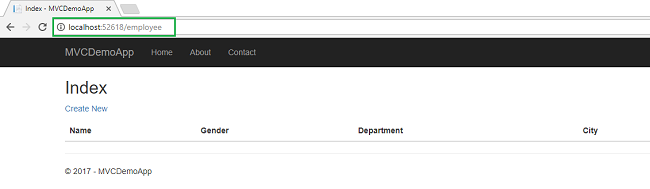

&nbsp;

Click on&nbsp;<em>CreateNew</em>&nbsp;to navigate to&nbsp;<em>Create&nbsp;</em>view. Add a new Employee record as shown in the image below.

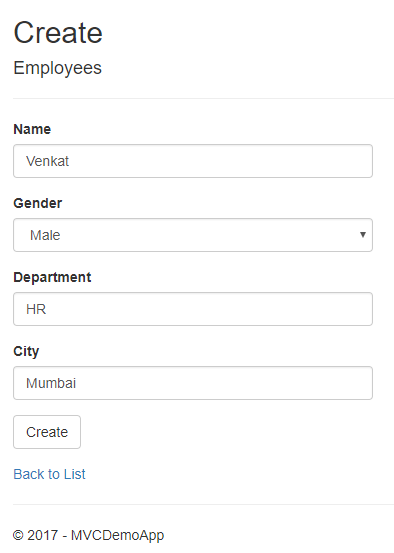

&nbsp;

If we miss the data in any field while creating employee record, we will get a required field validation error message.

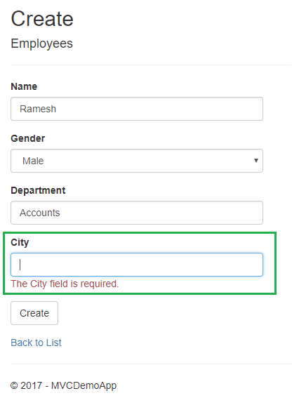

After inserting the data in all the fields, click on &quot;Create&quot; button. The new employee record will be created and you will be redirected to the Index view, displaying records of all the employees. Here, we can also see action
 methods Edit, Details, and Delete.

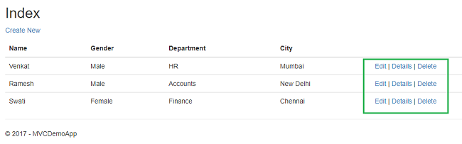 

&nbsp;

If we want to edit an existing employee record, then click Edit action link. It will open Edit View as below where we can change the employee data.

Here we have changed the Department of employee Swati from Finance to HR.Click on &quot;Save&quot; to return to the Index view to see the updated changes as highlighted in the image below.

If we miss any fields while editing employee records, then Edit view will also throw required field validation error message

If you want to see the details of any Employee, then click on Details action link, which will open the Details view, as shown in the image below.

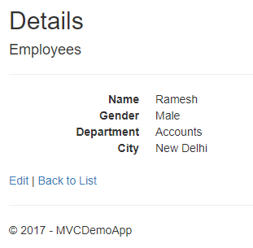

Click on &quot;Back to List&quot; to go back to Index view. Now, we will perform Delete operation on an employee named Venkat. Click on Delete action link which will open Delete view asking for a confirmation to delete.

Once we click on Delete button, it will send HttpPost request to delete employee record and we will be redirected to the Index view. Here, we can see that the employee with name Venkat has been removed from our record.

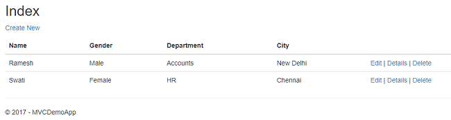

&nbsp;

<h1>Source Code Files</h1>

&nbsp;

<ul>
<li><em>MVCDemoApp.zip- </em>code&nbsp;attached for better understanding. Feel free to download and play with it.
</li></ul>
