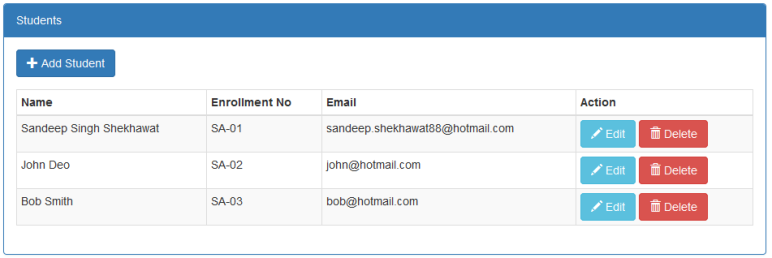
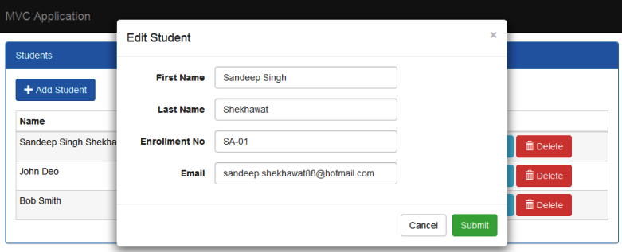
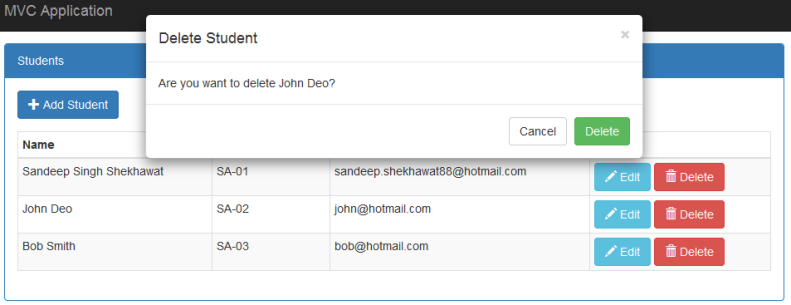

# CRUD Operations in MVC using Generic Repository Pattern and Entity Framework
## Requires
- Visual Studio 2015
## License
- Apache License, Version 2.0
## Technologies
- ASP.NET MVC
- Entity Framework
## Topics
- Entity Framework Code First
- Generic Repository
- Unit of Work
- crud operations in mvc5
## Updated
- 10/15/2016
## Description

<strong>Note:</strong> Also see the <a title="CRUD Operations in ASP.NET Core and Entity Framework Core" href="https://gallery.technet.microsoft.com/CRUD-Operations-in-ASPNET-a9fb53fa" target="_blank">
ASP.NET Core and Entity Framework Core CRUD Operations application.</a>

<h1>Introduction</h1>

A Visual Studio 2015 project which shows how to perform the create, read, update and delete operations in the ASP.NET MVC 5 application using Generic Repository pattern with Unit of Work and Entity Framework 6 Code First approach.

The code illustrates the following topics:

<ul>
<li>Listings, create, update and delete operations using generic repository pattern and unit of work.
</li><li>Listing and Create/Edit design using Bootstrap. </li><li>Create, Update and Delete operations perform in bootstrap modal pop up. </li><li>Database design using entity framework code first approach with fluent API. </li></ul>

You can read complete application explanation in the article <a title="CRUD Operations in MVC using Generic Repository Pattern and Entity Framework" href="http://social.technet.microsoft.com/wiki/contents/articles/35860.crud-operations-in-mvc-using-generic-repository-pattern-and-entity-framework.aspx" target="_blank">
CRUD Operations in MVC using Generic Repository Pattern and Entity Framework</a>

<h1>Getting Started</h1>

To build and run this sample as-is, you must have Visual Studio 2015 installed. In most cases you can run the application by following these steps:

<ol>
<li>Download and extract the .zip file. </li><li>Open the solution file in Visual Studio. </li><li>Change connection string in the Web.config file. </li><li>Build the solution, which automatically installs the missing NuGet packages. </li><li>Run the application. </li></ol>
<h1>Running the Sample</h1>

To run the sample, hit F5 or choose the Debug | Start Debugging menu command. You will see the student list screen. From this screen you have student listing screen as shown in below figure.

Figure 1: Student Listing

You can add new student using the Add Student button. You can edit individual student using edit button in listing as shown in below figure.

&nbsp;

Figure 2: Edit Student

Now you can delete individual student using delete button in listing as shown in below figure.

Figure 3: Delete Student

<h1>Source Code Overview</h1>

Figure 4: Code work flow

This solution have contains 3 projects which are used in following ways.

<ol>
<li>CF.Data: It holds entity classes and dbContext class. </li><li>CF.Repo: It holds unit of work class and generic repository. </li><li>CURDCodeFirst: It holds all UI. </li><li>packages.config - Specifies NuGet packages included in the project. </li><li>Web.config file - Includes the connection string to the database. </li></ol>
