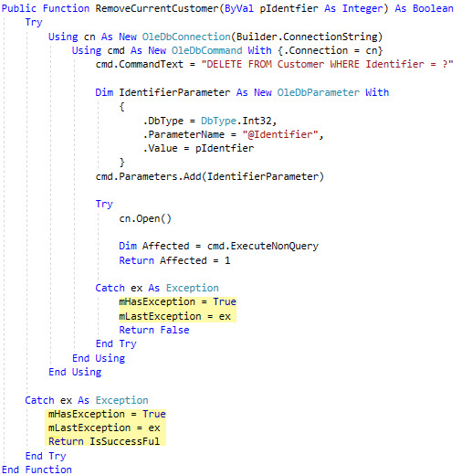
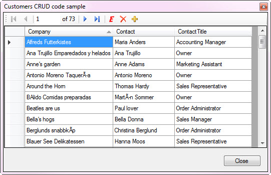
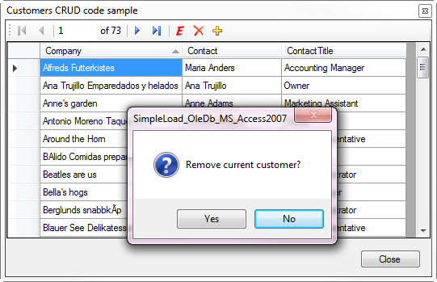
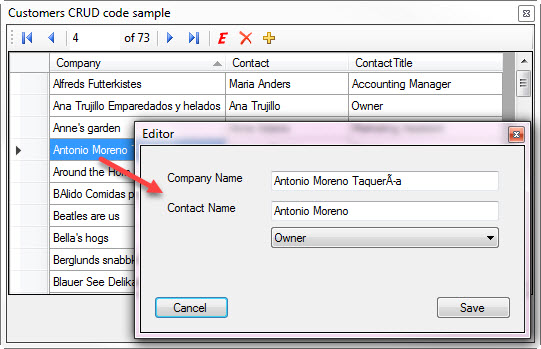

# CRUD data operations for MS-Access (VB.NET)
## Requires
- Visual Studio 2017
## License
- MIT
## Technologies
- Data Access
- Exception handling
- VB.Net
- CRUD
- MS Access
- Class Inheritance
## Topics
- Data Binding
- Data Access
- Exception handling
- Databases
- data and storage
## Updated
- 01/07/2018
## Description

<h1>Introduction</h1>

This code sample intent is to show how to do simple add/edit/remove/show and find operations in a MS-Access database table using several classes to assist in building a repeatable pattern to perform these operations. Many of
 the things shown here can be adapted to SQL-Server with a little bit of changes. Originally this solution was non-oop done many years ago in one project with zero classes and with about two hours of updating now is a three project solution that is very tight
 and easily repeatable in other solutions. Much of what is shown is based off work I&rsquo;ve done in prior code samples done in C# and applied to VB.NET. So since much came from C# it of course will work in C# as in my
<a href="https://code.msdn.microsoft.com/Inserting-a-batch-of-51a5b511?redir=0">code sample</a> done in C# where I not only use BaseExceptionsProperties but also hook in another class too.

<h1>Description</h1>

The solution is broken down into three projects, one for forms, one for data operations and the last one containing a single class which the data operation class inherits for exception handling.

The class BaseExceptionProperties is used in the data operation class as follows.

Implementing

&nbsp;

Visual Basic

Edit|Remove

vb
<pre class="hidden">Public Class DatabaseOperations
    Inherits BaseExceptionProperties</pre>

<pre class="vb">Public&nbsp;Class&nbsp;DatabaseOperations&nbsp;
&nbsp;&nbsp;&nbsp;&nbsp;Inherits&nbsp;BaseExceptionProperties</pre>

BaseExceptionsProperties class

Visual Basic

Edit|Remove

vb
<pre class="hidden">Public Class BaseExceptionProperties

    Protected mHasException As Boolean
    ''' &lt;summary&gt;
    ''' Indicate the last operation thrown an exception or not
    ''' &lt;/summary&gt;
    ''' &lt;returns&gt;&lt;/returns&gt;
    Public ReadOnly Property HasException() As Boolean
        Get
            Return mHasException
        End Get
    End Property
    Protected mLastException As Exception
    ''' &lt;summary&gt;
    ''' Provides access to the last exception thrown
    ''' &lt;/summary&gt;
    ''' &lt;returns&gt;&lt;/returns&gt;
    Public ReadOnly Property LastException() As Exception
        Get
            Return mLastException
        End Get
    End Property
    ''' &lt;summary&gt;
    ''' If you don't need the entire exception as in LastException this 
    ''' provides just the text of the exception
    ''' &lt;/summary&gt;
    ''' &lt;returns&gt;&lt;/returns&gt;
    Public ReadOnly Property LastExceptionMessage As String
        Get
            Return mLastException.Message
        End Get
    End Property
    ''' &lt;summary&gt;
    ''' Indicate for return of a function if there was an exception thrown or not.
    ''' &lt;/summary&gt;
    ''' &lt;returns&gt;&lt;/returns&gt;
    Public ReadOnly Property IsSuccessFul As Boolean
        Get
            Return Not mHasException
        End Get
    End Property
End Class
</pre>

<pre class="vb">Public&nbsp;Class&nbsp;BaseExceptionProperties&nbsp;
&nbsp;
&nbsp;&nbsp;&nbsp;&nbsp;Protected&nbsp;mHasException&nbsp;As&nbsp;Boolean&nbsp;
&nbsp;&nbsp;&nbsp;&nbsp;'''&nbsp;&lt;summary&gt;&nbsp;
&nbsp;&nbsp;&nbsp;&nbsp;'''&nbsp;Indicate&nbsp;the&nbsp;last&nbsp;operation&nbsp;thrown&nbsp;an&nbsp;exception&nbsp;or&nbsp;not&nbsp;
&nbsp;&nbsp;&nbsp;&nbsp;'''&nbsp;&lt;/summary&gt;&nbsp;
&nbsp;&nbsp;&nbsp;&nbsp;'''&nbsp;&lt;returns&gt;&lt;/returns&gt;&nbsp;
&nbsp;&nbsp;&nbsp;&nbsp;Public&nbsp;ReadOnly&nbsp;Property&nbsp;HasException()&nbsp;As&nbsp;Boolean&nbsp;
&nbsp;&nbsp;&nbsp;&nbsp;&nbsp;&nbsp;&nbsp;&nbsp;Get&nbsp;
&nbsp;&nbsp;&nbsp;&nbsp;&nbsp;&nbsp;&nbsp;&nbsp;&nbsp;&nbsp;&nbsp;&nbsp;Return&nbsp;mHasException&nbsp;
&nbsp;&nbsp;&nbsp;&nbsp;&nbsp;&nbsp;&nbsp;&nbsp;End&nbsp;Get&nbsp;
&nbsp;&nbsp;&nbsp;&nbsp;End&nbsp;Property&nbsp;
&nbsp;&nbsp;&nbsp;&nbsp;Protected&nbsp;mLastException&nbsp;As&nbsp;Exception&nbsp;
&nbsp;&nbsp;&nbsp;&nbsp;'''&nbsp;&lt;summary&gt;&nbsp;
&nbsp;&nbsp;&nbsp;&nbsp;'''&nbsp;Provides&nbsp;access&nbsp;to&nbsp;the&nbsp;last&nbsp;exception&nbsp;thrown&nbsp;
&nbsp;&nbsp;&nbsp;&nbsp;'''&nbsp;&lt;/summary&gt;&nbsp;
&nbsp;&nbsp;&nbsp;&nbsp;'''&nbsp;&lt;returns&gt;&lt;/returns&gt;&nbsp;
&nbsp;&nbsp;&nbsp;&nbsp;Public&nbsp;ReadOnly&nbsp;Property&nbsp;LastException()&nbsp;As&nbsp;Exception&nbsp;
&nbsp;&nbsp;&nbsp;&nbsp;&nbsp;&nbsp;&nbsp;&nbsp;Get&nbsp;
&nbsp;&nbsp;&nbsp;&nbsp;&nbsp;&nbsp;&nbsp;&nbsp;&nbsp;&nbsp;&nbsp;&nbsp;Return&nbsp;mLastException&nbsp;
&nbsp;&nbsp;&nbsp;&nbsp;&nbsp;&nbsp;&nbsp;&nbsp;End&nbsp;Get&nbsp;
&nbsp;&nbsp;&nbsp;&nbsp;End&nbsp;Property&nbsp;
&nbsp;&nbsp;&nbsp;&nbsp;'''&nbsp;&lt;summary&gt;&nbsp;
&nbsp;&nbsp;&nbsp;&nbsp;'''&nbsp;If&nbsp;you&nbsp;don't&nbsp;need&nbsp;the&nbsp;entire&nbsp;exception&nbsp;as&nbsp;in&nbsp;LastException&nbsp;this&nbsp;&nbsp;
&nbsp;&nbsp;&nbsp;&nbsp;'''&nbsp;provides&nbsp;just&nbsp;the&nbsp;text&nbsp;of&nbsp;the&nbsp;exception&nbsp;
&nbsp;&nbsp;&nbsp;&nbsp;'''&nbsp;&lt;/summary&gt;&nbsp;
&nbsp;&nbsp;&nbsp;&nbsp;'''&nbsp;&lt;returns&gt;&lt;/returns&gt;&nbsp;
&nbsp;&nbsp;&nbsp;&nbsp;Public&nbsp;ReadOnly&nbsp;Property&nbsp;LastExceptionMessage&nbsp;As&nbsp;String&nbsp;
&nbsp;&nbsp;&nbsp;&nbsp;&nbsp;&nbsp;&nbsp;&nbsp;Get&nbsp;
&nbsp;&nbsp;&nbsp;&nbsp;&nbsp;&nbsp;&nbsp;&nbsp;&nbsp;&nbsp;&nbsp;&nbsp;Return&nbsp;mLastException.Message&nbsp;
&nbsp;&nbsp;&nbsp;&nbsp;&nbsp;&nbsp;&nbsp;&nbsp;End&nbsp;Get&nbsp;
&nbsp;&nbsp;&nbsp;&nbsp;End&nbsp;Property&nbsp;
&nbsp;&nbsp;&nbsp;&nbsp;'''&nbsp;&lt;summary&gt;&nbsp;
&nbsp;&nbsp;&nbsp;&nbsp;'''&nbsp;Indicate&nbsp;for&nbsp;return&nbsp;of&nbsp;a&nbsp;function&nbsp;if&nbsp;there&nbsp;was&nbsp;an&nbsp;exception&nbsp;thrown&nbsp;or&nbsp;not.&nbsp;
&nbsp;&nbsp;&nbsp;&nbsp;'''&nbsp;&lt;/summary&gt;&nbsp;
&nbsp;&nbsp;&nbsp;&nbsp;'''&nbsp;&lt;returns&gt;&lt;/returns&gt;&nbsp;
&nbsp;&nbsp;&nbsp;&nbsp;Public&nbsp;ReadOnly&nbsp;Property&nbsp;IsSuccessFul&nbsp;As&nbsp;Boolean&nbsp;
&nbsp;&nbsp;&nbsp;&nbsp;&nbsp;&nbsp;&nbsp;&nbsp;Get&nbsp;
&nbsp;&nbsp;&nbsp;&nbsp;&nbsp;&nbsp;&nbsp;&nbsp;&nbsp;&nbsp;&nbsp;&nbsp;Return&nbsp;Not&nbsp;mHasException&nbsp;
&nbsp;&nbsp;&nbsp;&nbsp;&nbsp;&nbsp;&nbsp;&nbsp;End&nbsp;Get&nbsp;
&nbsp;&nbsp;&nbsp;&nbsp;End&nbsp;Property&nbsp;
End&nbsp;Class&nbsp;
</pre>

Example usage for deleting a customer

&nbsp;

In the caller

<strong>Important things to know</strong>:&nbsp;

<ul>
<li>Each operations to change data e.g. add, edit, delete are done in such a way that there is zero reason to reload the data from the backend database table as many developer think needs to be done. On a side note the same applies
 when working with TableAdapters, when done right there is no reason to do a reloading of data. 
</li><li>For each operations e.g. read, add, edit and delete are done in a single method for each operation where each method has a local connection and command sharing a single connection string.
</li><li>The Connection string defaults to one setup in the data class but can be overriden in the classes new constructor.
</li><li>For each data method they are wrapped in try-catch statements so nothing will crash the app but instead can be handled via the properties from BaseExceptionProperties
</li><li>For the add new record, upon success provides the new primary key which means if the add was in error you can immediately remove it as we have it's primary key. Many developers will simply add a row and not get the primary
 key which means they most likely will not care about removing a record or will need to reload data and as mentioned above there is zero reason to reload data when done right as done here.
</li><li>All SQL statements needing a WHERE condition use parameters.
</li><li>Update and add operations use parameters.
</li><li>The Add record for parameters uses Parameters.AddWithValue&nbsp;
</li><li>The Update record uses Parameters.Add which is more work and AddWithValue still works but wanted to show this is an option.
</li><li>Zero string concatenation used for SQL statements, instead they are created in xml literals. The idea is you can write the SQL in MS-Access, copy to your code, modify to work e.g. remove un-needed () and aliasing of fields
 for a single table etc. and then with .Value get the SQL statemnet without the &lt;SQL&gt;&lt;/SQL&gt; tags.
</li><li>For methods with parameters, each parameter is pre-fixed with 'p' so you know exactly where the variable came from, a parameter not a local or class level variable.
</li><li>A special code module handles asking the user questions in MyDialogs.vb
</li><li>There are several language extension methods which where designed to keep code clean and not having a need to cast objects over and over again.
</li></ul>

<strong>Screen shots</strong>:

 

 

Prompting to remove a record

Edit the current record

Add a new record

<strong>Special note</strong>:

I do not validation, that should be easy for you to do such as is company name or contact name empty or perhaps a duplicate etc.

Classes

 

 

&nbsp;

