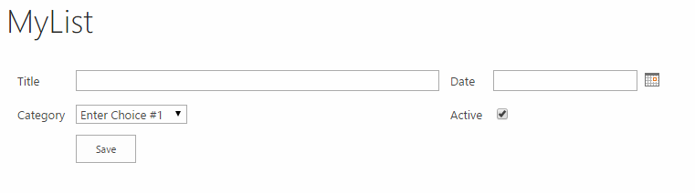
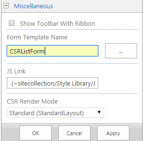

# CSR code samples #11 (Fully customized forms with CSRListForm)
## License
- MS-LPL
## Technologies
- Sharepoint Online
- SharePoint Foundation 2013
- SharePoint 2013
## Topics
- SharePoint
## Updated
- 03/19/2015
## Description

<h1>Introduction</h1>

This Client side rendering code sample will help you to work with <strong>
CSRListForm&nbsp;</strong>and build your sharepoint list forms form scratch and use any form layout and design that you want.&nbsp;

<strong>Note:</strong>&nbsp;This sample is part from&nbsp;<a href="http://code.msdn.microsoft.com/office/Client-side-rendering-JS-2ed3538a">series of samples to learn you how to work with CSR templates</a>.

 

<h2>How to deploy the JSLink templates</h2>

You can deploy those JSLink files in many ways, you can use OOTB, LIST schema PowerShell or code.&nbsp;&nbsp; 
I describe in the samples&nbsp;below how to deploy JSLink files using OOTB techniques, but if you want to know more about JSLink deployment methods, I recommend this&nbsp;<a class="title" href="http://www.codeproject.com/Articles/620110/SharePoint-Client-Side-Rendering-List-Views" target="_blank">article&nbsp;</a>by
 Andrei Markeev.&nbsp; 
 
Before proceeding&nbsp;with the samples,&nbsp;<strong>You have to upload the JavaScript code files on your SharePoint 2013 site</strong>. You can upload to any SharePoint storage: document library, _layouts folder or IIS virtual folder, But in the below deployment
 steps<strong>&nbsp;I&rsquo;m supposing you will upload the JSLink-Samples folder to the site collection Style Library</strong>.

&nbsp;

<h2>Screenshot (Two Columns form)</h2>

&nbsp;

<h2>Deployment steps:</h2>
<ol>
<li>Create a&nbsp;<strong>Custom&nbsp;</strong>list </li><li>Add some columns to the list, for my exampe I use the following:
<ol>
<li>Name:&nbsp;Date, Type: date and time </li><li>Name:&nbsp;Category, Type:&nbsp;Choice&nbsp; </li><li>Name:&nbsp;Active, Type:&nbsp;Yes/No </li></ol>
</li><li>Uplaod the&nbsp;FullyCustomizedForm.js file to the document library </li><li>Edit <strong>List Form&nbsp;</strong>page&nbsp; </li><li>Go to List view&nbsp;<strong>web-part properties&nbsp;</strong>and add the JSLink file (~sitecollection/Style Library/JSLink-Samples/FullyCustomizedForm.js) to&nbsp;<strong>JS link property</strong>&nbsp;under the&nbsp;<strong>Miscellaneous&nbsp;</strong>Tab.
 &nbsp;&nbsp; </li><li>CHange&nbsp;<strong>Form Template Name</strong> to CSRListForm </li></ol>

7. &nbsp;Click&nbsp;<strong>Apply&nbsp;</strong>button then&nbsp;<strong>Stop&nbsp;</strong>page editing.

&nbsp;

JavaScript

Edit|Remove

js

<pre class="js">//&nbsp;List&nbsp;Forms&nbsp;&ndash;&nbsp;User&nbsp;CSRListForm&nbsp;Server&nbsp;Tempalte&nbsp;
//&nbsp;Muawiyah&nbsp;Shannak&nbsp;,&nbsp;@MuShannak&nbsp;&nbsp;
&nbsp;&nbsp;
(function&nbsp;()&nbsp;{&nbsp;&nbsp;
&nbsp;&nbsp;
&nbsp;&nbsp;&nbsp;&nbsp;//&nbsp;Create&nbsp;object&nbsp;that&nbsp;have&nbsp;the&nbsp;context&nbsp;information&nbsp;about&nbsp;the&nbsp;field&nbsp;that&nbsp;we&nbsp;want&nbsp;to&nbsp;change&nbsp;it's&nbsp;output&nbsp;render&nbsp;&nbsp;&nbsp;
&nbsp;&nbsp;&nbsp;&nbsp;var&nbsp;formTemplate&nbsp;=&nbsp;{};&nbsp;
&nbsp;&nbsp;&nbsp;&nbsp;formTemplate.Templates&nbsp;=&nbsp;{};&nbsp;
&nbsp;&nbsp;&nbsp;&nbsp;formTemplate.Templates.View&nbsp;=&nbsp;viewTemplate;&nbsp;
&nbsp;&nbsp;
&nbsp;&nbsp;&nbsp;&nbsp;SPClientTemplates.TemplateManager.RegisterTemplateOverrides(formTemplate);&nbsp;
&nbsp;&nbsp;
})();&nbsp;&nbsp;
&nbsp;&nbsp;
//&nbsp;This&nbsp;function&nbsp;provides&nbsp;the&nbsp;rendering&nbsp;logic&nbsp;for&nbsp;the&nbsp;Custom&nbsp;Form&nbsp;
function&nbsp;viewTemplate(ctx)&nbsp;{&nbsp;
&nbsp;&nbsp;&nbsp;&nbsp;&nbsp;
&nbsp;&nbsp;&nbsp;&nbsp;var&nbsp;formTable&nbsp;=&nbsp;&quot;&quot;.concat(&quot;&lt;table&nbsp;width='100%'&nbsp;cellpadding='5'&gt;&quot;,&nbsp;
&nbsp;&nbsp;&nbsp;&nbsp;&nbsp;&nbsp;&nbsp;&nbsp;&nbsp;&nbsp;&nbsp;&nbsp;&nbsp;&nbsp;&nbsp;&nbsp;&nbsp;&nbsp;&nbsp;&nbsp;&nbsp;&nbsp;&nbsp;&nbsp;&nbsp;&nbsp;&nbsp;&nbsp;&nbsp;&nbsp;&nbsp;&nbsp;&nbsp;&nbsp;&nbsp;&nbsp;&quot;&lt;tr&gt;&quot;,&nbsp;
&nbsp;&nbsp;&nbsp;&nbsp;&nbsp;&nbsp;&nbsp;&nbsp;&nbsp;&nbsp;&nbsp;&nbsp;&nbsp;&nbsp;&nbsp;&nbsp;&nbsp;&nbsp;&nbsp;&nbsp;&nbsp;&nbsp;&nbsp;&nbsp;&nbsp;&nbsp;&nbsp;&nbsp;&nbsp;&nbsp;&nbsp;&nbsp;&nbsp;&nbsp;&nbsp;&nbsp;&nbsp;&nbsp;&nbsp;&nbsp;&quot;&lt;td&gt;&lt;div&gt;Title&lt;/div&gt;&lt;/td&gt;&quot;,&nbsp;
&nbsp;&nbsp;&nbsp;&nbsp;&nbsp;&nbsp;&nbsp;&nbsp;&nbsp;&nbsp;&nbsp;&nbsp;&nbsp;&nbsp;&nbsp;&nbsp;&nbsp;&nbsp;&nbsp;&nbsp;&nbsp;&nbsp;&nbsp;&nbsp;&nbsp;&nbsp;&nbsp;&nbsp;&nbsp;&nbsp;&nbsp;&nbsp;&nbsp;&nbsp;&nbsp;&nbsp;&nbsp;&nbsp;&nbsp;&nbsp;&quot;&lt;td&gt;&lt;div&gt;{{TitleCtrl}}&lt;/div&gt;&lt;/td&gt;&quot;,&nbsp;
&nbsp;&nbsp;&nbsp;&nbsp;&nbsp;&nbsp;&nbsp;&nbsp;&nbsp;&nbsp;&nbsp;&nbsp;&nbsp;&nbsp;&nbsp;&nbsp;&nbsp;&nbsp;&nbsp;&nbsp;&nbsp;&nbsp;&nbsp;&nbsp;&nbsp;&nbsp;&nbsp;&nbsp;&nbsp;&nbsp;&nbsp;&nbsp;&nbsp;&nbsp;&nbsp;&nbsp;&nbsp;&nbsp;&nbsp;&nbsp;&quot;&lt;td&gt;&lt;div&gt;Date&lt;/div&gt;&lt;/td&gt;&quot;,&nbsp;
&nbsp;&nbsp;&nbsp;&nbsp;&nbsp;&nbsp;&nbsp;&nbsp;&nbsp;&nbsp;&nbsp;&nbsp;&nbsp;&nbsp;&nbsp;&nbsp;&nbsp;&nbsp;&nbsp;&nbsp;&nbsp;&nbsp;&nbsp;&nbsp;&nbsp;&nbsp;&nbsp;&nbsp;&nbsp;&nbsp;&nbsp;&nbsp;&nbsp;&nbsp;&nbsp;&nbsp;&nbsp;&nbsp;&nbsp;&nbsp;&quot;&lt;td&gt;&lt;div&gt;{{DateCtrl}}&lt;/div&gt;&lt;/td&gt;&quot;,&nbsp;
&nbsp;&nbsp;&nbsp;&nbsp;&nbsp;&nbsp;&nbsp;&nbsp;&nbsp;&nbsp;&nbsp;&nbsp;&nbsp;&nbsp;&nbsp;&nbsp;&nbsp;&nbsp;&nbsp;&nbsp;&nbsp;&nbsp;&nbsp;&nbsp;&nbsp;&nbsp;&nbsp;&nbsp;&nbsp;&nbsp;&nbsp;&nbsp;&nbsp;&nbsp;&nbsp;&nbsp;&quot;&lt;/tr&gt;&quot;,&nbsp;
&nbsp;&nbsp;&nbsp;&nbsp;&nbsp;&nbsp;&nbsp;&nbsp;&nbsp;&nbsp;&nbsp;&nbsp;&nbsp;&nbsp;&nbsp;&nbsp;&nbsp;&nbsp;&nbsp;&nbsp;&nbsp;&nbsp;&nbsp;&nbsp;&nbsp;&nbsp;&nbsp;&nbsp;&nbsp;&nbsp;&nbsp;&nbsp;&nbsp;&nbsp;&nbsp;&nbsp;&quot;&lt;tr&gt;&quot;,&nbsp;
&nbsp;&nbsp;&nbsp;&nbsp;&nbsp;&nbsp;&nbsp;&nbsp;&nbsp;&nbsp;&nbsp;&nbsp;&nbsp;&nbsp;&nbsp;&nbsp;&nbsp;&nbsp;&nbsp;&nbsp;&nbsp;&nbsp;&nbsp;&nbsp;&nbsp;&nbsp;&nbsp;&nbsp;&nbsp;&nbsp;&nbsp;&nbsp;&nbsp;&nbsp;&nbsp;&nbsp;&nbsp;&nbsp;&nbsp;&nbsp;&quot;&lt;td&gt;&lt;div&gt;Category&lt;/div&gt;&lt;/td&gt;&quot;,&nbsp;
&nbsp;&nbsp;&nbsp;&nbsp;&nbsp;&nbsp;&nbsp;&nbsp;&nbsp;&nbsp;&nbsp;&nbsp;&nbsp;&nbsp;&nbsp;&nbsp;&nbsp;&nbsp;&nbsp;&nbsp;&nbsp;&nbsp;&nbsp;&nbsp;&nbsp;&nbsp;&nbsp;&nbsp;&nbsp;&nbsp;&nbsp;&nbsp;&nbsp;&nbsp;&nbsp;&nbsp;&nbsp;&nbsp;&nbsp;&nbsp;&nbsp;&nbsp;&nbsp;&nbsp;&quot;&lt;td&gt;&lt;div&gt;{{CategoryCtrl}}&lt;/div&gt;&lt;/td&gt;&quot;,&nbsp;
&nbsp;&nbsp;&nbsp;&nbsp;&nbsp;&nbsp;&nbsp;&nbsp;&nbsp;&nbsp;&nbsp;&nbsp;&nbsp;&nbsp;&nbsp;&nbsp;&nbsp;&nbsp;&nbsp;&nbsp;&nbsp;&nbsp;&nbsp;&nbsp;&nbsp;&nbsp;&nbsp;&nbsp;&nbsp;&nbsp;&nbsp;&nbsp;&nbsp;&nbsp;&nbsp;&nbsp;&nbsp;&nbsp;&nbsp;&nbsp;&quot;&lt;td&gt;&lt;div&gt;Active&lt;/div&gt;&lt;/td&gt;&quot;,&nbsp;
&nbsp;&nbsp;&nbsp;&nbsp;&nbsp;&nbsp;&nbsp;&nbsp;&nbsp;&nbsp;&nbsp;&nbsp;&nbsp;&nbsp;&nbsp;&nbsp;&nbsp;&nbsp;&nbsp;&nbsp;&nbsp;&nbsp;&nbsp;&nbsp;&nbsp;&nbsp;&nbsp;&nbsp;&nbsp;&nbsp;&nbsp;&nbsp;&nbsp;&nbsp;&nbsp;&nbsp;&nbsp;&nbsp;&nbsp;&nbsp;&quot;&lt;td&gt;&lt;div&gt;{{ActiveCtrl}}&lt;/div&gt;&lt;/td&gt;&quot;,&nbsp;
&nbsp;&nbsp;&nbsp;&nbsp;&nbsp;&nbsp;&nbsp;&nbsp;&nbsp;&nbsp;&nbsp;&nbsp;&nbsp;&nbsp;&nbsp;&nbsp;&nbsp;&nbsp;&nbsp;&nbsp;&nbsp;&nbsp;&nbsp;&nbsp;&nbsp;&nbsp;&nbsp;&nbsp;&nbsp;&nbsp;&nbsp;&nbsp;&nbsp;&nbsp;&nbsp;&nbsp;&quot;&lt;/tr&gt;&quot;,&nbsp;
&nbsp;&nbsp;&nbsp;&nbsp;&nbsp;&nbsp;&nbsp;&nbsp;&nbsp;&nbsp;&nbsp;&nbsp;&nbsp;&nbsp;&nbsp;&nbsp;&nbsp;&nbsp;&nbsp;&nbsp;&nbsp;&nbsp;&nbsp;&nbsp;&nbsp;&nbsp;&nbsp;&nbsp;&nbsp;&nbsp;&nbsp;&nbsp;&nbsp;&nbsp;&nbsp;&nbsp;&quot;&lt;tr&gt;&quot;,&nbsp;
&nbsp;&nbsp;&nbsp;&nbsp;&nbsp;&nbsp;&nbsp;&nbsp;&nbsp;&nbsp;&nbsp;&nbsp;&nbsp;&nbsp;&nbsp;&nbsp;&nbsp;&nbsp;&nbsp;&nbsp;&nbsp;&nbsp;&nbsp;&nbsp;&nbsp;&nbsp;&nbsp;&nbsp;&nbsp;&nbsp;&nbsp;&nbsp;&nbsp;&nbsp;&nbsp;&nbsp;&nbsp;&nbsp;&nbsp;&nbsp;&quot;&lt;td&gt;&lt;/td&gt;&quot;,&nbsp;
&nbsp;&nbsp;&nbsp;&nbsp;&nbsp;&nbsp;&nbsp;&nbsp;&nbsp;&nbsp;&nbsp;&nbsp;&nbsp;&nbsp;&nbsp;&nbsp;&nbsp;&nbsp;&nbsp;&nbsp;&nbsp;&nbsp;&nbsp;&nbsp;&nbsp;&nbsp;&nbsp;&nbsp;&nbsp;&nbsp;&nbsp;&nbsp;&nbsp;&nbsp;&nbsp;&nbsp;&nbsp;&nbsp;&nbsp;&nbsp;&quot;&lt;td&gt;&lt;input&nbsp;type='button'&nbsp;value='Save'&nbsp;onclick=\&quot;SPClientForms.ClientFormManager.SubmitClientForm('{{FormId}}')\&quot;&nbsp;style='margin-left:0'&nbsp;&gt;&lt;/td&gt;&quot;,&nbsp;
&nbsp;&nbsp;&nbsp;&nbsp;&nbsp;&nbsp;&nbsp;&nbsp;&nbsp;&nbsp;&nbsp;&nbsp;&nbsp;&nbsp;&nbsp;&nbsp;&nbsp;&nbsp;&nbsp;&nbsp;&nbsp;&nbsp;&nbsp;&nbsp;&nbsp;&nbsp;&nbsp;&nbsp;&nbsp;&nbsp;&nbsp;&nbsp;&nbsp;&nbsp;&nbsp;&nbsp;&quot;&lt;/tr&gt;&quot;,&nbsp;
&nbsp;&nbsp;&nbsp;&nbsp;&nbsp;&nbsp;&nbsp;&nbsp;&nbsp;&nbsp;&nbsp;&nbsp;&nbsp;&nbsp;&nbsp;&nbsp;&nbsp;&nbsp;&nbsp;&nbsp;&nbsp;&nbsp;&nbsp;&nbsp;&nbsp;&nbsp;&nbsp;&nbsp;&nbsp;&nbsp;&quot;&lt;/table&gt;&quot;);&nbsp;
&nbsp;
&nbsp;&nbsp;&nbsp;&nbsp;&nbsp;
&nbsp;&nbsp;&nbsp;&nbsp;//Replace&nbsp;the&nbsp;tokens&nbsp;with&nbsp;the&nbsp;default&nbsp;sharepoint&nbsp;controls&nbsp;
&nbsp;&nbsp;&nbsp;&nbsp;formTable&nbsp;=&nbsp;formTable.replace(&quot;{{TitleCtrl}}&quot;,&nbsp;getSPFieldRender(ctx,&nbsp;&quot;Title&quot;));&nbsp;
&nbsp;&nbsp;&nbsp;&nbsp;formTable&nbsp;=&nbsp;formTable.replace(&quot;{{DateCtrl}}&quot;,&nbsp;getSPFieldRender(ctx,&nbsp;&quot;Date&quot;));&nbsp;
&nbsp;&nbsp;&nbsp;&nbsp;formTable&nbsp;=&nbsp;formTable.replace(&quot;{{CategoryCtrl}}&quot;,&nbsp;getSPFieldRender(ctx,&nbsp;&quot;Category&quot;));&nbsp;
&nbsp;&nbsp;&nbsp;&nbsp;formTable&nbsp;=&nbsp;formTable.replace(&quot;{{ActiveCtrl}}&quot;,&nbsp;getSPFieldRender(ctx,&nbsp;&quot;Active&quot;));&nbsp;
&nbsp;&nbsp;&nbsp;&nbsp;formTable&nbsp;=&nbsp;formTable.replace(&quot;{{FormId}}&quot;,&nbsp;ctx.FormUniqueId);&nbsp;
&nbsp;
&nbsp;&nbsp;&nbsp;&nbsp;return&nbsp;formTable;&nbsp;
}&nbsp;
&nbsp;
//This&nbsp;function&nbsp;code&nbsp;set&nbsp;the&nbsp;required&nbsp;properties&nbsp;and&nbsp;call&nbsp;the&nbsp;OOTB&nbsp;(default)&nbsp;function&nbsp;that&nbsp;use&nbsp;to&nbsp;render&nbsp;Sharepoint&nbsp;Fields&nbsp;&nbsp;
function&nbsp;getSPFieldRender(ctx,&nbsp;fieldName)&nbsp;
{&nbsp;
&nbsp;&nbsp;&nbsp;&nbsp;var&nbsp;fieldContext&nbsp;=&nbsp;ctx;&nbsp;
&nbsp;
&nbsp;&nbsp;&nbsp;&nbsp;//Get&nbsp;the&nbsp;filed&nbsp;Schema&nbsp;
&nbsp;&nbsp;&nbsp;&nbsp;var&nbsp;result&nbsp;=&nbsp;ctx.ListSchema.Field.filter(function(&nbsp;obj&nbsp;)&nbsp;{&nbsp;
&nbsp;&nbsp;&nbsp;&nbsp;&nbsp;&nbsp;&nbsp;&nbsp;return&nbsp;obj.Name&nbsp;==&nbsp;fieldName;&nbsp;
&nbsp;&nbsp;&nbsp;&nbsp;});&nbsp;
&nbsp;
&nbsp;&nbsp;&nbsp;&nbsp;//Set&nbsp;the&nbsp;field&nbsp;Schema&nbsp;&nbsp;&amp;&nbsp;default&nbsp;value&nbsp;
&nbsp;&nbsp;&nbsp;&nbsp;fieldContext.CurrentFieldSchema&nbsp;=&nbsp;result[0];&nbsp;
&nbsp;&nbsp;&nbsp;&nbsp;fieldContext.CurrentFieldValue&nbsp;=&nbsp;ctx.ListData.Items[0][fieldName];&nbsp;
&nbsp;
&nbsp;&nbsp;&nbsp;&nbsp;//Call&nbsp;&nbsp;OOTB&nbsp;field&nbsp;render&nbsp;function&nbsp;&nbsp;
&nbsp;&nbsp;&nbsp;&nbsp;return&nbsp;ctx.Templates.Fields[fieldName](fieldContext);&nbsp;
}&nbsp;
</pre>

<h2><strong>What you should learn if you browse this code sample (FullyCustomizedForm.js)?</strong></h2>

This is an advance sample, it will help you to learn how to create Fully customized forms and how to use&nbsp;<strong>CSRListForm template.</strong>

