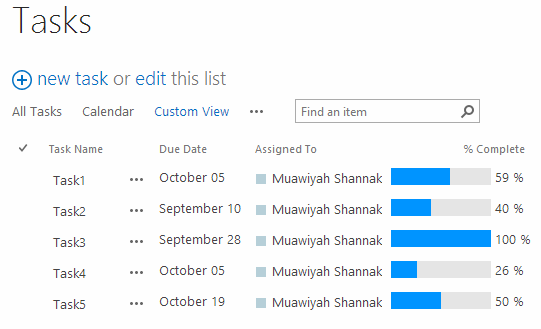
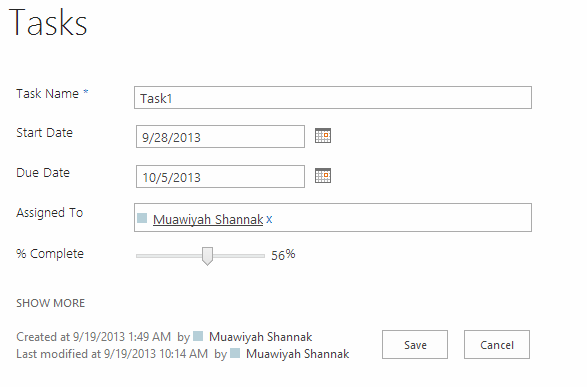

# CSR code samples #5 (Percent Complete)
## License
- Apache License, Version 2.0
## Technologies
- SharePoint
- Sharepoint Online
- SharePoint Server 2013
- SharePoint Foundation 2013
## Topics
- SharePoint
- SharePoint List
## Updated
- 03/19/2015
## Description

<h1>Introduction</h1>

This JSLink sample will show how to add rendering logic for the Task list Percent Complete field, this code will change the file render to be displayed as a progress bar in&nbsp;<strong>View&nbsp;</strong>and&nbsp;<strong>Display&nbsp;</strong>forms, and
 as a scroll input in the&nbsp;<strong>New&nbsp;</strong>and&nbsp;<strong>Edit&nbsp;</strong>forms.

<strong>Note:</strong>&nbsp;This sample is part from&nbsp;<a href="http://code.msdn.microsoft.com/office/Client-side-rendering-JS-2ed3538a">series of samples to learn you how to work with CSR templates</a>.

&nbsp;

<h2>How to deploy the JSLink templates</h2>

You can deploy those JSLink files in many ways, you can use OOTB, LIST schema PowerShell or code.&nbsp;&nbsp; 
I describe in the samples&nbsp;below how to deploy JSLink files using OOTB techniques, but if you want to know more about JSLink deployment methods, I recommend this&nbsp;<a class="title" title="Using the JSLink property to change the way your field or views are rendered in SharePoint 2013 - See more at: http://zimmergren.net/technical/sp-2013-using-the-spfield-jslink-property-to-change-the-way-your-field-is-rendered-in-sharepoint-2013#sthash.g1A4qJvM.dpuf" href="http://zimmergren.net/technical/sp-2013-using-the-spfield-jslink-property-to-change-the-way-your-field-is-rendered-in-sharepoint-2013" target="_blank">article&nbsp;</a>by
 Tobias Zimmergren.&nbsp; 
 
Before proceeding&nbsp;with the samples,&nbsp;<strong>You have to upload the JavaScript code files on your SharePoint 2013 site</strong>. You can upload to any SharePoint storage document library, _layouts folder or IIS virtual folder, But in the below deployment
 steps<strong>&nbsp;I&rsquo;m supposing you will upload the JSLink-Samples folder to the site collection Style Library</strong>.

&nbsp;

<h2>Screenshots</h2>

&nbsp;

<h2>Deployment steps:</h2>

<ol>
<li>Create a&nbsp;<strong>Task&nbsp;</strong>List<strong>&nbsp;</strong> </li><li>Create a new View and add&nbsp;<strong>% Complete</strong>&nbsp;field&nbsp;to the view
</li><li>Edit the&nbsp;<strong>Default List View (All Documents)</strong>&nbsp;page </li><li>Go to List View<strong>&nbsp;web-part properties&nbsp;</strong>and add the JSLink file (~sitecollection/Style Library/JSLink-Samples/PercentComplete.js) to&nbsp;<strong>JS link property&nbsp;</strong>under the&nbsp;<strong>Miscellaneous&nbsp;</strong>Tab
</li><li>Click&nbsp;<strong>Apply&nbsp;</strong>button then&nbsp;<strong>Stop&nbsp;</strong>page editing
</li><li><strong>&nbsp;</strong>Apply the previous steps on the other forms&nbsp;<strong>Display</strong>,&nbsp;<strong>New&nbsp;</strong>and&nbsp;<strong>Edit</strong>.
</li></ol>

&nbsp;

JavaScript

Edit|Remove

js

<pre class="csharp">//&nbsp;List&nbsp;view,&nbsp;display,&nbsp;add&nbsp;and&nbsp;edit&nbsp;&ndash;&nbsp;Percent&nbsp;Complete&nbsp;Sample&nbsp;
//&nbsp;Muawiyah&nbsp;Shannak&nbsp;,&nbsp;@MuShannak&nbsp;
&nbsp;
(function&nbsp;()&nbsp;{&nbsp;
&nbsp;
&nbsp;&nbsp;&nbsp;&nbsp;//&nbsp;Create&nbsp;object&nbsp;that&nbsp;have&nbsp;the&nbsp;context&nbsp;information&nbsp;about&nbsp;the&nbsp;field&nbsp;that&nbsp;we&nbsp;want&nbsp;to&nbsp;change&nbsp;it's&nbsp;output&nbsp;render&nbsp;&nbsp;
&nbsp;&nbsp;&nbsp;&nbsp;var&nbsp;percentCompleteFiledContext&nbsp;=&nbsp;{};&nbsp;
&nbsp;&nbsp;&nbsp;&nbsp;percentCompleteFiledContext.Templates&nbsp;=&nbsp;{};&nbsp;
&nbsp;&nbsp;&nbsp;&nbsp;percentCompleteFiledContext.Templates.Fields&nbsp;=&nbsp;{&nbsp;
&nbsp;&nbsp;&nbsp;&nbsp;&nbsp;&nbsp;&nbsp;&nbsp;//&nbsp;Apply&nbsp;the&nbsp;new&nbsp;rendering&nbsp;for&nbsp;PercentComplete&nbsp;field&nbsp;on&nbsp;List&nbsp;View,&nbsp;Display,&nbsp;New&nbsp;and&nbsp;Edit&nbsp;forms&nbsp;
&nbsp;&nbsp;&nbsp;&nbsp;&nbsp;&nbsp;&nbsp;&nbsp;&quot;PercentComplete&quot;:&nbsp;{&nbsp;&nbsp;
&nbsp;&nbsp;&nbsp;&nbsp;&nbsp;&nbsp;&nbsp;&nbsp;&nbsp;&nbsp;&nbsp;&nbsp;&quot;View&quot;:&nbsp;percentCompleteViewFiledTemplate,&nbsp;
&nbsp;&nbsp;&nbsp;&nbsp;&nbsp;&nbsp;&nbsp;&nbsp;&nbsp;&nbsp;&nbsp;&nbsp;&quot;DisplayForm&quot;:&nbsp;percentCompleteViewFiledTemplate,&nbsp;
&nbsp;&nbsp;&nbsp;&nbsp;&nbsp;&nbsp;&nbsp;&nbsp;&nbsp;&nbsp;&nbsp;&nbsp;&quot;NewForm&quot;:&nbsp;percentCompleteEditFiledTemplate,&nbsp;
&nbsp;&nbsp;&nbsp;&nbsp;&nbsp;&nbsp;&nbsp;&nbsp;&nbsp;&nbsp;&nbsp;&nbsp;&quot;EditForm&quot;:&nbsp;percentCompleteEditFiledTemplate&nbsp;
&nbsp;&nbsp;&nbsp;&nbsp;&nbsp;&nbsp;&nbsp;&nbsp;}&nbsp;
&nbsp;&nbsp;&nbsp;&nbsp;};&nbsp;
&nbsp;
&nbsp;&nbsp;&nbsp;&nbsp;SPClientTemplates.TemplateManager.RegisterTemplateOverrides(percentCompleteFiledContext);&nbsp;
&nbsp;
})();&nbsp;
&nbsp;
//&nbsp;This&nbsp;function&nbsp;provides&nbsp;the&nbsp;rendering&nbsp;logic&nbsp;for&nbsp;View&nbsp;and&nbsp;Display&nbsp;form&nbsp;
function&nbsp;percentCompleteViewFiledTemplate(ctx)&nbsp;{&nbsp;
&nbsp;
&nbsp;&nbsp;&nbsp;&nbsp;var&nbsp;percentComplete&nbsp;=&nbsp;ctx.CurrentItem[ctx.CurrentFieldSchema.Name];&nbsp;
&nbsp;&nbsp;&nbsp;&nbsp;return&nbsp;&quot;&lt;div&nbsp;style='background-color:&nbsp;#e5e5e5;&nbsp;width:&nbsp;100px;&nbsp;&nbsp;display:inline-block;'&gt;&nbsp;\&nbsp;
&nbsp;&nbsp;&nbsp;&nbsp;&nbsp;&nbsp;&nbsp;&nbsp;&nbsp;&nbsp;&nbsp;&nbsp;&lt;div&nbsp;style='width:&nbsp;&quot;&nbsp;&#43;&nbsp;percentComplete.replace(/\s&#43;/g,&nbsp;'')&nbsp;&#43;&nbsp;&quot;;&nbsp;background-color:&nbsp;#0094ff;'&gt;&nbsp;\&nbsp;
&nbsp;&nbsp;&nbsp;&nbsp;&nbsp;&nbsp;&nbsp;&nbsp;&nbsp;&nbsp;&nbsp;&nbsp;&amp;nbsp;&lt;/div&gt;&lt;/div&gt;&amp;nbsp;&quot;&nbsp;&#43;&nbsp;percentComplete;&nbsp;
&nbsp;
}&nbsp;
&nbsp;
//&nbsp;This&nbsp;function&nbsp;provides&nbsp;the&nbsp;rendering&nbsp;logic&nbsp;for&nbsp;New&nbsp;and&nbsp;Edit&nbsp;forms&nbsp;
function&nbsp;percentCompleteEditFiledTemplate(ctx)&nbsp;{&nbsp;
&nbsp;
&nbsp;&nbsp;&nbsp;&nbsp;var&nbsp;formCtx&nbsp;=&nbsp;SPClientTemplates.Utility.GetFormContextForCurrentField(ctx);&nbsp;
&nbsp;
&nbsp;&nbsp;&nbsp;&nbsp;//&nbsp;Register&nbsp;a&nbsp;callback&nbsp;just&nbsp;before&nbsp;submit.&nbsp;
&nbsp;&nbsp;&nbsp;&nbsp;formCtx.registerGetValueCallback(formCtx.fieldName,&nbsp;function&nbsp;()&nbsp;{&nbsp;
&nbsp;&nbsp;&nbsp;&nbsp;&nbsp;&nbsp;&nbsp;&nbsp;return&nbsp;document.getElementById('inpPercentComplete').value;&nbsp;
&nbsp;&nbsp;&nbsp;&nbsp;});&nbsp;
&nbsp;
&nbsp;&nbsp;&nbsp;&nbsp;return&nbsp;&quot;&lt;input&nbsp;type='range'&nbsp;id='inpPercentComplete'&nbsp;name='inpPercentComplete'&nbsp;min='0'&nbsp;max='100'&nbsp;\&nbsp;
&nbsp;&nbsp;&nbsp;&nbsp;&nbsp;&nbsp;&nbsp;&nbsp;&nbsp;&nbsp;&nbsp;&nbsp;oninput='outPercentComplete.value=inpPercentComplete.value'&nbsp;value='&quot;&nbsp;&#43;&nbsp;formCtx.fieldValue&nbsp;&#43;&nbsp;&quot;'&nbsp;/&gt;&nbsp;\&nbsp;
&nbsp;&nbsp;&nbsp;&nbsp;&nbsp;&nbsp;&nbsp;&nbsp;&nbsp;&nbsp;&nbsp;&nbsp;&lt;output&nbsp;name='outPercentComplete'&nbsp;for='inpPercentComplete'&nbsp;&gt;&quot;&nbsp;&#43;&nbsp;formCtx.fieldValue&nbsp;&#43;&nbsp;&quot;&lt;/output&gt;%&quot;;&nbsp;
&nbsp;
}&nbsp;
</pre>

<strong>What you should learn if you browse this code sample (PercentComplete.js)?</strong>

In this code sample you will learn how to use the same JSLink templates with all types of forms View, Display, New and Edit.

