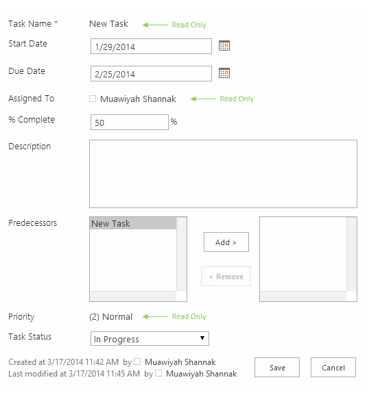

# CSR code samples #8 (Read-only SP Controls)
## License
- Apache License, Version 2.0
## Technologies
- SharePoint
- Sharepoint Online
- SharePoint Server 2013
## Topics
- SharePoint
- SharePoint List
## Updated
- 03/19/2015
## Description

<h1>Introduction</h1>

Sometimes we need to allwo user to edit list item but without touch some item fields, this will enhance the form user experience (if no need to modify&nbsp;these filed),&nbsp;This JSLink sample will demonstrate&nbsp;how to use and utilize ready sharepoint
 javascript libraries to make form fileds uneditable.&nbsp;

&nbsp;

<strong>Note:</strong>&nbsp;This sample is part&nbsp;of a&nbsp;<a href="http://code.msdn.microsoft.com/office/Client-side-rendering-JS-2ed3538a">series samples to learn you how to work with CSR templates</a>.

&nbsp;

<h2>How to deploy the JSLink templates</h2>

You can deploy those JSLink files in many ways, you can use OOTB, LIST schema PowerShell or code.&nbsp;&nbsp; 
I describe in the samples&nbsp;below how to deploy JSLink files using OOTB techniques, but if you want to know more about JSLink deployment methods, I recommend this&nbsp;<a class="title" href="http://www.codeproject.com/Articles/620110/SharePoint-Client-Side-Rendering-List-Views" target="_blank">article&nbsp;</a>by
 Andrei Markeev.&nbsp; 
 
Before proceeding&nbsp;with the samples,&nbsp;<strong>You have to upload the JavaScript code files on your SharePoint 2013 site</strong>. You can upload to any SharePoint storage document library, _layouts folder or IIS virtual folder, But in the below deployment
 steps<strong>&nbsp;I&rsquo;m supposing you will upload the JSLink-Samples folder to the site collection Style Library</strong>.

&nbsp;

<h2>Screenshot</h2>

&nbsp;

&nbsp;

<h2>Deployment steps:</h2>

<ol>
<li>Create a&nbsp;<strong>Task&nbsp;</strong>List </li><li>Edit the&nbsp;<strong>Edit Form page</strong> </li><li>Go to List Edit Form&nbsp;<strong>web-part properties</strong>&nbsp;and add the JSLink file (~sitecollection/Style Library/JSLink-Samples/ReadOnlySPControls.js) to&nbsp;<strong>JS link property</strong>&nbsp;under the&nbsp;<strong>Miscellaneous&nbsp;</strong>Tab
</li><li><strong>&nbsp;</strong>Click&nbsp;<strong>Apply&nbsp;</strong>button then&nbsp;<strong>Stop&nbsp;</strong>page editing
</li><li>Apply the previous steps on the&nbsp;<strong>Edit Form</strong> </li></ol>

&nbsp;

&nbsp;

JavaScript

Edit|Remove

js

<pre class="js">//&nbsp;List&nbsp;add&nbsp;and&nbsp;edit&nbsp;&ndash;&nbsp;ReadOnly&nbsp;SP&nbsp;Controls&nbsp;Sample&nbsp;
//&nbsp;Muawiyah&nbsp;Shannak&nbsp;,&nbsp;@MuShannak&nbsp;
&nbsp;
(function&nbsp;()&nbsp;{&nbsp;
&nbsp;
&nbsp;&nbsp;&nbsp;&nbsp;//&nbsp;Create&nbsp;object&nbsp;that&nbsp;have&nbsp;the&nbsp;context&nbsp;information&nbsp;about&nbsp;the&nbsp;field&nbsp;that&nbsp;we&nbsp;want&nbsp;to&nbsp;change&nbsp;it's&nbsp;output&nbsp;render&nbsp;&nbsp;
&nbsp;&nbsp;&nbsp;&nbsp;var&nbsp;readonlyFiledContext&nbsp;=&nbsp;{};&nbsp;
&nbsp;&nbsp;&nbsp;&nbsp;readonlyFiledContext.Templates&nbsp;=&nbsp;{};&nbsp;
&nbsp;&nbsp;&nbsp;&nbsp;readonlyFiledContext.Templates.Fields&nbsp;=&nbsp;{&nbsp;
&nbsp;&nbsp;&nbsp;&nbsp;&nbsp;&nbsp;&nbsp;&nbsp;//&nbsp;Apply&nbsp;the&nbsp;new&nbsp;rendering&nbsp;for&nbsp;Age&nbsp;field&nbsp;on&nbsp;Edit&nbsp;forms&nbsp;
&nbsp;&nbsp;&nbsp;&nbsp;&nbsp;&nbsp;&nbsp;&nbsp;&quot;Title&quot;:&nbsp;{&nbsp;
&nbsp;&nbsp;&nbsp;&nbsp;&nbsp;&nbsp;&nbsp;&nbsp;&nbsp;&nbsp;&nbsp;&nbsp;&quot;EditForm&quot;:&nbsp;readonlyFieldTemplate&nbsp;
&nbsp;&nbsp;&nbsp;&nbsp;&nbsp;&nbsp;&nbsp;&nbsp;},&nbsp;
&nbsp;&nbsp;&nbsp;&nbsp;&nbsp;&nbsp;&nbsp;&nbsp;&quot;AssignedTo&quot;:&nbsp;{&nbsp;
&nbsp;&nbsp;&nbsp;&nbsp;&nbsp;&nbsp;&nbsp;&nbsp;&nbsp;&nbsp;&nbsp;&nbsp;&quot;EditForm&quot;:&nbsp;readonlyFieldTemplate&nbsp;
&nbsp;&nbsp;&nbsp;&nbsp;&nbsp;&nbsp;&nbsp;&nbsp;},&nbsp;
&nbsp;&nbsp;&nbsp;&nbsp;&nbsp;&nbsp;&nbsp;&nbsp;&quot;Priority&quot;:&nbsp;{&nbsp;
&nbsp;&nbsp;&nbsp;&nbsp;&nbsp;&nbsp;&nbsp;&nbsp;&nbsp;&nbsp;&nbsp;&nbsp;&quot;EditForm&quot;:&nbsp;readonlyFieldTemplate&nbsp;
&nbsp;&nbsp;&nbsp;&nbsp;&nbsp;&nbsp;&nbsp;&nbsp;}&nbsp;
&nbsp;&nbsp;&nbsp;&nbsp;};&nbsp;
&nbsp;
&nbsp;&nbsp;&nbsp;&nbsp;SPClientTemplates.TemplateManager.RegisterTemplateOverrides(readonlyFiledContext);&nbsp;
&nbsp;
})();&nbsp;
&nbsp;
//&nbsp;This&nbsp;function&nbsp;provides&nbsp;the&nbsp;rendering&nbsp;logic&nbsp;
function&nbsp;readonlyFieldTemplate(ctx)&nbsp;{&nbsp;
&nbsp;
&nbsp;&nbsp;&nbsp;&nbsp;//Reuse&nbsp;ready&nbsp;sharepoint&nbsp;javascript&nbsp;libraries&nbsp;
&nbsp;&nbsp;&nbsp;&nbsp;switch&nbsp;(ctx.CurrentFieldSchema.FieldType)&nbsp;{&nbsp;
&nbsp;&nbsp;&nbsp;&nbsp;&nbsp;&nbsp;&nbsp;&nbsp;case&nbsp;&quot;Text&quot;:&nbsp;
&nbsp;&nbsp;&nbsp;&nbsp;&nbsp;&nbsp;&nbsp;&nbsp;case&nbsp;&quot;Number&quot;:&nbsp;
&nbsp;&nbsp;&nbsp;&nbsp;&nbsp;&nbsp;&nbsp;&nbsp;case&nbsp;&quot;Integer&quot;:&nbsp;
&nbsp;&nbsp;&nbsp;&nbsp;&nbsp;&nbsp;&nbsp;&nbsp;case&nbsp;&quot;Currency&quot;:&nbsp;
&nbsp;&nbsp;&nbsp;&nbsp;&nbsp;&nbsp;&nbsp;&nbsp;case&nbsp;&quot;Choice&quot;:&nbsp;
&nbsp;&nbsp;&nbsp;&nbsp;&nbsp;&nbsp;&nbsp;&nbsp;case&nbsp;&quot;Computed&quot;:&nbsp;
&nbsp;&nbsp;&nbsp;&nbsp;&nbsp;&nbsp;&nbsp;&nbsp;&nbsp;&nbsp;&nbsp;&nbsp;return&nbsp;SPField_FormDisplay_Default(ctx);&nbsp;
&nbsp;
&nbsp;&nbsp;&nbsp;&nbsp;&nbsp;&nbsp;&nbsp;&nbsp;case&nbsp;&quot;MultiChoice&quot;:&nbsp;
&nbsp;&nbsp;&nbsp;&nbsp;&nbsp;&nbsp;&nbsp;&nbsp;&nbsp;&nbsp;&nbsp;&nbsp;prepareMultiChoiceFieldValue(ctx);&nbsp;
&nbsp;&nbsp;&nbsp;&nbsp;&nbsp;&nbsp;&nbsp;&nbsp;&nbsp;&nbsp;&nbsp;&nbsp;return&nbsp;SPField_FormDisplay_Default(ctx);&nbsp;
&nbsp;
&nbsp;&nbsp;&nbsp;&nbsp;&nbsp;&nbsp;&nbsp;&nbsp;case&nbsp;&quot;Boolean&quot;:&nbsp;
&nbsp;&nbsp;&nbsp;&nbsp;&nbsp;&nbsp;&nbsp;&nbsp;&nbsp;&nbsp;&nbsp;&nbsp;return&nbsp;SPField_FormDisplay_DefaultNoEncode(ctx);&nbsp;
&nbsp;
&nbsp;&nbsp;&nbsp;&nbsp;&nbsp;&nbsp;&nbsp;&nbsp;case&nbsp;&quot;Note&quot;:&nbsp;
&nbsp;&nbsp;&nbsp;&nbsp;&nbsp;&nbsp;&nbsp;&nbsp;&nbsp;&nbsp;&nbsp;&nbsp;prepareNoteFieldValue(ctx);&nbsp;
&nbsp;&nbsp;&nbsp;&nbsp;&nbsp;&nbsp;&nbsp;&nbsp;&nbsp;&nbsp;&nbsp;&nbsp;return&nbsp;SPFieldNote_Display(ctx);&nbsp;
&nbsp;
&nbsp;&nbsp;&nbsp;&nbsp;&nbsp;&nbsp;&nbsp;&nbsp;case&nbsp;&quot;File&quot;:&nbsp;
&nbsp;&nbsp;&nbsp;&nbsp;&nbsp;&nbsp;&nbsp;&nbsp;&nbsp;&nbsp;&nbsp;&nbsp;return&nbsp;SPFieldFile_Display(ctx);&nbsp;
&nbsp;
&nbsp;&nbsp;&nbsp;&nbsp;&nbsp;&nbsp;&nbsp;&nbsp;case&nbsp;&quot;Lookup&quot;:&nbsp;
&nbsp;&nbsp;&nbsp;&nbsp;&nbsp;&nbsp;&nbsp;&nbsp;case&nbsp;&quot;LookupMulti&quot;:&nbsp;
&nbsp;&nbsp;&nbsp;&nbsp;&nbsp;&nbsp;&nbsp;&nbsp;&nbsp;&nbsp;&nbsp;&nbsp;&nbsp;&nbsp;&nbsp;&nbsp;return&nbsp;SPFieldLookup_Display(ctx);&nbsp;&nbsp;&nbsp;&nbsp;&nbsp;&nbsp;&nbsp;&nbsp;&nbsp;&nbsp;&nbsp;&nbsp;
&nbsp;
&nbsp;&nbsp;&nbsp;&nbsp;&nbsp;&nbsp;&nbsp;&nbsp;case&nbsp;&quot;URL&quot;:&nbsp;
&nbsp;&nbsp;&nbsp;&nbsp;&nbsp;&nbsp;&nbsp;&nbsp;&nbsp;&nbsp;&nbsp;&nbsp;return&nbsp;RenderFieldValueDefault(ctx);&nbsp;
&nbsp;
&nbsp;&nbsp;&nbsp;&nbsp;&nbsp;&nbsp;&nbsp;&nbsp;case&nbsp;&quot;User&quot;:&nbsp;
&nbsp;&nbsp;&nbsp;&nbsp;&nbsp;&nbsp;&nbsp;&nbsp;&nbsp;&nbsp;&nbsp;&nbsp;prepareUserFieldValue(ctx);&nbsp;
&nbsp;&nbsp;&nbsp;&nbsp;&nbsp;&nbsp;&nbsp;&nbsp;&nbsp;&nbsp;&nbsp;&nbsp;return&nbsp;SPFieldUser_Display(ctx);&nbsp;
&nbsp;
&nbsp;&nbsp;&nbsp;&nbsp;&nbsp;&nbsp;&nbsp;&nbsp;case&nbsp;&quot;UserMulti&quot;:&nbsp;
&nbsp;&nbsp;&nbsp;&nbsp;&nbsp;&nbsp;&nbsp;&nbsp;&nbsp;&nbsp;&nbsp;&nbsp;prepareUserFieldValue(ctx);&nbsp;
&nbsp;&nbsp;&nbsp;&nbsp;&nbsp;&nbsp;&nbsp;&nbsp;&nbsp;&nbsp;&nbsp;&nbsp;return&nbsp;SPFieldUserMulti_Display(ctx);&nbsp;
&nbsp;
&nbsp;&nbsp;&nbsp;&nbsp;&nbsp;&nbsp;&nbsp;&nbsp;case&nbsp;&quot;DateTime&quot;:&nbsp;
&nbsp;&nbsp;&nbsp;&nbsp;&nbsp;&nbsp;&nbsp;&nbsp;&nbsp;&nbsp;&nbsp;&nbsp;return&nbsp;SPFieldDateTime_Display(ctx);&nbsp;
&nbsp;
&nbsp;&nbsp;&nbsp;&nbsp;&nbsp;&nbsp;&nbsp;&nbsp;case&nbsp;&quot;Attachments&quot;:&nbsp;
&nbsp;&nbsp;&nbsp;&nbsp;&nbsp;&nbsp;&nbsp;&nbsp;&nbsp;&nbsp;&nbsp;&nbsp;return&nbsp;SPFieldAttachments_Default(ctx);&nbsp;
&nbsp;
&nbsp;&nbsp;&nbsp;&nbsp;&nbsp;&nbsp;&nbsp;&nbsp;case&nbsp;&quot;TaxonomyFieldType&quot;:&nbsp;
&nbsp;&nbsp;&nbsp;&nbsp;&nbsp;&nbsp;&nbsp;&nbsp;&nbsp;&nbsp;&nbsp;&nbsp;//Re-use&nbsp;ready&nbsp;sharepoint&nbsp;inside&nbsp;sp.ui.taxonomy.js&nbsp;javascript&nbsp;libraries&nbsp;
&nbsp;&nbsp;&nbsp;&nbsp;&nbsp;&nbsp;&nbsp;&nbsp;&nbsp;&nbsp;&nbsp;&nbsp;return&nbsp;SP.UI.Taxonomy.TaxonomyFieldTemplate.renderDisplayControl(ctx);&nbsp;
&nbsp;&nbsp;&nbsp;&nbsp;}&nbsp;
}&nbsp;
&nbsp;
//User&nbsp;control&nbsp;need&nbsp;specific&nbsp;formatted&nbsp;value&nbsp;to&nbsp;render&nbsp;content&nbsp;correctly&nbsp;
function&nbsp;prepareUserFieldValue(ctx)&nbsp;{&nbsp;
&nbsp;&nbsp;&nbsp;&nbsp;var&nbsp;item&nbsp;=&nbsp;ctx['CurrentItem'];&nbsp;
&nbsp;&nbsp;&nbsp;&nbsp;var&nbsp;userField&nbsp;=&nbsp;item[ctx.CurrentFieldSchema.Name];&nbsp;
&nbsp;&nbsp;&nbsp;&nbsp;var&nbsp;fieldValue&nbsp;=&nbsp;&quot;&quot;;&nbsp;
&nbsp;
&nbsp;&nbsp;&nbsp;&nbsp;for&nbsp;(var&nbsp;i&nbsp;=&nbsp;0;&nbsp;i&nbsp;&lt;&nbsp;userField.length;&nbsp;i&#43;&#43;)&nbsp;{&nbsp;
&nbsp;&nbsp;&nbsp;&nbsp;&nbsp;&nbsp;&nbsp;&nbsp;fieldValue&nbsp;&#43;=&nbsp;userField[i].EntityData.SPUserID&nbsp;&#43;&nbsp;SPClientTemplates.Utility.UserLookupDelimitString&nbsp;&#43;&nbsp;userField[i].DisplayText;&nbsp;
&nbsp;
&nbsp;&nbsp;&nbsp;&nbsp;&nbsp;&nbsp;&nbsp;&nbsp;if&nbsp;((i&nbsp;&#43;&nbsp;1)&nbsp;!=&nbsp;userField.length)&nbsp;{&nbsp;
&nbsp;&nbsp;&nbsp;&nbsp;&nbsp;&nbsp;&nbsp;&nbsp;&nbsp;&nbsp;&nbsp;&nbsp;fieldValue&nbsp;&#43;=&nbsp;SPClientTemplates.Utility.UserLookupDelimitString&nbsp;
&nbsp;&nbsp;&nbsp;&nbsp;&nbsp;&nbsp;&nbsp;&nbsp;}&nbsp;
&nbsp;&nbsp;&nbsp;&nbsp;}&nbsp;
&nbsp;
&nbsp;&nbsp;&nbsp;&nbsp;ctx[&quot;CurrentFieldValue&quot;]&nbsp;=&nbsp;fieldValue;&nbsp;
}&nbsp;
&nbsp;
//Choice&nbsp;control&nbsp;need&nbsp;specific&nbsp;formatted&nbsp;value&nbsp;to&nbsp;render&nbsp;content&nbsp;correctly&nbsp;
function&nbsp;prepareMultiChoiceFieldValue(ctx)&nbsp;{&nbsp;
&nbsp;
&nbsp;&nbsp;&nbsp;&nbsp;if&nbsp;(ctx[&quot;CurrentFieldValue&quot;])&nbsp;{&nbsp;
&nbsp;&nbsp;&nbsp;&nbsp;&nbsp;&nbsp;&nbsp;&nbsp;var&nbsp;fieldValue&nbsp;=&nbsp;ctx[&quot;CurrentFieldValue&quot;];&nbsp;
&nbsp;
&nbsp;&nbsp;&nbsp;&nbsp;&nbsp;&nbsp;&nbsp;&nbsp;var&nbsp;find&nbsp;=&nbsp;';#';&nbsp;
&nbsp;&nbsp;&nbsp;&nbsp;&nbsp;&nbsp;&nbsp;&nbsp;var&nbsp;regExpObj&nbsp;=&nbsp;new&nbsp;RegExp(find,&nbsp;'g');&nbsp;
&nbsp;
&nbsp;&nbsp;&nbsp;&nbsp;&nbsp;&nbsp;&nbsp;&nbsp;fieldValue&nbsp;=&nbsp;fieldValue.replace(regExpObj,&nbsp;';&nbsp;');&nbsp;
&nbsp;&nbsp;&nbsp;&nbsp;&nbsp;&nbsp;&nbsp;&nbsp;fieldValue&nbsp;=&nbsp;fieldValue.replace(/^;&nbsp;/g,&nbsp;'');&nbsp;
&nbsp;&nbsp;&nbsp;&nbsp;&nbsp;&nbsp;&nbsp;&nbsp;fieldValue&nbsp;=&nbsp;fieldValue.replace(/;&nbsp;$/g,&nbsp;'');&nbsp;
&nbsp;
&nbsp;&nbsp;&nbsp;&nbsp;&nbsp;&nbsp;&nbsp;&nbsp;ctx[&quot;CurrentFieldValue&quot;]&nbsp;=&nbsp;fieldValue;&nbsp;
&nbsp;&nbsp;&nbsp;&nbsp;}&nbsp;
}&nbsp;
&nbsp;
//Note&nbsp;control&nbsp;need&nbsp;specific&nbsp;formatted&nbsp;value&nbsp;to&nbsp;render&nbsp;content&nbsp;correctly&nbsp;
function&nbsp;prepareNoteFieldValue(ctx)&nbsp;{&nbsp;
&nbsp;
&nbsp;&nbsp;&nbsp;&nbsp;if&nbsp;(ctx[&quot;CurrentFieldValue&quot;])&nbsp;{&nbsp;
&nbsp;&nbsp;&nbsp;&nbsp;&nbsp;&nbsp;&nbsp;&nbsp;var&nbsp;fieldValue&nbsp;=&nbsp;ctx[&quot;CurrentFieldValue&quot;];&nbsp;
&nbsp;&nbsp;&nbsp;&nbsp;&nbsp;&nbsp;&nbsp;&nbsp;fieldValue&nbsp;=&nbsp;&quot;&lt;div&gt;&quot;&nbsp;&#43;&nbsp;fieldValue.replace(/\n/g,&nbsp;'&lt;br&nbsp;/&gt;');&nbsp;&#43;&nbsp;&quot;&lt;/div&gt;&quot;;&nbsp;
&nbsp;
&nbsp;&nbsp;&nbsp;&nbsp;&nbsp;&nbsp;&nbsp;&nbsp;ctx[&quot;CurrentFieldValue&quot;]&nbsp;=&nbsp;fieldValue;&nbsp;
&nbsp;&nbsp;&nbsp;&nbsp;}&nbsp;
}</pre>

&nbsp;

<h2>What you should learn if you browse this code sample (ReadOnlySPControls.js)?</h2>

This JSLink sample will show how to use and&nbsp;<strong>utilize ready sharepoint javascript libraries</strong>&nbsp;to make form fileds uneditable.&nbsp;

