# CUDA 5.0 and Visual Studio 2012 Configuration
## Requires
- Visual Studio 2012
## License
- Apache License, Version 2.0
## Technologies
- Visual Studio 2012
- CUDA
- NSight
## Topics
- Parallel Programming
- GPGPU
## Updated
- 07/22/2013
## Description

<h1>Note that CUDA 5.5 fully supports Visual Studio 2012..</h1>

&nbsp;

<h1>Introduction</h1>

I will explain in this article how to set your environment in order to successfully write and run CUDA 5 programs with Visual Studio 2012. It takes time to figure out how to get it done and there is very little information on the
 internet, so hopefully, I will make life a little easier for some of you. When you study GPGPU programming it helps to understand cross-platform programming paradigms and technologies, such as AMP, CUDA, OpenCL, and DirectCompute because all of them target
 the same hardware and consequently have similar limitations.

&nbsp;

Prerequisites for the attached project are CUDA 5.0, NSight 3.0 RC1, Visual Studio 2012. The code is extremely simple (just under 100 lines in one file) and serves more to give you a complete configured Visual Studio custom project
 that works. You can build on it.

&nbsp;

The main idea in parallel programming is to write code as if you were writing a program that will execute on one thread only, then specifying that you want to run that program simultaneously on as many threads as necessary.

<h1>Building the Sample</h1>

To run the sample you have to install the following prerequisites: CUDA 5.0, NSight 3.0 RC1, Visual Studio 2012

<h1>Description</h1>
<h2>Required Software</h2>

Start with installing CUDA 5.0 and NSight software. You can download everything from the following links:

<ul style="list-style-type:lower-latin">
<li><a href="http://docs.nvidia.com/cuda/cuda-getting-started-guide-for-microsoft-windows/index.html" target="_blank">NVIDIA CUDA Getting Started Guide for Microsoft Windows</a>
</li><li><a href="http://www.nvidia.com/object/cuda_home_new.html" target="_blank">CUDA Zone</a>
</li><li><a href="https://developer.nvidia.com/rdp/nsight-visual-studio-edition-registered-developer-program">Nsight Visual Studio</a>
</li></ul>

You have to be registered with NVidia to install the software.

<h2>Verify Installation</h2>

Navigate to 
C:\ProgramData\NVIDIA Corporation\CUDA Samples\v5.0\bin\win64\Release and run

deviceQuery.

&nbsp;

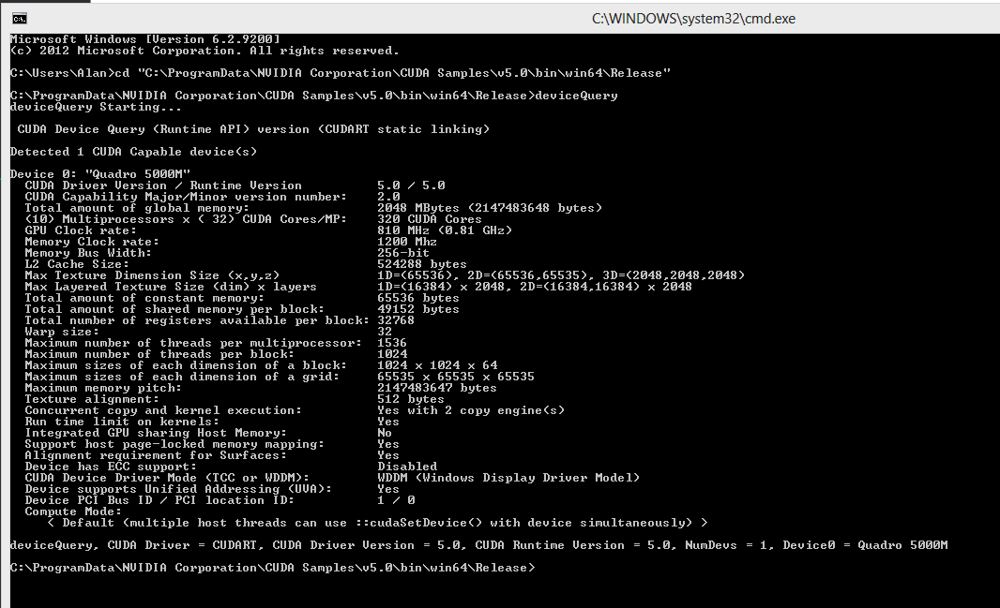

&nbsp;

It is always interesting to compare capabilities of your hardware with the latest available specs. Important here are number of threads, blocks, grids. Number of threads per block is vital because when you design your code you do
 not want to exceed that number when calling your kernels.

&nbsp;

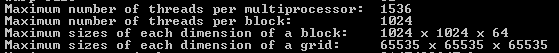

&nbsp;

Also important Runtime limit on kernels setting. On my machine it is 7 seconds. Normally it is set to 2 seconds. It is better when there is no limit.

&nbsp;

The runtime limit is a mechanism for maintaining GPU responsiveness. Windows will reset display driver when a task appears to be hanging or running longer than the permitted quantum time (default is 2 seconds as I already mentioned.
 Mine must be 7 because I have Quadro card). The display driver is restarted to free up the GPU for display and other waiting apps. Users will notice a momentary screen flicker with a message in the task bar like &ldquo;Display driver has stopped responding
 and has successfully recovered&rdquo;.

&nbsp;

Here&rsquo;s how to find the timeout value for your computer:

&nbsp;

<pre style="color:#808080; font-size:small; font-family:'Courier New',Courier,monospace">// PS C:\WINDOWS\system32&gt; cd hklm:
PS HKLM:\&gt; dir

    Hive: HKEY_LOCAL_MACHINE

Name                           Property                                                                                                                                                 
----                           --------                                                                                                                                                 
BCD00000000                                                                                                                                                                             
HARDWARE                                                                                                                                                                                
SAM                                                                                                                                                                                     
SOFTWARE                                                                                                                                                                                
SYSTEM                                                                                                                                                                                  

PS HKLM:\&gt; cd System\CurrentControlSet\Control\GraphicsDrivers

PS HKLM:\System\CurrentControlSet\Control\GraphicsDrivers&gt; dir

    Hive: HKEY_LOCAL_MACHINE\System\CurrentControlSet\Control\GraphicsDrivers

Name                           Property                                                                                                                                                 
----                           --------                                                                                                                                                 
AdditionalModeLists                                                                                                                                                                     
Configuration                                                                                                                                                                           
Connectivity                                                                                                                                                                            
DCI                            Timeout : 7                                                                                                                                              
UseNewKey                                         
    </pre>

Next, run bandwidthTest

&nbsp;

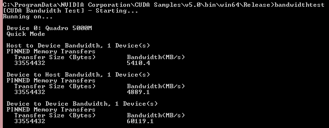

<h2>Prepare Visual Studio</h2>

Navigate to 
C:\Program Files\NVIDIA GPU Computing Toolkit\CUDA\v5.0\extras\visual_studio_integration\MSBuildExtensions and copy all files from that folder to a temporary location where we could make some changes.

&nbsp;

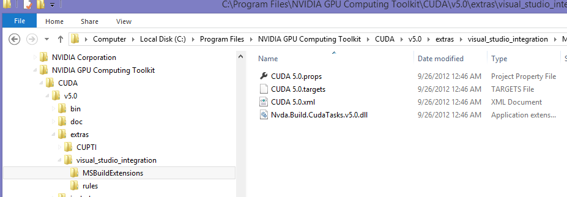

&nbsp;

We will be adding some data to the following two files:

&nbsp;

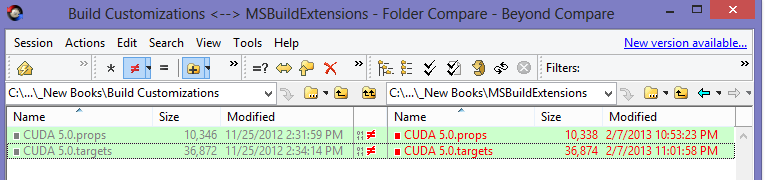

&nbsp;&nbsp;

cuda 5.0.props file

&nbsp;

Add the following CudaClVersion where 2010 (not 2012) is not a mistake. CUDA will not work if you specify 2012 version.

&nbsp;

&lt;CudaClVersion Condition=&quot;'$(PlatformToolset)' == 'v110'&quot;&gt;2010&lt;/CudaClVersion&gt;

&nbsp;

&nbsp;&nbsp;

cuda 5.0.targets file

&nbsp;

Modify the following nodes.

<pre style="color:#808080; font-size:small; font-family:'Courier New',Courier,monospace">         &lt;CudaCleanDependsOn&gt;
            $(CudaCompileDependsOn);
            _SelectedFiles;
            CudaFilterSelectedFiles;
            AddCudaCompileMetadata;
            AddCudaLinkMetadata;
            AddCudaCompileDeps;
            AddCudaCompilePropsDeps;
            ValidateCudaBuild;
            ValidateCudaCodeGeneration;
            ComputeCudaCompileOutput;
            PrepareForCudaBuild
        &lt;/CudaCleanDependsOn&gt;

        GenerateRelocatableDeviceCode=&quot;%(CudaCompile.GenerateRelocatableDeviceCode)&quot;

        CodeGeneration=&quot;%(CudaCompile.CodeGenerationValues)&quot;

        CommandLineTemplate=&quot;&quot;$(CudaToolkitNvccPath)&quot; %(CudaCompile.BuildCommandLineTemplate) %(CudaCompile.ApiCommandLineTemplate) %(CudaCompile.CleanCommandLineTemplate)&quot;
    </pre>

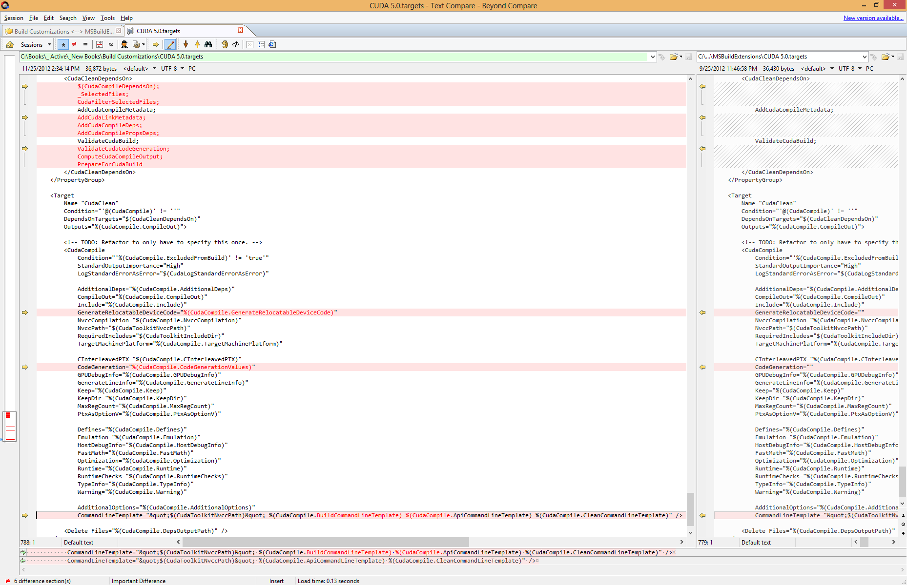

&nbsp;

Now you can copy the files to the MS Build folder. You will find two BuildCustomizations folders, you will need the one under v110:

C:\Program Files (x86)\MSBuild\Microsoft.Cpp\v4.0\V110\BuildCustomizations. NVidia CUDA SDK samples will use customizations from another folder where the files were copied there during CUDA setup.

&nbsp;

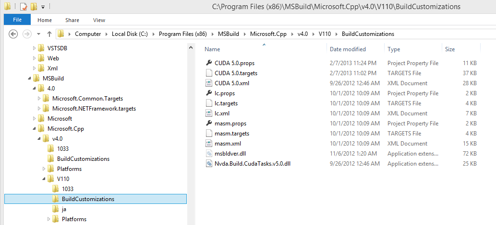

&nbsp;

In Visual Studio map CUDA file extensions to the C&#43;&#43; to enable code highlighting and intellisence. You will find the mapping under Text Editor.

&nbsp;

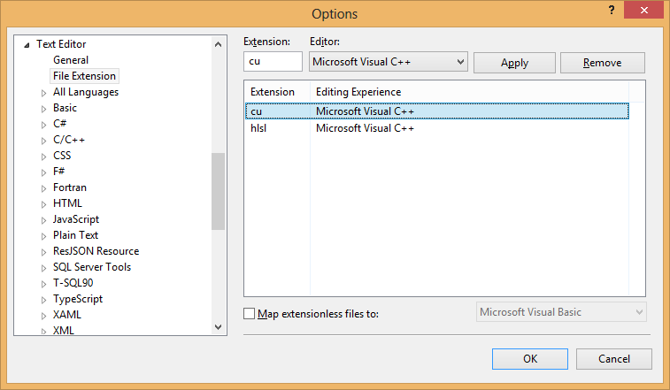

&nbsp;

And finally, change supported version from 1600 to 1700. To do that, open host_config.h file under

C:\Program Files\NVIDIA GPU Computing Toolkit\CUDA\v5.0\include and scroll to line 90.

&nbsp;

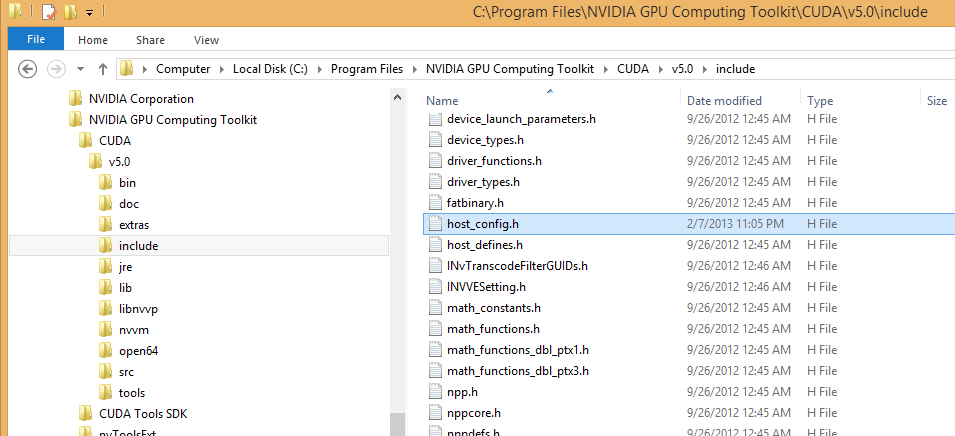

&nbsp;

&nbsp;

&nbsp;

Now you can build CUDA projects.

<h2>CUDA Project</h2>

Create console application.

&nbsp;

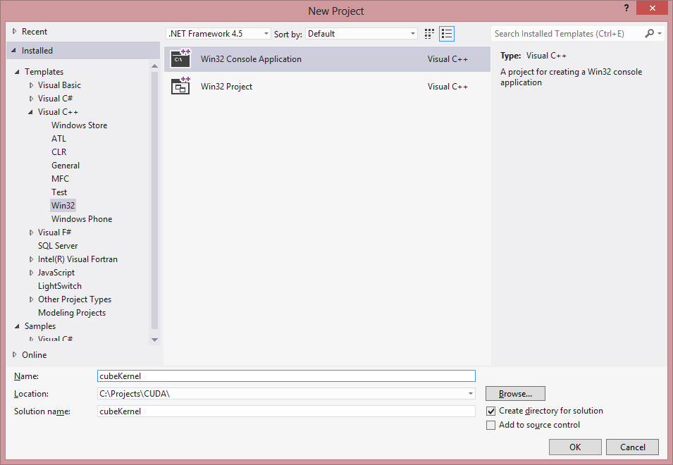

&nbsp;

Select Empty Project.

&nbsp;

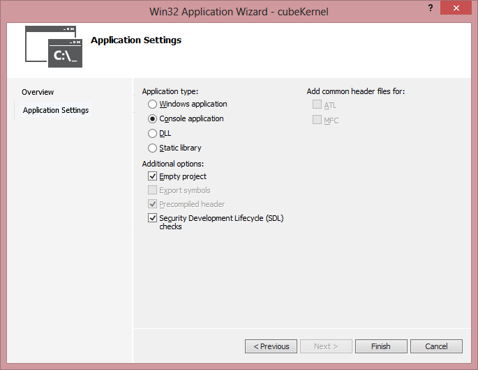

&nbsp;

Change configuratino to x64

&nbsp;

Select Build Customizations.

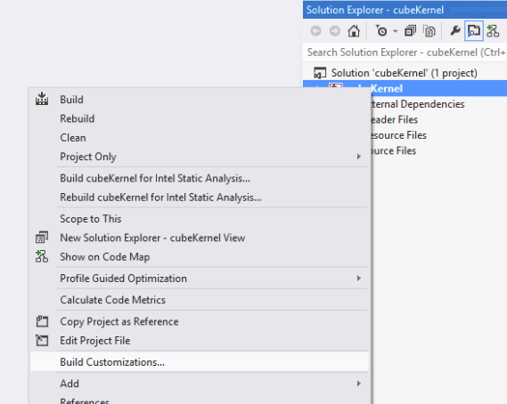

&nbsp;

Change compiler to NVidia's by selecting CUDA targets.

&nbsp;

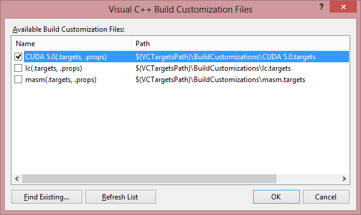

Modify Visual Studio directories to resolve Include and Lib files.

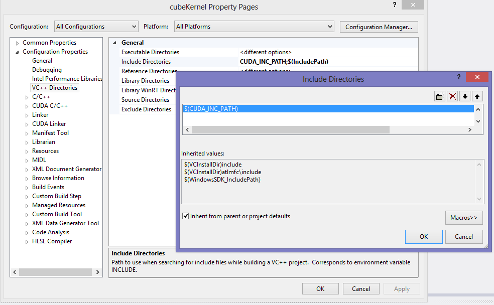

Still under project properties dialog, go to CUDA and make sure that it targets x64 platform.

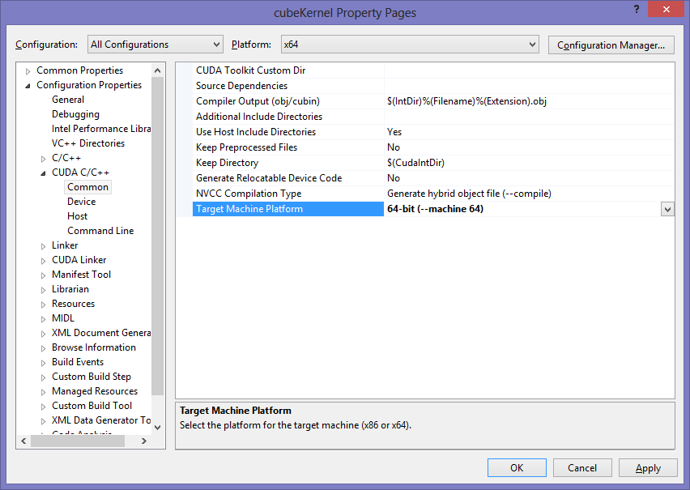

Almost done! Now we can add a code file.

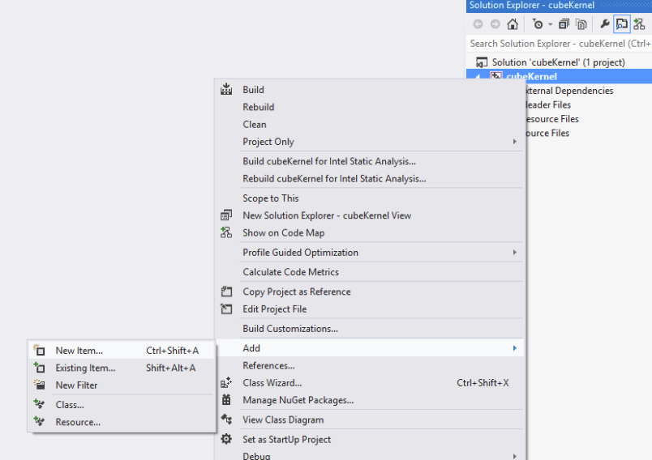

Name it something.cu. File extension 
cu is very important for code files containing CUDA kernels.

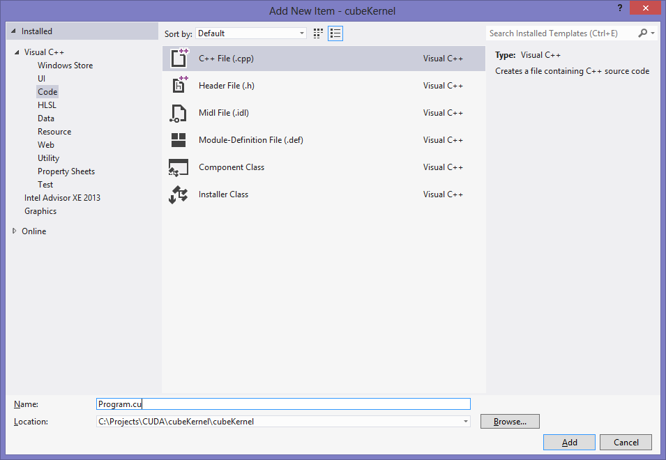

Open file properties (right button on the file) and make sure that CUDA targets x64. We are done!

C&#43;&#43;

Edit|Remove

cplusplus
<pre class="hidden">#include &lt;iostream&gt;
#include &lt;vector&gt;
#include &lt;cuda_runtime.h&gt;

#pragma comment(lib, &quot;cudart&quot;)

using std::cerr;
using std::cout;
using std::endl;
using std::exception;
using std::vector;

static const int MaxSize = 96;

// CUDA kernel: cubes each array value
__global__ void cubeKernel(float* result, float* data)
{
	int idx = threadIdx.x;
	float f = data[idx];
	result[idx] = f * f * f;
}

// Initializes data on the host
void InitializeData(vector&lt;float&gt;&amp; data)
{
	for (int i = 0; i &lt; MaxSize; &#43;&#43;i)
	{
		data[i] = static_cast&lt;float&gt;(i);
	}
}

// Executes CUDA kernel
void RunCubeKernel(vector&lt;float&gt;&amp; data, vector&lt;float&gt;&amp; result)
{
	const size_t size = MaxSize * sizeof(float);

	// TODO: test for error
	float* d;
	float* r;
	cudaError hr;

	hr = cudaMalloc(reinterpret_cast&lt;void**&gt;(&amp;d), size);			// Could return 46 if device is unavailable.
	if (hr == cudaErrorDevicesUnavailable)
	{
		cerr &lt;&lt; &quot;Close all browsers and rerun&quot; &lt;&lt; endl;
		throw std::runtime_error(&quot;Close all browsers and rerun&quot;);
	}

	hr = cudaMalloc(reinterpret_cast&lt;void**&gt;(&amp;r), size);
	if (hr == cudaErrorDevicesUnavailable)
	{
		cerr &lt;&lt; &quot;Close all browsers and rerun&quot; &lt;&lt; endl;
		throw std::runtime_error(&quot;Close all browsers and rerun&quot;);
	}

	// Copy data to the device
	cudaMemcpy(d, &amp;data[0], size, cudaMemcpyHostToDevice);

	// Launch kernel: 1 block, 96 threads
	// Important: Do not exceed number of threads returned by the device query, 1024 on my computer.
	cubeKernel&lt;&lt;&lt;1, MaxSize&gt;&gt;&gt;(r, d);

	// Copy back to the host
	cudaMemcpy(&amp;result[0], r, size, cudaMemcpyDeviceToHost);

	// Free device memory
	cudaFree(d);
	cudaFree(r);
}

// Main entry into the program
int main(void)
{
	cout &lt;&lt; &quot;In main.&quot; &lt;&lt; endl;

	// Create sample data
	vector&lt;float&gt; data(MaxSize);
	InitializeData(data);

	// Compute cube on the device
	vector&lt;float&gt; cube(MaxSize);
	RunCubeKernel(data, cube);

	// Print out results
	cout &lt;&lt; &quot;Cube kernel results.&quot; &lt;&lt; endl &lt;&lt; endl;

	for (int i = 0; i &lt; MaxSize; &#43;&#43;i)
	{
		cout &lt;&lt; cube[i] &lt;&lt; endl;
	}

	return 0;
}
</pre>

<pre class="cplusplus">#include&nbsp;&lt;iostream&gt;&nbsp;
#include&nbsp;&lt;vector&gt;&nbsp;
#include&nbsp;&lt;cuda_runtime.h&gt;&nbsp;
&nbsp;
#pragma&nbsp;comment(lib,&nbsp;&quot;cudart&quot;)&nbsp;
&nbsp;
using&nbsp;std::cerr;&nbsp;
using&nbsp;std::cout;&nbsp;
using&nbsp;std::endl;&nbsp;
using&nbsp;std::exception;&nbsp;
using&nbsp;std::vector;&nbsp;
&nbsp;
static&nbsp;const&nbsp;int&nbsp;MaxSize&nbsp;=&nbsp;96;&nbsp;
&nbsp;
//&nbsp;CUDA&nbsp;kernel:&nbsp;cubes&nbsp;each&nbsp;array&nbsp;value&nbsp;
__global__&nbsp;void&nbsp;cubeKernel(float*&nbsp;result,&nbsp;float*&nbsp;data)&nbsp;
{&nbsp;
&nbsp;&nbsp;&nbsp;&nbsp;int&nbsp;idx&nbsp;=&nbsp;threadIdx.x;&nbsp;
&nbsp;&nbsp;&nbsp;&nbsp;float&nbsp;f&nbsp;=&nbsp;data[idx];&nbsp;
&nbsp;&nbsp;&nbsp;&nbsp;result[idx]&nbsp;=&nbsp;f&nbsp;*&nbsp;f&nbsp;*&nbsp;f;&nbsp;
}&nbsp;
&nbsp;
//&nbsp;Initializes&nbsp;data&nbsp;on&nbsp;the&nbsp;host&nbsp;
void&nbsp;InitializeData(vector&lt;float&gt;&amp;&nbsp;data)&nbsp;
{&nbsp;
&nbsp;&nbsp;&nbsp;&nbsp;for&nbsp;(int&nbsp;i&nbsp;=&nbsp;0;&nbsp;i&nbsp;&lt;&nbsp;MaxSize;&nbsp;&#43;&#43;i)&nbsp;
&nbsp;&nbsp;&nbsp;&nbsp;{&nbsp;
&nbsp;&nbsp;&nbsp;&nbsp;&nbsp;&nbsp;&nbsp;&nbsp;data[i]&nbsp;=&nbsp;static_cast&lt;float&gt;(i);&nbsp;
&nbsp;&nbsp;&nbsp;&nbsp;}&nbsp;
}&nbsp;
&nbsp;
//&nbsp;Executes&nbsp;CUDA&nbsp;kernel&nbsp;
void&nbsp;RunCubeKernel(vector&lt;float&gt;&amp;&nbsp;data,&nbsp;vector&lt;float&gt;&amp;&nbsp;result)&nbsp;
{&nbsp;
&nbsp;&nbsp;&nbsp;&nbsp;const&nbsp;size_t&nbsp;size&nbsp;=&nbsp;MaxSize&nbsp;*&nbsp;sizeof(float);&nbsp;
&nbsp;
&nbsp;&nbsp;&nbsp;&nbsp;//&nbsp;TODO:&nbsp;test&nbsp;for&nbsp;error&nbsp;
&nbsp;&nbsp;&nbsp;&nbsp;float*&nbsp;d;&nbsp;
&nbsp;&nbsp;&nbsp;&nbsp;float*&nbsp;r;&nbsp;
&nbsp;&nbsp;&nbsp;&nbsp;cudaError&nbsp;hr;&nbsp;
&nbsp;
&nbsp;&nbsp;&nbsp;&nbsp;hr&nbsp;=&nbsp;cudaMalloc(reinterpret_cast&lt;void**&gt;(&amp;d),&nbsp;size);&nbsp;&nbsp;&nbsp;&nbsp;&nbsp;&nbsp;&nbsp;&nbsp;&nbsp;&nbsp;&nbsp;&nbsp;//&nbsp;Could&nbsp;return&nbsp;46&nbsp;if&nbsp;device&nbsp;is&nbsp;unavailable.&nbsp;
&nbsp;&nbsp;&nbsp;&nbsp;if&nbsp;(hr&nbsp;==&nbsp;cudaErrorDevicesUnavailable)&nbsp;
&nbsp;&nbsp;&nbsp;&nbsp;{&nbsp;
&nbsp;&nbsp;&nbsp;&nbsp;&nbsp;&nbsp;&nbsp;&nbsp;cerr&nbsp;&lt;&lt;&nbsp;&quot;Close&nbsp;all&nbsp;browsers&nbsp;and&nbsp;rerun&quot;&nbsp;&lt;&lt;&nbsp;endl;&nbsp;
&nbsp;&nbsp;&nbsp;&nbsp;&nbsp;&nbsp;&nbsp;&nbsp;throw&nbsp;std::runtime_error(&quot;Close&nbsp;all&nbsp;browsers&nbsp;and&nbsp;rerun&quot;);&nbsp;
&nbsp;&nbsp;&nbsp;&nbsp;}&nbsp;
&nbsp;
&nbsp;&nbsp;&nbsp;&nbsp;hr&nbsp;=&nbsp;cudaMalloc(reinterpret_cast&lt;void**&gt;(&amp;r),&nbsp;size);&nbsp;
&nbsp;&nbsp;&nbsp;&nbsp;if&nbsp;(hr&nbsp;==&nbsp;cudaErrorDevicesUnavailable)&nbsp;
&nbsp;&nbsp;&nbsp;&nbsp;{&nbsp;
&nbsp;&nbsp;&nbsp;&nbsp;&nbsp;&nbsp;&nbsp;&nbsp;cerr&nbsp;&lt;&lt;&nbsp;&quot;Close&nbsp;all&nbsp;browsers&nbsp;and&nbsp;rerun&quot;&nbsp;&lt;&lt;&nbsp;endl;&nbsp;
&nbsp;&nbsp;&nbsp;&nbsp;&nbsp;&nbsp;&nbsp;&nbsp;throw&nbsp;std::runtime_error(&quot;Close&nbsp;all&nbsp;browsers&nbsp;and&nbsp;rerun&quot;);&nbsp;
&nbsp;&nbsp;&nbsp;&nbsp;}&nbsp;
&nbsp;
&nbsp;&nbsp;&nbsp;&nbsp;//&nbsp;Copy&nbsp;data&nbsp;to&nbsp;the&nbsp;device&nbsp;
&nbsp;&nbsp;&nbsp;&nbsp;cudaMemcpy(d,&nbsp;&amp;data[0],&nbsp;size,&nbsp;cudaMemcpyHostToDevice);&nbsp;
&nbsp;
&nbsp;&nbsp;&nbsp;&nbsp;//&nbsp;Launch&nbsp;kernel:&nbsp;1&nbsp;block,&nbsp;96&nbsp;threads&nbsp;
&nbsp;&nbsp;&nbsp;&nbsp;//&nbsp;Important:&nbsp;Do&nbsp;not&nbsp;exceed&nbsp;number&nbsp;of&nbsp;threads&nbsp;returned&nbsp;by&nbsp;the&nbsp;device&nbsp;query,&nbsp;1024&nbsp;on&nbsp;my&nbsp;computer.&nbsp;
&nbsp;&nbsp;&nbsp;&nbsp;cubeKernel&lt;&lt;&lt;1,&nbsp;MaxSize&gt;&gt;&gt;(r,&nbsp;d);&nbsp;
&nbsp;
&nbsp;&nbsp;&nbsp;&nbsp;//&nbsp;Copy&nbsp;back&nbsp;to&nbsp;the&nbsp;host&nbsp;
&nbsp;&nbsp;&nbsp;&nbsp;cudaMemcpy(&amp;result[0],&nbsp;r,&nbsp;size,&nbsp;cudaMemcpyDeviceToHost);&nbsp;
&nbsp;
&nbsp;&nbsp;&nbsp;&nbsp;//&nbsp;Free&nbsp;device&nbsp;memory&nbsp;
&nbsp;&nbsp;&nbsp;&nbsp;cudaFree(d);&nbsp;
&nbsp;&nbsp;&nbsp;&nbsp;cudaFree(r);&nbsp;
}&nbsp;
&nbsp;
//&nbsp;Main&nbsp;entry&nbsp;into&nbsp;the&nbsp;program&nbsp;
int&nbsp;main(void)&nbsp;
{&nbsp;
&nbsp;&nbsp;&nbsp;&nbsp;cout&nbsp;&lt;&lt;&nbsp;&quot;In&nbsp;main.&quot;&nbsp;&lt;&lt;&nbsp;endl;&nbsp;
&nbsp;
&nbsp;&nbsp;&nbsp;&nbsp;//&nbsp;Create&nbsp;sample&nbsp;data&nbsp;
&nbsp;&nbsp;&nbsp;&nbsp;vector&lt;float&gt;&nbsp;data(MaxSize);&nbsp;
&nbsp;&nbsp;&nbsp;&nbsp;InitializeData(data);&nbsp;
&nbsp;
&nbsp;&nbsp;&nbsp;&nbsp;//&nbsp;Compute&nbsp;cube&nbsp;on&nbsp;the&nbsp;device&nbsp;
&nbsp;&nbsp;&nbsp;&nbsp;vector&lt;float&gt;&nbsp;cube(MaxSize);&nbsp;
&nbsp;&nbsp;&nbsp;&nbsp;RunCubeKernel(data,&nbsp;cube);&nbsp;
&nbsp;
&nbsp;&nbsp;&nbsp;&nbsp;//&nbsp;Print&nbsp;out&nbsp;results&nbsp;
&nbsp;&nbsp;&nbsp;&nbsp;cout&nbsp;&lt;&lt;&nbsp;&quot;Cube&nbsp;kernel&nbsp;results.&quot;&nbsp;&lt;&lt;&nbsp;endl&nbsp;&lt;&lt;&nbsp;endl;&nbsp;
&nbsp;
&nbsp;&nbsp;&nbsp;&nbsp;for&nbsp;(int&nbsp;i&nbsp;=&nbsp;0;&nbsp;i&nbsp;&lt;&nbsp;MaxSize;&nbsp;&#43;&#43;i)&nbsp;
&nbsp;&nbsp;&nbsp;&nbsp;{&nbsp;
&nbsp;&nbsp;&nbsp;&nbsp;&nbsp;&nbsp;&nbsp;&nbsp;cout&nbsp;&lt;&lt;&nbsp;cube[i]&nbsp;&lt;&lt;&nbsp;endl;&nbsp;
&nbsp;&nbsp;&nbsp;&nbsp;}&nbsp;
&nbsp;
&nbsp;&nbsp;&nbsp;&nbsp;return&nbsp;0;&nbsp;
}&nbsp;
</pre>

<h2>Summary</h2>

Was easy, was not it?! Note that when you run your code you will likely encounter

cudaErrorDevicesUnavailable (46) error. It basically means that if your card is dedicated to video output it may be used by something else, usually a browser. Close all browsers, Internet Explorer that is, and re-run, it wil work now.

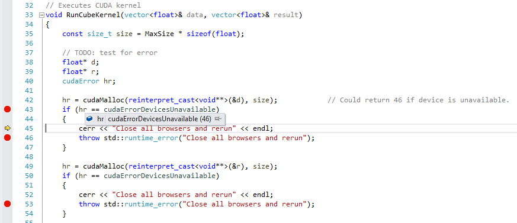

<h1>Source Code Files</h1>
<dl><dt>program.cu </dt><dd>program entry and CUDA cube kernel. </dd></dl>
