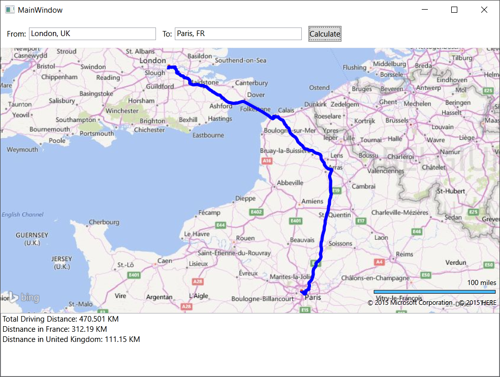
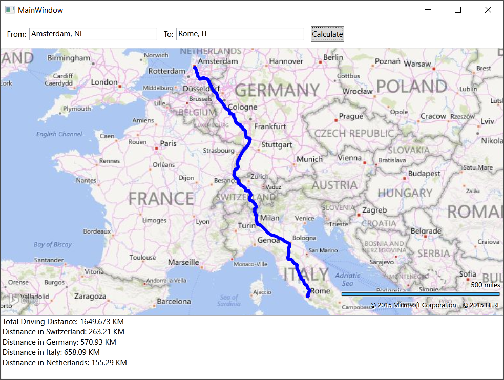

# Calculate Route Distances within Countries using Bing Maps
## Requires
- Visual Studio 2013
## License
- MIT
## Technologies
- WPF
- Bing Maps
- SQL Spatial
## Topics
- WPF
- Bing Maps
- SQL Spatial
## Updated
- 12/14/2015
## Description

<h1>Introduction</h1>

From time to time I have had some questions around how to calculate the distance traveled along a route inside of different countries. The basic idea being that someone has a route that crosses multiple countries and they want to know how far they drive
 in each country. There isn't a simple solution for this. What needs to be done is the route path needs to first be calculated using the Bing Maps Routing Service. Once you have this you can then use spatial tools and country boundary data to calculate the
 line segments inside each country. To do these calcualtions this code sample uses the SQL Spatial dll in .NET (no need to install SQL).

<h1>Building the Sample</h1>

Open the MainWindows.xaml file and add your Bing Maps key where it says <strong>
YOUR_BING_MAPS_KEY</strong>. If you don't have a Bing Maps key, you can get one here:
<a href="https://azure.microsoft.com/en-us/marketplace/partners/bingmaps/mapapis/">
https://azure.microsoft.com/en-us/marketplace/partners/bingmaps/mapapis/</a>

Description

Here is a couple of screenshots of this application with routes between locations in different countries:

One thing I noticed that makes sense when you think about it. There are situations where if you sum up all the distances for each country, they will be less than the total distance. This happens when countries have a gap between them (i.e. UK and France
 where the gap is the English channel). In these cases the gaps have no country boundaries and thus don&rsquo;t get calculated. There are a couple of ways to handle this. The first is to leave things as they are, the second is to sum up the distances inside
 of countries and then subtract this from the total to calculate this distance. Another option is to determine where these gaps are then split the distance and add it to the distances for the adjacent countries.

<strong>&nbsp;</strong><em>&nbsp;</em>

