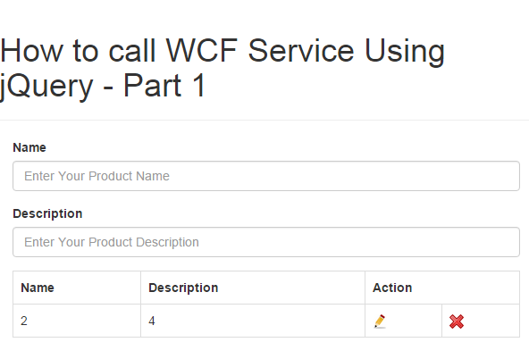

# Call WCF Service Using jQuery - Part 1
## Requires
- 
## License
- MIT
## Technologies
- C#
- JSON
- ASP.NET
- jQuery
- Javascript
- Entity Framework
- WCF Rest Service
## Topics
- WCF from jQuery &amp; using JSON for communication.
## Updated
- 10/07/2015
## Description

<h1>This sample contain the following method :</h1>
<ul>
<li>

Used WCF Service

</li><li>

Configuration Setting for WCF in web.config

</li><li>

Used JavaScript,JQuery and JSON.

</li><li>

Insert,Update and Delete data without refreshing page

</li></ul>
<h1>SQL Script for the Sample</h1>

<em>

SQL

Edit|Remove

mysql
<pre class="hidden">CREATE TABLE [dbo].[ProductInfo](  
    [Id] [int] IDENTITY(1,1) NOT NULL,  
    [ProductName] [varchar](max) NULL,  
    [ProductDescription] [varchar](max) NULL,  
    [CreatedDate] [datetime] DEFAULT GETDATE()  
)</pre>

<pre class="mysql">CREATE&nbsp;TABLE&nbsp;[dbo].[ProductInfo](&nbsp;&nbsp;&nbsp;
&nbsp;&nbsp;&nbsp;&nbsp;[Id]&nbsp;[int]&nbsp;IDENTITY(1,1)&nbsp;NOT&nbsp;NULL,&nbsp;&nbsp;&nbsp;
&nbsp;&nbsp;&nbsp;&nbsp;[ProductName]&nbsp;[varchar](max)&nbsp;NULL,&nbsp;&nbsp;&nbsp;
&nbsp;&nbsp;&nbsp;&nbsp;[ProductDescription]&nbsp;[varchar](max)&nbsp;NULL,&nbsp;&nbsp;&nbsp;
&nbsp;&nbsp;&nbsp;&nbsp;[CreatedDate]&nbsp;[datetime]&nbsp;DEFAULT&nbsp;GETDATE()&nbsp;&nbsp;&nbsp;
)</pre>

</em>

Configuration Setting for WCF<em>&nbsp;</em>

<ul>
<li>

&nbsp;This is service configuration setting.

</li><li>

&nbsp;We need to add service end point and behavior setting in web.config file.

</li><li>

&nbsp;there are so many way to host wcf service like self hosting, WAS, IIS and Window service.

</li></ul>

C#

Edit|Remove

csharp
<pre class="hidden">&lt;system.serviceModel&gt;  
  &lt;behaviors&gt;  
    &lt;endpointBehaviors&gt;  
      &lt;behavior name=&quot;AspNetAjaxBehavior&quot;&gt;  
        &lt;enableWebScript /&gt;  
      &lt;/behavior&gt;  
    &lt;/endpointBehaviors&gt;  
  &lt;/behaviors&gt;  
  &lt;serviceHostingEnvironment aspNetCompatibilityEnabled=&quot;true&quot; /&gt;  
  &lt;services&gt;  
    &lt;service name=&quot;WCFService.ProductService&quot;&gt;  
      &lt;endpoint behaviorConfiguration=&quot;AspNetAjaxBehavior&quot; binding=&quot;webHttpBinding&quot;  
       contract=&quot;WCFService.IProductService&quot; /&gt;  
    &lt;/service&gt;  
  &lt;/services&gt;  
&lt;/system.serviceModel&gt;</pre>

<pre class="csharp">&lt;system.serviceModel&gt;&nbsp;&nbsp;&nbsp;
&nbsp;&nbsp;&lt;behaviors&gt;&nbsp;&nbsp;&nbsp;
&nbsp;&nbsp;&nbsp;&nbsp;&lt;endpointBehaviors&gt;&nbsp;&nbsp;&nbsp;
&nbsp;&nbsp;&nbsp;&nbsp;&nbsp;&nbsp;&lt;behavior&nbsp;name=&quot;AspNetAjaxBehavior&quot;&gt;&nbsp;&nbsp;&nbsp;
&nbsp;&nbsp;&nbsp;&nbsp;&nbsp;&nbsp;&nbsp;&nbsp;&lt;enableWebScript&nbsp;/&gt;&nbsp;&nbsp;&nbsp;
&nbsp;&nbsp;&nbsp;&nbsp;&nbsp;&nbsp;&lt;/behavior&gt;&nbsp;&nbsp;&nbsp;
&nbsp;&nbsp;&nbsp;&nbsp;&lt;/endpointBehaviors&gt;&nbsp;&nbsp;&nbsp;
&nbsp;&nbsp;&lt;/behaviors&gt;&nbsp;&nbsp;&nbsp;
&nbsp;&nbsp;&lt;serviceHostingEnvironment&nbsp;aspNetCompatibilityEnabled=&quot;true&quot;&nbsp;/&gt;&nbsp;&nbsp;&nbsp;
&nbsp;&nbsp;&lt;services&gt;&nbsp;&nbsp;&nbsp;
&nbsp;&nbsp;&nbsp;&nbsp;&lt;service&nbsp;name=&quot;WCFService.ProductService&quot;&gt;&nbsp;&nbsp;&nbsp;
&nbsp;&nbsp;&nbsp;&nbsp;&nbsp;&nbsp;&lt;endpoint&nbsp;behaviorConfiguration=&quot;AspNetAjaxBehavior&quot;&nbsp;binding=&quot;webHttpBinding&quot;&nbsp;&nbsp;&nbsp;
&nbsp;&nbsp;&nbsp;&nbsp;&nbsp;&nbsp;&nbsp;contract=&quot;WCFService.IProductService&quot;&nbsp;/&gt;&nbsp;&nbsp;&nbsp;
&nbsp;&nbsp;&nbsp;&nbsp;&lt;/service&gt;&nbsp;&nbsp;&nbsp;
&nbsp;&nbsp;&lt;/services&gt;&nbsp;&nbsp;&nbsp;
&lt;/system.serviceModel&gt;</pre>

<ul>
<li>I add a script reference inside scriptmanager.&nbsp;
</li></ul>

C#

Edit|Remove

csharp
<pre class="hidden">&lt;asp:ScriptManager runat=&quot;server&quot;&gt;  
     &lt;Scripts&gt;  
        &lt;asp:ScriptReference Path=&quot;~/Script/Product.js&quot; /&gt;  
      &lt;/Scripts&gt;  
      &lt;Services&gt;  
         asp:ServiceReference Path=&quot;~/ProductService.svc&quot; /&gt; 
      &lt;/Services&gt;  
&lt;/asp:ScriptManager&gt;</pre>

<pre class="js">&lt;asp:ScriptManager&nbsp;runat=&quot;server&quot;&gt;&nbsp;&nbsp;&nbsp;
&nbsp;&nbsp;&nbsp;&nbsp;&nbsp;&lt;Scripts&gt;&nbsp;&nbsp;&nbsp;
&nbsp;&nbsp;&nbsp;&nbsp;&nbsp;&nbsp;&nbsp;&nbsp;&lt;asp:ScriptReference&nbsp;Path=&quot;~/Script/Product.js&quot;&nbsp;/&gt;&nbsp;&nbsp;&nbsp;
&nbsp;&nbsp;&nbsp;&nbsp;&nbsp;&nbsp;&lt;/Scripts&gt;&nbsp;&nbsp;&nbsp;
&nbsp;&nbsp;&nbsp;&nbsp;&nbsp;&nbsp;&lt;Services&gt;&nbsp;&nbsp;&nbsp;
&nbsp;&nbsp;&nbsp;&nbsp;&nbsp;&nbsp;&nbsp;&nbsp;&nbsp;asp:ServiceReference&nbsp;Path=&quot;~/ProductService.svc&quot;&nbsp;/&gt;&nbsp;&nbsp;
&nbsp;&nbsp;&nbsp;&nbsp;&nbsp;&nbsp;&lt;/Services&gt;&nbsp;&nbsp;&nbsp;
&lt;/asp:ScriptManager&gt;</pre>

<h1>Service File</h1>

C#

Edit|Remove

csharp
<pre class="hidden">[ServiceContract(Namespace = &quot;WCFService&quot;)] 
[AspNetCompatibilityRequirements(RequirementsMode = AspNetCompatibilityRequirementsMode.Allowed)]    
public class ProductService
{    

    //my context
    readonly TestProductEntities _testProductEntities = new  TestProductEntities();    
  
    [OperationContract] 
    [WebInvoke(Method = &quot;POST&quot;, BodyStyle = WebMessageBodyStyle.WrappedRequest, RequestFormat = WebMessageFormat.Json, ResponseFormat = WebMessageFormat.Json)]    
    public string LoadAllProductDetail()    
    {    
        try    
        {    
            var productDetail = (from s in _testProductEntities.ProductInfoes    
                                 select s).ToList();    
  
            var serializer = new JavaScriptSerializer();    
            return (serializer.Serialize(productDetail.ToList()));    
        }    
        catch (Exception ex)    
        {    
            throw ex;    
        }    
    }    
} </pre>

<pre class="js">[ServiceContract(Namespace&nbsp;=&nbsp;&quot;WCFService&quot;)]&nbsp;&nbsp;
[AspNetCompatibilityRequirements(RequirementsMode&nbsp;=&nbsp;AspNetCompatibilityRequirementsMode.Allowed)]&nbsp;&nbsp;&nbsp;&nbsp;&nbsp;
public&nbsp;class&nbsp;ProductService&nbsp;
{&nbsp;&nbsp;&nbsp;&nbsp;&nbsp;
&nbsp;
&nbsp;&nbsp;&nbsp;&nbsp;//my&nbsp;context&nbsp;
&nbsp;&nbsp;&nbsp;&nbsp;readonly&nbsp;TestProductEntities&nbsp;_testProductEntities&nbsp;=&nbsp;new&nbsp;&nbsp;TestProductEntities();&nbsp;&nbsp;&nbsp;&nbsp;&nbsp;
&nbsp;&nbsp;&nbsp;
&nbsp;&nbsp;&nbsp;&nbsp;[OperationContract]&nbsp;&nbsp;
&nbsp;&nbsp;&nbsp;&nbsp;[WebInvoke(Method&nbsp;=&nbsp;&quot;POST&quot;,&nbsp;BodyStyle&nbsp;=&nbsp;WebMessageBodyStyle.WrappedRequest,&nbsp;RequestFormat&nbsp;=&nbsp;WebMessageFormat.Json,&nbsp;ResponseFormat&nbsp;=&nbsp;WebMessageFormat.Json)]&nbsp;&nbsp;&nbsp;&nbsp;&nbsp;
&nbsp;&nbsp;&nbsp;&nbsp;public&nbsp;string&nbsp;LoadAllProductDetail()&nbsp;&nbsp;&nbsp;&nbsp;&nbsp;
&nbsp;&nbsp;&nbsp;&nbsp;{&nbsp;&nbsp;&nbsp;&nbsp;&nbsp;
&nbsp;&nbsp;&nbsp;&nbsp;&nbsp;&nbsp;&nbsp;&nbsp;try&nbsp;&nbsp;&nbsp;&nbsp;&nbsp;
&nbsp;&nbsp;&nbsp;&nbsp;&nbsp;&nbsp;&nbsp;&nbsp;{&nbsp;&nbsp;&nbsp;&nbsp;&nbsp;
&nbsp;&nbsp;&nbsp;&nbsp;&nbsp;&nbsp;&nbsp;&nbsp;&nbsp;&nbsp;&nbsp;&nbsp;var&nbsp;productDetail&nbsp;=&nbsp;(from&nbsp;s&nbsp;in&nbsp;_testProductEntities.ProductInfoes&nbsp;&nbsp;&nbsp;&nbsp;&nbsp;
&nbsp;&nbsp;&nbsp;&nbsp;&nbsp;&nbsp;&nbsp;&nbsp;&nbsp;&nbsp;&nbsp;&nbsp;&nbsp;&nbsp;&nbsp;&nbsp;&nbsp;&nbsp;&nbsp;&nbsp;&nbsp;&nbsp;&nbsp;&nbsp;&nbsp;&nbsp;&nbsp;&nbsp;&nbsp;&nbsp;&nbsp;&nbsp;&nbsp;select&nbsp;s).ToList();&nbsp;&nbsp;&nbsp;&nbsp;&nbsp;
&nbsp;&nbsp;&nbsp;
&nbsp;&nbsp;&nbsp;&nbsp;&nbsp;&nbsp;&nbsp;&nbsp;&nbsp;&nbsp;&nbsp;&nbsp;var&nbsp;serializer&nbsp;=&nbsp;new&nbsp;JavaScriptSerializer();&nbsp;&nbsp;&nbsp;&nbsp;&nbsp;
&nbsp;&nbsp;&nbsp;&nbsp;&nbsp;&nbsp;&nbsp;&nbsp;&nbsp;&nbsp;&nbsp;&nbsp;return&nbsp;(serializer.Serialize(productDetail.ToList()));&nbsp;&nbsp;&nbsp;&nbsp;&nbsp;
&nbsp;&nbsp;&nbsp;&nbsp;&nbsp;&nbsp;&nbsp;&nbsp;}&nbsp;&nbsp;&nbsp;&nbsp;&nbsp;
&nbsp;&nbsp;&nbsp;&nbsp;&nbsp;&nbsp;&nbsp;&nbsp;catch&nbsp;(Exception&nbsp;ex)&nbsp;&nbsp;&nbsp;&nbsp;&nbsp;
&nbsp;&nbsp;&nbsp;&nbsp;&nbsp;&nbsp;&nbsp;&nbsp;{&nbsp;&nbsp;&nbsp;&nbsp;&nbsp;
&nbsp;&nbsp;&nbsp;&nbsp;&nbsp;&nbsp;&nbsp;&nbsp;&nbsp;&nbsp;&nbsp;&nbsp;throw&nbsp;ex;&nbsp;&nbsp;&nbsp;&nbsp;&nbsp;
&nbsp;&nbsp;&nbsp;&nbsp;&nbsp;&nbsp;&nbsp;&nbsp;}&nbsp;&nbsp;&nbsp;&nbsp;&nbsp;
&nbsp;&nbsp;&nbsp;&nbsp;}&nbsp;&nbsp;&nbsp;&nbsp;&nbsp;
}&nbsp;</pre>

<h1>JS File</h1>

JavaScript

Edit|Remove

js
<pre class="hidden">$(document).ready(function () {  
    LoadProduct();  
});  
  
function BindProduct(results) {  
    var myJsonString = JSON.parse(results);  
    var string = &quot;&lt;table class='table table-bordered'&gt;&lt;tbody&gt;&quot;;  
    string &#43;= '&lt;tr&gt;&lt;th&gt;Name&lt;/th&gt;&lt;th&gt;Description&lt;/th&gt;&lt;th colspan=&quot;2&quot;&gt;Action&lt;/th&gt;&lt;/tr&gt;';  
    if (myJsonString.length &gt; 0) {  
        for (var i = 0; i &lt; myJsonString.length; i&#43;&#43;) {  
            string &#43;= '&lt;tr&gt;&lt;td&gt;' &#43; myJsonString[i].ProductName &#43; '&lt;/td&gt;';  
            string &#43;= '&lt;td&gt;' &#43; myJsonString[i].ProductDescription &#43; '&lt;/td&gt;';  
            string &#43;= '&lt;td&gt;&lt;span&gt;&lt;a href=&quot;javascript:void(0);&quot; ' &#43; ' onclick=&quot;EditProduct(' &#43; myJsonString[i].Id &#43; ');&quot;&gt;';  
            string &#43;= '&lt;img width=&quot;16&quot; height=&quot;16&quot; alt=&quot;Close&quot; src=&quot;Image/Edit.jpg&quot; /&gt;&lt;/a&gt;&lt;/span&gt;&lt;/td&gt;';  
            string &#43;= '&lt;td&gt;&lt;span&gt;&lt;a href=&quot;javascript:void(0);&quot; ' &#43; ' onclick=&quot;DeleteProduct(' &#43; myJsonString[i].Id &#43; ');&quot;&gt;';  
            string &#43;= '&lt;img width=&quot;16&quot; height=&quot;16&quot; alt=&quot;Close&quot; src=&quot;Image/close.png&quot; /&gt;&lt;/a&gt;&lt;/span&gt;&lt;/td&gt;&lt;/tr&gt;';  
        }  
    }  
    string = string &#43; &quot;&lt;/tbody&gt;&lt;/table&gt;&quot;;  
    $(&quot;#bindProduct&quot;).html(string);  
}  
  
function LoadProduct() {  
    WCFService.IProductService.LoadAllProductDetail(BindProduct, LoadProduct_success, LoadProduct_fail);  
}  
  
function LoadProduct_success() {  
  
}  
  
function LoadProduct_fail() {  
    alert(&quot;LoadProduct_fail&quot;);  
}</pre>

<pre class="js">$(document).ready(function&nbsp;()&nbsp;{&nbsp;&nbsp;&nbsp;
&nbsp;&nbsp;&nbsp;&nbsp;LoadProduct();&nbsp;&nbsp;&nbsp;
});&nbsp;&nbsp;&nbsp;
&nbsp;&nbsp;&nbsp;
function&nbsp;BindProduct(results)&nbsp;{&nbsp;&nbsp;&nbsp;
&nbsp;&nbsp;&nbsp;&nbsp;var&nbsp;myJsonString&nbsp;=&nbsp;JSON.parse(results);&nbsp;&nbsp;&nbsp;
&nbsp;&nbsp;&nbsp;&nbsp;var&nbsp;string&nbsp;=&nbsp;&quot;&lt;table&nbsp;class='table&nbsp;table-bordered'&gt;&lt;tbody&gt;&quot;;&nbsp;&nbsp;&nbsp;
&nbsp;&nbsp;&nbsp;&nbsp;string&nbsp;&#43;=&nbsp;'&lt;tr&gt;&lt;th&gt;Name&lt;/th&gt;&lt;th&gt;Description&lt;/th&gt;&lt;th&nbsp;colspan=&quot;2&quot;&gt;Action&lt;/th&gt;&lt;/tr&gt;';&nbsp;&nbsp;&nbsp;
&nbsp;&nbsp;&nbsp;&nbsp;if&nbsp;(myJsonString.length&nbsp;&gt;&nbsp;0)&nbsp;{&nbsp;&nbsp;&nbsp;
&nbsp;&nbsp;&nbsp;&nbsp;&nbsp;&nbsp;&nbsp;&nbsp;for&nbsp;(var&nbsp;i&nbsp;=&nbsp;0;&nbsp;i&nbsp;&lt;&nbsp;myJsonString.length;&nbsp;i&#43;&#43;)&nbsp;{&nbsp;&nbsp;&nbsp;
&nbsp;&nbsp;&nbsp;&nbsp;&nbsp;&nbsp;&nbsp;&nbsp;&nbsp;&nbsp;&nbsp;&nbsp;string&nbsp;&#43;=&nbsp;'&lt;tr&gt;&lt;td&gt;'&nbsp;&#43;&nbsp;myJsonString[i].ProductName&nbsp;&#43;&nbsp;'&lt;/td&gt;';&nbsp;&nbsp;&nbsp;
&nbsp;&nbsp;&nbsp;&nbsp;&nbsp;&nbsp;&nbsp;&nbsp;&nbsp;&nbsp;&nbsp;&nbsp;string&nbsp;&#43;=&nbsp;'&lt;td&gt;'&nbsp;&#43;&nbsp;myJsonString[i].ProductDescription&nbsp;&#43;&nbsp;'&lt;/td&gt;';&nbsp;&nbsp;&nbsp;
&nbsp;&nbsp;&nbsp;&nbsp;&nbsp;&nbsp;&nbsp;&nbsp;&nbsp;&nbsp;&nbsp;&nbsp;string&nbsp;&#43;=&nbsp;'&lt;td&gt;&lt;span&gt;&lt;a&nbsp;href=&quot;javascript:void(0);&quot;&nbsp;'&nbsp;&#43;&nbsp;'&nbsp;onclick=&quot;EditProduct('&nbsp;&#43;&nbsp;myJsonString[i].Id&nbsp;&#43;&nbsp;');&quot;&gt;';&nbsp;&nbsp;&nbsp;
&nbsp;&nbsp;&nbsp;&nbsp;&nbsp;&nbsp;&nbsp;&nbsp;&nbsp;&nbsp;&nbsp;&nbsp;string&nbsp;&#43;=&nbsp;'&lt;img&nbsp;width=&quot;16&quot;&nbsp;height=&quot;16&quot;&nbsp;alt=&quot;Close&quot;&nbsp;src=&quot;Image/Edit.jpg&quot;&nbsp;/&gt;&lt;/a&gt;&lt;/span&gt;&lt;/td&gt;';&nbsp;&nbsp;&nbsp;
&nbsp;&nbsp;&nbsp;&nbsp;&nbsp;&nbsp;&nbsp;&nbsp;&nbsp;&nbsp;&nbsp;&nbsp;string&nbsp;&#43;=&nbsp;'&lt;td&gt;&lt;span&gt;&lt;a&nbsp;href=&quot;javascript:void(0);&quot;&nbsp;'&nbsp;&#43;&nbsp;'&nbsp;onclick=&quot;DeleteProduct('&nbsp;&#43;&nbsp;myJsonString[i].Id&nbsp;&#43;&nbsp;');&quot;&gt;';&nbsp;&nbsp;&nbsp;
&nbsp;&nbsp;&nbsp;&nbsp;&nbsp;&nbsp;&nbsp;&nbsp;&nbsp;&nbsp;&nbsp;&nbsp;string&nbsp;&#43;=&nbsp;'&lt;img&nbsp;width=&quot;16&quot;&nbsp;height=&quot;16&quot;&nbsp;alt=&quot;Close&quot;&nbsp;src=&quot;Image/close.png&quot;&nbsp;/&gt;&lt;/a&gt;&lt;/span&gt;&lt;/td&gt;&lt;/tr&gt;';&nbsp;&nbsp;&nbsp;
&nbsp;&nbsp;&nbsp;&nbsp;&nbsp;&nbsp;&nbsp;&nbsp;}&nbsp;&nbsp;&nbsp;
&nbsp;&nbsp;&nbsp;&nbsp;}&nbsp;&nbsp;&nbsp;
&nbsp;&nbsp;&nbsp;&nbsp;string&nbsp;=&nbsp;string&nbsp;&#43;&nbsp;&quot;&lt;/tbody&gt;&lt;/table&gt;&quot;;&nbsp;&nbsp;&nbsp;
&nbsp;&nbsp;&nbsp;&nbsp;$(&quot;#bindProduct&quot;).html(string);&nbsp;&nbsp;&nbsp;
}&nbsp;&nbsp;&nbsp;
&nbsp;&nbsp;&nbsp;
function&nbsp;LoadProduct()&nbsp;{&nbsp;&nbsp;&nbsp;
&nbsp;&nbsp;&nbsp;&nbsp;WCFService.IProductService.LoadAllProductDetail(BindProduct,&nbsp;LoadProduct_success,&nbsp;LoadProduct_fail);&nbsp;&nbsp;&nbsp;
}&nbsp;&nbsp;&nbsp;
&nbsp;&nbsp;&nbsp;
function&nbsp;LoadProduct_success()&nbsp;{&nbsp;&nbsp;&nbsp;
&nbsp;&nbsp;&nbsp;
}&nbsp;&nbsp;&nbsp;
&nbsp;&nbsp;&nbsp;
function&nbsp;LoadProduct_fail()&nbsp;{&nbsp;&nbsp;&nbsp;
&nbsp;&nbsp;&nbsp;&nbsp;alert(&quot;LoadProduct_fail&quot;);&nbsp;&nbsp;&nbsp;
}</pre>

&nbsp;

<h1>Download Source Code :&nbsp;<a id="143333" href="/Call-WCF-Service-Using-5cb8ea71/file/143333/1/WCFDemoApplication.rar">WCFDemoApplication.rar</a></h1>

&nbsp;

<h1>Test Output Here :&nbsp;<a class="title" title="Test Here" href="http://www.wcfdemo.somee.com/" target="_blank">http://www.wcfdemo.somee.com/</a></h1>
<h1>Output Image</h1>

&nbsp;

<strong> 
</strong>

<ul style="outline:none 0px">
<li style="outline:none 0px">&nbsp; </li></ul>

<ol class="dp-vb" style="outline:none 0px; padding:0px; border:none; color:#5c5c5c; margin:0px 1px 1px 45px!important; background-color:#ffffff">
<li class="alt" style="outline:none 0px; border-style:none none none solid; border-left-width:3px; border-left-color:#6ce26c; list-style:decimal-leading-zero outside; color:inherit; line-height:14px; margin:0px!important; padding:0px 3px 0px 10px!important">
&lt;asp:ScriptManager&nbsp;runat=&quot;server&quot;&gt;&nbsp;&nbsp;
</li><li style="outline:none 0px; border-style:none none none solid; border-left-width:3px; border-left-color:#6ce26c; list-style:decimal-leading-zero outside; line-height:14px; margin:0px!important; padding:0px 3px 0px 10px!important; background-color:#f8f8f8">
&nbsp; &nbsp; &nbsp;&lt;Scripts&gt;&nbsp;&nbsp;
</li><li class="alt" style="outline:none 0px; border-style:none none none solid; border-left-width:3px; border-left-color:#6ce26c; list-style:decimal-leading-zero outside; color:inherit; line-height:14px; margin:0px!important; padding:0px 3px 0px 10px!important">
&nbsp; &nbsp; &nbsp;&nbsp;&nbsp;&nbsp;&lt;asp:ScriptReference&nbsp;Path=&quot;~/Script/Product.js&quot;&nbsp;/&gt;&nbsp;&nbsp;
</li><li style="outline:none 0px; border-style:none none none solid; border-left-width:3px; border-left-color:#6ce26c; list-style:decimal-leading-zero outside; line-height:14px; margin:0px!important; padding:0px 3px 0px 10px!important; background-color:#f8f8f8">
&nbsp; &nbsp; &nbsp; &lt;/Scripts&gt;&nbsp;&nbsp;
</li><li class="alt" style="outline:none 0px; border-style:none none none solid; border-left-width:3px; border-left-color:#6ce26c; list-style:decimal-leading-zero outside; color:inherit; line-height:14px; margin:0px!important; padding:0px 3px 0px 10px!important">
&nbsp; &nbsp; &nbsp; &lt;Services&gt;&nbsp;&nbsp;
</li><li style="outline:none 0px; border-style:none none none solid; border-left-width:3px; border-left-color:#6ce26c; list-style:decimal-leading-zero outside; line-height:14px; margin:0px!important; padding:0px 3px 0px 10px!important; background-color:#f8f8f8">
&nbsp; &nbsp; &nbsp; &nbsp; &nbsp;asp:ServiceReference&nbsp;Path=&quot;~/ProductService.svc&quot;&nbsp;/&gt;&nbsp;&nbsp;
</li><li class="alt" style="outline:none 0px; border-style:none none none solid; border-left-width:3px; border-left-color:#6ce26c; list-style:decimal-leading-zero outside; color:inherit; line-height:14px; margin:0px!important; padding:0px 3px 0px 10px!important">
&nbsp; &nbsp; &nbsp; &lt;/Services&gt;&nbsp;&nbsp;
</li><li style="outline:none 0px; border-style:none none none solid; border-left-width:3px; border-left-color:#6ce26c; list-style:decimal-leading-zero outside; line-height:14px; margin:0px!important; padding:0px 3px 0px 10px!important; background-color:#f8f8f8">
&lt;/asp:ScriptManager&gt;&nbsp;&nbsp;
</li></ol>

<strong style="outline:none 0px">IproductService.cs page</strong>

<ul style="outline:none 0px">
<li style="outline:none 0px">&nbsp;The following interface method contain insert, update, delete definition only which is used in service call. 

<ol class="dp-c" style="outline:none 0px; padding:0px; border:none; color:#5c5c5c; margin:0px 1px 1px 45px!important; background-color:#ffffff">
<li class="alt" style="outline:none 0px; border-style:none none none solid; border-left-width:3px; border-left-color:#6ce26c; list-style:decimal-leading-zero outside; color:inherit; line-height:14px; margin:0px!important; padding:0px 3px 0px 10px!important">
[ServiceContract(Namespace&nbsp;=&nbsp;&quot;WCFService&quot;)]&nbsp;&nbsp;&nbsp;&nbsp;
</li><li style="outline:none 0px; border-style:none none none solid; border-left-width:3px; border-left-color:#6ce26c; list-style:decimal-leading-zero outside; line-height:14px; margin:0px!important; padding:0px 3px 0px 10px!important; background-color:#f8f8f8">
interface&nbsp;IProductService&nbsp;&nbsp;&nbsp;&nbsp;
</li><li class="alt" style="outline:none 0px; border-style:none none none solid; border-left-width:3px; border-left-color:#6ce26c; list-style:decimal-leading-zero outside; color:inherit; line-height:14px; margin:0px!important; padding:0px 3px 0px 10px!important">
{&nbsp;&nbsp;&nbsp;&nbsp;
</li><li style="outline:none 0px; border-style:none none none solid; border-left-width:3px; border-left-color:#6ce26c; list-style:decimal-leading-zero outside; line-height:14px; margin:0px!important; padding:0px 3px 0px 10px!important; background-color:#f8f8f8">
&nbsp;&nbsp;&nbsp;&nbsp;[OperationContract]&nbsp;&nbsp;&nbsp;&nbsp;
</li><li class="alt" style="outline:none 0px; border-style:none none none solid; border-left-width:3px; border-left-color:#6ce26c; list-style:decimal-leading-zero outside; color:inherit; line-height:14px; margin:0px!important; padding:0px 3px 0px 10px!important">
&nbsp;&nbsp;&nbsp;&nbsp;void&nbsp;AddProductDetail(string&nbsp;productName,&nbsp;string&nbsp;productDescription);&nbsp;&nbsp;&nbsp;&nbsp;
</li><li style="outline:none 0px; border-style:none none none solid; border-left-width:3px; border-left-color:#6ce26c; list-style:decimal-leading-zero outside; line-height:14px; margin:0px!important; padding:0px 3px 0px 10px!important; background-color:#f8f8f8">
&nbsp;&nbsp;
</li><li class="alt" style="outline:none 0px; border-style:none none none solid; border-left-width:3px; border-left-color:#6ce26c; list-style:decimal-leading-zero outside; color:inherit; line-height:14px; margin:0px!important; padding:0px 3px 0px 10px!important">
&nbsp;&nbsp;&nbsp;&nbsp;[OperationContract]&nbsp;&nbsp;&nbsp;&nbsp;
</li><li style="outline:none 0px; border-style:none none none solid; border-left-width:3px; border-left-color:#6ce26c; list-style:decimal-leading-zero outside; line-height:14px; margin:0px!important; padding:0px 3px 0px 10px!important; background-color:#f8f8f8">
&nbsp;&nbsp;&nbsp;&nbsp;void&nbsp;UpdateProductDetail(int&nbsp;updateId,&nbsp;string&nbsp;productName,&nbsp;string&nbsp;productDescription);&nbsp;&nbsp;&nbsp;&nbsp;
</li><li class="alt" style="outline:none 0px; border-style:none none none solid; border-left-width:3px; border-left-color:#6ce26c; list-style:decimal-leading-zero outside; color:inherit; line-height:14px; margin:0px!important; padding:0px 3px 0px 10px!important">
&nbsp;&nbsp;
</li><li style="outline:none 0px; border-style:none none none solid; border-left-width:3px; border-left-color:#6ce26c; list-style:decimal-leading-zero outside; line-height:14px; margin:0px!important; padding:0px 3px 0px 10px!important; background-color:#f8f8f8">
&nbsp;&nbsp;&nbsp;&nbsp;[OperationContract]&nbsp;&nbsp;&nbsp;&nbsp;
</li><li class="alt" style="outline:none 0px; border-style:none none none solid; border-left-width:3px; border-left-color:#6ce26c; list-style:decimal-leading-zero outside; color:inherit; line-height:14px; margin:0px!important; padding:0px 3px 0px 10px!important">
&nbsp;&nbsp;&nbsp;&nbsp;void&nbsp;DeleteProductDetail(int&nbsp;id);&nbsp;&nbsp;&nbsp;&nbsp;
</li><li style="outline:none 0px; border-style:none none none solid; border-left-width:3px; border-left-color:#6ce26c; list-style:decimal-leading-zero outside; line-height:14px; margin:0px!important; padding:0px 3px 0px 10px!important; background-color:#f8f8f8">
&nbsp;&nbsp;
</li><li class="alt" style="outline:none 0px; border-style:none none none solid; border-left-width:3px; border-left-color:#6ce26c; list-style:decimal-leading-zero outside; color:inherit; line-height:14px; margin:0px!important; padding:0px 3px 0px 10px!important">
&nbsp;&nbsp;&nbsp;&nbsp;[OperationContract]&nbsp;&nbsp;&nbsp;&nbsp;
</li><li style="outline:none 0px; border-style:none none none solid; border-left-width:3px; border-left-color:#6ce26c; list-style:decimal-leading-zero outside; line-height:14px; margin:0px!important; padding:0px 3px 0px 10px!important; background-color:#f8f8f8">
&nbsp;&nbsp;&nbsp;&nbsp;string&nbsp;EditProductDetail(int&nbsp;id);&nbsp;&nbsp;&nbsp;&nbsp;
</li><li class="alt" style="outline:none 0px; border-style:none none none solid; border-left-width:3px; border-left-color:#6ce26c; list-style:decimal-leading-zero outside; color:inherit; line-height:14px; margin:0px!important; padding:0px 3px 0px 10px!important">
&nbsp;&nbsp;
</li><li style="outline:none 0px; border-style:none none none solid; border-left-width:3px; border-left-color:#6ce26c; list-style:decimal-leading-zero outside; line-height:14px; margin:0px!important; padding:0px 3px 0px 10px!important; background-color:#f8f8f8">
&nbsp;&nbsp;&nbsp;&nbsp;[OperationContract]&nbsp;&nbsp;&nbsp;&nbsp;
</li><li class="alt" style="outline:none 0px; border-style:none none none solid; border-left-width:3px; border-left-color:#6ce26c; list-style:decimal-leading-zero outside; color:inherit; line-height:14px; margin:0px!important; padding:0px 3px 0px 10px!important">
&nbsp;&nbsp;&nbsp;&nbsp;string&nbsp;LoadAllProductDetail();&nbsp;&nbsp;&nbsp;&nbsp;
</li><li style="outline:none 0px; border-style:none none none solid; border-left-width:3px; border-left-color:#6ce26c; list-style:decimal-leading-zero outside; line-height:14px; margin:0px!important; padding:0px 3px 0px 10px!important; background-color:#f8f8f8">
&nbsp;&nbsp;
</li><li class="alt" style="outline:none 0px; border-style:none none none solid; border-left-width:3px; border-left-color:#6ce26c; list-style:decimal-leading-zero outside; color:inherit; line-height:14px; margin:0px!important; padding:0px 3px 0px 10px!important">
}&nbsp;&nbsp;&nbsp;&nbsp;
</li></ol>

</li></ul>

<strong style="outline:none 0px">productService.cs page</strong>

<ul style="outline:none 0px">
<li style="outline:none 0px">&nbsp;This file contain functionality which is mentioned in the above interface file. &nbsp; 

<ol class="dp-c" style="outline:none 0px; padding:0px; border:none; color:#5c5c5c; margin:0px 1px 1px 45px!important; background-color:#ffffff">
<li class="alt" style="outline:none 0px; border-style:none none none solid; border-left-width:3px; border-left-color:#6ce26c; list-style:decimal-leading-zero outside; color:inherit; line-height:14px; margin:0px!important; padding:0px 3px 0px 10px!important">
[AspNetCompatibilityRequirements(RequirementsMode&nbsp;=&nbsp;AspNetCompatibilityRequirementsMode.Allowed)]&nbsp;&nbsp;&nbsp;&nbsp;
</li><li style="outline:none 0px; border-style:none none none solid; border-left-width:3px; border-left-color:#6ce26c; list-style:decimal-leading-zero outside; line-height:14px; margin:0px!important; padding:0px 3px 0px 10px!important; background-color:#f8f8f8">
public&nbsp;class&nbsp;ProductService&nbsp;:&nbsp;IProductService&nbsp;&nbsp;&nbsp;&nbsp;
</li><li class="alt" style="outline:none 0px; border-style:none none none solid; border-left-width:3px; border-left-color:#6ce26c; list-style:decimal-leading-zero outside; color:inherit; line-height:14px; margin:0px!important; padding:0px 3px 0px 10px!important">
{&nbsp;&nbsp;&nbsp;&nbsp;
</li><li style="outline:none 0px; border-style:none none none solid; border-left-width:3px; border-left-color:#6ce26c; list-style:decimal-leading-zero outside; line-height:14px; margin:0px!important; padding:0px 3px 0px 10px!important; background-color:#f8f8f8">
&nbsp;&nbsp;&nbsp;&nbsp;#region&nbsp;&nbsp;IproductService&nbsp;Member&nbsp;&nbsp;&nbsp;&nbsp;
</li><li class="alt" style="outline:none 0px; border-style:none none none solid; border-left-width:3px; border-left-color:#6ce26c; list-style:decimal-leading-zero outside; color:inherit; line-height:14px; margin:0px!important; padding:0px 3px 0px 10px!important">
&nbsp;&nbsp;&nbsp;&nbsp;readonly&nbsp;TestProductEntities&nbsp;_testProductEntities&nbsp;=&nbsp;new&nbsp;&nbsp;TestProductEntities();&nbsp;&nbsp;&nbsp;&nbsp;
</li><li style="outline:none 0px; border-style:none none none solid; border-left-width:3px; border-left-color:#6ce26c; list-style:decimal-leading-zero outside; line-height:14px; margin:0px!important; padding:0px 3px 0px 10px!important; background-color:#f8f8f8">
&nbsp;&nbsp;
</li><li class="alt" style="outline:none 0px; border-style:none none none solid; border-left-width:3px; border-left-color:#6ce26c; list-style:decimal-leading-zero outside; color:inherit; line-height:14px; margin:0px!important; padding:0px 3px 0px 10px!important">
&nbsp;&nbsp;&nbsp;&nbsp;[WebInvoke(Method&nbsp;=&nbsp;&quot;POST&quot;,&nbsp;BodyStyle&nbsp;=&nbsp;WebMessageBodyStyle.WrappedRequest,&nbsp;RequestFormat&nbsp;=&nbsp;WebMessageFormat.Json,&nbsp;ResponseFormat&nbsp;=&nbsp;WebMessageFormat.Json)]&nbsp;&nbsp;&nbsp;&nbsp;
</li><li style="outline:none 0px; border-style:none none none solid; border-left-width:3px; border-left-color:#6ce26c; list-style:decimal-leading-zero outside; line-height:14px; margin:0px!important; padding:0px 3px 0px 10px!important; background-color:#f8f8f8">
&nbsp;&nbsp;&nbsp;&nbsp;public&nbsp;string&nbsp;LoadAllProductDetail()&nbsp;&nbsp;&nbsp;&nbsp;
</li><li class="alt" style="outline:none 0px; border-style:none none none solid; border-left-width:3px; border-left-color:#6ce26c; list-style:decimal-leading-zero outside; color:inherit; line-height:14px; margin:0px!important; padding:0px 3px 0px 10px!important">
&nbsp;&nbsp;&nbsp;&nbsp;{&nbsp;&nbsp;&nbsp;&nbsp;
</li><li style="outline:none 0px; border-style:none none none solid; border-left-width:3px; border-left-color:#6ce26c; list-style:decimal-leading-zero outside; line-height:14px; margin:0px!important; padding:0px 3px 0px 10px!important; background-color:#f8f8f8">
&nbsp;&nbsp;&nbsp;&nbsp;&nbsp;&nbsp;&nbsp;&nbsp;try&nbsp;&nbsp;&nbsp;&nbsp;
</li><li class="alt" style="outline:none 0px; border-style:none none none solid; border-left-width:3px; border-left-color:#6ce26c; list-style:decimal-leading-zero outside; color:inherit; line-height:14px; margin:0px!important; padding:0px 3px 0px 10px!important">
&nbsp;&nbsp;&nbsp;&nbsp;&nbsp;&nbsp;&nbsp;&nbsp;{&nbsp;&nbsp;&nbsp;&nbsp;
</li><li style="outline:none 0px; border-style:none none none solid; border-left-width:3px; border-left-color:#6ce26c; list-style:decimal-leading-zero outside; line-height:14px; margin:0px!important; padding:0px 3px 0px 10px!important; background-color:#f8f8f8">
&nbsp;&nbsp;&nbsp;&nbsp;&nbsp;&nbsp;&nbsp;&nbsp;&nbsp;&nbsp;&nbsp;&nbsp;var&nbsp;productDetail&nbsp;=&nbsp;(from&nbsp;s&nbsp;in&nbsp;_testProductEntities.ProductInfoes&nbsp;&nbsp;&nbsp;&nbsp;
</li><li class="alt" style="outline:none 0px; border-style:none none none solid; border-left-width:3px; border-left-color:#6ce26c; list-style:decimal-leading-zero outside; color:inherit; line-height:14px; margin:0px!important; padding:0px 3px 0px 10px!important">
&nbsp;&nbsp;&nbsp;&nbsp;&nbsp;&nbsp;&nbsp;&nbsp;&nbsp;&nbsp;&nbsp;&nbsp;&nbsp;&nbsp;&nbsp;&nbsp;&nbsp;&nbsp;&nbsp;&nbsp;&nbsp;&nbsp;&nbsp;&nbsp;&nbsp;&nbsp;&nbsp;&nbsp;&nbsp;&nbsp;&nbsp;&nbsp;&nbsp;select&nbsp;s).ToList();&nbsp;&nbsp;&nbsp;&nbsp;
</li><li style="outline:none 0px; border-style:none none none solid; border-left-width:3px; border-left-color:#6ce26c; list-style:decimal-leading-zero outside; line-height:14px; margin:0px!important; padding:0px 3px 0px 10px!important; background-color:#f8f8f8">
&nbsp;&nbsp;
</li><li class="alt" style="outline:none 0px; border-style:none none none solid; border-left-width:3px; border-left-color:#6ce26c; list-style:decimal-leading-zero outside; color:inherit; line-height:14px; margin:0px!important; padding:0px 3px 0px 10px!important">
&nbsp;&nbsp;&nbsp;&nbsp;&nbsp;&nbsp;&nbsp;&nbsp;&nbsp;&nbsp;&nbsp;&nbsp;var&nbsp;serializer&nbsp;=&nbsp;new&nbsp;JavaScriptSerializer();&nbsp;&nbsp;&nbsp;&nbsp;
</li><li style="outline:none 0px; border-style:none none none solid; border-left-width:3px; border-left-color:#6ce26c; list-style:decimal-leading-zero outside; line-height:14px; margin:0px!important; padding:0px 3px 0px 10px!important; background-color:#f8f8f8">
&nbsp;&nbsp;&nbsp;&nbsp;&nbsp;&nbsp;&nbsp;&nbsp;&nbsp;&nbsp;&nbsp;&nbsp;return&nbsp;(serializer.Serialize(productDetail.ToList()));&nbsp;&nbsp;&nbsp;&nbsp;
</li><li class="alt" style="outline:none 0px; border-style:none none none solid; border-left-width:3px; border-left-color:#6ce26c; list-style:decimal-leading-zero outside; color:inherit; line-height:14px; margin:0px!important; padding:0px 3px 0px 10px!important">
&nbsp;&nbsp;&nbsp;&nbsp;&nbsp;&nbsp;&nbsp;&nbsp;}&nbsp;&nbsp;&nbsp;&nbsp;
</li><li style="outline:none 0px; border-style:none none none solid; border-left-width:3px; border-left-color:#6ce26c; list-style:decimal-leading-zero outside; line-height:14px; margin:0px!important; padding:0px 3px 0px 10px!important; background-color:#f8f8f8">
&nbsp;&nbsp;&nbsp;&nbsp;&nbsp;&nbsp;&nbsp;&nbsp;catch&nbsp;(Exception&nbsp;ex)&nbsp;&nbsp;&nbsp;&nbsp;
</li><li class="alt" style="outline:none 0px; border-style:none none none solid; border-left-width:3px; border-left-color:#6ce26c; list-style:decimal-leading-zero outside; color:inherit; line-height:14px; margin:0px!important; padding:0px 3px 0px 10px!important">
&nbsp;&nbsp;&nbsp;&nbsp;&nbsp;&nbsp;&nbsp;&nbsp;{&nbsp;&nbsp;&nbsp;&nbsp;
</li><li style="outline:none 0px; border-style:none none none solid; border-left-width:3px; border-left-color:#6ce26c; list-style:decimal-leading-zero outside; line-height:14px; margin:0px!important; padding:0px 3px 0px 10px!important; background-color:#f8f8f8">
&nbsp;&nbsp;&nbsp;&nbsp;&nbsp;&nbsp;&nbsp;&nbsp;&nbsp;&nbsp;&nbsp;&nbsp;throw&nbsp;ex;&nbsp;&nbsp;&nbsp;&nbsp;
</li><li class="alt" style="outline:none 0px; border-style:none none none solid; border-left-width:3px; border-left-color:#6ce26c; list-style:decimal-leading-zero outside; color:inherit; line-height:14px; margin:0px!important; padding:0px 3px 0px 10px!important">
&nbsp;&nbsp;&nbsp;&nbsp;&nbsp;&nbsp;&nbsp;&nbsp;}&nbsp;&nbsp;&nbsp;&nbsp;
</li><li style="outline:none 0px; border-style:none none none solid; border-left-width:3px; border-left-color:#6ce26c; list-style:decimal-leading-zero outside; line-height:14px; margin:0px!important; padding:0px 3px 0px 10px!important; background-color:#f8f8f8">
&nbsp;&nbsp;&nbsp;&nbsp;}&nbsp;&nbsp;&nbsp;&nbsp;
</li><li class="alt" style="outline:none 0px; border-style:none none none solid; border-left-width:3px; border-left-color:#6ce26c; list-style:decimal-leading-zero outside; color:inherit; line-height:14px; margin:0px!important; padding:0px 3px 0px 10px!important">
&nbsp;&nbsp;&nbsp;&nbsp;#endregion&nbsp;&nbsp;&nbsp;&nbsp;
</li><li style="outline:none 0px; border-style:none none none solid; border-left-width:3px; border-left-color:#6ce26c; list-style:decimal-leading-zero outside; line-height:14px; margin:0px!important; padding:0px 3px 0px 10px!important; background-color:#f8f8f8">
}&nbsp;&nbsp;
</li></ol>

</li></ul>

<strong style="outline:none 0px">product.js page</strong>

<ul style="outline:none 0px">
<li style="outline:none 0px">&nbsp;This is my javascript file and highlighted area displays my service call.
</li></ul>

<ol class="dp-c" style="outline:none 0px; padding:0px; border:none; color:#5c5c5c; margin:0px 1px 1px 45px!important; background-color:#ffffff">
<li class="alt" style="outline:none 0px; border-style:none none none solid; border-left-width:3px; border-left-color:#6ce26c; list-style:decimal-leading-zero outside; color:inherit; line-height:14px; margin:0px!important; padding:0px 3px 0px 10px!important">
$(document).ready(function&nbsp;()&nbsp;{&nbsp;&nbsp;
</li><li style="outline:none 0px; border-style:none none none solid; border-left-width:3px; border-left-color:#6ce26c; list-style:decimal-leading-zero outside; line-height:14px; margin:0px!important; padding:0px 3px 0px 10px!important; background-color:#f8f8f8">
&nbsp;&nbsp;&nbsp;&nbsp;LoadProduct();&nbsp;&nbsp;
</li><li class="alt" style="outline:none 0px; border-style:none none none solid; border-left-width:3px; border-left-color:#6ce26c; list-style:decimal-leading-zero outside; color:inherit; line-height:14px; margin:0px!important; padding:0px 3px 0px 10px!important">
});&nbsp;&nbsp;
</li><li style="outline:none 0px; border-style:none none none solid; border-left-width:3px; border-left-color:#6ce26c; list-style:decimal-leading-zero outside; line-height:14px; margin:0px!important; padding:0px 3px 0px 10px!important; background-color:#f8f8f8">
&nbsp;&nbsp;
</li><li class="alt" style="outline:none 0px; border-style:none none none solid; border-left-width:3px; border-left-color:#6ce26c; list-style:decimal-leading-zero outside; color:inherit; line-height:14px; margin:0px!important; padding:0px 3px 0px 10px!important">
function&nbsp;BindProduct(results)&nbsp;{&nbsp;&nbsp;
</li><li style="outline:none 0px; border-style:none none none solid; border-left-width:3px; border-left-color:#6ce26c; list-style:decimal-leading-zero outside; line-height:14px; margin:0px!important; padding:0px 3px 0px 10px!important; background-color:#f8f8f8">
&nbsp;&nbsp;&nbsp;&nbsp;var&nbsp;myJsonString&nbsp;=&nbsp;JSON.parse(results);&nbsp;&nbsp;
</li><li class="alt" style="outline:none 0px; border-style:none none none solid; border-left-width:3px; border-left-color:#6ce26c; list-style:decimal-leading-zero outside; color:inherit; line-height:14px; margin:0px!important; padding:0px 3px 0px 10px!important">
&nbsp;&nbsp;&nbsp;&nbsp;var&nbsp;string&nbsp;=&nbsp;&quot;&lt;table&nbsp;class='table&nbsp;table-bordered'&gt;&lt;tbody&gt;&quot;;&nbsp;&nbsp;
</li><li style="outline:none 0px; border-style:none none none solid; border-left-width:3px; border-left-color:#6ce26c; list-style:decimal-leading-zero outside; line-height:14px; margin:0px!important; padding:0px 3px 0px 10px!important; background-color:#f8f8f8">
&nbsp;&nbsp;&nbsp;&nbsp;string&nbsp;&#43;=&nbsp;'&lt;tr&gt;&lt;th&gt;Name&lt;/th&gt;&lt;th&gt;Description&lt;/th&gt;&lt;th&nbsp;colspan=&quot;2&quot;&gt;Action&lt;/th&gt;&lt;/tr&gt;';&nbsp;&nbsp;
</li><li class="alt" style="outline:none 0px; border-style:none none none solid; border-left-width:3px; border-left-color:#6ce26c; list-style:decimal-leading-zero outside; color:inherit; line-height:14px; margin:0px!important; padding:0px 3px 0px 10px!important">
&nbsp;&nbsp;&nbsp;&nbsp;if&nbsp;(myJsonString.length&nbsp;&gt;&nbsp;0)&nbsp;{&nbsp;&nbsp;
</li><li style="outline:none 0px; border-style:none none none solid; border-left-width:3px; border-left-color:#6ce26c; list-style:decimal-leading-zero outside; line-height:14px; margin:0px!important; padding:0px 3px 0px 10px!important; background-color:#f8f8f8">
&nbsp;&nbsp;&nbsp;&nbsp;&nbsp;&nbsp;&nbsp;&nbsp;for&nbsp;(var&nbsp;i&nbsp;=&nbsp;0;&nbsp;i&nbsp;&lt;&nbsp;myJsonString.length;&nbsp;i&#43;&#43;)&nbsp;{&nbsp;&nbsp;
</li><li class="alt" style="outline:none 0px; border-style:none none none solid; border-left-width:3px; border-left-color:#6ce26c; list-style:decimal-leading-zero outside; color:inherit; line-height:14px; margin:0px!important; padding:0px 3px 0px 10px!important">
&nbsp;&nbsp;&nbsp;&nbsp;&nbsp;&nbsp;&nbsp;&nbsp;&nbsp;&nbsp;&nbsp;&nbsp;string&nbsp;&#43;=&nbsp;'&lt;tr&gt;&lt;td&gt;'&nbsp;&#43;&nbsp;myJsonString[i].ProductName&nbsp;&#43;&nbsp;'&lt;/td&gt;';&nbsp;&nbsp;
</li><li style="outline:none 0px; border-style:none none none solid; border-left-width:3px; border-left-color:#6ce26c; list-style:decimal-leading-zero outside; line-height:14px; margin:0px!important; padding:0px 3px 0px 10px!important; background-color:#f8f8f8">
&nbsp;&nbsp;&nbsp;&nbsp;&nbsp;&nbsp;&nbsp;&nbsp;&nbsp;&nbsp;&nbsp;&nbsp;string&nbsp;&#43;=&nbsp;'&lt;td&gt;'&nbsp;&#43;&nbsp;myJsonString[i].ProductDescription&nbsp;&#43;&nbsp;'&lt;/td&gt;';&nbsp;&nbsp;
</li><li class="alt" style="outline:none 0px; border-style:none none none solid; border-left-width:3px; border-left-color:#6ce26c; list-style:decimal-leading-zero outside; color:inherit; line-height:14px; margin:0px!important; padding:0px 3px 0px 10px!important">
&nbsp;&nbsp;&nbsp;&nbsp;&nbsp;&nbsp;&nbsp;&nbsp;&nbsp;&nbsp;&nbsp;&nbsp;string&nbsp;&#43;=&nbsp;'&lt;td&gt;&lt;span&gt;&lt;a&nbsp;href=&quot;javascript:void(0);&quot;&nbsp;'&nbsp;&#43;&nbsp;'&nbsp;onclick=&quot;EditProduct('&nbsp;&#43;&nbsp;myJsonString[i].Id&nbsp;&#43;&nbsp;');&quot;&gt;';&nbsp;&nbsp;
</li><li style="outline:none 0px; border-style:none none none solid; border-left-width:3px; border-left-color:#6ce26c; list-style:decimal-leading-zero outside; line-height:14px; margin:0px!important; padding:0px 3px 0px 10px!important; background-color:#f8f8f8">
&nbsp;&nbsp;&nbsp;&nbsp;&nbsp;&nbsp;&nbsp;&nbsp;&nbsp;&nbsp;&nbsp;&nbsp;string&nbsp;&#43;=&nbsp;'&lt;img&nbsp;width=&quot;16&quot;&nbsp;height=&quot;16&quot;&nbsp;alt=&quot;Close&quot;&nbsp;src=&quot;Image/Edit.jpg&quot;&nbsp;/&gt;&lt;/a&gt;&lt;/span&gt;&lt;/td&gt;';&nbsp;&nbsp;
</li><li class="alt" style="outline:none 0px; border-style:none none none solid; border-left-width:3px; border-left-color:#6ce26c; list-style:decimal-leading-zero outside; color:inherit; line-height:14px; margin:0px!important; padding:0px 3px 0px 10px!important">
&nbsp;&nbsp;&nbsp;&nbsp;&nbsp;&nbsp;&nbsp;&nbsp;&nbsp;&nbsp;&nbsp;&nbsp;string&nbsp;&#43;=&nbsp;'&lt;td&gt;&lt;span&gt;&lt;a&nbsp;href=&quot;javascript:void(0);&quot;&nbsp;'&nbsp;&#43;&nbsp;'&nbsp;onclick=&quot;DeleteProduct('&nbsp;&#43;&nbsp;myJsonString[i].Id&nbsp;&#43;&nbsp;');&quot;&gt;';&nbsp;&nbsp;
</li><li style="outline:none 0px; border-style:none none none solid; border-left-width:3px; border-left-color:#6ce26c; list-style:decimal-leading-zero outside; line-height:14px; margin:0px!important; padding:0px 3px 0px 10px!important; background-color:#f8f8f8">
&nbsp;&nbsp;&nbsp;&nbsp;&nbsp;&nbsp;&nbsp;&nbsp;&nbsp;&nbsp;&nbsp;&nbsp;string&nbsp;&#43;=&nbsp;'&lt;img&nbsp;width=&quot;16&quot;&nbsp;height=&quot;16&quot;&nbsp;alt=&quot;Close&quot;&nbsp;src=&quot;Image/close.png&quot;&nbsp;/&gt;&lt;/a&gt;&lt;/span&gt;&lt;/td&gt;&lt;/tr&gt;';&nbsp;&nbsp;
</li><li class="alt" style="outline:none 0px; border-style:none none none solid; border-left-width:3px; border-left-color:#6ce26c; list-style:decimal-leading-zero outside; color:inherit; line-height:14px; margin:0px!important; padding:0px 3px 0px 10px!important">
&nbsp;&nbsp;&nbsp;&nbsp;&nbsp;&nbsp;&nbsp;&nbsp;}&nbsp;&nbsp;
</li><li style="outline:none 0px; border-style:none none none solid; border-left-width:3px; border-left-color:#6ce26c; list-style:decimal-leading-zero outside; line-height:14px; margin:0px!important; padding:0px 3px 0px 10px!important; background-color:#f8f8f8">
&nbsp;&nbsp;&nbsp;&nbsp;}&nbsp;&nbsp;
</li><li class="alt" style="outline:none 0px; border-style:none none none solid; border-left-width:3px; border-left-color:#6ce26c; list-style:decimal-leading-zero outside; color:inherit; line-height:14px; margin:0px!important; padding:0px 3px 0px 10px!important">
&nbsp;&nbsp;&nbsp;&nbsp;string&nbsp;=&nbsp;string&nbsp;&#43;&nbsp;&quot;&lt;/tbody&gt;&lt;/table&gt;&quot;;&nbsp;&nbsp;
</li><li style="outline:none 0px; border-style:none none none solid; border-left-width:3px; border-left-color:#6ce26c; list-style:decimal-leading-zero outside; line-height:14px; margin:0px!important; padding:0px 3px 0px 10px!important; background-color:#f8f8f8">
&nbsp;&nbsp;&nbsp;&nbsp;$(&quot;#bindProduct&quot;).html(string);&nbsp;&nbsp;
</li><li class="alt" style="outline:none 0px; border-style:none none none solid; border-left-width:3px; border-left-color:#6ce26c; list-style:decimal-leading-zero outside; color:inherit; line-height:14px; margin:0px!important; padding:0px 3px 0px 10px!important">
}&nbsp;&nbsp;
</li><li style="outline:none 0px; border-style:none none none solid; border-left-width:3px; border-left-color:#6ce26c; list-style:decimal-leading-zero outside; line-height:14px; margin:0px!important; padding:0px 3px 0px 10px!important; background-color:#f8f8f8">
&nbsp;&nbsp;
</li><li class="alt" style="outline:none 0px; border-style:none none none solid; border-left-width:3px; border-left-color:#6ce26c; list-style:decimal-leading-zero outside; color:inherit; line-height:14px; margin:0px!important; padding:0px 3px 0px 10px!important">
function&nbsp;LoadProduct()&nbsp;{&nbsp;&nbsp;
</li><li style="outline:none 0px; border-style:none none none solid; border-left-width:3px; border-left-color:#6ce26c; list-style:decimal-leading-zero outside; line-height:14px; margin:0px!important; padding:0px 3px 0px 10px!important; background-color:#f8f8f8">
&nbsp;&nbsp;&nbsp;&nbsp;WCFService.IProductService.LoadAllProductDetail(BindProduct,&nbsp;LoadProduct_success,&nbsp;LoadProduct_fail);&nbsp;&nbsp;
</li><li class="alt" style="outline:none 0px; border-style:none none none solid; border-left-width:3px; border-left-color:#6ce26c; list-style:decimal-leading-zero outside; color:inherit; line-height:14px; margin:0px!important; padding:0px 3px 0px 10px!important">
}&nbsp;&nbsp;
</li><li style="outline:none 0px; border-style:none none none solid; border-left-width:3px; border-left-color:#6ce26c; list-style:decimal-leading-zero outside; line-height:14px; margin:0px!important; padding:0px 3px 0px 10px!important; background-color:#f8f8f8">
&nbsp;&nbsp;
</li><li class="alt" style="outline:none 0px; border-style:none none none solid; border-left-width:3px; border-left-color:#6ce26c; list-style:decimal-leading-zero outside; color:inherit; line-height:14px; margin:0px!important; padding:0px 3px 0px 10px!important">
function&nbsp;LoadProduct_success()&nbsp;{&nbsp;&nbsp;
</li><li style="outline:none 0px; border-style:none none none solid; border-left-width:3px; border-left-color:#6ce26c; list-style:decimal-leading-zero outside; line-height:14px; margin:0px!important; padding:0px 3px 0px 10px!important; background-color:#f8f8f8">
&nbsp;&nbsp;
</li><li class="alt" style="outline:none 0px; border-style:none none none solid; border-left-width:3px; border-left-color:#6ce26c; list-style:decimal-leading-zero outside; color:inherit; line-height:14px; margin:0px!important; padding:0px 3px 0px 10px!important">
}&nbsp;&nbsp;
</li><li style="outline:none 0px; border-style:none none none solid; border-left-width:3px; border-left-color:#6ce26c; list-style:decimal-leading-zero outside; line-height:14px; margin:0px!important; padding:0px 3px 0px 10px!important; background-color:#f8f8f8">
&nbsp;&nbsp;
</li><li class="alt" style="outline:none 0px; border-style:none none none solid; border-left-width:3px; border-left-color:#6ce26c; list-style:decimal-leading-zero outside; color:inherit; line-height:14px; margin:0px!important; padding:0px 3px 0px 10px!important">
function&nbsp;LoadProduct_fail()&nbsp;{&nbsp;&nbsp;
</li><li style="outline:none 0px; border-style:none none none solid; border-left-width:3px; border-left-color:#6ce26c; list-style:decimal-leading-zero outside; line-height:14px; margin:0px!important; padding:0px 3px 0px 10px!important; background-color:#f8f8f8">
&nbsp;&nbsp;&nbsp;&nbsp;alert(&quot;LoadProduct_fail&quot;);&nbsp;&nbsp;
</li><li class="alt" style="outline:none 0px; border-style:none none none solid; border-left-width:3px; border-left-color:#6ce26c; list-style:decimal-leading-zero outside; color:inherit; line-height:14px; margin:0px!important; padding:0px 3px 0px 10px!important">
}&nbsp;&nbsp;
</li></ol>

<strong style="outline:none 0px">Output&nbsp; 
 
You can also test the output&nbsp;<a title="Click Here" href="http://www.wcfdemo.somee.com/" style="outline:none 0px; text-decoration:none; color:#0000ff">here</a> 
 
</strong>

&nbsp;

<a id="ctl00_AboutAuthor1_AuthorName" class="userName" href="http://www.c-sharpcorner.com/authors/kunal-patel12" style="outline:none 0px; text-decoration:none; color:#ff6600; font-family:BebasNeueRegular; font-size:26px; padding:0px">Kunal
 Patel</a>

&nbsp;

<ul class="social" style="outline:none 0px; margin:0px; padding:0px; right:0px; top:12px">
<li class="twitter" style="outline:none 0px; display:block; float:left; list-style:none outside none">
<a id="ctl00_AboutAuthor1_TwitterFollow" title="Follow on Twitter" href="https://twitter.com/intent/follow?screen_name=kunalptl6" style="outline:none 0px; text-decoration:none; display:block; height:32px; line-height:28px; margin-left:10px; text-indent:-9999px; width:32px">Follow</a>
</li><li class="facebook" style="outline:none 0px; display:block; float:left; list-style:none outside none">
<a id="ctl00_AboutAuthor1_FacebookProfileUrl" title="Facebook" href="https://www.facebook.com/krpatel1991" style="outline:none 0px; text-decoration:none; display:block; height:32px; line-height:28px; margin-left:10px; text-indent:-9999px; width:32px">Facebook</a>
</li><li class="linkedIn" style="outline:none 0px; display:block; float:left; list-style:none outside none">
<a id="ctl00_AboutAuthor1_LinkedInProfileUrl" title="LinkedIn" href="https://in.linkedin.com/pub/kunal-patel/53/a0b/b86" style="outline:none 0px; text-decoration:none; display:block; height:32px; line-height:28px; margin-left:10px; text-indent:-9999px; width:32px">LinkedIn</a>
</li></ul>

<ul style="outline:none 0px; display:table-row; list-style:none outside none; margin:0px; overflow:hidden; padding:0px; text-align:center">
<li class="li_1" style="outline:none 0px; display:inline-block; height:58px; text-align:center; vertical-align:middle; float:left; padding:1px 16px 0px 55px">
<a href="http://www.c-sharpcorner.com/Members/rank/" style="outline:none 0px; text-decoration:none">&nbsp;Rank599</a>
</li><li class="li_2" style="outline:none 0px; display:inline-block; height:58px; text-align:center; vertical-align:middle; float:left; padding:0px 16px 0px 66px">
<a href="http://www.c-sharpcorner.com/Articles/AuthorTopArticles.aspx?authorid=8af675" style="outline:none 0px; text-decoration:none">&nbsp;28.8kRead</a>
</li><li class="li_4" style="outline:none 0px; display:inline-block; height:58px; text-align:center; vertical-align:middle; float:left; padding:15px 16px 0px 48px">
&nbsp;StarterMember
</li><li id="ctl00_AboutAuthor1_CSharpMVP" class="li_3 notSet" title="C# Corner MVP - Not awarded yet." style="outline:none 0px; display:inline-block; height:58px; text-align:center; vertical-align:middle; float:left; padding:0px 16px 0px 77px; border-right-width:medium; border-right-style:none">
<a href="http://www.c-sharpcorner.com/Members/mvps/" style="outline:none 0px; text-decoration:none">&nbsp;</a>
</li></ul>

<h3 style="outline:none 0px; font-size:20px; text-transform:uppercase; color:#727272; padding:0px; margin:0px 0px 10px; font-family:BebasNeueRegular; font-weight:normal">
RELATED ARTICLES</h3>
<ul style="outline:none 0px; list-style:none; padding:0px 5px 0px 0px; overflow:hidden; margin:0px -15px 0px 0px">
<li style="outline:none 0px; width:308.688px; float:left; padding:0px 15px 0px 18px; line-height:20px">
&nbsp;<a id="ctl00_RepeaterSimilarArticles_ctl00_HyperLinkTitle" href="http://www.c-sharpcorner.com/uploadfile/ledomoon/creating-active-directory-service-using-wcf/default.aspx" style="outline:none 0px; text-decoration:none; color:#7a7a7a; display:inline-block; margin-left:-5px; float:left">Creating
 Active Directory Service using WCF</a> </li><li style="outline:none 0px; width:308.688px; float:left; padding:0px 15px 0px 18px; line-height:20px">
&nbsp;<a id="ctl00_RepeaterSimilarArticles_ctl01_HyperLinkTitle" href="http://www.c-sharpcorner.com/UploadFile/krishnasarala/hosting-wcf-service-under-windows-service/" style="outline:none 0px; text-decoration:none; color:#7a7a7a; display:inline-block; margin-left:-5px; float:left">Hosting
 a WCF Service Under a Windows Service</a> </li><li style="outline:none 0px; width:308.688px; float:left; padding:0px 15px 0px 18px; line-height:20px">
&nbsp;<a id="ctl00_RepeaterSimilarArticles_ctl02_HyperLinkTitle" href="http://www.c-sharpcorner.com/UploadFile/rohatash/calling-wcf-services-using-jquery/" style="outline:none 0px; text-decoration:none; color:#7a7a7a; display:inline-block; margin-left:-5px; float:left">Calling
 WCF Services Using jQuery</a> </li><li style="outline:none 0px; width:308.688px; float:left; padding:0px 15px 0px 18px; line-height:20px">
&nbsp;<a id="ctl00_RepeaterSimilarArticles_ctl03_HyperLinkTitle" href="http://www.c-sharpcorner.com/UploadFile/4b0136/consuming-wcf-service-using-javascript/" style="outline:none 0px; text-decoration:none; color:#7a7a7a; display:inline-block; margin-left:-5px; float:left">Consuming
 WCF Service Using JavaScript</a> </li><li style="outline:none 0px; width:308.688px; float:left; padding:0px 15px 0px 18px; line-height:20px">
&nbsp;<a id="ctl00_RepeaterSimilarArticles_ctl04_HyperLinkTitle" href="http://www.c-sharpcorner.com/UploadFile/rahul4_saxena/create-and-consume-wcf-restful-service-using-jquery/" style="outline:none 0px; text-decoration:none; color:#7a7a7a; display:inline-block; margin-left:-5px; float:left">Create
 and Consume WCF Restful Service Using jQuery</a> </li><li style="outline:none 0px; width:308.688px; float:left; padding:0px 15px 0px 18px; line-height:20px">
&nbsp;<a id="ctl00_RepeaterSimilarArticles_ctl05_HyperLinkTitle" href="http://www.c-sharpcorner.com/uploadfile/dhananjaycoder/webservicehost-hosting-a-wcf-rest-service/default.aspx" style="outline:none 0px; text-decoration:none; color:#7a7a7a; display:inline-block; margin-left:-5px; float:left">WebServiceHost:
 Hosting a WCF REST Service</a> </li></ul>

<h2 class="headerControls" style="outline:none 0px; margin:0px; padding:0px; height:30px; line-height:30px; font-size:20px; font-family:BebasNeueRegular; color:#727272; font-weight:normal; text-transform:uppercase; clear:both; border:none">
COMMENTS</h2>

&lt;label id=&quot;TotalComments&quot; class=&quot;floatRight&quot; style=&quot;outline: none 0px; float: right; width: auto; margin-right: 3px;&quot;&gt;14&lt;/label&gt;&lt;label class=&quot;floatRight&quot; style=&quot;outline: none 0px; float: right; width: auto; margin-right: 3px;&quot;&gt;of&lt;/label&gt;&lt;label
 id=&quot;CommentCount&quot; class=&quot;floatRight&quot; style=&quot;outline: none 0px; float: right; width: auto; margin-right: 3px;&quot;&gt;10&lt;/label&gt;

<a id="ViewPreviousComments" class="previousComments" style="outline:none 0px; color:#ffffff; padding:0px 10px; float:right; height:33px; line-height:33px; font-size:16px; background:#0086dc">View Previous Comments &gt;&gt;</a>

Thanks everyone.

<a class="LinkRed" href="http://www.c-sharpcorner.com/authors/kunal-patel12" style="outline:none 0px; text-decoration:none; color:#ff6600">Kunal Patel</a>&nbsp;Oct
 01, 2015

<ul class="rpv" style="outline:none 0px; margin:0px; padding:0px; float:left">
<li class="newSpriteIcons rank" title="Rank" style="outline:none 0px; float:left; font-size:12px; color:#676767; list-style:none; margin-right:5px; padding:0px 0px 0px 6px; font-weight:bold">
599 </li><li class="newSpriteIcons point" title="Points" style="outline:none 0px; float:left; font-size:12px; color:#676767; list-style:none; margin-right:5px; padding:0px 0px 0px 6px; font-weight:bold">
121 </li><li class="newSpriteIcons views" title="Total Views" style="outline:none 0px; float:left; font-size:12px; color:#676767; list-style:none; margin-right:0px; padding:0px 0px 0px 6px; font-weight:bold">
28.8k </li></ul>

<a class="newSpriteIcons like" style="outline:none 0px; color:#676767; margin:0px 12px 0px 0px; float:left; font-size:13px; padding-left:18px">0</a><a class="newSpriteIcons reply" style="outline:none 0px; color:#676767; margin:0px 12px 0px 0px; float:left; font-size:13px; padding-left:18px">0</a><a class="newSpriteIcons postReply" style="outline:none 0px; margin:0px 12px 0px 0px; color:#676767; float:left; font-size:13px; padding-left:24px">Post
 Reply</a>

Good article

<a class="LinkRed" href="http://www.c-sharpcorner.com/authors/aqib-shehzad" style="outline:none 0px; text-decoration:none; color:#ff6600">Aqib Shehzad</a>&nbsp;Oct
 01, 2015

<ul class="rpv" style="outline:none 0px; margin:0px; padding:0px; float:left">
<li class="newSpriteIcons rank" title="Rank" style="outline:none 0px; float:left; font-size:12px; color:#676767; list-style:none; margin-right:5px; padding:0px 0px 0px 6px; font-weight:bold">
517 </li><li class="newSpriteIcons point" title="Points" style="outline:none 0px; float:left; font-size:12px; color:#676767; list-style:none; margin-right:5px; padding:0px 0px 0px 6px; font-weight:bold">
188 </li><li class="newSpriteIcons views" title="Total Views" style="outline:none 0px; float:left; font-size:12px; color:#676767; list-style:none; margin-right:0px; padding:0px 0px 0px 6px; font-weight:bold">
25.3k </li></ul>

<a class="newSpriteIcons like" style="outline:none 0px; color:#676767; margin:0px 12px 0px 0px; float:left; font-size:13px; padding-left:18px">0</a><a class="newSpriteIcons reply" style="outline:none 0px; color:#676767; margin:0px 12px 0px 0px; float:left; font-size:13px; padding-left:18px">0</a><a class="newSpriteIcons postReply" style="outline:none 0px; margin:0px 12px 0px 0px; color:#676767; float:left; font-size:13px; padding-left:24px">Post
 Reply</a>

Gud one...\

<a class="LinkRed" href="http://www.c-sharpcorner.com/authors/surya-pratap-singh4" style="outline:none 0px; text-decoration:none; color:#ff6600">Surya Pratap Singh</a>&nbsp;Oct
 01, 2015

<ul class="rpv" style="outline:none 0px; margin:0px; padding:0px; float:left">
<li class="newSpriteIcons rank" title="Rank" style="outline:none 0px; float:left; font-size:12px; color:#676767; list-style:none; margin-right:5px; padding:0px 0px 0px 6px; font-weight:bold">
650 </li><li class="newSpriteIcons point" title="Points" style="outline:none 0px; float:left; font-size:12px; color:#676767; list-style:none; margin-right:5px; padding:0px 0px 0px 6px; font-weight:bold">
49 </li><li class="newSpriteIcons views" title="Total Views" style="outline:none 0px; float:left; font-size:12px; color:#676767; list-style:none; margin-right:0px; padding:0px 0px 0px 6px; font-weight:bold">
4.6k </li></ul>

<a class="newSpriteIcons like" style="outline:none 0px; color:#676767; margin:0px 12px 0px 0px; float:left; font-size:13px; padding-left:18px">0</a><a class="newSpriteIcons reply" style="outline:none 0px; color:#676767; margin:0px 12px 0px 0px; float:left; font-size:13px; padding-left:18px">0</a><a class="newSpriteIcons postReply" style="outline:none 0px; margin:0px 12px 0px 0px; color:#676767; float:left; font-size:13px; padding-left:24px">Post
 Reply</a>

Good Share man...

<a class="LinkRed" href="http://www.c-sharpcorner.com/authors/manas-mohapatra" style="outline:none 0px; text-decoration:none; color:#ff6600">Manas Mohapatra</a>&nbsp;Oct
 01, 2015

<ul class="rpv" style="outline:none 0px; margin:0px; padding:0px; float:left">
<li class="newSpriteIcons rank" title="Rank" style="outline:none 0px; float:left; font-size:12px; color:#676767; list-style:none; margin-right:5px; padding:0px 0px 0px 6px; font-weight:bold">
149 </li><li class="newSpriteIcons point" title="Points" style="outline:none 0px; float:left; font-size:12px; color:#676767; list-style:none; margin-right:5px; padding:0px 0px 0px 6px; font-weight:bold">
1.3k </li><li class="newSpriteIcons views" title="Total Views" style="outline:none 0px; float:left; font-size:12px; color:#676767; list-style:none; margin-right:0px; padding:0px 0px 0px 6px; font-weight:bold">
50.5k </li></ul>

<a class="newSpriteIcons like" style="outline:none 0px; color:#676767; margin:0px 12px 0px 0px; float:left; font-size:13px; padding-left:18px">0</a><a class="newSpriteIcons reply" style="outline:none 0px; color:#676767; margin:0px 12px 0px 0px; float:left; font-size:13px; padding-left:18px">0</a><a class="newSpriteIcons postReply" style="outline:none 0px; margin:0px 12px 0px 0px; color:#676767; float:left; font-size:13px; padding-left:24px">Post
 Reply</a>

Nice...

<a class="LinkRed" href="http://www.c-sharpcorner.com/authors/humayun-kabir-mamun" style="outline:none 0px; text-decoration:none; color:#ff6600">Humayun Kabir Mamun</a>&nbsp;Oct
 01, 2015

<ul class="rpv" style="outline:none 0px; margin:0px; padding:0px; float:left">
<li class="newSpriteIcons rank" title="Rank" style="outline:none 0px; float:left; font-size:12px; color:#676767; list-style:none; margin-right:5px; padding:0px 0px 0px 6px; font-weight:bold">
416 </li><li class="newSpriteIcons point" title="Points" style="outline:none 0px; float:left; font-size:12px; color:#676767; list-style:none; margin-right:5px; padding:0px 0px 0px 6px; font-weight:bold">
328 </li><li class="newSpriteIcons views" title="Total Views" style="outline:none 0px; float:left; font-size:12px; color:#676767; list-style:none; margin-right:0px; padding:0px 0px 0px 6px; font-weight:bold">
0 </li></ul>

<a class="newSpriteIcons like" style="outline:none 0px; color:#676767; margin:0px 12px 0px 0px; float:left; font-size:13px; padding-left:18px">0</a><a class="newSpriteIcons reply" style="outline:none 0px; color:#676767; margin:0px 12px 0px 0px; float:left; font-size:13px; padding-left:18px">0</a><a class="newSpriteIcons postReply" style="outline:none 0px; margin:0px 12px 0px 0px; color:#676767; float:left; font-size:13px; padding-left:24px">Post
 Reply</a>

Nice share sir

<a class="LinkRed" href="http://www.c-sharpcorner.com/authors/nilesh-jadav" style="outline:none 0px; text-decoration:none; color:#ff6600">Nilesh Jadav</a>&nbsp;Oct
 01, 2015

<ul class="rpv" style="outline:none 0px; margin:0px; padding:0px; float:left">
<li class="newSpriteIcons rank" title="Rank" style="outline:none 0px; float:left; font-size:12px; color:#676767; list-style:none; margin-right:5px; padding:0px 0px 0px 6px; font-weight:bold">
73 </li><li class="newSpriteIcons point" title="Points" style="outline:none 0px; float:left; font-size:12px; color:#676767; list-style:none; margin-right:5px; padding:0px 0px 0px 6px; font-weight:bold">
2.7k </li><li class="newSpriteIcons views" title="Total Views" style="outline:none 0px; float:left; font-size:12px; color:#676767; list-style:none; margin-right:0px; padding:0px 0px 0px 6px; font-weight:bold">
219.8k </li></ul>

<a class="newSpriteIcons like" style="outline:none 0px; color:#676767; margin:0px 12px 0px 0px; float:left; font-size:13px; padding-left:18px">0</a><a class="newSpriteIcons reply" style="outline:none 0px; color:#676767; margin:0px 12px 0px 0px; float:left; font-size:13px; padding-left:18px">0</a><a class="newSpriteIcons postReply" style="outline:none 0px; margin:0px 12px 0px 0px; color:#676767; float:left; font-size:13px; padding-left:24px">Post
 Reply</a>

Thanks.

<a class="LinkRed" href="http://www.c-sharpcorner.com/authors/kunal-patel12" style="outline:none 0px; text-decoration:none; color:#ff6600">Kunal Patel</a>&nbsp;Oct
 01, 2015

<ul class="rpv" style="outline:none 0px; margin:0px; padding:0px; float:left">
<li class="newSpriteIcons rank" title="Rank" style="outline:none 0px; float:left; font-size:12px; color:#676767; list-style:none; margin-right:5px; padding:0px 0px 0px 6px; font-weight:bold">
599 </li><li class="newSpriteIcons point" title="Points" style="outline:none 0px; float:left; font-size:12px; color:#676767; list-style:none; margin-right:5px; padding:0px 0px 0px 6px; font-weight:bold">
121 </li><li class="newSpriteIcons views" title="Total Views" style="outline:none 0px; float:left; font-size:12px; color:#676767; list-style:none; margin-right:0px; padding:0px 0px 0px 6px; font-weight:bold">
28.8k </li></ul>

<a class="newSpriteIcons like" style="outline:none 0px; color:#676767; margin:0px 12px 0px 0px; float:left; font-size:13px; padding-left:18px">0</a><a class="newSpriteIcons reply" style="outline:none 0px; color:#676767; margin:0px 12px 0px 0px; float:left; font-size:13px; padding-left:18px">0</a><a class="newSpriteIcons postReply" style="outline:none 0px; margin:0px 12px 0px 0px; color:#676767; float:left; font-size:13px; padding-left:24px">Post
 Reply</a>

Nice One

<a class="LinkRed" href="http://www.c-sharpcorner.com/authors/harshad-pansuriya" style="outline:none 0px; text-decoration:none; color:#ff6600">Harshad Pansuriya</a>&nbsp;Oct
 01, 2015

<ul class="rpv" style="outline:none 0px; margin:0px; padding:0px; float:left">
<li class="newSpriteIcons rank" title="Rank" style="outline:none 0px; float:left; font-size:12px; color:#676767; list-style:none; margin-right:5px; padding:0px 0px 0px 6px; font-weight:bold">
346 </li><li class="newSpriteIcons point" title="Points" style="outline:none 0px; float:left; font-size:12px; color:#676767; list-style:none; margin-right:5px; padding:0px 0px 0px 6px; font-weight:bold">
491 </li><li class="newSpriteIcons views" title="Total Views" style="outline:none 0px; float:left; font-size:12px; color:#676767; list-style:none; margin-right:0px; padding:0px 0px 0px 6px; font-weight:bold">
12.1k </li></ul>

<a class="newSpriteIcons like" style="outline:none 0px; color:#676767; margin:0px 12px 0px 0px; float:left; font-size:13px; padding-left:18px">0</a><a class="newSpriteIcons reply" style="outline:none 0px; color:#676767; margin:0px 12px 0px 0px; float:left; font-size:13px; padding-left:18px">0</a><a class="newSpriteIcons postReply" style="outline:none 0px; margin:0px 12px 0px 0px; color:#676767; float:left; font-size:13px; padding-left:24px">Post
 Reply</a>

Nice Article. Thanks for sharing us

<a class="LinkRed" href="http://www.c-sharpcorner.com/authors/santhakumar-munuswamy" style="outline:none 0px; text-decoration:none; color:#ff6600">Santhakumar Munuswamy</a>&nbsp;Oct
 01, 2015

<ul class="rpv" style="outline:none 0px; margin:0px; padding:0px; float:left">
<li class="newSpriteIcons rank" title="Rank" style="outline:none 0px; float:left; font-size:12px; color:#676767; list-style:none; margin-right:5px; padding:0px 0px 0px 6px; font-weight:bold">
49 </li><li class="newSpriteIcons point" title="Points" style="outline:none 0px; float:left; font-size:12px; color:#676767; list-style:none; margin-right:5px; padding:0px 0px 0px 6px; font-weight:bold">
3.5k </li><li class="newSpriteIcons views" title="Total Views" style="outline:none 0px; float:left; font-size:12px; color:#676767; list-style:none; margin-right:0px; padding:0px 0px 0px 6px; font-weight:bold">
76.3k </li></ul>

<a class="newSpriteIcons like" style="outline:none 0px; color:#676767; margin:0px 12px 0px 0px; float:left; font-size:13px; padding-left:18px">0</a><a class="newSpriteIcons reply" style="outline:none 0px; color:#676767; margin:0px 12px 0px 0px; float:left; font-size:13px; padding-left:18px">0</a><a class="newSpriteIcons postReply" style="outline:none 0px; margin:0px 12px 0px 0px; color:#676767; float:left; font-size:13px; padding-left:24px">Post
 Reply</a>

Good one sir...Thanks for sharing

<a class="LinkRed" href="http://www.c-sharpcorner.com/authors/karthikeyan-k14" style="outline:none 0px; text-decoration:none; color:#ff6600">Karthikeyan K</a>&nbsp;Oct
 02, 2015

<ul class="rpv" style="outline:none 0px; margin:0px; padding:0px; float:left">
<li class="newSpriteIcons rank" title="Rank" style="outline:none 0px; float:left; font-size:12px; color:#676767; list-style:none; margin-right:5px; padding:0px 0px 0px 6px; font-weight:bold">
110 </li><li class="newSpriteIcons point" title="Points" style="outline:none 0px; float:left; font-size:12px; color:#676767; list-style:none; margin-right:5px; padding:0px 0px 0px 6px; font-weight:bold">
1.8k </li><li class="newSpriteIcons views" title="Total Views" style="outline:none 0px; float:left; font-size:12px; color:#676767; list-style:none; margin-right:0px; padding:0px 0px 0px 6px; font-weight:bold">
36.8k </li></ul>

<a class="newSpriteIcons like" style="outline:none 0px; color:#676767; margin:0px 12px 0px 0px; float:left; font-size:13px; padding-left:18px">0</a><a class="newSpriteIcons reply" style="outline:none 0px; color:#676767; margin:0px 12px 0px 0px; float:left; font-size:13px; padding-left:18px">0</a><a class="newSpriteIcons postReply" style="outline:none 0px; margin:0px 12px 0px 0px; color:#676767; float:left; font-size:13px; padding-left:24px">Post
 Reply</a>

&lt;textarea id=&quot;InputCommentText_0&quot; class=&quot;mention&quot; style=&quot;outline: none 0px; resize: none; width: 586px; border-color: #dcdcdc; display: block; overflow: hidden; padding: 5px; position: relative; font-family: pt_sansregular; font-size: 14px; min-height: 38px;
 color: #8b8b8b; height: 31px; background: none 0px 0px repeat scroll transparent;&quot;&gt;&lt;/textarea&gt;

&lt;input id=&quot;ctl00_Comments1_FollowCheckBox&quot; style=&quot;outline: 0px; float: left; position: absolute; width:
 25px; height: 25px; overflow: hidden; margin: -2px 0px 0px; padding: 0px; border-width: 0px; opacity: 0;&quot; checked=&quot;checked&quot; name=&quot;ctl00$Comments1$FollowCheckBox&quot; type=&quot;checkbox&quot; /&gt;&lt;label style=&quot;outline: none 0px;&quot; for=&quot;ctl00_Comments1_FollowCheckBox&quot;&gt;Follow
 Comments&lt;/label&gt;

<h2 class="headerControls x_x_x_x_x_x_floatLeft" style="outline:none 0px; float:left; margin:0px; padding:0px; height:30px; line-height:30px; font-size:20px; font-family:BebasNeueRegular; color:#727272; font-weight:normal; text-transform:uppercase; clear:both; border:none">
COMMENT USING</h2>
&nbsp;

<h2 class="headerControls" style="outline:none 0px; margin:0px; padding:0px; height:30px; line-height:30px; font-size:20px; font-family:BebasNeueRegular; color:#727272; font-weight:normal; text-transform:uppercase; clear:both">
SPONSORED BY</h2>

<a id="ctl00_RightBar_ArticleDetailRightBar1_PremiumSponsorTextAd1_HrefSponsorLink" class="MemberoftheMonth" href="http://www.c-sharpcorner.com/AdRedirector.aspx?AdId=89&target=http://www.e-iceblue.com/Introduce/free-doc-component.html?aff_id=64" target="_blank" style="outline:none 0px; text-decoration:none; color:#333333; font-size:20px">Spire.Doc
 - Free .NET Word API</a>

Use Spire.Doc to create, read, write, print, and convert word documents to OpenXML, RTF, TXT, XPS, EPUB, EMF, HTML, Image and PDF.

<h2 class="headerControls" style="outline:none 0px; margin:0px; padding:0px; height:30px; line-height:30px; font-size:20px; font-family:BebasNeueRegular; color:#727272; font-weight:normal; text-transform:uppercase; clear:both">
TRENDING UP</h2>

<ul class="trendingBox" style="outline:none 0px; overflow:hidden; list-style:none; margin:10px 5px 5px; padding:0px">
<li style="outline:none 0px; overflow:hidden; display:block; border-bottom-width:1px; border-bottom-style:solid; border-bottom-color:#f5f5f5; padding:0px 0px 3px; margin-bottom:3px">

01

<a href="http://www.c-sharpcorner.com/UploadFile/145c93/crud-operations-using-ajax-part-2/" style="outline:none 0px; text-decoration:none; padding:0px; color:#7f8080; display:inline-block">CRUD Operations Using Ajax - Part 2</a>

</li><li style="outline:none 0px; overflow:hidden; display:block; border-bottom-width:1px; border-bottom-style:solid; border-bottom-color:#f5f5f5; padding:0px 0px 3px; margin-bottom:3px">

02

<a href="http://www.c-sharpcorner.com/UploadFile/55a4e4/windows-10-important-tweaks/" style="outline:none 0px; text-decoration:none; padding:0px; color:#7f8080; display:inline-block">Windows 10 Tweaks</a>

</li><li style="outline:none 0px; overflow:hidden; display:block; border-bottom-width:1px; border-bottom-style:solid; border-bottom-color:#f5f5f5; padding:0px 0px 3px; margin-bottom:3px">

03

<a href="http://www.c-sharpcorner.com/UploadFile/70dbe6/best-ever-performance-and-debugging-tools-in-visual-studio-2/" style="outline:none 0px; text-decoration:none; padding:0px; color:#7f8080; display:inline-block">Best Ever Performance And Debugging Tools
 In Visual Studio 2015</a>

</li><li style="outline:none 0px; overflow:hidden; display:block; border-bottom-width:1px; border-bottom-style:solid; border-bottom-color:#f5f5f5; padding:0px 0px 3px; margin-bottom:3px">

04

<a href="http://www.c-sharpcorner.com/UploadFile/mahesh/best-C-Sharp-book/" style="outline:none 0px; text-decoration:none; padding:0px; color:#7f8080; display:inline-block">Best C# Book</a>

</li><li style="outline:none 0px; overflow:hidden; display:block; border-bottom-width:1px; border-bottom-style:solid; border-bottom-color:#f5f5f5; padding:0px 0px 3px; margin-bottom:3px">

05

<a href="http://www.c-sharpcorner.com/UploadFile/79037b/angularjs-write-less-code-get-more-functionality/" style="outline:none 0px; text-decoration:none; padding:0px; color:#7f8080; display:inline-block">AngularJS: Write Less Code Get More Functionality</a>

</li><li style="outline:none 0px; overflow:hidden; display:block; border-bottom-width:1px; border-bottom-style:solid; border-bottom-color:#f5f5f5; padding:0px 0px 3px; margin-bottom:3px">

06

<a href="http://www.c-sharpcorner.com/UploadFile/mahesh/average-it-professional-salaries-around-the-world/" style="outline:none 0px; text-decoration:none; padding:0px; color:#7f8080; display:inline-block">Average IT Professional Salaries Around The World</a>

</li><li style="outline:none 0px; overflow:hidden; display:block; border-bottom-width:1px; border-bottom-style:solid; border-bottom-color:#f5f5f5; padding:0px 0px 3px; margin-bottom:3px">

07

<a href="http://www.c-sharpcorner.com/UploadFile/8ef97c/C-Sharp-net-interview-questions-and-answers/" style="outline:none 0px; text-decoration:none; padding:0px; color:#7f8080; display:inline-block">C# Interview Questions And Answers</a>

</li><li style="outline:none 0px; overflow:hidden; display:block; border-bottom-width:1px; border-bottom-style:solid; border-bottom-color:#f5f5f5; padding:0px 0px 3px; margin-bottom:3px">

08

<a href="http://www.c-sharpcorner.com/UploadFile/746765/learning-angular-js-in-2-hours-6th-part/" style="outline:none 0px; text-decoration:none; padding:0px; color:#7f8080; display:inline-block">Learning AngularJS in 2 Hours - Part 6</a>

</li><li style="outline:none 0px; overflow:hidden; display:block; border-bottom-width:1px; border-bottom-style:solid; border-bottom-color:#f5f5f5; padding:0px 0px 3px; margin-bottom:3px">

09

<a href="http://www.c-sharpcorner.com/UploadFile/fe6354/animated-navigation-page-in-wpf-application/" style="outline:none 0px; text-decoration:none; padding:0px; color:#7f8080; display:inline-block">Animated Navigation Page In WPF Application</a>

</li><li style="outline:none 0px; overflow:hidden; display:block; border-bottom-style:none; padding:0px 0px 3px; margin-bottom:3px">

10

<a href="http://www.c-sharpcorner.com/UploadFile/145c93/crud-operation-using-ajax-part-1/" style="outline:none 0px; text-decoration:none; padding:0px; color:#7f8080; display:inline-block">CRUD Operations Using Ajax - Part 1</a>

</li></ul>
<a class="viewAllLink" href="http://www.c-sharpcorner.com/top-articles" style="outline:none 0px; text-decoration:none; margin:0px 10px 10px 0px; padding:0px 22px 1px 0px; font-size:15px; color:#3366cc; float:right">View All</a>

<ul style="outline:none 0px; float:left; margin:0px; padding:0px">
<li class="first" style="outline:none 0px; display:block; float:left; color:#ff6600; background:none">
<a href="http://www.c-sharpcorner.com/Members/mvps/" style="outline:none 0px; text-decoration:none; display:block; padding:4px 10px; font-size:12px; color:#000000">MVPs</a>
</li><li style="outline:none 0px; display:block; float:left"><a href="http://www.c-sharpcorner.com/mostviewed-articles" style="outline:none 0px; text-decoration:none; display:block; padding:4px 10px; font-size:12px; color:#000000">MOST VIEWED</a>
</li><li style="outline:none 0px; display:block; float:left"><a href="http://www.c-sharpcorner.com/Members/legend/" style="outline:none 0px; text-decoration:none; display:block; padding:4px 10px; font-size:12px; color:#000000">LEGENDS</a>
</li><li style="outline:none 0px; display:block; float:left"><a href="http://www.c-sharpcorner.com/articles/" style="outline:none 0px; text-decoration:none; display:block; padding:4px 10px; font-size:12px; color:#000000">NOW</a>
</li><li style="outline:none 0px; display:block; float:left"><a href="http://www.c-sharpcorner.com/prizes/" style="outline:none 0px; text-decoration:none; display:block; padding:4px 10px; font-size:12px; color:#000000">PRIZES</a>
</li><li style="outline:none 0px; display:block; float:left"><a href="http://www.c-sharpcorner.com/reviews/" style="outline:none 0px; text-decoration:none; display:block; padding:4px 10px; font-size:12px; color:#000000">REVIEWS</a>
</li><li style="outline:none 0px; display:block; float:left"><a href="http://www.c-sharpcorner.com/survey/" style="outline:none 0px; text-decoration:none; display:block; padding:4px 10px; font-size:12px; color:#000000">SURVEY</a>
</li><li style="outline:none 0px; display:block; float:left"><a href="http://www.c-sharpcorner.com/exam/" style="outline:none 0px; text-decoration:none; display:block; padding:4px 10px; font-size:12px; color:#000000">CERTIFICATIONS</a>
</li><li style="outline:none 0px; display:block; float:left"><a href="http://www.c-sharpcorner.com/downloads/" style="outline:none 0px; text-decoration:none; display:block; padding:4px 10px; font-size:12px; color:#000000">DOWNLOADS</a>
</li></ul>

<a href="http://www.cbeyond.net/" target="_blank" style="outline:none 0px; text-decoration:none; color:#982929">Hosted By&nbsp;CBeyond
 Cloud Services</a>

<ul style="outline:none 0px; list-style:none; margin:0px; padding:0px">
<li class="first" style="outline:none 0px; display:block; float:left; background:none">
<a href="http://www.c-sharpcorner.com/resources/aboutus.aspx" style="outline:none 0px; text-decoration:none; display:block; padding:8px 10px 0px; float:left; color:#ffffff; height:27px; text-transform:uppercase; font-size:15px">ABOUT US</a>
</li><li style="outline:none 0px; display:block; float:left"><a href="http://www.c-sharpcorner.com/media/ContactUs.aspx" style="outline:none 0px; text-decoration:none; display:block; padding:8px 10px 0px; float:left; color:#ffffff; height:27px; text-transform:uppercase; font-size:15px">MEDIA
 KIT</a> </li><li style="outline:none 0px; display:block; float:left"><a href="http://www.c-sharpcorner.com/Members/" style="outline:none 0px; text-decoration:none; display:block; padding:8px 10px 0px; float:left; color:#ffffff; height:27px; text-transform:uppercase; font-size:15px">MEMBERS</a>
</li><li style="outline:none 0px; display:block; float:left"><a href="http://www.c-sharpcorner.com/beginners/" style="outline:none 0px; text-decoration:none; display:block; padding:8px 10px 0px; float:left; color:#ffffff; height:27px; text-transform:uppercase; font-size:15px">STUDENTS</a>
</li><li style="outline:none 0px; display:block; float:left"><a href="http://www.c-sharpcorner.com/resources/" style="outline:none 0px; text-decoration:none; display:block; padding:8px 10px 0px; float:left; color:#ffffff; height:27px; text-transform:uppercase; font-size:15px">LINKS</a>
</li></ul>

<ul style="outline:none 0px; float:left; margin:0px; padding:0px">
<li class="first" style="outline:none 0px; display:block; float:left; color:#ff6600; background:none">
<a href="http://www.c-sharpcorner.com/contactus.aspx" style="outline:none 0px; text-decoration:none; color:gray; display:block; padding:7px 7px 0px 10px; font-size:12px">CONTACT US</a>
</li><li style="outline:none 0px; display:block; float:left"><a href="http://www.c-sharpcorner.com/privacypolicy.aspx" style="outline:none 0px; text-decoration:none; color:gray; display:block; padding:7px 7px 0px 10px; font-size:12px">PRIVACY POLICY</a>
</li><li style="outline:none 0px; display:block; float:left"><a href="http://www.c-sharpcorner.com/termsconditions.aspx" style="outline:none 0px; text-decoration:none; color:gray; display:block; padding:7px 7px 0px 10px; font-size:12px">TERMS &amp; CONDITIONS</a>
</li><li style="outline:none 0px; display:block; float:left"><a href="http://www.c-sharpcorner.com/sitemap/" style="outline:none 0px; text-decoration:none; color:gray; display:block; padding:7px 7px 0px 10px; font-size:12px">SITEMAP</a>
</li><li style="outline:none 0px; display:block; float:left"><a href="http://www.c-sharpcorner.com/contactus.aspx?Type=6" style="outline:none 0px; text-decoration:none; color:gray; display:block; padding:7px 7px 0px 10px; font-size:12px">REPORT ABUSE</a>
</li></ul>

<ul style="outline:none 0px; float:right; margin:0px; padding:0px 0px 6px">
<li style="outline:none 0px; display:block; float:left; background:none"><a class="facebook" href="http://www.facebook.com/pages/C-Corner/194086953935286" target="_blank" style="outline:none 0px; text-decoration:none; color:gray; display:block; padding:0px; font-size:12px; margin-right:7px; float:left; text-indent:-9999px; width:30px; height:30px">facebook</a>
</li><li style="outline:none 0px; display:block; float:left; background:none"><a class="twitter" href="http://twitter.com/csharpcorner" target="_blank" style="outline:none 0px; text-decoration:none; color:gray; display:block; padding:0px; font-size:12px; margin-right:7px; float:left; text-indent:-9999px; width:30px; height:30px">twitter</a>
</li><li style="outline:none 0px; display:block; float:left; background:none"><a class="google" href="https://plus.google.com/u/0/114221266846457741050/posts" target="_blank" style="outline:none 0px; text-decoration:none; color:gray; display:block; padding:0px; font-size:12px; margin-right:7px; float:left; text-indent:-9999px; width:30px; height:30px">google</a>
</li><li style="outline:none 0px; display:block; float:left; background:none"><a class="media" href="http://www.youtube.com/user/CsharpCorner1/" target="_blank" style="outline:none 0px; text-decoration:none; color:gray; display:block; padding:0px; font-size:12px; margin-right:7px; float:left; text-indent:-9999px; width:30px; height:30px">media</a>
</li></ul>

&copy;2015 C# Corner. All contents are copyright of their authors.

