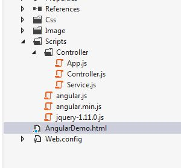
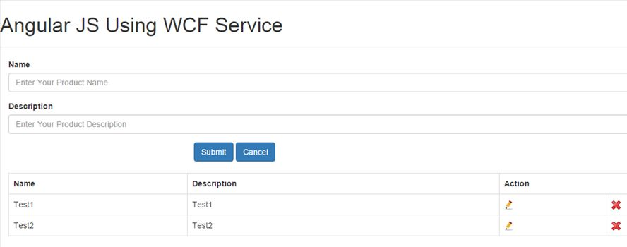

# Call Wcf Service in AngularJS - Part 2
## Requires
- 
## License
- MIT
## Technologies
- WCF
- jQuery
- Javascript
- AngularJS
## Topics
- Call WCF Service in AngularJs
## Updated
- 01/26/2016
## Description

<h1>I have used the following Languages in this article:</h1>
<ul>
<li style="outline:none 0px">AngularJS </li></ul>
<ul>
<li>Wcf Service </li></ul>
<ul>
<li style="outline:none 0px">jQuery </li></ul>
<h3>Here's the link for the previous part of this series :
<a title="Call WCF Service Using jQuery - Part 1" href="https://code.msdn.microsoft.com/Call-WCF-Service-Using-5cb8ea71" target="_blank">How to call WCF Service Using jQuery - Part 1</a> .</h3>
<h1>This image contains my solution explorer.</h1>

<em></em>

&nbsp;

<strong>AngularDemo.html file</strong>

<ul>
<li>The <strong>ng-app </strong>is an application name in AngularJs which is unique in project.
</li></ul>
<ul>
<li>The <strong>ng-app</strong> directive defines an AngularJS application.
</li></ul>

HTML

Edit|Remove

html
<pre class="hidden">&lt;html xmlns=&quot;http://www.w3.org/1999/xhtml&quot; ng-app=&quot;AngularApp&quot;&gt;  </pre>

<pre class="js">&lt;html&nbsp;xmlns=&quot;http://www.w3.org/1999/xhtml&quot;&nbsp;ng-app=&quot;AngularApp&quot;&gt;&nbsp;&nbsp;</pre>

&nbsp;

&nbsp;

<strong>App.js file&nbsp;</strong>&nbsp;

<ul>
<li>The module is a container for the different parts of an application.
</li></ul>
<ul>
<li>The module is a container for the application controllers.
</li></ul>
<ul>
<li>Controllers always belong to a module. </li></ul>

&nbsp;Here we can integrate angular project name in app.js.

JavaScript

Edit|Remove

js
<pre class="hidden">var app = angular.module('AngularApp', []);   </pre>

<pre class="js">var&nbsp;app&nbsp;=&nbsp;angular.module('AngularApp',&nbsp;[]);&nbsp;&nbsp;&nbsp;</pre>

&nbsp;

<strong>AngularDemo.html file</strong>

&nbsp;

<ul>
<li><strong>ng-controller&nbsp;</strong>&nbsp;is a specific controller for my project which I define in my body tag.
</li></ul>

&nbsp;

<em>

HTML

Edit|Remove

html
<pre class="hidden">&lt;body ng-controller=&quot;AngularController&quot;&gt;</pre>

<pre class="js">&lt;body&nbsp;ng-controller=&quot;AngularController&quot;&gt;</pre>

</em>

<em></em>

<strong>Controller.js</strong>&nbsp;

<ul>
<li>&nbsp;Here &nbsp;I used controller as an intermediate between service.js and app.js. 
 
</li><li>&nbsp;The following GET method is used for getting all the records from service.
</li></ul>

&nbsp;

JavaScript

Edit|Remove

js
<pre class="hidden">    app.controller('AngularController', ['$scope', '$http', 'AngularService', function ($scope, $http, AngularService) {    
        
        $scope.formdata = {};    
        
        //load data    
        AngularService.get().success(function (response) {    
            $scope.Products = JSON.parse(response.d);    
        });  </pre>

<pre class="js">&nbsp;&nbsp;&nbsp;&nbsp;app.controller('AngularController',&nbsp;['$scope',&nbsp;'$http',&nbsp;'AngularService',&nbsp;function&nbsp;($scope,&nbsp;$http,&nbsp;AngularService)&nbsp;{&nbsp;&nbsp;&nbsp;&nbsp;&nbsp;
&nbsp;&nbsp;&nbsp;&nbsp;&nbsp;&nbsp;&nbsp;&nbsp;&nbsp;
&nbsp;&nbsp;&nbsp;&nbsp;&nbsp;&nbsp;&nbsp;&nbsp;$scope.formdata&nbsp;=&nbsp;{};&nbsp;&nbsp;&nbsp;&nbsp;&nbsp;
&nbsp;&nbsp;&nbsp;&nbsp;&nbsp;&nbsp;&nbsp;&nbsp;&nbsp;
&nbsp;&nbsp;&nbsp;&nbsp;&nbsp;&nbsp;&nbsp;&nbsp;//load&nbsp;data&nbsp;&nbsp;&nbsp;&nbsp;&nbsp;
&nbsp;&nbsp;&nbsp;&nbsp;&nbsp;&nbsp;&nbsp;&nbsp;AngularService.get().success(function&nbsp;(response)&nbsp;{&nbsp;&nbsp;&nbsp;&nbsp;&nbsp;
&nbsp;&nbsp;&nbsp;&nbsp;&nbsp;&nbsp;&nbsp;&nbsp;&nbsp;&nbsp;&nbsp;&nbsp;$scope.Products&nbsp;=&nbsp;JSON.parse(response.d);&nbsp;&nbsp;&nbsp;&nbsp;&nbsp;
&nbsp;&nbsp;&nbsp;&nbsp;&nbsp;&nbsp;&nbsp;&nbsp;});&nbsp;&nbsp;</pre>

&nbsp;

<strong>Service.js</strong>&nbsp;

<ul>
<li>&nbsp;Below i declared get service for fetching records from service. 
 
</li><li>&nbsp;WCF Service URL is taken from my previous
<a href="https://code.msdn.microsoft.com/Call-WCF-Service-Using-5cb8ea71" target="_blank">
article</a>. 
 
</li><li>&nbsp;So you can download my service from there and used here.&nbsp;
</li></ul>
<ul>
 
</ul>
<ul>

JavaScript

Edit|Remove

js
<pre class="hidden">app.factory('AngularService', ['$http', function ($http) {    
    return {    
        //load data service    
        get: function () {    
            return $http({    
                method: 'POST',    
                headers: {    
                    'Content-Type': 'application/json; charset=utf-8'    
                },    
                url: 'http://kunalpatel.tk/ProductService.svc/LoadAllProductDetail',    
                data: {}    
            });    
        }    
  };    
}]); </pre>

<pre class="js">app.factory('AngularService',&nbsp;['$http',&nbsp;function&nbsp;($http)&nbsp;{&nbsp;&nbsp;&nbsp;&nbsp;&nbsp;
&nbsp;&nbsp;&nbsp;&nbsp;return&nbsp;{&nbsp;&nbsp;&nbsp;&nbsp;&nbsp;
&nbsp;&nbsp;&nbsp;&nbsp;&nbsp;&nbsp;&nbsp;&nbsp;//load&nbsp;data&nbsp;service&nbsp;&nbsp;&nbsp;&nbsp;&nbsp;
&nbsp;&nbsp;&nbsp;&nbsp;&nbsp;&nbsp;&nbsp;&nbsp;get:&nbsp;function&nbsp;()&nbsp;{&nbsp;&nbsp;&nbsp;&nbsp;&nbsp;
&nbsp;&nbsp;&nbsp;&nbsp;&nbsp;&nbsp;&nbsp;&nbsp;&nbsp;&nbsp;&nbsp;&nbsp;return&nbsp;$http({&nbsp;&nbsp;&nbsp;&nbsp;&nbsp;
&nbsp;&nbsp;&nbsp;&nbsp;&nbsp;&nbsp;&nbsp;&nbsp;&nbsp;&nbsp;&nbsp;&nbsp;&nbsp;&nbsp;&nbsp;&nbsp;method:&nbsp;'POST',&nbsp;&nbsp;&nbsp;&nbsp;&nbsp;
&nbsp;&nbsp;&nbsp;&nbsp;&nbsp;&nbsp;&nbsp;&nbsp;&nbsp;&nbsp;&nbsp;&nbsp;&nbsp;&nbsp;&nbsp;&nbsp;headers:&nbsp;{&nbsp;&nbsp;&nbsp;&nbsp;&nbsp;
&nbsp;&nbsp;&nbsp;&nbsp;&nbsp;&nbsp;&nbsp;&nbsp;&nbsp;&nbsp;&nbsp;&nbsp;&nbsp;&nbsp;&nbsp;&nbsp;&nbsp;&nbsp;&nbsp;&nbsp;'Content-Type':&nbsp;'application/json;&nbsp;charset=utf-8'&nbsp;&nbsp;&nbsp;&nbsp;&nbsp;
&nbsp;&nbsp;&nbsp;&nbsp;&nbsp;&nbsp;&nbsp;&nbsp;&nbsp;&nbsp;&nbsp;&nbsp;&nbsp;&nbsp;&nbsp;&nbsp;},&nbsp;&nbsp;&nbsp;&nbsp;&nbsp;
&nbsp;&nbsp;&nbsp;&nbsp;&nbsp;&nbsp;&nbsp;&nbsp;&nbsp;&nbsp;&nbsp;&nbsp;&nbsp;&nbsp;&nbsp;&nbsp;url:&nbsp;'http://kunalpatel.tk/ProductService.svc/LoadAllProductDetail',&nbsp;&nbsp;&nbsp;&nbsp;&nbsp;
&nbsp;&nbsp;&nbsp;&nbsp;&nbsp;&nbsp;&nbsp;&nbsp;&nbsp;&nbsp;&nbsp;&nbsp;&nbsp;&nbsp;&nbsp;&nbsp;data:&nbsp;{}&nbsp;&nbsp;&nbsp;&nbsp;&nbsp;
&nbsp;&nbsp;&nbsp;&nbsp;&nbsp;&nbsp;&nbsp;&nbsp;&nbsp;&nbsp;&nbsp;&nbsp;});&nbsp;&nbsp;&nbsp;&nbsp;&nbsp;
&nbsp;&nbsp;&nbsp;&nbsp;&nbsp;&nbsp;&nbsp;&nbsp;}&nbsp;&nbsp;&nbsp;&nbsp;&nbsp;
&nbsp;&nbsp;};&nbsp;&nbsp;&nbsp;&nbsp;&nbsp;
}]);&nbsp;</pre>

&nbsp;

</ul>

<strong>&nbsp;<strong>AngularDemo.html file</strong></strong>

<ul>
<li><strong>&nbsp;</strong><strong>ng-repeat </strong>
is a working like for, foreach loop in angular </li></ul>
<ul>
<li>&nbsp;<strong>ng-click </strong>is like onclick event in javascript.
</li></ul>
<ul>
<li>&nbsp;<strong>{{ &nbsp;}} &nbsp;</strong>&nbsp;is a syntax for displaying data.
</li></ul>

&nbsp;

HTML

Edit|Remove

html
<pre class="hidden">&lt;table class='table table-bordered'&gt;  
    &lt;tbody&gt;  
        &lt;tr&gt;  
            &lt;th&gt;Name&lt;/th&gt;  
            &lt;th&gt;Description&lt;/th&gt;  
            &lt;th colspan=&quot;2&quot;&gt;Action&lt;/th&gt;  
        &lt;/tr&gt;  
        &lt;tr ng-repeat=&quot;Product in Products&quot;&gt;  
            &lt;td&gt;{{ Product.ProductName}}&lt;/td&gt;  
            &lt;td&gt;{{ Product.ProductDescription}}&lt;/td&gt;  
            &lt;td&gt;&lt;span&gt;&lt;a href=&quot;javascript:void(0);&quot; ng-click=&quot;edit(Product);&quot;&gt;    
                       &lt;img width=&quot;16&quot; height=&quot;16&quot; alt=&quot;Close&quot; src=&quot;Image/Edit.jpg&quot; /&gt;&lt;/a&gt;&lt;/span&gt;&lt;/td&gt;  
            &lt;td&gt;&lt;span&gt;&lt;a href=&quot;javascript:void(0);&quot; ng-click=&quot;delete(Product.Id);&quot;&gt;    
                       &lt;img width=&quot;16&quot; height=&quot;16&quot; alt=&quot;Close&quot; src=&quot;Image/close.png&quot; /&gt;&lt;/a&gt;&lt;/span&gt;&lt;/td&gt;  
        &lt;/tr&gt;  
    &lt;/tbody&gt;  
&lt;/table&gt; </pre>

<pre class="js">&lt;table&nbsp;class='table&nbsp;table-bordered'&gt;&nbsp;&nbsp;&nbsp;
&nbsp;&nbsp;&nbsp;&nbsp;&lt;tbody&gt;&nbsp;&nbsp;&nbsp;
&nbsp;&nbsp;&nbsp;&nbsp;&nbsp;&nbsp;&nbsp;&nbsp;&lt;tr&gt;&nbsp;&nbsp;&nbsp;
&nbsp;&nbsp;&nbsp;&nbsp;&nbsp;&nbsp;&nbsp;&nbsp;&nbsp;&nbsp;&nbsp;&nbsp;&lt;th&gt;Name&lt;/th&gt;&nbsp;&nbsp;&nbsp;
&nbsp;&nbsp;&nbsp;&nbsp;&nbsp;&nbsp;&nbsp;&nbsp;&nbsp;&nbsp;&nbsp;&nbsp;&lt;th&gt;Description&lt;/th&gt;&nbsp;&nbsp;&nbsp;
&nbsp;&nbsp;&nbsp;&nbsp;&nbsp;&nbsp;&nbsp;&nbsp;&nbsp;&nbsp;&nbsp;&nbsp;&lt;th&nbsp;colspan=&quot;2&quot;&gt;Action&lt;/th&gt;&nbsp;&nbsp;&nbsp;
&nbsp;&nbsp;&nbsp;&nbsp;&nbsp;&nbsp;&nbsp;&nbsp;&lt;/tr&gt;&nbsp;&nbsp;&nbsp;
&nbsp;&nbsp;&nbsp;&nbsp;&nbsp;&nbsp;&nbsp;&nbsp;&lt;tr&nbsp;ng-repeat=&quot;Product&nbsp;in&nbsp;Products&quot;&gt;&nbsp;&nbsp;&nbsp;
&nbsp;&nbsp;&nbsp;&nbsp;&nbsp;&nbsp;&nbsp;&nbsp;&nbsp;&nbsp;&nbsp;&nbsp;&lt;td&gt;{{&nbsp;Product.ProductName}}&lt;/td&gt;&nbsp;&nbsp;&nbsp;
&nbsp;&nbsp;&nbsp;&nbsp;&nbsp;&nbsp;&nbsp;&nbsp;&nbsp;&nbsp;&nbsp;&nbsp;&lt;td&gt;{{&nbsp;Product.ProductDescription}}&lt;/td&gt;&nbsp;&nbsp;&nbsp;
&nbsp;&nbsp;&nbsp;&nbsp;&nbsp;&nbsp;&nbsp;&nbsp;&nbsp;&nbsp;&nbsp;&nbsp;&lt;td&gt;&lt;span&gt;&lt;a&nbsp;href=&quot;javascript:void(0);&quot;&nbsp;ng-click=&quot;edit(Product);&quot;&gt;&nbsp;&nbsp;&nbsp;&nbsp;&nbsp;
&nbsp;&nbsp;&nbsp;&nbsp;&nbsp;&nbsp;&nbsp;&nbsp;&nbsp;&nbsp;&nbsp;&nbsp;&nbsp;&nbsp;&nbsp;&nbsp;&nbsp;&nbsp;&nbsp;&nbsp;&nbsp;&nbsp;&nbsp;&lt;img&nbsp;width=&quot;16&quot;&nbsp;height=&quot;16&quot;&nbsp;alt=&quot;Close&quot;&nbsp;src=&quot;Image/Edit.jpg&quot;&nbsp;/&gt;&lt;/a&gt;&lt;/span&gt;&lt;/td&gt;&nbsp;&nbsp;&nbsp;
&nbsp;&nbsp;&nbsp;&nbsp;&nbsp;&nbsp;&nbsp;&nbsp;&nbsp;&nbsp;&nbsp;&nbsp;&lt;td&gt;&lt;span&gt;&lt;a&nbsp;href=&quot;javascript:void(0);&quot;&nbsp;ng-click=&quot;delete(Product.Id);&quot;&gt;&nbsp;&nbsp;&nbsp;&nbsp;&nbsp;
&nbsp;&nbsp;&nbsp;&nbsp;&nbsp;&nbsp;&nbsp;&nbsp;&nbsp;&nbsp;&nbsp;&nbsp;&nbsp;&nbsp;&nbsp;&nbsp;&nbsp;&nbsp;&nbsp;&nbsp;&nbsp;&nbsp;&nbsp;&lt;img&nbsp;width=&quot;16&quot;&nbsp;height=&quot;16&quot;&nbsp;alt=&quot;Close&quot;&nbsp;src=&quot;Image/close.png&quot;&nbsp;/&gt;&lt;/a&gt;&lt;/span&gt;&lt;/td&gt;&nbsp;&nbsp;&nbsp;
&nbsp;&nbsp;&nbsp;&nbsp;&nbsp;&nbsp;&nbsp;&nbsp;&lt;/tr&gt;&nbsp;&nbsp;&nbsp;
&nbsp;&nbsp;&nbsp;&nbsp;&lt;/tbody&gt;&nbsp;&nbsp;&nbsp;
&lt;/table&gt;&nbsp;</pre>

&nbsp;

<h1>Download Source Code&nbsp; :&nbsp; 
<a id="147792" href="/site/view/file/147792/1/Call_WcfService_AngularJs.rar">Call_WcfService_AngularJs.rar</a></h1>
<h1>Test Output Here : 
<a title="Call Wcf Service in Angularjs" href="http://kunalpatel.tk/AngularDemo.html" target="_blank">http://kunalpatel.tk</a></h1>
<h1>Output Image :</h1>

&nbsp;

&nbsp;

