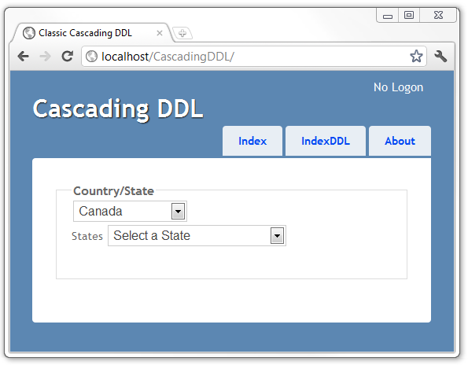
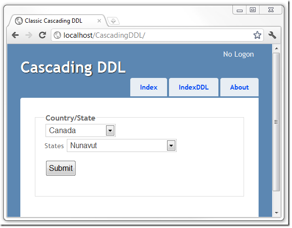

# Cascading DropDownList in ASP.Net MVC
## Requires
- Visual Studio 2010
## License
- Apache License, Version 2.0
## Technologies
- ASP.NET MVC
- jQuery
- ASP.NET MVC 3
- ASP.NET MVC 4
## Topics
- User Interface
- Web Services
## Updated
- 01/09/2012
## Description

<h1>Introduction</h1>

This sample shows&nbsp;how to implement cascading drop down lists in ASP.Net MVC.&nbsp; The user is presented with a list of countries. Once a country is selected, a new drop down list is displayed with the states in the selected country.

&nbsp;

After selecting the Country, the State Drop Down List Box appears, populated with the Sates from the country you selected.

Selecting a State displays the Submit Button.

Submitting your selection shows the Country and State you selected.

If JavaScrip is disable, You get a message <strong>This site requires JavaScript</strong>.

That message is delivered with the new <a href="http://dev.w3.org/html5/spec-author-view/the-noscript-element.html">
HTML5&nbsp;  
&lt;noscript&gt; element</a> in the <em>Views\Shared\_Layout.cshtml</em>  
file.

<pre class="code">    &lt;noscript&gt;
        &lt;div&gt;
            &lt;h2&gt;This site requires JavaScript&lt;/h2&gt;
        &lt;/div&gt;
    &lt;/noscript&gt;
</pre>

I&rsquo;ve modified the <em>Site.css</em> file and set the main ID to not  
display.

<pre class="code">#main {
    display: none;
    padding: 30px 30px 15px 30px;
 }
Browsers that have JavaScript enabled run <em>Scripts\myReady.js</em>, which shows the DOM element with ID main.</pre>
<pre class="code">$(function () {
    $('#main').show();  
});</pre>
<pre class="code">
The <strong>IndexDDL</strong> action method creates a <a href="http://msdn.microsoft.com/en-us/library/system.web.mvc.selectlist.aspx">SelectList</a>  of countries, stores it in the <a href="http://rachelappel.com/when-to-use-viewbag-viewdata-or-tempdata-in-asp.net-mvc-3-applications">ViewBag</a>  and passes it to the <strong>IndexDDL</strong> view.

<pre class="code">public SelectList GetCountrySelectList() {

    var countries = Country.GetCountries();
    return new SelectList(countries.ToArray(),
                        &quot;Code&quot;,
                        &quot;Name&quot;);

}

public ActionResult IndexDDL() {

    ViewBag.Country = GetCountrySelectList();
    return View();
}</pre>
 

The <strong>IndexDDL</strong> view is shown below.

 &lt;!-- .style1 { 	background-color: #ffffff; } .style2 { 	background-color: #ffff00; } --&gt; 
<pre class="code">@{
    ViewBag.Title = &quot;Classic Cascading DDL&quot;;
}

@using (Html.BeginForm(&quot;IndexDDL&quot;, &quot;Home&quot;, FormMethod.Post, 
    new { id = &quot;CountryStateFormID&quot;, 
          data_stateListAction = @Url.Action(&quot;StateList&quot;) })) {
    &lt;fieldset&gt;
        &lt;legend&gt;Country/State&lt;/legend&gt;
        @Html.DropDownList(&quot;Countries&quot;, ViewBag.Country as SelectList,
            &quot;Select a Country&quot;, new { id = &quot;CountriesID&quot; })
        &lt;div id=&quot;StatesDivID&quot; &gt;
            &lt;label for=&quot;States&quot;&gt;States&lt;/label&gt;
            &lt;select id=&quot;StatesID&quot;  name=&quot;States&quot;&gt;&lt;/select&gt;
        &lt;/div&gt;
        &lt;p&gt;
            &lt;input type=&quot;submit&quot; value=&quot;Submit&quot; id=&quot;SubmitID&quot; /&gt;
        &lt;/p&gt;
    &lt;/fieldset&gt;
}

&lt;script src=&quot;@Url.Content(&quot;~/Scripts/countryState.js&quot;)&quot;&gt;&lt;/script&gt;
</pre>
 

The Countries DropDownList has an ID <strong>CountriesID</strong> (shown in  yellow highlight above) which enable the <em>Scripts/countryState.js</em> script  to hook up changes in the country selection (yellow highlight below). The  <em>Scripts/countryState.js</em> file is shown below.

</pre>

JavaScript

Edit|Remove

js
<pre class="hidden">$(function () {

    $('#StatesDivID').hide();
    $('#SubmitID').hide();

    $('#CountriesID').change(function () {
        var URL = $('#CountryStateFormID').data('stateListAction');
        $.getJSON(URL &#43; '/' &#43; $('#CountriesID').val(), function (data) {
            var items = '&lt;option&gt;Select a State&lt;/option&gt;';
            $.each(data, function (i, state) {
                items &#43;= &quot;&lt;option value='&quot; &#43; state.Value &#43; &quot;'&gt;&quot; &#43; state.Text &#43; &quot;&lt;/option&gt;&quot;;
                // state.Value cannot contain ' character. We are OK because state.Value = cnt&#43;&#43;;
            });
            $('#StatesID').html(items);
            $('#StatesDivID').show();

        });
    });

    $('#StatesID').change(function () {
        $('#SubmitID').show();
    });
});</pre>

<pre class="js">$(function&nbsp;()&nbsp;{&nbsp;
&nbsp;
&nbsp;&nbsp;&nbsp;&nbsp;$('#StatesDivID').hide();&nbsp;
&nbsp;&nbsp;&nbsp;&nbsp;$('#SubmitID').hide();&nbsp;
&nbsp;
&nbsp;&nbsp;&nbsp;&nbsp;$('#CountriesID').change(function&nbsp;()&nbsp;{&nbsp;
&nbsp;&nbsp;&nbsp;&nbsp;&nbsp;&nbsp;&nbsp;&nbsp;var&nbsp;URL&nbsp;=&nbsp;$('#CountryStateFormID').data('stateListAction');&nbsp;
&nbsp;&nbsp;&nbsp;&nbsp;&nbsp;&nbsp;&nbsp;&nbsp;$.getJSON(URL&nbsp;&#43;&nbsp;'/'&nbsp;&#43;&nbsp;$('#CountriesID').val(),&nbsp;function&nbsp;(data)&nbsp;{&nbsp;
&nbsp;&nbsp;&nbsp;&nbsp;&nbsp;&nbsp;&nbsp;&nbsp;&nbsp;&nbsp;&nbsp;&nbsp;var&nbsp;items&nbsp;=&nbsp;'&lt;option&gt;Select&nbsp;a&nbsp;State&lt;/option&gt;';&nbsp;
&nbsp;&nbsp;&nbsp;&nbsp;&nbsp;&nbsp;&nbsp;&nbsp;&nbsp;&nbsp;&nbsp;&nbsp;$.each(data,&nbsp;function&nbsp;(i,&nbsp;state)&nbsp;{&nbsp;
&nbsp;&nbsp;&nbsp;&nbsp;&nbsp;&nbsp;&nbsp;&nbsp;&nbsp;&nbsp;&nbsp;&nbsp;&nbsp;&nbsp;&nbsp;&nbsp;items&nbsp;&#43;=&nbsp;&quot;&lt;option&nbsp;value='&quot;&nbsp;&#43;&nbsp;state.Value&nbsp;&#43;&nbsp;&quot;'&gt;&quot;&nbsp;&#43;&nbsp;state.Text&nbsp;&#43;&nbsp;&quot;&lt;/option&gt;&quot;;&nbsp;
&nbsp;&nbsp;&nbsp;&nbsp;&nbsp;&nbsp;&nbsp;&nbsp;&nbsp;&nbsp;&nbsp;&nbsp;&nbsp;&nbsp;&nbsp;&nbsp;//&nbsp;state.Value&nbsp;cannot&nbsp;contain&nbsp;'&nbsp;character.&nbsp;We&nbsp;are&nbsp;OK&nbsp;because&nbsp;state.Value&nbsp;=&nbsp;cnt&#43;&#43;;&nbsp;
&nbsp;&nbsp;&nbsp;&nbsp;&nbsp;&nbsp;&nbsp;&nbsp;&nbsp;&nbsp;&nbsp;&nbsp;});&nbsp;
&nbsp;&nbsp;&nbsp;&nbsp;&nbsp;&nbsp;&nbsp;&nbsp;&nbsp;&nbsp;&nbsp;&nbsp;$('#StatesID').html(items);&nbsp;
&nbsp;&nbsp;&nbsp;&nbsp;&nbsp;&nbsp;&nbsp;&nbsp;&nbsp;&nbsp;&nbsp;&nbsp;$('#StatesDivID').show();&nbsp;
&nbsp;
&nbsp;&nbsp;&nbsp;&nbsp;&nbsp;&nbsp;&nbsp;&nbsp;});&nbsp;
&nbsp;&nbsp;&nbsp;&nbsp;});&nbsp;
&nbsp;
&nbsp;&nbsp;&nbsp;&nbsp;$('#StatesID').change(function&nbsp;()&nbsp;{&nbsp;
&nbsp;&nbsp;&nbsp;&nbsp;&nbsp;&nbsp;&nbsp;&nbsp;$('#SubmitID').show();&nbsp;
&nbsp;&nbsp;&nbsp;&nbsp;});&nbsp;
});</pre>

